<!--
CO_OP_TRANSLATOR_METADATA:
{
  "original_hash": "105c2ddbb77bc38f7e9df009e1b06e45",
  "translation_date": "2025-07-13T15:33:26+00:00",
  "source_file": "00-Introduction/README.md",
  "language_code": "th"
}
-->
# บทนำสู่ Model Context Protocol (MCP): ทำไมจึงสำคัญสำหรับแอปพลิเคชัน AI ที่ขยายตัวได้

แอปพลิเคชัน Generative AI เป็นก้าวสำคัญที่ช่วยให้ผู้ใช้สามารถโต้ตอบกับแอปผ่านคำสั่งภาษาธรรมชาติได้อย่างง่ายดาย อย่างไรก็ตาม เมื่อมีการลงทุนเวลาและทรัพยากรมากขึ้นกับแอปเหล่านี้ คุณต้องมั่นใจว่าสามารถผสานรวมฟังก์ชันและทรัพยากรต่างๆ ได้อย่างง่ายดาย เพื่อให้ขยายระบบได้ง่าย แอปของคุณรองรับการใช้งานหลายโมเดล และจัดการกับความซับซ้อนของโมเดลต่างๆ ได้ กล่าวโดยสรุป การสร้างแอป Gen AI เริ่มต้นง่าย แต่เมื่อระบบเติบโตและซับซ้อนขึ้น คุณจำเป็นต้องกำหนดสถาปัตยกรรมและอาจต้องพึ่งพามาตรฐานเพื่อให้แอปของคุณถูกสร้างขึ้นอย่างสม่ำเสมอ นี่คือจุดที่ MCP เข้ามาจัดระเบียบและให้มาตรฐาน

---

## **🔍 Model Context Protocol (MCP) คืออะไร?**

**Model Context Protocol (MCP)** คือ **อินเทอร์เฟซเปิดและมีมาตรฐาน** ที่ช่วยให้ Large Language Models (LLMs) สามารถเชื่อมต่อกับเครื่องมือภายนอก, API และแหล่งข้อมูลต่างๆ ได้อย่างราบรื่น มันให้สถาปัตยกรรมที่สม่ำเสมอเพื่อเพิ่มขีดความสามารถของโมเดล AI ให้เกินกว่าข้อมูลที่ใช้ฝึกสอน ช่วยให้ระบบ AI ฉลาดขึ้น ขยายตัวได้ และตอบสนองได้ดีขึ้น

---

## **🎯 ทำไมการมีมาตรฐานใน AI จึงสำคัญ**

เมื่อแอปพลิเคชัน generative AI ซับซ้อนขึ้น การนำมาตรฐานมาใช้เพื่อให้มั่นใจในเรื่อง **การขยายตัว, การต่อยอด**, และ **การดูแลรักษา** เป็นสิ่งจำเป็น MCP ตอบโจทย์นี้โดย:

- รวมการเชื่อมต่อระหว่างโมเดลกับเครื่องมือให้เป็นหนึ่งเดียว
- ลดการแก้ปัญหาแบบเฉพาะเจาะจงที่เปราะบาง
- อนุญาตให้โมเดลหลายตัวอยู่ร่วมกันในระบบเดียวได้

---

## **📚 วัตถุประสงค์การเรียนรู้**

เมื่ออ่านบทความนี้จบ คุณจะสามารถ:

- อธิบายความหมายของ **Model Context Protocol (MCP)** และกรณีการใช้งาน
- เข้าใจวิธีที่ MCP มาตรฐานการสื่อสารระหว่างโมเดลกับเครื่องมือ
- ระบุส่วนประกอบหลักของสถาปัตยกรรม MCP
- สำรวจการใช้งานจริงของ MCP ในองค์กรและการพัฒนา

---

## **💡 ทำไม Model Context Protocol (MCP) ถึงเปลี่ยนเกม**

### **🔗 MCP แก้ปัญหาการแยกส่วนในการโต้ตอบ AI**

ก่อน MCP การเชื่อมต่อโมเดลกับเครื่องมือต้องใช้:

- โค้ดเฉพาะสำหรับแต่ละคู่เครื่องมือ-โมเดล
- API ที่ไม่มีมาตรฐานสำหรับแต่ละผู้ให้บริการ
- การหยุดชะงักบ่อยครั้งเมื่อมีการอัปเดต
- ขยายตัวได้ยากเมื่อมีเครื่องมือเพิ่มขึ้น

### **✅ ประโยชน์ของการมีมาตรฐาน MCP**

| **ประโยชน์**             | **คำอธิบาย**                                                                 |
|--------------------------|-------------------------------------------------------------------------------|
| การทำงานร่วมกันได้ดี     | LLMs ทำงานร่วมกับเครื่องมือจากผู้ให้บริการต่างๆ ได้อย่างราบรื่น             |
| ความสม่ำเสมอ            | พฤติกรรมที่เหมือนกันในทุกแพลตฟอร์มและเครื่องมือ                           |
| การนำกลับมาใช้ใหม่       | เครื่องมือที่สร้างขึ้นครั้งเดียวสามารถใช้ในโปรเจกต์และระบบต่างๆ ได้          |
| เร่งการพัฒนา             | ลดเวลาพัฒนาโดยใช้อินเทอร์เฟซมาตรฐานที่เสียบใช้งานได้ทันที                   |

---

## **🧱 ภาพรวมสถาปัตยกรรม MCP ระดับสูง**

MCP ใช้ **โมเดลไคลเอนต์-เซิร์ฟเวอร์** โดย:

- **MCP Hosts** เป็นที่รันโมเดล AI
- **MCP Clients** เป็นผู้เริ่มต้นคำขอ
- **MCP Servers** ให้บริการบริบท, เครื่องมือ และความสามารถต่างๆ

### **ส่วนประกอบหลัก:**

- **Resources** – ข้อมูลคงที่หรือข้อมูลแบบไดนามิกสำหรับโมเดล  
- **Prompts** – เวิร์กโฟลว์ที่กำหนดไว้ล่วงหน้าสำหรับการสร้างคำตอบที่มีแนวทาง  
- **Tools** – ฟังก์ชันที่สามารถรันได้ เช่น การค้นหา, การคำนวณ  
- **Sampling** – พฤติกรรมแบบตัวแทนผ่านการโต้ตอบซ้ำๆ

---

## วิธีการทำงานของ MCP Servers

MCP servers ทำงานดังนี้:

- **ลำดับคำขอ**:  
    1. MCP Client ส่งคำขอไปยังโมเดล AI ที่รันใน MCP Host  
    2. โมเดล AI ระบุเมื่อจำเป็นต้องใช้เครื่องมือหรือข้อมูลภายนอก  
    3. โมเดลสื่อสารกับ MCP Server ผ่านโปรโตคอลมาตรฐาน

- **ฟังก์ชันของ MCP Server**:  
    - Tool Registry: เก็บรายการเครื่องมือและความสามารถที่มี  
    - Authentication: ตรวจสอบสิทธิ์การเข้าถึงเครื่องมือ  
    - Request Handler: ประมวลผลคำขอเครื่องมือจากโมเดล  
    - Response Formatter: จัดรูปแบบผลลัพธ์จากเครื่องมือให้อยู่ในรูปแบบที่โมเดลเข้าใจได้

- **การรันเครื่องมือ**:  
    - เซิร์ฟเวอร์ส่งคำขอไปยังเครื่องมือภายนอกที่เหมาะสม  
    - เครื่องมือทำงานเฉพาะทาง (ค้นหา, คำนวณ, คิวรีฐานข้อมูล ฯลฯ)  
    - ผลลัพธ์ถูกส่งกลับไปยังโมเดลในรูปแบบที่สม่ำเสมอ

- **การตอบกลับสมบูรณ์**:  
    - โมเดล AI นำผลลัพธ์จากเครื่องมือมารวมในคำตอบ  
    - คำตอบสุดท้ายถูกส่งกลับไปยังแอปพลิเคชันไคลเอนต์

## 👨‍💻 วิธีสร้าง MCP Server (พร้อมตัวอย่าง)

MCP servers ช่วยให้คุณขยายความสามารถของ LLM โดยการให้ข้อมูลและฟังก์ชันการทำงาน

พร้อมลองใช้งานหรือยัง? นี่คือตัวอย่างการสร้าง MCP server ง่ายๆ ในหลายภาษา:

- **ตัวอย่าง Python**: https://github.com/modelcontextprotocol/python-sdk

- **ตัวอย่าง TypeScript**: https://github.com/modelcontextprotocol/typescript-sdk

- **ตัวอย่าง Java**: https://github.com/modelcontextprotocol/java-sdk

- **ตัวอย่าง C#/.NET**: https://github.com/modelcontextprotocol/csharp-sdk

## 🌍 กรณีใช้งานจริงของ MCP

MCP ช่วยขยายขีดความสามารถของ AI ในหลายแอปพลิเคชัน:

| **แอปพลิเคชัน**           | **คำอธิบาย**                                                                 |
|----------------------------|-------------------------------------------------------------------------------|
| การรวมข้อมูลองค์กร         | เชื่อมต่อ LLMs กับฐานข้อมูล, CRM หรือเครื่องมือภายในองค์กร                   |
| ระบบ AI แบบตัวแทน          | เปิดใช้งานตัวแทนอัตโนมัติที่เข้าถึงเครื่องมือและเวิร์กโฟลว์การตัดสินใจ      |
| แอปพลิเคชันมัลติโมดัล     | รวมเครื่องมือข้อความ, รูปภาพ และเสียงในแอป AI เดียวกัน                      |
| การรวมข้อมูลเรียลไทม์     | นำข้อมูลสดเข้าสู่การโต้ตอบ AI เพื่อผลลัพธ์ที่แม่นยำและทันสมัยกว่า            |

### 🧠 MCP = มาตรฐานสากลสำหรับการโต้ตอบ AI

Model Context Protocol (MCP) ทำหน้าที่เป็นมาตรฐานสากลสำหรับการโต้ตอบ AI เหมือนกับที่ USB-C เป็นมาตรฐานการเชื่อมต่ออุปกรณ์ทางกายภาพ ในโลกของ AI MCP ให้หน้าต่างเชื่อมต่อที่สม่ำเสมอ ช่วยให้โมเดล (ไคลเอนต์) ผสานรวมกับเครื่องมือและผู้ให้บริการข้อมูลภายนอก (เซิร์ฟเวอร์) ได้อย่างราบรื่น ซึ่งช่วยลดความจำเป็นในการใช้โปรโตคอลเฉพาะสำหรับแต่ละ API หรือแหล่งข้อมูล

ภายใต้ MCP เครื่องมือที่รองรับ MCP (เรียกว่า MCP server) จะปฏิบัติตามมาตรฐานเดียวกัน เซิร์ฟเวอร์เหล่านี้สามารถแสดงรายการเครื่องมือหรือการกระทำที่มี และดำเนินการตามคำขอจากตัวแทน AI แพลตฟอร์มตัวแทน AI ที่รองรับ MCP สามารถค้นหาเครื่องมือที่มีจากเซิร์ฟเวอร์และเรียกใช้งานผ่านโปรโตคอลมาตรฐานนี้ได้

### 💡 ช่วยให้เข้าถึงความรู้ได้ง่ายขึ้น

นอกจากการให้เครื่องมือแล้ว MCP ยังช่วยให้เข้าถึงความรู้ได้ด้วย ช่วยให้แอปพลิเคชันสามารถให้บริบทกับ LLMs โดยเชื่อมต่อกับแหล่งข้อมูลต่างๆ เช่น MCP server อาจเป็นตัวแทนของคลังเอกสารบริษัท ช่วยให้ตัวแทนดึงข้อมูลที่เกี่ยวข้องตามคำขอ อีกเซิร์ฟเวอร์หนึ่งอาจจัดการการกระทำเฉพาะ เช่น ส่งอีเมลหรืออัปเดตข้อมูล จากมุมมองของตัวแทน นี่คือเครื่องมือที่ใช้ได้—บางเครื่องมือคืนข้อมูล (บริบทความรู้) ขณะที่บางเครื่องมือทำการกระทำ MCP จัดการทั้งสองอย่างได้อย่างมีประสิทธิภาพ

ตัวแทนที่เชื่อมต่อกับ MCP server จะเรียนรู้ความสามารถและข้อมูลที่เข้าถึงได้ของเซิร์ฟเวอร์โดยอัตโนมัติผ่านรูปแบบมาตรฐาน การมีมาตรฐานนี้ช่วยให้เครื่องมือพร้อมใช้งานแบบไดนามิก เช่น การเพิ่ม MCP server ใหม่ในระบบตัวแทนจะทำให้ฟังก์ชันของเซิร์ฟเวอร์นั้นพร้อมใช้งานทันทีโดยไม่ต้องปรับแต่งคำสั่งของตัวแทนเพิ่มเติม

การผสานรวมที่ราบรื่นนี้สอดคล้องกับโฟลว์ที่แสดงในไดอะแกรม mermaid ซึ่งเซิร์ฟเวอร์ให้ทั้งเครื่องมือและความรู้ เพื่อให้ระบบทำงานร่วมกันได้อย่างไร้รอยต่อ

### 👉 ตัวอย่าง: โซลูชันตัวแทนที่ขยายตัวได้

### 🔄 สถานการณ์ MCP ขั้นสูงกับการผสาน LLM ฝั่งไคลเอนต์

นอกจากสถาปัตยกรรม MCP พื้นฐาน ยังมีสถานการณ์ขั้นสูงที่ทั้งไคลเอนต์และเซิร์ฟเวอร์มี LLM ทำให้เกิดการโต้ตอบที่ซับซ้อนขึ้น:

```mermaid
---
title: Advanced MCP Scenarios with Client-Server LLM Integration
description: A sequence diagram showing the detailed interaction flow between user, client application, client LLM, multiple MCP servers, and server LLM, illustrating tool discovery, user interaction, direct tool calling, and feature negotiation phases
---
sequenceDiagram
    autonumber
    actor User as 👤 User
    participant ClientApp as 🖥️ Client App
    participant ClientLLM as 🧠 Client LLM
    participant Server1 as 🔧 MCP Server 1
    participant Server2 as 📚 MCP Server 2
    participant ServerLLM as 🤖 Server LLM
    
    %% Discovery Phase
    rect rgb(220, 240, 255)
        Note over ClientApp, Server2: TOOL DISCOVERY PHASE
        ClientApp->>+Server1: Request available tools/resources
        Server1-->>-ClientApp: Return tool list (JSON)
        ClientApp->>+Server2: Request available tools/resources
        Server2-->>-ClientApp: Return tool list (JSON)
        Note right of ClientApp: Store combined tool<br/>catalog locally
    end
    
    %% User Interaction
    rect rgb(255, 240, 220)
        Note over User, ClientLLM: USER INTERACTION PHASE
        User->>+ClientApp: Enter natural language prompt
        ClientApp->>+ClientLLM: Forward prompt + tool catalog
        ClientLLM->>-ClientLLM: Analyze prompt & select tools
    end
    
    %% Scenario A: Direct Tool Calling
    alt Direct Tool Calling
        rect rgb(220, 255, 220)
            Note over ClientApp, Server1: SCENARIO A: DIRECT TOOL CALLING
            ClientLLM->>+ClientApp: Request tool execution
            ClientApp->>+Server1: Execute specific tool
            Server1-->>-ClientApp: Return results
            ClientApp->>+ClientLLM: Process results
            ClientLLM-->>-ClientApp: Generate response
            ClientApp-->>-User: Display final answer
        end
    
    %% Scenario B: Feature Negotiation (VS Code style)
    else Feature Negotiation (VS Code style)
        rect rgb(255, 220, 220)
            Note over ClientApp, ServerLLM: SCENARIO B: FEATURE NEGOTIATION
            ClientLLM->>+ClientApp: Identify needed capabilities
            ClientApp->>+Server2: Negotiate features/capabilities
            Server2->>+ServerLLM: Request additional context
            ServerLLM-->>-Server2: Provide context
            Server2-->>-ClientApp: Return available features
            ClientApp->>+Server2: Call negotiated tools
            Server2-->>-ClientApp: Return results
            ClientApp->>+ClientLLM: Process results
            ClientLLM-->>-ClientApp: Generate response
            ClientApp-->>-User: Display final answer
        end
    end
```

## 🔐 ประโยชน์เชิงปฏิบัติของ MCP

นี่คือประโยชน์เชิงปฏิบัติของการใช้ MCP:

- **ข้อมูลสดใหม่**: โมเดลสามารถเข้าถึงข้อมูลที่อัปเดตเกินกว่าข้อมูลฝึกสอน  
- **ขยายความสามารถ**: โมเดลใช้เครื่องมือเฉพาะทางสำหรับงานที่ไม่ได้ฝึกสอน  
- **ลดการสร้างข้อมูลผิดพลาด**: แหล่งข้อมูลภายนอกช่วยยืนยันความถูกต้อง  
- **ความเป็นส่วนตัว**: ข้อมูลที่ละเอียดอ่อนเก็บไว้ในสภาพแวดล้อมที่ปลอดภัย แทนที่จะฝังในคำสั่ง

## 📌 สรุปใจความสำคัญ

ข้อสรุปสำคัญสำหรับการใช้ MCP:

- **MCP** มาตรฐานการโต้ตอบระหว่างโมเดล AI กับเครื่องมือและข้อมูล  
- ส่งเสริม **การขยายตัว, ความสม่ำเสมอ, และการทำงานร่วมกัน**  
- MCP ช่วย **ลดเวลาพัฒนา, เพิ่มความน่าเชื่อถือ, และขยายความสามารถของโมเดล**  
- สถาปัตยกรรมไคลเอนต์-เซิร์ฟเวอร์ช่วยให้แอป AI มีความยืดหยุ่นและขยายตัวได้

## 🧠 แบบฝึกหัด

ลองคิดถึงแอป AI ที่คุณสนใจจะสร้าง

- เครื่องมือหรือข้อมูลภายนอกใดบ้างที่จะช่วยเพิ่มขีดความสามารถ?  
- MCP จะช่วยให้การผสานรวมง่ายขึ้นและน่าเชื่อถือขึ้นได้อย่างไร?

## แหล่งข้อมูลเพิ่มเติม

- [MCP GitHub Repository](https://github.com/modelcontextprotocol)

## ต่อไป

ถัดไป: [บทที่ 1: แนวคิดหลัก](../01-CoreConcepts/README.md)

**ข้อจำกัดความรับผิดชอบ**:  
เอกสารนี้ได้รับการแปลโดยใช้บริการแปลภาษาอัตโนมัติ [Co-op Translator](https://github.com/Azure/co-op-translator) แม้เราจะพยายามให้ความถูกต้องสูงสุด แต่โปรดทราบว่าการแปลอัตโนมัติอาจมีข้อผิดพลาดหรือความไม่ถูกต้อง เอกสารต้นฉบับในภาษาต้นทางถือเป็นแหล่งข้อมูลที่เชื่อถือได้ สำหรับข้อมูลที่สำคัญ ขอแนะนำให้ใช้บริการแปลโดยผู้เชี่ยวชาญมนุษย์ เราไม่รับผิดชอบต่อความเข้าใจผิดหรือการตีความผิดใด ๆ ที่เกิดจากการใช้การแปลนี้