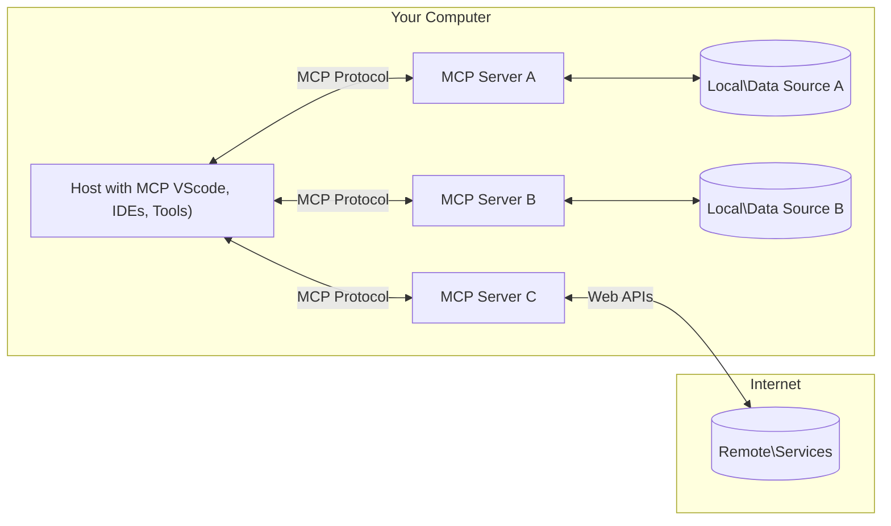

<!--
CO_OP_TRANSLATOR_METADATA:
{
  "original_hash": "355b12a5970c5c9e6db0bee970c751ba",
  "translation_date": "2025-07-04T17:28:11+00:00",
  "source_file": "01-CoreConcepts/README.md",
  "language_code": "th"
}
-->
# 📖 แนวคิดหลักของ MCP: การเชี่ยวชาญ Model Context Protocol สำหรับการผสาน AI

[Model Context Protocol (MCP)](https://github.com/modelcontextprotocol) คือกรอบงานมาตรฐานที่ทรงพลังซึ่งช่วยเพิ่มประสิทธิภาพการสื่อสารระหว่าง Large Language Models (LLMs) กับเครื่องมือ แอปพลิเคชัน และแหล่งข้อมูลภายนอก คู่มือที่ปรับแต่งสำหรับ SEO นี้จะพาคุณไปรู้จักกับแนวคิดหลักของ MCP เพื่อให้คุณเข้าใจสถาปัตยกรรมแบบ client-server ส่วนประกอบสำคัญ กลไกการสื่อสาร และแนวทางปฏิบัติที่ดีที่สุดในการใช้งาน

## ภาพรวม

บทเรียนนี้จะสำรวจสถาปัตยกรรมพื้นฐานและส่วนประกอบที่ประกอบขึ้นเป็นระบบนิเวศของ Model Context Protocol (MCP) คุณจะได้เรียนรู้เกี่ยวกับสถาปัตยกรรม client-server ส่วนประกอบหลัก และกลไกการสื่อสารที่ขับเคลื่อนการโต้ตอบของ MCP

## 👩‍🎓 วัตถุประสงค์การเรียนรู้หลัก

เมื่อจบบทเรียนนี้ คุณจะสามารถ:

- เข้าใจสถาปัตยกรรม client-server ของ MCP
- ระบุบทบาทและความรับผิดชอบของ Hosts, Clients และ Servers
- วิเคราะห์คุณสมบัติหลักที่ทำให้ MCP เป็นชั้นการผสานที่ยืดหยุ่น
- เรียนรู้การไหลของข้อมูลภายในระบบนิเวศ MCP
- ได้รับความเข้าใจเชิงปฏิบัติผ่านตัวอย่างโค้ดใน .NET, Java, Python และ JavaScript

## 🔎 สถาปัตยกรรม MCP: เจาะลึก

ระบบนิเวศ MCP สร้างขึ้นบนโมเดล client-server โครงสร้างแบบโมดูลาร์นี้ช่วยให้แอป AI สามารถโต้ตอบกับเครื่องมือ ฐานข้อมูล API และทรัพยากรบริบทได้อย่างมีประสิทธิภาพ มาดูส่วนประกอบหลักของสถาปัตยกรรมนี้กัน

โดยพื้นฐาน MCP ใช้สถาปัตยกรรม client-server ที่แอปโฮสต์สามารถเชื่อมต่อกับเซิร์ฟเวอร์หลายตัวได้:



- **MCP Hosts**: โปรแกรมอย่าง VSCode, Claude Desktop, IDEs หรือเครื่องมือ AI ที่ต้องการเข้าถึงข้อมูลผ่าน MCP
- **MCP Clients**: โปรโตคอลไคลเอนต์ที่รักษาการเชื่อมต่อแบบ 1:1 กับเซิร์ฟเวอร์
- **MCP Servers**: โปรแกรมน้ำหนักเบาที่เปิดเผยความสามารถเฉพาะผ่าน Model Context Protocol ที่เป็นมาตรฐาน
- **แหล่งข้อมูลภายในเครื่อง**: ไฟล์ ฐานข้อมูล และบริการบนคอมพิวเตอร์ของคุณที่ MCP servers สามารถเข้าถึงได้อย่างปลอดภัย
- **บริการระยะไกล**: ระบบภายนอกที่เข้าถึงผ่านอินเทอร์เน็ตซึ่ง MCP servers สามารถเชื่อมต่อผ่าน API

โปรโตคอล MCP เป็นมาตรฐานที่พัฒนาอย่างต่อเนื่อง คุณสามารถดูอัปเดตล่าสุดได้ที่ [protocol specification](https://modelcontextprotocol.io/specification/2025-06-18/)

### 1. Hosts

ใน Model Context Protocol (MCP) Hosts มีบทบาทสำคัญในฐานะอินเทอร์เฟซหลักที่ผู้ใช้โต้ตอบกับโปรโตคอล Hosts คือแอปพลิเคชันหรือสภาพแวดล้อมที่เริ่มต้นการเชื่อมต่อกับ MCP servers เพื่อเข้าถึงข้อมูล เครื่องมือ และพรอมต์ ตัวอย่างของ Hosts ได้แก่ IDEs อย่าง Visual Studio Code, เครื่องมือ AI อย่าง Claude Desktop หรือเอเจนต์ที่สร้างขึ้นเฉพาะสำหรับงานบางอย่าง

**Hosts** คือแอป LLM ที่เริ่มต้นการเชื่อมต่อ พวกเขา:

- รันหรือโต้ตอบกับโมเดล AI เพื่อสร้างคำตอบ
- เริ่มต้นการเชื่อมต่อกับ MCP servers
- จัดการการไหลของบทสนทนาและอินเทอร์เฟซผู้ใช้
- ควบคุมสิทธิ์และข้อจำกัดด้านความปลอดภัย
- จัดการความยินยอมของผู้ใช้สำหรับการแชร์ข้อมูลและการรันเครื่องมือ

### 2. Clients

Clients เป็นส่วนประกอบสำคัญที่อำนวยความสะดวกในการโต้ตอบระหว่าง Hosts กับ MCP servers Clients ทำหน้าที่เป็นตัวกลาง ช่วยให้ Hosts เข้าถึงและใช้ฟังก์ชันที่ MCP servers มีให้ พวกเขามีบทบาทสำคัญในการรับประกันการสื่อสารที่ราบรื่นและการแลกเปลี่ยนข้อมูลที่มีประสิทธิภาพภายในสถาปัตยกรรม MCP

**Clients** คือคอนเนคเตอร์ภายในแอปโฮสต์ พวกเขา:

- ส่งคำขอไปยังเซิร์ฟเวอร์พร้อมพรอมต์/คำสั่ง
- เจรจาความสามารถกับเซิร์ฟเวอร์
- จัดการคำขอรันเครื่องมือจากโมเดล
- ประมวลผลและแสดงผลลัพธ์ให้ผู้ใช้

### 3. Servers

Servers รับผิดชอบจัดการคำขอจาก MCP clients และให้คำตอบที่เหมาะสม พวกเขาดูแลการดำเนินการต่าง ๆ เช่น การดึงข้อมูล การรันเครื่องมือ และการสร้างพรอมต์ Servers รับประกันว่าการสื่อสารระหว่าง clients กับ Hosts มีประสิทธิภาพและน่าเชื่อถือ รักษาความสมบูรณ์ของกระบวนการโต้ตอบ

**Servers** คือบริการที่ให้บริบทและความสามารถ พวกเขา:

- ลงทะเบียนฟีเจอร์ที่มี (ทรัพยากร, พรอมต์, เครื่องมือ)
- รับและรันคำสั่งเครื่องมือจาก client
- ให้ข้อมูลบริบทเพื่อเสริมคำตอบของโมเดล
- ส่งผลลัพธ์กลับไปยัง client
- รักษาสถานะระหว่างการโต้ตอบเมื่อจำเป็น

ใครก็ได้สามารถพัฒนา Servers เพื่อขยายความสามารถของโมเดลด้วยฟังก์ชันเฉพาะทาง

### 4. ฟีเจอร์ของ Server

Servers ใน Model Context Protocol (MCP) ให้บล็อกพื้นฐานที่ช่วยให้เกิดการโต้ตอบที่หลากหลายระหว่าง clients, hosts และ language models ฟีเจอร์เหล่านี้ออกแบบมาเพื่อเพิ่มขีดความสามารถของ MCP โดยนำเสนอบริบทที่มีโครงสร้าง เครื่องมือ และพรอมต์

MCP servers สามารถให้บริการฟีเจอร์ใด ๆ ต่อไปนี้:

#### 📑 ทรัพยากร

ทรัพยากรใน Model Context Protocol (MCP) ครอบคลุมบริบทและข้อมูลหลายประเภทที่ผู้ใช้หรือโมเดล AI สามารถใช้ได้ เช่น:

- **ข้อมูลบริบท**: ข้อมูลและบริบทที่ผู้ใช้หรือโมเดล AI ใช้ในการตัดสินใจและดำเนินงาน
- **ฐานความรู้และคลังเอกสาร**: คอลเลกชันของข้อมูลที่มีโครงสร้างและไม่มีโครงสร้าง เช่น บทความ คู่มือ และงานวิจัย ที่ให้ข้อมูลเชิงลึกและความรู้
- **ไฟล์และฐานข้อมูลภายในเครื่อง**: ข้อมูลที่เก็บไว้ในอุปกรณ์หรือฐานข้อมูลที่เข้าถึงได้สำหรับการประมวลผลและวิเคราะห์
- **API และเว็บเซอร์วิส**: อินเทอร์เฟซและบริการภายนอกที่ให้ข้อมูลและฟังก์ชันเพิ่มเติม ช่วยให้ผสานรวมกับแหล่งข้อมูลและเครื่องมือออนไลน์ต่าง ๆ

ตัวอย่างทรัพยากรอาจเป็นสคีมาฐานข้อมูลหรือไฟล์ที่สามารถเข้าถึงได้ดังนี้:

```text
file://log.txt
database://schema
```

### 🤖 พรอมต์

พรอมต์ใน Model Context Protocol (MCP) รวมถึงเทมเพลตและรูปแบบการโต้ตอบที่กำหนดไว้ล่วงหน้าเพื่อช่วยให้เวิร์กโฟลว์ของผู้ใช้ราบรื่นและเพิ่มประสิทธิภาพการสื่อสาร เช่น:

- **ข้อความและเวิร์กโฟลว์ที่มีโครงสร้าง**: ข้อความและกระบวนการที่จัดเตรียมไว้ล่วงหน้าเพื่อแนะนำผู้ใช้ผ่านงานและการโต้ตอบเฉพาะ
- **รูปแบบการโต้ตอบที่กำหนดไว้ล่วงหน้า**: ลำดับของการกระทำและการตอบสนองที่เป็นมาตรฐานเพื่อให้การสื่อสารมีความสม่ำเสมอและมีประสิทธิภาพ
- **เทมเพลตบทสนทนาเฉพาะทาง**: เทมเพลตที่ปรับแต่งได้สำหรับบทสนทนาประเภทต่าง ๆ เพื่อให้การโต้ตอบเหมาะสมกับบริบทและเนื้อหา

ตัวอย่างเทมเพลตพรอมต์อาจมีลักษณะดังนี้:

```markdown
Generate a product slogan based on the following {{product}} with the following {{keywords}}
```

#### ⛏️ เครื่องมือ

เครื่องมือใน Model Context Protocol (MCP) คือฟังก์ชันที่โมเดล AI สามารถเรียกใช้เพื่อทำงานเฉพาะ เครื่องมือเหล่านี้ออกแบบมาเพื่อเพิ่มขีดความสามารถของโมเดล AI โดยให้การดำเนินการที่มีโครงสร้างและเชื่อถือได้ ประเด็นสำคัญได้แก่:

- **ฟังก์ชันที่โมเดล AI สามารถรันได้**: เครื่องมือเป็นฟังก์ชันที่สามารถเรียกใช้เพื่อทำงานต่าง ๆ
- **ชื่อและคำอธิบายเฉพาะ**: แต่ละเครื่องมือมีชื่อและคำอธิบายที่ชัดเจนเพื่ออธิบายวัตถุประสงค์และฟังก์ชัน
- **พารามิเตอร์และผลลัพธ์**: เครื่องมือรับพารามิเตอร์เฉพาะและส่งผลลัพธ์ที่มีโครงสร้าง เพื่อให้ผลลัพธ์มีความสม่ำเสมอและคาดเดาได้
- **ฟังก์ชันแยกส่วน**: เครื่องมือทำงานเฉพาะ เช่น การค้นหาเว็บ การคำนวณ และการสืบค้นฐานข้อมูล

ตัวอย่างเครื่องมืออาจมีลักษณะดังนี้:

```typescript
server.tool(
  "GetProducts",
  {
    pageSize: z.string().optional(),
    pageCount: z.string().optional()
  }, () => {
    // return results from API
  }
)
```

## ฟีเจอร์ของ Client

ใน Model Context Protocol (MCP) clients มีฟีเจอร์สำคัญหลายอย่างที่ช่วยเพิ่มประสิทธิภาพและการโต้ตอบภายในโปรโตคอล หนึ่งในฟีเจอร์ที่โดดเด่นคือ Sampling

### 👉 Sampling

- **พฤติกรรมเชิงตัวแทนที่เซิร์ฟเวอร์เริ่มต้น**: Clients ช่วยให้เซิร์ฟเวอร์สามารถเริ่มต้นการกระทำหรือพฤติกรรมเฉพาะได้เอง เพิ่มความสามารถแบบไดนามิกของระบบ
- **การโต้ตอบแบบวนซ้ำกับ LLM**: ฟีเจอร์นี้ช่วยให้เกิดการโต้ตอบแบบวนซ้ำกับโมเดลภาษาใหญ่ (LLMs) เพื่อการประมวลผลที่ซับซ้อนและทำซ้ำได้
- **การร้องขอการเติมเต็มโมเดลเพิ่มเติม**: เซิร์ฟเวอร์สามารถขอผลลัพธ์เพิ่มเติมจากโมเดล เพื่อให้คำตอบครบถ้วนและเหมาะสมกับบริบท

## การไหลของข้อมูลใน MCP

Model Context Protocol (MCP) กำหนดการไหลของข้อมูลที่มีโครงสร้างระหว่าง hosts, clients, servers และ models การเข้าใจการไหลนี้ช่วยให้เห็นภาพว่าคำขอของผู้ใช้ถูกประมวลผลอย่างไร และเครื่องมือหรือข้อมูลภายนอกถูกผสานเข้ากับคำตอบของโมเดลอย่างไร

- **Host เริ่มต้นการเชื่อมต่อ**  
  แอปโฮสต์ (เช่น IDE หรืออินเทอร์เฟซแชท) สร้างการเชื่อมต่อกับ MCP server โดยปกติผ่าน STDIO, WebSocket หรือช่องทางที่รองรับอื่น ๆ

- **การเจรจาความสามารถ**  
  client (ฝังอยู่ในโฮสต์) และ server แลกเปลี่ยนข้อมูลเกี่ยวกับฟีเจอร์ เครื่องมือ ทรัพยากร และเวอร์ชันโปรโตคอลที่รองรับ เพื่อให้ทั้งสองฝ่ายเข้าใจความสามารถที่มีสำหรับเซสชันนั้น

- **คำขอของผู้ใช้**  
  ผู้ใช้โต้ตอบกับโฮสต์ (เช่น ป้อนพรอมต์หรือคำสั่ง) โฮสต์รวบรวมข้อมูลนี้และส่งต่อให้ client ประมวลผล

- **การใช้ทรัพยากรหรือเครื่องมือ**  
  - client อาจร้องขอบริบทหรือทรัพยากรเพิ่มเติมจาก server (เช่น ไฟล์ รายการฐานข้อมูล หรือบทความในฐานความรู้) เพื่อเสริมความเข้าใจของโมเดล
  - หากโมเดลตัดสินใจว่าจำเป็นต้องใช้เครื่องมือ (เช่น ดึงข้อมูล คำนวณ หรือเรียก API) client จะส่งคำขอเรียกใช้เครื่องมือไปยัง server พร้อมระบุชื่อเครื่องมือและพารามิเตอร์

- **การรันบนเซิร์ฟเวอร์**  
  server รับคำขอทรัพยากรหรือเครื่องมือ ดำเนินการที่จำเป็น (เช่น รันฟังก์ชัน สืบค้นฐานข้อมูล หรือดึงไฟล์) และส่งผลลัพธ์กลับไปยัง client ในรูปแบบที่มีโครงสร้าง

- **การสร้างคำตอบ**  
  client รวมผลลัพธ์จาก server (ข้อมูลทรัพยากร ผลลัพธ์เครื่องมือ ฯลฯ) เข้ากับการโต้ตอบกับโมเดล โมเดลใช้ข้อมูลนี้เพื่อสร้างคำตอบที่ครอบคลุมและเหมาะสมกับบริบท

- **การแสดงผลลัพธ์**  
  โฮสต์รับผลลัพธ์สุดท้ายจาก client และแสดงให้ผู้ใช้เห็น โดยมักรวมทั้งข้อความที่โมเดลสร้างและผลลัพธ์จากการรันเครื่องมือหรือการค้นหาทรัพยากร

การไหลนี้ช่วยให้ MCP รองรับแอป AI ที่ซับซ้อน โต้ตอบได้ และมีความรู้บริบท โดยเชื่อมต่อโมเดลกับเครื่องมือและแหล่งข้อมูลภายนอกได้อย่างราบรื่น

## รายละเอียดโปรโตคอล

MCP (Model Context Protocol) สร้างอยู่บน [JSON-RPC 2.0](https://www.jsonrpc.org/) ซึ่งเป็นรูปแบบข้อความมาตรฐานที่ไม่ขึ้นกับภาษา สำหรับการสื่อสารระหว่าง hosts, clients และ servers พื้นฐานนี้ช่วยให้เกิดการโต้ตอบที่น่าเชื่อถือ มีโครงสร้าง และขยายได้บนแพลตฟอร์มและภาษาการเขียนโปรแกรมที่หลากหลาย

### ฟีเจอร์หลักของโปรโตคอล

MCP ขยาย JSON-RPC 2.0 ด้วยข้อกำหนดเพิ่มเติมสำหรับการเรียกใช้เครื่องมือ การเข้าถึงทรัพยากร และการจัดการพรอมต์ รองรับหลายชั้นการขนส่ง (STDIO, WebSocket, SSE) และช่วยให้การสื่อสารระหว่างส่วนประกอบมีความปลอดภัย ขยายได้ และไม่ขึ้นกับภาษา

#### 🧢 โปรโตคอลพื้นฐาน

- **รูปแบบข้อความ JSON-RPC**: คำขอและคำตอบทั้งหมดใช้สเปค JSON-RPC 2.0 เพื่อให้โครงสร้างของการเรียกเมธอด พารามิเตอร์ ผลลัพธ์ และการจัดการข้อผิดพลาดเป็นมาตรฐาน
- **การเชื่อมต่อแบบมีสถานะ**: เซสชัน MCP รักษาสถานะระหว่างคำขอหลายครั้ง รองรับการสนทนาต่อเนื่อง การสะสมบริบท และการจัดการทรัพยากร
- **การเจรจาความสามารถ**: ในขั้นตอนการตั้งค่าการเชื่อมต่อ clients และ servers แลกเปลี่ยนข้อมูลเกี่ยวกับฟีเจอร์ที่รองรับ เวอร์ชันโปรโตคอล เครื่องมือ และทรัพยากร เพื่อให้ทั้งสองฝ่ายเข้าใจความสามารถของกันและกันและปรับตัวได้ตามนั้น

#### ➕ เครื่องมือเสริมเพิ่มเติม

ด้านล่างนี้คือเครื่องมือเสริมและการขยายโปรโตคอลที่ MCP มีเพื่อเพิ่มประสบการณ์นักพัฒนาและรองรับสถานการณ์ขั้นสูง:

- **ตัวเลือกการกำหนดค่า**: MCP อนุญาตให้กำหนดค่าพารามิเตอร์เซสชันแบบไดนามิก เช่น สิทธิ์เครื่องมือ การเข้าถึงทรัพยากร และการตั้งค่าโมเดล ที่ปรับให้เหมาะกับแต่ละการโต้ตอบ
- **การติดตามความคืบหน้า**: การดำเนินงานที่ใช้เวลานานสามารถรายงานความคืบหน้าได้ ช่วยให้ UI ตอบสนองและประสบการณ์ผู้ใช้ดีขึ้นในงานที่ซับซ้อน
- **การยกเลิกคำขอ**: clients สามารถยกเลิกคำขอที่กำลังดำเนินการอยู่ได้ ช่วยให้ผู้ใช้หยุดงานที่ไม่จำเป็นหรือใช้เวลานานเกินไป
- **การรายงานข้อผิดพลาด**: ข้อความและรหัสข้อผิดพลาดมาตรฐานช่วยวินิจฉัยปัญหา จัดการความล้มเหลวอย่างเหมาะสม และให้ข้อมูลย้อนกลับที่เป็นประโยชน์แก่ผู้ใช้และนักพัฒนา
- **การบันทึก**: ทั้ง clients และ servers สามารถส่งบันทึกที่มีโครงสร้างเพื่อการตรวจสอบ การดีบัก และการติดตามการโต้ตอบของโปรโตคอล

ด้วยการใช้ฟีเจอร์เหล่านี้ MCP จึงรับประกันการสื่อสารที่มั่นคง ปลอดภัย และยืดหยุ่นระหว่างโมเดลภาษาและเครื่องมือหรือแหล่งข้อมูลภายนอก

### 🔐 ข้อควรพิจารณาด้านความปลอดภัย

การใช้งาน MCP ควรปฏิบัติตามหลักการความปลอดภัยสำคัญหลายประการเพื่อให้การโต้ตอบปลอดภัยและน่าเชื่อถือ:

- **ความยินยอมและการควบคุมของผู้ใช้**: ผู้ใช้ต้องให้ความยินยอมอย่างชัดเจนก่อนที่จะเข้าถึงข้อมูลหรือดำเนินการใด ๆ และควรมีการควบคุมที่ชัดเจนว่าจะแชร์
MCP ประกอบด้วยแนวคิดและกลไกในตัวหลายอย่างสำหรับการจัดการความปลอดภัยและการอนุญาตตลอดทั้งโปรโตคอล:

1. **การควบคุมสิทธิ์การใช้เครื่องมือ**:  
  ลูกค้าสามารถระบุได้ว่าโมเดลสามารถใช้เครื่องมือใดบ้างในระหว่างเซสชัน ซึ่งช่วยให้เข้าถึงเฉพาะเครื่องมือที่ได้รับอนุญาตอย่างชัดเจน ลดความเสี่ยงจากการใช้งานที่ไม่ตั้งใจหรือไม่ปลอดภัย สิทธิ์สามารถตั้งค่าได้แบบไดนามิกตามความชอบของผู้ใช้ นโยบายขององค์กร หรือบริบทของการโต้ตอบ

2. **การตรวจสอบสิทธิ์**:  
  เซิร์ฟเวอร์อาจต้องการการตรวจสอบสิทธิ์ก่อนอนุญาตให้เข้าถึงเครื่องมือ ทรัพยากร หรือการดำเนินการที่ละเอียดอ่อน ซึ่งอาจใช้คีย์ API, โทเค็น OAuth หรือวิธีการตรวจสอบสิทธิ์อื่น ๆ การตรวจสอบสิทธิ์ที่เหมาะสมช่วยให้มั่นใจได้ว่าเฉพาะลูกค้าและผู้ใช้ที่เชื่อถือได้เท่านั้นที่สามารถเรียกใช้ความสามารถฝั่งเซิร์ฟเวอร์ได้

3. **การตรวจสอบความถูกต้อง**:  
  มีการบังคับใช้การตรวจสอบพารามิเตอร์สำหรับการเรียกใช้เครื่องมือทั้งหมด เครื่องมือแต่ละตัวจะกำหนดประเภท รูปแบบ และข้อจำกัดที่คาดหวังสำหรับพารามิเตอร์ และเซิร์ฟเวอร์จะตรวจสอบคำขอที่เข้ามาตามนั้น ซึ่งช่วยป้องกันข้อมูลที่ผิดรูปแบบหรือเป็นอันตรายไม่ให้ถึงการทำงานของเครื่องมือ และช่วยรักษาความสมบูรณ์ของการดำเนินการ

4. **การจำกัดอัตราการใช้งาน**:  
  เพื่อป้องกันการใช้งานเกินขอบเขตและรับประกันการใช้ทรัพยากรเซิร์ฟเวอร์อย่างเป็นธรรม เซิร์ฟเวอร์ MCP สามารถตั้งค่าการจำกัดอัตราการเรียกใช้เครื่องมือและการเข้าถึงทรัพยากรได้ ข้อจำกัดเหล่านี้อาจใช้ต่อผู้ใช้ ต่อเซสชัน หรือแบบทั่วทั้งระบบ และช่วยป้องกันการโจมตีแบบปฏิเสธการให้บริการหรือการใช้ทรัพยากรเกินความจำเป็น

ด้วยการผสมผสานกลไกเหล่านี้ MCP จึงมอบพื้นฐานที่ปลอดภัยสำหรับการรวมโมเดลภาษาเข้ากับเครื่องมือและแหล่งข้อมูลภายนอก พร้อมทั้งให้ผู้ใช้และนักพัฒนาควบคุมการเข้าถึงและการใช้งานได้อย่างละเอียด

## ข้อความโปรโตคอล

การสื่อสารของ MCP ใช้ข้อความ JSON ที่มีโครงสร้างเพื่ออำนวยความสะดวกในการโต้ตอบที่ชัดเจนและเชื่อถือได้ระหว่างลูกค้า เซิร์ฟเวอร์ และโมเดล ประเภทข้อความหลักได้แก่:

- **คำขอลูกค้า**  
  ส่งจากลูกค้าไปยังเซิร์ฟเวอร์ ข้อความนี้มักจะประกอบด้วย:
  - คำสั่งหรือข้อความของผู้ใช้
  - ประวัติการสนทนาเพื่อให้บริบท
  - การตั้งค่าและสิทธิ์ของเครื่องมือ
  - เมตาดาต้าหรือข้อมูลเซสชันเพิ่มเติม

- **การตอบกลับของโมเดล**  
  ส่งกลับโดยโมเดล (ผ่านลูกค้า) ข้อความนี้ประกอบด้วย:
  - ข้อความที่สร้างขึ้นหรือผลลัพธ์ตามคำสั่งและบริบท
  - คำสั่งเรียกใช้เครื่องมือถ้าโมเดลเห็นว่าควรเรียกใช้เครื่องมือ
  - การอ้างอิงถึงทรัพยากรหรือบริบทเพิ่มเติมตามความจำเป็น

- **คำขอเครื่องมือ**  
  ส่งจากลูกค้าไปยังเซิร์ฟเวอร์เมื่อจำเป็นต้องเรียกใช้เครื่องมือ ข้อความนี้ประกอบด้วย:
  - ชื่อเครื่องมือที่ต้องการเรียกใช้
  - พารามิเตอร์ที่เครื่องมือต้องการ (ตรวจสอบความถูกต้องตามสคีมาของเครื่องมือ)
  - ข้อมูลบริบทหรือรหัสประจำตัวสำหรับติดตามคำขอ

- **การตอบกลับเครื่องมือ**  
  ส่งกลับโดยเซิร์ฟเวอร์หลังจากดำเนินการเครื่องมือ ข้อความนี้ให้ข้อมูล:
  - ผลลัพธ์จากการทำงานของเครื่องมือ (ข้อมูลที่มีโครงสร้างหรือเนื้อหา)
  - ข้อผิดพลาดหรือสถานะถ้าการเรียกใช้เครื่องมือไม่สำเร็จ
  - เมตาดาต้าหรือบันทึกเพิ่มเติมเกี่ยวกับการดำเนินการ (ถ้ามี)

ข้อความที่มีโครงสร้างเหล่านี้ช่วยให้แต่ละขั้นตอนในกระบวนการ MCP ชัดเจน ตรวจสอบได้ และขยายได้ รองรับสถานการณ์ขั้นสูง เช่น การสนทนาแบบหลายรอบ การเชื่อมโยงเครื่องมือ และการจัดการข้อผิดพลาดอย่างมีประสิทธิภาพ

## ประเด็นสำคัญ

- MCP ใช้สถาปัตยกรรมแบบลูกค้า-เซิร์ฟเวอร์เพื่อเชื่อมต่อโมเดลกับความสามารถภายนอก
- ระบบนิเวศประกอบด้วยลูกค้า โฮสต์ เซิร์ฟเวอร์ เครื่องมือ และแหล่งข้อมูล
- การสื่อสารสามารถทำผ่าน STDIO, SSE หรือ WebSockets
- เครื่องมือคือหน่วยพื้นฐานของฟังก์ชันที่เปิดเผยให้โมเดลใช้งาน
- โปรโตคอลการสื่อสารที่มีโครงสร้างช่วยให้การโต้ตอบเป็นไปอย่างสม่ำเสมอ

## แบบฝึกหัด

ออกแบบเครื่องมือ MCP ง่าย ๆ ที่จะเป็นประโยชน์ในสาขาของคุณ กำหนด:
1. ชื่อของเครื่องมือ
2. พารามิเตอร์ที่เครื่องมือรับได้
3. ผลลัพธ์ที่เครื่องมือจะส่งกลับ
4. วิธีที่โมเดลอาจใช้เครื่องมือนี้เพื่อแก้ปัญหาของผู้ใช้


---

## ต่อไป

ถัดไป: [Chapter 2: Security](../02-Security/README.md)

**ข้อจำกัดความรับผิดชอบ**:  
เอกสารนี้ได้รับการแปลโดยใช้บริการแปลภาษาอัตโนมัติ [Co-op Translator](https://github.com/Azure/co-op-translator) แม้เราจะพยายามให้ความถูกต้องสูงสุด แต่โปรดทราบว่าการแปลอัตโนมัติอาจมีข้อผิดพลาดหรือความไม่ถูกต้อง เอกสารต้นฉบับในภาษาต้นทางถือเป็นแหล่งข้อมูลที่เชื่อถือได้ สำหรับข้อมูลที่สำคัญ ขอแนะนำให้ใช้บริการแปลโดยผู้เชี่ยวชาญมนุษย์ เราไม่รับผิดชอบต่อความเข้าใจผิดหรือการตีความผิดใด ๆ ที่เกิดจากการใช้การแปลนี้