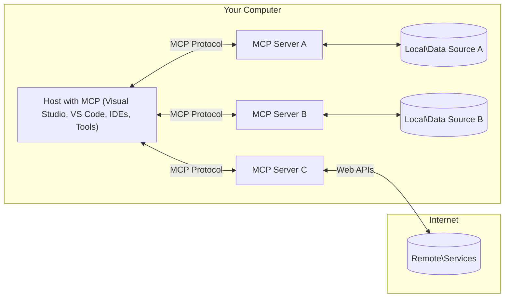

<!--
CO_OP_TRANSLATOR_METADATA:
{
  "original_hash": "904b59de1de9264801242d90a42cdd9d",
  "translation_date": "2025-09-05T11:05:24+00:00",
  "source_file": "01-CoreConcepts/README.md",
  "language_code": "th"
}
-->
# แนวคิดหลักของ MCP: การเชี่ยวชาญใน Model Context Protocol สำหรับการผสานรวม AI

[](https://youtu.be/earDzWGtE84)

_(คลิกที่ภาพด้านบนเพื่อดูวิดีโอของบทเรียนนี้)_

[Model Context Protocol (MCP)](https://github.com/modelcontextprotocol) เป็นกรอบมาตรฐานที่ทรงพลังซึ่งช่วยเพิ่มประสิทธิภาพการสื่อสารระหว่าง Large Language Models (LLMs) กับเครื่องมือภายนอก, แอปพลิเคชัน และแหล่งข้อมูลต่างๆ คู่มือนี้จะพาคุณไปทำความเข้าใจแนวคิดหลักของ MCP โดยคุณจะได้เรียนรู้เกี่ยวกับสถาปัตยกรรมแบบไคลเอนต์-เซิร์ฟเวอร์, ส่วนประกอบสำคัญ, กลไกการสื่อสาร และแนวทางปฏิบัติที่ดีที่สุดในการใช้งาน

- **การยินยอมจากผู้ใช้อย่างชัดเจน**: การเข้าถึงข้อมูลและการดำเนินการทั้งหมดต้องได้รับการอนุมัติจากผู้ใช้อย่างชัดเจนก่อนดำเนินการ ผู้ใช้ต้องเข้าใจอย่างชัดเจนว่าข้อมูลใดจะถูกเข้าถึงและการกระทำใดจะถูกดำเนินการ พร้อมทั้งมีการควบคุมสิทธิ์และการอนุญาตอย่างละเอียด

- **การปกป้องความเป็นส่วนตัวของข้อมูล**: ข้อมูลของผู้ใช้จะถูกเปิดเผยก็ต่อเมื่อได้รับการยินยอมอย่างชัดเจน และต้องได้รับการปกป้องด้วยการควบคุมการเข้าถึงที่แข็งแกร่งตลอดวงจรการโต้ตอบ การใช้งานต้องป้องกันการส่งข้อมูลโดยไม่ได้รับอนุญาตและรักษาขอบเขตความเป็นส่วนตัวอย่างเข้มงวด

- **ความปลอดภัยในการเรียกใช้เครื่องมือ**: การเรียกใช้เครื่องมือทุกครั้งต้องได้รับการยินยอมจากผู้ใช้อย่างชัดเจน พร้อมทั้งความเข้าใจในฟังก์ชันการทำงาน, พารามิเตอร์ และผลกระทบที่อาจเกิดขึ้น ต้องมีขอบเขตความปลอดภัยที่แข็งแกร่งเพื่อป้องกันการเรียกใช้เครื่องมือที่ไม่ตั้งใจ, ไม่ปลอดภัย หรือเป็นอันตราย

- **ความปลอดภัยของชั้นการส่งข้อมูล**: ช่องทางการสื่อสารทั้งหมดควรใช้กลไกการเข้ารหัสและการตรวจสอบสิทธิ์ที่เหมาะสม การเชื่อมต่อระยะไกลควรใช้โปรโตคอลการส่งข้อมูลที่ปลอดภัยและการจัดการข้อมูลประจำตัวที่เหมาะสม

#### แนวทางการใช้งาน:

- **การจัดการสิทธิ์**: ใช้ระบบการอนุญาตที่ละเอียดอ่อนเพื่อให้ผู้ใช้สามารถควบคุมได้ว่าเซิร์ฟเวอร์, เครื่องมือ และทรัพยากรใดที่สามารถเข้าถึงได้
- **การตรวจสอบสิทธิ์และการอนุญาต**: ใช้วิธีการตรวจสอบสิทธิ์ที่ปลอดภัย (OAuth, API keys) พร้อมการจัดการโทเค็นและการหมดอายุที่เหมาะสม  
- **การตรวจสอบข้อมูลนำเข้า**: ตรวจสอบพารามิเตอร์และข้อมูลนำเข้าทั้งหมดตามสคีมาที่กำหนดเพื่อป้องกันการโจมตีแบบ Injection
- **การบันทึกการตรวจสอบ**: เก็บบันทึกการดำเนินการทั้งหมดอย่างครบถ้วนเพื่อการตรวจสอบความปลอดภัยและการปฏิบัติตามข้อกำหนด

## ภาพรวม

บทเรียนนี้จะสำรวจสถาปัตยกรรมพื้นฐานและส่วนประกอบที่ประกอบขึ้นเป็นระบบนิเวศของ Model Context Protocol (MCP) คุณจะได้เรียนรู้เกี่ยวกับสถาปัตยกรรมแบบไคลเอนต์-เซิร์ฟเวอร์, ส่วนประกอบสำคัญ และกลไกการสื่อสารที่ขับเคลื่อนการโต้ตอบของ MCP

## วัตถุประสงค์การเรียนรู้ที่สำคัญ

เมื่อจบบทเรียนนี้ คุณจะสามารถ:

- เข้าใจสถาปัตยกรรมแบบไคลเอนต์-เซิร์ฟเวอร์ของ MCP
- ระบุบทบาทและความรับผิดชอบของ Hosts, Clients และ Servers
- วิเคราะห์คุณสมบัติหลักที่ทำให้ MCP เป็นชั้นการผสานรวมที่ยืดหยุ่น
- เรียนรู้วิธีการไหลของข้อมูลภายในระบบนิเวศของ MCP
- ได้รับข้อมูลเชิงลึกเชิงปฏิบัติผ่านตัวอย่างโค้ดใน .NET, Java, Python และ JavaScript

## สถาปัตยกรรม MCP: การสำรวจเชิงลึก

ระบบนิเวศของ MCP ถูกสร้างขึ้นบนโมเดลแบบไคลเอนต์-เซิร์ฟเวอร์ โครงสร้างแบบโมดูลาร์นี้ช่วยให้แอปพลิเคชัน AI สามารถโต้ตอบกับเครื่องมือ, ฐานข้อมูล, API และทรัพยากรเชิงบริบทได้อย่างมีประสิทธิภาพ มาทำความเข้าใจสถาปัตยกรรมนี้ในส่วนประกอบหลัก

โดยพื้นฐานแล้ว MCP ใช้สถาปัตยกรรมแบบไคลเอนต์-เซิร์ฟเวอร์ ซึ่งแอปพลิเคชันโฮสต์สามารถเชื่อมต่อกับเซิร์ฟเวอร์หลายตัว:



- **MCP Hosts**: โปรแกรมเช่น VSCode, Claude Desktop, IDEs หรือเครื่องมือ AI ที่ต้องการเข้าถึงข้อมูลผ่าน MCP
- **MCP Clients**: ไคลเอนต์โปรโตคอลที่รักษาการเชื่อมต่อแบบ 1:1 กับเซิร์ฟเวอร์
- **MCP Servers**: โปรแกรมน้ำหนักเบาที่เปิดเผยความสามารถเฉพาะผ่าน Model Context Protocol มาตรฐาน
- **Local Data Sources**: ไฟล์, ฐานข้อมูล และบริการในคอมพิวเตอร์ของคุณที่ MCP servers สามารถเข้าถึงได้อย่างปลอดภัย
- **Remote Services**: ระบบภายนอกที่สามารถเข้าถึงได้ผ่านอินเทอร์เน็ตซึ่ง MCP servers สามารถเชื่อมต่อผ่าน API

โปรโตคอล MCP เป็นมาตรฐานที่พัฒนาอย่างต่อเนื่องโดยใช้การกำหนดเวอร์ชันตามวันที่ (รูปแบบ YYYY-MM-DD) เวอร์ชันโปรโตคอลปัจจุบันคือ **2025-06-18** คุณสามารถดูการอัปเดตล่าสุดของ [ข้อกำหนดโปรโตคอล](https://modelcontextprotocol.io/specification/2025-06-18/)

### 1. Hosts

ใน Model Context Protocol (MCP), **Hosts** คือแอปพลิเคชัน AI ที่ทำหน้าที่เป็นอินเทอร์เฟซหลักที่ผู้ใช้ใช้โต้ตอบกับโปรโตคอล Hosts ประสานงานและจัดการการเชื่อมต่อกับ MCP servers หลายตัวโดยการสร้าง MCP clients เฉพาะสำหรับการเชื่อมต่อแต่ละเซิร์ฟเวอร์ ตัวอย่างของ Hosts ได้แก่:

- **แอปพลิเคชัน AI**: Claude Desktop, Visual Studio Code, Claude Code
- **สภาพแวดล้อมการพัฒนา**: IDEs และตัวแก้ไขโค้ดที่มีการผสานรวม MCP  
- **แอปพลิเคชันที่กำหนดเอง**: ตัวแทน AI และเครื่องมือที่สร้างขึ้นเพื่อวัตถุประสงค์เฉพาะ

**Hosts** เป็นแอปพลิเคชันที่ประสานงานการโต้ตอบของโมเดล AI โดย:

- **จัดการโมเดล AI**: เรียกใช้หรือโต้ตอบกับ LLMs เพื่อสร้างคำตอบและประสานงานเวิร์กโฟลว์ AI
- **จัดการการเชื่อมต่อไคลเอนต์**: สร้างและรักษา MCP client หนึ่งตัวต่อการเชื่อมต่อ MCP server
- **ควบคุมอินเทอร์เฟซผู้ใช้**: จัดการการไหลของการสนทนา, การโต้ตอบของผู้ใช้ และการนำเสนอคำตอบ  
- **บังคับใช้ความปลอดภัย**: ควบคุมสิทธิ์, ข้อจำกัดด้านความปลอดภัย และการตรวจสอบสิทธิ์
- **จัดการการยินยอมของผู้ใช้**: จัดการการอนุมัติของผู้ใช้สำหรับการแบ่งปันข้อมูลและการเรียกใช้เครื่องมือ

### 2. Clients

**Clients** เป็นส่วนประกอบสำคัญที่รักษาการเชื่อมต่อแบบหนึ่งต่อหนึ่งระหว่าง Hosts และ MCP servers ไคลเอนต์ MCP แต่ละตัวถูกสร้างขึ้นโดย Host เพื่อเชื่อมต่อกับ MCP server เฉพาะ ซึ่งช่วยให้ช่องทางการสื่อสารมีการจัดระเบียบและปลอดภัย ไคลเอนต์หลายตัวช่วยให้ Hosts เชื่อมต่อกับเซิร์ฟเวอร์หลายตัวพร้อมกัน

**Clients** เป็นส่วนประกอบตัวเชื่อมต่อภายในแอปพลิเคชันโฮสต์ โดย:

- **การสื่อสารโปรโตคอล**: ส่งคำขอ JSON-RPC 2.0 ไปยังเซิร์ฟเวอร์พร้อมคำสั่งและคำแนะนำ
- **การเจรจาความสามารถ**: เจรจาคุณสมบัติที่รองรับและเวอร์ชันโปรโตคอลกับเซิร์ฟเวอร์ระหว่างการเริ่มต้น
- **การเรียกใช้เครื่องมือ**: จัดการคำขอเรียกใช้เครื่องมือจากโมเดลและประมวลผลคำตอบ
- **การอัปเดตแบบเรียลไทม์**: จัดการการแจ้งเตือนและการอัปเดตแบบเรียลไทม์จากเซิร์ฟเวอร์
- **การประมวลผลคำตอบ**: ประมวลผลและจัดรูปแบบคำตอบของเซิร์ฟเวอร์เพื่อแสดงให้ผู้ใช้

### 3. Servers

**Servers** เป็นโปรแกรมที่ให้บริบท, เครื่องมือ และความสามารถแก่ MCP clients เซิร์ฟเวอร์สามารถทำงานในเครื่อง (เครื่องเดียวกับ Host) หรือระยะไกล (บนแพลตฟอร์มภายนอก) และมีหน้าที่จัดการคำขอของไคลเอนต์และให้คำตอบที่มีโครงสร้าง เซิร์ฟเวอร์เปิดเผยฟังก์ชันเฉพาะผ่าน Model Context Protocol มาตรฐาน

**Servers** เป็นบริการที่ให้บริบทและความสามารถ โดย:

- **การลงทะเบียนคุณสมบัติ**: ลงทะเบียนและเปิดเผย primitives (ทรัพยากร, prompts, เครื่องมือ) ที่มีให้แก่ไคลเอนต์
- **การประมวลผลคำขอ**: รับและดำเนินการเรียกใช้เครื่องมือ, คำขอทรัพยากร และคำขอ prompts จากไคลเอนต์
- **การให้บริบท**: ให้ข้อมูลและบริบทเพื่อเพิ่มประสิทธิภาพคำตอบของโมเดล
- **การจัดการสถานะ**: รักษาสถานะเซสชันและจัดการการโต้ตอบที่มีสถานะเมื่อจำเป็น
- **การแจ้งเตือนแบบเรียลไทม์**: ส่งการแจ้งเตือนเกี่ยวกับการเปลี่ยนแปลงและการอัปเดตความสามารถไปยังไคลเอนต์ที่เชื่อมต่อ

เซิร์ฟเวอร์สามารถพัฒนาโดยใครก็ได้เพื่อขยายความสามารถของโมเดลด้วยฟังก์ชันเฉพาะ และรองรับทั้งสถานการณ์การปรับใช้ในเครื่องและระยะไกล

### 4. Server Primitives

เซิร์ฟเวอร์ใน Model Context Protocol (MCP) ให้บริการ **primitives** สามประเภทหลักที่กำหนดองค์ประกอบพื้นฐานสำหรับการโต้ตอบที่หลากหลายระหว่างไคลเอนต์, โฮสต์ และโมเดลภาษาขนาดใหญ่ Primitives เหล่านี้ระบุประเภทของข้อมูลเชิงบริบทและการกระทำที่มีให้ผ่านโปรโตคอล

เซิร์ฟเวอร์ MCP สามารถเปิดเผย primitives หลักสามประเภทดังนี้:

#### Resources 

**Resources** คือแหล่งข้อมูลที่ให้ข้อมูลเชิงบริบทแก่แอปพลิเคชัน AI โดยแสดงถึงเนื้อหาคงที่หรือไดนามิกที่ช่วยเพิ่มความเข้าใจและการตัดสินใจของโมเดล:

- **ข้อมูลเชิงบริบท**: ข้อมูลที่มีโครงสร้างและบริบทสำหรับการบริโภคของโมเดล AI
- **ฐานความรู้**: คลังเอกสาร, บทความ, คู่มือ และงานวิจัย
- **แหล่งข้อมูลในเครื่อง**: ไฟล์, ฐานข้อมูล และข้อมูลระบบในเครื่อง  
- **ข้อมูลภายนอก**: การตอบสนอง API, บริการเว็บ และข้อมูลระบบระยะไกล
- **เนื้อหาไดนามิก**: ข้อมูลเรียลไทม์ที่อัปเดตตามเงื่อนไขภายนอก

Resources ถูกระบุด้วย URIs และรองรับการค้นพบผ่าน `resources/list` และการดึงข้อมูลผ่าน `resources/read`:

```text
file://documents/project-spec.md
database://production/users/schema
api://weather/current
```

#### Prompts

**Prompts** คือแม่แบบที่นำกลับมาใช้ใหม่ได้ซึ่งช่วยจัดโครงสร้างการโต้ตอบกับโมเดลภาษา โดยให้รูปแบบการโต้ตอบมาตรฐานและเวิร์กโฟลว์ที่เป็นแม่แบบ:

- **การโต้ตอบแบบแม่แบบ**: ข้อความที่มีโครงสร้างล่วงหน้าและตัวเริ่มต้นการสนทนา
- **แม่แบบเวิร์กโฟลว์**: ลำดับมาตรฐานสำหรับงานและการโต้ตอบทั่วไป
- **ตัวอย่าง Few-shot**: แม่แบบที่ใช้ตัวอย่างสำหรับคำแนะนำโมเดล
- **System Prompts**: Prompts พื้นฐานที่กำหนดพฤติกรรมและบริบทของโมเดล
- **แม่แบบไดนามิก**: Prompts ที่มีพารามิเตอร์ซึ่งปรับให้เหมาะกับบริบทเฉพาะ

Prompts รองรับการแทนที่ตัวแปรและสามารถค้นพบได้ผ่าน `prompts/list` และดึงข้อมูลด้วย `prompts/get`:

```markdown
Generate a {{task_type}} for {{product}} targeting {{audience}} with the following requirements: {{requirements}}
```

#### Tools

**Tools** คือฟังก์ชันที่สามารถเรียกใช้ได้ซึ่งโมเดล AI สามารถเรียกใช้เพื่อดำเนินการเฉพาะ โดยแสดงถึง "คำกริยา" ของระบบนิเวศ MCP ซึ่งช่วยให้โมเดลโต้ตอบกับระบบภายนอก:

- **ฟังก์ชันที่เรียกใช้ได้**: การดำเนินการที่แยกออกจากกันซึ่งโมเดลสามารถเรียกใช้ได้พร้อมพารามิเตอร์เฉพาะ
- **การผสานรวมระบบภายนอก**: การเรียก API, การสืบค้นฐานข้อมูล, การดำเนินการไฟล์, การคำนวณ
- **เอกลักษณ์เฉพาะตัว**: เครื่องมือแต่ละตัวมีชื่อ, คำอธิบาย และสคีมาพารามิเตอร์ที่แตกต่างกัน
- **I/O ที่มีโครงสร้าง**: เครื่องมือยอมรับพารามิเตอร์ที่ผ่านการตรวจสอบแล้วและส่งคืนคำตอบที่มีโครงสร้างและพิมพ์
- **ความสามารถในการดำเนินการ**: ช่วยให้โมเดลดำเนินการในโลกจริงและดึงข้อมูลสด

Tools ถูกกำหนดด้วย JSON Schema สำหรับการตรวจสอบพารามิเตอร์และค้นพบผ่าน `tools/list` และเรียกใช้ผ่าน `tools/call`:

```typescript
server.tool(
  "search_products", 
  {
    query: z.string().describe("Search query for products"),
    category: z.string().optional().describe("Product category filter"),
    max_results: z.number().default(10).describe("Maximum results to return")
  }, 
  async (params) => {
    // Execute search and return structured results
    return await productService.search(params);
  }
);
```

## Client Primitives

ใน Model Context Protocol (MCP), **clients** สามารถเปิดเผย primitives ที่ช่วยให้เซิร์ฟเวอร์ร้องขอความสามารถเพิ่มเติมจากแอปพลิเคชันโฮสต์ primitives ฝั่งไคลเอนต์เหล่านี้ช่วยให้การใช้งานเซิร์ฟเวอร์มีความหลากหลายและโต้ตอบได้มากขึ้น โดยสามารถเข้าถึงความสามารถของโมเดล AI และการโต้ตอบของผู้ใช้

### Sampling

**Sampling** ช่วยให้เซิร์ฟเวอร์ร้องขอการเติมข้อความจากโมเดลภาษาของแอปพลิเคชัน AI ของไคลเอนต์ Primitive นี้ช่วยให้เซิร์ฟเวอร์เข้าถึงความสามารถของ LLM โดยไม่ต้องฝังการพึ่งพาโมเดลของตนเอง:

- **การเข้าถึงโมเดลที่ไม่ขึ้นกับเซิร์ฟเวอร์**: เซิร์ฟเวอร์สามารถร้องขอการเติมข้อความโดยไม่ต้องรวม SDK ของ LLM หรือจัดการการเข้าถึงโมเดล
- **AI ที่เริ่มต้นโดยเซิร์ฟเวอร์**: ช่วยให้เซิร์ฟเวอร์สร้างเนื้อหาโดยอัตโนมัติโดยใช้โมเดล AI ของไคลเอนต์
- **การโต้ตอบ LLM แบบวนซ้ำ**: รองรับสถานการณ์ที่ซับซ้อนซึ่งเซิร์ฟเวอร์ต้องการความช่วยเหลือจาก AI สำหรับการประมวลผล
- **การสร้างเนื้อหาไดนามิก**: ช่วยให้เซิร์ฟเวอร์สร้างคำตอบเชิงบริบทโดยใช้โมเดลของโฮสต์

Sampling ถูกเริ่มต้นผ่านวิธี `sampling/complete` ซึ่งเซิร์ฟเวอร์ส่งคำขอเติมข้อความไปยังไคลเอนต์

### Elicitation  

**Elicitation** ช่วยให้เซิร์ฟเวอร์ร้องขอข้อมูลเพิ่มเติมหรือการยืนยันจากผู้ใช้ผ่านอินเทอร์เฟซของไคลเอนต์:

- **คำขอข้อมูลจากผู้ใช้**: เซิร์ฟเวอร์สามารถขอข้อมูลเพิ่มเติมเมื่อจำเป็นสำหรับการเรียกใช้เครื่องมือ
- **กล่องโต้ตอบการยืนยัน**: ขอการอนุมัติจากผู้ใช้สำหรับการดำเนินการที่ละเอียดอ่อนหรือมีผลกระทบ
- **เวิร์กโฟลว์แบบโต้ตอบ**: ช่วยให้เซิร์ฟเวอร์สร้างการโต้ตอบกับผู้ใช้แบบทีละขั้นตอน
- **การรวบรวมพารามิเตอร์แบบไดนามิก**: รวบรวมพารามิเตอร์ที่ขาดหายไปหรือเป็นตัวเลือกระหว่างการเรียกใช้
- **JSON-RPC 2.0 Protocol**: การสื่อสารทั้งหมดใช้รูปแบบข้อความ JSON-RPC 2.0 ที่เป็นมาตรฐานสำหรับการเรียกใช้เมธอด การตอบกลับ และการแจ้งเตือน
- **Lifecycle Management**: จัดการการเริ่มต้นการเชื่อมต่อ การเจรจาความสามารถ และการสิ้นสุดเซสชันระหว่างไคลเอนต์และเซิร์ฟเวอร์
- **Server Primitives**: ช่วยให้เซิร์ฟเวอร์สามารถให้บริการฟังก์ชันหลักผ่านเครื่องมือ ทรัพยากร และคำแนะนำ
- **Client Primitives**: ช่วยให้เซิร์ฟเวอร์สามารถร้องขอการสุ่มตัวอย่างจาก LLMs รับข้อมูลจากผู้ใช้ และส่งข้อความบันทึก
- **Real-time Notifications**: รองรับการแจ้งเตือนแบบอะซิงโครนัสสำหรับการอัปเดตแบบไดนามิกโดยไม่ต้องใช้การสำรวจข้อมูล

#### คุณสมบัติสำคัญ:

- **Protocol Version Negotiation**: ใช้การกำหนดเวอร์ชันตามวันที่ (YYYY-MM-DD) เพื่อให้มั่นใจในความเข้ากันได้
- **Capability Discovery**: ไคลเอนต์และเซิร์ฟเวอร์แลกเปลี่ยนข้อมูลคุณสมบัติที่รองรับระหว่างการเริ่มต้น
- **Stateful Sessions**: รักษาสถานะการเชื่อมต่อระหว่างการโต้ตอบหลายครั้งเพื่อความต่อเนื่องของบริบท

### Transport Layer

**Transport Layer** จัดการช่องทางการสื่อสาร การจัดกรอบข้อความ และการตรวจสอบสิทธิ์ระหว่างผู้เข้าร่วม MCP:

#### กลไกการส่งข้อมูลที่รองรับ:

1. **STDIO Transport**:
   - ใช้สตรีมอินพุต/เอาต์พุตมาตรฐานสำหรับการสื่อสารระหว่างกระบวนการโดยตรง
   - เหมาะสำหรับกระบวนการในเครื่องเดียวกันโดยไม่มีค่าใช้จ่ายเครือข่าย
   - ใช้กันทั่วไปสำหรับการใช้งานเซิร์ฟเวอร์ MCP ในเครื่อง

2. **Streamable HTTP Transport**:
   - ใช้ HTTP POST สำหรับข้อความจากไคลเอนต์ไปยังเซิร์ฟเวอร์  
   - มีตัวเลือก Server-Sent Events (SSE) สำหรับการสตรีมจากเซิร์ฟเวอร์ไปยังไคลเอนต์
   - ช่วยให้การสื่อสารกับเซิร์ฟเวอร์ระยะไกลผ่านเครือข่าย
   - รองรับการตรวจสอบสิทธิ์ HTTP มาตรฐาน (bearer tokens, API keys, custom headers)
   - MCP แนะนำ OAuth สำหรับการตรวจสอบสิทธิ์แบบใช้โทเค็นที่ปลอดภัย

#### Transport Abstraction:

Transport Layer แยกรายละเอียดการสื่อสารออกจาก Data Layer ทำให้สามารถใช้รูปแบบข้อความ JSON-RPC 2.0 เดียวกันในทุกกลไกการส่งข้อมูล การแยกส่วนนี้ช่วยให้แอปพลิเคชันสามารถสลับระหว่างเซิร์ฟเวอร์ในเครื่องและเซิร์ฟเวอร์ระยะไกลได้อย่างราบรื่น

### Security Considerations

การใช้งาน MCP ต้องปฏิบัติตามหลักการด้านความปลอดภัยที่สำคัญหลายประการเพื่อให้มั่นใจว่าการโต้ตอบทั้งหมดในโปรโตคอลมีความปลอดภัย เชื่อถือได้ และปลอดภัย:

- **User Consent and Control**: ผู้ใช้ต้องให้ความยินยอมอย่างชัดเจนก่อนที่จะเข้าถึงข้อมูลหรือดำเนินการใด ๆ ผู้ใช้ควรมีการควบคุมที่ชัดเจนเกี่ยวกับข้อมูลที่แชร์และการดำเนินการที่ได้รับอนุญาต โดยมีอินเทอร์เฟซผู้ใช้ที่ใช้งานง่ายสำหรับการตรวจสอบและอนุมัติกิจกรรม

- **Data Privacy**: ข้อมูลผู้ใช้ควรถูกเปิดเผยเฉพาะเมื่อได้รับความยินยอมอย่างชัดเจน และต้องได้รับการปกป้องด้วยการควบคุมการเข้าถึงที่เหมาะสม การใช้งาน MCP ต้องป้องกันการส่งข้อมูลโดยไม่ได้รับอนุญาตและรักษาความเป็นส่วนตัวตลอดการโต้ตอบทั้งหมด

- **Tool Safety**: ก่อนที่จะเรียกใช้เครื่องมือใด ๆ ต้องได้รับความยินยอมจากผู้ใช้อย่างชัดเจน ผู้ใช้ควรมีความเข้าใจที่ชัดเจนเกี่ยวกับฟังก์ชันของแต่ละเครื่องมือ และต้องมีการบังคับใช้ขอบเขตความปลอดภัยที่แข็งแกร่งเพื่อป้องกันการใช้งานเครื่องมือที่ไม่ตั้งใจหรือไม่ปลอดภัย

ด้วยการปฏิบัติตามหลักการด้านความปลอดภัยเหล่านี้ MCP ช่วยให้มั่นใจในความไว้วางใจ ความเป็นส่วนตัว และความปลอดภัยของผู้ใช้ในทุกการโต้ตอบของโปรโตคอล พร้อมทั้งเปิดใช้งานการผสานรวม AI ที่ทรงพลัง

## ตัวอย่างโค้ด: ส่วนประกอบสำคัญ

ด้านล่างนี้คือตัวอย่างโค้ดในหลายภาษาโปรแกรมยอดนิยมที่แสดงวิธีการใช้งานเซิร์ฟเวอร์ MCP และเครื่องมือสำคัญ

### ตัวอย่าง .NET: การสร้างเซิร์ฟเวอร์ MCP แบบง่ายพร้อมเครื่องมือ

นี่คือตัวอย่างโค้ด .NET ที่แสดงวิธีการใช้งานเซิร์ฟเวอร์ MCP แบบง่ายพร้อมเครื่องมือที่กำหนดเอง ตัวอย่างนี้แสดงวิธีการกำหนดและลงทะเบียนเครื่องมือ จัดการคำขอ และเชื่อมต่อเซิร์ฟเวอร์โดยใช้ Model Context Protocol

```csharp
using System;
using System.Threading.Tasks;
using ModelContextProtocol.Server;
using ModelContextProtocol.Server.Transport;
using ModelContextProtocol.Server.Tools;

public class WeatherServer
{
    public static async Task Main(string[] args)
    {
        // Create an MCP server
        var server = new McpServer(
            name: "Weather MCP Server",
            version: "1.0.0"
        );
        
        // Register our custom weather tool
        server.AddTool<string, WeatherData>("weatherTool", 
            description: "Gets current weather for a location",
            execute: async (location) => {
                // Call weather API (simplified)
                var weatherData = await GetWeatherDataAsync(location);
                return weatherData;
            });
        
        // Connect the server using stdio transport
        var transport = new StdioServerTransport();
        await server.ConnectAsync(transport);
        
        Console.WriteLine("Weather MCP Server started");
        
        // Keep the server running until process is terminated
        await Task.Delay(-1);
    }
    
    private static async Task<WeatherData> GetWeatherDataAsync(string location)
    {
        // This would normally call a weather API
        // Simplified for demonstration
        await Task.Delay(100); // Simulate API call
        return new WeatherData { 
            Temperature = 72.5,
            Conditions = "Sunny",
            Location = location
        };
    }
}

public class WeatherData
{
    public double Temperature { get; set; }
    public string Conditions { get; set; }
    public string Location { get; set; }
}
```

### ตัวอย่าง Java: ส่วนประกอบเซิร์ฟเวอร์ MCP

ตัวอย่างนี้แสดงการลงทะเบียนเซิร์ฟเวอร์ MCP และเครื่องมือแบบเดียวกับตัวอย่าง .NET ด้านบน แต่ใช้งานใน Java

```java
import io.modelcontextprotocol.server.McpServer;
import io.modelcontextprotocol.server.McpToolDefinition;
import io.modelcontextprotocol.server.transport.StdioServerTransport;
import io.modelcontextprotocol.server.tool.ToolExecutionContext;
import io.modelcontextprotocol.server.tool.ToolResponse;

public class WeatherMcpServer {
    public static void main(String[] args) throws Exception {
        // Create an MCP server
        McpServer server = McpServer.builder()
            .name("Weather MCP Server")
            .version("1.0.0")
            .build();
            
        // Register a weather tool
        server.registerTool(McpToolDefinition.builder("weatherTool")
            .description("Gets current weather for a location")
            .parameter("location", String.class)
            .execute((ToolExecutionContext ctx) -> {
                String location = ctx.getParameter("location", String.class);
                
                // Get weather data (simplified)
                WeatherData data = getWeatherData(location);
                
                // Return formatted response
                return ToolResponse.content(
                    String.format("Temperature: %.1f°F, Conditions: %s, Location: %s", 
                    data.getTemperature(), 
                    data.getConditions(), 
                    data.getLocation())
                );
            })
            .build());
        
        // Connect the server using stdio transport
        try (StdioServerTransport transport = new StdioServerTransport()) {
            server.connect(transport);
            System.out.println("Weather MCP Server started");
            // Keep server running until process is terminated
            Thread.currentThread().join();
        }
    }
    
    private static WeatherData getWeatherData(String location) {
        // Implementation would call a weather API
        // Simplified for example purposes
        return new WeatherData(72.5, "Sunny", location);
    }
}

class WeatherData {
    private double temperature;
    private String conditions;
    private String location;
    
    public WeatherData(double temperature, String conditions, String location) {
        this.temperature = temperature;
        this.conditions = conditions;
        this.location = location;
    }
    
    public double getTemperature() {
        return temperature;
    }
    
    public String getConditions() {
        return conditions;
    }
    
    public String getLocation() {
        return location;
    }
}
```

### ตัวอย่าง Python: การสร้างเซิร์ฟเวอร์ MCP

ตัวอย่างนี้ใช้ fastmcp ดังนั้นโปรดตรวจสอบให้แน่ใจว่าคุณติดตั้งมันก่อน:

```python
pip install fastmcp
```
ตัวอย่างโค้ด:

```python
#!/usr/bin/env python3
import asyncio
from fastmcp import FastMCP
from fastmcp.transports.stdio import serve_stdio

# Create a FastMCP server
mcp = FastMCP(
    name="Weather MCP Server",
    version="1.0.0"
)

@mcp.tool()
def get_weather(location: str) -> dict:
    """Gets current weather for a location."""
    return {
        "temperature": 72.5,
        "conditions": "Sunny",
        "location": location
    }

# Alternative approach using a class
class WeatherTools:
    @mcp.tool()
    def forecast(self, location: str, days: int = 1) -> dict:
        """Gets weather forecast for a location for the specified number of days."""
        return {
            "location": location,
            "forecast": [
                {"day": i+1, "temperature": 70 + i, "conditions": "Partly Cloudy"}
                for i in range(days)
            ]
        }

# Register class tools
weather_tools = WeatherTools()

# Start the server
if __name__ == "__main__":
    asyncio.run(serve_stdio(mcp))
```

### ตัวอย่าง JavaScript: การสร้างเซิร์ฟเวอร์ MCP

ตัวอย่างนี้แสดงการสร้างเซิร์ฟเวอร์ MCP ใน JavaScript และวิธีการลงทะเบียนเครื่องมือที่เกี่ยวข้องกับสภาพอากาศสองตัว

```javascript
// Using the official Model Context Protocol SDK
import { McpServer } from "@modelcontextprotocol/sdk/server/mcp.js";
import { StdioServerTransport } from "@modelcontextprotocol/sdk/server/stdio.js";
import { z } from "zod"; // For parameter validation

// Create an MCP server
const server = new McpServer({
  name: "Weather MCP Server",
  version: "1.0.0"
});

// Define a weather tool
server.tool(
  "weatherTool",
  {
    location: z.string().describe("The location to get weather for")
  },
  async ({ location }) => {
    // This would normally call a weather API
    // Simplified for demonstration
    const weatherData = await getWeatherData(location);
    
    return {
      content: [
        { 
          type: "text", 
          text: `Temperature: ${weatherData.temperature}°F, Conditions: ${weatherData.conditions}, Location: ${weatherData.location}` 
        }
      ]
    };
  }
);

// Define a forecast tool
server.tool(
  "forecastTool",
  {
    location: z.string(),
    days: z.number().default(3).describe("Number of days for forecast")
  },
  async ({ location, days }) => {
    // This would normally call a weather API
    // Simplified for demonstration
    const forecast = await getForecastData(location, days);
    
    return {
      content: [
        { 
          type: "text", 
          text: `${days}-day forecast for ${location}: ${JSON.stringify(forecast)}` 
        }
      ]
    };
  }
);

// Helper functions
async function getWeatherData(location) {
  // Simulate API call
  return {
    temperature: 72.5,
    conditions: "Sunny",
    location: location
  };
}

async function getForecastData(location, days) {
  // Simulate API call
  return Array.from({ length: days }, (_, i) => ({
    day: i + 1,
    temperature: 70 + Math.floor(Math.random() * 10),
    conditions: i % 2 === 0 ? "Sunny" : "Partly Cloudy"
  }));
}

// Connect the server using stdio transport
const transport = new StdioServerTransport();
server.connect(transport).catch(console.error);

console.log("Weather MCP Server started");
```

ตัวอย่าง JavaScript นี้แสดงวิธีการสร้างไคลเอนต์ MCP ที่เชื่อมต่อกับเซิร์ฟเวอร์ ส่งคำถาม และประมวลผลการตอบกลับรวมถึงการเรียกใช้เครื่องมือที่เกิดขึ้น

## Security and Authorization

MCP มีแนวคิดและกลไกในตัวหลายอย่างสำหรับการจัดการความปลอดภัยและการอนุญาตตลอดโปรโตคอล:

1. **Tool Permission Control**:  
  ไคลเอนต์สามารถระบุว่าโมเดลได้รับอนุญาตให้ใช้เครื่องมือใดในระหว่างเซสชัน สิ่งนี้ช่วยให้มั่นใจว่าเครื่องมือที่ได้รับอนุญาตเท่านั้นที่สามารถเข้าถึงได้ ลดความเสี่ยงของการดำเนินการที่ไม่ตั้งใจหรือไม่ปลอดภัย การอนุญาตสามารถกำหนดค่าได้แบบไดนามิกตามความต้องการของผู้ใช้ นโยบายองค์กร หรือบริบทของการโต้ตอบ

2. **Authentication**:  
  เซิร์ฟเวอร์สามารถกำหนดให้มีการตรวจสอบสิทธิ์ก่อนที่จะให้สิทธิ์เข้าถึงเครื่องมือ ทรัพยากร หรือการดำเนินการที่ละเอียดอ่อน สิ่งนี้อาจเกี่ยวข้องกับ API keys, OAuth tokens หรือรูปแบบการตรวจสอบสิทธิ์อื่น ๆ การตรวจสอบสิทธิ์ที่เหมาะสมช่วยให้มั่นใจว่าเฉพาะไคลเอนต์และผู้ใช้ที่เชื่อถือได้เท่านั้นที่สามารถเรียกใช้ความสามารถของเซิร์ฟเวอร์ได้

3. **Validation**:  
  การตรวจสอบพารามิเตอร์ถูกบังคับใช้สำหรับการเรียกใช้เครื่องมือทั้งหมด เครื่องมือแต่ละตัวกำหนดประเภท รูปแบบ และข้อจำกัดที่คาดหวังสำหรับพารามิเตอร์ของมัน และเซิร์ฟเวอร์จะตรวจสอบคำขอที่เข้ามาตามนั้น สิ่งนี้ช่วยป้องกันอินพุตที่ผิดรูปแบบหรือเป็นอันตรายจากการเข้าถึงการใช้งานเครื่องมือ และช่วยรักษาความสมบูรณ์ของการดำเนินการ

4. **Rate Limiting**:  
  เพื่อป้องกันการใช้งานในทางที่ผิดและให้มั่นใจในความเป็นธรรมของการใช้ทรัพยากรเซิร์ฟเวอร์ เซิร์ฟเวอร์ MCP สามารถใช้งานการจำกัดอัตราสำหรับการเรียกใช้เครื่องมือและการเข้าถึงทรัพยากร การจำกัดอัตราสามารถนำไปใช้ต่อผู้ใช้ ต่อเซสชัน หรือทั่วโลก และช่วยป้องกันการโจมตีแบบปฏิเสธการให้บริการหรือการใช้ทรัพยากรเกินขนาด

ด้วยการรวมกลไกเหล่านี้ MCP ให้รากฐานที่ปลอดภัยสำหรับการผสานรวมโมเดลภาษากับเครื่องมือและแหล่งข้อมูลภายนอก พร้อมทั้งให้การควบคุมการเข้าถึงและการใช้งานที่ละเอียดแก่ผู้ใช้และนักพัฒนา

## Protocol Messages & Communication Flow

การสื่อสาร MCP ใช้ข้อความ **JSON-RPC 2.0** ที่มีโครงสร้างเพื่ออำนวยความสะดวกในการโต้ตอบที่ชัดเจนและเชื่อถือได้ระหว่างโฮสต์ ไคลเอนต์ และเซิร์ฟเวอร์ โปรโตคอลกำหนดรูปแบบข้อความเฉพาะสำหรับการดำเนินการประเภทต่าง ๆ:

### ประเภทข้อความหลัก:

#### **Initialization Messages**
- **`initialize` Request**: สร้างการเชื่อมต่อและเจรจาเวอร์ชันโปรโตคอลและความสามารถ
- **`initialize` Response**: ยืนยันคุณสมบัติที่รองรับและข้อมูลเซิร์ฟเวอร์  
- **`notifications/initialized`**: ส่งสัญญาณว่าเสร็จสิ้นการเริ่มต้นและเซสชันพร้อมใช้งาน

#### **Discovery Messages**
- **`tools/list` Request**: ค้นหาเครื่องมือที่มีอยู่จากเซิร์ฟเวอร์
- **`resources/list` Request**: แสดงรายการทรัพยากรที่มีอยู่ (แหล่งข้อมูล)
- **`prompts/list` Request**: ดึงแม่แบบคำถามที่มีอยู่

#### **Execution Messages**  
- **`tools/call` Request**: เรียกใช้เครื่องมือเฉพาะพร้อมพารามิเตอร์ที่ให้มา
- **`resources/read` Request**: ดึงเนื้อหาจากทรัพยากรเฉพาะ
- **`prompts/get` Request**: ดึงแม่แบบคำถามพร้อมพารามิเตอร์ที่เป็นตัวเลือก

#### **Client-side Messages**
- **`sampling/complete` Request**: เซิร์ฟเวอร์ร้องขอการเติมข้อความจาก LLM ผ่านไคลเอนต์
- **`elicitation/request`**: เซิร์ฟเวอร์ร้องขอข้อมูลจากผู้ใช้ผ่านอินเทอร์เฟซไคลเอนต์
- **Logging Messages**: เซิร์ฟเวอร์ส่งข้อความบันทึกที่มีโครงสร้างไปยังไคลเอนต์

#### **Notification Messages**
- **`notifications/tools/list_changed`**: เซิร์ฟเวอร์แจ้งไคลเอนต์เกี่ยวกับการเปลี่ยนแปลงเครื่องมือ
- **`notifications/resources/list_changed`**: เซิร์ฟเวอร์แจ้งไคลเอนต์เกี่ยวกับการเปลี่ยนแปลงทรัพยากร  
- **`notifications/prompts/list_changed`**: เซิร์ฟเวอร์แจ้งไคลเอนต์เกี่ยวกับการเปลี่ยนแปลงแม่แบบคำถาม

### โครงสร้างข้อความ:

ข้อความ MCP ทั้งหมดปฏิบัติตามรูปแบบ JSON-RPC 2.0 โดยมี:
- **Request Messages**: รวม `id`, `method` และ `params` ที่เป็นตัวเลือก
- **Response Messages**: รวม `id` และ `result` หรือ `error`  
- **Notification Messages**: รวม `method` และ `params` ที่เป็นตัวเลือก (ไม่มี `id` หรือการตอบกลับที่คาดหวัง)

การสื่อสารที่มีโครงสร้างนี้ช่วยให้มั่นใจในความน่าเชื่อถือ การติดตาม และการขยายตัวของการโต้ตอบที่รองรับสถานการณ์ขั้นสูง เช่น การอัปเดตแบบเรียลไทม์ การเชื่อมโยงเครื่องมือ และการจัดการข้อผิดพลาดที่แข็งแกร่ง

## Key Takeaways

- **Architecture**: MCP ใช้สถาปัตยกรรมไคลเอนต์-เซิร์ฟเวอร์ที่โฮสต์จัดการการเชื่อมต่อไคลเอนต์หลายตัวไปยังเซิร์ฟเวอร์
- **Participants**: ระบบนิเวศประกอบด้วยโฮสต์ (แอปพลิเคชัน AI), ไคลเอนต์ (ตัวเชื่อมต่อโปรโตคอล), และเซิร์ฟเวอร์ (ผู้ให้บริการความสามารถ)
- **Transport Mechanisms**: การสื่อสารรองรับ STDIO (ในเครื่อง) และ Streamable HTTP พร้อม SSE ที่เป็นตัวเลือก (ระยะไกล)
- **Core Primitives**: เซิร์ฟเวอร์เปิดเผยเครื่องมือ (ฟังก์ชันที่ดำเนินการได้), ทรัพยากร (แหล่งข้อมูล), และคำถาม (แม่แบบ)
- **Client Primitives**: เซิร์ฟเวอร์สามารถร้องขอการสุ่มตัวอย่าง (การเติมข้อความ LLM), การรับข้อมูล (ข้อมูลผู้ใช้), และการบันทึกจากไคลเอนต์
- **Protocol Foundation**: สร้างขึ้นบน JSON-RPC 2.0 พร้อมการกำหนดเวอร์ชันตามวันที่ (ปัจจุบัน: 2025-06-18)
- **Real-time Capabilities**: รองรับการแจ้งเตือนสำหรับการอัปเดตแบบไดนามิกและการซิงโครไนซ์แบบเรียลไทม์
- **Security First**: ความยินยอมของผู้ใช้ การปกป้องความเป็นส่วนตัวของข้อมูล และการส่งข้อมูลที่ปลอดภัยเป็นข้อกำหนดหลัก

## Exercise

ออกแบบเครื่องมือ MCP แบบง่ายที่มีประโยชน์ในโดเมนของคุณ กำหนด:
1. ชื่อของเครื่องมือ
2. พารามิเตอร์ที่เครื่องมือจะรับ
3. ผลลัพธ์ที่เครื่องมือจะส่งกลับ
4. วิธีที่โมเดลอาจใช้เครื่องมือนี้เพื่อแก้ปัญหาของผู้ใช้


---

## What's next

ถัดไป: [Chapter 2: Security](../02-Security/README.md)

---

**ข้อจำกัดความรับผิดชอบ**:  
เอกสารนี้ได้รับการแปลโดยใช้บริการแปลภาษา AI [Co-op Translator](https://github.com/Azure/co-op-translator) แม้ว่าเราจะพยายามให้การแปลมีความถูกต้องมากที่สุด แต่โปรดทราบว่าการแปลอัตโนมัติอาจมีข้อผิดพลาดหรือความไม่ถูกต้อง เอกสารต้นฉบับในภาษาดั้งเดิมควรถือเป็นแหล่งข้อมูลที่เชื่อถือได้ สำหรับข้อมูลที่สำคัญ ขอแนะนำให้ใช้บริการแปลภาษามืออาชีพ เราไม่รับผิดชอบต่อความเข้าใจผิดหรือการตีความผิดที่เกิดจากการใช้การแปลนี้