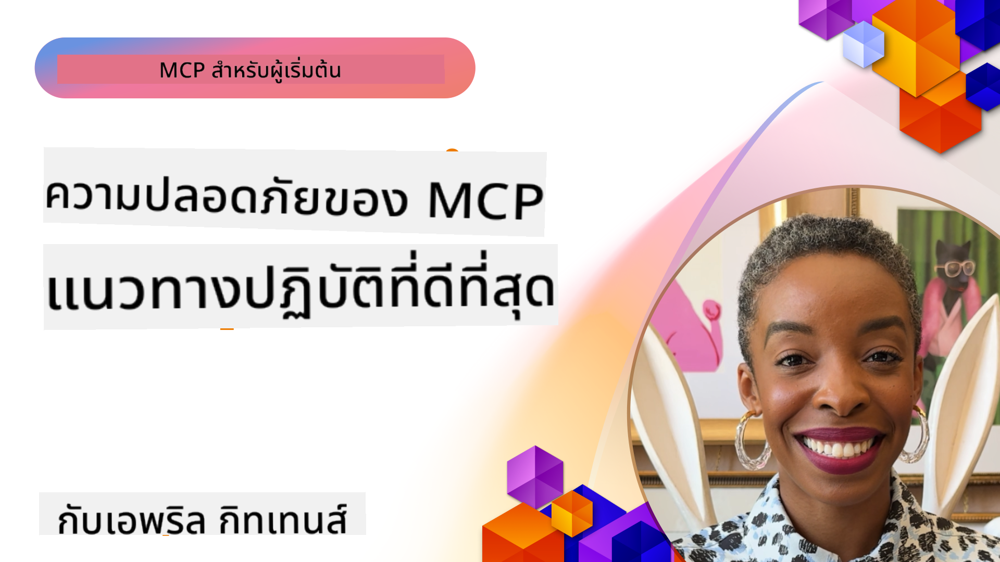

<!--
CO_OP_TRANSLATOR_METADATA:
{
  "original_hash": "1c767a35642f753127dc08545c25a290",
  "translation_date": "2025-08-18T14:23:41+00:00",
  "source_file": "02-Security/README.md",
  "language_code": "th"
}
-->
# ความปลอดภัยของ MCP: การปกป้องที่ครอบคลุมสำหรับระบบ AI

_(คลิกที่ภาพด้านบนเพื่อดูวิดีโอของบทเรียนนี้)_

ความปลอดภัยเป็นพื้นฐานสำคัญในการออกแบบระบบ AI ซึ่งเป็นเหตุผลที่เราให้ความสำคัญกับหัวข้อนี้ในส่วนที่สองของเรา สิ่งนี้สอดคล้องกับหลักการ **Secure by Design** ของ Microsoft จาก [Secure Future Initiative](https://www.microsoft.com/security/blog/2025/04/17/microsofts-secure-by-design-journey-one-year-of-success/)

Model Context Protocol (MCP) นำเสนอความสามารถใหม่ที่ทรงพลังสำหรับแอปพลิเคชันที่ขับเคลื่อนด้วย AI แต่ในขณะเดียวกันก็สร้างความท้าทายด้านความปลอดภัยที่ไม่เหมือนใคร ซึ่งเกินกว่าความเสี่ยงของซอฟต์แวร์แบบดั้งเดิม ระบบ MCP ต้องเผชิญกับปัญหาความปลอดภัยที่มีอยู่เดิม (การเขียนโค้ดอย่างปลอดภัย, การจำกัดสิทธิ์, ความปลอดภัยของห่วงโซ่อุปทาน) และภัยคุกคามใหม่ที่เกี่ยวข้องกับ AI เช่น การโจมตีด้วย prompt injection, การปนเปื้อนเครื่องมือ, การแย่งชิงเซสชัน, การโจมตี confused deputy, ช่องโหว่ token passthrough และการปรับเปลี่ยนความสามารถแบบไดนามิก

บทเรียนนี้จะสำรวจความเสี่ยงด้านความปลอดภัยที่สำคัญที่สุดในระบบ MCP โดยครอบคลุมหัวข้อต่างๆ เช่น การยืนยันตัวตน, การอนุญาต, การให้สิทธิ์ที่มากเกินไป, การโจมตีด้วย prompt injection ทางอ้อม, ความปลอดภัยของเซสชัน, ปัญหา confused deputy, การจัดการโทเค็น และช่องโหว่ในห่วงโซ่อุปทาน คุณจะได้เรียนรู้วิธีควบคุมและแนวปฏิบัติที่ดีที่สุดเพื่อบรรเทาความเสี่ยงเหล่านี้ พร้อมทั้งใช้โซลูชันของ Microsoft เช่น Prompt Shields, Azure Content Safety และ GitHub Advanced Security เพื่อเสริมความแข็งแกร่งให้กับการใช้งาน MCP ของคุณ

## วัตถุประสงค์การเรียนรู้

เมื่อจบบทเรียนนี้ คุณจะสามารถ:

- **ระบุภัยคุกคามเฉพาะ MCP**: เข้าใจความเสี่ยงด้านความปลอดภัยที่ไม่เหมือนใครในระบบ MCP เช่น prompt injection, การปนเปื้อนเครื่องมือ, การให้สิทธิ์ที่มากเกินไป, การแย่งชิงเซสชัน, ปัญหา confused deputy, ช่องโหว่ token passthrough และความเสี่ยงในห่วงโซ่อุปทาน
- **ใช้การควบคุมด้านความปลอดภัย**: ดำเนินการลดความเสี่ยงอย่างมีประสิทธิภาพ เช่น การยืนยันตัวตนที่แข็งแกร่ง, การเข้าถึงแบบจำกัดสิทธิ์, การจัดการโทเค็นอย่างปลอดภัย, การควบคุมความปลอดภัยของเซสชัน และการตรวจสอบความปลอดภัยของห่วงโซ่อุปทาน
- **ใช้โซลูชันความปลอดภัยของ Microsoft**: เข้าใจและปรับใช้ Microsoft Prompt Shields, Azure Content Safety และ GitHub Advanced Security เพื่อปกป้องการทำงานของ MCP
- **ตรวจสอบความปลอดภัยของเครื่องมือ**: ตระหนักถึงความสำคัญของการตรวจสอบ metadata ของเครื่องมือ, การติดตามการเปลี่ยนแปลงแบบไดนามิก และการป้องกันการโจมตีด้วย prompt injection ทางอ้อม
- **ผสานแนวปฏิบัติที่ดีที่สุด**: รวมพื้นฐานความปลอดภัยที่ได้รับการยอมรับ (การเขียนโค้ดอย่างปลอดภัย, การเสริมความแข็งแกร่งของเซิร์ฟเวอร์, zero trust) เข้ากับการควบคุมเฉพาะ MCP เพื่อการปกป้องที่ครอบคลุม

# สถาปัตยกรรมและการควบคุมความปลอดภัยของ MCP

การใช้งาน MCP สมัยใหม่ต้องการแนวทางการรักษาความปลอดภัยแบบชั้นที่ครอบคลุมทั้งภัยคุกคามด้านความปลอดภัยของซอฟต์แวร์แบบดั้งเดิมและภัยคุกคามเฉพาะ AI ข้อกำหนด MCP ที่พัฒนาอย่างรวดเร็วนี้ยังคงปรับปรุงการควบคุมความปลอดภัยเพื่อให้สามารถผสานรวมกับสถาปัตยกรรมความปลอดภัยขององค์กรและแนวปฏิบัติที่ดีที่สุดที่มีอยู่ได้ดียิ่งขึ้น

งานวิจัยจาก [Microsoft Digital Defense Report](https://aka.ms/mddr) แสดงให้เห็นว่า **98% ของการละเมิดที่รายงานสามารถป้องกันได้ด้วยสุขอนามัยด้านความปลอดภัยที่แข็งแกร่ง** กลยุทธ์การป้องกันที่มีประสิทธิภาพที่สุดคือการผสมผสานแนวปฏิบัติด้านความปลอดภัยพื้นฐานเข้ากับการควบคุมเฉพาะ MCP—มาตรการความปลอดภัยพื้นฐานที่พิสูจน์แล้วว่าส่งผลกระทบมากที่สุดในการลดความเสี่ยงด้านความปลอดภัยโดยรวม

## ภูมิทัศน์ความปลอดภัยในปัจจุบัน

> **Note:** ข้อมูลนี้สะท้อนถึงมาตรฐานความปลอดภัยของ MCP ณ วันที่ **18 สิงหาคม 2025** ข้อกำหนด MCP ยังคงพัฒนาอย่างรวดเร็ว และการใช้งานในอนาคตอาจแนะนำรูปแบบการยืนยันตัวตนใหม่และการควบคุมที่ปรับปรุงแล้ว โปรดอ้างอิง [MCP Specification](https://spec.modelcontextprotocol.io/), [MCP GitHub repository](https://github.com/modelcontextprotocol) และ [เอกสารแนวปฏิบัติที่ดีที่สุดด้านความปลอดภัย](https://modelcontextprotocol.io/specification/2025-06-18/basic/security_best_practices) สำหรับคำแนะนำล่าสุดเสมอ

### วิวัฒนาการของการยืนยันตัวตนใน MCP

ข้อกำหนด MCP ได้พัฒนาอย่างมีนัยสำคัญในแนวทางการยืนยันตัวตนและการอนุญาต:

- **แนวทางดั้งเดิม**: ข้อกำหนดในช่วงแรกกำหนดให้นักพัฒนาต้องสร้างเซิร์ฟเวอร์ยืนยันตัวตนแบบกำหนดเอง โดยเซิร์ฟเวอร์ MCP ทำหน้าที่เป็น OAuth 2.0 Authorization Servers ที่จัดการการยืนยันตัวตนของผู้ใช้โดยตรง
- **มาตรฐานปัจจุบัน (2025-06-18)**: ข้อกำหนดที่อัปเดตอนุญาตให้เซิร์ฟเวอร์ MCP มอบหมายการยืนยันตัวตนให้กับผู้ให้บริการข้อมูลประจำตัวภายนอก (เช่น Microsoft Entra ID) ซึ่งช่วยปรับปรุงท่าทางความปลอดภัยและลดความซับซ้อนในการใช้งาน
- **Transport Layer Security**: การสนับสนุนที่เพิ่มขึ้นสำหรับกลไกการส่งข้อมูลที่ปลอดภัยพร้อมรูปแบบการยืนยันตัวตนที่เหมาะสมสำหรับการเชื่อมต่อทั้งในเครื่อง (STDIO) และระยะไกล (Streamable HTTP)

## ความปลอดภัยในการยืนยันตัวตนและการอนุญาต

### ความท้าทายด้านความปลอดภัยในปัจจุบัน

การใช้งาน MCP สมัยใหม่เผชิญกับความท้าทายหลายประการในด้านการยืนยันตัวตนและการอนุญาต:

### ความเสี่ยงและเวกเตอร์การโจมตี

- **ตรรกะการอนุญาตที่กำหนดค่าไม่ถูกต้อง**: การใช้งานการอนุญาตที่มีข้อบกพร่องในเซิร์ฟเวอร์ MCP อาจเปิดเผยข้อมูลที่ละเอียดอ่อนและใช้การควบคุมการเข้าถึงอย่างไม่ถูกต้อง
- **การโจรกรรมโทเค็น OAuth**: การขโมยโทเค็นของเซิร์ฟเวอร์ MCP ในเครื่องช่วยให้ผู้โจมตีสามารถปลอมตัวเป็นเซิร์ฟเวอร์และเข้าถึงบริการปลายน้ำ
- **ช่องโหว่ Token Passthrough**: การจัดการโทเค็นที่ไม่เหมาะสมสร้างช่องโหว่ในการควบคุมความปลอดภัยและช่องว่างในความรับผิดชอบ
- **การให้สิทธิ์ที่มากเกินไป**: เซิร์ฟเวอร์ MCP ที่มีสิทธิ์มากเกินไปละเมิดหลักการ least privilege และขยายพื้นผิวการโจมตี

#### Token Passthrough: รูปแบบที่ควรหลีกเลี่ยงอย่างยิ่ง

**Token passthrough ถูกห้ามโดยเด็ดขาด** ในข้อกำหนดการอนุญาต MCP ปัจจุบันเนื่องจากมีผลกระทบด้านความปลอดภัยที่ร้ายแรง:

##### การหลีกเลี่ยงการควบคุมความปลอดภัย
- เซิร์ฟเวอร์ MCP และ API ปลายน้ำใช้การควบคุมความปลอดภัยที่สำคัญ (การจำกัดอัตรา, การตรวจสอบคำขอ, การตรวจสอบการรับส่งข้อมูล) ซึ่งขึ้นอยู่กับการตรวจสอบโทเค็นที่เหมาะสม
- การใช้โทเค็นโดยตรงจากไคลเอนต์ไปยัง API จะข้ามการป้องกันที่จำเป็นเหล่านี้ ทำให้สถาปัตยกรรมความปลอดภัยอ่อนแอลง

##### ความท้าทายด้านความรับผิดชอบและการตรวจสอบ
- เซิร์ฟเวอร์ MCP ไม่สามารถแยกแยะระหว่างไคลเอนต์ที่ใช้โทเค็นที่ออกโดยต้นทางได้ ทำให้เส้นทางการตรวจสอบขาดความชัดเจน
- บันทึกของเซิร์ฟเวอร์ทรัพยากรปลายน้ำแสดงแหล่งที่มาของคำขอที่ทำให้เข้าใจผิด แทนที่จะเป็นตัวกลางเซิร์ฟเวอร์ MCP จริง
- การสืบสวนเหตุการณ์และการตรวจสอบการปฏิบัติตามข้อกำหนดกลายเป็นเรื่องยากขึ้นอย่างมาก

##### ความเสี่ยงในการขโมยข้อมูล
- การอ้างสิทธิ์โทเค็นที่ไม่ได้รับการตรวจสอบช่วยให้ผู้ไม่หวังดีที่มีโทเค็นที่ถูกขโมยสามารถใช้เซิร์ฟเวอร์ MCP เป็นพร็อกซีสำหรับการขโมยข้อมูล
- การละเมิดขอบเขตความไว้วางใจช่วยให้เกิดรูปแบบการเข้าถึงที่ไม่ได้รับอนุญาตซึ่งข้ามการควบคุมความปลอดภัยที่ตั้งใจไว้

##### เวกเตอร์การโจมตีแบบหลายบริการ
- โทเค็นที่ถูกขโมยซึ่งได้รับการยอมรับจากหลายบริการช่วยให้เกิดการเคลื่อนไหวในแนวราบในระบบที่เชื่อมต่อกัน
- สมมติฐานความไว้วางใจระหว่างบริการอาจถูกละเมิดเมื่อไม่สามารถตรวจสอบแหล่งที่มาของโทเค็นได้

### การควบคุมและการลดความเสี่ยงด้านความปลอดภัย

**ข้อกำหนดด้านความปลอดภัยที่สำคัญ:**

> **MANDATORY**: เซิร์ฟเวอร์ MCP **ต้องไม่** ยอมรับโทเค็นใดๆ ที่ไม่ได้ออกให้โดยเฉพาะสำหรับเซิร์ฟเวอร์ MCP

#### การควบคุมการยืนยันตัวตนและการอนุญาต

- **การตรวจสอบการอนุญาตอย่างเข้มงวด**: ดำเนินการตรวจสอบตรรกะการอนุญาตของเซิร์ฟเวอร์ MCP อย่างครอบคลุมเพื่อให้แน่ใจว่าเฉพาะผู้ใช้และไคลเอนต์ที่ตั้งใจไว้เท่านั้นที่สามารถเข้าถึงทรัพยากรที่ละเอียดอ่อนได้
  - **คู่มือการใช้งาน**: [Azure API Management เป็น Authentication Gateway สำหรับเซิร์ฟเวอร์ MCP](https://techcommunity.microsoft.com/blog/integrationsonazureblog/azure-api-management-your-auth-gateway-for-mcp-servers/4402690)
  - **การผสานรวมข้อมูลประจำตัว**: [การใช้ Microsoft Entra ID สำหรับการยืนยันตัวตนของเซิร์ฟเวอร์ MCP](https://den.dev/blog/mcp-server-auth-entra-id-session/)

- **การจัดการโทเค็นอย่างปลอดภัย**: ใช้ [แนวปฏิบัติที่ดีที่สุดของ Microsoft สำหรับการตรวจสอบและวงจรชีวิตของโทเค็น](https://learn.microsoft.com/en-us/entra/identity-platform/access-tokens)
  - ตรวจสอบให้แน่ใจว่า audience claims ของโทเค็นตรงกับตัวตนของเซิร์ฟเวอร์ MCP
  - ใช้นโยบายการหมุนเวียนและหมดอายุของโทเค็นที่เหมาะสม
  - ป้องกันการโจมตีด้วยการเล่นซ้ำโทเค็นและการใช้งานที่ไม่ได้รับอนุญาต

- **การจัดเก็บโทเค็นที่ได้รับการป้องกัน**: จัดเก็บโทเค็นอย่างปลอดภัยด้วยการเข้ารหัสทั้งในขณะพักและขณะส่ง
  - **แนวปฏิบัติที่ดีที่สุด**: [แนวทางการจัดเก็บและการเข้ารหัสโทเค็นอย่างปลอดภัย](https://youtu.be/uRdX37EcCwg?si=6fSChs1G4glwXRy2)

#### การใช้งานการควบคุมการเข้าถึง

- **หลักการ least privilege**: ให้สิทธิ์เซิร์ฟเวอร์ MCP เฉพาะสิทธิ์ขั้นต่ำที่จำเป็นสำหรับการทำงานที่ตั้งใจไว้
  - ตรวจสอบสิทธิ์เป็นประจำและอัปเดตเพื่อป้องกันการเพิ่มสิทธิ์โดยไม่ตั้งใจ
  - **เอกสาร Microsoft**: [การเข้าถึงที่ปลอดภัยด้วย least privilege](https://learn.microsoft.com/entra/identity-platform/secure-least-privileged-access)

- **Role-Based Access Control (RBAC)**: ใช้การกำหนดบทบาทที่ละเอียด
  - กำหนดขอบเขตบทบาทให้แคบลงเฉพาะทรัพยากรและการกระทำที่เฉพาะเจาะจง
  - หลีกเลี่ยงสิทธิ์ที่กว้างหรือไม่จำเป็นซึ่งขยายพื้นผิวการโจมตี

- **การตรวจสอบสิทธิ์อย่างต่อเนื่อง**: ใช้การตรวจสอบและติดตามการเข้าถึงอย่างต่อเนื่อง
  - ติดตามรูปแบบการใช้งานสิทธิ์เพื่อหาความผิดปกติ
  - แก้ไขสิทธิ์ที่มากเกินไปหรือไม่ได้ใช้งานโดยทันที

## ภัยคุกคามเฉพาะ AI

### การโจมตีด้วย Prompt Injection และ Tool Manipulation

การใช้งาน MCP สมัยใหม่เผชิญกับเวกเตอร์การโจมตีที่ซับซ้อนซึ่งเกี่ยวข้องกับ AI ซึ่งมาตรการรักษาความปลอดภัยแบบดั้งเดิมไม่สามารถจัดการได้อย่างเต็มที่:

#### **Indirect Prompt Injection (Cross-Domain Prompt Injection)**

**Indirect Prompt Injection** เป็นหนึ่งในช่องโหว่ที่สำคัญที่สุดในระบบ AI ที่เปิดใช้งาน MCP ผู้โจมตีฝังคำสั่งที่เป็นอันตรายไว้ในเนื้อหาภายนอก—เอกสาร, หน้าเว็บ, อีเมล หรือแหล่งข้อมูล—ที่ระบบ AI ประมวลผลในภายหลังว่าเป็นคำสั่งที่ถูกต้อง

**สถานการณ์การโจมตี:**
- **การฉีดผ่านเอกสาร**: คำสั่งที่เป็นอันตรายซ่อนอยู่ในเอกสารที่ประมวลผล ซึ่งกระตุ้นการกระทำที่ไม่ตั้งใจของ AI
- **การใช้ประโยชน์จากเนื้อหาเว็บ**: หน้าเว็บที่ถูกบุกรุกซึ่งมี prompt ที่ฝังไว้ซึ่งจัดการพฤติกรรมของ AI เมื่อดึงข้อมูล
- **การโจมตีผ่านอีเมล**: prompt ที่เป็นอันตรายในอีเมลที่ทำให้ผู้ช่วย AI รั่วไหลข้อมูลหรือดำเนินการที่ไม่ได้รับอนุญาต
- **การปนเปื้อนแหล่งข้อมูล**: ฐานข้อมูลหรือ API ที่ถูกบุกรุกซึ่งให้บริการเนื้อหาที่ปนเปื้อนแก่ระบบ AI

**ผลกระทบในโลกจริง**: การโจมตีเหล่านี้อาจส่งผลให้เกิดการขโมยข้อมูล, การละเมิดความเป็นส่วนตัว, การสร้างเนื้อหาที่เป็นอันตราย และการจัดการปฏิสัมพันธ์ของผู้ใช้ สำหรับการวิเคราะห์โดยละเอียด โปรดดู [Prompt Injection in MCP (Simon Willison)](https://simonwillison.net/2025/Apr/9/mcp-prompt-injection/)

#### **การโจมตีด้วย Tool Poisoning**

**Tool Poisoning** มุ่งเป้าไปที่ metadata ที่กำหนดเครื่องมือ MCP โดยใช้ประโยชน์จากวิธีที่ LLMs ตีความคำอธิบายเครื่องมือและพารามิเตอร์เพื่อทำการตัดสินใจในการดำเนินการ

**กลไกการโจมตี:**
- **การจัดการ Metadata**: ผู้โจมตีฝังคำสั่งที่เป็นอันตรายลงในคำอธิบายเครื่องมือ, คำจำกัดความของพารามิเตอร์ หรือตัวอย่างการใช้งาน
- **คำสั่งที่มองไม่เห็น**: prompt ที่ซ่อนอยู่ใน metadata ของเครื่องมือซึ่งถูกประมวลผลโดยโมเดล AI แต่ไม่สามารถม
- **การสร้างเซสชันที่ปลอดภัย**: ใช้ Session ID ที่สร้างขึ้นแบบสุ่มด้วยเครื่องมือสร้างตัวเลขแบบสุ่มที่ปลอดภัยและไม่สามารถคาดเดาได้  
- **การผูกเซสชันกับผู้ใช้**: ผูก Session ID กับข้อมูลเฉพาะของผู้ใช้ เช่น `<user_id>:<session_id>` เพื่อป้องกันการใช้เซสชันข้ามผู้ใช้  
- **การจัดการวงจรชีวิตของเซสชัน**: กำหนดวันหมดอายุ การหมุนเวียน และการยกเลิกเซสชันอย่างเหมาะสมเพื่อลดช่องโหว่  
- **ความปลอดภัยในการส่งข้อมูล**: ใช้ HTTPS สำหรับการสื่อสารทั้งหมดเพื่อป้องกันการดักจับ Session ID  

### ปัญหา Confused Deputy  

**ปัญหา Confused Deputy** เกิดขึ้นเมื่อเซิร์ฟเวอร์ MCP ทำหน้าที่เป็นพร็อกซีสำหรับการยืนยันตัวตนระหว่างผู้ใช้และบริการของบุคคลที่สาม ซึ่งอาจนำไปสู่การข้ามการอนุญาตผ่านการใช้ Client ID แบบคงที่  

#### **กลไกการโจมตีและความเสี่ยง**

- **การข้ามการยินยอมผ่านคุกกี้**: การยืนยันตัวตนของผู้ใช้ก่อนหน้านี้สร้างคุกกี้ยินยอมที่ผู้โจมตีสามารถใช้ประโยชน์ผ่านคำขออนุญาตที่เป็นอันตรายด้วย Redirect URI ที่ถูกสร้างขึ้น  
- **การขโมย Authorization Code**: คุกกี้ยินยอมที่มีอยู่ทำให้เซิร์ฟเวอร์อนุญาตข้ามหน้าจอยินยอมและส่งโค้ดไปยังปลายทางที่ผู้โจมตีควบคุม  
- **การเข้าถึง API โดยไม่ได้รับอนุญาต**: โค้ดอนุญาตที่ถูกขโมยสามารถใช้แลกเปลี่ยนโทเค็นและปลอมตัวเป็นผู้ใช้โดยไม่ได้รับการอนุมัติ  

#### **กลยุทธ์การป้องกัน**

**ข้อกำหนดที่จำเป็น:**
- **การยินยอมที่ชัดเจน**: เซิร์ฟเวอร์พร็อกซี MCP ที่ใช้ Client ID แบบคงที่ **ต้อง** ได้รับการยินยอมจากผู้ใช้สำหรับ Client ที่ลงทะเบียนแบบไดนามิกแต่ละราย  
- **การใช้งานความปลอดภัย OAuth 2.1**: ปฏิบัติตามแนวทางปฏิบัติที่ดีที่สุดของ OAuth รวมถึง PKCE (Proof Key for Code Exchange) สำหรับคำขออนุญาตทั้งหมด  
- **การตรวจสอบ Client อย่างเข้มงวด**: ตรวจสอบ Redirect URI และ Client Identifier อย่างละเอียดเพื่อป้องกันการโจมตี  

### ช่องโหว่ Token Passthrough  

**Token Passthrough** เป็นรูปแบบที่ไม่ปลอดภัยอย่างชัดเจน ซึ่งเซิร์ฟเวอร์ MCP ยอมรับโทเค็นของ Client โดยไม่ตรวจสอบและส่งต่อไปยัง API ปลายทาง ซึ่งละเมิดข้อกำหนดการอนุญาตของ MCP  

#### **ผลกระทบด้านความปลอดภัย**

- **การหลีกเลี่ยงการควบคุม**: การใช้โทเค็นโดยตรงระหว่าง Client และ API ข้ามการควบคุมที่สำคัญ เช่น การจำกัดอัตรา การตรวจสอบ และการติดตาม  
- **การบิดเบือนข้อมูลการตรวจสอบ**: โทเค็นที่ออกโดยต้นทางทำให้ไม่สามารถระบุ Client ได้ ทำให้การสืบสวนเหตุการณ์ล้มเหลว  
- **การขโมยข้อมูลผ่านพร็อกซี**: โทเค็นที่ไม่ได้รับการตรวจสอบช่วยให้ผู้โจมตีใช้เซิร์ฟเวอร์เป็นพร็อกซีเพื่อเข้าถึงข้อมูลโดยไม่ได้รับอนุญาต  
- **การละเมิดขอบเขตความเชื่อถือ**: บริการปลายทางอาจถูกละเมิดความเชื่อถือเมื่อไม่สามารถตรวจสอบแหล่งที่มาของโทเค็นได้  
- **การขยายการโจมตีหลายบริการ**: โทเค็นที่ถูกโจมตีซึ่งยอมรับในหลายบริการช่วยให้ผู้โจมตีเคลื่อนย้ายในแนวขวางได้  

#### **ข้อกำหนดด้านความปลอดภัยที่จำเป็น**

**ข้อกำหนดที่ไม่สามารถต่อรองได้:**
- **การตรวจสอบโทเค็น**: เซิร์ฟเวอร์ MCP **ต้องไม่** ยอมรับโทเค็นที่ไม่ได้ออกให้โดยเฉพาะสำหรับเซิร์ฟเวอร์ MCP  
- **การตรวจสอบ Audience**: ตรวจสอบ Audience Claim ของโทเค็นเสมอให้ตรงกับตัวตนของเซิร์ฟเวอร์ MCP  
- **วงจรชีวิตโทเค็นที่เหมาะสม**: ใช้โทเค็นการเข้าถึงที่มีอายุสั้นพร้อมแนวทางการหมุนเวียนที่ปลอดภัย  

## ความปลอดภัยของซัพพลายเชนสำหรับระบบ AI  

ความปลอดภัยของซัพพลายเชนได้พัฒนาไปไกลกว่าการพึ่งพาซอฟต์แวร์แบบดั้งเดิม โดยครอบคลุมถึงระบบนิเวศ AI ทั้งหมด การใช้งาน MCP สมัยใหม่ต้องตรวจสอบและติดตามส่วนประกอบที่เกี่ยวข้องกับ AI อย่างเข้มงวด เนื่องจากแต่ละส่วนอาจนำไปสู่ช่องโหว่ที่ส่งผลต่อความสมบูรณ์ของระบบ  

### ส่วนประกอบซัพพลายเชน AI ที่ขยายตัว  

**การพึ่งพาซอฟต์แวร์แบบดั้งเดิม:**
- ไลบรารีและเฟรมเวิร์กโอเพ่นซอร์ส  
- อิมเมจคอนเทนเนอร์และระบบฐาน  
- เครื่องมือพัฒนาและสายการผลิต  
- ส่วนประกอบและบริการโครงสร้างพื้นฐาน  

**องค์ประกอบเฉพาะของ AI:**
- **Foundation Models**: โมเดลที่ผ่านการฝึกอบรมล่วงหน้าจากผู้ให้บริการต่าง ๆ ที่ต้องตรวจสอบแหล่งที่มา  
- **Embedding Services**: บริการเวกเตอร์และการค้นหาเชิงความหมายจากภายนอก  
- **Context Providers**: แหล่งข้อมูล ฐานความรู้ และที่เก็บเอกสาร  
- **Third-party APIs**: บริการ AI ภายนอก ท่อ ML และจุดสิ้นสุดการประมวลผลข้อมูล  
- **Model Artifacts**: น้ำหนัก การกำหนดค่า และโมเดลที่ปรับแต่ง  
- **Training Data Sources**: ชุดข้อมูลที่ใช้สำหรับการฝึกอบรมและปรับแต่งโมเดล  

### กลยุทธ์ความปลอดภัยซัพพลายเชนที่ครอบคลุม  

#### **การตรวจสอบและความน่าเชื่อถือของส่วนประกอบ**
- **การตรวจสอบแหล่งที่มา**: ตรวจสอบแหล่งที่มา การอนุญาต และความสมบูรณ์ของส่วนประกอบ AI ทั้งหมดก่อนการรวม  
- **การประเมินความปลอดภัย**: สแกนหาช่องโหว่และตรวจสอบความปลอดภัยสำหรับโมเดล แหล่งข้อมูล และบริการ AI  
- **การวิเคราะห์ชื่อเสียง**: ประเมินประวัติและแนวทางปฏิบัติด้านความปลอดภัยของผู้ให้บริการ AI  
- **การตรวจสอบการปฏิบัติตามข้อกำหนด**: ตรวจสอบให้แน่ใจว่าส่วนประกอบทั้งหมดเป็นไปตามข้อกำหนดด้านความปลอดภัยและกฎระเบียบขององค์กร  

#### **สายการผลิตที่ปลอดภัย**  
- **ความปลอดภัยใน CI/CD อัตโนมัติ**: รวมการสแกนความปลอดภัยในสายการผลิตอัตโนมัติ  
- **ความสมบูรณ์ของอาร์ติแฟกต์**: ใช้การตรวจสอบด้วยการเข้ารหัสสำหรับอาร์ติแฟกต์ที่ปรับใช้ทั้งหมด (โค้ด โมเดล การกำหนดค่า)  
- **การปรับใช้แบบเป็นขั้นตอน**: ใช้กลยุทธ์การปรับใช้แบบก้าวหน้าพร้อมการตรวจสอบความปลอดภัยในแต่ละขั้นตอน  
- **ที่เก็บอาร์ติแฟกต์ที่เชื่อถือได้**: ปรับใช้เฉพาะจากที่เก็บอาร์ติแฟกต์ที่ได้รับการยืนยันและปลอดภัย  

#### **การติดตามและตอบสนองอย่างต่อเนื่อง**
- **การสแกนการพึ่งพา**: การตรวจสอบช่องโหว่อย่างต่อเนื่องสำหรับการพึ่งพาซอฟต์แวร์และส่วนประกอบ AI  
- **การติดตามโมเดล**: การประเมินพฤติกรรมโมเดล ประสิทธิภาพที่ลดลง และความผิดปกติด้านความปลอดภัยอย่างต่อเนื่อง  
- **การติดตามสุขภาพบริการ**: ตรวจสอบบริการ AI ภายนอกสำหรับความพร้อมใช้งาน เหตุการณ์ด้านความปลอดภัย และการเปลี่ยนแปลงนโยบาย  
- **การรวมข่าวกรองภัยคุกคาม**: รวมฟีดภัยคุกคามที่เฉพาะเจาะจงสำหรับความเสี่ยงด้านความปลอดภัย AI และ ML  

#### **การควบคุมการเข้าถึงและสิทธิ์ขั้นต่ำ**
- **สิทธิ์ระดับส่วนประกอบ**: จำกัดการเข้าถึงโมเดล ข้อมูล และบริการตามความจำเป็นทางธุรกิจ  
- **การจัดการบัญชีบริการ**: ใช้บัญชีบริการเฉพาะที่มีสิทธิ์ขั้นต่ำที่จำเป็น  
- **การแบ่งเครือข่าย**: แยกส่วนประกอบ AI และจำกัดการเข้าถึงเครือข่ายระหว่างบริการ  
- **การควบคุม API Gateway**: ใช้ API Gateway แบบรวมศูนย์เพื่อควบคุมและติดตามการเข้าถึงบริการ AI ภายนอก  

#### **การตอบสนองและการกู้คืนเหตุการณ์**
- **ขั้นตอนการตอบสนองอย่างรวดเร็ว**: กระบวนการที่กำหนดไว้สำหรับการแก้ไขหรือเปลี่ยนส่วนประกอบ AI ที่ถูกบุกรุก  
- **การหมุนเวียนข้อมูลรับรอง**: ระบบอัตโนมัติสำหรับการหมุนเวียนความลับ คีย์ API และข้อมูลรับรองบริการ  
- **ความสามารถในการย้อนกลับ**: ความสามารถในการย้อนกลับไปยังเวอร์ชันก่อนหน้าที่ทราบว่าดีของส่วนประกอบ AI  
- **การกู้คืนจากการละเมิดซัพพลายเชน**: ขั้นตอนเฉพาะสำหรับการตอบสนองต่อการละเมิดบริการ AI ต้นน้ำ  

### เครื่องมือและการผสานรวมความปลอดภัยของ Microsoft  

**GitHub Advanced Security** ให้การป้องกันซัพพลายเชนที่ครอบคลุม รวมถึง:
- **การสแกนความลับ**: การตรวจจับข้อมูลรับรอง คีย์ API และโทเค็นในที่เก็บโดยอัตโนมัติ  
- **การสแกนการพึ่งพา**: การประเมินช่องโหว่สำหรับการพึ่งพาและไลบรารีโอเพ่นซอร์ส  
- **การวิเคราะห์ CodeQL**: การวิเคราะห์โค้ดแบบสแตติกสำหรับช่องโหว่ด้านความปลอดภัยและปัญหาการเขียนโค้ด  
- **ข้อมูลเชิงลึกซัพพลายเชน**: การมองเห็นสุขภาพและสถานะความปลอดภัยของการพึ่งพา  

**การผสานรวม Azure DevOps และ Azure Repos:**
- การผสานรวมการสแกนความปลอดภัยอย่างไร้รอยต่อในแพลตฟอร์มการพัฒนาของ Microsoft  
- การตรวจสอบความปลอดภัยอัตโนมัติใน Azure Pipelines สำหรับงาน AI  
- การบังคับใช้นโยบายสำหรับการปรับใช้ส่วนประกอบ AI อย่างปลอดภัย  

**แนวทางปฏิบัติภายในของ Microsoft:**
Microsoft ใช้แนวทางปฏิบัติด้านความปลอดภัยซัพพลายเชนที่ครอบคลุมในทุกผลิตภัณฑ์ เรียนรู้เกี่ยวกับแนวทางที่พิสูจน์แล้วใน [The Journey to Secure the Software Supply Chain at Microsoft](https://devblogs.microsoft.com/engineering-at-microsoft/the-journey-to-secure-the-software-supply-chain-at-microsoft/).  

...  

(เนื้อหาที่เหลือยังคงแปลในลักษณะเดียวกัน)
### **โซลูชันความปลอดภัยของ Microsoft**
- [เอกสาร Microsoft Prompt Shields](https://learn.microsoft.com/azure/ai-services/content-safety/concepts/jailbreak-detection)
- [บริการ Azure Content Safety](https://learn.microsoft.com/azure/ai-services/content-safety/)
- [Microsoft Entra ID Security](https://learn.microsoft.com/entra/identity-platform/secure-least-privileged-access)
- [แนวทางปฏิบัติที่ดีที่สุดในการจัดการโทเค็น Azure](https://learn.microsoft.com/entra/identity-platform/access-tokens)
- [GitHub Advanced Security](https://github.com/security/advanced-security)

### **คู่มือการใช้งานและบทเรียน**
- [Azure API Management เป็นเกตเวย์การยืนยันตัวตน MCP](https://techcommunity.microsoft.com/blog/integrationsonazureblog/azure-api-management-your-auth-gateway-for-mcp-servers/4402690)
- [การยืนยันตัวตน Microsoft Entra ID กับเซิร์ฟเวอร์ MCP](https://den.dev/blog/mcp-server-auth-entra-id-session/)
- [การจัดเก็บโทเค็นอย่างปลอดภัยและการเข้ารหัส (วิดีโอ)](https://youtu.be/uRdX37EcCwg?si=6fSChs1G4glwXRy2)

### **DevOps และความปลอดภัยของซัพพลายเชน**
- [ความปลอดภัยของ Azure DevOps](https://azure.microsoft.com/products/devops)
- [ความปลอดภัยของ Azure Repos](https://azure.microsoft.com/products/devops/repos/)
- [เส้นทางความปลอดภัยของซัพพลายเชนของ Microsoft](https://devblogs.microsoft.com/engineering-at-microsoft/the-journey-to-secure-the-software-supply-chain-at-microsoft/)

## **เอกสารความปลอดภัยเพิ่มเติม**

สำหรับคำแนะนำด้านความปลอดภัยที่ครอบคลุม โปรดดูเอกสารเฉพาะทางในส่วนนี้:

- **[MCP Security Best Practices 2025](./mcp-security-best-practices-2025.md)** - แนวทางปฏิบัติที่ดีที่สุดด้านความปลอดภัยสำหรับการใช้งาน MCP
- **[Azure Content Safety Implementation](./azure-content-safety-implementation.md)** - ตัวอย่างการใช้งานจริงสำหรับการผสานรวม Azure Content Safety  
- **[MCP Security Controls 2025](./mcp-security-controls-2025.md)** - การควบคุมและเทคนิคความปลอดภัยล่าสุดสำหรับการปรับใช้ MCP
- **[MCP Best Practices Quick Reference](./mcp-best-practices.md)** - คู่มืออ้างอิงด่วนสำหรับแนวทางปฏิบัติด้านความปลอดภัย MCP ที่สำคัญ

---

## ขั้นตอนถัดไป

ถัดไป: [บทที่ 3: เริ่มต้นใช้งาน](../03-GettingStarted/README.md)

**ข้อจำกัดความรับผิดชอบ**:  
เอกสารนี้ได้รับการแปลโดยใช้บริการแปลภาษา AI [Co-op Translator](https://github.com/Azure/co-op-translator) แม้ว่าเราจะพยายามให้การแปลมีความถูกต้อง แต่โปรดทราบว่าการแปลอัตโนมัติอาจมีข้อผิดพลาดหรือความไม่แม่นยำ เอกสารต้นฉบับในภาษาต้นทางควรถือเป็นแหล่งข้อมูลที่เชื่อถือได้ สำหรับข้อมูลที่สำคัญ ขอแนะนำให้ใช้บริการแปลภาษามนุษย์ที่เป็นมืออาชีพ เราจะไม่รับผิดชอบต่อความเข้าใจผิดหรือการตีความที่ผิดพลาดซึ่งเกิดจากการใช้การแปลนี้