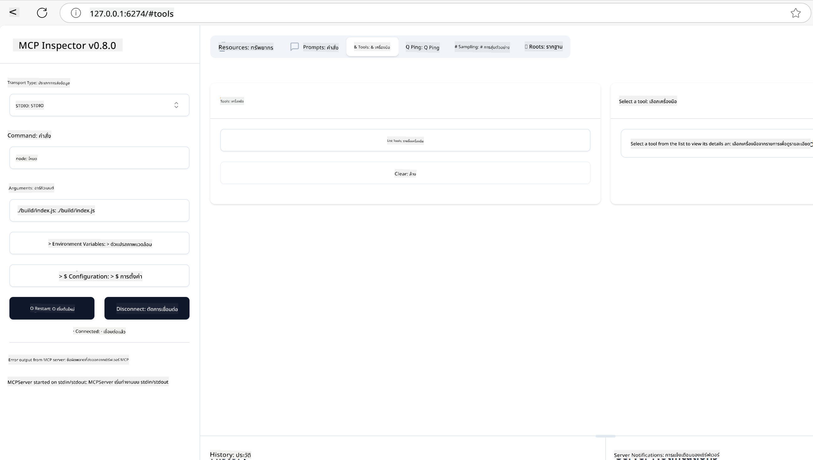
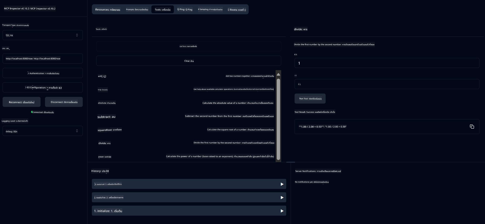
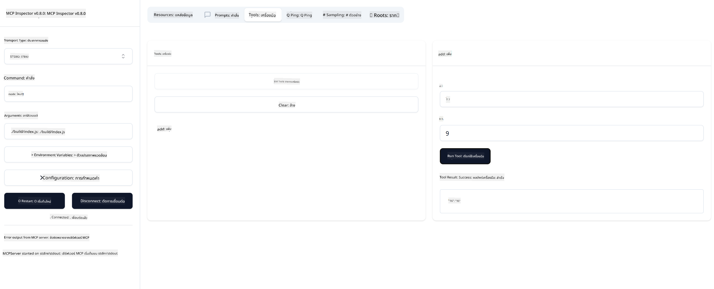

<!--
CO_OP_TRANSLATOR_METADATA:
{
  "original_hash": "ec11ee93f31fdadd94facd3e3d22f9e6",
  "translation_date": "2025-09-09T21:53:52+00:00",
  "source_file": "03-GettingStarted/01-first-server/README.md",
  "language_code": "th"
}
-->
# เริ่มต้นใช้งาน MCP

ยินดีต้อนรับสู่ขั้นตอนแรกของคุณกับ Model Context Protocol (MCP)! ไม่ว่าคุณจะเป็นมือใหม่หรือกำลังมองหาวิธีเพิ่มความเข้าใจใน MCP คู่มือนี้จะช่วยคุณตั้งค่าและพัฒนาได้อย่างง่ายดาย คุณจะได้เรียนรู้ว่า MCP ช่วยให้การเชื่อมต่อระหว่างโมเดล AI และแอปพลิเคชันเป็นไปอย่างราบรื่นได้อย่างไร และวิธีการเตรียมสภาพแวดล้อมของคุณเพื่อสร้างและทดสอบโซลูชันที่ใช้ MCP

> สรุปสั้นๆ: หากคุณสร้างแอป AI คุณสามารถเพิ่มเครื่องมือและทรัพยากรอื่นๆ ให้กับ LLM (large language model) เพื่อทำให้ LLM มีความรู้มากขึ้น แต่ถ้าคุณวางเครื่องมือและทรัพยากรเหล่านั้นไว้บนเซิร์ฟเวอร์ ความสามารถของแอปและเซิร์ฟเวอร์สามารถถูกใช้งานโดยไคลเอนต์ใดๆ ไม่ว่าจะมีหรือไม่มี LLM ก็ตาม

## ภาพรวม

บทเรียนนี้ให้คำแนะนำเชิงปฏิบัติในการตั้งค่าสภาพแวดล้อม MCP และการสร้างแอปพลิเคชัน MCP ครั้งแรกของคุณ คุณจะได้เรียนรู้วิธีการตั้งค่าเครื่องมือและเฟรมเวิร์กที่จำเป็น สร้างเซิร์ฟเวอร์ MCP พื้นฐาน สร้างแอปพลิเคชันโฮสต์ และทดสอบการใช้งานของคุณ

Model Context Protocol (MCP) เป็นโปรโตคอลแบบเปิดที่มาตรฐานการให้บริบทแก่ LLMs ลองนึกถึง MCP เหมือนพอร์ต USB-C สำหรับแอปพลิเคชัน AI - มันให้วิธีการเชื่อมต่อโมเดล AI กับแหล่งข้อมูลและเครื่องมือที่แตกต่างกันในรูปแบบมาตรฐาน

## วัตถุประสงค์การเรียนรู้

เมื่อจบบทเรียนนี้ คุณจะสามารถ:

- ตั้งค่าสภาพแวดล้อมการพัฒนาสำหรับ MCP ในภาษา C#, Java, Python, TypeScript และ Rust
- สร้างและปรับใช้เซิร์ฟเวอร์ MCP พื้นฐานพร้อมฟีเจอร์ที่กำหนดเอง (ทรัพยากร, prompts และเครื่องมือ)
- สร้างแอปพลิเคชันโฮสต์ที่เชื่อมต่อกับเซิร์ฟเวอร์ MCP
- ทดสอบและแก้ไขข้อผิดพลาดในการใช้งาน MCP

## การตั้งค่าสภาพแวดล้อม MCP ของคุณ

ก่อนที่คุณจะเริ่มทำงานกับ MCP สิ่งสำคัญคือต้องเตรียมสภาพแวดล้อมการพัฒนาและเข้าใจขั้นตอนการทำงานพื้นฐาน ส่วนนี้จะช่วยคุณตั้งค่าเริ่มต้นเพื่อให้การเริ่มต้นใช้งาน MCP เป็นไปอย่างราบรื่น

### สิ่งที่ต้องเตรียม

ก่อนที่จะเริ่มพัฒนา MCP ตรวจสอบให้แน่ใจว่าคุณมี:

- **สภาพแวดล้อมการพัฒนา**: สำหรับภาษาที่คุณเลือก (C#, Java, Python, TypeScript หรือ Rust)
- **IDE/Editor**: Visual Studio, Visual Studio Code, IntelliJ, Eclipse, PyCharm หรือโปรแกรมแก้ไขโค้ดที่ทันสมัย
- **ตัวจัดการแพ็กเกจ**: NuGet, Maven/Gradle, pip, npm/yarn หรือ Cargo
- **API Keys**: สำหรับบริการ AI ที่คุณวางแผนจะใช้ในแอปพลิเคชันโฮสต์ของคุณ

## โครงสร้างเซิร์ฟเวอร์ MCP พื้นฐาน

เซิร์ฟเวอร์ MCP โดยทั่วไปประกอบด้วย:

- **การตั้งค่าเซิร์ฟเวอร์**: การตั้งค่าพอร์ต การตรวจสอบสิทธิ์ และการตั้งค่าอื่นๆ
- **ทรัพยากร**: ข้อมูลและบริบทที่สามารถเข้าถึงได้โดย LLMs
- **เครื่องมือ**: ฟังก์ชันที่โมเดลสามารถเรียกใช้งานได้
- **Prompts**: เทมเพลตสำหรับการสร้างหรือจัดโครงสร้างข้อความ

ตัวอย่างง่ายๆ ใน TypeScript:

```typescript
import { McpServer, ResourceTemplate } from "@modelcontextprotocol/sdk/server/mcp.js";
import { StdioServerTransport } from "@modelcontextprotocol/sdk/server/stdio.js";
import { z } from "zod";

// Create an MCP server
const server = new McpServer({
  name: "Demo",
  version: "1.0.0"
});

// Add an addition tool
server.tool("add",
  { a: z.number(), b: z.number() },
  async ({ a, b }) => ({
    content: [{ type: "text", text: String(a + b) }]
  })
);

// Add a dynamic greeting resource
server.resource(
  "file",
  // The 'list' parameter controls how the resource lists available files. Setting it to undefined disables listing for this resource.
  new ResourceTemplate("file://{path}", { list: undefined }),
  async (uri, { path }) => ({
    contents: [{
      uri: uri.href,
      text: `File, ${path}!`
    }]
  })
);

// Add a file resource that reads the file contents
server.resource(
  "file",
  new ResourceTemplate("file://{path}", { list: undefined }),
  async (uri, { path }) => {
    let text;
    try {
      text = await fs.readFile(path, "utf8");
    } catch (err) {
      text = `Error reading file: ${err.message}`;
    }
    return {
      contents: [{
        uri: uri.href,
        text
      }]
    };
  }
);

server.prompt(
  "review-code",
  { code: z.string() },
  ({ code }) => ({
    messages: [{
      role: "user",
      content: {
        type: "text",
        text: `Please review this code:\n\n${code}`
      }
    }]
  })
);

// Start receiving messages on stdin and sending messages on stdout
const transport = new StdioServerTransport();
await server.connect(transport);
```

ในโค้ดข้างต้นเรา:

- นำเข้าคลาสที่จำเป็นจาก MCP TypeScript SDK
- สร้างและตั้งค่าอินสแตนซ์เซิร์ฟเวอร์ MCP ใหม่
- ลงทะเบียนเครื่องมือที่กำหนดเอง (`calculator`) พร้อมฟังก์ชัน handler
- เริ่มเซิร์ฟเวอร์เพื่อรอรับคำขอ MCP ที่เข้ามา

## การทดสอบและแก้ไขข้อผิดพลาด

ก่อนที่คุณจะเริ่มทดสอบเซิร์ฟเวอร์ MCP ของคุณ สิ่งสำคัญคือต้องเข้าใจเครื่องมือที่มีอยู่และแนวทางปฏิบัติที่ดีที่สุดสำหรับการแก้ไขข้อผิดพลาด การทดสอบที่มีประสิทธิภาพช่วยให้เซิร์ฟเวอร์ของคุณทำงานตามที่คาดหวังและช่วยให้คุณระบุและแก้ไขปัญหาได้อย่างรวดเร็ว ส่วนต่อไปนี้จะสรุปวิธีการที่แนะนำสำหรับการตรวจสอบการใช้งาน MCP ของคุณ

MCP มีเครื่องมือที่ช่วยคุณทดสอบและแก้ไขข้อผิดพลาดของเซิร์ฟเวอร์:

- **Inspector tool**: อินเทอร์เฟซกราฟิกที่ช่วยให้คุณเชื่อมต่อกับเซิร์ฟเวอร์และทดสอบเครื่องมือ, prompts และทรัพยากร
- **curl**: คุณสามารถเชื่อมต่อกับเซิร์ฟเวอร์โดยใช้เครื่องมือบรรทัดคำสั่ง เช่น curl หรือไคลเอนต์อื่นๆ ที่สามารถสร้างและเรียกใช้คำสั่ง HTTP

### การใช้ MCP Inspector

[MCP Inspector](https://github.com/modelcontextprotocol/inspector) เป็นเครื่องมือทดสอบแบบภาพที่ช่วยคุณ:

1. **ค้นหาความสามารถของเซิร์ฟเวอร์**: ตรวจจับทรัพยากร เครื่องมือ และ prompts ที่มีอยู่โดยอัตโนมัติ
2. **ทดสอบการทำงานของเครื่องมือ**: ลองใช้พารามิเตอร์ต่างๆ และดูการตอบสนองแบบเรียลไทม์
3. **ดูข้อมูลเมตาของเซิร์ฟเวอร์**: ตรวจสอบข้อมูลเซิร์ฟเวอร์ สคีมา และการตั้งค่า

```bash
# ex TypeScript, installing and running MCP Inspector
npx @modelcontextprotocol/inspector node build/index.js
```

เมื่อคุณรันคำสั่งข้างต้น MCP Inspector จะเปิดอินเทอร์เฟซเว็บในเครื่องในเบราว์เซอร์ของคุณ คุณจะเห็นแดชบอร์ดที่แสดงเซิร์ฟเวอร์ MCP ที่ลงทะเบียนไว้ เครื่องมือ ทรัพยากร และ prompts ที่มีอยู่ อินเทอร์เฟซช่วยให้คุณทดสอบการทำงานของเครื่องมือ ตรวจสอบข้อมูลเมตาของเซิร์ฟเวอร์ และดูการตอบสนองแบบเรียลไทม์ ทำให้การตรวจสอบและแก้ไขข้อผิดพลาดของการใช้งานเซิร์ฟเวอร์ MCP ง่ายขึ้น

นี่คือตัวอย่างหน้าจอที่อาจปรากฏ:



## ปัญหาการตั้งค่าที่พบบ่อยและวิธีแก้ไข

| ปัญหา | วิธีแก้ไขที่เป็นไปได้ |
|-------|-------------------|
| การเชื่อมต่อถูกปฏิเสธ | ตรวจสอบว่าเซิร์ฟเวอร์กำลังทำงานและพอร์ตถูกต้อง |
| ข้อผิดพลาดในการเรียกใช้เครื่องมือ | ตรวจสอบการตรวจสอบพารามิเตอร์และการจัดการข้อผิดพลาด |
| การตรวจสอบสิทธิ์ล้มเหลว | ตรวจสอบ API keys และสิทธิ์ |
| ข้อผิดพลาดในการตรวจสอบสคีมา | ตรวจสอบให้แน่ใจว่าพารามิเตอร์ตรงกับสคีมาที่กำหนด |
| เซิร์ฟเวอร์ไม่เริ่มต้น | ตรวจสอบความขัดแย้งของพอร์ตหรือการพึ่งพาที่ขาดหายไป |
| ข้อผิดพลาด CORS | ตั้งค่าหัวข้อ CORS ที่เหมาะสมสำหรับคำขอข้ามต้นทาง |
| ปัญหาการตรวจสอบสิทธิ์ | ตรวจสอบความถูกต้องของโทเค็นและสิทธิ์ |

## การพัฒนาในเครื่อง

สำหรับการพัฒนาและทดสอบในเครื่อง คุณสามารถรันเซิร์ฟเวอร์ MCP บนเครื่องของคุณได้โดยตรง:

1. **เริ่มกระบวนการเซิร์ฟเวอร์**: รันแอปพลิเคชันเซิร์ฟเวอร์ MCP ของคุณ
2. **ตั้งค่าเครือข่าย**: ตรวจสอบให้แน่ใจว่าเซิร์ฟเวอร์สามารถเข้าถึงได้บนพอร์ตที่คาดหวัง
3. **เชื่อมต่อไคลเอนต์**: ใช้ URL การเชื่อมต่อในเครื่อง เช่น `http://localhost:3000`

```bash
# Example: Running a TypeScript MCP server locally
npm run start
# Server running at http://localhost:3000
```

## การสร้างเซิร์ฟเวอร์ MCP ครั้งแรกของคุณ

เราได้ครอบคลุม [แนวคิดหลัก](/01-CoreConcepts/README.md) ในบทเรียนก่อนหน้า ตอนนี้ถึงเวลานำความรู้นั้นไปใช้จริง

### สิ่งที่เซิร์ฟเวอร์สามารถทำได้

ก่อนที่เราจะเริ่มเขียนโค้ด ลองมาทบทวนกันว่าเซิร์ฟเวอร์สามารถทำอะไรได้บ้าง:

เซิร์ฟเวอร์ MCP สามารถ:

- เข้าถึงไฟล์และฐานข้อมูลในเครื่อง
- เชื่อมต่อกับ API ระยะไกล
- ทำการคำนวณ
- รวมเข้ากับเครื่องมือและบริการอื่นๆ
- ให้ส่วนติดต่อผู้ใช้สำหรับการโต้ตอบ

เยี่ยมเลย ตอนนี้เรารู้แล้วว่าเราสามารถทำอะไรได้บ้าง มาลงมือเขียนโค้ดกันเถอะ

## แบบฝึกหัด: การสร้างเซิร์ฟเวอร์

ในการสร้างเซิร์ฟเวอร์ คุณต้องทำตามขั้นตอนต่อไปนี้:

- ติดตั้ง MCP SDK
- สร้างโปรเจกต์และตั้งค่าโครงสร้างโปรเจกต์
- เขียนโค้ดเซิร์ฟเวอร์
- ทดสอบเซิร์ฟเวอร์

### -1- สร้างโปรเจกต์

#### TypeScript

```sh
# Create project directory and initialize npm project
mkdir calculator-server
cd calculator-server
npm init -y
```

#### Python

```sh
# Create project dir
mkdir calculator-server
cd calculator-server
# Open the folder in Visual Studio Code - Skip this if you are using a different IDE
code .
```

#### .NET

```sh
dotnet new console -n McpCalculatorServer
cd McpCalculatorServer
```

#### Java

สำหรับ Java สร้างโปรเจกต์ Spring Boot:

```bash
curl https://start.spring.io/starter.zip \
  -d dependencies=web \
  -d javaVersion=21 \
  -d type=maven-project \
  -d groupId=com.example \
  -d artifactId=calculator-server \
  -d name=McpServer \
  -d packageName=com.microsoft.mcp.sample.server \
  -o calculator-server.zip
```

แตกไฟล์ zip:

```bash
unzip calculator-server.zip -d calculator-server
cd calculator-server
# optional remove the unused test
rm -rf src/test/java
```

เพิ่มการตั้งค่าที่สมบูรณ์ลงในไฟล์ *pom.xml* ของคุณ:

```xml
<?xml version="1.0" encoding="UTF-8"?>
<project xmlns="http://maven.apache.org/POM/4.0.0"
    xmlns:xsi="http://www.w3.org/2001/XMLSchema-instance"
    xsi:schemaLocation="http://maven.apache.org/POM/4.0.0 http://maven.apache.org/xsd/maven-4.0.0.xsd">
    <modelVersion>4.0.0</modelVersion>
    
    <!-- Spring Boot parent for dependency management -->
    <parent>
        <groupId>org.springframework.boot</groupId>
        <artifactId>spring-boot-starter-parent</artifactId>
        <version>3.5.0</version>
        <relativePath />
    </parent>

    <!-- Project coordinates -->
    <groupId>com.example</groupId>
    <artifactId>calculator-server</artifactId>
    <version>0.0.1-SNAPSHOT</version>
    <name>Calculator Server</name>
    <description>Basic calculator MCP service for beginners</description>

    <!-- Properties -->
    <properties>
        <java.version>21</java.version>
        <maven.compiler.source>21</maven.compiler.source>
        <maven.compiler.target>21</maven.compiler.target>
    </properties>

    <!-- Spring AI BOM for version management -->
    <dependencyManagement>
        <dependencies>
            <dependency>
                <groupId>org.springframework.ai</groupId>
                <artifactId>spring-ai-bom</artifactId>
                <version>1.0.0-SNAPSHOT</version>
                <type>pom</type>
                <scope>import</scope>
            </dependency>
        </dependencies>
    </dependencyManagement>

    <!-- Dependencies -->
    <dependencies>
        <dependency>
            <groupId>org.springframework.ai</groupId>
            <artifactId>spring-ai-starter-mcp-server-webflux</artifactId>
        </dependency>
        <dependency>
            <groupId>org.springframework.boot</groupId>
            <artifactId>spring-boot-starter-actuator</artifactId>
        </dependency>
        <dependency>
         <groupId>org.springframework.boot</groupId>
         <artifactId>spring-boot-starter-test</artifactId>
         <scope>test</scope>
      </dependency>
    </dependencies>

    <!-- Build configuration -->
    <build>
        <plugins>
            <plugin>
                <groupId>org.springframework.boot</groupId>
                <artifactId>spring-boot-maven-plugin</artifactId>
            </plugin>
            <plugin>
                <groupId>org.apache.maven.plugins</groupId>
                <artifactId>maven-compiler-plugin</artifactId>
                <configuration>
                    <release>21</release>
                </configuration>
            </plugin>
        </plugins>
    </build>

    <!-- Repositories for Spring AI snapshots -->
    <repositories>
        <repository>
            <id>spring-milestones</id>
            <name>Spring Milestones</name>
            <url>https://repo.spring.io/milestone</url>
            <snapshots>
                <enabled>false</enabled>
            </snapshots>
        </repository>
        <repository>
            <id>spring-snapshots</id>
            <name>Spring Snapshots</name>
            <url>https://repo.spring.io/snapshot</url>
            <releases>
                <enabled>false</enabled>
            </releases>
        </repository>
    </repositories>
</project>
```

#### Rust

```sh
mkdir calculator-server
cd calculator-server
cargo init
```

### -2- เพิ่ม dependencies

ตอนนี้คุณสร้างโปรเจกต์แล้ว มาลง dependencies กันต่อ:

#### TypeScript

```sh
# If not already installed, install TypeScript globally
npm install typescript -g

# Install the MCP SDK and Zod for schema validation
npm install @modelcontextprotocol/sdk zod
npm install -D @types/node typescript
```

#### Python

```sh
# Create a virtual env and install dependencies
python -m venv venv
venv\Scripts\activate
pip install "mcp[cli]"
```

#### Java

```bash
cd calculator-server
./mvnw clean install -DskipTests
```

#### Rust

```sh
cargo add rmcp --features server,transport-io
cargo add serde
cargo add tokio --features rt-multi-thread
```

### -3- สร้างไฟล์โปรเจกต์

#### TypeScript

เปิดไฟล์ *package.json* และแทนที่เนื้อหาด้วยสิ่งต่อไปนี้เพื่อให้แน่ใจว่าคุณสามารถสร้างและรันเซิร์ฟเวอร์ได้:

```json
{
  "name": "calculator-server",
  "version": "1.0.0",
  "main": "index.js",
  "type": "module",
  "scripts": {
    "start": "tsc && node ./build/index.js",
    "build": "tsc && node ./build/index.js"
  },
  "keywords": [],
  "author": "",
  "license": "ISC",
  "description": "A simple calculator server using Model Context Protocol",
  "dependencies": {
    "@modelcontextprotocol/sdk": "^1.16.0",
    "zod": "^3.25.76"
  },
  "devDependencies": {
    "@types/node": "^24.0.14",
    "typescript": "^5.8.3"
  }
}
```

สร้างไฟล์ *tsconfig.json* ด้วยเนื้อหาต่อไปนี้:

```json
{
  "compilerOptions": {
    "target": "ES2022",
    "module": "Node16",
    "moduleResolution": "Node16",
    "outDir": "./build",
    "rootDir": "./src",
    "strict": true,
    "esModuleInterop": true,
    "skipLibCheck": true,
    "forceConsistentCasingInFileNames": true
  },
  "include": ["src/**/*"],
  "exclude": ["node_modules"]
}
```

สร้างไดเรกทอรีสำหรับโค้ดต้นฉบับของคุณ:

```sh
mkdir src
touch src/index.ts
```

#### Python

สร้างไฟล์ *server.py*

```sh
touch server.py
```

#### .NET

ติดตั้งแพ็กเกจ NuGet ที่จำเป็น:

```sh
dotnet add package ModelContextProtocol --prerelease
dotnet add package Microsoft.Extensions.Hosting
```

#### Java

สำหรับโปรเจกต์ Java Spring Boot โครงสร้างโปรเจกต์จะถูกสร้างขึ้นโดยอัตโนมัติ

#### Rust

สำหรับ Rust ไฟล์ *src/main.rs* จะถูกสร้างขึ้นโดยค่าเริ่มต้นเมื่อคุณรัน `cargo init` เปิดไฟล์และลบโค้ดเริ่มต้น

### -4- เขียนโค้ดเซิร์ฟเวอร์

#### TypeScript

สร้างไฟล์ *index.ts* และเพิ่มโค้ดต่อไปนี้:

```typescript
import { McpServer, ResourceTemplate } from "@modelcontextprotocol/sdk/server/mcp.js";
import { StdioServerTransport } from "@modelcontextprotocol/sdk/server/stdio.js";
import { z } from "zod";
 
// Create an MCP server
const server = new McpServer({
  name: "Calculator MCP Server",
  version: "1.0.0"
});
```

ตอนนี้คุณมีเซิร์ฟเวอร์แล้ว แต่ยังทำอะไรไม่ได้มาก มาปรับปรุงกัน

#### Python

```python
# server.py
from mcp.server.fastmcp import FastMCP

# Create an MCP server
mcp = FastMCP("Demo")
```

#### .NET

```csharp
using Microsoft.Extensions.DependencyInjection;
using Microsoft.Extensions.Hosting;
using Microsoft.Extensions.Logging;
using ModelContextProtocol.Server;
using System.ComponentModel;

var builder = Host.CreateApplicationBuilder(args);
builder.Logging.AddConsole(consoleLogOptions =>
{
    // Configure all logs to go to stderr
    consoleLogOptions.LogToStandardErrorThreshold = LogLevel.Trace;
});

builder.Services
    .AddMcpServer()
    .WithStdioServerTransport()
    .WithToolsFromAssembly();
await builder.Build().RunAsync();

// add features
```

#### Java

สำหรับ Java สร้างส่วนประกอบเซิร์ฟเวอร์หลัก เริ่มต้นด้วยการแก้ไขคลาสแอปพลิเคชันหลัก:

*src/main/java/com/microsoft/mcp/sample/server/McpServerApplication.java*:

```java
package com.microsoft.mcp.sample.server;

import org.springframework.ai.tool.ToolCallbackProvider;
import org.springframework.ai.tool.method.MethodToolCallbackProvider;
import org.springframework.boot.SpringApplication;
import org.springframework.boot.autoconfigure.SpringBootApplication;
import org.springframework.context.annotation.Bean;
import com.microsoft.mcp.sample.server.service.CalculatorService;

@SpringBootApplication
public class McpServerApplication {

    public static void main(String[] args) {
        SpringApplication.run(McpServerApplication.class, args);
    }
    
    @Bean
    public ToolCallbackProvider calculatorTools(CalculatorService calculator) {
        return MethodToolCallbackProvider.builder().toolObjects(calculator).build();
    }
}
```

สร้างบริการ calculator *src/main/java/com/microsoft/mcp/sample/server/service/CalculatorService.java*:

```java
package com.microsoft.mcp.sample.server.service;

import org.springframework.ai.tool.annotation.Tool;
import org.springframework.stereotype.Service;

/**
 * Service for basic calculator operations.
 * This service provides simple calculator functionality through MCP.
 */
@Service
public class CalculatorService {

    /**
     * Add two numbers
     * @param a The first number
     * @param b The second number
     * @return The sum of the two numbers
     */
    @Tool(description = "Add two numbers together")
    public String add(double a, double b) {
        double result = a + b;
        return formatResult(a, "+", b, result);
    }

    /**
     * Subtract one number from another
     * @param a The number to subtract from
     * @param b The number to subtract
     * @return The result of the subtraction
     */
    @Tool(description = "Subtract the second number from the first number")
    public String subtract(double a, double b) {
        double result = a - b;
        return formatResult(a, "-", b, result);
    }

    /**
     * Multiply two numbers
     * @param a The first number
     * @param b The second number
     * @return The product of the two numbers
     */
    @Tool(description = "Multiply two numbers together")
    public String multiply(double a, double b) {
        double result = a * b;
        return formatResult(a, "*", b, result);
    }

    /**
     * Divide one number by another
     * @param a The numerator
     * @param b The denominator
     * @return The result of the division
     */
    @Tool(description = "Divide the first number by the second number")
    public String divide(double a, double b) {
        if (b == 0) {
            return "Error: Cannot divide by zero";
        }
        double result = a / b;
        return formatResult(a, "/", b, result);
    }

    /**
     * Calculate the power of a number
     * @param base The base number
     * @param exponent The exponent
     * @return The result of raising the base to the exponent
     */
    @Tool(description = "Calculate the power of a number (base raised to an exponent)")
    public String power(double base, double exponent) {
        double result = Math.pow(base, exponent);
        return formatResult(base, "^", exponent, result);
    }

    /**
     * Calculate the square root of a number
     * @param number The number to find the square root of
     * @return The square root of the number
     */
    @Tool(description = "Calculate the square root of a number")
    public String squareRoot(double number) {
        if (number < 0) {
            return "Error: Cannot calculate square root of a negative number";
        }
        double result = Math.sqrt(number);
        return String.format("√%.2f = %.2f", number, result);
    }

    /**
     * Calculate the modulus (remainder) of division
     * @param a The dividend
     * @param b The divisor
     * @return The remainder of the division
     */
    @Tool(description = "Calculate the remainder when one number is divided by another")
    public String modulus(double a, double b) {
        if (b == 0) {
            return "Error: Cannot divide by zero";
        }
        double result = a % b;
        return formatResult(a, "%", b, result);
    }

    /**
     * Calculate the absolute value of a number
     * @param number The number to find the absolute value of
     * @return The absolute value of the number
     */
    @Tool(description = "Calculate the absolute value of a number")
    public String absolute(double number) {
        double result = Math.abs(number);
        return String.format("|%.2f| = %.2f", number, result);
    }

    /**
     * Get help about available calculator operations
     * @return Information about available operations
     */
    @Tool(description = "Get help about available calculator operations")
    public String help() {
        return "Basic Calculator MCP Service\n\n" +
               "Available operations:\n" +
               "1. add(a, b) - Adds two numbers\n" +
               "2. subtract(a, b) - Subtracts the second number from the first\n" +
               "3. multiply(a, b) - Multiplies two numbers\n" +
               "4. divide(a, b) - Divides the first number by the second\n" +
               "5. power(base, exponent) - Raises a number to a power\n" +
               "6. squareRoot(number) - Calculates the square root\n" + 
               "7. modulus(a, b) - Calculates the remainder of division\n" +
               "8. absolute(number) - Calculates the absolute value\n\n" +
               "Example usage: add(5, 3) will return 5 + 3 = 8";
    }

    /**
     * Format the result of a calculation
     */
    private String formatResult(double a, String operator, double b, double result) {
        return String.format("%.2f %s %.2f = %.2f", a, operator, b, result);
    }
}
```

**ส่วนประกอบเพิ่มเติมสำหรับบริการที่พร้อมใช้งานในระดับ production:**

สร้างการตั้งค่าเริ่มต้น *src/main/java/com/microsoft/mcp/sample/server/config/StartupConfig.java*:

```java
package com.microsoft.mcp.sample.server.config;

import org.springframework.boot.CommandLineRunner;
import org.springframework.context.annotation.Bean;
import org.springframework.context.annotation.Configuration;

@Configuration
public class StartupConfig {
    
    @Bean
    public CommandLineRunner startupInfo() {
        return args -> {
            System.out.println("\n" + "=".repeat(60));
            System.out.println("Calculator MCP Server is starting...");
            System.out.println("SSE endpoint: http://localhost:8080/sse");
            System.out.println("Health check: http://localhost:8080/actuator/health");
            System.out.println("=".repeat(60) + "\n");
        };
    }
}
```

สร้างตัวควบคุม health *src/main/java/com/microsoft/mcp/sample/server/controller/HealthController.java*:

```java
package com.microsoft.mcp.sample.server.controller;

import org.springframework.http.ResponseEntity;
import org.springframework.web.bind.annotation.GetMapping;
import org.springframework.web.bind.annotation.RestController;
import java.time.LocalDateTime;
import java.util.HashMap;
import java.util.Map;

@RestController
public class HealthController {
    
    @GetMapping("/health")
    public ResponseEntity<Map<String, Object>> healthCheck() {
        Map<String, Object> response = new HashMap<>();
        response.put("status", "UP");
        response.put("timestamp", LocalDateTime.now().toString());
        response.put("service", "Calculator MCP Server");
        return ResponseEntity.ok(response);
    }
}
```

สร้างตัวจัดการข้อยกเว้น *src/main/java/com/microsoft/mcp/sample/server/exception/GlobalExceptionHandler.java*:

```java
package com.microsoft.mcp.sample.server.exception;

import org.springframework.http.HttpStatus;
import org.springframework.http.ResponseEntity;
import org.springframework.web.bind.annotation.ExceptionHandler;
import org.springframework.web.bind.annotation.RestControllerAdvice;

@RestControllerAdvice
public class GlobalExceptionHandler {

    @ExceptionHandler(IllegalArgumentException.class)
    public ResponseEntity<ErrorResponse> handleIllegalArgumentException(IllegalArgumentException ex) {
        ErrorResponse error = new ErrorResponse(
            "Invalid_Input", 
            "Invalid input parameter: " + ex.getMessage());
        return new ResponseEntity<>(error, HttpStatus.BAD_REQUEST);
    }

    public static class ErrorResponse {
        private String code;
        private String message;

        public ErrorResponse(String code, String message) {
            this.code = code;
            this.message = message;
        }

        // Getters
        public String getCode() { return code; }
        public String getMessage() { return message; }
    }
}
```

สร้างแบนเนอร์ที่กำหนดเอง *src/main/resources/banner.txt*:

```text
_____      _            _       _             
 / ____|    | |          | |     | |            
| |     __ _| | ___ _   _| | __ _| |_ ___  _ __ 
| |    / _` | |/ __| | | | |/ _` | __/ _ \| '__|
| |___| (_| | | (__| |_| | | (_| | || (_) | |   
 \_____\__,_|_|\___|\__,_|_|\__,_|\__\___/|_|   
                                                
Calculator MCP Server v1.0
Spring Boot MCP Application
```

</details>

#### Rust

เพิ่มโค้ดต่อไปนี้ที่ด้านบนของไฟล์ *src/main.rs* ซึ่งจะนำเข้าห้องสมุดและโมดูลที่จำเป็นสำหรับเซิร์ฟเวอร์ MCP ของคุณ

```rust
use rmcp::{
    handler::server::{router::tool::ToolRouter, tool::Parameters},
    model::{ServerCapabilities, ServerInfo},
    schemars, tool, tool_handler, tool_router,
    transport::stdio,
    ServerHandler, ServiceExt,
};
use std::error::Error;
```

เซิร์ฟเวอร์ calculator จะเป็นเซิร์ฟเวอร์ง่ายๆ ที่สามารถบวกตัวเลขสองตัวเข้าด้วยกัน มาสร้าง struct เพื่อแสดงคำขอ calculator กัน

```rust
#[derive(Debug, serde::Deserialize, schemars::JsonSchema)]
pub struct CalculatorRequest {
    pub a: f64,
    pub b: f64,
}
```

ต่อไป สร้าง struct เพื่อแสดงเซิร์ฟเวอร์ calculator struct นี้จะเก็บ router เครื่องมือ ซึ่งใช้สำหรับลงทะเบียนเครื่องมือ

```rust
#[derive(Debug, Clone)]
pub struct Calculator {
    tool_router: ToolRouter<Self>,
}
```

ตอนนี้เราสามารถ implement struct `Calculator` เพื่อสร้างอินสแตนซ์ใหม่ของเซิร์ฟเวอร์และ implement handler เซิร์ฟเวอร์เพื่อให้ข้อมูลเกี่ยวกับเซิร์ฟเวอร์

```rust
#[tool_router]
impl Calculator {
    pub fn new() -> Self {
        Self {
            tool_router: Self::tool_router(),
        }
    }
}

#[tool_handler]
impl ServerHandler for Calculator {
    fn get_info(&self) -> ServerInfo {
        ServerInfo {
            instructions: Some("A simple calculator tool".into()),
            capabilities: ServerCapabilities::builder().enable_tools().build(),
            ..Default::default()
        }
    }
}
```

สุดท้าย เราต้อง implement ฟังก์ชัน main เพื่อเริ่มเซิร์ฟเวอร์ ฟังก์ชันนี้จะสร้างอินสแตนซ์ของ struct `Calculator` และให้บริการผ่าน input/output มาตรฐาน

```rust
#[tokio::main]
async fn main() -> Result<(), Box<dyn Error>> {
    let service = Calculator::new().serve(stdio()).await?;
    service.waiting().await?;
    Ok(())
}
```

เซิร์ฟเวอร์ตอนนี้ถูกตั้งค่าให้ให้ข้อมูลพื้นฐานเกี่ยวกับตัวเอง ต่อไปเราจะเพิ่มเครื่องมือเพื่อทำการบวก

### -5- การเพิ่มเครื่องมือและทรัพยากร

เพิ่มเครื่องมือและทรัพยากรโดยเพิ่มโค้ดต่อไปนี้:

#### TypeScript

```typescript
server.tool(
  "add",
  { a: z.number(), b: z.number() },
  async ({ a, b }) => ({
    content: [{ type: "text", text: String(a + b) }]
  })
);

server.resource(
  "greeting",
  new ResourceTemplate("greeting://{name}", { list: undefined }),
  async (uri, { name }) => ({
    contents: [{
      uri: uri.href,
      text: `Hello, ${name}!`
    }]
  })
);
```

เครื่องมือของคุณรับพารามิเตอร์ `a` และ `b` และรันฟังก์ชันที่สร้างการตอบสนองในรูปแบบ:

```typescript
{
  contents: [{
    type: "text", content: "some content"
  }]
}
```

ทรัพยากรของคุณสามารถเข้าถึงได้ผ่านสตริง "greeting" และรับพารามิเตอร์ `name` และสร้างการตอบสนองที่คล้ายกับเครื่องมือ:

```typescript
{
  uri: "<href>",
  text: "a text"
}
```

#### Python

```python
# Add an addition tool
@mcp.tool()
def add(a: int, b: int) -> int:
    """Add two numbers"""
    return a + b


# Add a dynamic greeting resource
@mcp.resource("greeting://{name}")
def get_greeting(name: str) -> str:
    """Get a personalized greeting"""
    return f"Hello, {name}!"
```

ในโค้ดข้างต้นเรา:

- กำหนดเครื่องมือ `add` ที่รับพารามิเตอร์ `a` และ `p` ซึ่งเป็นตัวเลขทั้งคู่
- สร้างทรัพยากรชื่อ `greeting` ที่รับพารามิเตอร์ `name`

#### .NET

เพิ่มสิ่งนี้ในไฟล์ Program.cs ของคุณ:

```csharp
[McpServerToolType]
public static class CalculatorTool
{
    [McpServerTool, Description("Adds two numbers")]
    public static string Add(int a, int b) => $"Sum {a + b}";
}
```

#### Java

เครื่องมือถูกสร้างขึ้นแล้วในขั้นตอนก่อนหน้า

#### Rust

เพิ่มเครื่องมือใหม่ภายในบล็อก `impl Calculator`:

```rust
#[tool(description = "Adds a and b")]
async fn add(
    &self,
    Parameters(CalculatorRequest { a, b }): Parameters<CalculatorRequest>,
) -> String {
    (a + b).to_string()
}
```

### -6- โค้ดสุดท้าย

มาลงโค้ดสุดท้ายที่เราต้องการเพื่อให้เซิร์ฟเวอร์เริ่มต้นได้:

#### TypeScript

```typescript
// Start receiving messages on stdin and sending messages on stdout
const transport = new StdioServerTransport();
await server.connect(transport);
```

นี่คือโค้ดทั้งหมด:

```typescript
// index.ts
import { McpServer, ResourceTemplate } from "@modelcontextprotocol/sdk/server/mcp.js";
import { StdioServerTransport } from "@modelcontextprotocol/sdk/server/stdio.js";
import { z } from "zod";

// Create an MCP server
const server = new McpServer({
  name: "Calculator MCP Server",
  version: "1.0.0"
});

// Add an addition tool
server.tool(
  "add",
  { a: z.number(), b: z.number() },
  async ({ a, b }) => ({
    content: [{ type: "text", text: String(a + b) }]
  })
);

// Add a dynamic greeting resource
server.resource(
  "greeting",
  new ResourceTemplate("greeting://{name}", { list: undefined }),
  async (uri, { name }) => ({
    contents: [{
      uri: uri.href,
      text: `Hello, ${name}!`
    }]
  })
);

// Start receiving messages on stdin and sending messages on stdout
const transport = new StdioServerTransport();
server.connect(transport);
```

#### Python

```python
# server.py
from mcp.server.fastmcp import FastMCP

# Create an MCP server
mcp = FastMCP("Demo")


# Add an addition tool
@mcp.tool()
def add(a: int, b: int) -> int:
    """Add two numbers"""
    return a + b


# Add a dynamic greeting resource
@mcp.resource("greeting://{name}")
def get_greeting(name: str) -> str:
    """Get a personalized greeting"""
    return f"Hello, {name}!"

# Main execution block - this is required to run the server
if __name__ == "__main__":
    mcp.run()
```

#### .NET

สร้างไฟล์ Program.cs ด้วยเนื้อหาต่อไปนี้:

```csharp
using Microsoft.Extensions.DependencyInjection;
using Microsoft.Extensions.Hosting;
using Microsoft.Extensions.Logging;
using ModelContextProtocol.Server;
using System.ComponentModel;

var builder = Host.CreateApplicationBuilder(args);
builder.Logging.AddConsole(consoleLogOptions =>
{
    // Configure all logs to go to stderr
    consoleLogOptions.LogToStandardErrorThreshold = LogLevel.Trace;
});

builder.Services
    .AddMcpServer()
    .WithStdioServerTransport()
    .WithToolsFromAssembly();
await builder.Build().RunAsync();

[McpServerToolType]
public static class CalculatorTool
{
    [McpServerTool, Description("Adds two numbers")]
    public static string Add(int a, int b) => $"Sum {a + b}";
}
```

#### Java

คลาสแอปพลิเคชันหลักที่สมบูรณ์ของคุณควรมีลักษณะดังนี้:

```java
// McpServerApplication.java
package com.microsoft.mcp.sample.server;

import org.springframework.ai.tool.ToolCallbackProvider;
import org.springframework.ai.tool.method.MethodToolCallbackProvider;
import org.springframework.boot.SpringApplication;
import org.springframework.boot.autoconfigure.SpringBootApplication;
import org.springframework.context.annotation.Bean;
import com.microsoft.mcp.sample.server.service.CalculatorService;

@SpringBootApplication
public class McpServerApplication {

    public static void main(String[] args) {
        SpringApplication.run(McpServerApplication.class, args);
    }
    
    @Bean
    public ToolCallbackProvider calculatorTools(CalculatorService calculator) {
        return MethodToolCallbackProvider.builder().toolObjects(calculator).build();
    }
}
```

#### Rust

โค้ดสุดท้ายสำหรับเซิร์ฟเวอร์ Rust ควรมีลักษณะดังนี้:

```rust
use rmcp::{
    ServerHandler, ServiceExt,
    handler::server::{router::tool::ToolRouter, tool::Parameters},
    model::{ServerCapabilities, ServerInfo},
    schemars, tool, tool_handler, tool_router,
    transport::stdio,
};
use std::error::Error;

#[derive(Debug, serde::Deserialize, schemars::JsonSchema)]
pub struct CalculatorRequest {
    pub a: f64,
    pub b: f64,
}

#[derive(Debug, Clone)]
pub struct Calculator {
    tool_router: ToolRouter<Self>,
}

#[tool_router]
impl Calculator {
    pub fn new() -> Self {
        Self {
            tool_router: Self::tool_router(),
        }
    }
    
    #[tool(description = "Adds a and b")]
    async fn add(
        &self,
        Parameters(CalculatorRequest { a, b }): Parameters<CalculatorRequest>,
    ) -> String {
        (a + b).to_string()
    }
}

#[tool_handler]
impl ServerHandler for Calculator {
    fn get_info(&self) -> ServerInfo {
        ServerInfo {
            instructions: Some("A simple calculator tool".into()),
            capabilities: ServerCapabilities::builder().enable_tools().build(),
            ..Default::default()
        }
    }
}

#[tokio::main]
async fn main() -> Result<(), Box<dyn Error>> {
    let service = Calculator::new().serve(stdio()).await?;
    service.waiting().await?;
    Ok(())
}
```

### -7- ทดสอบเซิร์ฟเวอร์

เริ่มเซิร์ฟเวอร์ด้วยคำสั่งต่อไปนี้:

#### TypeScript

```sh
npm run build
```

#### Python

```sh
mcp run server.py
```

> เพื่อใช้ MCP Inspector ให้ใช้ `mcp dev server.py` ซึ่งจะเปิดตัว Inspector โดยอัตโนมัติและให้ session token proxy ที่จำเป็น หากใช้ `mcp run server.py` คุณจะต้องเริ่ม Inspector และตั้งค่าการเชื่อมต่อด้วยตนเอง

#### .NET

ตรวจสอบให้แน่ใจว่าคุณอยู่ในไดเรกทอรีโปรเจกต์ของคุณ:

```sh
cd McpCalculatorServer
dotnet run
```

#### Java

```bash
./mvnw clean install -DskipTests
java -jar target/calculator-server-0.0.1-SNAPSHOT.jar
```

#### Rust

รันคำสั่งต่อไปนี้เพื่อจัดรูปแบบและรันเซิร์ฟเวอร์:

```sh
cargo fmt
cargo run
```

### -8- รันโดยใช้ Inspector

Inspector เป็นเครื่องมือที่ยอดเยี่ยมที่สามารถเริ่มต้นเซิร์ฟเวอร์ของคุณและช่วยให้คุณโต้ตอบกับมันเพื่อทดสอบว่าใช้งานได้หรือไม่ มาลองเริ่มต้นกัน:

> [!NOTE]
> อาจดูแตกต่างในฟิลด์ "command" เนื่องจากมีคำสั่งสำหรับการรันเซิร์ฟเวอร์ด้วย runtime เฉพาะของคุณ

#### TypeScript

```sh
npx @modelcontextprotocol/inspector node build/index.js
```

หรือเพิ่มลงใน *package.json* ของคุณเช่นนี้: `"inspector": "npx @modelcontextprotocol/inspector node build/index.js"` และจากนั้นรัน `npm run inspector`

Python ใช้เครื่องมือ Node.js ที่เรียกว่า inspector สามารถเรียกใช้เครื่องมือดังกล่าวได้ดังนี้:

@@CODE


**คุณเชื่อมต่อกับเซิร์ฟเวอร์เรียบร้อยแล้ว**  
**ส่วนการทดสอบเซิร์ฟเวอร์ Java เสร็จสมบูรณ์แล้ว**

ส่วนถัดไปจะเกี่ยวกับการโต้ตอบกับเซิร์ฟเวอร์

คุณควรเห็นส่วนติดต่อผู้ใช้ดังนี้:


1. เชื่อมต่อกับเซิร์ฟเวอร์โดยเลือกปุ่ม Connect  
   เมื่อคุณเชื่อมต่อกับเซิร์ฟเวอร์แล้ว คุณควรเห็นดังนี้:

   

1. เลือก "Tools" และ "listTools" คุณควรเห็น "Add" ปรากฏขึ้น เลือก "Add" และกรอกค่าพารามิเตอร์

   คุณควรเห็นการตอบกลับดังนี้ ซึ่งเป็นผลลัพธ์จากเครื่องมือ "add":

   

ยินดีด้วย คุณได้สร้างและรันเซิร์ฟเวอร์แรกของคุณสำเร็จแล้ว!

#### Rust

ในการรันเซิร์ฟเวอร์ Rust ด้วย MCP Inspector CLI ให้ใช้คำสั่งต่อไปนี้:

```sh
npx @modelcontextprotocol/inspector cargo run --cli --method tools/call --tool-name add --tool-arg a=1 b=2
```

### SDK อย่างเป็นทางการ

MCP มี SDK อย่างเป็นทางการสำหรับหลายภาษา:

- [C# SDK](https://github.com/modelcontextprotocol/csharp-sdk) - ดูแลร่วมกับ Microsoft  
- [Java SDK](https://github.com/modelcontextprotocol/java-sdk) - ดูแลร่วมกับ Spring AI  
- [TypeScript SDK](https://github.com/modelcontextprotocol/typescript-sdk) - การใช้งาน TypeScript อย่างเป็นทางการ  
- [Python SDK](https://github.com/modelcontextprotocol/python-sdk) - การใช้งาน Python อย่างเป็นทางการ  
- [Kotlin SDK](https://github.com/modelcontextprotocol/kotlin-sdk) - การใช้งาน Kotlin อย่างเป็นทางการ  
- [Swift SDK](https://github.com/modelcontextprotocol/swift-sdk) - ดูแลร่วมกับ Loopwork AI  
- [Rust SDK](https://github.com/modelcontextprotocol/rust-sdk) - การใช้งาน Rust อย่างเป็นทางการ  

## สิ่งสำคัญที่ควรทราบ

- การตั้งค่าสภาพแวดล้อมการพัฒนา MCP ทำได้ง่ายด้วย SDK เฉพาะภาษา  
- การสร้างเซิร์ฟเวอร์ MCP เกี่ยวข้องกับการสร้างและลงทะเบียนเครื่องมือพร้อมสคีมาที่ชัดเจน  
- การทดสอบและดีบักเป็นสิ่งสำคัญสำหรับการใช้งาน MCP ที่เชื่อถือได้  

## ตัวอย่าง

- [Java Calculator](../samples/java/calculator/README.md)  
- [.Net Calculator](../../../../03-GettingStarted/samples/csharp)  
- [JavaScript Calculator](../samples/javascript/README.md)  
- [TypeScript Calculator](../samples/typescript/README.md)  
- [Python Calculator](../../../../03-GettingStarted/samples/python)  
- [Rust Calculator](../../../../03-GettingStarted/samples/rust)  

## งานที่ได้รับมอบหมาย

สร้างเซิร์ฟเวอร์ MCP แบบง่ายพร้อมเครื่องมือที่คุณเลือก:

1. สร้างเครื่องมือในภาษาที่คุณถนัด (.NET, Java, Python, TypeScript หรือ Rust)  
2. กำหนดพารามิเตอร์อินพุตและค่าที่ส่งกลับ  
3. รันเครื่องมือ Inspector เพื่อให้แน่ใจว่าเซิร์ฟเวอร์ทำงานตามที่ตั้งใจไว้  
4. ทดสอบการใช้งานด้วยอินพุตหลากหลายรูปแบบ  

## วิธีแก้ไข

[Solution](./solution/README.md)

## แหล่งข้อมูลเพิ่มเติม

- [สร้าง Agents ด้วย Model Context Protocol บน Azure](https://learn.microsoft.com/azure/developer/ai/intro-agents-mcp)  
- [Remote MCP ด้วย Azure Container Apps (Node.js/TypeScript/JavaScript)](https://learn.microsoft.com/samples/azure-samples/mcp-container-ts/mcp-container-ts/)  
- [.NET OpenAI MCP Agent](https://learn.microsoft.com/samples/azure-samples/openai-mcp-agent-dotnet/openai-mcp-agent-dotnet/)  

## สิ่งที่จะทำต่อไป

ถัดไป: [เริ่มต้นใช้งาน MCP Clients](../02-client/README.md)  

---

**ข้อจำกัดความรับผิดชอบ**:  
เอกสารนี้ได้รับการแปลโดยใช้บริการแปลภาษา AI [Co-op Translator](https://github.com/Azure/co-op-translator) แม้ว่าเราจะพยายามให้การแปลมีความถูกต้องมากที่สุด แต่โปรดทราบว่าการแปลอัตโนมัติอาจมีข้อผิดพลาดหรือความไม่ถูกต้อง เอกสารต้นฉบับในภาษาดั้งเดิมควรถือเป็นแหล่งข้อมูลที่เชื่อถือได้ สำหรับข้อมูลที่สำคัญ ขอแนะนำให้ใช้บริการแปลภาษามนุษย์ที่มีความเชี่ยวชาญ เราไม่รับผิดชอบต่อความเข้าใจผิดหรือการตีความผิดที่เกิดจากการใช้การแปลนี้