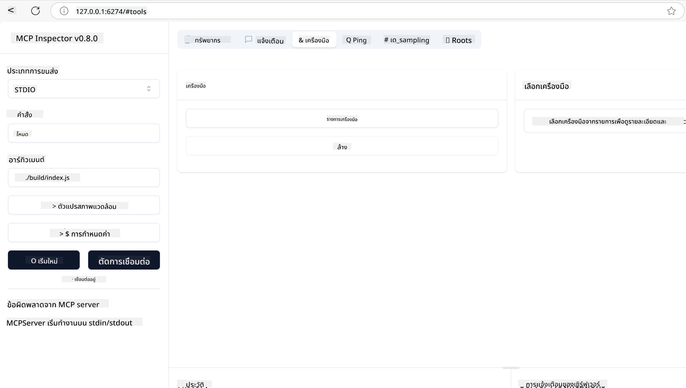
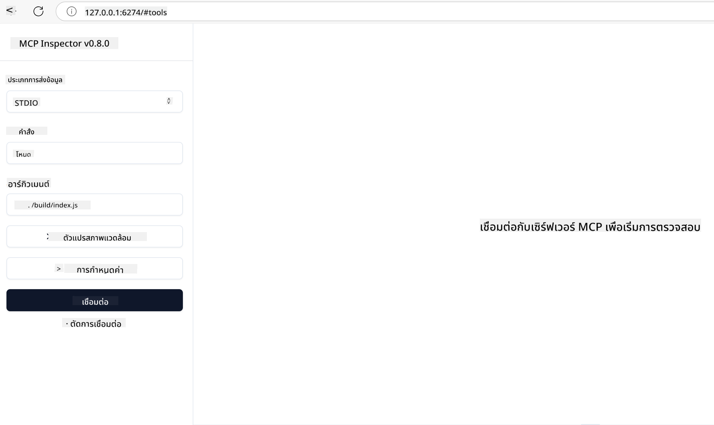

<!--
CO_OP_TRANSLATOR_METADATA:
{
  "original_hash": "5331ffd328a54b90f76706c52b673e27",
  "translation_date": "2025-05-17T08:37:43+00:00",
  "source_file": "03-GettingStarted/01-first-server/README.md",
  "language_code": "th"
}
-->
# เริ่มต้นกับ MCP

ยินดีต้อนรับสู่ขั้นตอนแรกของคุณกับ Model Context Protocol (MCP)! ไม่ว่าคุณจะเพิ่งเริ่มต้นหรือกำลังต้องการความเข้าใจที่ลึกซึ้งขึ้น คู่มือนี้จะนำคุณผ่านขั้นตอนสำคัญในการตั้งค่าและพัฒนา คุณจะได้ค้นพบว่า MCP ช่วยให้การผสานรวมระหว่างโมเดล AI และแอปพลิเคชันเป็นไปอย่างไร้รอยต่อ และเรียนรู้วิธีการเตรียมสภาพแวดล้อมของคุณอย่างรวดเร็วสำหรับการสร้างและทดสอบโซลูชันที่ใช้ MCP

> TLDR; หากคุณสร้างแอป AI คุณรู้ว่าคุณสามารถเพิ่มเครื่องมือและทรัพยากรอื่นๆ ให้กับ LLM (large language model) เพื่อทำให้ LLM มีความรู้มากขึ้น แต่ถ้าคุณวางเครื่องมือและทรัพยากรเหล่านั้นบนเซิร์ฟเวอร์ แอปและความสามารถของเซิร์ฟเวอร์สามารถถูกใช้โดยลูกค้าทุกคนได้ ไม่ว่าจะมีหรือไม่มี LLM

## ภาพรวม

บทเรียนนี้ให้คำแนะนำที่เป็นประโยชน์ในการตั้งค่าสภาพแวดล้อม MCP และสร้างแอปพลิเคชัน MCP แรกของคุณ คุณจะได้เรียนรู้วิธีการตั้งค่าเครื่องมือและเฟรมเวิร์กที่จำเป็น สร้างเซิร์ฟเวอร์ MCP พื้นฐาน สร้างแอปพลิเคชันโฮสต์ และทดสอบการใช้งานของคุณ

Model Context Protocol (MCP) เป็นโปรโตคอลเปิดที่มาตรฐานการให้บริบทแก่ LLMs คิดว่า MCP เหมือนกับพอร์ต USB-C สำหรับแอปพลิเคชัน AI - มันให้วิธีการมาตรฐานในการเชื่อมต่อโมเดล AI กับแหล่งข้อมูลและเครื่องมือต่างๆ

## วัตถุประสงค์การเรียนรู้

เมื่อจบบทเรียนนี้ คุณจะสามารถ:

- ตั้งค่าสภาพแวดล้อมการพัฒนาสำหรับ MCP ในภาษา C#, Java, Python, TypeScript, และ JavaScript
- สร้างและปรับใช้เซิร์ฟเวอร์ MCP พื้นฐานพร้อมคุณสมบัติที่กำหนดเอง (ทรัพยากร, ข้อความ, และเครื่องมือ)
- สร้างแอปพลิเคชันโฮสต์ที่เชื่อมต่อกับเซิร์ฟเวอร์ MCP
- ทดสอบและดีบักการใช้งาน MCP

## การตั้งค่าสภาพแวดล้อม MCP ของคุณ

ก่อนที่คุณจะเริ่มทำงานกับ MCP สิ่งสำคัญคือต้องเตรียมสภาพแวดล้อมการพัฒนาและเข้าใจขั้นตอนการทำงานพื้นฐาน ส่วนนี้จะนำคุณผ่านขั้นตอนการตั้งค่าเริ่มต้นเพื่อให้การเริ่มต้นกับ MCP เป็นไปอย่างราบรื่น

### ข้อกำหนดเบื้องต้น

ก่อนที่จะลงลึกในการพัฒนา MCP ให้แน่ใจว่าคุณมี:

- **สภาพแวดล้อมการพัฒนา**: สำหรับภาษาที่คุณเลือก (C#, Java, Python, TypeScript, หรือ JavaScript)
- **IDE/Editor**: Visual Studio, Visual Studio Code, IntelliJ, Eclipse, PyCharm, หรือโค้ดเอดิเตอร์ที่ทันสมัย
- **ตัวจัดการแพ็คเกจ**: NuGet, Maven/Gradle, pip, หรือ npm/yarn
- **API Keys**: สำหรับบริการ AI ที่คุณวางแผนจะใช้ในแอปพลิเคชันโฮสต์ของคุณ

## โครงสร้างเซิร์ฟเวอร์ MCP พื้นฐาน

เซิร์ฟเวอร์ MCP โดยทั่วไปประกอบด้วย:

- **การกำหนดค่าเซิร์ฟเวอร์**: ตั้งค่าพอร์ต, การตรวจสอบสิทธิ์, และการตั้งค่าอื่นๆ
- **ทรัพยากร**: ข้อมูลและบริบทที่ให้กับ LLMs
- **เครื่องมือ**: ฟังก์ชันที่โมเดลสามารถเรียกใช้
- **ข้อความ**: แม่แบบสำหรับการสร้างหรือจัดโครงสร้างข้อความ

นี่คือตัวอย่างที่ง่ายใน TypeScript:

```typescript
import { Server, Tool, Resource } from "@modelcontextprotocol/typescript-server-sdk";

// Create a new MCP server
const server = new Server({
  port: 3000,
  name: "Example MCP Server",
  version: "1.0.0"
});

// Register a tool
server.registerTool({
  name: "calculator",
  description: "Performs basic calculations",
  parameters: {
    expression: {
      type: "string",
      description: "The math expression to evaluate"
    }
  },
  handler: async (params) => {
    const result = eval(params.expression);
    return { result };
  }
});

// Start the server
server.start();
```

ในโค้ดข้างต้นเรา:

- นำเข้าคลาสที่จำเป็นจาก MCP TypeScript SDK
- สร้างและกำหนดค่าอินสแตนซ์เซิร์ฟเวอร์ MCP ใหม่
- ลงทะเบียนเครื่องมือที่กำหนดเอง (`calculator`) พร้อมฟังก์ชันตัวจัดการ
- เริ่มเซิร์ฟเวอร์เพื่อฟังคำขอ MCP ที่เข้ามา

## การทดสอบและดีบัก

ก่อนที่คุณจะเริ่มทดสอบเซิร์ฟเวอร์ MCP ของคุณ สิ่งสำคัญคือต้องเข้าใจเครื่องมือที่มีอยู่และแนวปฏิบัติที่ดีที่สุดสำหรับการดีบัก การทดสอบที่มีประสิทธิภาพจะช่วยให้มั่นใจว่าเซิร์ฟเวอร์ของคุณทำงานตามที่คาดหวังและช่วยให้คุณระบุและแก้ไขปัญหาได้อย่างรวดเร็ว ส่วนต่อไปนี้จะแนะนำวิธีการที่แนะนำสำหรับการตรวจสอบการใช้งาน MCP ของคุณ

MCP ให้เครื่องมือช่วยคุณทดสอบและดีบักเซิร์ฟเวอร์ของคุณ:

- **Inspector tool** อินเตอร์เฟซกราฟิกนี้ช่วยให้คุณเชื่อมต่อกับเซิร์ฟเวอร์ของคุณและทดสอบเครื่องมือ, ข้อความ และทรัพยากรของคุณ
- **curl** คุณยังสามารถเชื่อมต่อกับเซิร์ฟเวอร์ของคุณโดยใช้เครื่องมือบรรทัดคำสั่งอย่าง curl หรือไคลเอนต์อื่นๆ ที่สามารถสร้างและรันคำสั่ง HTTP ได้

### การใช้ MCP Inspector

[MCP Inspector](https://github.com/modelcontextprotocol/inspector) เป็นเครื่องมือทดสอบแบบภาพที่ช่วยให้คุณ:

1. **ค้นพบความสามารถของเซิร์ฟเวอร์**: ตรวจจับทรัพยากร, เครื่องมือ และข้อความที่มีอยู่โดยอัตโนมัติ
2. **ทดสอบการทำงานของเครื่องมือ**: ลองใช้พารามิเตอร์ต่างๆ และดูการตอบสนองแบบเรียลไทม์
3. **ดูข้อมูลเมตาของเซิร์ฟเวอร์**: ตรวจสอบข้อมูลเซิร์ฟเวอร์, สคีมา และการกำหนดค่า

```bash
# ex TypeScript, installing and running MCP Inspector
npx @modelcontextprotocol/inspector node build/index.js
```

เมื่อคุณรันคำสั่งข้างต้น MCP Inspector จะเปิดอินเตอร์เฟซเว็บในเครื่องในเบราว์เซอร์ของคุณ คุณสามารถคาดหวังที่จะเห็นแดชบอร์ดที่แสดงเซิร์ฟเวอร์ MCP ที่ลงทะเบียนของคุณ เครื่องมือ ทรัพยากร และข้อความที่มีอยู่ อินเตอร์เฟซช่วยให้คุณทดสอบการทำงานของเครื่องมือแบบอินเตอร์แอคทีฟ ตรวจสอบข้อมูลเมตาของเซิร์ฟเวอร์ และดูการตอบสนองแบบเรียลไทม์ ทำให้การตรวจสอบและดีบักการใช้งานเซิร์ฟเวอร์ MCP ของคุณง่ายขึ้น

นี่คือภาพหน้าจอที่มันอาจจะดูเหมือน:



## ปัญหาการตั้งค่าทั่วไปและวิธีแก้ไข

| ปัญหา | วิธีแก้ไขที่เป็นไปได้ |
|-------|-------------------|
| การเชื่อมต่อถูกปฏิเสธ | ตรวจสอบว่าเซิร์ฟเวอร์กำลังทำงานและพอร์ตถูกต้อง |
| ข้อผิดพลาดในการทำงานของเครื่องมือ | ตรวจสอบการตรวจสอบพารามิเตอร์และการจัดการข้อผิดพลาด |
| ความล้มเหลวในการตรวจสอบสิทธิ์ | ตรวจสอบ API keys และสิทธิ์ |
| ข้อผิดพลาดในการตรวจสอบสคีมา | ตรวจสอบให้แน่ใจว่าพารามิเตอร์ตรงกับสคีมาที่กำหนด |
| เซิร์ฟเวอร์ไม่เริ่มต้น | ตรวจสอบความขัดแย้งของพอร์ตหรือการพึ่งพาที่ขาดหายไป |
| ข้อผิดพลาด CORS | กำหนดค่า CORS headers ที่เหมาะสมสำหรับคำขอข้ามต้นทาง |
| ปัญหาการตรวจสอบสิทธิ์ | ตรวจสอบความถูกต้องของโทเค็นและสิทธิ์ |

## การพัฒนาในเครื่อง

สำหรับการพัฒนาและทดสอบในเครื่อง คุณสามารถรันเซิร์ฟเวอร์ MCP ได้โดยตรงบนเครื่องของคุณ:

1. **เริ่มกระบวนการเซิร์ฟเวอร์**: รันแอปพลิเคชันเซิร์ฟเวอร์ MCP ของคุณ
2. **กำหนดค่าเครือข่าย**: ตรวจสอบให้แน่ใจว่าเซิร์ฟเวอร์สามารถเข้าถึงได้ในพอร์ตที่คาดหวัง
3. **เชื่อมต่อไคลเอนต์**: ใช้ URL การเชื่อมต่อในเครื่องเช่น `http://localhost:3000`

```bash
# Example: Running a TypeScript MCP server locally
npm run start
# Server running at http://localhost:3000
```

## การสร้างเซิร์ฟเวอร์ MCP แรกของคุณ

เราได้ครอบคลุม [แนวคิดหลัก](/01-CoreConcepts/README.md) ในบทเรียนก่อนหน้า ตอนนี้ถึงเวลานำความรู้นั้นไปใช้

### สิ่งที่เซิร์ฟเวอร์สามารถทำได้

ก่อนที่เราจะเริ่มเขียนโค้ด ลองเตือนตัวเองว่าเซิร์ฟเวอร์สามารถทำอะไรได้บ้าง:

เซิร์ฟเวอร์ MCP สามารถทำได้เช่น:

- เข้าถึงไฟล์และฐานข้อมูลในเครื่อง
- เชื่อมต่อกับ API ระยะไกล
- ดำเนินการคำนวณ
- ผสานรวมกับเครื่องมือและบริการอื่นๆ
- ให้ส่วนต่อประสานผู้ใช้สำหรับการโต้ตอบ

ดีมาก ตอนนี้เรารู้แล้วว่าเราสามารถทำอะไรได้บ้าง มาเริ่มเขียนโค้ดกันเถอะ

## แบบฝึกหัด: การสร้างเซิร์ฟเวอร์

เพื่อสร้างเซิร์ฟเวอร์ คุณต้องทำตามขั้นตอนเหล่านี้:

- ติดตั้ง MCP SDK
- สร้างโปรเจกต์และตั้งค่าโครงสร้างโปรเจกต์
- เขียนโค้ดเซิร์ฟเวอร์
- ทดสอบเซิร์ฟเวอร์

### -1- ติดตั้ง SDK

ขั้นตอนนี้แตกต่างเล็กน้อยขึ้นอยู่กับรันไทม์ที่คุณเลือก ดังนั้นเลือกหนึ่งในรันไทม์ด้านล่าง:

Generative AI สามารถสร้างข้อความ รูปภาพ และแม้กระทั่งโค้ดได้
คุณได้รับการฝึกฝนด้วยข้อมูลถึงเดือนตุลาคม 2023

### -2- สร้างโปรเจกต์

ตอนนี้คุณได้ติดตั้ง SDK ของคุณแล้ว มาสร้างโปรเจกต์ต่อไป:

### -3- สร้างไฟล์โปรเจกต์

### -4- สร้างโค้ดเซิร์ฟเวอร์

### -5- เพิ่มเครื่องมือและทรัพยากร

เพิ่มเครื่องมือและทรัพยากรโดยเพิ่มโค้ดต่อไปนี้:

### -6 โค้ดสุดท้าย

เพิ่มโค้ดสุดท้ายที่เราต้องการเพื่อให้เซิร์ฟเวอร์สามารถเริ่มต้นได้:

### -7- ทดสอบเซิร์ฟเวอร์

เริ่มเซิร์ฟเวอร์ด้วยคำสั่งต่อไปนี้:

### -8- รันโดยใช้ inspector

inspector เป็นเครื่องมือที่ยอดเยี่ยมที่สามารถเริ่มต้นเซิร์ฟเวอร์ของคุณและให้คุณโต้ตอบกับมันเพื่อทดสอบว่ามันทำงานหรือไม่ มาเริ่มต้นมันกันเถอะ:

> [!NOTE]
> อาจดูแตกต่างในฟิลด์ "command" เนื่องจากมีคำสั่งสำหรับการรันเซิร์ฟเวอร์ด้วยรันไทม์เฉพาะของคุณ/

คุณควรเห็นอินเตอร์เฟซผู้ใช้ต่อไปนี้:



1. เชื่อมต่อกับเซิร์ฟเวอร์โดยการเลือกปุ่ม Connect
   เมื่อคุณเชื่อมต่อกับเซิร์ฟเวอร์แล้ว คุณควรเห็นดังต่อไปนี้:

   

1. เลือก "Tools" และ "listTools" คุณควรเห็น "Add" แสดงขึ้นมา เลือก "Add" และกรอกค่าพารามิเตอร์

   คุณควรเห็นการตอบสนองดังต่อไปนี้ คือผลลัพธ์จากเครื่องมือ "add":

   

ยินดีด้วย คุณได้สร้างและรันเซิร์ฟเวอร์แรกของคุณแล้ว!

### SDKs อย่างเป็นทางการ

MCP มี SDKs อย่างเป็นทางการสำหรับหลายภาษา:
- [C# SDK](https://github.com/modelcontextprotocol/csharp-sdk) - ดูแลร่วมกับ Microsoft
- [Java SDK](https://github.com/modelcontextprotocol/java-sdk) - ดูแลร่วมกับ Spring AI
- [TypeScript SDK](https://github.com/modelcontextprotocol/typescript-sdk) - การใช้งาน TypeScript อย่างเป็นทางการ
- [Python SDK](https://github.com/modelcontextprotocol/python-sdk) - การใช้งาน Python อย่างเป็นทางการ
- [Kotlin SDK](https://github.com/modelcontextprotocol/kotlin-sdk) - การใช้งาน Kotlin อย่างเป็นทางการ
- [Swift SDK](https://github.com/modelcontextprotocol/swift-sdk) - ดูแลร่วมกับ Loopwork AI
- [Rust SDK](https://github.com/modelcontextprotocol/rust-sdk) - การใช้งาน Rust อย่างเป็นทางการ

## ประเด็นสำคัญ

- การตั้งค่าสภาพแวดล้อมการพัฒนา MCP เป็นเรื่องง่ายด้วย SDKs เฉพาะภาษา
- การสร้างเซิร์ฟเวอร์ MCP เกี่ยวข้องกับการสร้างและลงทะเบียนเครื่องมือที่มีสคีมาชัดเจน
- การทดสอบและดีบักเป็นสิ่งสำคัญสำหรับการใช้งาน MCP ที่เชื่อถือได้

## ตัวอย่าง

- [Java Calculator](../samples/java/calculator/README.md)
- [.Net Calculator](../../../../03-GettingStarted/samples/csharp)
- [JavaScript Calculator](../samples/javascript/README.md)
- [TypeScript Calculator](../samples/typescript/README.md)
- [Python Calculator](../../../../03-GettingStarted/samples/python)

## การบ้าน

สร้างเซิร์ฟเวอร์ MCP ง่ายๆ พร้อมเครื่องมือที่คุณเลือก:
1. ใช้งานเครื่องมือในภาษาที่คุณชื่นชอบ (.NET, Java, Python, หรือ JavaScript)
2. กำหนดพารามิเตอร์อินพุตและค่าที่ส่งคืน
3. รันเครื่องมือ inspector เพื่อให้แน่ใจว่าเซิร์ฟเวอร์ทำงานตามที่ตั้งใจ
4. ทดสอบการใช้งานด้วยอินพุตต่างๆ

## คำตอบ

[Solution](./solution/README.md)

## ทรัพยากรเพิ่มเติม

- [MCP GitHub Repository](https://github.com/microsoft/mcp-for-beginners)

## สิ่งที่จะเกิดขึ้นต่อไป

ต่อไป: [เริ่มต้นกับ MCP Clients](/03-GettingStarted/02-client/README.md)

**ข้อจำกัดความรับผิดชอบ**:  
เอกสารนี้ได้รับการแปลโดยใช้บริการแปลภาษา AI [Co-op Translator](https://github.com/Azure/co-op-translator) แม้ว่าเราจะพยายามอย่างเต็มที่เพื่อความถูกต้อง แต่โปรดทราบว่าการแปลอัตโนมัติอาจมีข้อผิดพลาดหรือความไม่ถูกต้อง เอกสารต้นฉบับในภาษาดั้งเดิมควรถูกพิจารณาว่าเป็นแหล่งข้อมูลที่เชื่อถือได้ สำหรับข้อมูลที่สำคัญ แนะนำให้ใช้การแปลโดยมนุษย์ที่มีความเชี่ยวชาญ เราไม่รับผิดชอบต่อความเข้าใจผิดหรือการตีความผิดที่เกิดจากการใช้การแปลนี้