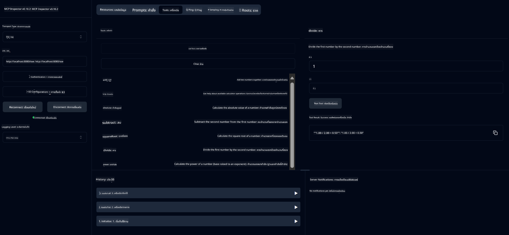

<!--
CO_OP_TRANSLATOR_METADATA:
{
  "original_hash": "ed9cab32cc67c12d8969b407aa47100a",
  "translation_date": "2025-06-11T09:33:04+00:00",
  "source_file": "03-GettingStarted/01-first-server/solution/java/README.md",
  "language_code": "th"
}
-->
# Basic Calculator MCP Service

บริการนี้ให้บริการการคำนวณพื้นฐานผ่าน Model Context Protocol (MCP) โดยใช้ Spring Boot กับ WebFlux transport ออกแบบมาเป็นตัวอย่างง่ายๆ สำหรับผู้เริ่มต้นที่เรียนรู้การใช้งาน MCP

สำหรับข้อมูลเพิ่มเติม ดูได้ที่เอกสารอ้างอิง [MCP Server Boot Starter](https://docs.spring.io/spring-ai/reference/api/mcp/mcp-server-boot-starter-docs.html)


## การใช้งานบริการ

บริการนี้เปิดเผย API endpoints ต่อไปนี้ผ่านโปรโตคอล MCP:

- `add(a, b)`: บวกตัวเลขสองจำนวนเข้าด้วยกัน
- `subtract(a, b)`: ลบตัวเลขตัวที่สองจากตัวแรก
- `multiply(a, b)`: คูณตัวเลขสองจำนวน
- `divide(a, b)`: หารตัวแรกด้วยตัวที่สอง (ตรวจสอบกรณีหารด้วยศูนย์)
- `power(base, exponent)`: คำนวณเลขยกกำลัง
- `squareRoot(number)`: คำนวณรากที่สอง (ตรวจสอบกรณีเลขลบ)
- `modulus(a, b)`: คำนวณเศษเหลือจากการหาร
- `absolute(number)`: คำนวณค่าสัมบูรณ์

## Dependencies

โปรเจกต์นี้ต้องการ dependencies สำคัญดังนี้:

```xml
<dependency>
    <groupId>org.springframework.ai</groupId>
    <artifactId>spring-ai-starter-mcp-server-webflux</artifactId>
</dependency>
```

## การสร้างโปรเจกต์

สร้างโปรเจกต์โดยใช้ Maven:
```bash
./mvnw clean install -DskipTests
```

## การรันเซิร์ฟเวอร์

### การใช้ Java

```bash
java -jar target/calculator-server-0.0.1-SNAPSHOT.jar
```

### การใช้ MCP Inspector

MCP Inspector เป็นเครื่องมือช่วยในการโต้ตอบกับบริการ MCP วิธีใช้กับบริการเครื่องคิดเลขนี้:

1. **ติดตั้งและรัน MCP Inspector** ในหน้าต่างเทอร์มินัลใหม่:
   ```bash
   npx @modelcontextprotocol/inspector
   ```

2. **เข้าถึงเว็บ UI** โดยคลิกที่ URL ที่แอปแสดง (โดยปกติจะเป็น http://localhost:6274)

3. **ตั้งค่าการเชื่อมต่อ**:
   - ตั้งค่า transport type เป็น "SSE"
   - ตั้งค่า URL ไปยัง endpoint SSE ของเซิร์ฟเวอร์ที่กำลังรัน: `http://localhost:8080/sse`
   - คลิก "Connect"

4. **ใช้งานเครื่องมือ**:
   - คลิก "List Tools" เพื่อดูรายการฟังก์ชันเครื่องคิดเลขที่มี
   - เลือกเครื่องมือแล้วคลิก "Run Tool" เพื่อรันฟังก์ชัน



**ข้อจำกัดความรับผิดชอบ**:  
เอกสารนี้ได้รับการแปลโดยใช้บริการแปลภาษาด้วย AI [Co-op Translator](https://github.com/Azure/co-op-translator) แม้ว่าเราจะพยายามให้ความถูกต้องสูงสุด แต่โปรดทราบว่าการแปลอัตโนมัติอาจมีข้อผิดพลาดหรือความไม่ถูกต้อง เอกสารต้นฉบับในภาษาดั้งเดิมควรถือเป็นแหล่งข้อมูลที่เชื่อถือได้ สำหรับข้อมูลที่สำคัญ ขอแนะนำให้ใช้บริการแปลโดยผู้เชี่ยวชาญมนุษย์ เราจะไม่รับผิดชอบต่อความเข้าใจผิดหรือการตีความที่ผิดพลาดใด ๆ ที่เกิดจากการใช้การแปลนี้