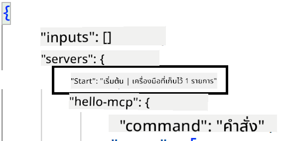
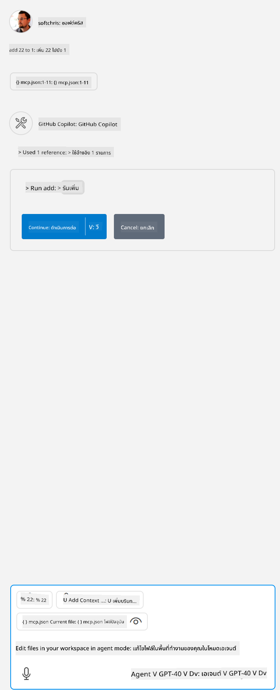

<!--
CO_OP_TRANSLATOR_METADATA:
{
  "original_hash": "0eb9557780cd0a2551cdb8a16c886b51",
  "translation_date": "2025-06-17T15:49:35+00:00",
  "source_file": "03-GettingStarted/04-vscode/README.md",
  "language_code": "th"
}
-->
มาคุยกันเพิ่มเติมเกี่ยวกับการใช้ส่วนติดต่อผู้ใช้ในส่วนถัดไปกันเถอะ

## แนวทาง

นี่คือวิธีการที่เราควรดำเนินการในระดับสูง:

- กำหนดค่าไฟล์เพื่อค้นหา MCP Server ของเรา
- เริ่มต้น/เชื่อมต่อกับเซิร์ฟเวอร์ดังกล่าวเพื่อให้มันแสดงรายการความสามารถของมัน
- ใช้ความสามารถเหล่านั้นผ่านส่วนติดต่อ GitHub Copilot Chat

เยี่ยมมาก ตอนนี้ที่เราเข้าใจกระบวนการแล้ว ลองมาใช้ MCP Server ผ่าน Visual Studio Code ด้วยการฝึกปฏิบัติกัน

## แบบฝึกหัด: การใช้งานเซิร์ฟเวอร์

ในแบบฝึกหัดนี้ เราจะตั้งค่า Visual Studio Code ให้ค้นหา MCP Server ของคุณ เพื่อให้สามารถใช้งานผ่านส่วนติดต่อ GitHub Copilot Chat ได้

### -0- ขั้นตอนเตรียมเปิดใช้งานการค้นหา MCP Server

คุณอาจต้องเปิดใช้งานการค้นหา MCP Server ก่อน

1. ไปที่ `File -> Preferences -> Settings` แล้วค้นหา `chat.mcp.discovery.enabled` ในไฟล์ settings.json

### -1- สร้างไฟล์กำหนดค่า

เริ่มต้นด้วยการสร้างไฟล์กำหนดค่าในโฟลเดอร์หลักของโปรเจกต์ คุณจะต้องมีไฟล์ชื่อ MCP.json และวางไว้ในโฟลเดอร์ที่ชื่อ .vscode ไฟล์ควรมีลักษณะดังนี้:

```text
.vscode
|-- mcp.json
```

ต่อไป มาดูวิธีเพิ่มรายการเซิร์ฟเวอร์กัน

### -2- กำหนดค่าเซิร์ฟเวอร์

เพิ่มเนื้อหาต่อไปนี้ลงใน *mcp.json*:

```json
{
    "inputs": [],
    "servers": {
       "hello-mcp": {
           "command": "node",
           "args": [
               "build/index.js"
           ]
       }
    }
}
```

ตัวอย่างง่ายๆ ข้างต้นแสดงวิธีเริ่มเซิร์ฟเวอร์ที่เขียนด้วย Node.js สำหรับ runtime อื่นๆ ให้ระบุคำสั่งที่เหมาะสมสำหรับการเริ่มเซิร์ฟเวอร์โดยใช้ `command` และ `args`

### -3- เริ่มต้นเซิร์ฟเวอร์

ตอนนี้ที่คุณเพิ่มรายการแล้ว ลองเริ่มเซิร์ฟเวอร์กัน:

1. ค้นหารายการของคุณใน *mcp.json* และตรวจสอบให้แน่ใจว่าคุณเห็นไอคอน "เล่น" (play):

    

2. คลิกที่ไอคอน "เล่น" คุณจะเห็นไอคอนเครื่องมือใน GitHub Copilot Chat เพิ่มจำนวนเครื่องมือที่พร้อมใช้งาน หากคุณคลิกที่ไอคอนเครื่องมือดังกล่าว คุณจะเห็นรายการเครื่องมือที่ลงทะเบียนไว้ คุณสามารถเลือกหรือลบเลือกเครื่องมือแต่ละตัวได้ตามต้องการเพื่อให้ GitHub Copilot ใช้เป็นบริบท:

  

3. เพื่อรันเครื่องมือ ให้พิมพ์คำสั่งที่คุณรู้ว่าจะตรงกับคำอธิบายของเครื่องมือ เช่น คำสั่ง "add 22 to 1":

  

  คุณควรเห็นคำตอบว่า 23

## งานที่ได้รับมอบหมาย

ลองเพิ่มรายการเซิร์ฟเวอร์ในไฟล์ *mcp.json* ของคุณและตรวจสอบให้แน่ใจว่าคุณสามารถเริ่ม/หยุดเซิร์ฟเวอร์ได้ และตรวจสอบว่าคุณสามารถสื่อสารกับเครื่องมือบนเซิร์ฟเวอร์ผ่านส่วนติดต่อ GitHub Copilot Chat ได้ด้วย

## วิธีแก้ไข

[Solution](./solution/README.md)

## ประเด็นสำคัญที่ควรจดจำ

ประเด็นสำคัญจากบทนี้คือ:

- Visual Studio Code เป็นไคลเอนต์ที่ยอดเยี่ยมที่ช่วยให้คุณใช้งาน MCP Server หลายตัวและเครื่องมือของพวกมันได้
- ส่วนติดต่อ GitHub Copilot Chat คือวิธีที่คุณโต้ตอบกับเซิร์ฟเวอร์เหล่านั้น
- คุณสามารถขอข้อมูลจากผู้ใช้ เช่น คีย์ API ซึ่งสามารถส่งต่อไปยัง MCP Server เมื่อกำหนดค่ารายการเซิร์ฟเวอร์ในไฟล์ *mcp.json*

## ตัวอย่าง

- [Java Calculator](../samples/java/calculator/README.md)
- [.Net Calculator](../../../../03-GettingStarted/samples/csharp)
- [JavaScript Calculator](../samples/javascript/README.md)
- [TypeScript Calculator](../samples/typescript/README.md)
- [Python Calculator](../../../../03-GettingStarted/samples/python)

## แหล่งข้อมูลเพิ่มเติม

- [Visual Studio docs](https://code.visualstudio.com/docs/copilot/chat/mcp-servers)

## ต่อไปคืออะไร

- ถัดไป: [Creating an SSE Server](/03-GettingStarted/05-sse-server/README.md)

**ข้อจำกัดความรับผิดชอบ**:  
เอกสารนี้ได้รับการแปลโดยใช้บริการแปลภาษาอัตโนมัติ [Co-op Translator](https://github.com/Azure/co-op-translator) แม้ว่าเราจะพยายามให้ความถูกต้องสูงสุด แต่โปรดทราบว่าการแปลอัตโนมัติอาจมีข้อผิดพลาดหรือความไม่ถูกต้อง เอกสารต้นฉบับในภาษาต้นทางถือเป็นแหล่งข้อมูลที่เชื่อถือได้ สำหรับข้อมูลที่สำคัญ ควรใช้บริการแปลโดยมนุษย์มืออาชีพ เราไม่รับผิดชอบต่อความเข้าใจผิดหรือการตีความผิดที่เกิดขึ้นจากการใช้การแปลนี้