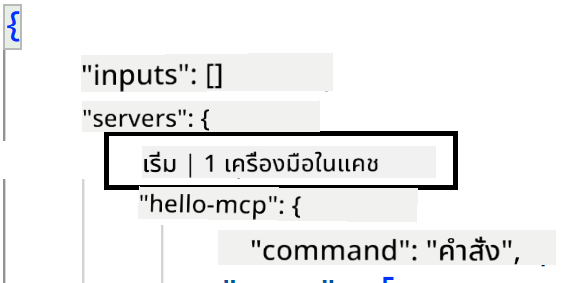
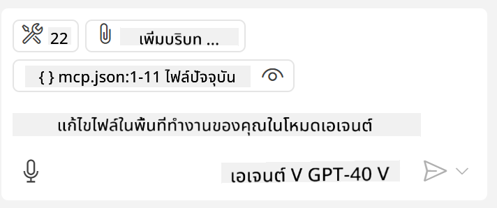

<!--
CO_OP_TRANSLATOR_METADATA:
{
  "original_hash": "c37fabfbc0dcbc9a4afb6d17e7d3be9f",
  "translation_date": "2025-05-17T11:08:47+00:00",
  "source_file": "03-GettingStarted/04-vscode/README.md",
  "language_code": "th"
}
-->
มาพูดคุยเพิ่มเติมเกี่ยวกับวิธีการใช้ส่วนติดต่อแบบภาพในส่วนถัดไปกันเถอะ

## วิธีการ

นี่คือวิธีการที่เราต้องเข้าถึงในระดับสูง:

- กำหนดค่าไฟล์เพื่อค้นหา MCP Server ของเรา
- เริ่มต้น/เชื่อมต่อกับเซิร์ฟเวอร์ที่กล่าวถึงเพื่อให้มันแสดงรายการความสามารถ
- ใช้ความสามารถที่กล่าวถึงผ่านส่วนติดต่อแชทของ GitHub Copilot

ดีแล้วที่เราเข้าใจขั้นตอนการทำงาน ลองใช้ MCP Server ผ่าน Visual Studio Code ผ่านการฝึกปฏิบัติกันเถอะ

## การฝึกปฏิบัติ: การใช้เซิร์ฟเวอร์

ในแบบฝึกหัดนี้ เราจะกำหนดค่า Visual Studio Code เพื่อค้นหา MCP Server ของคุณเพื่อให้สามารถใช้งานจากส่วนติดต่อแชทของ GitHub Copilot ได้

### -0- ขั้นตอนก่อนเริ่ม เปิดการค้นพบ MCP Server

คุณอาจต้องเปิดการค้นพบ MCP Servers

1. ไปที่ `File -> Preferences -> Settings` in Visual Studio Code.

1. Search for "MCP" and enable `chat.mcp.discovery.enabled` ในไฟล์ settings.json

### -1- สร้างไฟล์การกำหนดค่า

เริ่มต้นด้วยการสร้างไฟล์การกำหนดค่าในโฟลเดอร์รากของโปรเจกต์ คุณจะต้องมีไฟล์ชื่อ MCP.json และวางไว้ในโฟลเดอร์ชื่อ .vscode ไฟล์ควรมีลักษณะดังนี้:

```text
.vscode
|-- mcp.json
```

ต่อไป มาดูกันว่าเราจะเพิ่มรายการเซิร์ฟเวอร์ได้อย่างไร

### -2- กำหนดค่าเซิร์ฟเวอร์

เพิ่มเนื้อหาต่อไปนี้ใน *mcp.json*:

```json
{
    "inputs": [],
    "servers": {
       "hello-mcp": {
           "command": "cmd",
           "args": [
               "/c", "node", "<absolute path>\\build\\index.js"
           ]
       }
    }
}
```

นี่คือตัวอย่างง่ายๆ ที่แสดงวิธีการเริ่มเซิร์ฟเวอร์ที่เขียนด้วย Node.js สำหรับรันไทม์อื่นๆ ให้ระบุคำสั่งที่เหมาะสมสำหรับการเริ่มเซิร์ฟเวอร์โดยใช้ `command` and `args`

### -3- เริ่มเซิร์ฟเวอร์

เมื่อคุณเพิ่มรายการแล้ว ลองเริ่มเซิร์ฟเวอร์:

1. ค้นหารายการของคุณใน *mcp.json* และตรวจสอบให้แน่ใจว่าคุณพบไอคอน "เล่น":

    

1. คลิกไอคอน "เล่น" คุณควรเห็นไอคอนเครื่องมือในแชทของ GitHub Copilot เพิ่มจำนวนเครื่องมือที่มีอยู่ หากคุณคลิกไอคอนเครื่องมือที่กล่าวถึง คุณจะเห็นรายการเครื่องมือที่ลงทะเบียน คุณสามารถตรวจสอบ/ยกเลิกการตรวจสอบแต่ละเครื่องมือขึ้นอยู่กับว่าคุณต้องการให้ GitHub Copilot ใช้เป็นบริบทหรือไม่: 

  

1. ในการเรียกใช้เครื่องมือ ให้พิมพ์ข้อความที่คุณรู้ว่าจะตรงกับคำอธิบายของหนึ่งในเครื่องมือของคุณ เช่น ข้อความว่า "add 22 to 1":

  

  คุณควรเห็นการตอบกลับว่า 23

## การบ้าน

ลองเพิ่มรายการเซิร์ฟเวอร์ลงในไฟล์ *mcp.json* ของคุณและตรวจสอบให้แน่ใจว่าคุณสามารถเริ่ม/หยุดเซิร์ฟเวอร์ได้ ตรวจสอบให้แน่ใจว่าคุณสามารถสื่อสารกับเครื่องมือบนเซิร์ฟเวอร์ของคุณผ่านส่วนติดต่อแชทของ GitHub Copilot ได้

## คำตอบ

[คำตอบ](./solution/README.md)

## บทสรุปสำคัญ

บทสรุปจากบทนี้คือ:

- Visual Studio Code เป็นลูกค้าที่ดีที่ช่วยให้คุณใช้ MCP Servers และเครื่องมือของพวกเขาได้หลายตัว
- ส่วนติดต่อแชทของ GitHub Copilot คือวิธีที่คุณโต้ตอบกับเซิร์ฟเวอร์
- คุณสามารถขอให้ผู้ใช้ป้อนข้อมูล เช่น คีย์ API ที่สามารถส่งไปยัง MCP Server เมื่อกำหนดค่าเซิร์ฟเวอร์ในไฟล์ *mcp.json*

## ตัวอย่าง

- [Java Calculator](../samples/java/calculator/README.md)
- [.Net Calculator](../../../../03-GettingStarted/samples/csharp)
- [JavaScript Calculator](../samples/javascript/README.md)
- [TypeScript Calculator](../samples/typescript/README.md)
- [Python Calculator](../../../../03-GettingStarted/samples/python) 

## แหล่งข้อมูลเพิ่มเติม

- [เอกสาร Visual Studio](https://code.visualstudio.com/docs/copilot/chat/mcp-servers)

## สิ่งที่จะทำต่อไป

- ถัดไป: [การสร้าง SSE Server](/03-GettingStarted/05-sse-server/README.md)

**ข้อจำกัดความรับผิดชอบ**:  
เอกสารนี้ได้รับการแปลโดยใช้บริการแปลภาษา AI [Co-op Translator](https://github.com/Azure/co-op-translator) แม้ว่าเราจะพยายามอย่างเต็มที่เพื่อความถูกต้อง แต่โปรดทราบว่าการแปลอัตโนมัติอาจมีข้อผิดพลาดหรือความไม่ถูกต้อง เอกสารต้นฉบับในภาษาต้นฉบับควรถือเป็นแหล่งข้อมูลที่เชื่อถือได้ สำหรับข้อมูลสำคัญ แนะนำให้ใช้บริการแปลภาษามนุษย์ที่มีความเชี่ยวชาญ เราไม่รับผิดชอบต่อความเข้าใจผิดหรือการตีความผิดพลาดที่เกิดจากการใช้การแปลนี้