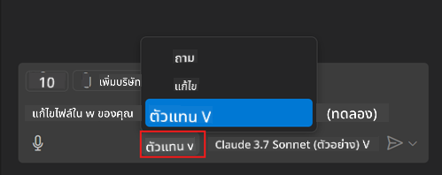
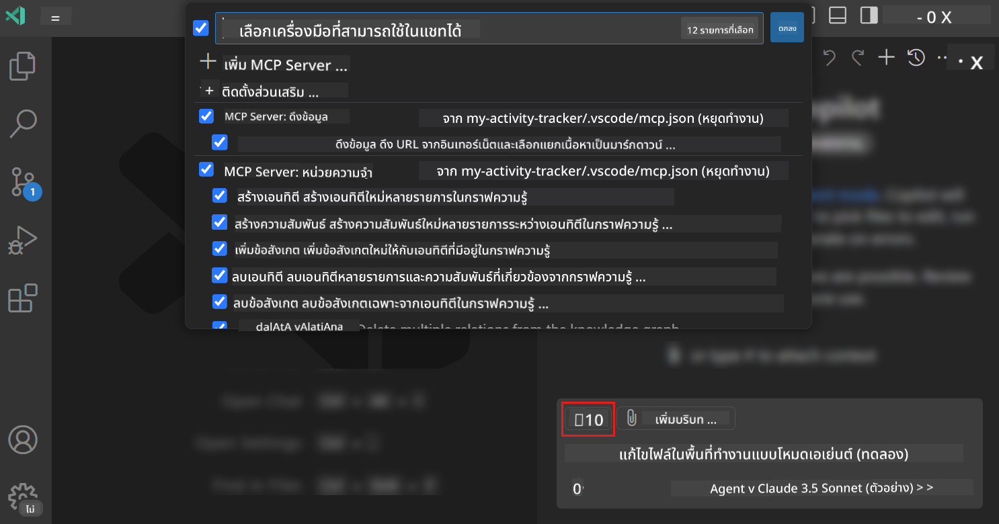
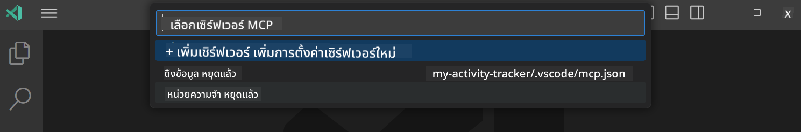

<!--
CO_OP_TRANSLATOR_METADATA:
{
  "original_hash": "8ea28e5e566edd5969337fd0b191ba3f",
  "translation_date": "2025-07-17T06:04:36+00:00",
  "source_file": "03-GettingStarted/04-vscode/README.md",
  "language_code": "th"
}
-->
# การใช้งานเซิร์ฟเวอร์จากโหมด GitHub Copilot Agent

Visual Studio Code และ GitHub Copilot สามารถทำหน้าที่เป็นไคลเอนต์และเชื่อมต่อกับ MCP Server ได้ คุณอาจสงสัยว่าทำไมเราต้องทำแบบนี้? นั่นหมายความว่าคุณสามารถใช้ฟีเจอร์ทั้งหมดของ MCP Server ได้จากภายใน IDE ของคุณ ลองนึกภาพว่าคุณเพิ่ม MCP Server ของ GitHub เข้าไป ซึ่งจะช่วยให้คุณควบคุม GitHub ผ่านคำสั่งที่พิมพ์ในรูปแบบข้อความแทนการพิมพ์คำสั่งเฉพาะในเทอร์มินัล หรือจะเป็นอะไรก็ได้ที่ช่วยพัฒนาประสบการณ์การพัฒนาของคุณ โดยควบคุมผ่านภาษาธรรมชาติ ตอนนี้คุณเริ่มเห็นข้อดีแล้วใช่ไหม?

## ภาพรวม

บทเรียนนี้จะสอนวิธีใช้ Visual Studio Code และโหมด Agent ของ GitHub Copilot ในการเป็นไคลเอนต์สำหรับ MCP Server ของคุณ

## วัตถุประสงค์การเรียนรู้

เมื่อจบบทเรียนนี้ คุณจะสามารถ:

- เชื่อมต่อกับ MCP Server ผ่าน Visual Studio Code
- ใช้ความสามารถต่างๆ เช่น เครื่องมือต่างๆ ผ่าน GitHub Copilot
- ตั้งค่า Visual Studio Code เพื่อค้นหาและจัดการ MCP Server ของคุณ

## การใช้งาน

คุณสามารถควบคุม MCP Server ของคุณได้สองวิธี:

- ผ่านส่วนติดต่อผู้ใช้ ซึ่งจะอธิบายวิธีการในภายหลังในบทนี้
- ผ่านเทอร์มินัล โดยสามารถควบคุมผ่านคำสั่ง `code` ได้:

  เพื่อเพิ่ม MCP Server ลงในโปรไฟล์ผู้ใช้ ให้ใช้คำสั่ง --add-mcp พร้อมกับการตั้งค่าเซิร์ฟเวอร์ในรูปแบบ JSON เช่น {\"name\":\"server-name\",\"command\":...}

  ```
  code --add-mcp "{\"name\":\"my-server\",\"command\": \"uvx\",\"args\": [\"mcp-server-fetch\"]}"
  ```

### ภาพหน้าจอ

  
  


เรามาคุยกันเพิ่มเติมเกี่ยวกับการใช้ส่วนติดต่อผู้ใช้ในส่วนถัดไป

## แนวทาง

นี่คือขั้นตอนหลักที่เราต้องทำ:

- ตั้งค่าไฟล์เพื่อค้นหา MCP Server ของเรา
- เริ่มต้น/เชื่อมต่อกับเซิร์ฟเวอร์นั้นเพื่อให้แสดงความสามารถต่างๆ
- ใช้ความสามารถเหล่านั้นผ่านอินเทอร์เฟซ GitHub Copilot Chat

ดีมาก ตอนนี้ที่เราเข้าใจกระบวนการแล้ว ลองใช้ MCP Server ผ่าน Visual Studio Code ด้วยแบบฝึกหัดกัน

## แบบฝึกหัด: การใช้งานเซิร์ฟเวอร์

ในแบบฝึกหัดนี้ เราจะตั้งค่า Visual Studio Code ให้ค้นหา MCP Server ของคุณ เพื่อให้สามารถใช้งานผ่านอินเทอร์เฟซ GitHub Copilot Chat ได้

### -0- ขั้นตอนเบื้องต้น เปิดใช้งานการค้นหา MCP Server

คุณอาจต้องเปิดใช้งานการค้นหา MCP Server ก่อน

1. ไปที่ `File -> Preferences -> Settings` ใน Visual Studio Code

1. ค้นหาคำว่า "MCP" และเปิดใช้งาน `chat.mcp.discovery.enabled` ในไฟล์ settings.json

### -1- สร้างไฟล์ config

เริ่มต้นด้วยการสร้างไฟล์ config ในโฟลเดอร์รากของโปรเจกต์ คุณจะต้องมีไฟล์ชื่อ MCP.json และวางไว้ในโฟลเดอร์ .vscode ไฟล์ควรมีลักษณะดังนี้:

```text
.vscode
|-- mcp.json
```

ต่อไปมาดูวิธีเพิ่มรายการเซิร์ฟเวอร์กัน

### -2- ตั้งค่าเซิร์ฟเวอร์

เพิ่มเนื้อหาต่อไปนี้ใน *mcp.json*:

```json
{
    "inputs": [],
    "servers": {
       "hello-mcp": {
           "command": "node",
           "args": [
               "build/index.js"
           ]
       }
    }
}
```

ตัวอย่างง่ายๆ ข้างต้นแสดงวิธีเริ่มเซิร์ฟเวอร์ที่เขียนด้วย Node.js สำหรับ runtime อื่นๆ ให้ระบุคำสั่งที่ถูกต้องสำหรับการเริ่มเซิร์ฟเวอร์โดยใช้ `command` และ `args`

### -3- เริ่มเซิร์ฟเวอร์

เมื่อคุณเพิ่มรายการแล้ว มาลองเริ่มเซิร์ฟเวอร์กัน:

1. หา entry ของคุณใน *mcp.json* และตรวจสอบให้แน่ใจว่าคุณเห็นไอคอน "เล่น" (play):

    

1. คลิกไอคอน "เล่น" คุณจะเห็นไอคอนเครื่องมือใน GitHub Copilot Chat เพิ่มจำนวนเครื่องมือที่ใช้ได้ หากคลิกไอคอนเครื่องมือนั้น คุณจะเห็นรายการเครื่องมือที่ลงทะเบียนไว้ คุณสามารถเลือกหรือลบเลือกเครื่องมือแต่ละตัวได้ตามต้องการ เพื่อให้ GitHub Copilot ใช้เป็นบริบท:

  

1. เพื่อรันเครื่องมือ ให้พิมพ์คำสั่งที่คุณรู้ว่าจะตรงกับคำอธิบายของเครื่องมือ เช่น คำสั่ง "add 22 to 1":

  

  คุณควรเห็นผลลัพธ์เป็น 23

## การบ้าน

ลองเพิ่มรายการเซิร์ฟเวอร์ในไฟล์ *mcp.json* ของคุณ และตรวจสอบว่าคุณสามารถเริ่ม/หยุดเซิร์ฟเวอร์ได้ รวมถึงสามารถสื่อสารกับเครื่องมือบนเซิร์ฟเวอร์ผ่านอินเทอร์เฟซ GitHub Copilot Chat

## คำตอบ

[Solution](./solution/README.md)

## ข้อสรุปสำคัญ

ข้อสรุปจากบทนี้คือ:

- Visual Studio Code เป็นไคลเอนต์ที่ยอดเยี่ยมที่ช่วยให้คุณเชื่อมต่อกับ MCP Server หลายตัวและเครื่องมือของพวกเขาได้
- อินเทอร์เฟซ GitHub Copilot Chat คือวิธีที่คุณโต้ตอบกับเซิร์ฟเวอร์
- คุณสามารถขอข้อมูลจากผู้ใช้ เช่น คีย์ API ที่จะส่งไปยัง MCP Server เมื่อกำหนดค่า entry ของเซิร์ฟเวอร์ในไฟล์ *mcp.json*

## ตัวอย่าง

- [Java Calculator](../samples/java/calculator/README.md)
- [.Net Calculator](../../../../03-GettingStarted/samples/csharp)
- [JavaScript Calculator](../samples/javascript/README.md)
- [TypeScript Calculator](../samples/typescript/README.md)
- [Python Calculator](../../../../03-GettingStarted/samples/python)

## แหล่งข้อมูลเพิ่มเติม

- [Visual Studio docs](https://code.visualstudio.com/docs/copilot/chat/mcp-servers)

## ต่อไป

- ถัดไป: [Creating an SSE Server](../05-sse-server/README.md)

**ข้อจำกัดความรับผิดชอบ**:  
เอกสารนี้ได้รับการแปลโดยใช้บริการแปลภาษาอัตโนมัติ [Co-op Translator](https://github.com/Azure/co-op-translator) แม้เราจะพยายามให้ความถูกต้องสูงสุด แต่โปรดทราบว่าการแปลอัตโนมัติอาจมีข้อผิดพลาดหรือความไม่ถูกต้อง เอกสารต้นฉบับในภาษาต้นทางถือเป็นแหล่งข้อมูลที่เชื่อถือได้ สำหรับข้อมูลที่สำคัญ ขอแนะนำให้ใช้บริการแปลโดยผู้เชี่ยวชาญมนุษย์ เราไม่รับผิดชอบต่อความเข้าใจผิดหรือการตีความผิดใด ๆ ที่เกิดจากการใช้การแปลนี้