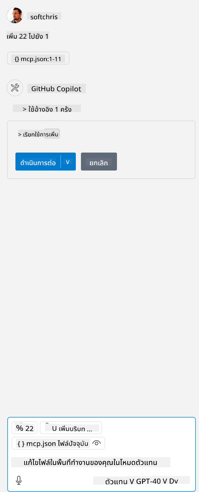

<!--
CO_OP_TRANSLATOR_METADATA:
{
  "original_hash": "96e08a8c1049dab757deb64cce4ea1e8",
  "translation_date": "2025-05-17T11:21:15+00:00",
  "source_file": "03-GettingStarted/04-vscode/solution/README.md",
  "language_code": "th"
}
-->
# การเรียกใช้ตัวอย่าง

ที่นี่เราสมมติว่าคุณมีโค้ดเซิร์ฟเวอร์ที่ทำงานได้แล้ว โปรดค้นหาเซิร์ฟเวอร์จากบทก่อนหน้า

## ตั้งค่า mcp.json

นี่คือไฟล์ที่คุณใช้เป็นข้อมูลอ้างอิง, [mcp.json](../../../../../03-GettingStarted/04-vscode/solution/mcp.json).

เปลี่ยนรายการเซิร์ฟเวอร์ตามที่จำเป็นเพื่อชี้ไปยังเส้นทางที่แน่นอนของเซิร์ฟเวอร์ของคุณรวมถึงคำสั่งเต็มที่จำเป็นในการเรียกใช้

ในไฟล์ตัวอย่างที่กล่าวถึงข้างต้น รายการเซิร์ฟเวอร์มีลักษณะดังนี้:

```json
"hello-mcp": {
    "command": "cmd",
    "args": [
        "/c", "node", "<absolute path>\\build\\index.js"
    ]
}
```

ซึ่งสอดคล้องกับการรันคำสั่งเช่นนี้: `cmd /c node <absolute path>\\build\index.js`. 

- Change this server entry to fit where your server file is located or to what's needed to startup your server depending on your chosen runtime and server location.

## Consume the features in the server

- Click the `play` icon, once you've added *mcp.json* to *./vscode* folder, 

    Observe the tooling icon change to increase the number of available tools. Tooling icon is located right above the chat field in GitHub Copilot.

## Run a tool

- Type a prompt in your chat window that matches the description of your tool. For example to trigger the tool `add` พิมพ์บางอย่างเช่น "add 3 to 20".

คุณควรเห็นเครื่องมือที่แสดงอยู่เหนือกล่องข้อความแชทบ่งบอกให้คุณเลือกเพื่อรันเครื่องมือเหมือนในภาพนี้:



การเลือกเครื่องมือควรให้ผลลัพธ์เป็นตัวเลขว่า "23" หากคำสั่งของคุณเป็นอย่างที่เรากล่าวถึงก่อนหน้านี้

**ข้อจำกัดความรับผิดชอบ**:  
เอกสารนี้ได้รับการแปลโดยใช้บริการแปลภาษาด้วย AI [Co-op Translator](https://github.com/Azure/co-op-translator) แม้ว่าเราจะพยายามอย่างเต็มที่เพื่อให้มีความถูกต้อง แต่อย่างไรก็ตาม การแปลอัตโนมัติอาจมีข้อผิดพลาดหรือความไม่ถูกต้องได้ เอกสารต้นฉบับในภาษาที่เป็นต้นฉบับควรถือว่าเป็นแหล่งข้อมูลที่เชื่อถือได้ สำหรับข้อมูลที่มีความสำคัญ แนะนำให้ใช้การแปลภาษามนุษย์โดยผู้เชี่ยวชาญ เราไม่รับผิดชอบต่อความเข้าใจผิดหรือการตีความผิดที่เกิดจากการใช้การแปลนี้