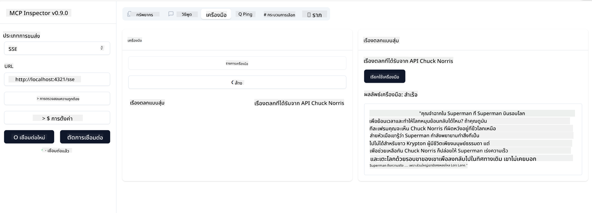

<!--
CO_OP_TRANSLATOR_METADATA:
{
  "original_hash": "0a8086dc4bf89448f83e7936db972c42",
  "translation_date": "2025-05-17T11:35:51+00:00",
  "source_file": "03-GettingStarted/05-sse-server/README.md",
  "language_code": "th"
}
-->
ตอนนี้เรารู้เพิ่มเติมเกี่ยวกับ SSE แล้ว มาสร้าง SSE server กันเถอะ

## แบบฝึกหัด: สร้าง SSE Server

ในการสร้างเซิร์ฟเวอร์ของเรา เราต้องคำนึงถึงสองสิ่งนี้:

- เราต้องใช้เว็บเซิร์ฟเวอร์เพื่อเปิดเผย endpoints สำหรับการเชื่อมต่อและข้อความ
- สร้างเซิร์ฟเวอร์ของเราเหมือนที่เราทำตามปกติด้วยเครื่องมือ ทรัพยากร และคำแนะนำเมื่อเราใช้ stdio

### -1- สร้างอินสแตนซ์เซิร์ฟเวอร์

ในการสร้างเซิร์ฟเวอร์ของเรา เราใช้ประเภทเดียวกันกับที่ใช้ stdio อย่างไรก็ตาม สำหรับการขนส่ง เราต้องเลือก SSE

มาเพิ่มเส้นทางที่จำเป็นต่อไป

### -2- เพิ่มเส้นทาง

มาเพิ่มเส้นทางที่จัดการการเชื่อมต่อและข้อความที่เข้ามาต่อไป

มาเพิ่มความสามารถให้เซิร์ฟเวอร์ต่อไป

### -3- เพิ่มความสามารถของเซิร์ฟเวอร์

ตอนนี้เรากำหนดสิ่งที่เกี่ยวข้องกับ SSE เสร็จแล้ว มาเพิ่มความสามารถของเซิร์ฟเวอร์เช่น เครื่องมือ คำแนะนำ และทรัพยากร

โค้ดทั้งหมดของคุณควรมีลักษณะดังนี้:

ยอดเยี่ยม เรามีเซิร์ฟเวอร์ที่ใช้ SSE แล้ว ลองใช้งานกันเถอะ

## แบบฝึกหัด: การดีบัก SSE Server ด้วย Inspector

Inspector เป็นเครื่องมือที่ยอดเยี่ยมที่เราเห็นในบทเรียนก่อนหน้า [สร้างเซิร์ฟเวอร์แรกของคุณ](/03-GettingStarted/01-first-server/README.md) ลองดูว่าเราสามารถใช้ Inspector ได้ที่นี่:

### -1- การรัน Inspector

ในการรัน Inspector คุณต้องมี SSE server ที่กำลังทำงานอยู่ ดังนั้นมาทำสิ่งนั้นต่อไป:

1. รันเซิร์ฟเวอร์

1. รัน Inspector

    > ![NOTE]
    > รันสิ่งนี้ในหน้าต่าง terminal แยกต่างหากจากที่เซิร์ฟเวอร์กำลังทำงานอยู่ นอกจากนี้โปรดทราบว่าคุณต้องปรับคำสั่งด้านล่างให้เหมาะกับ URL ที่เซิร์ฟเวอร์ของคุณทำงานอยู่

    ```sh
    npx @modelcontextprotocol/inspector --cli http://localhost:8000/sse --method tools/list
    ```

    การรัน Inspector ดูเหมือนกันในทุก runtime สังเกตว่าเราผ่าน URL ที่เซิร์ฟเวอร์กำลังทำงานอยู่แทนที่จะผ่าน path ไปยังเซิร์ฟเวอร์ของเราและคำสั่งในการเริ่มเซิร์ฟเวอร์และเรายังระบุเส้นทาง `/sse`

### -2- ลองใช้เครื่องมือ

เชื่อมต่อเซิร์ฟเวอร์โดยเลือก SSE ใน droplist และกรอกช่อง url ที่เซิร์ฟเวอร์ของคุณทำงานอยู่ เช่น http:localhost:4321/sse ตอนนี้คลิกปุ่ม "Connect" เหมือนเดิม เลือกที่จะ list เครื่องมือ เลือกเครื่องมือและให้ค่าป้อนเข้า คุณควรเห็นผลลัพธ์ดังนี้:



ยอดเยี่ยม คุณสามารถทำงานกับ Inspector ได้ ลองดูว่าเราสามารถทำงานกับ Visual Studio Code ได้อย่างไรต่อไป

## งานที่ต้องทำ

ลองสร้างเซิร์ฟเวอร์ของคุณด้วยความสามารถเพิ่มเติม ดู [หน้านี้](https://api.chucknorris.io/) เพื่อเพิ่มเครื่องมือที่เรียก API คุณตัดสินใจว่าเซิร์ฟเวอร์ควรมีลักษณะอย่างไร สนุกสนานนะ :)

## วิธีแก้ไข

[วิธีแก้ไข](./solution/README.md) นี่คือวิธีแก้ไขที่เป็นไปได้พร้อมโค้ดที่ใช้งานได้

## ข้อสรุปสำคัญ

ข้อสรุปจากบทนี้คือ:

- SSE เป็นการขนส่งที่รองรับตัวที่สองถัดจาก stdio
- เพื่อรองรับ SSE คุณต้องจัดการการเชื่อมต่อและข้อความที่เข้ามาโดยใช้เว็บเฟรมเวิร์ก
- คุณสามารถใช้ทั้ง Inspector และ Visual Studio Code เพื่อใช้งาน SSE server เช่นเดียวกับเซิร์ฟเวอร์ stdio สังเกตว่ามันแตกต่างเล็กน้อยระหว่าง stdio และ SSE สำหรับ SSE คุณต้องเริ่มเซิร์ฟเวอร์แยกต่างหากและจากนั้นรันเครื่องมือ Inspector ของคุณ สำหรับเครื่องมือ Inspector มีความแตกต่างบางประการที่คุณต้องระบุ URL

## ตัวอย่าง

- [Java Calculator](../samples/java/calculator/README.md)
- [.Net Calculator](../../../../03-GettingStarted/samples/csharp)
- [JavaScript Calculator](../samples/javascript/README.md)
- [TypeScript Calculator](../samples/typescript/README.md)
- [Python Calculator](../../../../03-GettingStarted/samples/python) 

## แหล่งข้อมูลเพิ่มเติม

- [SSE](https://developer.mozilla.org/en-US/docs/Web/API/Server-sent_events)

## มีอะไรต่อ

- ถัดไป: [เริ่มต้นกับ AI Toolkit สำหรับ VSCode](/03-GettingStarted/06-aitk/README.md)

**ข้อจำกัดความรับผิดชอบ**:  
เอกสารนี้ได้รับการแปลโดยใช้บริการแปลภาษา AI [Co-op Translator](https://github.com/Azure/co-op-translator) แม้ว่าเราจะพยายามให้ได้ความถูกต้อง แต่โปรดทราบว่าการแปลอัตโนมัติอาจมีข้อผิดพลาดหรือความไม่ถูกต้อง เอกสารต้นฉบับในภาษาดั้งเดิมควรถือเป็นแหล่งข้อมูลที่เชื่อถือได้ สำหรับข้อมูลที่สำคัญ ขอแนะนำให้ใช้บริการแปลภาษามนุษย์ที่เป็นมืออาชีพ เราไม่รับผิดชอบต่อความเข้าใจผิดหรือการตีความผิดที่เกิดจากการใช้การแปลนี้