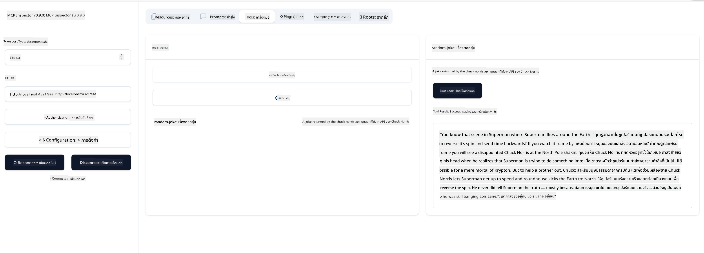

<!--
CO_OP_TRANSLATOR_METADATA:
{
  "original_hash": "1681ca3633aeb49ee03766abdbb94a93",
  "translation_date": "2025-06-17T22:13:46+00:00",
  "source_file": "03-GettingStarted/05-sse-server/README.md",
  "language_code": "th"
}
-->
ตอนนี้ที่เราเข้าใจเกี่ยวกับ SSE มากขึ้นแล้ว ต่อไปเรามาสร้างเซิร์ฟเวอร์ SSE กัน

## แบบฝึกหัด: การสร้างเซิร์ฟเวอร์ SSE

ในการสร้างเซิร์ฟเวอร์ของเรา เราต้องคำนึงถึงสองสิ่งนี้:

- เราต้องใช้เว็บเซิร์ฟเวอร์เพื่อเปิดเผย endpoints สำหรับการเชื่อมต่อและข้อความ
- สร้างเซิร์ฟเวอร์ของเราเหมือนกับที่ทำกับ stdio โดยใช้เครื่องมือ, แหล่งข้อมูล และ prompts

### -1- สร้างอินสแตนซ์เซิร์ฟเวอร์

ในการสร้างเซิร์ฟเวอร์ เราใช้ชนิดข้อมูลเดียวกับ stdio แต่สำหรับ transport เราต้องเลือก SSE

---

ต่อไปเรามาเพิ่มเส้นทางที่จำเป็นกัน

### -2- เพิ่มเส้นทาง

เพิ่มเส้นทางที่จัดการการเชื่อมต่อและข้อความที่เข้ามา:

---

ต่อไปเราจะเพิ่มความสามารถให้กับเซิร์ฟเวอร์

### -3- การเพิ่มความสามารถให้เซิร์ฟเวอร์

ตอนนี้ที่เรากำหนดทุกอย่างเฉพาะสำหรับ SSE แล้ว ให้เพิ่มความสามารถของเซิร์ฟเวอร์ เช่น เครื่องมือ, prompts และแหล่งข้อมูล

---

โค้ดทั้งหมดของคุณควรจะมีลักษณะดังนี้:

---

เยี่ยมมาก เรามีเซิร์ฟเวอร์ที่ใช้ SSE แล้ว ต่อไปมาทดลองใช้งานกัน

## แบบฝึกหัด: การดีบักเซิร์ฟเวอร์ SSE ด้วย Inspector

Inspector เป็นเครื่องมือที่ยอดเยี่ยมที่เราเห็นในบทเรียนก่อนหน้า [การสร้างเซิร์ฟเวอร์แรกของคุณ](/03-GettingStarted/01-first-server/README.md) มาดูกันว่าเราสามารถใช้ Inspector ที่นี่ได้ไหม:

### -1- การรัน Inspector

เพื่อรัน Inspector คุณต้องมีเซิร์ฟเวอร์ SSE ที่กำลังทำงานอยู่ก่อน ดังนั้นมาทำขั้นตอนนี้กัน:

1. รันเซิร์ฟเวอร์

---

1. รัน Inspector

    > ![NOTE]
    > รันคำสั่งนี้ในหน้าต่างเทอร์มินัลแยกต่างหากจากที่รันเซิร์ฟเวอร์ และอย่าลืมปรับคำสั่งด้านล่างให้ตรงกับ URL ที่เซิร์ฟเวอร์ของคุณกำลังทำงานอยู่

    ```sh
    npx @modelcontextprotocol/inspector --cli http://localhost:8000/sse --method tools/list
    ```

    การรัน Inspector จะเหมือนกันในทุก runtime สังเกตว่าคุณไม่ได้ส่งพาธไปยังเซิร์ฟเวอร์หรือคำสั่งสำหรับเริ่มเซิร์ฟเวอร์ แต่ส่ง URL ที่เซิร์ฟเวอร์กำลังทำงานอยู่และระบุเส้นทาง `/sse`

### -2- ทดลองใช้เครื่องมือ

เชื่อมต่อกับเซิร์ฟเวอร์โดยเลือก SSE ในเมนูดรอปดาวน์และกรอก URL ที่เซิร์ฟเวอร์ของคุณกำลังทำงานอยู่ เช่น http://localhost:4321/sse จากนั้นคลิกปุ่ม "Connect" เช่นเคย เลือกแสดงรายการเครื่องมือ เลือกเครื่องมือ และกรอกค่าป้อนข้อมูล คุณจะเห็นผลลัพธ์ดังภาพด้านล่าง:



เยี่ยมมาก คุณสามารถใช้งาน Inspector ได้ ต่อไปมาดูวิธีใช้งานกับ Visual Studio Code กัน

## การบ้าน

ลองสร้างเซิร์ฟเวอร์ของคุณให้มีความสามารถมากขึ้น ดูที่ [หน้านี้](https://api.chucknorris.io/) เพื่อเพิ่มเครื่องมือที่เรียกใช้งาน API เป็นต้น คุณเป็นคนกำหนดว่าเซิร์ฟเวอร์ควรเป็นอย่างไร สนุกกับการทำ :)

## ตัวอย่างคำตอบ

[คำตอบ](./solution/README.md) นี่คือตัวอย่างคำตอบที่มีโค้ดใช้งานได้จริง

## สิ่งสำคัญที่ควรจดจำ

ประเด็นสำคัญจากบทนี้คือ:

- SSE เป็น transport ประเภทที่สองที่รองรับถัดจาก stdio
- เพื่อรองรับ SSE คุณต้องจัดการการเชื่อมต่อและข้อความที่เข้ามาโดยใช้เว็บเฟรมเวิร์ก
- คุณสามารถใช้ทั้ง Inspector และ Visual Studio Code เพื่อเชื่อมต่อกับเซิร์ฟเวอร์ SSE เหมือนกับเซิร์ฟเวอร์ stdio แต่จะมีความแตกต่างเล็กน้อยระหว่าง stdio กับ SSE สำหรับ SSE คุณต้องเริ่มเซิร์ฟเวอร์แยกต่างหากก่อน แล้วจึงรันเครื่องมือ Inspector ซึ่งใน Inspector จะต้องระบุ URL ด้วย

## ตัวอย่างโค้ด

- [Java Calculator](../samples/java/calculator/README.md)
- [.Net Calculator](../../../../03-GettingStarted/samples/csharp)
- [JavaScript Calculator](../samples/javascript/README.md)
- [TypeScript Calculator](../samples/typescript/README.md)
- [Python Calculator](../../../../03-GettingStarted/samples/python)

## แหล่งข้อมูลเพิ่มเติม

- [SSE](https://developer.mozilla.org/en-US/docs/Web/API/Server-sent_events)

## ต่อไปคืออะไร

- ถัดไป: [HTTP Streaming กับ MCP (Streamable HTTP)](/03-GettingStarted/06-http-streaming/README.md)

**ข้อจำกัดความรับผิดชอบ**:  
เอกสารนี้ได้รับการแปลโดยใช้บริการแปลภาษาอัตโนมัติ [Co-op Translator](https://github.com/Azure/co-op-translator) แม้เราจะพยายามให้ความถูกต้องสูงสุด แต่โปรดทราบว่าการแปลอัตโนมัติอาจมีข้อผิดพลาดหรือความไม่ถูกต้อง เอกสารต้นฉบับในภาษาต้นทางควรถูกพิจารณาเป็นแหล่งข้อมูลที่เชื่อถือได้ สำหรับข้อมูลที่สำคัญ แนะนำให้ใช้การแปลโดยผู้เชี่ยวชาญด้านภาษามนุษย์ เราจะไม่รับผิดชอบต่อความเข้าใจผิดหรือการตีความที่ผิดพลาดที่เกิดขึ้นจากการใช้การแปลนี้