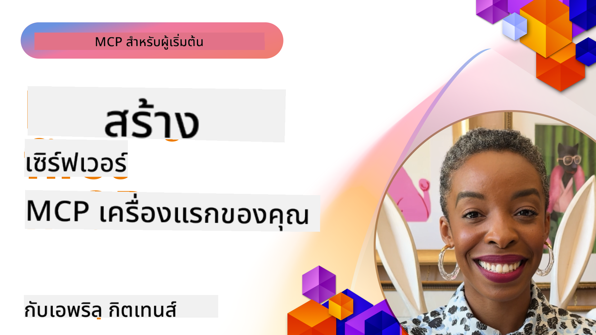

<!--
CO_OP_TRANSLATOR_METADATA:
{
  "original_hash": "1197b6dbde36773e04a5ae826557fdb9",
  "translation_date": "2025-08-26T17:48:08+00:00",
  "source_file": "03-GettingStarted/README.md",
  "language_code": "th"
}
-->
## เริ่มต้นใช้งาน  

_(คลิกที่ภาพด้านบนเพื่อดูวิดีโอของบทเรียนนี้)_

ส่วนนี้ประกอบด้วยบทเรียนหลายบท:

- **1 เซิร์ฟเวอร์แรกของคุณ** ในบทเรียนแรกนี้ คุณจะได้เรียนรู้วิธีสร้างเซิร์ฟเวอร์แรกของคุณและตรวจสอบด้วยเครื่องมือ Inspector ซึ่งเป็นวิธีที่มีประโยชน์ในการทดสอบและแก้ไขข้อบกพร่องของเซิร์ฟเวอร์ [ไปยังบทเรียน](01-first-server/README.md)

- **2 ไคลเอนต์** ในบทเรียนนี้ คุณจะได้เรียนรู้วิธีเขียนไคลเอนต์ที่สามารถเชื่อมต่อกับเซิร์ฟเวอร์ของคุณ [ไปยังบทเรียน](02-client/README.md)

- **3 ไคลเอนต์พร้อม LLM** วิธีที่ดีกว่าในการเขียนไคลเอนต์คือการเพิ่ม LLM เพื่อให้สามารถ "เจรจา" กับเซิร์ฟเวอร์ของคุณเกี่ยวกับสิ่งที่ต้องทำ [ไปยังบทเรียน](03-llm-client/README.md)

- **4 การใช้งานเซิร์ฟเวอร์ GitHub Copilot Agent Mode ใน Visual Studio Code** ในส่วนนี้ เราจะดูการรันเซิร์ฟเวอร์ MCP ของเราภายใน Visual Studio Code [ไปยังบทเรียน](04-vscode/README.md)

- **5 เซิร์ฟเวอร์ stdio Transport** stdio transport เป็นมาตรฐานที่แนะนำสำหรับการสื่อสารระหว่างเซิร์ฟเวอร์ MCP และไคลเอนต์ในข้อกำหนดปัจจุบัน โดยให้การสื่อสารที่ปลอดภัยผ่าน subprocess [ไปยังบทเรียน](05-stdio-server/README.md)

- **6 การสตรีม HTTP ด้วย MCP (Streamable HTTP)** เรียนรู้เกี่ยวกับการสตรีม HTTP สมัยใหม่ การแจ้งเตือนความคืบหน้า และวิธีการสร้างเซิร์ฟเวอร์และไคลเอนต์ MCP แบบเรียลไทม์ที่ปรับขนาดได้โดยใช้ Streamable HTTP [ไปยังบทเรียน](06-http-streaming/README.md)

- **7 การใช้ AI Toolkit สำหรับ VSCode** เพื่อใช้งานและทดสอบไคลเอนต์และเซิร์ฟเวอร์ MCP ของคุณ [ไปยังบทเรียน](07-aitk/README.md)

- **8 การทดสอบ** ในส่วนนี้เราจะเน้นวิธีการทดสอบเซิร์ฟเวอร์และไคลเอนต์ของเราในรูปแบบต่างๆ [ไปยังบทเรียน](08-testing/README.md)

- **9 การปรับใช้งาน** บทนี้จะดูวิธีการต่างๆ ในการปรับใช้โซลูชัน MCP ของคุณ [ไปยังบทเรียน](09-deployment/README.md)

Model Context Protocol (MCP) เป็นโปรโตคอลเปิดที่มาตรฐานการให้บริบทแก่ LLMs ลองนึกถึง MCP เหมือนพอร์ต USB-C สำหรับแอปพลิเคชัน AI - มันให้วิธีการมาตรฐานในการเชื่อมต่อโมเดล AI กับแหล่งข้อมูลและเครื่องมือที่หลากหลาย

## วัตถุประสงค์การเรียนรู้

เมื่อจบบทเรียนนี้ คุณจะสามารถ:

- ตั้งค่าสภาพแวดล้อมการพัฒนาสำหรับ MCP ใน C#, Java, Python, TypeScript และ JavaScript
- สร้างและปรับใช้เซิร์ฟเวอร์ MCP พื้นฐานพร้อมคุณสมบัติที่กำหนดเอง (resources, prompts, และ tools)
- สร้างแอปพลิเคชันโฮสต์ที่เชื่อมต่อกับเซิร์ฟเวอร์ MCP
- ทดสอบและแก้ไขข้อบกพร่องของการใช้งาน MCP
- เข้าใจความท้าทายทั่วไปในการตั้งค่าและวิธีแก้ไข
- เชื่อมต่อการใช้งาน MCP ของคุณกับบริการ LLM ยอดนิยม

## การตั้งค่าสภาพแวดล้อม MCP ของคุณ

ก่อนที่คุณจะเริ่มทำงานกับ MCP สิ่งสำคัญคือต้องเตรียมสภาพแวดล้อมการพัฒนาและเข้าใจขั้นตอนการทำงานพื้นฐาน ส่วนนี้จะนำคุณผ่านขั้นตอนการตั้งค่าเริ่มต้นเพื่อให้เริ่มต้นใช้งาน MCP ได้อย่างราบรื่น

### ข้อกำหนดเบื้องต้น

ก่อนที่จะเริ่มพัฒนา MCP ตรวจสอบให้แน่ใจว่าคุณมี:

- **สภาพแวดล้อมการพัฒนา**: สำหรับภาษาที่คุณเลือก (C#, Java, Python, TypeScript หรือ JavaScript)
- **IDE/Editor**: Visual Studio, Visual Studio Code, IntelliJ, Eclipse, PyCharm หรือโปรแกรมแก้ไขโค้ดสมัยใหม่
- **ตัวจัดการแพ็กเกจ**: NuGet, Maven/Gradle, pip หรือ npm/yarn
- **API Keys**: สำหรับบริการ AI ที่คุณวางแผนจะใช้ในแอปพลิเคชันโฮสต์ของคุณ

### SDKs อย่างเป็นทางการ

ในบทต่อไป คุณจะเห็นโซลูชันที่สร้างขึ้นโดยใช้ Python, TypeScript, Java และ .NET นี่คือ SDKs ที่ได้รับการสนับสนุนอย่างเป็นทางการทั้งหมด

MCP มี SDKs อย่างเป็นทางการสำหรับหลายภาษา:
- [C# SDK](https://github.com/modelcontextprotocol/csharp-sdk) - ดูแลร่วมกับ Microsoft
- [Java SDK](https://github.com/modelcontextprotocol/java-sdk) - ดูแลร่วมกับ Spring AI
- [TypeScript SDK](https://github.com/modelcontextprotocol/typescript-sdk) - การใช้งาน TypeScript อย่างเป็นทางการ
- [Python SDK](https://github.com/modelcontextprotocol/python-sdk) - การใช้งาน Python อย่างเป็นทางการ
- [Kotlin SDK](https://github.com/modelcontextprotocol/kotlin-sdk) - การใช้งาน Kotlin อย่างเป็นทางการ
- [Swift SDK](https://github.com/modelcontextprotocol/swift-sdk) - ดูแลร่วมกับ Loopwork AI
- [Rust SDK](https://github.com/modelcontextprotocol/rust-sdk) - การใช้งาน Rust อย่างเป็นทางการ

## ประเด็นสำคัญ

- การตั้งค่าสภาพแวดล้อมการพัฒนา MCP นั้นง่ายด้วย SDKs เฉพาะภาษา
- การสร้างเซิร์ฟเวอร์ MCP เกี่ยวข้องกับการสร้างและลงทะเบียนเครื่องมือด้วย schema ที่ชัดเจน
- ไคลเอนต์ MCP เชื่อมต่อกับเซิร์ฟเวอร์และโมเดลเพื่อใช้ความสามารถที่ขยายออกไป
- การทดสอบและแก้ไขข้อบกพร่องเป็นสิ่งสำคัญสำหรับการใช้งาน MCP ที่เชื่อถือได้
- ตัวเลือกการปรับใช้งานมีตั้งแต่การพัฒนาในเครื่องไปจนถึงโซลูชันบนคลาวด์

## การฝึกฝน

เรามีชุดตัวอย่างที่เสริมการฝึกหัดที่คุณจะเห็นในทุกบทในส่วนนี้ นอกจากนี้แต่ละบทยังมีแบบฝึกหัดและงานมอบหมายของตัวเอง

- [Java Calculator](./samples/java/calculator/README.md)
- [.Net Calculator](../../../03-GettingStarted/samples/csharp)
- [JavaScript Calculator](./samples/javascript/README.md)
- [TypeScript Calculator](./samples/typescript/README.md)
- [Python Calculator](../../../03-GettingStarted/samples/python)

## แหล่งข้อมูลเพิ่มเติม

- [สร้าง Agents โดยใช้ Model Context Protocol บน Azure](https://learn.microsoft.com/azure/developer/ai/intro-agents-mcp)
- [Remote MCP กับ Azure Container Apps (Node.js/TypeScript/JavaScript)](https://learn.microsoft.com/samples/azure-samples/mcp-container-ts/mcp-container-ts/)
- [.NET OpenAI MCP Agent](https://learn.microsoft.com/samples/azure-samples/openai-mcp-agent-dotnet/openai-mcp-agent-dotnet/)

## สิ่งที่จะทำต่อไป

ถัดไป: [การสร้างเซิร์ฟเวอร์ MCP แรกของคุณ](01-first-server/README.md)

---

**ข้อจำกัดความรับผิดชอบ**:  
เอกสารนี้ได้รับการแปลโดยใช้บริการแปลภาษา AI [Co-op Translator](https://github.com/Azure/co-op-translator) แม้ว่าเราจะพยายามให้การแปลมีความถูกต้อง แต่โปรดทราบว่าการแปลอัตโนมัติอาจมีข้อผิดพลาดหรือความไม่ถูกต้อง เอกสารต้นฉบับในภาษาดั้งเดิมควรถือเป็นแหล่งข้อมูลที่เชื่อถือได้ สำหรับข้อมูลที่สำคัญ ขอแนะนำให้ใช้บริการแปลภาษามืออาชีพ เราไม่รับผิดชอบต่อความเข้าใจผิดหรือการตีความผิดที่เกิดจากการใช้การแปลนี้