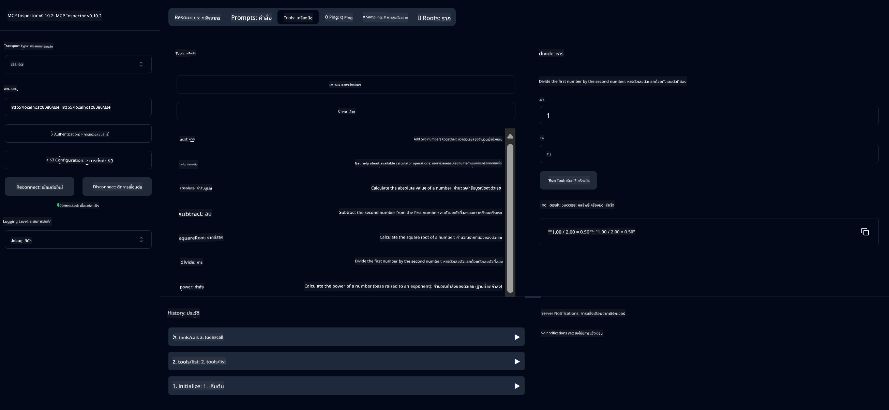

<!--
CO_OP_TRANSLATOR_METADATA:
{
  "original_hash": "13231e9951b68efd9df8c56bd5cdb27e",
  "translation_date": "2025-07-13T22:27:12+00:00",
  "source_file": "03-GettingStarted/samples/java/calculator/README.md",
  "language_code": "th"
}
-->
# Basic Calculator MCP Service

บริการนี้ให้บริการการคำนวณพื้นฐานผ่าน Model Context Protocol (MCP) โดยใช้ Spring Boot กับ WebFlux transport ออกแบบมาเป็นตัวอย่างง่าย ๆ สำหรับผู้เริ่มต้นที่ต้องการเรียนรู้เกี่ยวกับการใช้งาน MCP

สำหรับข้อมูลเพิ่มเติม ดูได้ที่เอกสารอ้างอิง [MCP Server Boot Starter](https://docs.spring.io/spring-ai/reference/api/mcp/mcp-server-boot-starter-docs.html)

## ภาพรวม

บริการนี้แสดงให้เห็นถึง:
- การรองรับ SSE (Server-Sent Events)
- การลงทะเบียนเครื่องมืออัตโนมัติด้วย annotation `@Tool` ของ Spring AI
- ฟังก์ชันเครื่องคิดเลขพื้นฐาน:
  - การบวก ลบ คูณ หาร
  - การยกกำลังและการหารากที่สอง
  - การหาค่าเศษเหลือ (modulus) และค่าบวกสัมบูรณ์
  - ฟังก์ชันช่วยเหลือสำหรับคำอธิบายการทำงาน

## คุณสมบัติ

บริการเครื่องคิดเลขนี้มีความสามารถดังนี้:

1. **การคำนวณเลขคณิตพื้นฐาน**:
   - การบวกเลขสองจำนวน
   - การลบเลขจำนวนหนึ่งจากอีกจำนวนหนึ่ง
   - การคูณเลขสองจำนวน
   - การหารเลขจำนวนหนึ่งด้วยอีกจำนวนหนึ่ง (ตรวจสอบการหารด้วยศูนย์)

2. **การคำนวณขั้นสูง**:
   - การยกกำลัง (ยกฐานกำลังชี้กำลัง)
   - การหารากที่สอง (ตรวจสอบเลขลบ)
   - การหาค่าเศษเหลือ (modulus)
   - การหาค่าบวกสัมบูรณ์

3. **ระบบช่วยเหลือ**:
   - ฟังก์ชันช่วยเหลือในตัวที่อธิบายการทำงานทั้งหมดที่มีให้ใช้

## การใช้งานบริการ

บริการนี้เปิดเผย API endpoints ผ่านโปรโตคอล MCP ดังนี้:

- `add(a, b)`: บวกเลขสองจำนวนเข้าด้วยกัน
- `subtract(a, b)`: ลบเลขตัวที่สองจากตัวแรก
- `multiply(a, b)`: คูณเลขสองจำนวน
- `divide(a, b)`: หารเลขตัวแรกด้วยตัวที่สอง (ตรวจสอบหารด้วยศูนย์)
- `power(base, exponent)`: คำนวณเลขยกกำลัง
- `squareRoot(number)`: คำนวณหารากที่สอง (ตรวจสอบเลขลบ)
- `modulus(a, b)`: คำนวณเศษเหลือจากการหาร
- `absolute(number)`: คำนวณค่าบวกสัมบูรณ์
- `help()`: รับข้อมูลเกี่ยวกับการทำงานที่มีให้ใช้

## ตัวอย่างไคลเอนต์ทดสอบ

มีตัวอย่างไคลเอนต์ทดสอบง่าย ๆ อยู่ในแพ็กเกจ `com.microsoft.mcp.sample.client` คลาส `SampleCalculatorClient` แสดงตัวอย่างการใช้งานฟังก์ชันต่าง ๆ ของบริการเครื่องคิดเลข

## การใช้งาน LangChain4j Client

โปรเจกต์นี้มีตัวอย่างไคลเอนต์ LangChain4j ใน `com.microsoft.mcp.sample.client.LangChain4jClient` ที่แสดงวิธีการเชื่อมต่อบริการเครื่องคิดเลขกับ LangChain4j และโมเดลของ GitHub:

### ข้อกำหนดเบื้องต้น

1. **การตั้งค่า GitHub Token**:
   
   เพื่อใช้โมเดล AI ของ GitHub (เช่น phi-4) คุณต้องมี GitHub personal access token:

   a. ไปที่การตั้งค่าบัญชี GitHub ของคุณ: https://github.com/settings/tokens
   
   b. คลิก "Generate new token" → "Generate new token (classic)"
   
   c. ตั้งชื่อ token ให้ชัดเจน
   
   d. เลือกสิทธิ์ดังนี้:
      - `repo` (ควบคุมเต็มที่ใน repository ส่วนตัว)
      - `read:org` (อ่านข้อมูลองค์กรและสมาชิกทีม, อ่านโปรเจกต์องค์กร)
      - `gist` (สร้าง gists)
      - `user:email` (เข้าถึงอีเมลผู้ใช้ (อ่านอย่างเดียว))
   
   e. คลิก "Generate token" แล้วคัดลอก token ใหม่ของคุณ
   
   f. ตั้งค่าเป็น environment variable:
      
      บน Windows:
      ```
      set GITHUB_TOKEN=your-github-token
      ```
      
      บน macOS/Linux:
      ```bash
      export GITHUB_TOKEN=your-github-token
      ```

   g. สำหรับการตั้งค่าถาวร ให้เพิ่มใน environment variables ผ่านการตั้งค่าระบบ

2. เพิ่ม dependency LangChain4j GitHub ในโปรเจกต์ของคุณ (มีใน pom.xml แล้ว):
   ```xml
   <dependency>
       <groupId>dev.langchain4j</groupId>
       <artifactId>langchain4j-github</artifactId>
       <version>${langchain4j.version}</version>
   </dependency>
   ```

3. ตรวจสอบให้แน่ใจว่าเซิร์ฟเวอร์เครื่องคิดเลขกำลังทำงานที่ `localhost:8080`

### การรัน LangChain4j Client

ตัวอย่างนี้แสดง:
- การเชื่อมต่อกับเซิร์ฟเวอร์ MCP เครื่องคิดเลขผ่าน SSE transport
- การใช้ LangChain4j เพื่อสร้างแชทบอทที่ใช้ฟังก์ชันเครื่องคิดเลข
- การเชื่อมต่อกับโมเดล AI ของ GitHub (ตอนนี้ใช้โมเดล phi-4)

ไคลเอนต์จะส่งคำถามตัวอย่างดังนี้เพื่อแสดงการทำงาน:
1. คำนวณผลบวกของเลขสองจำนวน
2. หารากที่สองของเลขจำนวนหนึ่ง
3. ขอข้อมูลช่วยเหลือเกี่ยวกับฟังก์ชันเครื่องคิดเลขที่มี

รันตัวอย่างและดูผลลัพธ์ในคอนโซลเพื่อดูว่าโมเดล AI ใช้เครื่องมือเครื่องคิดเลขตอบคำถามอย่างไร

### การตั้งค่าโมเดล GitHub

ไคลเอนต์ LangChain4j ตั้งค่าให้ใช้โมเดล phi-4 ของ GitHub ด้วยการตั้งค่าดังนี้:

```java
ChatLanguageModel model = GitHubChatModel.builder()
    .apiKey(System.getenv("GITHUB_TOKEN"))
    .timeout(Duration.ofSeconds(60))
    .modelName("phi-4")
    .logRequests(true)
    .logResponses(true)
    .build();
```

หากต้องการใช้โมเดล GitHub อื่น ๆ ให้เปลี่ยนพารามิเตอร์ `modelName` เป็นโมเดลที่รองรับอื่น ๆ (เช่น "claude-3-haiku-20240307", "llama-3-70b-8192" เป็นต้น)

## Dependencies

โปรเจกต์นี้ต้องการ dependencies หลักดังนี้:

```xml
<!-- For MCP Server -->
<dependency>
    <groupId>org.springframework.ai</groupId>
    <artifactId>spring-ai-starter-mcp-server-webflux</artifactId>
</dependency>

<!-- For LangChain4j integration -->
<dependency>
    <groupId>dev.langchain4j</groupId>
    <artifactId>langchain4j-mcp</artifactId>
    <version>${langchain4j.version}</version>
</dependency>

<!-- For GitHub models support -->
<dependency>
    <groupId>dev.langchain4j</groupId>
    <artifactId>langchain4j-github</artifactId>
    <version>${langchain4j.version}</version>
</dependency>
```

## การสร้างโปรเจกต์

สร้างโปรเจกต์ด้วย Maven:
```bash
./mvnw clean install -DskipTests
```

## การรันเซิร์ฟเวอร์

### การใช้ Java

```bash
java -jar target/calculator-server-0.0.1-SNAPSHOT.jar
```

### การใช้ MCP Inspector

MCP Inspector เป็นเครื่องมือช่วยสำหรับการโต้ตอบกับบริการ MCP วิธีใช้กับบริการเครื่องคิดเลขนี้:

1. **ติดตั้งและรัน MCP Inspector** ในหน้าต่างเทอร์มินัลใหม่:
   ```bash
   npx @modelcontextprotocol/inspector
   ```

2. **เข้าถึงเว็บ UI** โดยคลิกที่ URL ที่แอปแสดง (โดยปกติจะเป็น http://localhost:6274)

3. **ตั้งค่าการเชื่อมต่อ**:
   - ตั้งค่า transport type เป็น "SSE"
   - ตั้งค่า URL เป็น endpoint SSE ของเซิร์ฟเวอร์ที่กำลังรัน: `http://localhost:8080/sse`
   - คลิก "Connect"

4. **ใช้งานเครื่องมือ**:
   - คลิก "List Tools" เพื่อดูฟังก์ชันเครื่องคิดเลขที่มี
   - เลือกเครื่องมือแล้วคลิก "Run Tool" เพื่อรันฟังก์ชัน



### การใช้ Docker

โปรเจกต์นี้มี Dockerfile สำหรับการ deploy แบบ container:

1. **สร้าง Docker image**:
   ```bash
   docker build -t calculator-mcp-service .
   ```

2. **รัน Docker container**:
   ```bash
   docker run -p 8080:8080 calculator-mcp-service
   ```

ขั้นตอนนี้จะ:
- สร้าง Docker image แบบ multi-stage โดยใช้ Maven 3.9.9 และ Eclipse Temurin 24 JDK
- สร้าง container image ที่ปรับแต่งให้เหมาะสม
- เปิดเผยบริการบนพอร์ต 8080
- เริ่มบริการ MCP เครื่องคิดเลขภายใน container

คุณสามารถเข้าถึงบริการได้ที่ `http://localhost:8080` เมื่อ container รันอยู่

## การแก้ไขปัญหา

### ปัญหาทั่วไปเกี่ยวกับ GitHub Token

1. **ปัญหาสิทธิ์ของ Token**: หากได้รับข้อผิดพลาด 403 Forbidden ให้ตรวจสอบว่า token มีสิทธิ์ตามที่ระบุในข้อกำหนดเบื้องต้น

2. **ไม่พบ Token**: หากได้รับข้อผิดพลาด "No API key found" ให้ตรวจสอบว่า environment variable GITHUB_TOKEN ถูกตั้งค่าอย่างถูกต้อง

3. **จำกัดอัตราการใช้งาน (Rate Limiting)**: GitHub API มีข้อจำกัดการใช้งาน หากเจอข้อผิดพลาดจำกัดอัตรา (รหัสสถานะ 429) ให้รอสักครู่ก่อนลองใหม่

4. **Token หมดอายุ**: Token ของ GitHub อาจหมดอายุ หากเจอข้อผิดพลาดการยืนยันตัวตนหลังใช้งานไปสักพัก ให้สร้าง token ใหม่และอัปเดต environment variable

หากต้องการความช่วยเหลือเพิ่มเติม ดูได้ที่ [เอกสาร LangChain4j](https://github.com/langchain4j/langchain4j) หรือ [เอกสาร GitHub API](https://docs.github.com/en/rest)

**ข้อจำกัดความรับผิดชอบ**:  
เอกสารนี้ได้รับการแปลโดยใช้บริการแปลภาษาอัตโนมัติ [Co-op Translator](https://github.com/Azure/co-op-translator) แม้เราจะพยายามให้ความถูกต้องสูงสุด แต่โปรดทราบว่าการแปลอัตโนมัติอาจมีข้อผิดพลาดหรือความไม่ถูกต้อง เอกสารต้นฉบับในภาษาต้นทางถือเป็นแหล่งข้อมูลที่เชื่อถือได้ สำหรับข้อมูลที่สำคัญ ขอแนะนำให้ใช้บริการแปลโดยผู้เชี่ยวชาญมนุษย์ เราไม่รับผิดชอบต่อความเข้าใจผิดหรือการตีความผิดที่เกิดขึ้นจากการใช้การแปลนี้