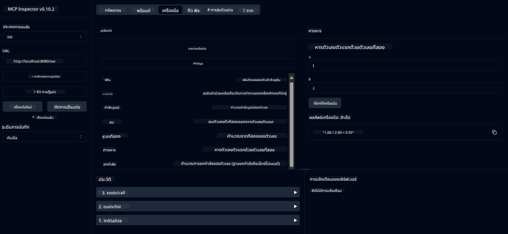

<!--
CO_OP_TRANSLATOR_METADATA:
{
  "original_hash": "13231e9951b68efd9df8c56bd5cdb27e",
  "translation_date": "2025-05-17T13:11:39+00:00",
  "source_file": "03-GettingStarted/samples/java/calculator/README.md",
  "language_code": "th"
}
-->
# บริการเครื่องคิดเลขพื้นฐาน MCP

บริการนี้ให้การดำเนินการเครื่องคิดเลขพื้นฐานผ่าน Model Context Protocol (MCP) โดยใช้ Spring Boot กับการขนส่ง WebFlux ออกแบบมาเป็นตัวอย่างง่าย ๆ สำหรับผู้เริ่มต้นที่เรียนรู้เกี่ยวกับการใช้งาน MCP

สำหรับข้อมูลเพิ่มเติม ดูเอกสารอ้างอิง [MCP Server Boot Starter](https://docs.spring.io/spring-ai/reference/api/mcp/mcp-server-boot-starter-docs.html)

## ภาพรวม

บริการนี้แสดง:
- การสนับสนุน SSE (Server-Sent Events)
- การลงทะเบียนเครื่องมืออัตโนมัติด้วย Spring AI โดยใช้ `@Tool`
- ฟังก์ชันเครื่องคิดเลขพื้นฐาน:
  - การบวก การลบ การคูณ การหาร
  - การคำนวณเลขยกกำลังและรากที่สอง
  - โมดูลัส (เศษเหลือ) และค่าสัมบูรณ์
  - ฟังก์ชันช่วยเหลือสำหรับคำอธิบายการดำเนินการ

## คุณสมบัติ

บริการเครื่องคิดเลขนี้มีความสามารถดังต่อไปนี้:

1. **การดำเนินการทางคณิตศาสตร์พื้นฐาน**:
   - การบวกเลขสองตัว
   - การลบเลขหนึ่งจากอีกเลขหนึ่ง
   - การคูณเลขสองตัว
   - การหารเลขหนึ่งด้วยอีกเลขหนึ่ง (พร้อมตรวจสอบการหารด้วยศูนย์)

2. **การดำเนินการขั้นสูง**:
   - การคำนวณเลขยกกำลัง (การยกฐานให้เป็นเลขชี้กำลัง)
   - การคำนวณรากที่สอง (พร้อมตรวจสอบเลขลบ)
   - การคำนวณโมดูลัส (เศษเหลือ)
   - การคำนวณค่าสัมบูรณ์

3. **ระบบช่วยเหลือ**:
   - ฟังก์ชันช่วยเหลือในตัวอธิบายการดำเนินการที่มีทั้งหมด

## การใช้บริการ

บริการนี้เปิดเผย API endpoints ต่อไปนี้ผ่านโปรโตคอล MCP:

- `add(a, b)`: บวกเลขสองตัวเข้าด้วยกัน
- `subtract(a, b)`: ลบเลขที่สองออกจากเลขแรก
- `multiply(a, b)`: คูณเลขสองตัว
- `divide(a, b)`: หารเลขแรกด้วยเลขที่สอง (พร้อมตรวจสอบศูนย์)
- `power(base, exponent)`: คำนวณเลขยกกำลัง
- `squareRoot(number)`: คำนวณรากที่สอง (พร้อมตรวจสอบเลขลบ)
- `modulus(a, b)`: คำนวณเศษเหลือเมื่อหาร
- `absolute(number)`: คำนวณค่าสัมบูรณ์
- `help()`: รับข้อมูลเกี่ยวกับการดำเนินการที่มีอยู่

## ไคลเอนต์ทดสอบ

มีไคลเอนต์ทดสอบง่าย ๆ รวมอยู่ในแพ็กเกจ `com.microsoft.mcp.sample.client` คลาส `SampleCalculatorClient` แสดงการดำเนินการที่มีอยู่ของบริการเครื่องคิดเลข

## การใช้ไคลเอนต์ LangChain4j

โครงการนี้รวมไคลเอนต์ตัวอย่าง LangChain4j ใน `com.microsoft.mcp.sample.client.LangChain4jClient` ที่แสดงวิธีการรวมบริการเครื่องคิดเลขกับ LangChain4j และโมเดล GitHub:

### ข้อกำหนดเบื้องต้น

1. **การตั้งค่า GitHub Token**:

   เพื่อใช้โมเดล AI ของ GitHub (เช่น phi-4) คุณต้องมี GitHub personal access token:

   a. ไปที่การตั้งค่าบัญชี GitHub ของคุณ: https://github.com/settings/tokens
   
   b. คลิก "Generate new token" → "Generate new token (classic)"
   
   c. ตั้งชื่อให้กับ token ของคุณ
   
   d. เลือก scopes ต่อไปนี้:
      - `repo` (การควบคุมเต็มรูปแบบของ repository ส่วนตัว)
      - `read:org` (อ่านสมาชิกองค์กรและทีม, อ่านโครงการองค์กร)
      - `gist` (สร้าง gists)
      - `user:email` (เข้าถึงที่อยู่อีเมลของผู้ใช้ (อ่านอย่างเดียว))
   
   e. คลิก "Generate token" และคัดลอก token ใหม่ของคุณ
   
   f. ตั้งค่าเป็นตัวแปรสิ่งแวดล้อม:
      
      บน Windows:
      ```
      set GITHUB_TOKEN=your-github-token
      ```
      
      บน macOS/Linux:
      ```bash
      export GITHUB_TOKEN=your-github-token
      ```

   g. สำหรับการตั้งค่าแบบถาวร, เพิ่มมันในตัวแปรสิ่งแวดล้อมผ่านการตั้งค่าระบบ

2. เพิ่มการพึ่งพา LangChain4j GitHub ในโครงการของคุณ (รวมอยู่ใน pom.xml แล้ว):
   ```xml
   <dependency>
       <groupId>dev.langchain4j</groupId>
       <artifactId>langchain4j-github</artifactId>
       <version>${langchain4j.version}</version>
   </dependency>
   ```

3. ตรวจสอบให้แน่ใจว่าเซิร์ฟเวอร์เครื่องคิดเลขกำลังทำงานที่ `localhost:8080`

### การเรียกใช้ไคลเอนต์ LangChain4j

ตัวอย่างนี้แสดง:
- การเชื่อมต่อกับเซิร์ฟเวอร์เครื่องคิดเลข MCP ผ่านการขนส่ง SSE
- การใช้ LangChain4j เพื่อสร้างแชทบอทที่ใช้การดำเนินการของเครื่องคิดเลข
- การรวมกับโมเดล AI ของ GitHub (ตอนนี้ใช้โมเดล phi-4)

ไคลเอนต์ส่งการสอบถามตัวอย่างต่อไปนี้เพื่อแสดงการทำงาน:
1. คำนวณผลรวมของเลขสองตัว
2. หารากที่สองของเลข
3. รับข้อมูลช่วยเหลือเกี่ยวกับการดำเนินการเครื่องคิดเลขที่มีอยู่

เรียกใช้ตัวอย่างและตรวจสอบผลลัพธ์ในคอนโซลเพื่อดูว่าโมเดล AI ใช้เครื่องมือเครื่องคิดเลขตอบคำถามอย่างไร

### การตั้งค่าโมเดล GitHub

ไคลเอนต์ LangChain4j ถูกตั้งค่าให้ใช้โมเดล phi-4 ของ GitHub ด้วยการตั้งค่าต่อไปนี้:

```java
ChatLanguageModel model = GitHubChatModel.builder()
    .apiKey(System.getenv("GITHUB_TOKEN"))
    .timeout(Duration.ofSeconds(60))
    .modelName("phi-4")
    .logRequests(true)
    .logResponses(true)
    .build();
```

เพื่อใช้โมเดล GitHub อื่น ๆ ให้เปลี่ยนพารามิเตอร์ `modelName` เป็นโมเดลที่รองรับอื่น ๆ (เช่น "claude-3-haiku-20240307", "llama-3-70b-8192", เป็นต้น)

## การพึ่งพา

โครงการนี้ต้องการการพึ่งพาหลักต่อไปนี้:

```xml
<!-- For MCP Server -->
<dependency>
    <groupId>org.springframework.ai</groupId>
    <artifactId>spring-ai-starter-mcp-server-webflux</artifactId>
</dependency>

<!-- For LangChain4j integration -->
<dependency>
    <groupId>dev.langchain4j</groupId>
    <artifactId>langchain4j-mcp</artifactId>
    <version>${langchain4j.version}</version>
</dependency>

<!-- For GitHub models support -->
<dependency>
    <groupId>dev.langchain4j</groupId>
    <artifactId>langchain4j-github</artifactId>
    <version>${langchain4j.version}</version>
</dependency>
```

## การสร้างโครงการ

สร้างโครงการโดยใช้ Maven:
```bash
./mvnw clean install -DskipTests
```

## การเรียกใช้เซิร์ฟเวอร์

### การใช้ Java

```bash
java -jar target/calculator-server-0.0.1-SNAPSHOT.jar
```

### การใช้ MCP Inspector

MCP Inspector เป็นเครื่องมือที่มีประโยชน์สำหรับการโต้ตอบกับบริการ MCP เพื่อใช้กับบริการเครื่องคิดเลขนี้:

1. **ติดตั้งและเรียกใช้ MCP Inspector** ในหน้าต่าง terminal ใหม่:
   ```bash
   npx @modelcontextprotocol/inspector
   ```

2. **เข้าถึง UI เว็บ** โดยคลิกลิงก์ที่แสดงโดยแอป (มักจะ http://localhost:6274)

3. **กำหนดการเชื่อมต่อ**:
   - ตั้งค่าประเภทการขนส่งเป็น "SSE"
   - ตั้งค่า URL เป็น endpoint SSE ของเซิร์ฟเวอร์ที่กำลังทำงานของคุณ: `http://localhost:8080/sse`
   - คลิก "Connect"

4. **ใช้เครื่องมือ**:
   - คลิก "List Tools" เพื่อดูการดำเนินการเครื่องคิดเลขที่มีอยู่
   - เลือกเครื่องมือและคลิก "Run Tool" เพื่อดำเนินการ



### การใช้ Docker

โครงการนี้รวม Dockerfile สำหรับการปรับใช้ใน container:

1. **สร้างภาพ Docker**:
   ```bash
   docker build -t calculator-mcp-service .
   ```

2. **เรียกใช้ container Docker**:
   ```bash
   docker run -p 8080:8080 calculator-mcp-service
   ```

นี่จะ:
- สร้างภาพ Docker แบบหลายขั้นตอนด้วย Maven 3.9.9 และ Eclipse Temurin 24 JDK
- สร้างภาพ container ที่ปรับปรุง
- เปิดเผยบริการที่ port 8080
- เริ่มบริการเครื่องคิดเลข MCP ภายใน container

คุณสามารถเข้าถึงบริการได้ที่ `http://localhost:8080` เมื่อ container กำลังทำงาน

## การแก้ไขปัญหา

### ปัญหาทั่วไปกับ GitHub Token

1. **ปัญหาการอนุญาต Token**: หากคุณได้รับข้อผิดพลาด 403 Forbidden ตรวจสอบว่า token ของคุณมีสิทธิ์ที่ถูกต้องตามที่ระบุในข้อกำหนดเบื้องต้น

2. **ไม่พบ Token**: หากคุณได้รับข้อผิดพลาด "No API key found" ตรวจสอบให้แน่ใจว่าตัวแปรสิ่งแวดล้อม GITHUB_TOKEN ถูกตั้งค่าอย่างถูกต้อง

3. **การจำกัดอัตรา**: API ของ GitHub มีการจำกัดอัตรา หากคุณพบข้อผิดพลาดการจำกัดอัตรา (รหัสสถานะ 429) รอสักครู่ก่อนลองอีกครั้ง

4. **การหมดอายุของ Token**: token ของ GitHub สามารถหมดอายุได้ หากคุณได้รับข้อผิดพลาดการตรวจสอบสิทธิ์หลังจากบางเวลา สร้าง token ใหม่และอัปเดตตัวแปรสิ่งแวดล้อมของคุณ

หากคุณต้องการความช่วยเหลือเพิ่มเติม ตรวจสอบ [เอกสาร LangChain4j](https://github.com/langchain4j/langchain4j) หรือ [เอกสาร API ของ GitHub](https://docs.github.com/en/rest)

**คำปฏิเสธความรับผิดชอบ**:  
เอกสารนี้ได้รับการแปลโดยใช้บริการแปล AI [Co-op Translator](https://github.com/Azure/co-op-translator) แม้ว่าเราจะพยายามให้ถูกต้อง แต่โปรดทราบว่าการแปลอัตโนมัติอาจมีข้อผิดพลาดหรือความไม่ถูกต้อง เอกสารต้นฉบับในภาษาที่เป็นต้นฉบับควรถือเป็นแหล่งข้อมูลที่เชื่อถือได้ สำหรับข้อมูลที่สำคัญ แนะนำให้ใช้บริการแปลโดยมนุษย์ที่มีความเชี่ยวชาญ เราไม่รับผิดชอบต่อความเข้าใจผิดหรือการตีความผิดที่เกิดจากการใช้การแปลนี้