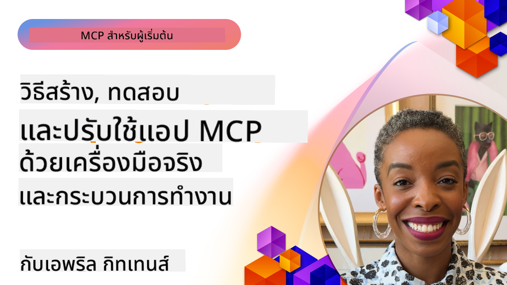
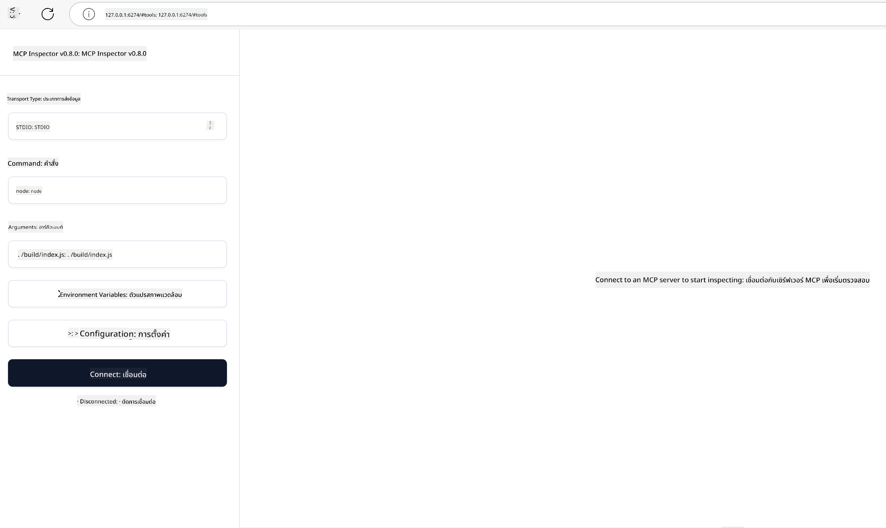

<!--
CO_OP_TRANSLATOR_METADATA:
{
  "original_hash": "83efa75a69bc831277263a6f1ae53669",
  "translation_date": "2025-08-18T14:16:37+00:00",
  "source_file": "04-PracticalImplementation/README.md",
  "language_code": "th"
}
-->
# การใช้งานจริง

[](https://youtu.be/vCN9-mKBDfQ)

_(คลิกที่ภาพด้านบนเพื่อดูวิดีโอของบทเรียนนี้)_

การใช้งานจริงคือจุดที่พลังของ Model Context Protocol (MCP) กลายเป็นสิ่งที่จับต้องได้ แม้ว่าการเข้าใจทฤษฎีและสถาปัตยกรรมเบื้องหลัง MCP จะมีความสำคัญ แต่คุณค่าที่แท้จริงจะปรากฏเมื่อคุณนำแนวคิดเหล่านี้ไปใช้เพื่อสร้าง ทดสอบ และปรับใช้โซลูชันที่แก้ปัญหาในโลกจริง บทนี้จะเชื่อมโยงช่องว่างระหว่างความรู้เชิงแนวคิดและการพัฒนาที่ลงมือทำจริง โดยแนะนำคุณตลอดกระบวนการสร้างแอปพลิเคชันที่ใช้ MCP ให้เป็นจริง

ไม่ว่าคุณจะพัฒนาผู้ช่วยอัจฉริยะ ผสาน AI เข้ากับเวิร์กโฟลว์ทางธุรกิจ หรือสร้างเครื่องมือเฉพาะสำหรับการประมวลผลข้อมูล MCP มอบพื้นฐานที่ยืดหยุ่น การออกแบบที่ไม่ขึ้นกับภาษาและ SDK อย่างเป็นทางการสำหรับภาษาการเขียนโปรแกรมยอดนิยมทำให้ MCP เข้าถึงนักพัฒนาหลากหลายกลุ่มได้ง่าย ด้วยการใช้ SDK เหล่านี้ คุณสามารถสร้างต้นแบบ ทำซ้ำ และขยายโซลูชันของคุณได้อย่างรวดเร็วในแพลตฟอร์มและสภาพแวดล้อมต่างๆ

ในส่วนถัดไป คุณจะพบตัวอย่างการใช้งานจริง โค้ดตัวอย่าง และกลยุทธ์การปรับใช้ที่แสดงให้เห็นวิธีการใช้งาน MCP ใน C#, Java with Spring, TypeScript, JavaScript และ Python นอกจากนี้ คุณยังจะได้เรียนรู้วิธีการดีบักและทดสอบเซิร์ฟเวอร์ MCP จัดการ API และปรับใช้โซลูชันไปยังคลาวด์ด้วย Azure ทรัพยากรที่ลงมือทำเหล่านี้ออกแบบมาเพื่อเร่งการเรียนรู้ของคุณและช่วยให้คุณสร้างแอปพลิเคชัน MCP ที่พร้อมใช้งานในระดับการผลิตได้อย่างมั่นใจ

## ภาพรวม

บทเรียนนี้มุ่งเน้นไปที่แง่มุมการใช้งานจริงของ MCP ในหลายภาษาโปรแกรม เราจะสำรวจวิธีการใช้ MCP SDK ใน C#, Java with Spring, TypeScript, JavaScript และ Python เพื่อสร้างแอปพลิเคชันที่แข็งแกร่ง ดีบักและทดสอบเซิร์ฟเวอร์ MCP และสร้างทรัพยากร, prompts และเครื่องมือที่นำกลับมาใช้ใหม่ได้

## วัตถุประสงค์การเรียนรู้

เมื่อจบบทเรียนนี้ คุณจะสามารถ:

- ใช้งานโซลูชัน MCP โดยใช้ SDK อย่างเป็นทางการในหลายภาษาโปรแกรม
- ดีบักและทดสอบเซิร์ฟเวอร์ MCP อย่างเป็นระบบ
- สร้างและใช้ฟีเจอร์เซิร์ฟเวอร์ (Resources, Prompts, และ Tools)
- ออกแบบเวิร์กโฟลว์ MCP ที่มีประสิทธิภาพสำหรับงานที่ซับซ้อน
- ปรับปรุงการใช้งาน MCP ให้เหมาะสมสำหรับประสิทธิภาพและความน่าเชื่อถือ

## ทรัพยากร SDK อย่างเป็นทางการ

Model Context Protocol มี SDK อย่างเป็นทางการสำหรับหลายภาษา:

- [C# SDK](https://github.com/modelcontextprotocol/csharp-sdk)
- [Java with Spring SDK](https://github.com/modelcontextprotocol/java-sdk) **หมายเหตุ:** ต้องการการพึ่งพา [Project Reactor](https://projectreactor.io) (ดู [discussion issue 246](https://github.com/orgs/modelcontextprotocol/discussions/246))
- [TypeScript SDK](https://github.com/modelcontextprotocol/typescript-sdk)
- [Python SDK](https://github.com/modelcontextprotocol/python-sdk)
- [Kotlin SDK](https://github.com/modelcontextprotocol/kotlin-sdk)

## การทำงานกับ MCP SDKs

ส่วนนี้ให้ตัวอย่างการใช้งาน MCP ในหลายภาษาโปรแกรม คุณสามารถค้นหาโค้ดตัวอย่างในไดเรกทอรี `samples` ที่จัดระเบียบตามภาษา

### ตัวอย่างที่มีให้

ที่เก็บนี้รวม [ตัวอย่างการใช้งาน](../../../04-PracticalImplementation/samples) ในภาษาต่อไปนี้:

- [C#](./samples/csharp/README.md)
- [Java with Spring](./samples/java/containerapp/README.md)
- [TypeScript](./samples/typescript/README.md)
- [JavaScript](./samples/javascript/README.md)
- [Python](./samples/python/README.md)

แต่ละตัวอย่างแสดงแนวคิดและรูปแบบการใช้งาน MCP ที่สำคัญสำหรับภาษานั้นๆ และระบบนิเวศ

## ฟีเจอร์หลักของเซิร์ฟเวอร์

เซิร์ฟเวอร์ MCP สามารถใช้งานฟีเจอร์เหล่านี้ได้ตามต้องการ:

### Resources

Resources ให้บริบทและข้อมูลสำหรับผู้ใช้หรือโมเดล AI:

- คลังเอกสาร
- ฐานความรู้
- แหล่งข้อมูลที่มีโครงสร้าง
- ระบบไฟล์

### Prompts

Prompts คือข้อความและเวิร์กโฟลว์ที่มีการกำหนดรูปแบบไว้ล่วงหน้าสำหรับผู้ใช้:

- แม่แบบการสนทนาที่กำหนดไว้ล่วงหน้า
- รูปแบบการโต้ตอบที่มีการแนะนำ
- โครงสร้างการสนทนาเฉพาะทาง

### Tools

Tools คือฟังก์ชันสำหรับโมเดล AI เพื่อดำเนินการ:

- เครื่องมือประมวลผลข้อมูล
- การผสานรวม API ภายนอก
- ความสามารถในการคำนวณ
- ฟังก์ชันการค้นหา

## ตัวอย่างการใช้งาน: การใช้งาน C#

ที่เก็บ SDK อย่างเป็นทางการของ C# มีตัวอย่างการใช้งานหลายตัวอย่างที่แสดงแง่มุมต่างๆ ของ MCP:

- **Basic MCP Client**: ตัวอย่างง่ายๆ ที่แสดงวิธีสร้าง MCP client และเรียกใช้ tools
- **Basic MCP Server**: การใช้งานเซิร์ฟเวอร์ขั้นต่ำพร้อมการลงทะเบียน tools พื้นฐาน
- **Advanced MCP Server**: เซิร์ฟเวอร์ที่มีฟีเจอร์ครบถ้วนพร้อมการลงทะเบียน tools, การตรวจสอบสิทธิ์ และการจัดการข้อผิดพลาด
- **ASP.NET Integration**: ตัวอย่างที่แสดงการผสานรวมกับ ASP.NET Core
- **Tool Implementation Patterns**: รูปแบบต่างๆ สำหรับการใช้งาน tools ด้วยระดับความซับซ้อนที่แตกต่างกัน

MCP C# SDK อยู่ในช่วงพรีวิวและ API อาจมีการเปลี่ยนแปลง เราจะอัปเดตบล็อกนี้อย่างต่อเนื่องเมื่อ SDK พัฒนาไป

### ฟีเจอร์สำคัญ

- [C# MCP Nuget ModelContextProtocol](https://www.nuget.org/packages/ModelContextProtocol)
- การสร้าง [เซิร์ฟเวอร์ MCP แรกของคุณ](https://devblogs.microsoft.com/dotnet/build-a-model-context-protocol-mcp-server-in-csharp/)

สำหรับตัวอย่างการใช้งาน C# แบบสมบูรณ์ โปรดเยี่ยมชม [ที่เก็บตัวอย่าง SDK C# อย่างเป็นทางการ](https://github.com/modelcontextprotocol/csharp-sdk)

## ตัวอย่างการใช้งาน: การใช้งาน Java with Spring

SDK Java with Spring มีตัวเลือกการใช้งาน MCP ที่แข็งแกร่งพร้อมฟีเจอร์ระดับองค์กร

### ฟีเจอร์สำคัญ

- การผสานรวมกับ Spring Framework
- ความปลอดภัยของประเภทข้อมูลที่แข็งแกร่ง
- รองรับการเขียนโปรแกรมเชิงปฏิกิริยา
- การจัดการข้อผิดพลาดที่ครอบคลุม

สำหรับตัวอย่างการใช้งาน Java with Spring แบบสมบูรณ์ ดู [ตัวอย่าง Java with Spring](samples/java/containerapp/README.md) ในไดเรกทอรีตัวอย่าง

## ตัวอย่างการใช้งาน: การใช้งาน JavaScript

SDK JavaScript มอบวิธีการที่เบาและยืดหยุ่นสำหรับการใช้งาน MCP

### ฟีเจอร์สำคัญ

- รองรับ Node.js และเบราว์เซอร์
- API ที่ใช้ Promise
- การผสานรวมง่ายกับ Express และเฟรมเวิร์กอื่นๆ
- รองรับ WebSocket สำหรับการสตรีม

สำหรับตัวอย่างการใช้งาน JavaScript แบบสมบูรณ์ ดู [ตัวอย่าง JavaScript](samples/javascript/README.md) ในไดเรกทอรีตัวอย่าง

## ตัวอย่างการใช้งาน: การใช้งาน Python

SDK Python มอบวิธีการที่เป็นธรรมชาติสำหรับการใช้งาน MCP พร้อมการผสานรวมกับเฟรมเวิร์ก ML ที่ยอดเยี่ยม

### ฟีเจอร์สำคัญ

- รองรับ Async/await ด้วย asyncio
- การผสานรวมกับ FastAPI
- การลงทะเบียน tools ที่ง่าย
- การผสานรวมกับไลบรารี ML ยอดนิยม

สำหรับตัวอย่างการใช้งาน Python แบบสมบูรณ์ ดู [ตัวอย่าง Python](samples/python/README.md) ในไดเรกทอรีตัวอย่าง

## การจัดการ API

Azure API Management เป็นคำตอบที่ดีสำหรับการรักษาความปลอดภัยเซิร์ฟเวอร์ MCP แนวคิดคือการวาง Azure API Management ไว้หน้าของเซิร์ฟเวอร์ MCP และให้มันจัดการฟีเจอร์ที่คุณอาจต้องการ เช่น:

- การจำกัดอัตรา
- การจัดการโทเค็น
- การตรวจสอบ
- การปรับสมดุลโหลด
- ความปลอดภัย

### ตัวอย่าง Azure

นี่คือตัวอย่าง Azure ที่ทำสิ่งนี้โดยเฉพาะ เช่น [การสร้างเซิร์ฟเวอร์ MCP และรักษาความปลอดภัยด้วย Azure API Management](https://github.com/Azure-Samples/remote-mcp-apim-functions-python)

ดูว่ากระบวนการอนุญาตเกิดขึ้นอย่างไรในภาพด้านล่าง:


ในภาพด้านบน สิ่งต่อไปนี้เกิดขึ้น:

- การตรวจสอบสิทธิ์/การอนุญาตเกิดขึ้นโดยใช้ Microsoft Entra
- Azure API Management ทำหน้าที่เป็นเกตเวย์และใช้นโยบายเพื่อกำหนดและจัดการทราฟฟิก
- Azure Monitor บันทึกคำขอทั้งหมดเพื่อการวิเคราะห์เพิ่มเติม

#### กระบวนการอนุญาต

มาดูรายละเอียดกระบวนการอนุญาตเพิ่มเติม:


#### ข้อกำหนดการอนุญาต MCP

เรียนรู้เพิ่มเติมเกี่ยวกับ [ข้อกำหนดการอนุญาต MCP](https://modelcontextprotocol.io/specification/2025-03-26/basic/authorization#2-10-third-party-authorization-flow)

## การปรับใช้เซิร์ฟเวอร์ MCP ระยะไกลไปยัง Azure

มาดูกันว่าเราสามารถปรับใช้ตัวอย่างที่กล่าวถึงก่อนหน้านี้ได้หรือไม่:

1. โคลน repo

    ```bash
    git clone https://github.com/Azure-Samples/remote-mcp-apim-functions-python.git
    cd remote-mcp-apim-functions-python
    ```

1. ลงทะเบียน `Microsoft.App` resource provider

   - หากคุณใช้ Azure CLI ให้รัน `az provider register --namespace Microsoft.App --wait`
   - หากคุณใช้ Azure PowerShell ให้รัน `Register-AzResourceProvider -ProviderNamespace Microsoft.App` จากนั้นรัน `(Get-AzResourceProvider -ProviderNamespace Microsoft.App).RegistrationState` หลังจากเวลาผ่านไปเพื่อดูว่าการลงทะเบียนเสร็จสมบูรณ์หรือไม่

1. รันคำสั่ง [azd](https://aka.ms/azd) นี้เพื่อจัดเตรียมบริการการจัดการ API, ฟังก์ชันแอป (พร้อมโค้ด) และทรัพยากร Azure อื่นๆ ที่จำเป็นทั้งหมด

    ```shell
    azd up
    ```

    คำสั่งนี้ควรปรับใช้ทรัพยากรคลาวด์ทั้งหมดบน Azure

### การทดสอบเซิร์ฟเวอร์ของคุณด้วย MCP Inspector

1. ใน **หน้าต่างเทอร์มินัลใหม่** ติดตั้งและรัน MCP Inspector

    ```shell
    npx @modelcontextprotocol/inspector
    ```

    คุณควรเห็นอินเทอร์เฟซที่คล้ายกับ:

    

1. กด CTRL คลิกเพื่อโหลดเว็บแอป MCP Inspector จาก URL ที่แสดงโดยแอป (เช่น [http://127.0.0.1:6274/#resources](http://127.0.0.1:6274/#resources))
1. ตั้งค่าประเภทการส่งข้อมูลเป็น `SSE`
1. ตั้งค่า URL ไปยังจุดสิ้นสุด API Management SSE ที่กำลังทำงานของคุณที่แสดงหลังจาก `azd up` และ **Connect**:

    ```shell
    https://<apim-servicename-from-azd-output>.azure-api.net/mcp/sse
    ```

1. **List Tools** คลิกที่เครื่องมือและ **Run Tool**

หากทุกขั้นตอนทำงาน คุณควรเชื่อมต่อกับเซิร์ฟเวอร์ MCP และสามารถเรียกใช้เครื่องมือได้

## เซิร์ฟเวอร์ MCP สำหรับ Azure

[Remote-mcp-functions](https://github.com/Azure-Samples/remote-mcp-functions-dotnet): ชุดที่เก็บนี้เป็นเทมเพลตเริ่มต้นอย่างรวดเร็วสำหรับการสร้างและปรับใช้เซิร์ฟเวอร์ MCP (Model Context Protocol) ระยะไกลแบบกำหนดเองโดยใช้ Azure Functions กับ Python, C# .NET หรือ Node/TypeScript

ตัวอย่างนี้มอบโซลูชันที่สมบูรณ์ที่ช่วยให้นักพัฒนาสามารถ:

- สร้างและรันในเครื่อง: พัฒนาและดีบักเซิร์ฟเวอร์ MCP บนเครื่องในพื้นที่
- ปรับใช้ไปยัง Azure: ปรับใช้ไปยังคลาวด์ได้อย่างง่ายดายด้วยคำสั่ง azd up ง่ายๆ
- เชื่อมต่อจากไคลเอนต์: เชื่อมต่อกับเซิร์ฟเวอร์ MCP จากไคลเอนต์ต่างๆ รวมถึงโหมด Copilot agent ของ VS Code และเครื่องมือ MCP Inspector

### ฟีเจอร์สำคัญ

- ความปลอดภัยโดยการออกแบบ: เซิร์ฟเวอร์ MCP ได้รับการรักษาความปลอดภัยโดยใช้คีย์และ HTTPS
- ตัวเลือกการตรวจสอบสิทธิ์: รองรับ OAuth โดยใช้การตรวจสอบสิทธิ์ในตัวและ/หรือการจัดการ API
- การแยกเครือข่าย: อนุญาตการแยกเครือข่ายโดยใช้ Azure Virtual Networks (VNET)
- สถาปัตยกรรมแบบไร้เซิร์ฟเวอร์: ใช้ Azure Functions สำหรับการดำเนินการที่ปรับขนาดได้และขับเคลื่อนด้วยเหตุการณ์
- การพัฒนาในเครื่อง: รองรับการพัฒนาและดีบักในเครื่องอย่างครอบคลุม
- การปรับใช้ง่าย: กระบวนการปรับใช้ที่คล่องตัวไปยัง Azure

ที่เก็บนี้รวมไฟล์การกำหนดค่าที่จำเป็นทั้งหมด โค้ดต้นฉบับ และคำจำกัดความโครงสร้างพื้นฐานเพื่อเริ่มต้นใช้งานการใช้งานเซิร์ฟเวอร์ MCP ที่พร้อมใช้งานในระดับการผลิตได้อย่างรวดเร็ว

- [Azure Remote MCP Functions Python](https://github.com/Azure-Samples/remote-mcp-functions-python) - ตัวอย่างการใช้งาน MCP โดยใช้ Azure Functions กับ Python

- [Azure Remote MCP Functions .NET](https://github.com/Azure-Samples/remote-mcp-functions-dotnet) - ตัวอย่างการใช้งาน MCP โดยใช้ Azure Functions กับ C# .NET

- [Azure Remote MCP Functions Node/Typescript](https://github.com/Azure-Samples/remote-mcp-functions-typescript) - ตัวอย่างการใช้งาน MCP โดยใช้ Azure Functions กับ Node/TypeScript

## ประเด็นสำคัญ

- MCP SDKs มอบเครื่องมือเฉพาะภาษาสำหรับการใช้งานโซลูชัน MCP ที่แข็งแกร่ง
- กระบวนการดีบักและทดสอบมีความสำคัญต่อแอปพลิเคชัน MCP ที่เชื่อถือได้
- แม่แบบ prompt ที่นำกลับมาใช้ใหม่ช่วยให้การโต้ตอบ AI มีความสม่ำเสมอ
- เวิร์กโฟลว์ที่ออกแบบมาอย่างดีสามารถจัดการงานที่ซับซ้อนโดยใช้เครื่องมือหลายตัว
- การใช้งานโซลูชัน MCP ต้องพิจารณาด้านความปลอดภัย ประสิทธิภาพ และการจัดการข้อผิดพลาด

## แบบฝึกหัด

ออกแบบเวิร์กโฟลว์ MCP ที่ใช้งานได้จริงซึ่งแก้ปัญหาในโลกจริงในโดเมนของคุณ:

1. ระบุเครื่องมือ 3-4 ตัวที่มีประโยชน์สำหรับการแก้ปัญหานี้
2. สร้างแผนภาพเวิร์กโฟลว์ที่แสดงวิธีการที่เครื่องมือเหล่านี้โต้ตอบกัน
3. ใช้งานเวอร์ชันพื้นฐานของหนึ่งในเครื่องมือโดยใช้ภาษาที่คุณชื่นชอบ
4. สร้างแม่แบบ prompt ที่ช่วยให้โมเดลใช้เครื่องมือของคุณได้อย่างมีประสิทธิภาพ

## ทรัพยากรเพิ่มเติม

---

ถัดไป: [หัวข้อขั้นสูง](../05-AdvancedTopics/README.md)

**ข้อจำกัดความรับผิดชอบ**:  
เอกสารนี้ได้รับการแปลโดยใช้บริการแปลภาษา AI [Co-op Translator](https://github.com/Azure/co-op-translator) แม้ว่าเราจะพยายามอย่างเต็มที่เพื่อให้การแปลมีความถูกต้อง โปรดทราบว่าการแปลอัตโนมัติอาจมีข้อผิดพลาดหรือความไม่แม่นยำ เอกสารต้นฉบับในภาษาดั้งเดิมควรถือเป็นแหล่งข้อมูลที่เชื่อถือได้ สำหรับข้อมูลที่สำคัญ ขอแนะนำให้ใช้บริการแปลภาษาจากผู้เชี่ยวชาญ เราจะไม่รับผิดชอบต่อความเข้าใจผิดหรือการตีความที่ผิดพลาดซึ่งเกิดจากการใช้การแปลนี้