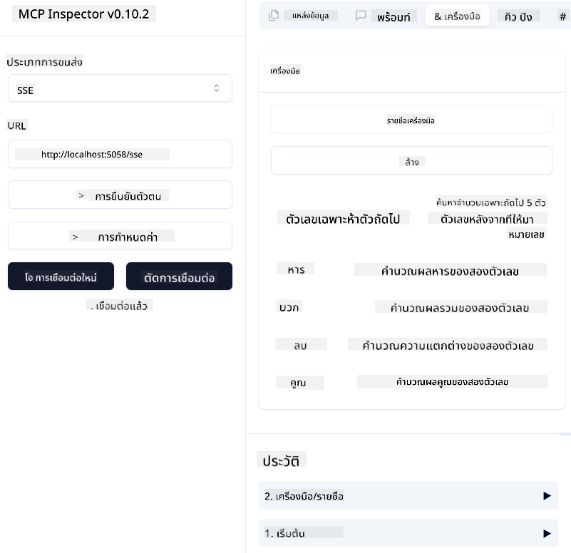
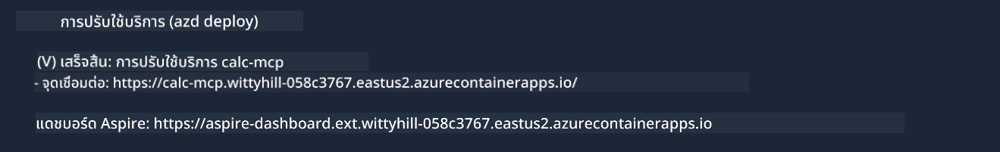

<!--
CO_OP_TRANSLATOR_METADATA:
{
  "original_hash": "5020a3e1a1c7f30c00f9e37f1fa208e3",
  "translation_date": "2025-05-17T14:08:55+00:00",
  "source_file": "04-PracticalImplementation/samples/csharp/README.md",
  "language_code": "th"
}
-->
# ตัวอย่าง

ตัวอย่างก่อนหน้านี้แสดงวิธีการใช้โปรเจค .NET ในเครื่องกับประเภท `sdio` และวิธีการรันเซิร์ฟเวอร์ในเครื่องในคอนเทนเนอร์ นี่เป็นวิธีแก้ปัญหาที่ดีในหลายสถานการณ์ อย่างไรก็ตาม มันจะมีประโยชน์ถ้าเซิร์ฟเวอร์รันอยู่ในระยะไกล เช่น ในสภาพแวดล้อมคลาวด์ นี่คือที่ที่ประเภท `http` เข้ามามีบทบาท

เมื่อดูที่วิธีแก้ปัญหาในโฟลเดอร์ `04-PracticalImplementation` อาจดูซับซ้อนกว่าตัวอย่างก่อนหน้า แต่จริงๆ แล้วไม่ใช่ ถ้าดูอย่างใกล้ชิดในโปรเจค `src/mcpserver/mcpserver.csproj` คุณจะเห็นว่ามันเป็นโค้ดเดียวกันกับตัวอย่างก่อนหน้า ความแตกต่างเดียวคือเราใช้ไลบรารี `ModelContextProtocol.AspNetCore` ที่แตกต่างกันเพื่อจัดการกับคำขอ HTTP และเราเปลี่ยนวิธี `IsPrime` ให้เป็นแบบ private เพียงเพื่อแสดงว่าคุณสามารถมีวิธี private ในโค้ดของคุณ โค้ดที่เหลือเหมือนกับก่อนหน้า

โปรเจคอื่นๆ มาจาก [.NET Aspire](https://learn.microsoft.com/dotnet/aspire/get-started/aspire-overview) การมี .NET Aspire ในวิธีแก้ปัญหาจะช่วยปรับปรุงประสบการณ์ของนักพัฒนาในขณะพัฒนาและทดสอบ และช่วยในการสังเกต ไม่จำเป็นต้องรันเซิร์ฟเวอร์ แต่เป็นการปฏิบัติที่ดีที่จะมีมันในวิธีแก้ปัญหาของคุณ

## เริ่มเซิร์ฟเวอร์ในเครื่อง

1. จาก VS Code (พร้อมส่วนขยาย C# DevKit) เปิดวิธีแก้ปัญหา `04-PracticalImplementation\samples\csharp\src\Calculator-chap4.sln`
2. กด `F5` เพื่อเริ่มเซิร์ฟเวอร์ มันควรจะเปิดเว็บเบราว์เซอร์พร้อมแดชบอร์ด .NET Aspire

หรือ

1. จาก terminal นำทางไปยังโฟลเดอร์ `04-PracticalImplementation\samples\csharp\src`
2. รันคำสั่งต่อไปนี้เพื่อเริ่มเซิร์ฟเวอร์:
   ```bash
    dotnet run --project .\AppHost
   ```

3. จากแดชบอร์ด สังเกต URL `http` มันควรจะเป็นบางอย่างเช่น `http://localhost:5058/`.

## Test `SSE` พร้อมกับ ModelContext Protocol Inspector

หากคุณมี Node.js 22.7.5 ขึ้นไป คุณสามารถใช้ ModelContext Protocol Inspector เพื่อทดสอบเซิร์ฟเวอร์ของคุณ

เริ่มเซิร์ฟเวอร์และรันคำสั่งต่อไปนี้ใน terminal:

```bash
npx @modelcontextprotocol/inspector@latest
```



- เลือก `SSE` as the Transport type. SSE stand for Server-Sent Events. 
- In the Url field, enter the URL of the server noted earlier,and append `/sse` มันควรจะเป็น `http` (ไม่ใช่ `https`) something like `http://localhost:5058/sse`.
- select the Connect button.

A nice thing about the Inspector is that it provide a nice visibility on what is happening.

- Try listing the availables tools
- Try some of them, it should works just like before.


## Test `SSE` with Github Copilot Chat in VS Code

To use the `SSE` transport with Github Copilot Chat, change the configuration of the `mcp-calc` เซิร์ฟเวอร์ที่สร้างขึ้นก่อนหน้านี้เพื่อให้ดูเหมือนนี้:

```json
"mcp-calc": {
    "type": "sse",
    "url": "http://localhost:5058/sse"
}
```

ทำการทดสอบบางอย่าง:
- ขอจำนวนเฉพาะ 3 ตัวหลังจาก 6780 สังเกตว่า Copilot จะใช้เครื่องมือใหม่ `NextFivePrimeNumbers` และคืนค่าเฉพาะ 3 ตัวแรกเท่านั้น
- ขอจำนวนเฉพาะ 7 ตัวหลังจาก 111 เพื่อดูว่าเกิดอะไรขึ้น

# Deploy เซิร์ฟเวอร์ไปยัง Azure

มา deploy เซิร์ฟเวอร์ไปยัง Azure เพื่อให้คนอื่นๆ สามารถใช้งานได้

จาก terminal นำทางไปยังโฟลเดอร์ `04-PracticalImplementation\samples\csharp\src` และรันคำสั่งต่อไปนี้:

```bash
azd init
```

นี่จะสร้างไฟล์บางอย่างในเครื่องเพื่อบันทึกการตั้งค่าทรัพยากร Azure และโครงสร้างพื้นฐานของคุณเป็นโค้ด (IaC)

จากนั้น รันคำสั่งต่อไปนี้เพื่อ deploy เซิร์ฟเวอร์ไปยัง Azure:

```bash
azd up
```

เมื่อการ deploy เสร็จสิ้น คุณควรเห็นข้อความบางอย่างเช่นนี้:



นำทางไปยังแดชบอร์ด Aspire และสังเกต URL `HTTP` เพื่อใช้ใน MCP Inspector และใน Github Copilot Chat

## อะไรต่อไป?

เราลองใช้ประเภทการขนส่งต่างๆ และเครื่องมือทดสอบ และเรายัง deploy เซิร์ฟเวอร์ MCP ของเราไปยัง Azure แต่ถ้าเซิร์ฟเวอร์ของเราต้องการเข้าถึงทรัพยากรส่วนตัวล่ะ? เช่น ฐานข้อมูลหรือ API ส่วนตัว? ในบทถัดไป เราจะเห็นวิธีการปรับปรุงความปลอดภัยของเซิร์ฟเวอร์ของเรา

**ข้อจำกัดความรับผิดชอบ**:  
เอกสารนี้ได้รับการแปลโดยใช้บริการแปลภาษา AI [Co-op Translator](https://github.com/Azure/co-op-translator) แม้ว่าเราจะพยายามให้ได้ความถูกต้อง แต่โปรดทราบว่าการแปลอัตโนมัติอาจมีข้อผิดพลาดหรือความไม่ถูกต้อง เอกสารต้นฉบับในภาษาต้นทางควรถือเป็นแหล่งข้อมูลที่เชื่อถือได้ สำหรับข้อมูลที่สำคัญ แนะนำให้ใช้การแปลโดยมนุษย์ที่มีความเชี่ยวชาญ เราไม่รับผิดชอบต่อความเข้าใจผิดหรือการตีความที่ผิดพลาดซึ่งเกิดจากการใช้การแปลนี้