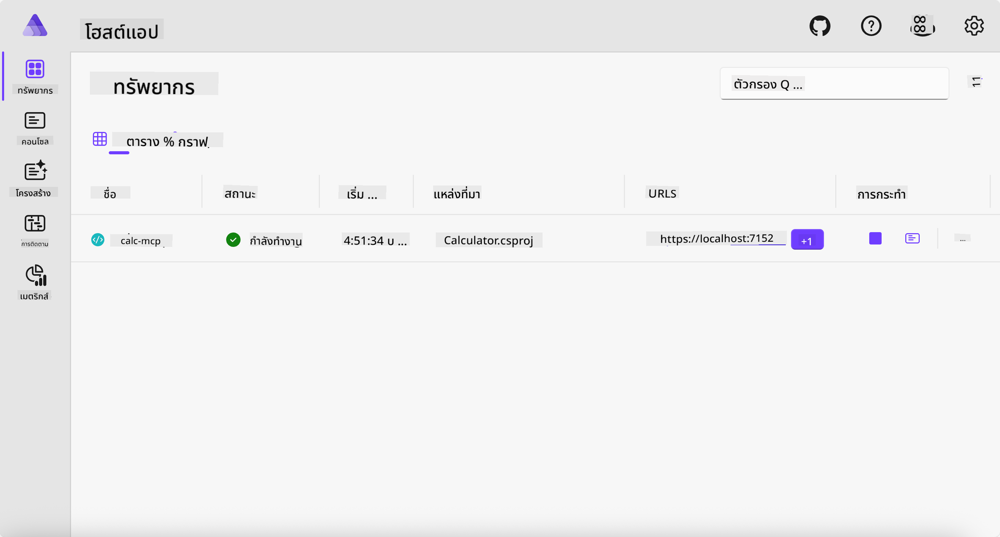
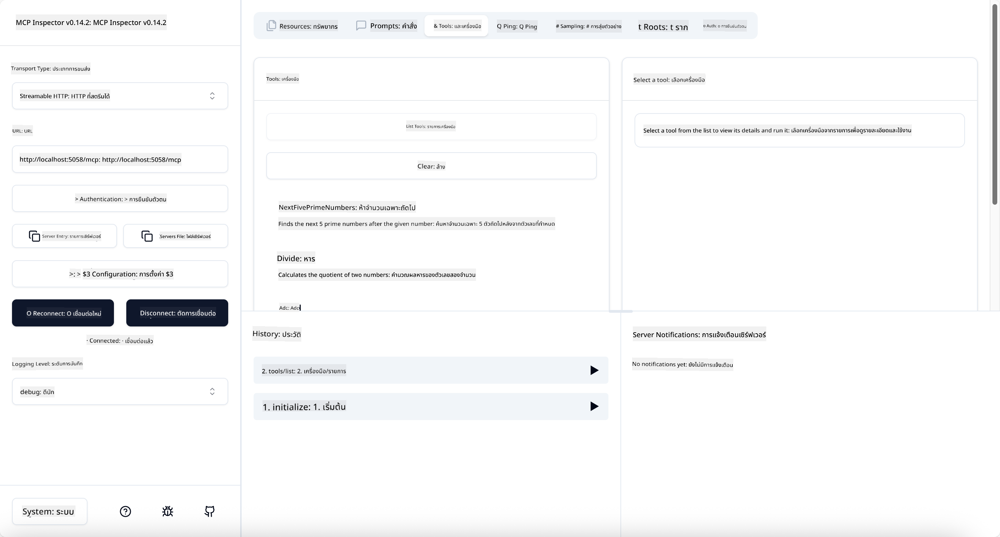
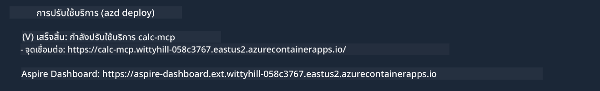

<!--
CO_OP_TRANSLATOR_METADATA:
{
  "original_hash": "0bc7bd48f55f1565f1d95ccb2c16f728",
  "translation_date": "2025-07-13T23:07:11+00:00",
  "source_file": "04-PracticalImplementation/samples/csharp/README.md",
  "language_code": "th"
}
-->
# ตัวอย่าง

ตัวอย่างก่อนหน้านี้แสดงให้เห็นวิธีการใช้โปรเจกต์ .NET แบบโลคอลที่มีประเภท `stdio` และวิธีการรันเซิร์ฟเวอร์ในเครื่องภายในคอนเทนเนอร์ นี่เป็นทางออกที่ดีในหลายสถานการณ์ อย่างไรก็ตาม การที่เซิร์ฟเวอร์รันอยู่ระยะไกล เช่น ในสภาพแวดล้อมคลาวด์ ก็อาจมีประโยชน์ นี่คือจุดที่ประเภท `http` เข้ามามีบทบาท

ถ้ามองไปที่โซลูชันในโฟลเดอร์ `04-PracticalImplementation` อาจดูซับซ้อนกว่าตัวอย่างก่อนหน้านี้มาก แต่ในความเป็นจริงแล้วไม่ใช่ ถ้าดูอย่างละเอียดที่โปรเจกต์ `src/Calculator` จะเห็นว่าโค้ดส่วนใหญ่เหมือนกับตัวอย่างก่อนหน้า ความแตกต่างเพียงอย่างเดียวคือเราใช้ไลบรารี `ModelContextProtocol.AspNetCore` เพื่อจัดการกับคำขอ HTTP และเราเปลี่ยนเมธอด `IsPrime` ให้เป็น private เพื่อแสดงให้เห็นว่าคุณสามารถมีเมธอด private ในโค้ดของคุณได้ ส่วนที่เหลือของโค้ดยังคงเหมือนเดิม

โปรเจกต์อื่น ๆ มาจาก [.NET Aspire](https://learn.microsoft.com/dotnet/aspire/get-started/aspire-overview) การมี .NET Aspire ในโซลูชันจะช่วยเพิ่มประสบการณ์ของนักพัฒนาในขณะพัฒนาและทดสอบ รวมถึงช่วยเรื่องการสังเกตการณ์ (observability) ไม่จำเป็นต้องมีเพื่อรันเซิร์ฟเวอร์ แต่ถือเป็นแนวปฏิบัติที่ดีในการมีไว้ในโซลูชันของคุณ

## เริ่มต้นเซิร์ฟเวอร์ในเครื่อง

1. จาก VS Code (พร้อมส่วนขยาย C# DevKit) ให้ไปที่ไดเรกทอรี `04-PracticalImplementation/samples/csharp`
1. รันคำสั่งต่อไปนี้เพื่อเริ่มเซิร์ฟเวอร์:

   ```bash
    dotnet watch run --project ./src/AppHost
   ```

1. เมื่อเว็บเบราว์เซอร์เปิดแดชบอร์ด .NET Aspire ให้จด URL `http` ไว้ ซึ่งควรจะเป็นประมาณ `http://localhost:5058/`

   

## ทดสอบ Streamable HTTP ด้วย MCP Inspector

ถ้าคุณมี Node.js เวอร์ชัน 22.7.5 ขึ้นไป คุณสามารถใช้ MCP Inspector เพื่อทดสอบเซิร์ฟเวอร์ของคุณได้

เริ่มเซิร์ฟเวอร์แล้วรันคำสั่งต่อไปนี้ในเทอร์มินัล:

```bash
npx @modelcontextprotocol/inspector http://localhost:5058
```



- เลือก `Streamable HTTP` เป็นประเภท Transport
- ในช่อง Url ให้ใส่ URL ของเซิร์ฟเวอร์ที่จดไว้ก่อนหน้า และต่อท้ายด้วย `/mcp` ควรเป็น `http` (ไม่ใช่ `https`) เช่น `http://localhost:5058/mcp`
- กดปุ่ม Connect

ข้อดีของ Inspector คือมันให้มุมมองที่ชัดเจนเกี่ยวกับสิ่งที่เกิดขึ้น

- ลองแสดงรายการเครื่องมือที่มี
- ลองใช้เครื่องมือบางตัว มันควรทำงานเหมือนเดิม

## ทดสอบ MCP Server กับ GitHub Copilot Chat ใน VS Code

เพื่อใช้ Streamable HTTP transport กับ GitHub Copilot Chat ให้เปลี่ยนการตั้งค่าของเซิร์ฟเวอร์ `calc-mcp` ที่สร้างไว้ก่อนหน้าให้เป็นแบบนี้:

```jsonc
// .vscode/mcp.json
{
  "servers": {
    "calc-mcp": {
      "type": "http",
      "url": "http://localhost:5058/mcp"
    }
  }
}
```

ลองทดสอบ:

- ถามว่า "3 prime numbers after 6780" สังเกตว่า Copilot จะใช้เครื่องมือใหม่ `NextFivePrimeNumbers` และคืนค่าเฉพาะ 3 จำนวนเฉพาะแรก
- ถามว่า "7 prime numbers after 111" เพื่อดูผลลัพธ์
- ถามว่า "John has 24 lollies and wants to distribute them all to his 3 kids. How many lollies does each kid have?" เพื่อดูผลลัพธ์

## นำเซิร์ฟเวอร์ขึ้นไปยัง Azure

เราจะนำเซิร์ฟเวอร์ขึ้นไปยัง Azure เพื่อให้คนอื่นใช้งานได้มากขึ้น

จากเทอร์มินัล ให้ไปที่โฟลเดอร์ `04-PracticalImplementation/samples/csharp` แล้วรันคำสั่งนี้:

```bash
azd up
```

เมื่อการดีพลอยเสร็จสิ้น คุณจะเห็นข้อความแบบนี้:



คัดลอก URL ไปใช้ใน MCP Inspector และ GitHub Copilot Chat

```jsonc
// .vscode/mcp.json
{
  "servers": {
    "calc-mcp": {
      "type": "http",
      "url": "https://calc-mcp.gentleriver-3977fbcf.australiaeast.azurecontainerapps.io/mcp"
    }
  }
}
```

## ต่อไปคืออะไร?

เราได้ลองใช้ประเภท transport และเครื่องมือทดสอบต่าง ๆ รวมถึงนำ MCP server ของคุณขึ้นไปยัง Azure แต่ถ้าเซิร์ฟเวอร์ของเราต้องเข้าถึงทรัพยากรส่วนตัวล่ะ? เช่น ฐานข้อมูลหรือ API ส่วนตัว? ในบทถัดไป เราจะดูวิธีการเพิ่มความปลอดภัยให้กับเซิร์ฟเวอร์ของเรา

**ข้อจำกัดความรับผิดชอบ**:  
เอกสารนี้ได้รับการแปลโดยใช้บริการแปลภาษาอัตโนมัติ [Co-op Translator](https://github.com/Azure/co-op-translator) แม้เราจะพยายามให้ความถูกต้องสูงสุด แต่โปรดทราบว่าการแปลอัตโนมัติอาจมีข้อผิดพลาดหรือความไม่ถูกต้อง เอกสารต้นฉบับในภาษาต้นทางถือเป็นแหล่งข้อมูลที่เชื่อถือได้ สำหรับข้อมูลที่สำคัญ ขอแนะนำให้ใช้บริการแปลโดยผู้เชี่ยวชาญมนุษย์ เราไม่รับผิดชอบต่อความเข้าใจผิดหรือการตีความผิดใด ๆ ที่เกิดจากการใช้การแปลนี้