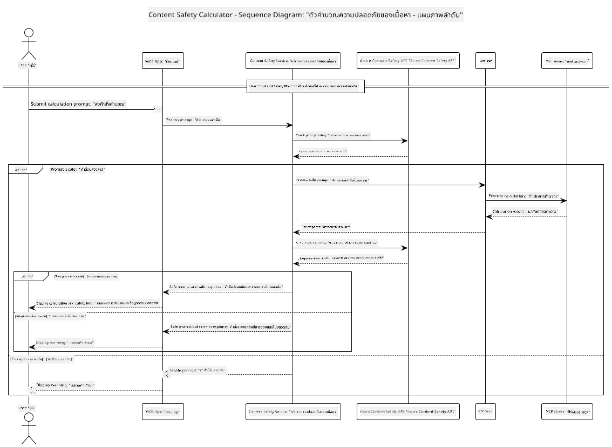

<!--
CO_OP_TRANSLATOR_METADATA:
{
  "original_hash": "e5ea5e7582f70008ea9bec3b3820f20a",
  "translation_date": "2025-07-13T23:16:41+00:00",
  "source_file": "04-PracticalImplementation/samples/java/containerapp/README.md",
  "language_code": "th"
}
-->
## สถาปัตยกรรมระบบ

โปรเจกต์นี้แสดงตัวอย่างเว็บแอปพลิเคชันที่ใช้การตรวจสอบความปลอดภัยของเนื้อหาก่อนส่งคำสั่งจากผู้ใช้ไปยังบริการเครื่องคิดเลขผ่าน Model Context Protocol (MCP)



### วิธีการทำงาน

1. **ป้อนข้อมูลโดยผู้ใช้**: ผู้ใช้กรอกคำสั่งคำนวณในอินเทอร์เฟซเว็บ
2. **การตรวจสอบความปลอดภัยของเนื้อหา (ขาเข้า)**: คำสั่งจะถูกวิเคราะห์โดย Azure Content Safety API
3. **การตัดสินใจด้านความปลอดภัย (ขาเข้า)**:
   - หากเนื้อหาปลอดภัย (ความรุนแรง < 2 ในทุกหมวดหมู่) จะดำเนินการต่อไปยังเครื่องคิดเลข
   - หากเนื้อหาถูกระบุว่าอาจเป็นอันตราย กระบวนการจะหยุดและส่งคำเตือนกลับ
4. **การเชื่อมต่อกับเครื่องคิดเลข**: เนื้อหาที่ปลอดภัยจะถูกประมวลผลโดย LangChain4j ซึ่งสื่อสารกับเซิร์ฟเวอร์เครื่องคิดเลข MCP
5. **การตรวจสอบความปลอดภัยของเนื้อหา (ขาออก)**: การตอบกลับของบอทจะถูกวิเคราะห์โดย Azure Content Safety API
6. **การตัดสินใจด้านความปลอดภัย (ขาออก)**:
   - หากการตอบกลับของบอทปลอดภัย จะแสดงผลให้ผู้ใช้เห็น
   - หากการตอบกลับของบอทถูกระบุว่าอาจเป็นอันตราย จะถูกแทนที่ด้วยคำเตือน
7. **การตอบกลับ**: ผลลัพธ์ (ถ้าปลอดภัย) จะแสดงให้ผู้ใช้พร้อมกับการวิเคราะห์ความปลอดภัยทั้งสองด้าน

## การใช้ Model Context Protocol (MCP) กับบริการเครื่องคิดเลข

โปรเจกต์นี้แสดงวิธีการใช้ Model Context Protocol (MCP) เพื่อเรียกใช้บริการเครื่องคิดเลข MCP จาก LangChain4j การใช้งานนี้ใช้เซิร์ฟเวอร์ MCP ภายในเครื่องที่รันบนพอร์ต 8080 เพื่อให้บริการการคำนวณ

### การตั้งค่า Azure Content Safety Service

ก่อนใช้งานฟีเจอร์ความปลอดภัยของเนื้อหา คุณต้องสร้างทรัพยากร Azure Content Safety ดังนี้:

1. ลงชื่อเข้าใช้ [Azure Portal](https://portal.azure.com)
2. คลิก "Create a resource" และค้นหา "Content Safety"
3. เลือก "Content Safety" แล้วคลิก "Create"
4. กรอกชื่อทรัพยากรที่ไม่ซ้ำกัน
5. เลือกการสมัครใช้งานและกลุ่มทรัพยากร (หรือสร้างใหม่)
6. เลือกภูมิภาคที่รองรับ (ตรวจสอบ [Region availability](https://azure.microsoft.com/en-us/global-infrastructure/services/?products=cognitive-services) สำหรับรายละเอียด)
7. เลือกระดับราคาที่เหมาะสม
8. คลิก "Create" เพื่อสร้างทรัพยากร
9. เมื่อติดตั้งเสร็จแล้ว คลิก "Go to resource"
10. ในแถบด้านซ้าย ภายใต้ "Resource Management" เลือก "Keys and Endpoint"
11. คัดลอกคีย์ใดคีย์หนึ่งและ URL ของ endpoint เพื่อใช้ในขั้นตอนถัดไป

### การตั้งค่าตัวแปรสภาพแวดล้อม

ตั้งค่าตัวแปรสภาพแวดล้อม `GITHUB_TOKEN` สำหรับการยืนยันตัวตนของโมเดล GitHub:
```sh
export GITHUB_TOKEN=<your_github_token>
```

สำหรับฟีเจอร์ความปลอดภัยของเนื้อหา ให้ตั้งค่า:
```sh
export CONTENT_SAFETY_ENDPOINT=<your_content_safety_endpoint>
export CONTENT_SAFETY_KEY=<your_content_safety_key>
```

ตัวแปรสภาพแวดล้อมเหล่านี้ถูกใช้โดยแอปพลิเคชันเพื่อยืนยันตัวตนกับบริการ Azure Content Safety หากไม่ได้ตั้งค่าตัวแปรเหล่านี้ แอปจะใช้ค่าตัวอย่างเพื่อสาธิต แต่ฟีเจอร์ความปลอดภัยของเนื้อหาจะไม่ทำงานอย่างถูกต้อง

### การเริ่มต้นเซิร์ฟเวอร์ Calculator MCP

ก่อนรันไคลเอนต์ คุณต้องเริ่มเซิร์ฟเวอร์ Calculator MCP ในโหมด SSE บน localhost:8080

## คำอธิบายโปรเจกต์

โปรเจกต์นี้แสดงการผสานรวม Model Context Protocol (MCP) กับ LangChain4j เพื่อเรียกใช้บริการเครื่องคิดเลข ฟีเจอร์สำคัญได้แก่:

- ใช้ MCP เชื่อมต่อกับบริการเครื่องคิดเลขสำหรับการคำนวณพื้นฐาน
- ตรวจสอบความปลอดภัยของเนื้อหาแบบสองชั้น ทั้งคำสั่งผู้ใช้และการตอบกลับของบอท
- ผสานรวมกับโมเดล gpt-4.1-nano ของ GitHub ผ่าน LangChain4j
- ใช้ Server-Sent Events (SSE) สำหรับการส่งข้อมูล MCP

## การผสานรวมความปลอดภัยของเนื้อหา

โปรเจกต์นี้มีฟีเจอร์ความปลอดภัยของเนื้อหาอย่างครบถ้วน เพื่อให้แน่ใจว่าทั้งข้อมูลที่ผู้ใช้ป้อนและการตอบกลับของระบบปลอดภัยจากเนื้อหาที่เป็นอันตราย:

1. **การตรวจสอบขาเข้า**: ทุกคำสั่งของผู้ใช้จะถูกวิเคราะห์หาหมวดหมู่เนื้อหาที่เป็นอันตราย เช่น คำพูดเกลียดชัง ความรุนแรง การทำร้ายตัวเอง และเนื้อหาทางเพศ ก่อนการประมวลผล

2. **การตรวจสอบขาออก**: แม้จะใช้โมเดลที่อาจไม่มีการเซ็นเซอร์ ระบบจะตรวจสอบการตอบกลับทั้งหมดผ่านตัวกรองความปลอดภัยเดียวกันก่อนแสดงผลให้ผู้ใช้

แนวทางสองชั้นนี้ช่วยให้ระบบปลอดภัยไม่ว่าจะใช้โมเดล AI ใด ปกป้องผู้ใช้จากทั้งข้อมูลที่เป็นอันตรายและผลลัพธ์ที่อาจก่อปัญหาจาก AI

## เว็บไคลเอนต์

แอปพลิเคชันมีอินเทอร์เฟซเว็บที่ใช้งานง่าย ช่วยให้ผู้ใช้โต้ตอบกับระบบ Content Safety Calculator ได้อย่างสะดวก:

### ฟีเจอร์ของอินเทอร์เฟซเว็บ

- ฟอร์มเรียบง่ายและใช้งานง่ายสำหรับกรอกคำสั่งคำนวณ
- การตรวจสอบความปลอดภัยของเนื้อหาแบบสองชั้น (ขาเข้าและขาออก)
- ฟีดแบ็กแบบเรียลไทม์เกี่ยวกับความปลอดภัยของคำสั่งและการตอบกลับ
- ตัวบ่งชี้ความปลอดภัยที่ใช้สีช่วยให้เข้าใจง่าย
- ดีไซน์สะอาดและตอบสนองได้ดี ใช้งานได้บนอุปกรณ์หลากหลาย
- ตัวอย่างคำสั่งที่ปลอดภัยเพื่อแนะนำผู้ใช้

### การใช้งานเว็บไคลเอนต์

1. เริ่มแอปพลิเคชัน:
   ```sh
   mvn spring-boot:run
   ```

2. เปิดเบราว์เซอร์และไปที่ `http://localhost:8087`

3. กรอกคำสั่งคำนวณในช่องข้อความที่ให้ไว้ (เช่น "Calculate the sum of 24.5 and 17.3")

4. คลิก "Submit" เพื่อส่งคำขอ

5. ดูผลลัพธ์ ซึ่งจะประกอบด้วย:
   - การวิเคราะห์ความปลอดภัยของคำสั่งของคุณ
   - ผลลัพธ์การคำนวณ (ถ้าคำสั่งปลอดภัย)
   - การวิเคราะห์ความปลอดภัยของการตอบกลับของบอท
   - คำเตือนความปลอดภัยหากคำสั่งหรือการตอบกลับถูกระบุว่าไม่ปลอดภัย

เว็บไคลเอนต์จะจัดการกระบวนการตรวจสอบความปลอดภัยทั้งสองอย่างโดยอัตโนมัติ เพื่อให้มั่นใจว่าการโต้ตอบทั้งหมดปลอดภัยและเหมาะสม ไม่ว่าจะใช้โมเดล AI ใดก็ตาม

**ข้อจำกัดความรับผิดชอบ**:  
เอกสารนี้ได้รับการแปลโดยใช้บริการแปลภาษาอัตโนมัติ [Co-op Translator](https://github.com/Azure/co-op-translator) แม้เราจะพยายามให้ความถูกต้องสูงสุด แต่โปรดทราบว่าการแปลอัตโนมัติอาจมีข้อผิดพลาดหรือความไม่ถูกต้อง เอกสารต้นฉบับในภาษาต้นทางถือเป็นแหล่งข้อมูลที่เชื่อถือได้ สำหรับข้อมูลที่สำคัญ ขอแนะนำให้ใช้บริการแปลโดยผู้เชี่ยวชาญมนุษย์ เราไม่รับผิดชอบต่อความเข้าใจผิดหรือการตีความผิดใด ๆ ที่เกิดจากการใช้การแปลนี้