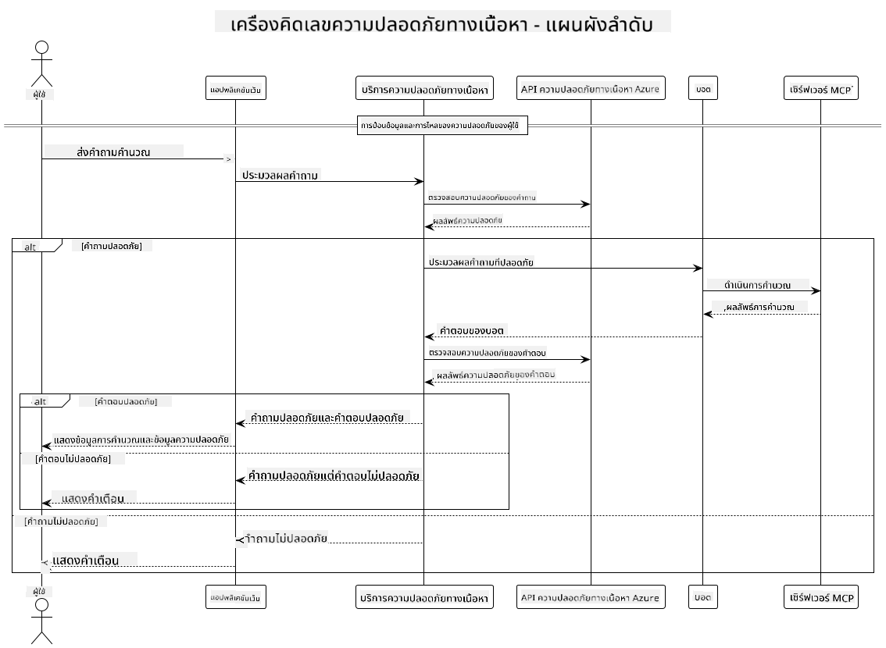

<!--
CO_OP_TRANSLATOR_METADATA:
{
  "original_hash": "e5ea5e7582f70008ea9bec3b3820f20a",
  "translation_date": "2025-05-17T14:27:05+00:00",
  "source_file": "04-PracticalImplementation/samples/java/containerapp/README.md",
  "language_code": "th"
}
-->
## สถาปัตยกรรมระบบ

โครงการนี้แสดงให้เห็นการทำงานของแอปพลิเคชันเว็บที่ใช้การตรวจสอบความปลอดภัยของเนื้อหาก่อนส่งคำขอของผู้ใช้ไปยังบริการเครื่องคิดเลขผ่าน Model Context Protocol (MCP)



### วิธีการทำงาน

1. **การป้อนข้อมูลของผู้ใช้**: ผู้ใช้ป้อนคำขอคำนวณในหน้าเว็บ
2. **การตรวจสอบความปลอดภัยของเนื้อหา (การป้อนข้อมูล)**: คำขอถูกวิเคราะห์โดย Azure Content Safety API
3. **การตัดสินใจความปลอดภัย (การป้อนข้อมูล)**:
   - ถ้าเนื้อหาปลอดภัย (ระดับความรุนแรง < 2 ในทุกหมวดหมู่) จะส่งต่อไปยังเครื่องคิดเลข
   - ถ้าเนื้อหาถูกระบุว่ามีความเสี่ยง กระบวนการจะหยุดและส่งคำเตือนกลับ
4. **การรวมเครื่องคิดเลข**: เนื้อหาที่ปลอดภัยถูกประมวลผลโดย LangChain4j ซึ่งสื่อสารกับเซิร์ฟเวอร์เครื่องคิดเลข MCP
5. **การตรวจสอบความปลอดภัยของเนื้อหา (ผลลัพธ์)**: การตอบกลับของบอทถูกวิเคราะห์โดย Azure Content Safety API
6. **การตัดสินใจความปลอดภัย (ผลลัพธ์)**:
   - ถ้าการตอบกลับของบอทปลอดภัย จะถูกแสดงให้ผู้ใช้เห็น
   - ถ้าการตอบกลับของบอทถูกระบุว่ามีความเสี่ยง จะถูกแทนที่ด้วยคำเตือน
7. **การตอบกลับ**: ผลลัพธ์ (ถ้าปลอดภัย) จะแสดงให้ผู้ใช้พร้อมกับการวิเคราะห์ความปลอดภัยทั้งสอง

## การใช้ Model Context Protocol (MCP) กับบริการเครื่องคิดเลข

โครงการนี้แสดงวิธีการใช้ Model Context Protocol (MCP) เพื่อเรียกใช้บริการเครื่องคิดเลข MCP จาก LangChain4j โดยใช้เซิร์ฟเวอร์ MCP ที่รันอยู่ในเครื่องที่พอร์ต 8080 เพื่อให้บริการการคำนวณ

### การตั้งค่าบริการความปลอดภัยเนื้อหาของ Azure

ก่อนที่จะใช้ฟีเจอร์ความปลอดภัยของเนื้อหา คุณต้องสร้างทรัพยากรบริการความปลอดภัยเนื้อหาของ Azure:

1. ลงชื่อเข้าใช้ [Azure Portal](https://portal.azure.com)
2. คลิก "Create a resource" และค้นหา "Content Safety"
3. เลือก "Content Safety" และคลิก "Create"
4. ใส่ชื่อที่ไม่ซ้ำกันสำหรับทรัพยากรของคุณ
5. เลือกการสมัครสมาชิกและกลุ่มทรัพยากรของคุณ (หรือสร้างใหม่)
6. เลือกภูมิภาคที่รองรับ (ตรวจสอบ [Region availability](https://azure.microsoft.com/en-us/global-infrastructure/services/?products=cognitive-services) สำหรับรายละเอียด)
7. เลือกระดับราคาที่เหมาะสม
8. คลิก "Create" เพื่อปรับใช้ทรัพยากร
9. เมื่อการปรับใช้เสร็จสมบูรณ์ คลิก "Go to resource"
10. ในแถบด้านซ้าย ใต้ "Resource Management" เลือก "Keys and Endpoint"
11. คัดลอกคีย์ใดๆ และ URL ของจุดสิ้นสุดเพื่อใช้ในขั้นตอนถัดไป

### การกำหนดค่าตัวแปรสภาพแวดล้อม

ตั้งค่าตัวแปรสภาพแวดล้อม `GITHUB_TOKEN` สำหรับการตรวจสอบสิทธิ์โมเดล GitHub:
```sh
export GITHUB_TOKEN=<your_github_token>
```

สำหรับฟีเจอร์ความปลอดภัยของเนื้อหา ตั้งค่า:
```sh
export CONTENT_SAFETY_ENDPOINT=<your_content_safety_endpoint>
export CONTENT_SAFETY_KEY=<your_content_safety_key>
```

ตัวแปรสภาพแวดล้อมเหล่านี้ถูกใช้โดยแอปพลิเคชันเพื่อรับรองความถูกต้องกับบริการความปลอดภัยเนื้อหาของ Azure หากตัวแปรเหล่านี้ไม่ได้ถูกตั้งค่า แอปพลิเคชันจะใช้ค่าแทนสำหรับการสาธิต แต่ฟีเจอร์ความปลอดภัยของเนื้อหาจะไม่ทำงานอย่างถูกต้อง

### การเริ่มต้นเซิร์ฟเวอร์เครื่องคิดเลข MCP

ก่อนที่จะรันลูกค้า คุณต้องเริ่มต้นเซิร์ฟเวอร์เครื่องคิดเลข MCP ในโหมด SSE ที่ localhost:8080

## คำอธิบายโครงการ

โครงการนี้แสดงการรวม Model Context Protocol (MCP) กับ LangChain4j เพื่อเรียกใช้บริการเครื่องคิดเลข ฟีเจอร์หลักรวมถึง:

- การใช้ MCP เพื่อเชื่อมต่อกับบริการเครื่องคิดเลขสำหรับการดำเนินการทางคณิตศาสตร์พื้นฐาน
- การตรวจสอบความปลอดภัยของเนื้อหาแบบสองชั้นทั้งคำขอของผู้ใช้และการตอบกลับของบอท
- การรวมกับโมเดล gpt-4.1-nano ของ GitHub ผ่าน LangChain4j
- การใช้ Server-Sent Events (SSE) สำหรับการขนส่ง MCP

## การรวมความปลอดภัยเนื้อหา

โครงการนี้รวมฟีเจอร์ความปลอดภัยเนื้อหาอย่างครบถ้วนเพื่อให้มั่นใจว่าทั้งการป้อนข้อมูลของผู้ใช้และการตอบกลับของระบบปราศจากเนื้อหาที่เป็นอันตราย:

1. **การตรวจสอบการป้อนข้อมูล**: คำขอทั้งหมดของผู้ใช้ถูกวิเคราะห์สำหรับหมวดหมู่เนื้อหาที่เป็นอันตราย เช่น การพูดเกลียดชัง ความรุนแรง การทำร้ายตัวเอง และเนื้อหาทางเพศก่อนการประมวลผล

2. **การตรวจสอบผลลัพธ์**: แม้ในกรณีที่ใช้โมเดลที่อาจไม่มีการเซ็นเซอร์ ระบบจะตรวจสอบการตอบกลับที่สร้างขึ้นทั้งหมดผ่านตัวกรองความปลอดภัยเนื้อหาเดียวกันก่อนที่จะแสดงให้ผู้ใช้

วิธีการแบบสองชั้นนี้ทำให้มั่นใจว่าระบบยังคงปลอดภัยไม่ว่าจะใช้โมเดล AI ใดอยู่ โดยปกป้องผู้ใช้จากทั้งการป้อนข้อมูลที่เป็นอันตรายและผลลัพธ์ที่อาจเป็นปัญหาที่สร้างขึ้นโดย AI

## ลูกค้าเว็บ

แอปพลิเคชันนี้รวมถึงอินเทอร์เฟซเว็บที่ใช้งานง่ายซึ่งช่วยให้ผู้ใช้สามารถโต้ตอบกับระบบเครื่องคิดเลขความปลอดภัยเนื้อหา:

### ฟีเจอร์อินเทอร์เฟซเว็บ

- แบบฟอร์มที่ง่ายและเข้าใจง่ายสำหรับการป้อนคำขอคำนวณ
- การตรวจสอบความปลอดภัยเนื้อหาแบบสองชั้น (การป้อนข้อมูลและผลลัพธ์)
- ข้อเสนอแนะแบบเรียลไทม์เกี่ยวกับความปลอดภัยของคำขอและการตอบกลับ
- ตัวบ่งชี้ความปลอดภัยที่มีการระบายสีเพื่อการตีความที่ง่าย
- การออกแบบที่สะอาดและตอบสนองซึ่งทำงานบนอุปกรณ์ต่างๆ
- ตัวอย่างคำขอที่ปลอดภัยเพื่อแนะนำผู้ใช้

### การใช้ลูกค้าเว็บ

1. เริ่มต้นแอปพลิเคชัน:
   ```sh
   mvn spring-boot:run
   ```

2. เปิดเบราว์เซอร์ของคุณและไปที่ `http://localhost:8087`

3. ป้อนคำขอคำนวณในพื้นที่ข้อความที่ให้ไว้ (เช่น "คำนวณผลรวมของ 24.5 และ 17.3")

4. คลิก "Submit" เพื่อประมวลผลคำขอของคุณ

5. ดูผลลัพธ์ ซึ่งจะรวมถึง:
   - การวิเคราะห์ความปลอดภัยเนื้อหาของคำขอของคุณ
   - ผลลัพธ์ที่คำนวณ (ถ้าคำขอปลอดภัย)
   - การวิเคราะห์ความปลอดภัยเนื้อหาของการตอบกลับของบอท
   - คำเตือนความปลอดภัยใดๆ ถ้าทั้งการป้อนข้อมูลหรือผลลัพธ์ถูกระบุ

**ข้อจำกัดความรับผิดชอบ**:  
เอกสารนี้ได้รับการแปลโดยใช้บริการแปลด้วย AI [Co-op Translator](https://github.com/Azure/co-op-translator) แม้ว่าเราจะพยายามให้เกิดความถูกต้อง แต่โปรดทราบว่าการแปลโดยอัตโนมัติอาจมีข้อผิดพลาดหรือความไม่ถูกต้อง เอกสารต้นฉบับในภาษาที่ใช้ควรถือเป็นแหล่งข้อมูลที่เชื่อถือได้ สำหรับข้อมูลสำคัญ ขอแนะนำให้ใช้บริการแปลโดยมนุษย์มืออาชีพ เราไม่รับผิดชอบต่อความเข้าใจผิดหรือการตีความผิดที่เกิดจากการใช้การแปลนี้