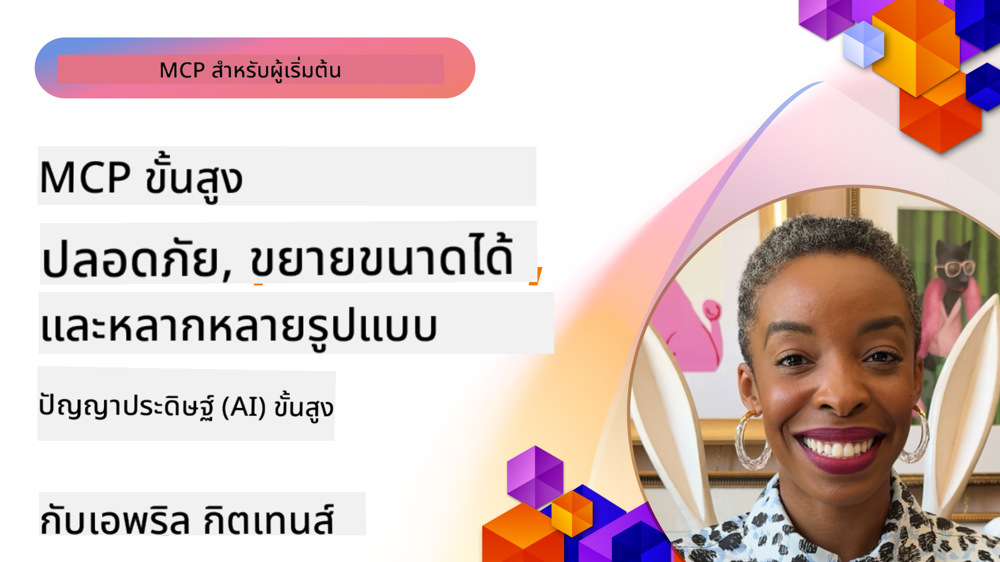

<!--
CO_OP_TRANSLATOR_METADATA:
{
  "original_hash": "d204bc94ea6027d06a703b21b711ca57",
  "translation_date": "2025-08-18T14:19:50+00:00",
  "source_file": "05-AdvancedTopics/README.md",
  "language_code": "th"
}
-->
# หัวข้อขั้นสูงใน MCP

_(คลิกที่ภาพด้านบนเพื่อดูวิดีโอของบทเรียนนี้)_

บทนี้ครอบคลุมหัวข้อขั้นสูงในเรื่องการใช้งาน Model Context Protocol (MCP) รวมถึงการผสานหลายรูปแบบ (multi-modal integration), การขยายขนาด (scalability), แนวทางปฏิบัติที่ดีที่สุดด้านความปลอดภัย, และการผสานเข้ากับระบบองค์กร หัวข้อเหล่านี้มีความสำคัญสำหรับการสร้างแอปพลิเคชัน MCP ที่แข็งแกร่งและพร้อมใช้งานในระดับการผลิต เพื่อตอบสนองความต้องการของระบบ AI สมัยใหม่

## ภาพรวม

บทเรียนนี้สำรวจแนวคิดขั้นสูงในเรื่องการใช้งาน Model Context Protocol โดยเน้นที่การผสานหลายรูปแบบ, การขยายขนาด, แนวทางปฏิบัติที่ดีที่สุดด้านความปลอดภัย, และการผสานเข้ากับระบบองค์กร หัวข้อเหล่านี้มีความสำคัญสำหรับการสร้างแอปพลิเคชัน MCP ระดับการผลิตที่สามารถจัดการกับความต้องการที่ซับซ้อนในสภาพแวดล้อมองค์กร

## วัตถุประสงค์การเรียนรู้

เมื่อจบบทเรียนนี้ คุณจะสามารถ:

- ใช้ความสามารถหลายรูปแบบในกรอบงาน MCP
- ออกแบบสถาปัตยกรรม MCP ที่ขยายขนาดได้สำหรับสถานการณ์ที่มีความต้องการสูง
- ใช้แนวทางปฏิบัติที่ดีที่สุดด้านความปลอดภัยที่สอดคล้องกับหลักการความปลอดภัยของ MCP
- ผสาน MCP เข้ากับระบบและกรอบงาน AI ขององค์กร
- ปรับปรุงประสิทธิภาพและความน่าเชื่อถือในสภาพแวดล้อมการผลิต

## บทเรียนและโครงการตัวอย่าง

| ลิงก์ | หัวข้อ | คำอธิบาย |
|-------|--------|-----------|
| [5.1 การผสานกับ Azure](./mcp-integration/README.md) | ผสานกับ Azure | เรียนรู้วิธีผสาน MCP Server ของคุณบน Azure |
| [5.2 ตัวอย่างหลายรูปแบบ](./mcp-multi-modality/README.md) | ตัวอย่าง MCP หลายรูปแบบ | ตัวอย่างสำหรับเสียง, ภาพ และการตอบสนองหลายรูปแบบ |
| [5.3 ตัวอย่าง MCP OAuth2](../../../05-AdvancedTopics/mcp-oauth2-demo) | ตัวอย่าง MCP OAuth2 | แอป Spring Boot ขั้นต่ำที่แสดง OAuth2 กับ MCP ทั้งในฐานะ Authorization และ Resource Server แสดงการออกโทเค็นที่ปลอดภัย, การป้องกัน endpoint, การปรับใช้ใน Azure Container Apps และการผสาน API Management |
| [5.4 Root Contexts](./mcp-root-contexts/README.md) | Root Contexts | เรียนรู้เพิ่มเติมเกี่ยวกับ root context และวิธีการใช้งาน |
| [5.5 การกำหนดเส้นทาง](./mcp-routing/README.md) | การกำหนดเส้นทาง | เรียนรู้ประเภทต่าง ๆ ของการกำหนดเส้นทาง |
| [5.6 การสุ่มตัวอย่าง](./mcp-sampling/README.md) | การสุ่มตัวอย่าง | เรียนรู้วิธีการทำงานกับการสุ่มตัวอย่าง |
| [5.7 การขยายขนาด](./mcp-scaling/README.md) | การขยายขนาด | เรียนรู้เกี่ยวกับการขยายขนาด |
| [5.8 ความปลอดภัย](./mcp-security/README.md) | ความปลอดภัย | ปกป้อง MCP Server ของคุณ |
| [5.9 ตัวอย่างการค้นหาเว็บ](./web-search-mcp/README.md) | การค้นหาเว็บ MCP | MCP server และ client ใน Python ที่ผสานกับ SerpAPI สำหรับการค้นหาเว็บ, ข่าว, ผลิตภัณฑ์แบบเรียลไทม์ และ Q&A แสดงการจัดการเครื่องมือหลายตัว, การผสาน API ภายนอก และการจัดการข้อผิดพลาดที่แข็งแกร่ง |
| [5.10 การสตรีมแบบเรียลไทม์](./mcp-realtimestreaming/README.md) | การสตรีม | การสตรีมข้อมูลแบบเรียลไทม์มีความสำคัญในโลกที่ขับเคลื่อนด้วยข้อมูลในปัจจุบัน ซึ่งธุรกิจและแอปพลิเคชันต้องการข้อมูลทันทีเพื่อการตัดสินใจที่ทันท่วงที |
| [5.11 การค้นหาเว็บแบบเรียลไทม์](./mcp-realtimesearch/README.md) | การค้นหาเว็บ | การค้นหาเว็บแบบเรียลไทม์ที่ MCP เปลี่ยนแปลงการค้นหาเว็บแบบเรียลไทม์โดยการจัดการบริบทที่เป็นมาตรฐานระหว่างโมเดล AI, เครื่องมือค้นหา และแอปพลิเคชัน |
| [5.12 การยืนยันตัวตน Entra ID สำหรับ MCP Servers](./mcp-security-entra/README.md) | การยืนยันตัวตน Entra ID | Microsoft Entra ID มอบโซลูชันการจัดการตัวตนและการเข้าถึงบนคลาวด์ที่แข็งแกร่ง ช่วยให้มั่นใจได้ว่าเฉพาะผู้ใช้และแอปพลิเคชันที่ได้รับอนุญาตเท่านั้นที่สามารถโต้ตอบกับ MCP Server ของคุณได้ |
| [5.13 การผสานตัวแทน Azure AI Foundry](./mcp-foundry-agent-integration/README.md) | การผสาน Azure AI Foundry | เรียนรู้วิธีผสาน MCP Server กับตัวแทน Azure AI Foundry เพื่อเปิดใช้งานการจัดการเครื่องมือที่ทรงพลังและความสามารถ AI ขององค์กรด้วยการเชื่อมต่อแหล่งข้อมูลภายนอกที่เป็นมาตรฐาน |
| [5.14 วิศวกรรมบริบท](./mcp-contextengineering/README.md) | วิศวกรรมบริบท | โอกาสในอนาคตของเทคนิควิศวกรรมบริบทสำหรับ MCP Server รวมถึงการปรับบริบทให้เหมาะสม, การจัดการบริบทแบบไดนามิก และกลยุทธ์สำหรับการออกแบบ prompt ที่มีประสิทธิภาพในกรอบงาน MCP |

## แหล่งข้อมูลเพิ่มเติม

สำหรับข้อมูลล่าสุดเกี่ยวกับหัวข้อ MCP ขั้นสูง โปรดดูที่:
- [เอกสาร MCP](https://modelcontextprotocol.io/)
- [ข้อกำหนด MCP](https://spec.modelcontextprotocol.io/)
- [GitHub Repository](https://github.com/modelcontextprotocol)

## ประเด็นสำคัญ

- การใช้งาน MCP หลายรูปแบบช่วยขยายความสามารถของ AI ให้เกินกว่าการประมวลผลข้อความ
- การขยายขนาดเป็นสิ่งสำคัญสำหรับการใช้งานในองค์กร และสามารถจัดการได้ผ่านการขยายขนาดแนวนอนและแนวตั้ง
- มาตรการความปลอดภัยที่ครอบคลุมช่วยปกป้องข้อมูลและควบคุมการเข้าถึงอย่างเหมาะสม
- การผสานเข้ากับแพลตฟอร์มองค์กร เช่น Azure OpenAI และ Microsoft AI Foundry ช่วยเพิ่มความสามารถของ MCP
- การใช้งาน MCP ขั้นสูงได้รับประโยชน์จากสถาปัตยกรรมที่ปรับให้เหมาะสมและการจัดการทรัพยากรอย่างรอบคอบ

## แบบฝึกหัด

ออกแบบการใช้งาน MCP ระดับองค์กรสำหรับกรณีการใช้งานเฉพาะ:

1. ระบุความต้องการหลายรูปแบบสำหรับกรณีการใช้งานของคุณ
2. สรุปการควบคุมความปลอดภัยที่จำเป็นเพื่อปกป้องข้อมูลที่ละเอียดอ่อน
3. ออกแบบสถาปัตยกรรมที่ขยายขนาดได้ซึ่งสามารถจัดการกับโหลดที่หลากหลาย
4. วางแผนจุดผสานกับระบบ AI ขององค์กร
5. จัดทำเอกสารคอขวดด้านประสิทธิภาพที่อาจเกิดขึ้นและกลยุทธ์การบรรเทาปัญหา

## แหล่งข้อมูลเพิ่มเติม

- [เอกสาร Azure OpenAI](https://learn.microsoft.com/en-us/azure/ai-services/openai/)
- [เอกสาร Microsoft AI Foundry](https://learn.microsoft.com/en-us/ai-services/)

---

## สิ่งที่จะเรียนรู้ต่อไป

- [5.1 การผสาน MCP](./mcp-integration/README.md)

**ข้อจำกัดความรับผิดชอบ**:  
เอกสารนี้ได้รับการแปลโดยใช้บริการแปลภาษา AI [Co-op Translator](https://github.com/Azure/co-op-translator) แม้ว่าเราจะพยายามให้การแปลมีความถูกต้อง แต่โปรดทราบว่าการแปลอัตโนมัติอาจมีข้อผิดพลาดหรือความไม่แม่นยำ เอกสารต้นฉบับในภาษาต้นทางควรถือเป็นแหล่งข้อมูลที่เชื่อถือได้ สำหรับข้อมูลที่สำคัญ แนะนำให้ใช้บริการแปลภาษาจากผู้เชี่ยวชาญ เราไม่รับผิดชอบต่อความเข้าใจผิดหรือการตีความที่คลาดเคลื่อนซึ่งเกิดจากการใช้การแปลนี้