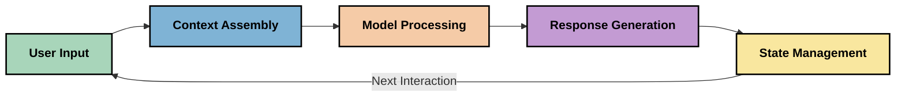
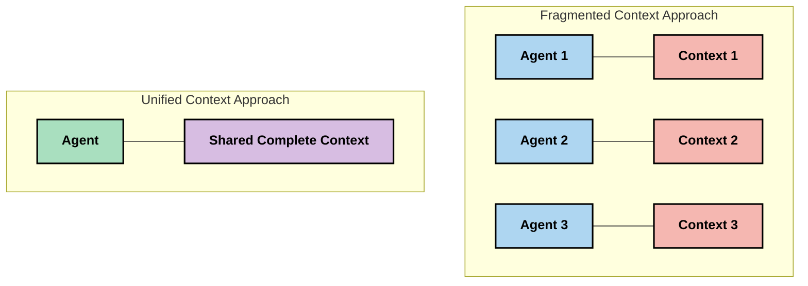

<!--
CO_OP_TRANSLATOR_METADATA:
{
  "original_hash": "fd169ca3071b81b5ee282e194bc823df",
  "translation_date": "2025-09-15T20:31:18+00:00",
  "source_file": "05-AdvancedTopics/mcp-contextengineering/README.md",
  "language_code": "th"
}
-->
# วิศวกรรมบริบท: แนวคิดใหม่ในระบบนิเวศ MCP

## ภาพรวม

วิศวกรรมบริบทเป็นแนวคิดใหม่ในวงการ AI ที่มุ่งเน้นการสำรวจวิธีการจัดโครงสร้าง ส่งมอบ และรักษาข้อมูลในระหว่างการโต้ตอบระหว่างลูกค้าและบริการ AI เมื่อระบบนิเวศ Model Context Protocol (MCP) มีการพัฒนา การเข้าใจวิธีการจัดการบริบทอย่างมีประสิทธิภาพจึงมีความสำคัญมากขึ้น โมดูลนี้จะแนะนำแนวคิดของวิศวกรรมบริบทและสำรวจการประยุกต์ใช้ในระบบ MCP

## วัตถุประสงค์การเรียนรู้

เมื่อจบโมดูลนี้ คุณจะสามารถ:

- เข้าใจแนวคิดใหม่ของวิศวกรรมบริบทและบทบาทที่อาจเกิดขึ้นในแอปพลิเคชัน MCP
- ระบุความท้าทายสำคัญในด้านการจัดการบริบทที่การออกแบบโปรโตคอล MCP มุ่งแก้ไข
- สำรวจเทคนิคในการปรับปรุงประสิทธิภาพของโมเดลผ่านการจัดการบริบทที่ดีขึ้น
- พิจารณาแนวทางในการวัดและประเมินประสิทธิภาพของบริบท
- นำแนวคิดใหม่เหล่านี้ไปใช้เพื่อปรับปรุงประสบการณ์ AI ผ่านกรอบ MCP

## บทนำสู่วิศวกรรมบริบท

วิศวกรรมบริบทเป็นแนวคิดใหม่ที่มุ่งเน้นการออกแบบและจัดการการไหลของข้อมูลระหว่างผู้ใช้ แอปพลิเคชัน และโมเดล AI อย่างตั้งใจ แตกต่างจากสาขาที่มีอยู่ เช่น การออกแบบคำสั่ง (prompt engineering) วิศวกรรมบริบทยังอยู่ในขั้นตอนการกำหนดโดยผู้ปฏิบัติงานที่ทำงานเพื่อแก้ไขความท้าทายเฉพาะในการให้ข้อมูลที่เหมาะสมแก่โมเดล AI ในเวลาที่เหมาะสม

เมื่อโมเดลภาษาขนาดใหญ่ (LLMs) มีการพัฒนา ความสำคัญของบริบทก็ชัดเจนมากขึ้น คุณภาพ ความเกี่ยวข้อง และโครงสร้างของบริบทที่เรามอบให้ส่งผลโดยตรงต่อผลลัพธ์ของโมเดล วิศวกรรมบริบทสำรวจความสัมพันธ์นี้และมุ่งพัฒนาหลักการสำหรับการจัดการบริบทอย่างมีประสิทธิภาพ

> "ในปี 2025 โมเดลที่มีอยู่จะฉลาดมาก แต่แม้แต่คนที่ฉลาดที่สุดก็ไม่สามารถทำงานได้อย่างมีประสิทธิภาพหากไม่มีบริบทของสิ่งที่พวกเขาถูกขอให้ทำ... 'วิศวกรรมบริบท' เป็นระดับถัดไปของการออกแบบคำสั่ง มันเกี่ยวกับการทำสิ่งนี้โดยอัตโนมัติในระบบที่มีการเปลี่ยนแปลง" — Walden Yan, Cognition AI

วิศวกรรมบริบทอาจครอบคลุม:

1. **การเลือกบริบท**: การกำหนดว่าข้อมูลใดมีความเกี่ยวข้องกับงานที่กำหนด
2. **การจัดโครงสร้างบริบท**: การจัดระเบียบข้อมูลเพื่อเพิ่มความเข้าใจของโมเดล
3. **การส่งมอบบริบท**: การปรับปรุงวิธีและเวลาที่ข้อมูลถูกส่งไปยังโมเดล
4. **การรักษาบริบท**: การจัดการสถานะและวิวัฒนาการของบริบทเมื่อเวลาผ่านไป
5. **การประเมินบริบท**: การวัดและปรับปรุงประสิทธิภาพของบริบท

จุดเน้นเหล่านี้มีความเกี่ยวข้องโดยเฉพาะกับระบบนิเวศ MCP ซึ่งให้วิธีการมาตรฐานสำหรับแอปพลิเคชันในการให้บริบทแก่ LLMs

## มุมมองการเดินทางของบริบท

วิธีหนึ่งในการมองเห็นวิศวกรรมบริบทคือการติดตามเส้นทางที่ข้อมูลเดินทางผ่านระบบ MCP:

### ขั้นตอนสำคัญในเส้นทางบริบท:

1. **ข้อมูลจากผู้ใช้**: ข้อมูลดิบจากผู้ใช้ (ข้อความ รูปภาพ เอกสาร)
2. **การประกอบบริบท**: การรวมข้อมูลจากผู้ใช้กับบริบทของระบบ ประวัติการสนทนา และข้อมูลที่ดึงมาอื่น ๆ
3. **การประมวลผลโดยโมเดล**: โมเดล AI ประมวลผลบริบทที่ประกอบขึ้น
4. **การสร้างคำตอบ**: โมเดลสร้างผลลัพธ์ตามบริบทที่ให้มา
5. **การจัดการสถานะ**: ระบบอัปเดตสถานะภายในตามการโต้ตอบ

มุมมองนี้เน้นลักษณะการเปลี่ยนแปลงของบริบทในระบบ AI และตั้งคำถามสำคัญเกี่ยวกับวิธีการจัดการข้อมูลให้ดีที่สุดในแต่ละขั้นตอน

## หลักการใหม่ในวิศวกรรมบริบท

เมื่อสาขาวิศวกรรมบริบทเริ่มเป็นรูปเป็นร่าง หลักการบางประการเริ่มปรากฏขึ้นจากผู้ปฏิบัติงาน หลักการเหล่านี้อาจช่วยแจ้งทางเลือกในการใช้งาน MCP:

### หลักการที่ 1: แบ่งปันบริบทอย่างสมบูรณ์

บริบทควรถูกแบ่งปันอย่างสมบูรณ์ระหว่างทุกองค์ประกอบของระบบแทนที่จะกระจายไปยังตัวแทนหรือกระบวนการหลายตัว เมื่อบริบทถูกกระจาย การตัดสินใจที่ทำในส่วนหนึ่งของระบบอาจขัดแย้งกับการตัดสินใจที่ทำในส่วนอื่น

ในแอปพลิเคชัน MCP สิ่งนี้แนะนำให้ออกแบบระบบที่บริบทไหลผ่านไปยังทุกส่วนของกระบวนการอย่างไร้รอยต่อแทนที่จะถูกแบ่งแยก

### หลักการที่ 2: ตระหนักว่าการกระทำมีการตัดสินใจโดยนัย

การกระทำแต่ละอย่างที่โมเดลทำมีการตัดสินใจโดยนัยเกี่ยวกับวิธีการตีความบริบท เมื่อองค์ประกอบหลายตัวทำงานบนบริบทที่แตกต่างกัน การตัดสินใจโดยนัยเหล่านี้อาจขัดแย้งกัน ส่งผลให้เกิดผลลัพธ์ที่ไม่สอดคล้องกัน

หลักการนี้มีผลกระทบสำคัญต่อแอปพลิเคชัน MCP:
- เลือกการประมวลผลเชิงเส้นสำหรับงานที่ซับซ้อนแทนการดำเนินการแบบขนานที่มีบริบทกระจัดกระจาย
- ตรวจสอบให้แน่ใจว่าจุดตัดสินใจทั้งหมดสามารถเข้าถึงข้อมูลบริบทเดียวกัน
- ออกแบบระบบที่ขั้นตอนต่อมาสามารถเห็นบริบททั้งหมดของการตัดสินใจในขั้นตอนก่อนหน้า

### หลักการที่ 3: สมดุลความลึกของบริบทกับข้อจำกัดของหน้าต่าง

เมื่อการสนทนาและกระบวนการยาวขึ้น หน้าต่างบริบทจะล้นในที่สุด วิศวกรรมบริบทที่มีประสิทธิภาพสำรวจแนวทางในการจัดการความตึงเครียดระหว่างบริบทที่ครอบคลุมและข้อจำกัดทางเทคนิค

แนวทางที่อาจถูกสำรวจ ได้แก่:
- การบีบอัดบริบทที่รักษาข้อมูลสำคัญในขณะที่ลดการใช้โทเค็น
- การโหลดบริบทแบบก้าวหน้าตามความเกี่ยวข้องกับความต้องการปัจจุบัน
- การสรุปปฏิสัมพันธ์ก่อนหน้าในขณะที่รักษาการตัดสินใจและข้อเท็จจริงสำคัญ

## ความท้าทายด้านบริบทและการออกแบบโปรโตคอล MCP

Model Context Protocol (MCP) ถูกออกแบบโดยคำนึงถึงความท้าทายเฉพาะของการจัดการบริบท การเข้าใจความท้าทายเหล่านี้ช่วยอธิบายแง่มุมสำคัญของการออกแบบโปรโตคอล MCP:

### ความท้าทายที่ 1: ข้อจำกัดของหน้าต่างบริบท
โมเดล AI ส่วนใหญ่มีขนาดหน้าต่างบริบทคงที่ จำกัดจำนวนข้อมูลที่สามารถประมวลผลได้ในครั้งเดียว

**การตอบสนองการออกแบบ MCP:** 
- โปรโตคอลรองรับบริบทที่มีโครงสร้างและอ้างอิงทรัพยากรได้อย่างมีประสิทธิภาพ
- ทรัพยากรสามารถแบ่งหน้าและโหลดแบบก้าวหน้า

### ความท้าทายที่ 2: การกำหนดความเกี่ยวข้อง
การกำหนดว่าข้อมูลใดมีความเกี่ยวข้องที่สุดที่จะรวมในบริบทเป็นเรื่องยาก

**การตอบสนองการออกแบบ MCP:**
- เครื่องมือที่ยืดหยุ่นช่วยให้สามารถดึงข้อมูลแบบไดนามิกตามความต้องการ
- คำสั่งที่มีโครงสร้างช่วยให้การจัดระเบียบบริบทมีความสม่ำเสมอ

### ความท้าทายที่ 3: ความคงอยู่ของบริบท
การจัดการสถานะข้ามการโต้ตอบต้องการการติดตามบริบทอย่างรอบคอบ

**การตอบสนองการออกแบบ MCP:**
- การจัดการเซสชันที่ได้มาตรฐาน
- รูปแบบการโต้ตอบที่กำหนดไว้อย่างชัดเจนสำหรับวิวัฒนาการของบริcontext
- [Model Context Protocol Website](https://modelcontextprotocol.io/)
- [Model Context Protocol Specification](https://github.com/modelcontextprotocol/modelcontextprotocol)
- [MCP Documentation](https://modelcontextprotocol.io/docs)
- [MCP C# SDK](https://github.com/modelcontextprotocol/csharp-sdk)
- [MCP Python SDK](https://github.com/modelcontextprotocol/python-sdk)
- [MCP TypeScript SDK](https://github.com/modelcontextprotocol/typescript-sdk)
- [MCP Inspector](https://github.com/modelcontextprotocol/inspector) - เครื่องมือทดสอบแบบภาพสำหรับเซิร์ฟเวอร์ MCP

### บทความเกี่ยวกับวิศวกรรมบริบท
- [อย่าสร้าง Multi-Agents: หลักการของวิศวกรรมบริบท](https://cognition.ai/blog/dont-build-multi-agents) - มุมมองของ Walden Yan เกี่ยวกับหลักการวิศวกรรมบริบท
- [คู่มือปฏิบัติในการสร้าง Agents](https://cdn.openai.com/business-guides-and-resources/a-practical-guide-to-building-agents.pdf) - คู่มือของ OpenAI เกี่ยวกับการออกแบบ Agents อย่างมีประสิทธิภาพ
- [การสร้าง Agents ที่มีประสิทธิภาพ](https://www.anthropic.com/engineering/building-effective-agents) - วิธีการของ Anthropic ในการพัฒนา Agents

### งานวิจัยที่เกี่ยวข้อง
- [Dynamic Retrieval Augmentation for Large Language Models](https://arxiv.org/abs/2310.01487) - งานวิจัยเกี่ยวกับวิธีการดึงข้อมูลแบบไดนามิก
- [Lost in the Middle: How Language Models Use Long Contexts](https://arxiv.org/abs/2307.03172) - งานวิจัยสำคัญเกี่ยวกับรูปแบบการประมวลผลบริบท
- [Hierarchical Text-Conditioned Image Generation with CLIP Latents](https://arxiv.org/abs/2204.06125) - เอกสาร DALL-E 2 ที่มีข้อมูลเชิงลึกเกี่ยวกับการจัดโครงสร้างบริบท
- [Exploring the Role of Context in Large Language Model Architectures](https://aclanthology.org/2023.findings-emnlp.124/) - งานวิจัยล่าสุดเกี่ยวกับการจัดการบริบท
- [Multi-Agent Collaboration: A Survey](https://arxiv.org/abs/2304.03442) - งานวิจัยเกี่ยวกับระบบ Multi-Agent และความท้าทายที่เกี่ยวข้อง

### แหล่งข้อมูลเพิ่มเติม
- [เทคนิคการปรับแต่ง Context Window](https://learn.microsoft.com/en-us/azure/ai-services/openai/concepts/context-window)
- [เทคนิค RAG ขั้นสูง](https://www.microsoft.com/en-us/research/blog/retrieval-augmented-generation-rag-and-frontier-models/)
- [เอกสาร Semantic Kernel](https://github.com/microsoft/semantic-kernel)
- [AI Toolkit สำหรับการจัดการบริบท](https://github.com/microsoft/aitoolkit)

## สิ่งที่จะเกิดขึ้นต่อไป

- [5.15 MCP Custom Transport](../mcp-transport/README.md)

---

**ข้อจำกัดความรับผิดชอบ**:  
เอกสารนี้ได้รับการแปลโดยใช้บริการแปลภาษา AI [Co-op Translator](https://github.com/Azure/co-op-translator) แม้ว่าเราจะพยายามให้การแปลมีความถูกต้องมากที่สุด แต่โปรดทราบว่าการแปลโดยอัตโนมัติอาจมีข้อผิดพลาดหรือความไม่ถูกต้อง เอกสารต้นฉบับในภาษาดั้งเดิมควรถือเป็นแหล่งข้อมูลที่เชื่อถือได้ สำหรับข้อมูลที่สำคัญ ขอแนะนำให้ใช้บริการแปลภาษามืออาชีพ เราไม่รับผิดชอบต่อความเข้าใจผิดหรือการตีความผิดที่เกิดจากการใช้การแปลนี้