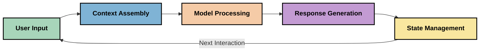
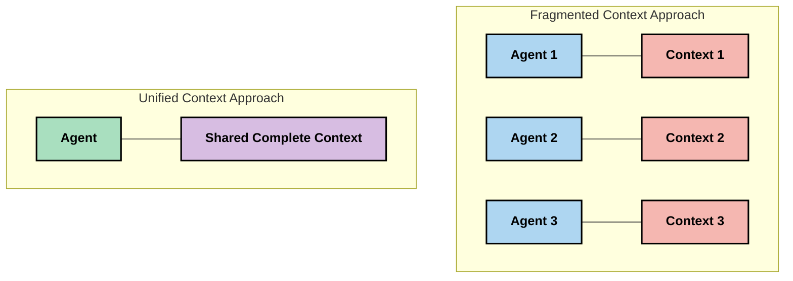
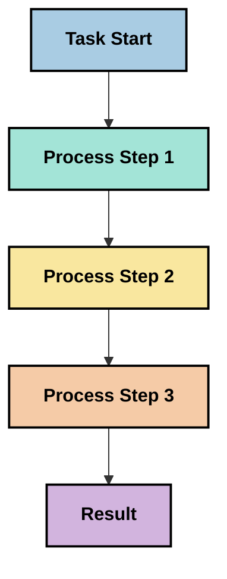
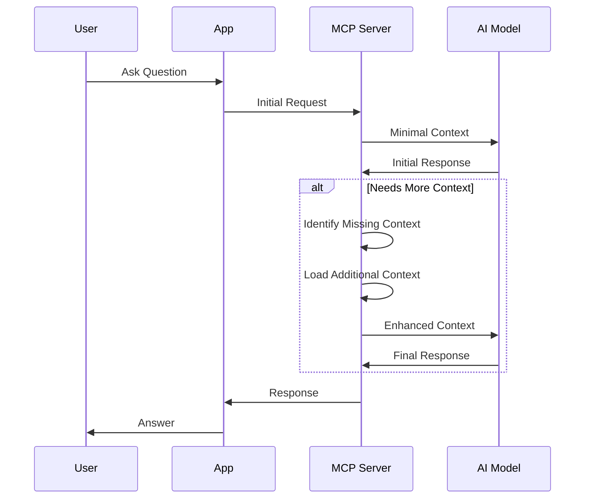
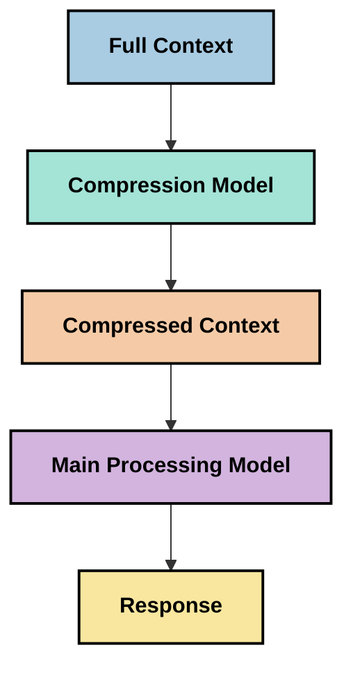

<!--
CO_OP_TRANSLATOR_METADATA:
{
  "original_hash": "5762e8e74dd99d8b7dbb31e69a82561e",
  "translation_date": "2025-07-17T08:31:51+00:00",
  "source_file": "05-AdvancedTopics/mcp-contextengineering/README.md",
  "language_code": "th"
}
-->
# Context Engineering: แนวคิดใหม่ในระบบนิเวศ MCP

## ภาพรวม

Context engineering เป็นแนวคิดใหม่ในวงการ AI ที่ศึกษาวิธีการจัดโครงสร้าง ส่งมอบ และดูแลข้อมูลตลอดการโต้ตอบระหว่างลูกค้าและบริการ AI ขณะที่ระบบนิเวศ Model Context Protocol (MCP) กำลังพัฒนา ความเข้าใจในการจัดการ context อย่างมีประสิทธิภาพจึงมีความสำคัญมากขึ้น โมดูลนี้จะแนะนำแนวคิด context engineering และสำรวจการประยุกต์ใช้งานในระบบ MCP

## วัตถุประสงค์การเรียนรู้

เมื่อจบโมดูลนี้ คุณจะสามารถ:

- เข้าใจแนวคิด context engineering ที่กำลังเกิดขึ้นและบทบาทที่อาจมีในแอปพลิเคชัน MCP
- ระบุความท้าทายหลักในการจัดการ context ที่การออกแบบโปรโตคอล MCP พยายามแก้ไข
- สำรวจเทคนิคในการปรับปรุงประสิทธิภาพโมเดลผ่านการจัดการ context ที่ดีขึ้น
- พิจารณาวิธีการวัดและประเมินประสิทธิผลของ context
- นำแนวคิดเหล่านี้ไปใช้เพื่อพัฒนาประสบการณ์ AI ผ่านกรอบงาน MCP

## บทนำสู่ Context Engineering

Context engineering เป็นแนวคิดใหม่ที่เน้นการออกแบบและจัดการการไหลของข้อมูลระหว่างผู้ใช้ แอปพลิเคชัน และโมเดล AI อย่างมีจุดมุ่งหมาย แตกต่างจากสาขาที่มีอยู่แล้วเช่น prompt engineering ซึ่ง context engineering ยังอยู่ในระหว่างการกำหนดโดยผู้ปฏิบัติงานที่พยายามแก้ไขความท้าทายเฉพาะในการให้ข้อมูลที่เหมาะสมกับโมเดล AI ในเวลาที่เหมาะสม

เมื่อโมเดลภาษาขนาดใหญ่ (LLMs) พัฒนา ความสำคัญของ context ก็ยิ่งชัดเจนมากขึ้น คุณภาพ ความเกี่ยวข้อง และโครงสร้างของ context ที่เราจัดเตรียมส่งผลโดยตรงต่อผลลัพธ์ของโมเดล Context engineering จึงศึกษาความสัมพันธ์นี้และพยายามพัฒนาหลักการสำหรับการจัดการ context อย่างมีประสิทธิภาพ

> "ในปี 2025 โมเดลต่างๆ ฉลาดมาก แต่แม้แต่คนที่ฉลาดที่สุดก็ไม่สามารถทำงานได้อย่างมีประสิทธิภาพหากไม่มีบริบทของสิ่งที่ถูกถาม... 'Context engineering' คือขั้นต่อไปของ prompt engineering คือการทำสิ่งนี้โดยอัตโนมัติในระบบที่มีการเปลี่ยนแปลงอย่างไดนามิก" — Walden Yan, Cognition AI

Context engineering อาจครอบคลุม:

1. **การเลือก context**: กำหนดข้อมูลที่เกี่ยวข้องกับงานนั้นๆ
2. **การจัดโครงสร้าง context**: จัดระเบียบข้อมูลเพื่อเพิ่มความเข้าใจของโมเดล
3. **การส่งมอบ context**: ปรับปรุงวิธีและเวลาที่ส่งข้อมูลไปยังโมเดล
4. **การดูแล context**: จัดการสถานะและการเปลี่ยนแปลงของ context ตามเวลา
5. **การประเมิน context**: วัดและปรับปรุงประสิทธิผลของ context

พื้นที่เหล่านี้มีความสำคัญอย่างยิ่งต่อระบบนิเวศ MCP ซึ่งให้วิธีมาตรฐานสำหรับแอปพลิเคชันในการส่ง context ไปยัง LLMs

## มุมมองการเดินทางของ Context

วิธีหนึ่งในการมองเห็น context engineering คือการติดตามเส้นทางของข้อมูลผ่านระบบ MCP:



### ขั้นตอนสำคัญในการเดินทางของ Context:

1. **ข้อมูลจากผู้ใช้**: ข้อมูลดิบจากผู้ใช้ (ข้อความ รูปภาพ เอกสาร)
2. **การประกอบ context**: รวมข้อมูลจากผู้ใช้กับ context ของระบบ ประวัติการสนทนา และข้อมูลอื่นๆ ที่ดึงมา
3. **การประมวลผลของโมเดล**: โมเดล AI ประมวลผล context ที่ประกอบแล้ว
4. **การสร้างคำตอบ**: โมเดลสร้างผลลัพธ์ตาม context ที่ได้รับ
5. **การจัดการสถานะ**: ระบบอัปเดตสถานะภายในตามการโต้ตอบ

มุมมองนี้เน้นความไดนามิกของ context ในระบบ AI และตั้งคำถามสำคัญเกี่ยวกับวิธีจัดการข้อมูลในแต่ละขั้นตอนอย่างเหมาะสม

## หลักการที่เกิดขึ้นใน Context Engineering

เมื่อสาขา context engineering เริ่มเป็นรูปเป็นร่าง หลักการเบื้องต้นบางอย่างเริ่มปรากฏจากผู้ปฏิบัติงาน หลักการเหล่านี้อาจช่วยชี้แนะแนวทางการใช้งาน MCP:

### หลักการที่ 1: แชร์ Context อย่างครบถ้วน

Context ควรถูกแชร์อย่างครบถ้วนระหว่างส่วนประกอบทั้งหมดของระบบ แทนที่จะกระจายไปยังตัวแทนหรือกระบวนการหลายส่วน เมื่อ context ถูกแจกจ่าย การตัดสินใจในส่วนหนึ่งของระบบอาจขัดแย้งกับส่วนอื่นได้



ในแอปพลิเคชัน MCP นี่หมายถึงการออกแบบระบบที่ context ไหลอย่างราบรื่นตลอดทั้งกระบวนการ แทนที่จะถูกแยกเป็นส่วนๆ

### หลักการที่ 2: ตระหนักว่าการกระทำมีการตัดสินใจแฝงอยู่

แต่ละการกระทำของโมเดลมีการตัดสินใจแฝงเกี่ยวกับวิธีตีความ context เมื่อหลายส่วนทำงานบน context ที่ต่างกัน การตัดสินใจแฝงเหล่านี้อาจขัดแย้งกัน ทำให้ผลลัพธ์ไม่สอดคล้องกัน

หลักการนี้มีผลสำคัญต่อแอปพลิเคชัน MCP:
- ควรประมวลผลงานที่ซับซ้อนแบบลำดับขั้นมากกว่าการทำงานพร้อมกันที่มี context แตกกระจาย
- ให้แน่ใจว่าจุดตัดสินใจทั้งหมดเข้าถึงข้อมูล context เดียวกัน
- ออกแบบระบบที่ขั้นตอนถัดไปสามารถเห็น context ทั้งหมดของการตัดสินใจก่อนหน้า

### หลักการที่ 3: สมดุลความลึกของ Context กับข้อจำกัดของหน้าต่าง

เมื่อการสนทนาและกระบวนการยาวขึ้น หน้าต่าง context จะเต็มอย่างหลีกเลี่ยงไม่ได้ Context engineering ที่มีประสิทธิภาพจึงต้องหาวิธีจัดการความตึงเครียดระหว่าง context ที่ครอบคลุมกับข้อจำกัดทางเทคนิค

แนวทางที่กำลังถูกสำรวจได้แก่:
- การบีบอัด context ที่รักษาข้อมูลสำคัญแต่ลดการใช้ token
- การโหลด context แบบก้าวหน้าโดยพิจารณาความเกี่ยวข้องกับความต้องการปัจจุบัน
- การสรุปการโต้ตอบก่อนหน้าโดยยังคงรักษาการตัดสินใจและข้อเท็จจริงสำคัญ

## ความท้าทายของ Context และการออกแบบโปรโตคอล MCP

Model Context Protocol (MCP) ถูกออกแบบโดยคำนึงถึงความท้าทายเฉพาะของการจัดการ context การเข้าใจความท้าทายเหล่านี้ช่วยอธิบายแง่มุมสำคัญของการออกแบบโปรโตคอล MCP:

### ความท้าทายที่ 1: ข้อจำกัดของหน้าต่าง Context

โมเดล AI ส่วนใหญ่มีขนาดหน้าต่าง context ที่จำกัด จำกัดปริมาณข้อมูลที่สามารถประมวลผลได้ในครั้งเดียว

**การตอบสนองของการออกแบบ MCP:**  
- โปรโตคอลรองรับ context ที่มีโครงสร้างและอ้างอิงทรัพยากรได้อย่างมีประสิทธิภาพ  
- ทรัพยากรสามารถแบ่งหน้าและโหลดแบบก้าวหน้าได้

### ความท้าทายที่ 2: การกำหนดความเกี่ยวข้อง

การตัดสินใจว่าอะไรคือข้อมูลที่เกี่ยวข้องที่สุดสำหรับ context เป็นเรื่องยาก

**การตอบสนองของการออกแบบ MCP:**  
- เครื่องมือที่ยืดหยุ่นช่วยดึงข้อมูลแบบไดนามิกตามความต้องการ  
- prompt ที่มีโครงสร้างช่วยจัดระเบียบ context อย่างสม่ำเสมอ

### ความท้าทายที่ 3: การคงอยู่ของ Context

การจัดการสถานะระหว่างการโต้ตอบต้องติดตาม context อย่างรอบคอบ

**การตอบสนองของการออกแบบ MCP:**  
- การจัดการ session ที่เป็นมาตรฐาน  
- รูปแบบการโต้ตอบที่ชัดเจนสำหรับการพัฒนา context

### ความท้าทายที่ 4: Context แบบมัลติ-โหมด

ข้อมูลประเภทต่างๆ (ข้อความ รูปภาพ ข้อมูลโครงสร้าง) ต้องการการจัดการที่แตกต่างกัน

**การตอบสนองของการออกแบบ MCP:**  
- การออกแบบโปรโตคอลรองรับเนื้อหาหลากหลายประเภท  
- การแทนข้อมูลมัลติ-โหมดที่เป็นมาตรฐาน

### ความท้าทายที่ 5: ความปลอดภัยและความเป็นส่วนตัว

Context มักมีข้อมูลที่ละเอียดอ่อนซึ่งต้องได้รับการปกป้อง

**การตอบสนองของการออกแบบ MCP:**  
- กำหนดขอบเขตความรับผิดชอบระหว่างลูกค้าและเซิร์ฟเวอร์อย่างชัดเจน  
- ตัวเลือกการประมวลผลภายในเครื่องเพื่อลดการเปิดเผยข้อมูล

ความเข้าใจความท้าทายเหล่านี้และวิธีที่ MCP แก้ไขช่วยวางรากฐานสำหรับการสำรวจเทคนิค context engineering ที่ก้าวหน้าขึ้น

## แนวทาง Context Engineering ที่กำลังเกิดขึ้น

เมื่อสาขา context engineering กำลังพัฒนา มีแนวทางที่น่าสนใจหลายอย่างเกิดขึ้น ซึ่งเป็นความคิดในปัจจุบันมากกว่าการปฏิบัติที่ยืนยันแล้ว และน่าจะพัฒนาไปตามประสบการณ์กับการใช้งาน MCP

### 1. การประมวลผลแบบเส้นเดียว (Single-Threaded Linear Processing)

ตรงข้ามกับสถาปัตยกรรมหลายตัวแทนที่แจกจ่าย context ผู้ปฏิบัติงานบางรายพบว่าการประมวลผลแบบเส้นเดียวให้ผลลัพธ์ที่สม่ำเสมอกว่า ซึ่งสอดคล้องกับหลักการรักษา context ที่เป็นเอกภาพ



แม้ว่าวิธีนี้อาจดูมีประสิทธิภาพน้อยกว่าการประมวลผลพร้อมกัน แต่บ่อยครั้งให้ผลลัพธ์ที่ชัดเจนและน่าเชื่อถือกว่า เพราะแต่ละขั้นตอนสร้างขึ้นบนความเข้าใจที่ครบถ้วนของการตัดสินใจก่อนหน้า

### 2. การแบ่งและจัดลำดับความสำคัญของ Context (Context Chunking and Prioritization)

แบ่ง context ขนาดใหญ่เป็นชิ้นเล็กที่จัดการได้ และเลือกสิ่งที่สำคัญที่สุด

```python
# Conceptual Example: Context Chunking and Prioritization
def process_with_chunked_context(documents, query):
    # 1. Break documents into smaller chunks
    chunks = chunk_documents(documents)
    
    # 2. Calculate relevance scores for each chunk
    scored_chunks = [(chunk, calculate_relevance(chunk, query)) for chunk in chunks]
    
    # 3. Sort chunks by relevance score
    sorted_chunks = sorted(scored_chunks, key=lambda x: x[1], reverse=True)
    
    # 4. Use the most relevant chunks as context
    context = create_context_from_chunks([chunk for chunk, score in sorted_chunks[:5]])
    
    # 5. Process with the prioritized context
    return generate_response(context, query)
```

แนวคิดนี้แสดงให้เห็นวิธีแบ่งเอกสารขนาดใหญ่เป็นชิ้นเล็กและเลือกเฉพาะส่วนที่เกี่ยวข้องที่สุดสำหรับ context วิธีนี้ช่วยให้ทำงานภายใต้ข้อจำกัดของหน้าต่าง context ได้ในขณะที่ยังใช้ฐานความรู้ขนาดใหญ่ได้

### 3. การโหลด Context แบบก้าวหน้า (Progressive Context Loading)

โหลด context ทีละน้อยตามความจำเป็น แทนที่จะโหลดทั้งหมดพร้อมกัน



การโหลด context แบบก้าวเริ่มจาก context ขั้นต่ำและขยายเมื่อจำเป็น วิธีนี้ช่วยลดการใช้ token อย่างมากสำหรับคำถามง่ายๆ ในขณะที่ยังสามารถจัดการคำถามซับซ้อนได้

### 4. การบีบอัดและสรุป Context (Context Compression and Summarization)

ลดขนาด context โดยยังคงรักษาข้อมูลสำคัญ



การบีบอัด context มุ่งเน้นที่:  
- การลบข้อมูลซ้ำซ้อน  
- การสรุปเนื้อหายาว  
- การดึงข้อเท็จจริงและรายละเอียดสำคัญ  
- การรักษาองค์ประกอบ context ที่สำคัญ  
- การเพิ่มประสิทธิภาพการใช้ token

วิธีนี้มีประโยชน์อย่างยิ่งสำหรับการรักษาการสนทนายาวในหน้าต่าง context หรือการประมวลผลเอกสารขนาดใหญ่ ผู้ปฏิบัติงานบางรายใช้โมเดลเฉพาะสำหรับการบีบอัดและสรุปประวัติการสนทนา

## ข้อควรพิจารณาในการสำรวจ Context Engineering

เมื่อสำรวจสาขา context engineering ที่กำลังเกิดขึ้น มีข้อควรพิจารณาหลายประการที่ควรคำนึงถึงเมื่อทำงานกับการใช้งาน MCP เหล่านี้ไม่ใช่แนวทางปฏิบัติที่บังคับ แต่เป็นพื้นที่ที่ควรสำรวจเพื่อพัฒนาการใช้งานของคุณ

### พิจารณาเป้าหมายของ Context

ก่อนนำโซลูชันการจัดการ context ที่ซับซ้อนมาใช้ ควรกำหนดให้ชัดเจนว่าคุณต้องการบรรลุอะไร:  
- ข้อมูลเฉพาะใดที่โมเดลต้องการเพื่อความสำเร็จ?  
- ข้อมูลใดจำเป็นและข้อมูลใดเป็นข้อมูลเสริม?  
- ข้อจำกัดด้านประสิทธิภาพของคุณคืออะไร (ความหน่วง ขีดจำกัด token ค่าใช้จ่าย)?

### สำรวจแนวทาง Context แบบชั้น

ผู้ปฏิบัติงานบางรายประสบความสำเร็จด้วยการจัด context เป็นชั้นแนวคิด:  
- **ชั้นแกนกลาง**: ข้อมูลจำเป็นที่โมเดลต้องใช้เสมอ  
- **ชั้นสถานการณ์**: context เฉพาะสำหรับการโต้ตอบปัจจุบัน  
- **ชั้นสนับสนุน**: ข้อมูลเพิ่มเติมที่อาจเป็นประโยชน์  
- **ชั้นสำรอง**: ข้อมูลที่เข้าถึงได้เมื่อจำเป็นเท่านั้น

### ศึกษากลยุทธ์การดึงข้อมูล

ประสิทธิผลของ context มักขึ้นอยู่กับวิธีการดึงข้อมูล:  
- การค้นหาเชิงความหมายและ embeddings เพื่อหาข้อมูลที่เกี่ยวข้องเชิงแนวคิด  
- การค้นหาด้วยคำสำคัญสำหรับรายละเอียดข้อเท็จจริงเฉพาะ  
- วิธีผสมผสานที่รวมหลายวิธีการดึงข้อมูล  
- การกรองเมตาดาต้าเพื่อลดขอบเขตตามหมวดหมู่ วันที่ หรือแหล่งที่มา

### ทดลองกับความสอดคล้องของ Context

โครงสร้างและการไหลของ context อาจส่งผลต่อความเข้าใจของโมเดล:  
- การจัดกลุ่มข้อมูลที่เกี่ยวข้องเข้าด้วยกัน  
- การใช้รูปแบบและการจัดระเบียบที่สม่ำเสมอ  
- การรักษาลำดับตรรกะหรือเวลาที่เหมาะสม  
- หลีกเลี่ยงข้อมูลที่ขัดแย้งกัน

### พิจารณาข้อดีข้อเสียของสถาปัตยกรรมหลายตัวแทน

แม้ว่าสถาปัตยกรรมหลายตัวแทนจะได้รับความนิยมในหลายกรอบ AI แต่ก็มีความท้าทายสำคัญในการจัดการ context:  
- การกระจาย context อาจทำให้การตัดสินใจไม่สอดคล้องกันระหว่างตัวแทน  
- การประมวลผลพร้อมกันอาจก่อให้เกิดความขัดแย้งที่แก้ไขยาก  
- ภาระการสื่อสารระหว่างตัวแทนอาจลดประสิทธิภาพ  
- การจัดการสถานะที่ซับซ้อนจำเป็นเพื่อรักษาความสอดคล้อง

ในหลายกรณี วิธีการตัวแทนเดียวที่มีการจัดการ context อย่างครบถ้วนอาจให้ผลลัพธ์ที่น่าเชื่อถือกว่าการใช้ตัวแทนหลายตัวที่มี context แตกกระจาย

### พัฒนาวิธีการประเมินผล

เพื่อปรับปรุง context engineering อย่างต่อเนื่อง ควรพิจารณาวิธีวัดความสำเร็จ:  
- การทดสอบ A/B กับโครงสร้าง context ต่างๆ  
- การติดตามการใช้ token และเวลาตอบสนอง  
- การติดตามความพึงพอใจของผู้ใช้และอัตราการทำงานสำเร็จ  
- การวิเคราะห์เมื่อและทำไมกลยุทธ์ context ล้มเหลว

ข้อควรพิจารณาเหล่านี้เป็นพื้นที่ที่กำลังสำรวจในสาขา context engineering เมื่อสาขานี้เติบโตขึ้น รูปแบบและแนวปฏิบัติที่ชัดเจนกว่านี้น่าจะเกิดขึ้น

## การวัดประสิทธิผลของ Context: กรอบงานที่กำลังพัฒนา

เมื่อ context engineering เริ่มเป็นแนวคิด ผู้ปฏิบัติงานเริ่มสำรวจวิธีวัดประสิทธิผล ยังไม่มีกรอบงานที่ยอมรับอย่างเป็นทางการ แต่มีตัวชี้วัดหลายอย่างที่กำลังพิจารณาเพื่อชี้นำงานในอนาคต

### มิติการวัดที่เป็นไปได้

#### 1. การพิจารณาประสิทธิภาพการป้อนข้อมูล

- **อัตราส่วน Context ต่อคำตอบ**: ต้องใช้ context เท่าไรเมื่อเทียบกับขนาดคำตอบ?  
- **การใช้ token**: กี่เปอร์เซ็นต์ของ token ใน context มีผลต่อคำตอบ?  
- **การลด context**: เราบีบอัดข้อมูลดิบได้ดีแค่ไหน?

#### 2. การพิจารณาด้านประสิทธิภาพ

- **ผลกระทบต่อความหน่วง**: การจัดการ context มีผลต่อเวลาตอบสนองอย่างไร?  
- **เศรษฐกิจ token**: เราใช้ token อย่างมีประสิทธิภาพหรือไม่?  
- **ความแม่นยำในการดึงข้อมูล**: ข้อมูลที่ดึงมามีความเกี่ยวข้องแค่ไหน?  
- **การใช้ทรัพยากร**: ต้องใช้ทรัพยากรคำนวณเท่าไร?

#### 3. การพ
- [Model Context Protocol Website](https://modelcontextprotocol.io/)
- [Model Context Protocol Specification](https://github.com/modelcontextprotocol/modelcontextprotocol)
- [MCP Documentation](https://modelcontextprotocol.io/docs)
- [MCP C# SDK](https://github.com/modelcontextprotocol/csharp-sdk)
- [MCP Python SDK](https://github.com/modelcontextprotocol/python-sdk)
- [MCP TypeScript SDK](https://github.com/modelcontextprotocol/typescript-sdk)
- [MCP Inspector](https://github.com/modelcontextprotocol/inspector) - เครื่องมือทดสอบเชิงภาพสำหรับเซิร์ฟเวอร์ MCP

### บทความด้านวิศวกรรมบริบท
- [อย่าสร้าง Multi-Agents: หลักการของวิศวกรรมบริบท](https://cognition.ai/blog/dont-build-multi-agents) - มุมมองของ Walden Yan เกี่ยวกับหลักการวิศวกรรมบริบท
- [คู่มือปฏิบัติสำหรับการสร้าง Agents](https://cdn.openai.com/business-guides-and-resources/a-practical-guide-to-building-agents.pdf) - คู่มือของ OpenAI สำหรับการออกแบบ agent อย่างมีประสิทธิภาพ
- [การสร้าง Agents ที่มีประสิทธิผล](https://www.anthropic.com/engineering/building-effective-agents) - แนวทางของ Anthropic ในการพัฒนา agent

### งานวิจัยที่เกี่ยวข้อง
- [การเสริมการดึงข้อมูลแบบไดนามิกสำหรับ Large Language Models](https://arxiv.org/abs/2310.01487) - งานวิจัยเกี่ยวกับวิธีการดึงข้อมูลแบบไดนามิก
- [หลงทางในช่วงกลาง: วิธีที่ Language Models ใช้บริบทยาว](https://arxiv.org/abs/2307.03172) - งานวิจัยสำคัญเกี่ยวกับรูปแบบการประมวลผลบริบท
- [การสร้างภาพตามข้อความแบบลำดับชั้นด้วย CLIP Latents](https://arxiv.org/abs/2204.06125) - เอกสาร DALL-E 2 ที่ให้ข้อมูลเชิงลึกเกี่ยวกับการจัดโครงสร้างบริบท
- [การสำรวจบทบาทของบริบทในสถาปัตยกรรม Large Language Model](https://aclanthology.org/2023.findings-emnlp.124/) - งานวิจัยล่าสุดเกี่ยวกับการจัดการบริบท
- [ความร่วมมือของ Multi-Agent: การสำรวจ](https://arxiv.org/abs/2304.03442) - งานวิจัยเกี่ยวกับระบบ multi-agent และความท้าทายต่างๆ

### แหล่งข้อมูลเพิ่มเติม
- [เทคนิคการเพิ่มประสิทธิภาพ Context Window](https://learn.microsoft.com/en-us/azure/ai-services/openai/concepts/context-window)
- [เทคนิค RAG ขั้นสูง](https://www.microsoft.com/en-us/research/blog/retrieval-augmented-generation-rag-and-frontier-models/)
- [เอกสาร Semantic Kernel](https://github.com/microsoft/semantic-kernel)
- [ชุดเครื่องมือ AI สำหรับการจัดการบริบท](https://github.com/microsoft/aitoolkit)

## ต่อไปคืออะไร
- [6. การมีส่วนร่วมของชุมชน](../../06-CommunityContributions/README.md)

**ข้อจำกัดความรับผิดชอบ**:  
เอกสารนี้ได้รับการแปลโดยใช้บริการแปลภาษาอัตโนมัติ [Co-op Translator](https://github.com/Azure/co-op-translator) แม้เราจะพยายามให้ความถูกต้องสูงสุด แต่โปรดทราบว่าการแปลอัตโนมัติอาจมีข้อผิดพลาดหรือความไม่ถูกต้อง เอกสารต้นฉบับในภาษาต้นทางถือเป็นแหล่งข้อมูลที่เชื่อถือได้ สำหรับข้อมูลที่สำคัญ ขอแนะนำให้ใช้บริการแปลโดยผู้เชี่ยวชาญมนุษย์ เราไม่รับผิดชอบต่อความเข้าใจผิดหรือการตีความผิดที่เกิดขึ้นจากการใช้การแปลนี้