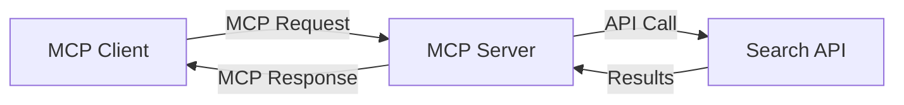
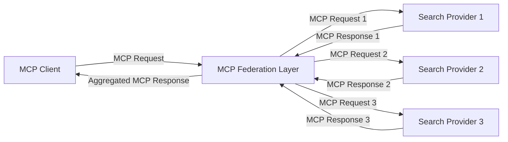
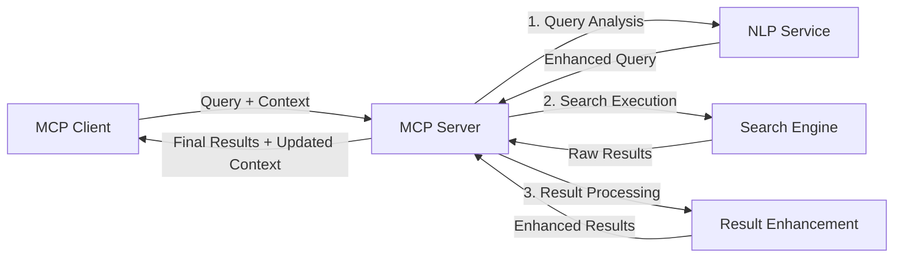

<!--
CO_OP_TRANSLATOR_METADATA:
{
  "original_hash": "16bef2c93c6a86d4ca6a8ce9e120e384",
  "translation_date": "2025-06-13T02:47:58+00:00",
  "source_file": "05-AdvancedTopics/mcp-realtimesearch/README.md",
  "language_code": "th"
}
-->
## คำชี้แจงเกี่ยวกับตัวอย่างโค้ด

> **หมายเหตุสำคัญ**: ตัวอย่างโค้ดด้านล่างนี้แสดงการผสานรวม Model Context Protocol (MCP) กับฟังก์ชันการค้นหาเว็บ แม้ว่าจะเป็นไปตามรูปแบบและโครงสร้างของ MCP SDK อย่างเป็นทางการ แต่ได้ถูกทำให้ง่ายขึ้นเพื่อการเรียนรู้
> 
> ตัวอย่างเหล่านี้แสดงให้เห็น:
> 
> 1. **การใช้งานใน Python**: การสร้างเซิร์ฟเวอร์ FastMCP ที่ให้บริการเครื่องมือค้นหาเว็บและเชื่อมต่อกับ API การค้นหาภายนอก ตัวอย่างนี้แสดงการจัดการอายุการใช้งานอย่างถูกต้อง การจัดการบริบท และการใช้งานเครื่องมือตามรูปแบบของ [MCP Python SDK อย่างเป็นทางการ](https://github.com/modelcontextprotocol/python-sdk) เซิร์ฟเวอร์ใช้การขนส่งแบบ Streamable HTTP ซึ่งแนะนำแทนที่ SSE สำหรับการใช้งานจริง
> 
> 2. **การใช้งานใน JavaScript**: การใช้งานด้วย TypeScript/JavaScript ตามรูปแบบ FastMCP จาก [MCP TypeScript SDK อย่างเป็นทางการ](https://github.com/modelcontextprotocol/typescript-sdk) เพื่อสร้างเซิร์ฟเวอร์ค้นหาที่มีการกำหนดเครื่องมือและการเชื่อมต่อไคลเอนต์อย่างเหมาะสม ปฏิบัติตามรูปแบบที่แนะนำล่าสุดสำหรับการจัดการเซสชันและการรักษาบริบท
> 
> ตัวอย่างเหล่านี้ยังต้องมีการจัดการข้อผิดพลาด การตรวจสอบสิทธิ์ และโค้ดเชื่อมต่อ API เฉพาะสำหรับการใช้งานจริง จุดสิ้นสุด API การค้นหาที่แสดง (`https://api.search-service.example/search`) เป็นที่ตั้งสมมติและควรถูกแทนที่ด้วยจุดสิ้นสุดของบริการค้นหาจริง
> 
> สำหรับรายละเอียดการใช้งานครบถ้วนและแนวทางที่ทันสมัยที่สุด กรุณาเยี่ยมชม [ข้อกำหนด MCP อย่างเป็นทางการ](https://spec.modelcontextprotocol.io/) และเอกสาร SDK

## แนวคิดหลัก

### กรอบงาน Model Context Protocol (MCP)

พื้นฐานของ Model Context Protocol คือการให้วิธีมาตรฐานสำหรับโมเดล AI แอปพลิเคชัน และบริการในการแลกเปลี่ยนบริบท ในการค้นหาเว็บแบบเรียลไทม์ กรอบงานนี้จำเป็นสำหรับการสร้างประสบการณ์การค้นหาที่ต่อเนื่องและหลายรอบ ส่วนประกอบหลักประกอบด้วย:

1. **สถาปัตยกรรมไคลเอนต์-เซิร์ฟเวอร์**: MCP กำหนดการแยกชัดเจนระหว่างไคลเอนต์ค้นหา (ผู้ร้องขอ) กับเซิร์ฟเวอร์ค้นหา (ผู้ให้บริการ) เพื่อให้สามารถปรับใช้ได้อย่างยืดหยุ่น

2. **การสื่อสาร JSON-RPC**: โปรโตคอลใช้ JSON-RPC สำหรับแลกเปลี่ยนข้อความ ทำให้เข้ากันได้กับเทคโนโลยีเว็บและง่ายต่อการใช้งานบนแพลตฟอร์มต่าง ๆ

3. **การจัดการบริบท**: MCP กำหนดวิธีการที่มีโครงสร้างสำหรับการรักษา อัปเดต และใช้บริบทการค้นหาผ่านหลายการโต้ตอบ

4. **การกำหนดเครื่องมือ**: ความสามารถในการค้นหาถูกเปิดเผยเป็นเครื่องมือมาตรฐานที่มีพารามิเตอร์และค่าผลลัพธ์ที่ชัดเจน

5. **การสนับสนุนการสตรีม**: โปรโตคอลรองรับการสตรีมผลลัพธ์ ซึ่งจำเป็นสำหรับการค้นหาแบบเรียลไทม์ที่ผลลัพธ์อาจมาถึงอย่างต่อเนื่อง

### รูปแบบการผสานรวมการค้นหาเว็บ

เมื่อผสานรวม MCP กับการค้นหาเว็บ จะมีรูปแบบหลักๆ ดังนี้:

#### 1. การผสานรวมผู้ให้บริการค้นหาโดยตรง

ในรูปแบบนี้ เซิร์ฟเวอร์ MCP จะติดต่อกับ API การค้นหาหนึ่งหรือหลายตัวโดยตรง แปลงคำขอ MCP เป็นการเรียก API เฉพาะ และจัดรูปแบบผลลัพธ์เป็นการตอบสนอง MCP

#### 2. การค้นหาผสานรวมแบบรักษาบริบท

รูปแบบนี้จะแจกจ่ายคำค้นหาผ่านผู้ให้บริการค้นหาที่รองรับ MCP หลายราย ซึ่งแต่ละรายอาจเชี่ยวชาญในเนื้อหาหรือความสามารถการค้นหาที่แตกต่างกัน โดยยังคงรักษาบริบทที่เป็นเอกภาพ

#### 3. โซ่การค้นหาที่เสริมบริบท

ในรูปแบบนี้ กระบวนการค้นหาจะแบ่งเป็นหลายขั้นตอน โดยบริบทจะได้รับการเสริมในแต่ละขั้นตอน ส่งผลให้ผลลัพธ์มีความเกี่ยวข้องมากขึ้นตามลำดับ

### ส่วนประกอบบริบทการค้นหา

ในการค้นหาเว็บที่ใช้ MCP บริบทโดยทั่วไปประกอบด้วย:

- **ประวัติคำค้นหา**: คำค้นหาก่อนหน้าในเซสชัน
- **ความชอบของผู้ใช้**: ภาษา ภูมิภาค การตั้งค่าค้นหาปลอดภัย
- **ประวัติการโต้ตอบ**: ผลลัพธ์ที่คลิก เวลาใช้กับผลลัพธ์
- **พารามิเตอร์การค้นหา**: ตัวกรอง การจัดเรียง และตัวแก้ไขค้นหาอื่น ๆ
- **ความรู้โดเมน**: บริบทเฉพาะเรื่องที่เกี่ยวข้องกับการค้นหา
- **บริบทเชิงเวลา**: ปัจจัยความเกี่ยวข้องตามเวลา
- **ความชอบแหล่งข้อมูล**: แหล่งข้อมูลที่เชื่อถือหรือชื่นชอบ

## กรณีใช้งานและแอปพลิเคชัน

### การวิจัยและการรวบรวมข้อมูล

MCP ช่วยเสริมกระบวนการวิจัยโดย:

- รักษาบริบทการวิจัยข้ามเซสชันการค้นหา
- เปิดใช้งานคำค้นหาที่ซับซ้อนและมีความเกี่ยวข้องตามบริบท
- สนับสนุนการค้นหาผสานรวมจากหลายแหล่ง
- ช่วยในการสกัดความรู้จากผลลัพธ์การค้นหา

### การติดตามข่าวสารและแนวโน้มแบบเรียลไทม์

การค้นหาที่ใช้ MCP ให้ข้อได้เปรียบสำหรับการติดตามข่าว:

- ค้นพบข่าวที่เกิดขึ้นใหม่เกือบจะทันที
- กรองข้อมูลที่เกี่ยวข้องตามบริบท
- ติดตามหัวข้อและเอนทิตีจากหลายแหล่ง
- แจ้งเตือนข่าวสารส่วนบุคคลตามบริบทผู้ใช้

### การท่องเว็บและวิจัยที่เสริมด้วย AI

MCP สร้างโอกาสใหม่สำหรับการท่องเว็บที่เสริมด้วย AI:

- เสนอคำค้นหาตามบริบทจากกิจกรรมในเบราว์เซอร์ปัจจุบัน
- ผสานรวมการค้นหาเว็บกับผู้ช่วยที่ใช้ LLM อย่างไร้รอยต่อ
- ปรับปรุงการค้นหาหลายรอบโดยรักษาบริบท
- เพิ่มความสามารถตรวจสอบข้อเท็จจริงและยืนยันข้อมูล

## แนวโน้มและนวัตกรรมในอนาคต

### การพัฒนา MCP ในการค้นหาเว็บ

ในอนาคต เราคาดว่า MCP จะพัฒนาเพื่อรองรับ:

- **การค้นหาหลายรูปแบบ**: ผสานรวมการค้นหาข้อความ รูปภาพ เสียง และวิดีโอโดยรักษาบริบท
- **การค้นหาแบบกระจาย**: สนับสนุนระบบค้นหาที่กระจายและผสานรวม
- **ความเป็นส่วนตัวในการค้นหา**: กลไกการค้นหาที่คำนึงถึงความเป็นส่วนตัวโดยใช้บริบท
- **ความเข้าใจคำค้นหา**: การแยกวิเคราะห์ความหมายเชิงลึกของคำค้นหาภาษาธรรมชาติ

### ความก้าวหน้าทางเทคโนโลยีที่อาจเกิดขึ้น

เทคโนโลยีใหม่ที่จะกำหนดอนาคตของการค้นหา MCP ได้แก่:

1. **สถาปัตยกรรมการค้นหาเชิงประสาท**: ระบบค้นหาที่ใช้การฝังตัว (embedding) ที่เหมาะสมกับ MCP
2. **บริบทการค้นหาส่วนบุคคล**: เรียนรู้รูปแบบการค้นหาของผู้ใช้แต่ละคนตลอดเวลา
3. **การผสานกราฟความรู้**: การค้นหาที่เสริมด้วยกราฟความรู้เฉพาะโดเมน
4. **บริบทข้ามรูปแบบ**: รักษาบริบทข้ามโหมดการค้นหาต่าง ๆ

## แบบฝึกหัดปฏิบัติ

### แบบฝึกหัด 1: การตั้งค่าท่อค้นหา MCP เบื้องต้น

ในแบบฝึกหัดนี้ คุณจะได้เรียนรู้วิธี:
- กำหนดสภาพแวดล้อมการค้นหา MCP เบื้องต้น
- ใช้ตัวจัดการบริบทสำหรับการค้นหาเว็บ
- ทดสอบและตรวจสอบการรักษาบริบทข้ามรอบการค้นหา

### แบบฝึกหัด 2: การสร้างผู้ช่วยวิจัยด้วย MCP Search

สร้างแอปพลิเคชันครบวงจรที่:
- ประมวลผลคำถามวิจัยภาษาธรรมชาติ
- ทำการค้นหาเว็บที่คำนึงถึงบริบท
- สังเคราะห์ข้อมูลจากหลายแหล่ง
- นำเสนอผลการวิจัยอย่างเป็นระเบียบ

### แบบฝึกหัด 3: การใช้งานการค้นหาผสานจากหลายแหล่งด้วย MCP

แบบฝึกหัดขั้นสูงครอบคลุม:
- การส่งคำค้นหาที่คำนึงถึงบริบทไปยังเครื่องมือค้นหาหลายแห่ง
- การจัดอันดับและรวบรวมผลลัพธ์
- การลบข้อมูลซ้ำซ้อนตามบริบทของผลลัพธ์
- การจัดการเมตาดาต้าเฉพาะแหล่ง

## แหล่งข้อมูลเพิ่มเติม

- [ข้อกำหนด Model Context Protocol](https://spec.modelcontextprotocol.io/) - ข้อกำหนด MCP อย่างเป็นทางการและเอกสารโปรโตคอลโดยละเอียด
- [เอกสาร Model Context Protocol](https://modelcontextprotocol.io/) - บทเรียนและคู่มือการใช้งานอย่างละเอียด
- [MCP Python SDK](https://github.com/modelcontextprotocol/python-sdk) - การใช้งาน MCP อย่างเป็นทางการใน Python
- [MCP TypeScript SDK](https://github.com/modelcontextprotocol/typescript-sdk) - การใช้งาน MCP อย่างเป็นทางการใน TypeScript
- [เซิร์ฟเวอร์อ้างอิง MCP](https://github.com/modelcontextprotocol/servers) - ตัวอย่างการใช้งานเซิร์ฟเวอร์ MCP
- [เอกสาร Bing Web Search API](https://learn.microsoft.com/en-us/bing/search-apis/bing-web-search/overview) - API การค้นหาเว็บของ Microsoft
- [Google Custom Search JSON API](https://developers.google.com/custom-search/v1/overview) - เครื่องมือค้นหาที่ปรับแต่งได้ของ Google
- [เอกสาร SerpAPI](https://serpapi.com/search-api) - API ผลลัพธ์หน้าผลการค้นหา
- [เอกสาร Meilisearch](https://www.meilisearch.com/docs) - เครื่องมือค้นหาแบบโอเพนซอร์ส
- [เอกสาร Elasticsearch](https://www.elastic.co/guide/index.html) - เครื่องมือค้นหาและวิเคราะห์แบบกระจาย
- [เอกสาร LangChain](https://python.langchain.com/docs/get_started/introduction) - การสร้างแอปพลิเคชันด้วย LLM

## ผลลัพธ์การเรียนรู้

เมื่อจบโมดูลนี้ คุณจะสามารถ:

- เข้าใจพื้นฐานของการค้นหาเว็บแบบเรียลไทม์และความท้าทาย
- อธิบายว่า Model Context Protocol (MCP) ช่วยเพิ่มประสิทธิภาพการค้นหาเว็บแบบเรียลไทม์ได้อย่างไร
- พัฒนาการค้นหาที่ใช้ MCP ด้วยเฟรมเวิร์กและ API ที่นิยม
- ออกแบบและใช้งานสถาปัตยกรรมการค้นหาที่ปรับขนาดได้และประสิทธิภาพสูงด้วย MCP
- นำแนวคิด MCP ไปใช้กับกรณีใช้งานต่าง ๆ เช่น การค้นหาความหมาย การช่วยวิจัย และการท่องเว็บที่เสริมด้วย AI
- ประเมินแนวโน้มและนวัตกรรมในอนาคตของเทคโนโลยีการค้นหาที่ใช้ MCP

### ข้อควรระวังด้านความน่าเชื่อถือและความปลอดภัย

เมื่อพัฒนาการค้นหาที่ใช้ MCP โปรดจำหลักการสำคัญเหล่านี้จากข้อกำหนด MCP:

1. **ความยินยอมและการควบคุมของผู้ใช้**: ผู้ใช้ต้องให้ความยินยอมอย่างชัดเจนและเข้าใจการเข้าถึงข้อมูลและการดำเนินการทั้งหมด โดยเฉพาะสำหรับการใช้งานค้นหาเว็บที่อาจเข้าถึงแหล่งข้อมูลภายนอก

2. **ความเป็นส่วนตัวของข้อมูล**: ดูแลการจัดการคำค้นหาและผลลัพธ์อย่างเหมาะสม โดยเฉพาะข้อมูลที่อาจมีความอ่อนไหว และใช้การควบคุมการเข้าถึงเพื่อปกป้องข้อมูลผู้ใช้

3. **ความปลอดภัยของเครื่องมือ**: ใช้การอนุญาตและการตรวจสอบที่เหมาะสมสำหรับเครื่องมือค้นหา เพราะอาจเสี่ยงต่อความปลอดภัยจากการรันโค้ดที่ไม่คาดคิด คำอธิบายพฤติกรรมของเครื่องมือควรถือว่าไม่น่าเชื่อถือหากไม่ได้มาจากเซิร์ฟเวอร์ที่เชื่อถือได้

4. **เอกสารชัดเจน**: ให้เอกสารที่ชัดเจนเกี่ยวกับความสามารถ ข้อจำกัด และข้อควรระวังด้านความปลอดภัยของการใช้งาน MCP ตามแนวทางในข้อกำหนด MCP

5. **กระบวนการยินยอมที่มั่นคง**: สร้างกระบวนการยินยอมและอนุญาตที่ชัดเจน อธิบายว่าแต่ละเครื่องมือทำงานอย่างไร ก่อนให้สิทธิ์ใช้งาน โดยเฉพาะเครื่องมือที่ติดต่อกับแหล่งข้อมูลเว็บภายนอก

สำหรับรายละเอียดเกี่ยวกับความปลอดภัยและความน่าเชื่อถือของ MCP โปรดดูที่ [เอกสารอย่างเป็นทางการ](https://modelcontextprotocol.io/specification/2025-03-26#security-and-trust-%26-safety)

## ต่อไปคือ

- [6. การมีส่วนร่วมของชุมชน](../../06-CommunityContributions/README.md)

**ข้อจำกัดความรับผิดชอบ**:  
เอกสารฉบับนี้ได้รับการแปลโดยใช้บริการแปลภาษาอัตโนมัติ [Co-op Translator](https://github.com/Azure/co-op-translator) แม้ว่าเราจะพยายามให้ความถูกต้องสูงสุด แต่โปรดทราบว่าการแปลอัตโนมัติอาจมีข้อผิดพลาดหรือความคลาดเคลื่อนได้ เอกสารต้นฉบับในภาษาต้นฉบับควรถูกพิจารณาเป็นแหล่งข้อมูลที่ถูกต้อง สำหรับข้อมูลที่สำคัญ ควรใช้บริการแปลโดยมืออาชีพที่เป็นมนุษย์ เราไม่รับผิดชอบต่อความเข้าใจผิดหรือการตีความที่ผิดพลาดที่เกิดขึ้นจากการใช้การแปลนี้