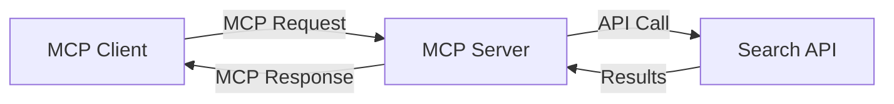
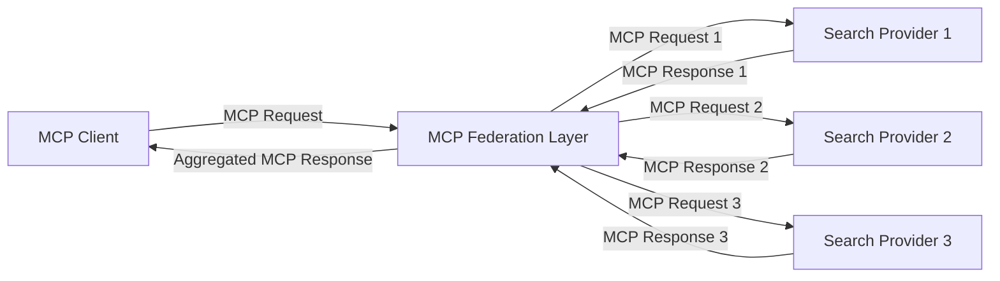
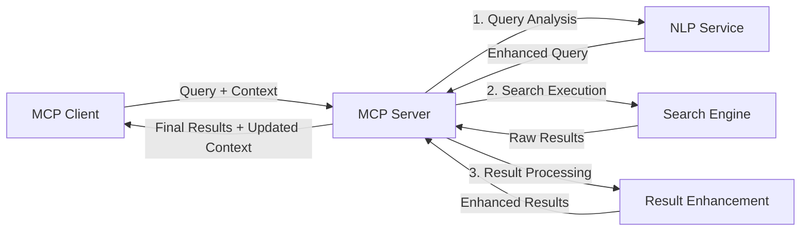

<!--
CO_OP_TRANSLATOR_METADATA:
{
  "original_hash": "eb12652eb7bd17f2193b835a344425c6",
  "translation_date": "2025-06-26T14:03:31+00:00",
  "source_file": "05-AdvancedTopics/mcp-realtimesearch/README.md",
  "language_code": "th"
}
-->
## คำเตือนเกี่ยวกับตัวอย่างโค้ด

> **หมายเหตุสำคัญ**: ตัวอย่างโค้ดด้านล่างนี้แสดงการผสานรวม Model Context Protocol (MCP) กับฟังก์ชันการค้นหาเว็บ แม้ว่าจะปฏิบัติตามรูปแบบและโครงสร้างของ MCP SDK อย่างเป็นทางการ แต่ได้ถูกทำให้ง่ายขึ้นเพื่อใช้ในเชิงการศึกษา
> 
> ตัวอย่างเหล่านี้ประกอบด้วย:
> 
> 1. **การใช้งานในภาษา Python**: ตัวอย่างเซิร์ฟเวอร์ FastMCP ที่ให้บริการเครื่องมือค้นหาเว็บและเชื่อมต่อกับ API การค้นหาภายนอก ตัวอย่างนี้แสดงการจัดการอายุการใช้งาน การจัดการบริบท และการใช้งานเครื่องมืออย่างถูกต้องตามรูปแบบของ [MCP Python SDK อย่างเป็นทางการ](https://github.com/modelcontextprotocol/python-sdk) เซิร์ฟเวอร์นี้ใช้การขนส่งแบบ Streamable HTTP ที่แนะนำ ซึ่งมาแทนที่ SSE transport แบบเก่าสำหรับการใช้งานจริง
> 
> 2. **การใช้งานในภาษา JavaScript**: ตัวอย่างการใช้งาน TypeScript/JavaScript โดยใช้รูปแบบ FastMCP จาก [MCP TypeScript SDK อย่างเป็นทางการ](https://github.com/modelcontextprotocol/typescript-sdk) เพื่อสร้างเซิร์ฟเวอร์ค้นหาพร้อมการกำหนดเครื่องมือและการเชื่อมต่อไคลเอนต์ที่เหมาะสม ปฏิบัติตามรูปแบบที่แนะนำล่าสุดสำหรับการจัดการเซสชันและการรักษาบริบท
> 
> ตัวอย่างเหล่านี้ยังต้องการการจัดการข้อผิดพลาด การตรวจสอบสิทธิ์ และโค้ดการเชื่อมต่อ API เฉพาะเพิ่มเติมสำหรับการใช้งานจริง จุดเชื่อมต่อ API การค้นหาที่แสดง (`https://api.search-service.example/search`) เป็นเพียงตัวอย่างและต้องถูกแทนที่ด้วยจุดเชื่อมต่อบริการค้นหาจริง
> 
> สำหรับรายละเอียดการใช้งานครบถ้วนและแนวทางล่าสุด โปรดดูที่ [ข้อกำหนด MCP อย่างเป็นทางการ](https://spec.modelcontextprotocol.io/) และเอกสาร SDK

## แนวคิดหลัก

### กรอบงาน Model Context Protocol (MCP)

ในพื้นฐาน MCP คือวิธีมาตรฐานสำหรับโมเดล AI แอปพลิเคชัน และบริการในการแลกเปลี่ยนบริบท ในการค้นหาเว็บแบบเรียลไทม์ กรอบงานนี้จำเป็นสำหรับการสร้างประสบการณ์การค้นหาหลายรอบที่สอดคล้องกัน ส่วนประกอบหลักได้แก่:

1. **สถาปัตยกรรมไคลเอนต์-เซิร์ฟเวอร์**: MCP กำหนดการแยกชัดเจนระหว่างไคลเอนต์ค้นหา (ผู้ร้องขอ) และเซิร์ฟเวอร์ค้นหา (ผู้ให้บริการ) ช่วยให้มีรูปแบบการปรับใช้ที่ยืดหยุ่น

2. **การสื่อสาร JSON-RPC**: โปรโตคอลใช้ JSON-RPC สำหรับการแลกเปลี่ยนข้อความ ทำให้เข้ากันได้กับเทคโนโลยีเว็บและง่ายต่อการใช้งานบนแพลตฟอร์มต่าง ๆ

3. **การจัดการบริบท**: MCP กำหนดวิธีการที่มีโครงสร้างสำหรับการรักษา ปรับปรุง และใช้บริบทการค้นหาข้ามหลายการโต้ตอบ

4. **การกำหนดเครื่องมือ**: ความสามารถในการค้นหาถูกเปิดเผยเป็นเครื่องมือมาตรฐานที่มีพารามิเตอร์และค่าที่คืนกลับที่กำหนดไว้อย่างชัดเจน

5. **การรองรับการสตรีม**: โปรโตคอลรองรับผลลัพธ์แบบสตรีม ซึ่งจำเป็นสำหรับการค้นหาแบบเรียลไทม์ที่ผลลัพธ์อาจมาถึงแบบค่อยเป็นค่อยไป

### รูปแบบการผสานรวมการค้นหาเว็บ

เมื่อผสานรวม MCP กับการค้นหาเว็บ รูปแบบต่าง ๆ จะเกิดขึ้นดังนี้:

#### 1. การผสานรวมกับผู้ให้บริการค้นหาโดยตรง

ในรูปแบบนี้ เซิร์ฟเวอร์ MCP จะเชื่อมต่อโดยตรงกับ API การค้นหาอย่างน้อยหนึ่งตัว แปลงคำขอ MCP เป็นคำขอเฉพาะ API และจัดรูปแบบผลลัพธ์เป็นการตอบสนอง MCP

#### 2. การค้นหาแบบสหสาขาพร้อมการรักษาบริบท

รูปแบบนี้จะแจกจ่ายคำค้นหาข้ามผู้ให้บริการค้นหาที่รองรับ MCP หลายราย โดยแต่ละรายอาจเชี่ยวชาญในเนื้อหาหรือความสามารถในการค้นหาที่แตกต่างกัน พร้อมทั้งรักษาบริบทให้เป็นเอกภาพ

#### 3. โซ่การค้นหาที่เสริมบริบท

ในรูปแบบนี้ กระบวนการค้นหาจะแบ่งออกเป็นหลายขั้นตอน โดยบริบทจะได้รับการเสริมในแต่ละขั้นตอน ส่งผลให้ผลลัพธ์มีความเกี่ยวข้องมากขึ้นอย่างต่อเนื่อง

### ส่วนประกอบบริบทการค้นหา

ในการค้นหาเว็บที่ใช้ MCP บริบทมักจะประกอบด้วย:

- **ประวัติคำค้นหา**: คำค้นหาก่อนหน้าในเซสชัน
- **ความชอบของผู้ใช้**: ภาษา ภูมิภาค การตั้งค่าค้นหาปลอดภัย
- **ประวัติการโต้ตอบ**: ผลลัพธ์ที่คลิก เวลาใช้บนผลลัพธ์
- **พารามิเตอร์การค้นหา**: ตัวกรอง การจัดเรียง และตัวปรับแต่งการค้นหาอื่น ๆ
- **ความรู้เฉพาะโดเมน**: บริบทเฉพาะเรื่องที่เกี่ยวข้องกับการค้นหา
- **บริบทตามเวลา**: ปัจจัยความเกี่ยวข้องตามเวลา
- **ความชอบแหล่งข้อมูล**: แหล่งข้อมูลที่เชื่อถือหรือชื่นชอบ

## กรณีใช้งานและแอปพลิเคชัน

### งานวิจัยและการรวบรวมข้อมูล

MCP ช่วยเพิ่มประสิทธิภาพเวิร์กโฟลว์การวิจัยโดย:

- รักษาบริบทการวิจัยข้ามเซสชันการค้นหา
- เปิดใช้งานคำค้นหาที่ซับซ้อนและเกี่ยวข้องตามบริบทมากขึ้น
- สนับสนุนการรวมการค้นหาจากหลายแหล่ง
- ช่วยในการสกัดความรู้จากผลลัพธ์การค้นหา

### การติดตามข่าวสารและแนวโน้มแบบเรียลไทม์

การค้นหาที่ใช้ MCP ให้ข้อได้เปรียบสำหรับการติดตามข่าวสาร:

- การค้นพบข่าวสารใหม่ ๆ เกือบแบบเรียลไทม์
- การกรองข้อมูลที่เกี่ยวข้องตามบริบท
- การติดตามหัวข้อและเอนทิตีข้ามแหล่งข้อมูลหลายแห่ง
- การแจ้งเตือนข่าวสารส่วนบุคคลตามบริบทผู้ใช้

### การท่องเว็บและวิจัยที่เพิ่มพลังด้วย AI

MCP สร้างโอกาสใหม่สำหรับการท่องเว็บที่เพิ่มพลังด้วย AI:

- คำแนะนำการค้นหาตามบริบทจากกิจกรรมในเบราว์เซอร์ปัจจุบัน
- การผสานรวมการค้นหาเว็บกับผู้ช่วยที่ใช้ LLM อย่างราบรื่น
- การปรับปรุงการค้นหาหลายรอบโดยรักษาบริบท
- การตรวจสอบข้อเท็จจริงและยืนยันข้อมูลที่ดีขึ้น

## แนวโน้มและนวัตกรรมในอนาคต

### การพัฒนาของ MCP ในการค้นหาเว็บ

ในอนาคต คาดว่า MCP จะพัฒนาเพื่อตอบสนอง:

- **การค้นหาหลายรูปแบบ**: การรวมการค้นหาข้อความ รูปภาพ เสียง และวิดีโอโดยรักษาบริบท
- **การค้นหาแบบกระจายศูนย์**: สนับสนุนระบบค้นหาที่กระจายและสหสาขา
- **ความเป็นส่วนตัวในการค้นหา**: กลไกการค้นหาที่รักษาความเป็นส่วนตัวโดยใช้บริบท
- **ความเข้าใจคำค้นหา**: การวิเคราะห์ความหมายเชิงลึกของคำค้นหาภาษาธรรมชาติ

### ความก้าวหน้าทางเทคโนโลยีที่อาจเกิดขึ้น

เทคโนโลยีที่กำลังเกิดขึ้นซึ่งจะกำหนดอนาคตของการค้นหา MCP ได้แก่:

1. **สถาปัตยกรรมการค้นหาแบบนิวรอล**: ระบบค้นหาที่ใช้การฝังตัว (embedding) ที่เหมาะสมกับ MCP
2. **บริบทการค้นหาที่ปรับให้เหมาะกับบุคคล**: เรียนรู้รูปแบบการค้นหาของผู้ใช้แต่ละคนตามเวลา
3. **การผสานรวมกราฟความรู้**: การค้นหาที่เสริมด้วยกราฟความรู้เฉพาะโดเมน
4. **บริบทข้ามรูปแบบ**: รักษาบริบทข้ามโหมดการค้นหาต่าง ๆ

## แบบฝึกหัดปฏิบัติ

### แบบฝึกหัด 1: การตั้งค่าท่อค้นหา MCP เบื้องต้น

ในแบบฝึกหัดนี้ คุณจะได้เรียนรู้วิธี:
- กำหนดสภาพแวดล้อมการค้นหา MCP เบื้องต้น
- ใช้งานตัวจัดการบริบทสำหรับการค้นหาเว็บ
- ทดสอบและตรวจสอบการรักษาบริบทข้ามการค้นหาหลายรอบ

### แบบฝึกหัด 2: การสร้างผู้ช่วยวิจัยด้วยการค้นหา MCP

สร้างแอปพลิเคชันสมบูรณ์ที่:
- ประมวลผลคำถามวิจัยภาษาธรรมชาติ
- ดำเนินการค้นหาเว็บโดยคำนึงถึงบริบท
- สังเคราะห์ข้อมูลจากหลายแหล่ง
- นำเสนอผลการวิจัยอย่างเป็นระเบียบ

### แบบฝึกหัด 3: การใช้งานการรวมการค้นหาหลายแหล่งด้วย MCP

แบบฝึกหัดขั้นสูงที่ครอบคลุม:
- การส่งคำค้นหาโดยคำนึงถึงบริบทไปยังเครื่องมือค้นหาหลายแห่ง
- การจัดอันดับและรวมผลลัพธ์
- การลบข้อมูลซ้ำตามบริบทของผลลัพธ์การค้นหา
- การจัดการข้อมูลเมตาเฉพาะแหล่งข้อมูล

## แหล่งข้อมูลเพิ่มเติม

- [ข้อกำหนด Model Context Protocol](https://spec.modelcontextprotocol.io/) - ข้อกำหนด MCP อย่างเป็นทางการและเอกสารโปรโตคอลโดยละเอียด
- [เอกสาร Model Context Protocol](https://modelcontextprotocol.io/) - บทเรียนและคู่มือการใช้งานโดยละเอียด
- [MCP Python SDK](https://github.com/modelcontextprotocol/python-sdk) - การใช้งาน MCP อย่างเป็นทางการในภาษา Python
- [MCP TypeScript SDK](https://github.com/modelcontextprotocol/typescript-sdk) - การใช้งาน MCP อย่างเป็นทางการใน TypeScript
- [เซิร์ฟเวอร์อ้างอิง MCP](https://github.com/modelcontextprotocol/servers) - ตัวอย่างการใช้งานเซิร์ฟเวอร์ MCP
- [เอกสาร Bing Web Search API](https://learn.microsoft.com/en-us/bing/search-apis/bing-web-search/overview) - API การค้นหาเว็บของ Microsoft
- [Google Custom Search JSON API](https://developers.google.com/custom-search/v1/overview) - เครื่องมือค้นหาที่ปรับแต่งได้ของ Google
- [เอกสาร SerpAPI](https://serpapi.com/search-api) - API หน้าแสดงผลการค้นหา
- [เอกสาร Meilisearch](https://www.meilisearch.com/docs) - เครื่องมือค้นหาแบบโอเพนซอร์ส
- [เอกสาร Elasticsearch](https://www.elastic.co/guide/index.html) - เครื่องมือค้นหาและวิเคราะห์ข้อมูลแบบกระจาย
- [เอกสาร LangChain](https://python.langchain.com/docs/get_started/introduction) - การสร้างแอปพลิเคชันด้วย LLM

## ผลลัพธ์การเรียนรู้

เมื่อเรียนจบโมดูลนี้ คุณจะสามารถ:

- เข้าใจพื้นฐานของการค้นหาเว็บแบบเรียลไทม์และความท้าทายที่เกี่ยวข้อง
- อธิบายว่า Model Context Protocol (MCP) ช่วยเพิ่มประสิทธิภาพการค้นหาเว็บแบบเรียลไทม์ได้อย่างไร
- นำเสนอการค้นหาที่ใช้ MCP โดยใช้เฟรมเวิร์กและ API ที่ได้รับความนิยม
- ออกแบบและปรับใช้สถาปัตยกรรมการค้นหาที่ปรับขนาดได้และมีประสิทธิภาพสูงด้วย MCP
- ประยุกต์ใช้แนวคิด MCP กับกรณีใช้งานต่าง ๆ เช่น การค้นหาความหมาย ผู้ช่วยวิจัย และการท่องเว็บที่เพิ่มพลังด้วย AI
- ประเมินแนวโน้มและนวัตกรรมในอนาคตของเทคโนโลยีการค้นหาที่ใช้ MCP

### การพิจารณาด้านความน่าเชื่อถือและความปลอดภัย

เมื่อใช้งานโซลูชันการค้นหาที่ใช้ MCP โปรดจดจำหลักการสำคัญจากข้อกำหนด MCP ดังนี้:

1. **ความยินยอมและการควบคุมของผู้ใช้**: ผู้ใช้ต้องยินยอมอย่างชัดเจนและเข้าใจการเข้าถึงข้อมูลและการดำเนินการทั้งหมด โดยเฉพาะการค้นหาเว็บที่อาจเข้าถึงแหล่งข้อมูลภายนอก

2. **ความเป็นส่วนตัวของข้อมูล**: จัดการคำค้นหาและผลลัพธ์อย่างเหมาะสม โดยเฉพาะเมื่อมีข้อมูลที่ละเอียดอ่อน ใช้มาตรการควบคุมการเข้าถึงเพื่อปกป้องข้อมูลผู้ใช้

3. **ความปลอดภัยของเครื่องมือ**: ดำเนินการตรวจสอบสิทธิ์และการตรวจสอบความถูกต้องของเครื่องมือค้นหาอย่างเหมาะสม เพราะเครื่องมือเหล่านี้อาจเป็นความเสี่ยงด้านความปลอดภัยจากการรันโค้ดที่ไม่ได้ตรวจสอบ คำอธิบายพฤติกรรมของเครื่องมือควรถูกพิจารณาว่าไม่น่าเชื่อถือหากไม่ได้มาจากเซิร์ฟเวอร์ที่เชื่อถือได้

4. **เอกสารชัดเจน**: จัดทำเอกสารที่ชัดเจนเกี่ยวกับความสามารถ ข้อจำกัด และข้อควรระวังด้านความปลอดภัยของการใช้งาน MCP ตามแนวทางในข้อกำหนด MCP

5. **กระบวนการยินยอมที่แข็งแรง**: สร้างกระบวนการยินยอมและการอนุญาตที่ชัดเจน อธิบายอย่างละเอียดว่าแต่ละเครื่องมือทำอะไร ก่อนอนุญาตให้ใช้งาน โดยเฉพาะเครื่องมือที่โต้ตอบกับทรัพยากรเว็บภายนอก

สำหรับรายละเอียดครบถ้วนเกี่ยวกับความปลอดภัยและความน่าเชื่อถือของ MCP โปรดดูที่ [เอกสารอย่างเป็นทางการ](https://modelcontextprotocol.io/specification/2025-03-26#security-and-trust-%26-safety)

## ต่อไปคือ

- [5.11 การตรวจสอบสิทธิ์ Entra ID สำหรับเซิร์ฟเวอร์ Model Context Protocol](../mcp-security-entra/README.md)

**ข้อจำกัดความรับผิดชอบ**:  
เอกสารฉบับนี้ได้รับการแปลโดยใช้บริการแปลภาษาอัตโนมัติ [Co-op Translator](https://github.com/Azure/co-op-translator) แม้เราจะพยายามให้ความถูกต้องสูงสุด แต่โปรดทราบว่าการแปลอัตโนมัติอาจมีข้อผิดพลาดหรือความไม่แม่นยำ เอกสารต้นฉบับในภาษาต้นฉบับถือเป็นแหล่งข้อมูลที่เชื่อถือได้ สำหรับข้อมูลที่สำคัญ ควรใช้การแปลโดยผู้เชี่ยวชาญด้านภาษามนุษย์ เราไม่รับผิดชอบต่อความเข้าใจผิดหรือการตีความที่ผิดพลาดใด ๆ ที่เกิดจากการใช้การแปลนี้