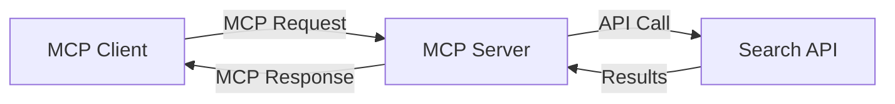
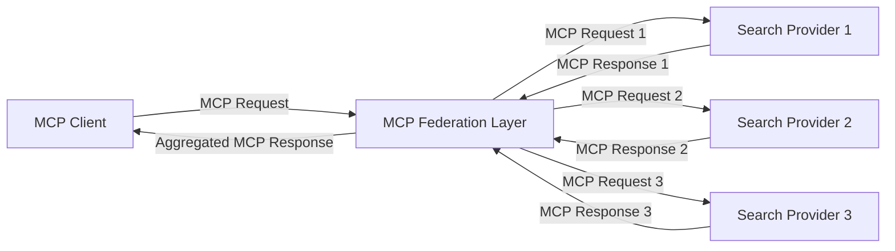
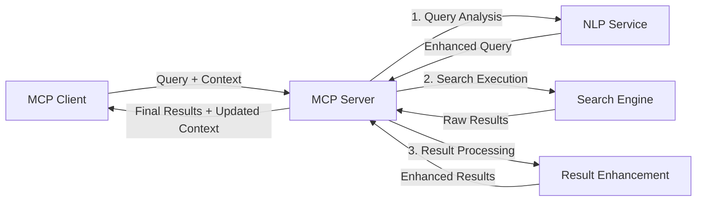

<!--
CO_OP_TRANSLATOR_METADATA:
{
  "original_hash": "333a03e51f90bdf3e6f1ba1694c73f36",
  "translation_date": "2025-07-17T06:01:12+00:00",
  "source_file": "05-AdvancedTopics/mcp-realtimesearch/README.md",
  "language_code": "th"
}
-->
## ข้อจำกัดความรับผิดชอบเกี่ยวกับตัวอย่างโค้ด

> **หมายเหตุสำคัญ**: ตัวอย่างโค้ดด้านล่างนี้แสดงการผสานรวม Model Context Protocol (MCP) กับฟังก์ชันการค้นหาเว็บ แม้ว่าจะปฏิบัติตามรูปแบบและโครงสร้างของ MCP SDK อย่างเป็นทางการ แต่ได้ถูกทำให้ง่ายขึ้นเพื่อวัตถุประสงค์ทางการศึกษา
> 
> ตัวอย่างเหล่านี้แสดงให้เห็น:
> 
> 1. **การใช้งาน Python**: การใช้งานเซิร์ฟเวอร์ FastMCP ที่ให้เครื่องมือค้นหาเว็บและเชื่อมต่อกับ API การค้นหาภายนอก ตัวอย่างนี้แสดงการจัดการอายุการใช้งานอย่างถูกต้อง การจัดการบริบท และการใช้งานเครื่องมือตามรูปแบบของ [MCP Python SDK อย่างเป็นทางการ](https://github.com/modelcontextprotocol/python-sdk) เซิร์ฟเวอร์ใช้การขนส่งแบบ Streamable HTTP ที่แนะนำ ซึ่งมาแทนที่การขนส่ง SSE แบบเก่าสำหรับการใช้งานจริง
> 
> 2. **การใช้งาน JavaScript**: การใช้งาน TypeScript/JavaScript โดยใช้รูปแบบ FastMCP จาก [MCP TypeScript SDK อย่างเป็นทางการ](https://github.com/modelcontextprotocol/typescript-sdk) เพื่อสร้างเซิร์ฟเวอร์ค้นหาพร้อมการกำหนดเครื่องมือและการเชื่อมต่อไคลเอนต์อย่างถูกต้อง ปฏิบัติตามรูปแบบที่แนะนำล่าสุดสำหรับการจัดการเซสชันและการรักษาบริบท
> 
> ตัวอย่างเหล่านี้ยังต้องการการจัดการข้อผิดพลาด การตรวจสอบสิทธิ์ และโค้ดการผสาน API เฉพาะเพิ่มเติมสำหรับการใช้งานจริง จุดสิ้นสุด API การค้นหาที่แสดง (`https://api.search-service.example/search`) เป็นเพียงตัวอย่างและต้องถูกแทนที่ด้วยจุดสิ้นสุดของบริการค้นหาจริง
> 
> สำหรับรายละเอียดการใช้งานอย่างครบถ้วนและแนวทางที่ทันสมัยที่สุด โปรดดูที่ [ข้อกำหนด MCP อย่างเป็นทางการ](https://spec.modelcontextprotocol.io/) และเอกสาร SDK

## แนวคิดหลัก

### กรอบงาน Model Context Protocol (MCP)

ในพื้นฐาน Model Context Protocol ให้วิธีมาตรฐานสำหรับโมเดล AI แอปพลิเคชัน และบริการในการแลกเปลี่ยนบริบท ในการค้นหาเว็บแบบเรียลไทม์ กรอบงานนี้มีความสำคัญสำหรับการสร้างประสบการณ์การค้นหาหลายรอบที่สอดคล้องกัน ส่วนประกอบหลักได้แก่:

1. **สถาปัตยกรรมไคลเอนต์-เซิร์ฟเวอร์**: MCP กำหนดการแยกชัดเจนระหว่างไคลเอนต์ค้นหา (ผู้ร้องขอ) และเซิร์ฟเวอร์ค้นหา (ผู้ให้บริการ) ช่วยให้สามารถปรับใช้ได้อย่างยืดหยุ่น

2. **การสื่อสาร JSON-RPC**: โปรโตคอลใช้ JSON-RPC สำหรับแลกเปลี่ยนข้อความ ทำให้เข้ากันได้กับเทคโนโลยีเว็บและง่ายต่อการใช้งานบนแพลตฟอร์มต่าง ๆ

3. **การจัดการบริบท**: MCP กำหนดวิธีการที่มีโครงสร้างสำหรับการรักษา อัปเดต และใช้ประโยชน์จากบริบทการค้นหาผ่านหลายการโต้ตอบ

4. **การกำหนดเครื่องมือ**: ความสามารถในการค้นหาถูกเปิดเผยเป็นเครื่องมือมาตรฐานที่มีพารามิเตอร์และค่าผลลัพธ์ที่กำหนดไว้อย่างชัดเจน

5. **การสนับสนุนการสตรีม**: โปรโตคอลรองรับการสตรีมผลลัพธ์ ซึ่งจำเป็นสำหรับการค้นหาแบบเรียลไทม์ที่ผลลัพธ์อาจมาถึงอย่างต่อเนื่อง

### รูปแบบการผสานรวมการค้นหาเว็บ

เมื่อผสานรวม MCP กับการค้นหาเว็บ จะมีรูปแบบต่าง ๆ ดังนี้:

#### 1. การผสานรวมผู้ให้บริการค้นหาโดยตรง

ในรูปแบบนี้ เซิร์ฟเวอร์ MCP จะติดต่อกับ API การค้นหาโดยตรงหลายตัว แปลงคำขอ MCP เป็นคำสั่งเฉพาะ API และจัดรูปแบบผลลัพธ์เป็นการตอบสนอง MCP

#### 2. การค้นหาแบบรวมศูนย์พร้อมการรักษาบริบท

รูปแบบนี้กระจายคำค้นหาผ่านผู้ให้บริการค้นหาที่เข้ากันได้กับ MCP หลายราย ซึ่งแต่ละรายอาจเชี่ยวชาญในเนื้อหาหรือความสามารถการค้นหาที่แตกต่างกัน ในขณะที่รักษาบริบทแบบรวมศูนย์

#### 3. โซ่การค้นหาที่เสริมบริบท

ในรูปแบบนี้ กระบวนการค้นหาจะแบ่งเป็นหลายขั้นตอน โดยบริบทจะถูกเสริมในแต่ละขั้นตอน ส่งผลให้ได้ผลลัพธ์ที่เกี่ยวข้องมากขึ้นอย่างต่อเนื่อง

### ส่วนประกอบบริบทการค้นหา

ใน MCP สำหรับการค้นหาเว็บ บริบทโดยทั่วไปประกอบด้วย:

- **ประวัติคำค้นหา**: คำค้นหาก่อนหน้าในเซสชัน
- **ความชอบของผู้ใช้**: ภาษา ภูมิภาค การตั้งค่าการค้นหาปลอดภัย
- **ประวัติการโต้ตอบ**: ผลลัพธ์ที่คลิก เวลาที่ใช้กับผลลัพธ์
- **พารามิเตอร์การค้นหา**: ตัวกรอง ลำดับการจัดเรียง และตัวปรับแต่งการค้นหาอื่น ๆ
- **ความรู้เฉพาะด้าน**: บริบทเฉพาะเรื่องที่เกี่ยวข้องกับการค้นหา
- **บริบทตามเวลา**: ปัจจัยความเกี่ยวข้องตามช่วงเวลา
- **ความชอบแหล่งข้อมูล**: แหล่งข้อมูลที่เชื่อถือหรือชื่นชอบ

## กรณีใช้งานและแอปพลิเคชัน

### การวิจัยและรวบรวมข้อมูล

MCP ช่วยเพิ่มประสิทธิภาพเวิร์กโฟลว์การวิจัยโดย:

- รักษาบริบทการวิจัยข้ามเซสชันการค้นหา
- เปิดใช้งานคำค้นหาที่ซับซ้อนและเกี่ยวข้องกับบริบทมากขึ้น
- สนับสนุนการค้นหาจากหลายแหล่งแบบรวมศูนย์
- ช่วยในการสกัดความรู้จากผลลัพธ์การค้นหา

### การติดตามข่าวสารและแนวโน้มแบบเรียลไทม์

การค้นหาที่ขับเคลื่อนด้วย MCP มีข้อได้เปรียบสำหรับการติดตามข่าวสาร:

- การค้นพบข่าวสารใหม่ ๆ เกือบแบบเรียลไทม์
- การกรองข้อมูลที่เกี่ยวข้องตามบริบท
- การติดตามหัวข้อและเอนทิตีจากหลายแหล่ง
- การแจ้งเตือนข่าวสารส่วนบุคคลตามบริบทผู้ใช้

### การท่องเว็บและวิจัยที่เสริมด้วย AI

MCP สร้างโอกาสใหม่สำหรับการท่องเว็บที่เสริมด้วย AI:

- คำแนะนำการค้นหาตามบริบทจากกิจกรรมเบราว์เซอร์ปัจจุบัน
- การผสานรวมการค้นหาเว็บกับผู้ช่วยที่ขับเคลื่อนด้วย LLM อย่างราบรื่น
- การปรับปรุงการค้นหาหลายรอบโดยรักษาบริบท
- การตรวจสอบข้อเท็จจริงและการยืนยันข้อมูลที่ดีขึ้น

## แนวโน้มและนวัตกรรมในอนาคต

### การพัฒนาของ MCP ในการค้นหาเว็บ

ในอนาคต เราคาดว่า MCP จะพัฒนาเพื่อรองรับ:

- **การค้นหาหลายโหมด**: การผสานรวมการค้นหาข้อความ รูปภาพ เสียง และวิดีโอ พร้อมการรักษาบริบท
- **การค้นหาแบบกระจายศูนย์**: สนับสนุนระบบนิเวศการค้นหาที่กระจายและรวมศูนย์
- **Search Privacy**: กลไกการค้นหาที่คำนึงถึงบริบทและรักษาความเป็นส่วนตัว  
- **Query Understanding**: การวิเคราะห์ความหมายเชิงลึกของคำค้นหาภาษาธรรมชาติ  

### ความก้าวหน้าที่เป็นไปได้ในเทคโนโลยี  

เทคโนโลยีใหม่ๆ ที่จะกำหนดอนาคตของการค้นหา MCP:  

1. **Neural Search Architectures**: ระบบค้นหาที่ใช้การฝังตัว (embedding) ซึ่งปรับแต่งสำหรับ MCP  
2. **Personalized Search Context**: การเรียนรู้รูปแบบการค้นหาของผู้ใช้แต่ละคนตามเวลา  
3. **Knowledge Graph Integration**: การค้นหาที่เสริมด้วยกราฟความรู้เฉพาะโดเมนเพื่อเพิ่มบริบท  
4. **Cross-Modal Context**: การรักษาบริบทข้ามรูปแบบการค้นหาต่างๆ  

## แบบฝึกหัดเชิงปฏิบัติ  

### แบบฝึกหัด 1: การตั้งค่าท่อค้นหา MCP ขั้นพื้นฐาน  

ในแบบฝึกหัดนี้ คุณจะได้เรียนรู้วิธี:  
- กำหนดค่าสภาพแวดล้อมการค้นหา MCP ขั้นพื้นฐาน  
- นำตัวจัดการบริบทไปใช้กับการค้นหาเว็บ  
- ทดสอบและตรวจสอบการรักษาบริบทในแต่ละรอบของการค้นหา  

### แบบฝึกหัด 2: การสร้างผู้ช่วยวิจัยด้วย MCP Search  

สร้างแอปพลิเคชันครบวงจรที่:  
- ประมวลผลคำถามวิจัยภาษาธรรมชาติ  
- ดำเนินการค้นหาเว็บที่คำนึงถึงบริบท  
- สังเคราะห์ข้อมูลจากแหล่งข้อมูลหลายแห่ง  
- นำเสนอผลการวิจัยอย่างเป็นระบบ  

### แบบฝึกหัด 3: การใช้งาน Multi-Source Search Federation กับ MCP  

แบบฝึกหัดขั้นสูงที่ครอบคลุม:  
- การส่งคำค้นหาที่คำนึงถึงบริบทไปยังเครื่องมือค้นหาหลายแห่ง  
- การจัดอันดับและรวบรวมผลลัพธ์  
- การลบผลลัพธ์ซ้ำซ้อนโดยใช้บริบท  
- การจัดการเมตาดาต้าของแต่ละแหล่งข้อมูล  

## แหล่งข้อมูลเพิ่มเติม  

- [Model Context Protocol Specification](https://spec.modelcontextprotocol.io/) - ข้อกำหนดอย่างเป็นทางการและเอกสารโปรโตคอลโดยละเอียด  
- [Model Context Protocol Documentation](https://modelcontextprotocol.io/) - บทเรียนและคู่มือการใช้งานอย่างละเอียด  
- [MCP Python SDK](https://github.com/modelcontextprotocol/python-sdk) - การใช้งาน MCP ด้วย Python อย่างเป็นทางการ  
- [MCP TypeScript SDK](https://github.com/modelcontextprotocol/typescript-sdk) - การใช้งาน MCP ด้วย TypeScript อย่างเป็นทางการ  
- [MCP Reference Servers](https://github.com/modelcontextprotocol/servers) - ตัวอย่างการใช้งานเซิร์ฟเวอร์ MCP  
- [Bing Web Search API Documentation](https://learn.microsoft.com/en-us/bing/search-apis/bing-web-search/overview) - API การค้นหาเว็บของ Microsoft  
- [Google Custom Search JSON API](https://developers.google.com/custom-search/v1/overview) - เครื่องมือค้นหาที่ปรับแต่งได้ของ Google  
- [SerpAPI Documentation](https://serpapi.com/search-api) - API สำหรับหน้าผลลัพธ์เครื่องมือค้นหา  
- [Meilisearch Documentation](https://www.meilisearch.com/docs) - เครื่องมือค้นหาแบบโอเพนซอร์ส  
- [Elasticsearch Documentation](https://www.elastic.co/guide/index.html) - เครื่องมือค้นหาและวิเคราะห์ข้อมูลแบบกระจาย  
- [LangChain Documentation](https://python.langchain.com/docs/get_started/introduction) - การสร้างแอปพลิเคชันด้วย LLMs  

## ผลลัพธ์การเรียนรู้  

เมื่อจบโมดูลนี้ คุณจะสามารถ:  

- เข้าใจพื้นฐานของการค้นหาเว็บแบบเรียลไทม์และความท้าทายที่เกี่ยวข้อง  
- อธิบายได้ว่า Model Context Protocol (MCP) ช่วยเพิ่มประสิทธิภาพการค้นหาเว็บแบบเรียลไทม์อย่างไร  
- นำ MCP ไปใช้กับโซลูชันการค้นหาด้วยเฟรมเวิร์กและ API ที่ได้รับความนิยม  
- ออกแบบและปรับใช้สถาปัตยกรรมการค้นหาที่มีประสิทธิภาพและขยายตัวได้ด้วย MCP  
- ประยุกต์ใช้แนวคิด MCP กับกรณีใช้งานต่างๆ เช่น การค้นหาเชิงความหมาย ผู้ช่วยวิจัย และการท่องเว็บที่เสริมด้วย AI  
- ประเมินแนวโน้มและนวัตกรรมในอนาคตของเทคโนโลยีการค้นหาที่ใช้ MCP  

### ข้อควรพิจารณาด้านความน่าเชื่อถือและความปลอดภัย  

เมื่อพัฒนาโซลูชันการค้นหาเว็บที่ใช้ MCP โปรดจำหลักการสำคัญเหล่านี้จากข้อกำหนด MCP:  

1. **ความยินยอมและการควบคุมของผู้ใช้**: ผู้ใช้ต้องให้ความยินยอมอย่างชัดเจนและเข้าใจการเข้าถึงข้อมูลและการดำเนินการทั้งหมด โดยเฉพาะอย่างยิ่งสำหรับการค้นหาเว็บที่อาจเข้าถึงแหล่งข้อมูลภายนอก  

2. **ความเป็นส่วนตัวของข้อมูล**: ดูแลการจัดการคำค้นหาและผลลัพธ์อย่างเหมาะสม โดยเฉพาะข้อมูลที่อาจมีความละเอียดอ่อน และใช้การควบคุมการเข้าถึงเพื่อปกป้องข้อมูลผู้ใช้  

3. **ความปลอดภัยของเครื่องมือ**: ดำเนินการตรวจสอบและอนุญาตเครื่องมือค้นหาอย่างเหมาะสม เนื่องจากเครื่องมือเหล่านี้อาจเป็นความเสี่ยงด้านความปลอดภัยจากการรันโค้ดที่ไม่ปลอดภัย คำอธิบายพฤติกรรมของเครื่องมือควรถูกพิจารณาว่าไม่น่าเชื่อถือหากไม่ได้มาจากเซิร์ฟเวอร์ที่เชื่อถือได้  

4. **เอกสารที่ชัดเจน**: จัดทำเอกสารที่ชัดเจนเกี่ยวกับความสามารถ ข้อจำกัด และข้อควรระวังด้านความปลอดภัยของการใช้งาน MCP ตามแนวทางในข้อกำหนด MCP  

5. **กระบวนการยินยอมที่มั่นคง**: สร้างกระบวนการยินยอมและอนุญาตที่ชัดเจน อธิบายอย่างละเอียดว่าแต่ละเครื่องมือทำงานอย่างไร ก่อนอนุญาตใช้งาน โดยเฉพาะเครื่องมือที่เชื่อมต่อกับแหล่งข้อมูลเว็บภายนอก  

สำหรับรายละเอียดครบถ้วนเกี่ยวกับความปลอดภัยและความน่าเชื่อถือของ MCP โปรดดูที่ [เอกสารอย่างเป็นทางการ](https://modelcontextprotocol.io/specification/2025-03-26#security-and-trust-%26-safety)  

## ต่อไปคือ  

- [5.12 Entra ID Authentication for Model Context Protocol Servers](../mcp-security-entra/README.md)

**ข้อจำกัดความรับผิดชอบ**:  
เอกสารนี้ได้รับการแปลโดยใช้บริการแปลภาษาอัตโนมัติ [Co-op Translator](https://github.com/Azure/co-op-translator) แม้เราจะพยายามให้ความถูกต้องสูงสุด แต่โปรดทราบว่าการแปลอัตโนมัติอาจมีข้อผิดพลาดหรือความไม่ถูกต้อง เอกสารต้นฉบับในภาษาต้นทางถือเป็นแหล่งข้อมูลที่เชื่อถือได้ สำหรับข้อมูลที่สำคัญ ขอแนะนำให้ใช้บริการแปลโดยผู้เชี่ยวชาญมนุษย์ เราไม่รับผิดชอบต่อความเข้าใจผิดหรือการตีความผิดใด ๆ ที่เกิดจากการใช้การแปลนี้