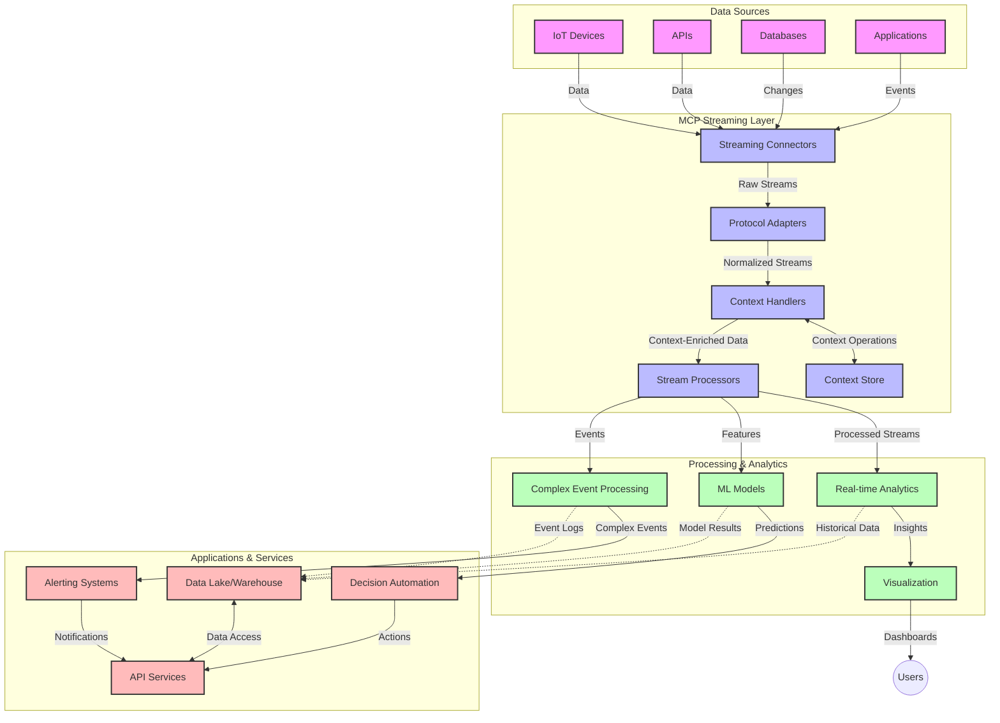

<!--
CO_OP_TRANSLATOR_METADATA:
{
  "original_hash": "b41174ac781ebf228b2043cbdfc09105",
  "translation_date": "2025-06-12T00:35:05+00:00",
  "source_file": "05-AdvancedTopics/mcp-realtimestreaming/README.md",
  "language_code": "th"
}
-->
# Model Context Protocol สำหรับการสตรีมข้อมูลแบบเรียลไทม์

## ภาพรวม

การสตรีมข้อมูลแบบเรียลไทม์กลายเป็นสิ่งจำเป็นในโลกที่ขับเคลื่อนด้วยข้อมูลในปัจจุบัน ซึ่งธุรกิจและแอปพลิเคชันต้องการเข้าถึงข้อมูลทันทีเพื่อการตัดสินใจที่รวดเร็ว Model Context Protocol (MCP) เป็นก้าวสำคัญในการเพิ่มประสิทธิภาพกระบวนการสตรีมข้อมูลแบบเรียลไทม์ ช่วยให้การประมวลผลข้อมูลมีประสิทธิภาพมากขึ้น รักษาความสมบูรณ์ของบริบท และปรับปรุงประสิทธิภาพโดยรวมของระบบ

โมดูลนี้จะสำรวจว่าการใช้ MCP เปลี่ยนแปลงการสตรีมข้อมูลแบบเรียลไทม์อย่างไร ด้วยการให้แนวทางมาตรฐานในการจัดการบริบทระหว่างโมเดล AI แพลตฟอร์มสตรีมมิ่ง และแอปพลิเคชันต่าง ๆ

## บทนำสู่การสตรีมข้อมูลแบบเรียลไทม์

การสตรีมข้อมูลแบบเรียลไทม์คือแนวคิดทางเทคโนโลยีที่ช่วยให้สามารถถ่ายโอน ประมวลผล และวิเคราะห์ข้อมูลอย่างต่อเนื่องในขณะที่ข้อมูลถูกสร้างขึ้น ทำให้ระบบสามารถตอบสนองต่อข้อมูลใหม่ได้ทันที แตกต่างจากการประมวลผลแบบแบตช์ที่ทำงานกับชุดข้อมูลที่คงที่ การสตรีมจะประมวลผลข้อมูลที่เคลื่อนที่ ส่งมอบข้อมูลเชิงลึกและการดำเนินการโดยมีความหน่วงต่ำที่สุด

### แนวคิดหลักของการสตรีมข้อมูลแบบเรียลไทม์:

- **การไหลของข้อมูลอย่างต่อเนื่อง**: ข้อมูลถูกประมวลผลในรูปแบบของสตรีมเหตุการณ์หรือบันทึกที่ไม่มีวันสิ้นสุด
- **การประมวลผลหน่วงต่ำ**: ระบบถูกออกแบบมาเพื่อลดเวลาระหว่างการสร้างข้อมูลกับการประมวลผลให้น้อยที่สุด
- **ความสามารถในการปรับขนาด**: สถาปัตยกรรมสตรีมต้องรองรับปริมาณและความเร็วของข้อมูลที่เปลี่ยนแปลงได้
- **ความทนทานต่อความผิดพลาด**: ระบบต้องมีความยืดหยุ่นต่อความล้มเหลวเพื่อให้การไหลของข้อมูลไม่ขาดตอน
- **การประมวลผลที่มีสถานะ**: การรักษาบริบทระหว่างเหตุการณ์เป็นสิ่งสำคัญสำหรับการวิเคราะห์ที่มีความหมาย

### Model Context Protocol กับการสตรีมแบบเรียลไทม์

Model Context Protocol (MCP) แก้ไขปัญหาสำคัญหลายประการในสภาพแวดล้อมการสตรีมแบบเรียลไทม์:

1. **ความต่อเนื่องของบริบท**: MCP กำหนดมาตรฐานวิธีการรักษาบริบทในส่วนประกอบสตรีมที่กระจายอยู่ ช่วยให้โมเดล AI และโหนดประมวลผลเข้าถึงบริบททางประวัติศาสตร์และสภาพแวดล้อมที่เกี่ยวข้องได้

2. **การจัดการสถานะอย่างมีประสิทธิภาพ**: ด้วยการให้กลไกที่เป็นโครงสร้างสำหรับการส่งผ่านบริบท MCP ลดภาระในการจัดการสถานะในสายงานสตรีมมิ่ง

3. **ความสามารถในการทำงานร่วมกัน**: MCP สร้างภาษากลางสำหรับการแบ่งปันบริบทระหว่างเทคโนโลยีสตรีมมิ่งและโมเดล AI ที่หลากหลาย ช่วยให้สถาปัตยกรรมมีความยืดหยุ่นและขยายตัวได้ง่ายขึ้น

4. **บริบทที่เหมาะสมกับการสตรีม**: การใช้งาน MCP สามารถจัดลำดับความสำคัญขององค์ประกอบบริบทที่สำคัญสำหรับการตัดสินใจแบบเรียลไทม์ เพื่อเพิ่มประสิทธิภาพทั้งในด้านการทำงานและความแม่นยำ

5. **การประมวลผลแบบปรับตัว**: ด้วยการจัดการบริบทที่เหมาะสมผ่าน MCP ระบบสตรีมมิ่งสามารถปรับเปลี่ยนการประมวลผลได้ตามเงื่อนไขและรูปแบบที่เปลี่ยนแปลงในข้อมูล

ในแอปพลิเคชันสมัยใหม่ตั้งแต่เครือข่ายเซ็นเซอร์ IoT ถึงแพลตฟอร์มการซื้อขายทางการเงิน การผสาน MCP กับเทคโนโลยีสตรีมมิ่งช่วยให้การประมวลผลมีความชาญฉลาดและรับรู้บริบทมากขึ้น สามารถตอบสนองต่อสถานการณ์ที่ซับซ้อนและเปลี่ยนแปลงได้อย่างเหมาะสมแบบเรียลไทม์

## วัตถุประสงค์การเรียนรู้

เมื่อจบบทเรียนนี้ คุณจะสามารถ:

- เข้าใจพื้นฐานของการสตรีมข้อมูลแบบเรียลไทม์และความท้าทายที่เกี่ยวข้อง
- อธิบายว่าการใช้ Model Context Protocol (MCP) ช่วยเพิ่มประสิทธิภาพการสตรีมข้อมูลแบบเรียลไทม์อย่างไร
- นำ MCP ไปใช้กับโซลูชันสตรีมมิ่งโดยใช้เฟรมเวิร์กยอดนิยมเช่น Kafka และ Pulsar
- ออกแบบและปรับใช้สถาปัตยกรรมสตรีมที่ทนทานต่อความผิดพลาดและมีประสิทธิภาพสูงด้วย MCP
- นำแนวคิด MCP ไปใช้กับกรณีใช้งาน IoT การซื้อขายทางการเงิน และการวิเคราะห์ข้อมูลที่ขับเคลื่อนด้วย AI
- ประเมินแนวโน้มและนวัตกรรมในอนาคตของเทคโนโลยีสตรีมมิ่งที่ใช้ MCP

### คำนิยามและความสำคัญ

การสตรีมข้อมูลแบบเรียลไทม์คือการสร้าง ประมวลผล และส่งข้อมูลอย่างต่อเนื่องโดยมีความหน่วงต่ำ แตกต่างจากการประมวลผลแบบแบตช์ที่เก็บข้อมูลแล้วประมวลผลเป็นกลุ่ม ข้อมูลสตรีมจะถูกประมวลผลทีละน้อยในขณะที่เข้ามา ช่วยให้เกิดข้อมูลเชิงลึกและการดำเนินการทันที

ลักษณะสำคัญของการสตรีมข้อมูลแบบเรียลไทม์ได้แก่:

- **ความหน่วงต่ำ**: การประมวลผลและวิเคราะห์ข้อมูลภายในเวลาไม่กี่มิลลิวินาทีถึงวินาที
- **การไหลต่อเนื่อง**: สตรีมข้อมูลที่ไม่ขาดตอนจากแหล่งข้อมูลหลากหลาย
- **การประมวลผลทันที**: วิเคราะห์ข้อมูลในขณะที่เข้ามา ไม่ใช่เป็นชุด
- **สถาปัตยกรรมที่ขับเคลื่อนด้วยเหตุการณ์**: ตอบสนองต่อเหตุการณ์เมื่อเกิดขึ้น

### ความท้าทายในการสตรีมข้อมูลแบบดั้งเดิม

แนวทางการสตรีมข้อมูลแบบดั้งเดิมเผชิญข้อจำกัดหลายประการ:

1. **การสูญเสียบริบท**: ยากที่จะรักษาบริบทในระบบที่กระจายตัว
2. **ปัญหาการปรับขนาด**: ยากที่จะขยายระบบให้รองรับข้อมูลปริมาณมากและความเร็วสูง
3. **ความซับซ้อนในการบูรณาการ**: ปัญหาในการทำงานร่วมกันระหว่างระบบต่าง ๆ
4. **การจัดการความหน่วง**: ต้องหาสมดุลระหว่างอัตราการประมวลผลกับเวลาที่ใช้
5. **ความสอดคล้องของข้อมูล**: ต้องมั่นใจว่าข้อมูลถูกต้องและครบถ้วนตลอดสตรีม

## ความเข้าใจ Model Context Protocol (MCP)

### MCP คืออะไร?

Model Context Protocol (MCP) คือโปรโตคอลการสื่อสารมาตรฐานที่ออกแบบมาเพื่ออำนวยความสะดวกในการติดต่อสื่อสารอย่างมีประสิทธิภาพระหว่างโมเดล AI และแอปพลิเคชัน ในบริบทของการสตรีมข้อมูลแบบเรียลไทม์ MCP ให้กรอบงานสำหรับ:

- การรักษาบริบทตลอดสายงานข้อมูล
- การกำหนดรูปแบบการแลกเปลี่ยนข้อมูลที่เป็นมาตรฐาน
- การเพิ่มประสิทธิภาพการส่งข้อมูลชุดใหญ่
- การเสริมสร้างการสื่อสารระหว่างโมเดลและแอปพลิเคชัน

### องค์ประกอบหลักและสถาปัตยกรรม

สถาปัตยกรรม MCP สำหรับการสตรีมแบบเรียลไทม์ประกอบด้วยส่วนสำคัญหลายส่วน:

1. **Context Handlers**: จัดการและรักษาข้อมูลบริบทตลอดสายงานสตรีม
2. **Stream Processors**: ประมวลผลสตรีมข้อมูลที่เข้ามาโดยใช้เทคนิคที่รับรู้บริบท
3. **Protocol Adapters**: แปลงระหว่างโปรโตคอลสตรีมต่าง ๆ โดยยังคงรักษาบริบทไว้
4. **Context Store**: จัดเก็บและเรียกคืนข้อมูลบริบทอย่างมีประสิทธิภาพ
5. **Streaming Connectors**: เชื่อมต่อกับแพลตฟอร์มสตรีมต่าง ๆ (Kafka, Pulsar, Kinesis ฯลฯ)



### MCP ช่วยปรับปรุงการจัดการข้อมูลแบบเรียลไทม์อย่างไร

MCP แก้ไขปัญหาการสตรีมแบบดั้งเดิมด้วย:

- **ความสมบูรณ์ของบริบท**: รักษาความสัมพันธ์ระหว่างจุดข้อมูลตลอดสายงานทั้งหมด
- **การส่งผ่านที่เหมาะสม**: ลดความซ้ำซ้อนในการแลกเปลี่ยนข้อมูลด้วยการจัดการบริบทอย่างชาญฉลาด
- **อินเทอร์เฟซมาตรฐาน**: ให้ API ที่สม่ำเสมอสำหรับส่วนประกอบสตรีม
- **ลดความหน่วง**: ลดภาระการประมวลผลด้วยการจัดการบริบทที่มีประสิทธิภาพ
- **เพิ่มความสามารถในการปรับขนาด**: รองรับการขยายตัวในแนวนอนพร้อมกับการรักษาบริบท

## การบูรณาการและการใช้งาน

ระบบสตรีมข้อมูลแบบเรียลไทม์ต้องการการออกแบบสถาปัตยกรรมและการใช้งานอย่างรอบคอบเพื่อรักษาทั้งประสิทธิภาพและความสมบูรณ์ของบริบท Model Context Protocol เสนอแนวทางมาตรฐานในการผสานโมเดล AI และเทคโนโลยีสตรีมมิ่ง ช่วยให้สายงานประมวลผลที่รับรู้บริบทมีความซับซ้อนมากขึ้น

### ภาพรวมของการบูรณาการ MCP ในสถาปัตยกรรมสตรีม

การใช้งาน MCP ในสภาพแวดล้อมสตรีมแบบเรียลไทม์ต้องพิจารณาประเด็นสำคัญหลายประการ:

1. **การซีเรียลไลซ์และการส่งผ่านบริบท**: MCP มีวิธีการที่มีประสิทธิภาพในการเข้ารหัสข้อมูลบริบทภายในแพ็กเก็ตข้อมูลสตรีม เพื่อให้บริบทสำคัญตามไปกับข้อมูลตลอดสายงานการประมวลผล รวมถึงรูปแบบการซีเรียลไลซ์ที่เป็นมาตรฐานและเหมาะสมกับการส่งผ่านสตรีม

2. **การประมวลผลสตรีมแบบมีสถานะ**: MCP ช่วยให้การประมวลผลแบบมีสถานะชาญฉลาดขึ้นโดยรักษาการแทนบริบทที่สม่ำเสมอระหว่างโหนดประมวลผล ซึ่งมีประโยชน์อย่างมากในสถาปัตยกรรมสตรีมที่กระจายตัวซึ่งการจัดการสถานะมักเป็นเรื่องท้าทาย

3. **เวลาเหตุการณ์กับเวลาในการประมวลผล**: การใช้งาน MCP ในระบบสตรีมต้องแก้ไขปัญหาการแยกแยะระหว่างเวลาที่เหตุการณ์เกิดขึ้นกับเวลาที่ถูกประมวลผล โปรโตคอลสามารถรวมบริบทเชิงเวลาเพื่อรักษาความหมายของเวลาเหตุการณ์ได้

4. **การจัดการแรงกดดันย้อนกลับ (Backpressure)**: ด้วยการกำหนดมาตรฐานการจัดการบริบท MCP ช่วยควบคุมแรงกดดันย้อนกลับในระบบสตรีม ให้ส่วนประกอบสามารถสื่อสารความสามารถในการประมวลผลและปรับการไหลของข้อมูลได้ตามเหมาะสม

5. **การจัดการหน้าต่างและการรวมข้อมูลบริบท**: MCP ช่วยให้การดำเนินการหน้าต่างที่ซับซ้อนขึ้นด้วยการให้ตัวแทนข้อมูลบริบทเชิงเวลาและความสัมพันธ์ที่มีโครงสร้าง ช่วยให้การรวมข้อมูลในสตรีมเหตุการณ์มีความหมายมากขึ้น

6. **การประมวลผลแบบ Exactly-Once**: ในระบบสตรีมที่ต้องการความหมายแบบ exactly-once MCP สามารถรวมข้อมูลเมตาการประมวลผลเพื่อช่วยติดตามและตรวจสอบสถานะการประมวลผลในส่วนประกอบที่กระจายตัว

การใช้งาน MCP กับเทคโนโลยีสตรีมต่าง ๆ สร้างแนวทางที่เป็นเอกภาพในการจัดการบริบท ลดความจำเป็นในการเขียนโค้ดบูรณาการแบบกำหนดเอง และเพิ่มความสามารถของระบบในการรักษาบริบทที่มีความหมายในขณะที่ข้อมูลไหลผ่านสายงาน

### MCP ในเฟรมเวิร์กสตรีมข้อมูลต่าง ๆ

ตัวอย่างเหล่านี้เป็นไปตามข้อกำหนด MCP ปัจจุบันซึ่งเน้นโปรโตคอล JSON-RPC พร้อมกลไกการส่งผ่านที่แตกต่างกัน โค้ดแสดงวิธีการสร้างทรานสปอร์ตแบบกำหนดเองที่ผสานแพลตฟอร์มสตรีมอย่าง Kafka และ Pulsar พร้อมกับรักษาความเข้ากันได้เต็มรูปแบบกับโปรโตคอล MCP

ตัวอย่างถูกออกแบบมาเพื่อแสดงให้เห็นว่าแพลตฟอร์มสตรีมสามารถรวมกับ MCP เพื่อให้การประมวลผลข้อมูลแบบเรียลไทม์ที่รักษาความรับรู้บริบทซึ่งเป็นหัวใจสำคัญของ MCP ได้อย่างไร วิธีนี้ทำให้ตัวอย่างโค้ดสะท้อนสถานะปัจจุบันของข้อกำหนด MCP ณ เดือนมิถุนายน 2025

MCP สามารถผสานกับเฟรมเวิร์กสตรีมยอดนิยมได้แก่:

#### การผสาน Apache Kafka

```python
import asyncio
import json
from typing import Dict, Any, Optional
from confluent_kafka import Consumer, Producer, KafkaError
from mcp.client import Client, ClientCapabilities
from mcp.core.message import JsonRpcMessage
from mcp.core.transports import Transport

# Custom transport class to bridge MCP with Kafka
class KafkaMCPTransport(Transport):
    def __init__(self, bootstrap_servers: str, input_topic: str, output_topic: str):
        self.bootstrap_servers = bootstrap_servers
        self.input_topic = input_topic
        self.output_topic = output_topic
        self.producer = Producer({'bootstrap.servers': bootstrap_servers})
        self.consumer = Consumer({
            'bootstrap.servers': bootstrap_servers,
            'group.id': 'mcp-client-group',
            'auto.offset.reset': 'earliest'
        })
        self.message_queue = asyncio.Queue()
        self.running = False
        self.consumer_task = None
        
    async def connect(self):
        """Connect to Kafka and start consuming messages"""
        self.consumer.subscribe([self.input_topic])
        self.running = True
        self.consumer_task = asyncio.create_task(self._consume_messages())
        return self
        
    async def _consume_messages(self):
        """Background task to consume messages from Kafka and queue them for processing"""
        while self.running:
            try:
                msg = self.consumer.poll(1.0)
                if msg is None:
                    await asyncio.sleep(0.1)
                    continue
                
                if msg.error():
                    if msg.error().code() == KafkaError._PARTITION_EOF:
                        continue
                    print(f"Consumer error: {msg.error()}")
                    continue
                
                # Parse the message value as JSON-RPC
                try:
                    message_str = msg.value().decode('utf-8')
                    message_data = json.loads(message_str)
                    mcp_message = JsonRpcMessage.from_dict(message_data)
                    await self.message_queue.put(mcp_message)
                except Exception as e:
                    print(f"Error parsing message: {e}")
            except Exception as e:
                print(f"Error in consumer loop: {e}")
                await asyncio.sleep(1)
    
    async def read(self) -> Optional[JsonRpcMessage]:
        """Read the next message from the queue"""
        try:
            message = await self.message_queue.get()
            return message
        except Exception as e:
            print(f"Error reading message: {e}")
            return None
    
    async def write(self, message: JsonRpcMessage) -> None:
        """Write a message to the Kafka output topic"""
        try:
            message_json = json.dumps(message.to_dict())
            self.producer.produce(
                self.output_topic,
                message_json.encode('utf-8'),
                callback=self._delivery_report
            )
            self.producer.poll(0)  # Trigger callbacks
        except Exception as e:
            print(f"Error writing message: {e}")
    
    def _delivery_report(self, err, msg):
        """Kafka producer delivery callback"""
        if err is not None:
            print(f'Message delivery failed: {err}')
        else:
            print(f'Message delivered to {msg.topic()} [{msg.partition()}]')
    
    async def close(self) -> None:
        """Close the transport"""
        self.running = False
        if self.consumer_task:
            self.consumer_task.cancel()
            try:
                await self.consumer_task
            except asyncio.CancelledError:
                pass
        self.consumer.close()
        self.producer.flush()

# Example usage of the Kafka MCP transport
async def kafka_mcp_example():
    # Create MCP client with Kafka transport
    client = Client(
        {"name": "kafka-mcp-client", "version": "1.0.0"},
        ClientCapabilities({})
    )
    
    # Create and connect the Kafka transport
    transport = KafkaMCPTransport(
        bootstrap_servers="localhost:9092",
        input_topic="mcp-responses",
        output_topic="mcp-requests"
    )
    
    await client.connect(transport)
    
    try:
        # Initialize the MCP session
        await client.initialize()
        
        # Example of executing a tool via MCP
        response = await client.execute_tool(
            "process_data",
            {
                "data": "sample data",
                "metadata": {
                    "source": "sensor-1",
                    "timestamp": "2025-06-12T10:30:00Z"
                }
            }
        )
        
        print(f"Tool execution response: {response}")
        
        # Clean shutdown
        await client.shutdown()
    finally:
        await transport.close()

# Run the example
if __name__ == "__main__":
    asyncio.run(kafka_mcp_example())
```

#### การใช้งาน Apache Pulsar

```python
import asyncio
import json
import pulsar
from typing import Dict, Any, Optional
from mcp.core.message import JsonRpcMessage
from mcp.core.transports import Transport
from mcp.server import Server, ServerOptions
from mcp.server.tools import Tool, ToolExecutionContext, ToolMetadata

# Create a custom MCP transport that uses Pulsar
class PulsarMCPTransport(Transport):
    def __init__(self, service_url: str, request_topic: str, response_topic: str):
        self.service_url = service_url
        self.request_topic = request_topic
        self.response_topic = response_topic
        self.client = pulsar.Client(service_url)
        self.producer = self.client.create_producer(response_topic)
        self.consumer = self.client.subscribe(
            request_topic,
            "mcp-server-subscription",
            consumer_type=pulsar.ConsumerType.Shared
        )
        self.message_queue = asyncio.Queue()
        self.running = False
        self.consumer_task = None
    
    async def connect(self):
        """Connect to Pulsar and start consuming messages"""
        self.running = True
        self.consumer_task = asyncio.create_task(self._consume_messages())
        return self
    
    async def _consume_messages(self):
        """Background task to consume messages from Pulsar and queue them for processing"""
        while self.running:
            try:
                # Non-blocking receive with timeout
                msg = self.consumer.receive(timeout_millis=500)
                
                # Process the message
                try:
                    message_str = msg.data().decode('utf-8')
                    message_data = json.loads(message_str)
                    mcp_message = JsonRpcMessage.from_dict(message_data)
                    await self.message_queue.put(mcp_message)
                    
                    # Acknowledge the message
                    self.consumer.acknowledge(msg)
                except Exception as e:
                    print(f"Error processing message: {e}")
                    # Negative acknowledge if there was an error
                    self.consumer.negative_acknowledge(msg)
            except Exception as e:
                # Handle timeout or other exceptions
                await asyncio.sleep(0.1)
    
    async def read(self) -> Optional[JsonRpcMessage]:
        """Read the next message from the queue"""
        try:
            message = await self.message_queue.get()
            return message
        except Exception as e:
            print(f"Error reading message: {e}")
            return None
    
    async def write(self, message: JsonRpcMessage) -> None:
        """Write a message to the Pulsar output topic"""
        try:
            message_json = json.dumps(message.to_dict())
            self.producer.send(message_json.encode('utf-8'))
        except Exception as e:
            print(f"Error writing message: {e}")
    
    async def close(self) -> None:
        """Close the transport"""
        self.running = False
        if self.consumer_task:
            self.consumer_task.cancel()
            try:
                await self.consumer_task
            except asyncio.CancelledError:
                pass
        self.consumer.close()
        self.producer.close()
        self.client.close()

# Define a sample MCP tool that processes streaming data
@Tool(
    name="process_streaming_data",
    description="Process streaming data with context preservation",
    metadata=ToolMetadata(
        required_capabilities=["streaming"]
    )
)
async def process_streaming_data(
    ctx: ToolExecutionContext,
    data: str,
    source: str,
    priority: str = "medium"
) -> Dict[str, Any]:
    """
    Process streaming data while preserving context
    
    Args:
        ctx: Tool execution context
        data: The data to process
        source: The source of the data
        priority: Priority level (low, medium, high)
        
    Returns:
        Dict containing processed results and context information
    """
    # Example processing that leverages MCP context
    print(f"Processing data from {source} with priority {priority}")
    
    # Access conversation context from MCP
    conversation_id = ctx.conversation_id if hasattr(ctx, 'conversation_id') else "unknown"
    
    # Return results with enhanced context
    return {
        "processed_data": f"Processed: {data}",
        "context": {
            "conversation_id": conversation_id,
            "source": source,
            "priority": priority,
            "processing_timestamp": ctx.get_current_time_iso()
        }
    }

# Example MCP server implementation using Pulsar transport
async def run_mcp_server_with_pulsar():
    # Create MCP server
    server = Server(
        {"name": "pulsar-mcp-server", "version": "1.0.0"},
        ServerOptions(
            capabilities={"streaming": True}
        )
    )
    
    # Register our tool
    server.register_tool(process_streaming_data)
    
    # Create and connect Pulsar transport
    transport = PulsarMCPTransport(
        service_url="pulsar://localhost:6650",
        request_topic="mcp-requests",
        response_topic="mcp-responses"
    )
    
    try:
        # Start the server with the Pulsar transport
        await server.run(transport)
    finally:
        await transport.close()

# Run the server
if __name__ == "__main__":
    asyncio.run(run_mcp_server_with_pulsar())
```

### แนวทางปฏิบัติที่ดีที่สุดสำหรับการปรับใช้

เมื่อใช้งาน MCP สำหรับการสตรีมแบบเรียลไทม์:

1. **ออกแบบเพื่อความทนทานต่อความผิดพลาด**:
   - ดำเนินการจัดการข้อผิดพลาดอย่างเหมาะสม
   - ใช้ dead-letter queues สำหรับข้อความที่ล้มเหลว
   - ออกแบบโปรเซสเซอร์ให้ทำงานซ้ำได้โดยไม่ส่งผลข้างเคียง

2. **ปรับแต่งเพื่อประสิทธิภาพ**:
   - กำหนดขนาดบัฟเฟอร์ที่เหมาะสม
   - ใช้การประมวลผลเป็นกลุ่มเมื่อเหมาะสม
   - ดำเนินกลไกจัดการแรงกดดันย้อนกลับ

3. **ตรวจสอบและสังเกตการณ์**:
   - ติดตามเมตริกการประมวลผลสตรีม
   - ตรวจสอบการแพร่กระจายบริบท
   - ตั้งค่าการแจ้งเตือนสำหรับความผิดปกติ

4. **รักษาความปลอดภัยของสตรีม**:
   - ใช้การเข้ารหัสข้อมูลที่ละเอียดอ่อน
   - ใช้การยืนยันตัวตนและการอนุญาต
   - ใช้มาตรการควบคุมการเข้าถึงที่เหมาะสม

### MCP ใน IoT และ Edge Computing

MCP ช่วยเพิ่มประสิทธิภาพการสตรีม IoT โดย:

- รักษาบริบทของอุปกรณ์ตลอดสายงานประมวลผล
- ช่วยให้การสตรีมข้อมูลจาก edge สู่ cloud มีประสิทธิภาพ
- รองรับการวิเคราะห์ข้อมูลแบบเรียลไทม์บนสตรีม IoT
- อำนวยความสะดวกในการสื่อสารระหว่างอุปกรณ์โดยมีบริบท

ตัวอย่าง: เครือข่ายเซ็นเซอร์ในเมืองอัจฉริยะ  
```
Sensors → Edge Gateways → MCP Stream Processors → Real-time Analytics → Automated Responses
```

### บทบาทในธุรกรรมทางการเงินและการซื้อขายความถี่สูง

MCP ให้ข้อได้เปรียบสำคัญสำหรับการสตรีมข้อมูลทางการเงิน:

- การประมวลผลที่มีความหน่วงต่ำมากสำหรับการตัดสินใจซื้อขาย
- รักษาบริบทของธุรกรรมตลอดกระบวนการ
- รองรับการประมวลผลเหตุการณ์ที่ซับซ้อนโดยมีความรับรู้บริบท
- รับประกันความสอดคล้องของข้อมูลในระบบซื้อขายที่กระจายตัว

### การเสริมสร้างการวิเคราะห์ข้อมูลที่ขับเคลื่อนด้วย AI

MCP สร้างโอกาสใหม่สำหรับการวิเคราะห์สตรีม:

- การฝึกสอนและการสรุปผลโมเดลแบบเรียลไทม์
- การเรียนรู้อย่างต่อเนื่องจากข้อมูลสตรีม
- การสกัดคุณลักษณะที่รับรู้บริบท
- สายงานสรุปผลหลายโมเดลที่รักษาบริบท

## แนวโน้มและนวัตกรรมในอนาคต

### การพัฒนา MCP ในสภาพแวดล้อมแบบเรียลไทม์

ในอนาคต เราคาดว่า MCP จะพัฒนาเพื่อตอบสนอง:

- **การผสานควอนตัมคอมพิวติ

**ข้อจำกัดความรับผิดชอบ**:  
เอกสารนี้ได้รับการแปลโดยใช้บริการแปลภาษาด้วย AI [Co-op Translator](https://github.com/Azure/co-op-translator) แม้ว่าเราจะพยายามให้มีความถูกต้อง โปรดทราบว่าการแปลโดยอัตโนมัติอาจมีข้อผิดพลาดหรือความไม่ถูกต้อง เอกสารต้นฉบับในภาษาต้นทางควรถูกพิจารณาเป็นแหล่งข้อมูลที่เชื่อถือได้ สำหรับข้อมูลที่สำคัญ ขอแนะนำให้ใช้การแปลโดยมนุษย์มืออาชีพ เราจะไม่รับผิดชอบต่อความเข้าใจผิดหรือการตีความที่ผิดพลาดใด ๆ ที่เกิดจากการใช้การแปลนี้