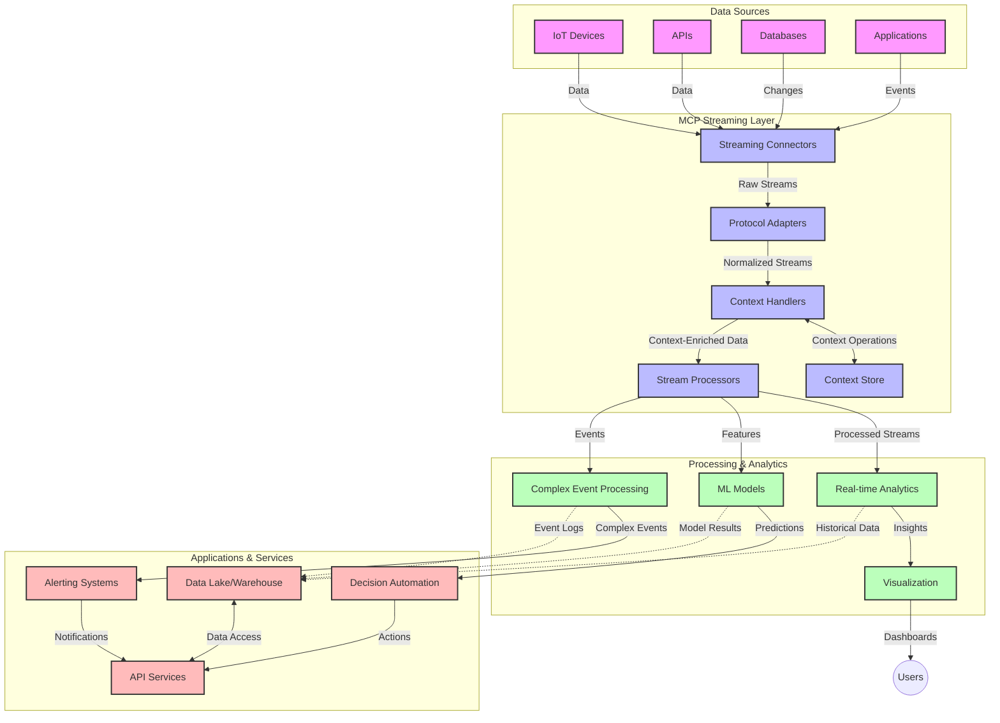

<!--
CO_OP_TRANSLATOR_METADATA:
{
  "original_hash": "195f7287638b77a549acadd96c8f981c",
  "translation_date": "2025-06-12T23:58:25+00:00",
  "source_file": "05-AdvancedTopics/mcp-realtimestreaming/README.md",
  "language_code": "th"
}
-->
# Model Context Protocol สำหรับการสตรีมข้อมูลแบบเรียลไทม์

## ภาพรวม

การสตรีมข้อมูลแบบเรียลไทม์กลายเป็นสิ่งจำเป็นในโลกที่ขับเคลื่อนด้วยข้อมูลในปัจจุบัน ซึ่งธุรกิจและแอปพลิเคชันต้องการเข้าถึงข้อมูลทันทีเพื่อการตัดสินใจที่รวดเร็ว Model Context Protocol (MCP) เป็นความก้าวหน้าที่สำคัญในการเพิ่มประสิทธิภาพกระบวนการสตรีมแบบเรียลไทม์เหล่านี้ ช่วยปรับปรุงประสิทธิภาพการประมวลผลข้อมูล รักษาความสมบูรณ์ของบริบท และยกระดับประสิทธิภาพโดยรวมของระบบ

โมดูลนี้จะอธิบายว่า MCP เปลี่ยนแปลงการสตรีมข้อมูลแบบเรียลไทม์อย่างไรโดยการให้แนวทางมาตรฐานในการจัดการบริบทระหว่างโมเดล AI แพลตฟอร์มสตรีมมิ่ง และแอปพลิเคชัน

## บทนำสู่การสตรีมข้อมูลแบบเรียลไทม์

การสตรีมข้อมูลแบบเรียลไทม์คือรูปแบบเทคโนโลยีที่ช่วยให้สามารถส่งต่อ ประมวลผล และวิเคราะห์ข้อมูลอย่างต่อเนื่องขณะที่ข้อมูลถูกสร้างขึ้น ทำให้ระบบสามารถตอบสนองข้อมูลใหม่ได้ทันที ต่างจากการประมวลผลแบบแบตช์ที่ทำงานกับชุดข้อมูลแบบคงที่ การสตรีมจะประมวลผลข้อมูลที่เคลื่อนไหว ส่งมอบข้อมูลเชิงลึกและการกระทำโดยมีความหน่วงต่ำที่สุด

### แนวคิดหลักของการสตรีมข้อมูลแบบเรียลไทม์:

- **การไหลของข้อมูลอย่างต่อเนื่อง**: ข้อมูลถูกประมวลผลเป็นสตรีมของเหตุการณ์หรือบันทึกที่ไม่สิ้นสุด
- **การประมวลผลหน่วงต่ำ**: ระบบถูกออกแบบเพื่อลดเวลาระหว่างการสร้างข้อมูลและการประมวลผล
- **ความสามารถในการปรับขนาด**: สถาปัตยกรรมสตรีมต้องรองรับปริมาณและความเร็วของข้อมูลที่เปลี่ยนแปลงได้
- **ความทนทานต่อความผิดพลาด**: ระบบต้องมีความยืดหยุ่นต่อความล้มเหลวเพื่อให้การไหลของข้อมูลไม่สะดุด
- **การประมวลผลที่มีสถานะ**: การรักษาบริบทข้ามเหตุการณ์เป็นสิ่งสำคัญสำหรับการวิเคราะห์ที่มีความหมาย

### Model Context Protocol และการสตรีมแบบเรียลไทม์

Model Context Protocol (MCP) แก้ไขปัญหาสำคัญหลายประการในสภาพแวดล้อมการสตรีมแบบเรียลไทม์:

1. **ความต่อเนื่องของบริบท**: MCP มาตรฐานวิธีการรักษาบริบทในส่วนประกอบสตรีมที่กระจายตัว ทำให้โมเดล AI และโหนดประมวลผลเข้าถึงบริบททางประวัติศาสตร์และสภาพแวดล้อมที่เกี่ยวข้องได้

2. **การจัดการสถานะที่มีประสิทธิภาพ**: ด้วยการจัดเตรียมกลไกโครงสร้างสำหรับการส่งผ่านบริบท MCP ลดภาระการจัดการสถานะในสายการสตรีม

3. **ความสามารถในการทำงานร่วมกัน**: MCP สร้างภาษากลางสำหรับการแชร์บริบทระหว่างเทคโนโลยีสตรีมที่หลากหลายและโมเดล AI ช่วยให้สถาปัตยกรรมยืดหยุ่นและขยายตัวได้มากขึ้น

4. **บริบทที่เหมาะสำหรับการสตรีม**: การใช้งาน MCP สามารถจัดลำดับความสำคัญขององค์ประกอบบริบทที่สำคัญสำหรับการตัดสินใจแบบเรียลไทม์ ช่วยเพิ่มประสิทธิภาพทั้งในด้านประสิทธิผลและความแม่นยำ

5. **การประมวลผลแบบปรับตัว**: ด้วยการจัดการบริบทที่เหมาะสมผ่าน MCP ระบบสตรีมสามารถปรับการประมวลผลแบบไดนามิกตามสภาพแวดล้อมและรูปแบบข้อมูลที่เปลี่ยนแปลงได้

ในแอปพลิเคชันสมัยใหม่ ตั้งแต่เครือข่ายเซ็นเซอร์ IoT ถึงแพลตฟอร์มการซื้อขายทางการเงิน การผสาน MCP กับเทคโนโลยีสตรีมมิ่งช่วยให้เกิดการประมวลผลที่ชาญฉลาดและตระหนักบริบท ซึ่งตอบสนองสถานการณ์ที่ซับซ้อนและเปลี่ยนแปลงได้อย่างเหมาะสมแบบเรียลไทม์

## วัตถุประสงค์การเรียนรู้

เมื่อจบบทเรียนนี้ คุณจะสามารถ:

- เข้าใจพื้นฐานของการสตรีมข้อมูลแบบเรียลไทม์และความท้าทายต่างๆ
- อธิบายว่า Model Context Protocol (MCP) ช่วยเพิ่มประสิทธิภาพการสตรีมข้อมูลแบบเรียลไทม์อย่างไร
- นำ MCP ไปใช้กับโซลูชันสตรีมมิ่งโดยใช้เฟรมเวิร์กยอดนิยมอย่าง Kafka และ Pulsar
- ออกแบบและปรับใช้สถาปัตยกรรมสตรีมที่ทนทานต่อความผิดพลาดและมีประสิทธิภาพสูงด้วย MCP
- ประยุกต์ใช้แนวคิด MCP กับกรณีใช้งาน IoT การซื้อขายทางการเงิน และการวิเคราะห์ข้อมูลที่ขับเคลื่อนด้วย AI
- ประเมินแนวโน้มและนวัตกรรมในอนาคตของเทคโนโลยีสตรีมที่ใช้ MCP

### คำนิยามและความสำคัญ

การสตรีมข้อมูลแบบเรียลไทม์เกี่ยวข้องกับการสร้าง ประมวลผล และส่งมอบข้อมูลอย่างต่อเนื่องโดยมีความหน่วงต่ำ ต่างจากการประมวลผลแบบแบตช์ที่เก็บและประมวลผลข้อมูลเป็นกลุ่ม ข้อมูลสตรีมจะถูกประมวลผลทีละน้อยขณะที่ข้อมูลเข้ามา ทำให้ได้ข้อมูลเชิงลึกและการตอบสนองทันที

ลักษณะสำคัญของการสตรีมข้อมูลแบบเรียลไทม์ได้แก่:

- **ความหน่วงต่ำ**: การประมวลผลและวิเคราะห์ข้อมูลภายในเวลาไม่กี่มิลลิวินาทีถึงวินาที
- **การไหลอย่างต่อเนื่อง**: สตรีมข้อมูลที่ไม่หยุดจากแหล่งข้อมูลต่างๆ
- **การประมวลผลทันที**: วิเคราะห์ข้อมูลขณะที่ข้อมูลเข้ามาแทนที่จะรอประมวลผลเป็นกลุ่ม
- **สถาปัตยกรรมขับเคลื่อนด้วยเหตุการณ์**: ตอบสนองต่อเหตุการณ์ทันทีที่เกิดขึ้น

### ความท้าทายในระบบสตรีมข้อมูลแบบดั้งเดิม

แนวทางการสตรีมข้อมูลแบบดั้งเดิมเผชิญกับข้อจำกัดหลายประการ:

1. **การสูญเสียบริบท**: ยากที่จะรักษาบริบทในระบบที่กระจายตัว
2. **ปัญหาการปรับขนาด**: ท้าทายในการรองรับข้อมูลปริมาณมากและความเร็วสูง
3. **ความซับซ้อนในการรวมระบบ**: ปัญหาการทำงานร่วมกันระหว่างระบบที่แตกต่างกัน
4. **การจัดการความหน่วง**: ต้องบาลานซ์ระหว่างปริมาณข้อมูลและเวลาการประมวลผล
5. **ความสอดคล้องของข้อมูล**: รับประกันความถูกต้องและครบถ้วนของข้อมูลในสตรีม

## ทำความเข้าใจ Model Context Protocol (MCP)

### MCP คืออะไร?

Model Context Protocol (MCP) คือโปรโตคอลการสื่อสารมาตรฐานที่ออกแบบมาเพื่ออำนวยความสะดวกในการติดต่อสื่อสารอย่างมีประสิทธิภาพระหว่างโมเดล AI และแอปพลิเคชัน ในบริบทของการสตรีมข้อมูลแบบเรียลไทม์ MCP ให้กรอบการทำงานสำหรับ:

- การรักษาบริบทตลอดสายการประมวลผลข้อมูล
- การมาตรฐานรูปแบบการแลกเปลี่ยนข้อมูล
- การเพิ่มประสิทธิภาพการส่งข้อมูลชุดใหญ่
- การปรับปรุงการสื่อสารระหว่างโมเดลกับโมเดลและโมเดลกับแอปพลิเคชัน

### ส่วนประกอบหลักและสถาปัตยกรรม

สถาปัตยกรรม MCP สำหรับการสตรีมแบบเรียลไทม์ประกอบด้วยส่วนสำคัญหลายส่วน:

1. **Context Handlers**: จัดการและรักษาข้อมูลบริบทตลอดสายการสตรีม
2. **Stream Processors**: ประมวลผลสตรีมข้อมูลขาเข้าโดยใช้เทคนิคที่ตระหนักถึงบริบท
3. **Protocol Adapters**: แปลงระหว่างโปรโตคอลสตรีมที่แตกต่างกันโดยรักษาบริบทไว้
4. **Context Store**: จัดเก็บและดึงข้อมูลบริบทอย่างมีประสิทธิภาพ
5. **Streaming Connectors**: เชื่อมต่อกับแพลตฟอร์มสตรีมต่างๆ (Kafka, Pulsar, Kinesis เป็นต้น)



### MCP ช่วยปรับปรุงการจัดการข้อมูลแบบเรียลไทม์อย่างไร

MCP แก้ไขปัญหาการสตรีมแบบดั้งเดิมด้วย:

- **ความสมบูรณ์ของบริบท**: รักษาความสัมพันธ์ระหว่างจุดข้อมูลตลอดสายการประมวลผล
- **การส่งผ่านที่เหมาะสม**: ลดความซ้ำซ้อนในการแลกเปลี่ยนข้อมูลด้วยการจัดการบริบทอย่างชาญฉลาด
- **อินเทอร์เฟซมาตรฐาน**: ให้ API ที่สอดคล้องกันสำหรับส่วนประกอบสตรีม
- **ลดความหน่วง**: ลดภาระการประมวลผลด้วยการจัดการบริบทอย่างมีประสิทธิภาพ
- **เพิ่มความสามารถในการปรับขนาด**: รองรับการขยายระบบในแนวนอนพร้อมรักษาบริบท

## การบูรณาการและการใช้งาน

ระบบสตรีมข้อมูลแบบเรียลไทม์ต้องการการออกแบบสถาปัตยกรรมและการใช้งานอย่างรอบคอบเพื่อรักษาทั้งประสิทธิภาพและความสมบูรณ์ของบริบท Model Context Protocol เสนอแนวทางมาตรฐานสำหรับการผสานโมเดล AI และเทคโนโลยีสตรีม ทำให้ได้สายการประมวลผลที่ซับซ้อนและตระหนักถึงบริบทมากขึ้น

### ภาพรวมการบูรณาการ MCP ในสถาปัตยกรรมสตรีม

การนำ MCP ไปใช้ในสภาพแวดล้อมสตรีมแบบเรียลไทม์ต้องพิจารณาประเด็นสำคัญหลายอย่าง:

1. **การซีเรียลไลซ์และการขนส่งบริบท**: MCP ให้กลไกที่มีประสิทธิภาพสำหรับการเข้ารหัสข้อมูลบริบทภายในแพ็กเก็ตข้อมูลสตรีม เพื่อให้บริบทสำคัญติดตามข้อมูลตลอดสายการประมวลผล รวมถึงรูปแบบการซีเรียลไลซ์ที่ได้มาตรฐานและเหมาะสำหรับการขนส่งสตรีม

2. **การประมวลผลสตรีมแบบมีสถานะ**: MCP ช่วยให้การประมวลผลที่มีสถานะชาญฉลาดขึ้นโดยรักษาการแสดงบริบทที่สอดคล้องกันในโหนดประมวลผล ซึ่งสำคัญอย่างยิ่งในสถาปัตยกรรมสตรีมที่กระจายตัวซึ่งการจัดการสถานะเป็นเรื่องท้าทาย

3. **เวลาเหตุการณ์กับเวลาประมวลผล**: การใช้งาน MCP ในระบบสตรีมต้องจัดการกับความท้าทายทั่วไปในการแยกแยะระหว่างเวลาที่เหตุการณ์เกิดขึ้นกับเวลาที่ถูกประมวลผล โปรโตคอลสามารถรวมบริบทเชิงเวลาที่รักษาความหมายของเวลาเหตุการณ์

4. **การจัดการแรงดันย้อนกลับ (Backpressure)**: ด้วยการมาตรฐานการจัดการบริบท MCP ช่วยจัดการแรงดันย้อนกลับในระบบสตรีม ให้ส่วนประกอบสื่อสารความสามารถในการประมวลผลและปรับการไหลข้อมูลตามนั้น

5. **การจัดหน้าต่างบริบทและการรวบรวมข้อมูล**: MCP ช่วยให้การดำเนินการจัดหน้าต่างที่ซับซ้อนขึ้นโดยให้การแสดงบริบทเชิงเวลและความสัมพันธ์ที่มีโครงสร้าง ช่วยให้การรวบรวมข้อมูลข้ามสตรีมเหตุการณ์มีความหมายมากขึ้น

6. **การประมวลผลแบบ Exactly-Once**: ในระบบสตรีมที่ต้องการความหมายแบบ exactly-once MCP สามารถรวมเมตาดาต้าการประมวลผลเพื่อช่วยติดตามและตรวจสอบสถานะการประมวลผลในส่วนประกอบที่กระจายตัว

การนำ MCP ไปใช้กับเทคโนโลยีสตรีมต่างๆ สร้างแนวทางที่เป็นหนึ่งเดียวในการจัดการบริบท ลดความจำเป็นในการเขียนโค้ดบูรณาการเฉพาะทาง ในขณะเดียวกันก็เพิ่มความสามารถของระบบในการรักษาบริบทที่มีความหมายเมื่อข้อมูลไหลผ่านสายการประมวลผล

### MCP ในเฟรมเวิร์กสตรีมข้อมูลต่างๆ

ตัวอย่างเหล่านี้เป็นไปตามสเปค MCP ปัจจุบันที่เน้นโปรโตคอล JSON-RPC พร้อมกลไกขนส่งที่แตกต่างกัน โค้ดแสดงให้เห็นวิธีการสร้างการขนส่งแบบกำหนดเองที่รวมแพลตฟอร์มสตรีมอย่าง Kafka และ Pulsar พร้อมรักษาความเข้ากันได้เต็มรูปแบบกับโปรโตคอล MCP

ตัวอย่างเหล่านี้ออกแบบมาเพื่อแสดงวิธีการรวมแพลตฟอร์มสตรีมกับ MCP เพื่อให้สามารถประมวลผลข้อมูลแบบเรียลไทม์พร้อมกับรักษาความตระหนักถึงบริบทซึ่งเป็นหัวใจสำคัญของ MCP วิธีนี้ทำให้ตัวอย่างโค้ดสะท้อนสถานะปัจจุบันของสเปค MCP ณ เดือนมิถุนายน 2025 อย่างแม่นยำ

MCP สามารถรวมกับเฟรมเวิร์กสตรีมยอดนิยมได้แก่:

#### การบูรณาการ Apache Kafka

```python
import asyncio
import json
from typing import Dict, Any, Optional
from confluent_kafka import Consumer, Producer, KafkaError
from mcp.client import Client, ClientCapabilities
from mcp.core.message import JsonRpcMessage
from mcp.core.transports import Transport

# Custom transport class to bridge MCP with Kafka
class KafkaMCPTransport(Transport):
    def __init__(self, bootstrap_servers: str, input_topic: str, output_topic: str):
        self.bootstrap_servers = bootstrap_servers
        self.input_topic = input_topic
        self.output_topic = output_topic
        self.producer = Producer({'bootstrap.servers': bootstrap_servers})
        self.consumer = Consumer({
            'bootstrap.servers': bootstrap_servers,
            'group.id': 'mcp-client-group',
            'auto.offset.reset': 'earliest'
        })
        self.message_queue = asyncio.Queue()
        self.running = False
        self.consumer_task = None
        
    async def connect(self):
        """Connect to Kafka and start consuming messages"""
        self.consumer.subscribe([self.input_topic])
        self.running = True
        self.consumer_task = asyncio.create_task(self._consume_messages())
        return self
        
    async def _consume_messages(self):
        """Background task to consume messages from Kafka and queue them for processing"""
        while self.running:
            try:
                msg = self.consumer.poll(1.0)
                if msg is None:
                    await asyncio.sleep(0.1)
                    continue
                
                if msg.error():
                    if msg.error().code() == KafkaError._PARTITION_EOF:
                        continue
                    print(f"Consumer error: {msg.error()}")
                    continue
                
                # Parse the message value as JSON-RPC
                try:
                    message_str = msg.value().decode('utf-8')
                    message_data = json.loads(message_str)
                    mcp_message = JsonRpcMessage.from_dict(message_data)
                    await self.message_queue.put(mcp_message)
                except Exception as e:
                    print(f"Error parsing message: {e}")
            except Exception as e:
                print(f"Error in consumer loop: {e}")
                await asyncio.sleep(1)
    
    async def read(self) -> Optional[JsonRpcMessage]:
        """Read the next message from the queue"""
        try:
            message = await self.message_queue.get()
            return message
        except Exception as e:
            print(f"Error reading message: {e}")
            return None
    
    async def write(self, message: JsonRpcMessage) -> None:
        """Write a message to the Kafka output topic"""
        try:
            message_json = json.dumps(message.to_dict())
            self.producer.produce(
                self.output_topic,
                message_json.encode('utf-8'),
                callback=self._delivery_report
            )
            self.producer.poll(0)  # Trigger callbacks
        except Exception as e:
            print(f"Error writing message: {e}")
    
    def _delivery_report(self, err, msg):
        """Kafka producer delivery callback"""
        if err is not None:
            print(f'Message delivery failed: {err}')
        else:
            print(f'Message delivered to {msg.topic()} [{msg.partition()}]')
    
    async def close(self) -> None:
        """Close the transport"""
        self.running = False
        if self.consumer_task:
            self.consumer_task.cancel()
            try:
                await self.consumer_task
            except asyncio.CancelledError:
                pass
        self.consumer.close()
        self.producer.flush()

# Example usage of the Kafka MCP transport
async def kafka_mcp_example():
    # Create MCP client with Kafka transport
    client = Client(
        {"name": "kafka-mcp-client", "version": "1.0.0"},
        ClientCapabilities({})
    )
    
    # Create and connect the Kafka transport
    transport = KafkaMCPTransport(
        bootstrap_servers="localhost:9092",
        input_topic="mcp-responses",
        output_topic="mcp-requests"
    )
    
    await client.connect(transport)
    
    try:
        # Initialize the MCP session
        await client.initialize()
        
        # Example of executing a tool via MCP
        response = await client.execute_tool(
            "process_data",
            {
                "data": "sample data",
                "metadata": {
                    "source": "sensor-1",
                    "timestamp": "2025-06-12T10:30:00Z"
                }
            }
        )
        
        print(f"Tool execution response: {response}")
        
        # Clean shutdown
        await client.shutdown()
    finally:
        await transport.close()

# Run the example
if __name__ == "__main__":
    asyncio.run(kafka_mcp_example())
```

#### การใช้งาน Apache Pulsar

```python
import asyncio
import json
import pulsar
from typing import Dict, Any, Optional
from mcp.core.message import JsonRpcMessage
from mcp.core.transports import Transport
from mcp.server import Server, ServerOptions
from mcp.server.tools import Tool, ToolExecutionContext, ToolMetadata

# Create a custom MCP transport that uses Pulsar
class PulsarMCPTransport(Transport):
    def __init__(self, service_url: str, request_topic: str, response_topic: str):
        self.service_url = service_url
        self.request_topic = request_topic
        self.response_topic = response_topic
        self.client = pulsar.Client(service_url)
        self.producer = self.client.create_producer(response_topic)
        self.consumer = self.client.subscribe(
            request_topic,
            "mcp-server-subscription",
            consumer_type=pulsar.ConsumerType.Shared
        )
        self.message_queue = asyncio.Queue()
        self.running = False
        self.consumer_task = None
    
    async def connect(self):
        """Connect to Pulsar and start consuming messages"""
        self.running = True
        self.consumer_task = asyncio.create_task(self._consume_messages())
        return self
    
    async def _consume_messages(self):
        """Background task to consume messages from Pulsar and queue them for processing"""
        while self.running:
            try:
                # Non-blocking receive with timeout
                msg = self.consumer.receive(timeout_millis=500)
                
                # Process the message
                try:
                    message_str = msg.data().decode('utf-8')
                    message_data = json.loads(message_str)
                    mcp_message = JsonRpcMessage.from_dict(message_data)
                    await self.message_queue.put(mcp_message)
                    
                    # Acknowledge the message
                    self.consumer.acknowledge(msg)
                except Exception as e:
                    print(f"Error processing message: {e}")
                    # Negative acknowledge if there was an error
                    self.consumer.negative_acknowledge(msg)
            except Exception as e:
                # Handle timeout or other exceptions
                await asyncio.sleep(0.1)
    
    async def read(self) -> Optional[JsonRpcMessage]:
        """Read the next message from the queue"""
        try:
            message = await self.message_queue.get()
            return message
        except Exception as e:
            print(f"Error reading message: {e}")
            return None
    
    async def write(self, message: JsonRpcMessage) -> None:
        """Write a message to the Pulsar output topic"""
        try:
            message_json = json.dumps(message.to_dict())
            self.producer.send(message_json.encode('utf-8'))
        except Exception as e:
            print(f"Error writing message: {e}")
    
    async def close(self) -> None:
        """Close the transport"""
        self.running = False
        if self.consumer_task:
            self.consumer_task.cancel()
            try:
                await self.consumer_task
            except asyncio.CancelledError:
                pass
        self.consumer.close()
        self.producer.close()
        self.client.close()

# Define a sample MCP tool that processes streaming data
@Tool(
    name="process_streaming_data",
    description="Process streaming data with context preservation",
    metadata=ToolMetadata(
        required_capabilities=["streaming"]
    )
)
async def process_streaming_data(
    ctx: ToolExecutionContext,
    data: str,
    source: str,
    priority: str = "medium"
) -> Dict[str, Any]:
    """
    Process streaming data while preserving context
    
    Args:
        ctx: Tool execution context
        data: The data to process
        source: The source of the data
        priority: Priority level (low, medium, high)
        
    Returns:
        Dict containing processed results and context information
    """
    # Example processing that leverages MCP context
    print(f"Processing data from {source} with priority {priority}")
    
    # Access conversation context from MCP
    conversation_id = ctx.conversation_id if hasattr(ctx, 'conversation_id') else "unknown"
    
    # Return results with enhanced context
    return {
        "processed_data": f"Processed: {data}",
        "context": {
            "conversation_id": conversation_id,
            "source": source,
            "priority": priority,
            "processing_timestamp": ctx.get_current_time_iso()
        }
    }

# Example MCP server implementation using Pulsar transport
async def run_mcp_server_with_pulsar():
    # Create MCP server
    server = Server(
        {"name": "pulsar-mcp-server", "version": "1.0.0"},
        ServerOptions(
            capabilities={"streaming": True}
        )
    )
    
    # Register our tool
    server.register_tool(process_streaming_data)
    
    # Create and connect Pulsar transport
    transport = PulsarMCPTransport(
        service_url="pulsar://localhost:6650",
        request_topic="mcp-requests",
        response_topic="mcp-responses"
    )
    
    try:
        # Start the server with the Pulsar transport
        await server.run(transport)
    finally:
        await transport.close()

# Run the server
if __name__ == "__main__":
    asyncio.run(run_mcp_server_with_pulsar())
```

### แนวทางปฏิบัติที่ดีที่สุดสำหรับการนำไปใช้

เมื่อใช้งาน MCP สำหรับการสตรีมแบบเรียลไทม์:

1. **ออกแบบเพื่อความทนทานต่อความผิดพลาด**:
   - ใช้การจัดการข้อผิดพลาดที่เหมาะสม
   - ใช้ dead-letter queues สำหรับข้อความที่ล้มเหลว
   - ออกแบบโปรเซสเซอร์ให้สามารถทำงานซ้ำได้โดยไม่เกิดผลข้างเคียง

2. **ปรับแต่งเพื่อประสิทธิภาพ**:
   - ตั้งค่าขนาดบัฟเฟอร์ที่เหมาะสม
   - ใช้การจัดกลุ่มข้อมูล (batching) เมื่อเหมาะสม
   - ใช้กลไกการจัดการแรงดันย้อนกลับ

3. **ตรวจสอบและสังเกตการณ์**:
   - ติดตามเมตริกการประมวลผลสตรีม
   - ตรวจสอบการแพร่กระจายบริบท
   - ตั้งค่าการแจ้งเตือนสำหรับความผิดปกติ

4. **รักษาความปลอดภัยของสตรีม**:
   - ใช้การเข้ารหัสสำหรับข้อมูลที่มีความอ่อนไหว
   - ใช้การยืนยันตัวตนและการอนุญาต
   - ใช้มาตรการควบคุมการเข้าถึงที่เหมาะสม

### MCP ใน IoT และ Edge Computing

MCP ช่วยเพิ่มประสิทธิภาพการสตรีมของ IoT โดย:

- รักษาบริบทของอุปกรณ์ตลอดสายการประมวลผล
- สนับสนุนการสตรีมข้อมูลจาก edge ไปยัง cloud อย่างมีประสิทธิภาพ
- รองรับการวิเคราะห์แบบเรียลไทม์บนสตรีมข้อมูล IoT
- อำนวยความสะดวกในการสื่อสารระหว่างอุปกรณ์โดยมีบริบท

ตัวอย่าง: เครือข่ายเซ็นเซอร์ในเมืองอัจฉริยะ  
```
Sensors → Edge Gateways → MCP Stream Processors → Real-time Analytics → Automated Responses
```

### บทบาทในธุรกรรมทางการเงินและการซื้อขายความถี่สูง

MCP มอบข้อได้เปรียบสำคัญสำหรับการสตรีมข้อมูลทางการเงิน:

- การประมวลผลหน่วงต่ำมากสำหรับการตัดสินใจซื้อขาย
- รักษาบริบทธุรกรรมตลอดกระบวนการ
- สนับสนุนการประมวลผลเหตุการณ์ที่ซับซ้อนด้วยความตระหนักบริบท
- รับประกันความสอดคล้องของข้อมูลในระบบซื้อขายที่กระจายตัว

### การเสริมศักยภาพการวิเคราะห์ข้อมูลที่ขับเคลื่อนด้วย AI

MCP สร้างโอกาสใหม่สำหรับการวิเคราะห์สตรีม:

- การฝึกและอนุมานโมเดลแบบเรียลไทม์
- การเรียนรู้อย่างต่อเนื่องจากข้อมูลสตรีม
- การสกัดคุณลักษณะที่ตระหนักถึงบริบท
- สายการอนุมานหลายโมเดลที่รักษาบริบทไว้

## แนวโน้มและนวัตกรรมในอนาคต

### การพัฒนา MCP ในสภาพแวดล้อมแบบเรียลไทม์

ในอนาคต เราคาดว่า MCP จะพัฒนาเพื่อรองรับ:

- **การผสานควอนตัมคอมพิวติ้ง**: เตรียมพร้อมสำหรับระบบสตรีมที่ใช้ควอนตัม
- **การประมวลผลที่ Edge-N

**ข้อจำกัดความรับผิดชอบ**:  
เอกสารฉบับนี้ได้รับการแปลโดยใช้บริการแปลภาษาด้วย AI [Co-op Translator](https://github.com/Azure/co-op-translator) แม้เราจะพยายามให้ความถูกต้องสูงสุด แต่โปรดทราบว่าการแปลอัตโนมัติอาจมีข้อผิดพลาดหรือความไม่ถูกต้อง เอกสารต้นฉบับในภาษาต้นฉบับถือเป็นแหล่งข้อมูลที่เชื่อถือได้ สำหรับข้อมูลที่สำคัญ ขอแนะนำให้ใช้บริการแปลโดยมืออาชีพที่เป็นมนุษย์ เราจะไม่รับผิดชอบต่อความเข้าใจผิดหรือการตีความผิดที่เกิดขึ้นจากการใช้การแปลฉบับนี้