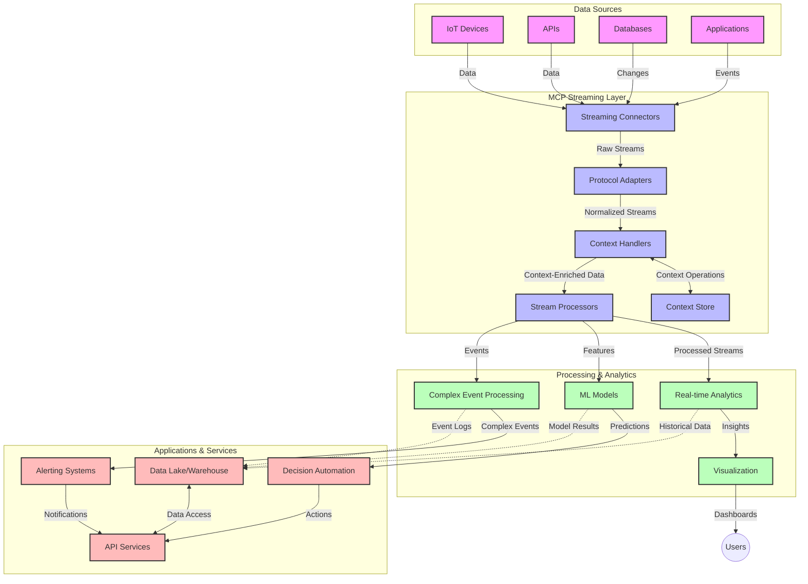

<!--
CO_OP_TRANSLATOR_METADATA:
{
  "original_hash": "68c518dbff8a3b127ed2aa934054c56c",
  "translation_date": "2025-06-11T17:17:21+00:00",
  "source_file": "05-AdvancedTopics/mcp-realtimestreaming/README.md",
  "language_code": "th"
}
-->
# Model Context Protocol สำหรับการสตรีมข้อมูลแบบเรียลไทม์

## ภาพรวม

การสตรีมข้อมูลแบบเรียลไทม์กลายเป็นสิ่งจำเป็นในโลกที่ขับเคลื่อนด้วยข้อมูลในปัจจุบัน ซึ่งธุรกิจและแอปพลิเคชันต้องการเข้าถึงข้อมูลทันทีเพื่อการตัดสินใจที่รวดเร็ว Model Context Protocol (MCP) เป็นความก้าวหน้าที่สำคัญในการเพิ่มประสิทธิภาพกระบวนการสตรีมแบบเรียลไทม์เหล่านี้ โดยช่วยเพิ่มประสิทธิภาพการประมวลผลข้อมูล รักษาความสมบูรณ์ของบริบท และปรับปรุงประสิทธิภาพโดยรวมของระบบ

โมดูลนี้จะสำรวจว่า MCP เปลี่ยนแปลงการสตรีมข้อมูลแบบเรียลไทม์อย่างไรโดยการให้แนวทางมาตรฐานในการจัดการบริบทข้ามโมเดล AI แพลตฟอร์มสตรีม และแอปพลิเคชันต่าง ๆ

## บทนำสู่การสตรีมข้อมูลแบบเรียลไทม์

การสตรีมข้อมูลแบบเรียลไทม์เป็นแนวทางเทคโนโลยีที่ช่วยให้การส่งผ่าน ประมวลผล และวิเคราะห์ข้อมูลเป็นไปอย่างต่อเนื่องขณะที่ข้อมูลถูกสร้างขึ้น ช่วยให้ระบบตอบสนองต่อข้อมูลใหม่ได้ทันที แตกต่างจากการประมวลผลแบบแบตช์ที่ทำงานกับชุดข้อมูลคงที่ การสตรีมประมวลผลข้อมูลที่เคลื่อนที่ ส่งมอบข้อมูลเชิงลึกและการกระทำด้วยความหน่วงต่ำที่สุด

### แนวคิดหลักของการสตรีมข้อมูลแบบเรียลไทม์:

- **การไหลของข้อมูลอย่างต่อเนื่อง**: ข้อมูลถูกประมวลผลเป็นสตรีมของเหตุการณ์หรือบันทึกที่ไม่มีวันสิ้นสุด
- **การประมวลผลความหน่วงต่ำ**: ระบบออกแบบมาเพื่อลดเวลาระหว่างการสร้างข้อมูลและการประมวลผลให้เหลือน้อยที่สุด
- **ความสามารถในการปรับขนาด**: สถาปัตยกรรมสตรีมต้องรองรับปริมาณและความเร็วของข้อมูลที่เปลี่ยนแปลงได้
- **ความทนทานต่อความผิดพลาด**: ระบบต้องมีความยืดหยุ่นต่อความล้มเหลวเพื่อให้การไหลของข้อมูลไม่สะดุด
- **การประมวลผลแบบมีสถานะ**: การรักษาบริบทข้ามเหตุการณ์เป็นสิ่งสำคัญสำหรับการวิเคราะห์ที่มีความหมาย

### Model Context Protocol และการสตรีมแบบเรียลไทม์

Model Context Protocol (MCP) แก้ไขปัญหาสำคัญหลายประการในสภาพแวดล้อมการสตรีมแบบเรียลไทม์:

1. **ความต่อเนื่องของบริบท**: MCP มาตรฐานวิธีการรักษาบริบทข้ามส่วนประกอบการสตรีมที่กระจายตัว เพื่อให้โมเดล AI และโหนดประมวลผลเข้าถึงบริบทประวัติและสภาพแวดล้อมที่เกี่ยวข้องได้

2. **การจัดการสถานะอย่างมีประสิทธิภาพ**: ด้วยการให้กลไกที่มีโครงสร้างสำหรับการส่งผ่านบริบท MCP ช่วยลดภาระการจัดการสถานะในสายการประมวลผลสตรีม

3. **ความสามารถในการทำงานร่วมกัน**: MCP สร้างภาษากลางสำหรับการแบ่งปันบริบทระหว่างเทคโนโลยีสตรีมและโมเดล AI ที่หลากหลาย ทำให้สถาปัตยกรรมยืดหยุ่นและขยายตัวได้มากขึ้น

4. **บริบทที่เหมาะสมกับการสตรีม**: การใช้งาน MCP สามารถจัดลำดับความสำคัญขององค์ประกอบบริบทที่เกี่ยวข้องมากที่สุดสำหรับการตัดสินใจแบบเรียลไทม์ เพื่อเพิ่มประสิทธิภาพทั้งด้านความเร็วและความถูกต้อง

5. **การประมวลผลแบบปรับตัว**: ด้วยการจัดการบริบทที่เหมาะสมผ่าน MCP ระบบสตรีมสามารถปรับการประมวลผลตามสภาพและรูปแบบที่เปลี่ยนแปลงในข้อมูลได้อย่างยืดหยุ่น

ในแอปพลิเคชันสมัยใหม่ตั้งแต่เครือข่ายเซ็นเซอร์ IoT ไปจนถึงแพลตฟอร์มการซื้อขายทางการเงิน การผสาน MCP กับเทคโนโลยีสตรีมช่วยให้การประมวลผลมีความชาญฉลาดและตระหนักถึงบริบทมากขึ้น สามารถตอบสนองต่อสถานการณ์ที่ซับซ้อนและเปลี่ยนแปลงได้อย่างเหมาะสมในเวลาเรียลไทม์

## วัตถุประสงค์การเรียนรู้

เมื่อจบบทเรียนนี้ คุณจะสามารถ:

- เข้าใจพื้นฐานของการสตรีมข้อมูลแบบเรียลไทม์และความท้าทายที่เกี่ยวข้อง
- อธิบายว่า Model Context Protocol (MCP) ช่วยเพิ่มประสิทธิภาพการสตรีมข้อมูลแบบเรียลไทม์อย่างไร
- นำ MCP ไปใช้ในโซลูชันการสตรีมโดยใช้เฟรมเวิร์กยอดนิยมอย่าง Kafka และ Pulsar
- ออกแบบและใช้งานสถาปัตยกรรมสตรีมที่ทนทานต่อความผิดพลาดและมีประสิทธิภาพสูงด้วย MCP
- ประยุกต์ใช้แนวคิด MCP กับกรณีการใช้งาน IoT การซื้อขายทางการเงิน และการวิเคราะห์ข้อมูลด้วย AI
- ประเมินแนวโน้มและนวัตกรรมใหม่ในเทคโนโลยีสตรีมที่ใช้ MCP

### คำจำกัดความและความสำคัญ

การสตรีมข้อมูลแบบเรียลไทม์เกี่ยวข้องกับการสร้าง ประมวลผล และส่งมอบข้อมูลอย่างต่อเนื่องด้วยความหน่วงต่ำ แตกต่างจากการประมวลผลแบบแบตช์ที่รวบรวมและประมวลผลข้อมูลเป็นกลุ่ม ข้อมูลสตรีมจะถูกประมวลผลทีละน้อยทันทีที่มาถึง ทำให้เกิดข้อมูลเชิงลึกและการกระทำได้ทันที

ลักษณะสำคัญของการสตรีมข้อมูลแบบเรียลไทม์ได้แก่:

- **ความหน่วงต่ำ**: การประมวลผลและวิเคราะห์ข้อมูลภายในเวลาไม่กี่มิลลิวินาทีถึงวินาที
- **การไหลอย่างต่อเนื่อง**: สตรีมข้อมูลที่ไม่หยุดจากแหล่งต่าง ๆ
- **การประมวลผลทันที**: วิเคราะห์ข้อมูลเมื่อมาถึงแทนที่จะรอเป็นชุด
- **สถาปัตยกรรมขับเคลื่อนด้วยเหตุการณ์**: ตอบสนองต่อเหตุการณ์เมื่อเกิดขึ้น

### ความท้าทายในการสตรีมข้อมูลแบบดั้งเดิม

วิธีการสตรีมข้อมูลแบบดั้งเดิมมีข้อจำกัดหลายประการ:

1. **การสูญเสียบริบท**: ยากที่จะรักษาบริบทข้ามระบบที่กระจายตัว
2. **ปัญหาการปรับขนาด**: ยากที่จะขยายระบบให้รองรับข้อมูลปริมาณมากและความเร็วสูง
3. **ความซับซ้อนในการผสานรวม**: ปัญหาในการทำงานร่วมกันระหว่างระบบต่าง ๆ
4. **การจัดการความหน่วง**: ต้องบาลานซ์ระหว่างอัตราการส่งข้อมูลกับเวลาประมวลผล
5. **ความสอดคล้องของข้อมูล**: ต้องมั่นใจว่าข้อมูลถูกต้องและครบถ้วนตลอดสายสตรีม

## ความเข้าใจเกี่ยวกับ Model Context Protocol (MCP)

### MCP คืออะไร?

Model Context Protocol (MCP) คือโปรโตคอลการสื่อสารมาตรฐานที่ออกแบบมาเพื่ออำนวยความสะดวกในการโต้ตอบอย่างมีประสิทธิภาพระหว่างโมเดล AI และแอปพลิเคชัน ในบริบทของการสตรีมข้อมูลแบบเรียลไทม์ MCP ให้กรอบการทำงานสำหรับ:

- รักษาบริบทตลอดสายการประมวลผลข้อมูล
- มาตรฐานรูปแบบการแลกเปลี่ยนข้อมูล
- เพิ่มประสิทธิภาพการส่งข้อมูลชุดใหญ่
- เสริมการสื่อสารระหว่างโมเดลกับโมเดล และโมเดลกับแอปพลิเคชัน

### องค์ประกอบหลักและสถาปัตยกรรม

สถาปัตยกรรม MCP สำหรับการสตรีมแบบเรียลไทม์ประกอบด้วยองค์ประกอบสำคัญหลายอย่าง:

1. **Context Handlers**: จัดการและรักษาข้อมูลบริบทข้ามสายการสตรีม
2. **Stream Processors**: ประมวลผลสตรีมข้อมูลที่เข้ามาด้วยเทคนิคที่ตระหนักถึงบริบท
3. **Protocol Adapters**: แปลงระหว่างโปรโตคอลสตรีมต่าง ๆ โดยยังคงรักษาบริบทไว้
4. **Context Store**: เก็บและดึงข้อมูลบริบทอย่างมีประสิทธิภาพ
5. **Streaming Connectors**: เชื่อมต่อกับแพลตฟอร์มสตรีมต่าง ๆ (Kafka, Pulsar, Kinesis เป็นต้น)



### MCP ช่วยปรับปรุงการจัดการข้อมูลแบบเรียลไทม์อย่างไร

MCP แก้ไขปัญหาการสตรีมแบบดั้งเดิมโดย:

- **ความสมบูรณ์ของบริบท**: รักษาความสัมพันธ์ระหว่างจุดข้อมูลตลอดสายการประมวลผล
- **การส่งผ่านที่เหมาะสม**: ลดความซ้ำซ้อนในการแลกเปลี่ยนข้อมูลด้วยการจัดการบริบทอย่างชาญฉลาด
- **อินเทอร์เฟซมาตรฐาน**: ให้ API ที่สม่ำเสมอสำหรับส่วนประกอบการสตรีม
- **ลดความหน่วง**: ลดภาระการประมวลผลด้วยการจัดการบริบทอย่างมีประสิทธิภาพ
- **เพิ่มความสามารถในการปรับขนาด**: รองรับการขยายแนวนอนโดยยังคงรักษาบริบทไว้ได้

## การบูรณาการและการใช้งาน

ระบบสตรีมข้อมูลแบบเรียลไทม์ต้องการการออกแบบสถาปัตยกรรมและการใช้งานที่รอบคอบเพื่อรักษาทั้งประสิทธิภาพและความสมบูรณ์ของบริบท Model Context Protocol เสนอแนวทางมาตรฐานสำหรับการบูรณาการโมเดล AI และเทคโนโลยีสตรีม ช่วยให้สายการประมวลผลที่ตระหนักถึงบริบทมีความซับซ้อนและมีประสิทธิภาพมากขึ้น

### ภาพรวมของการบูรณาการ MCP ในสถาปัตยกรรมสตรีม

การใช้งาน MCP ในสภาพแวดล้อมการสตรีมแบบเรียลไทม์ต้องพิจารณาหลัก ๆ ดังนี้:

1. **การซีเรียลไลซ์และการส่งผ่านบริบท**: MCP มีวิธีที่มีประสิทธิภาพสำหรับการเข้ารหัสข้อมูลบริบทภายในแพ็กเก็ตข้อมูลสตรีม เพื่อให้บริบทสำคัญติดตามข้อมูลไปตลอดสายการประมวลผล รวมถึงรูปแบบการซีเรียลไลซ์ที่มาตรฐานและเหมาะกับการส่งผ่านแบบสตรีม

2. **การประมวลผลสตรีมแบบมีสถานะ**: MCP ช่วยให้การประมวลผลที่มีสถานะฉลาดขึ้นโดยรักษาการแทนบริบทอย่างสม่ำเสมอข้ามโหนดประมวลผล ซึ่งสำคัญมากในสถาปัตยกรรมสตรีมที่กระจายตัวซึ่งการจัดการสถานะเป็นเรื่องท้าทาย

3. **เวลาเหตุการณ์กับเวลาในการประมวลผล**: การใช้งาน MCP ต้องจัดการกับความท้าทายทั่วไปในการแยกแยะระหว่างเวลาที่เหตุการณ์เกิดขึ้นและเวลาที่ถูกประมวลผล โปรโตคอลสามารถรวมบริบทเชิงเวลาเพื่อรักษาความหมายของเวลาเหตุการณ์ได้

4. **การจัดการแรงกดดันกลับ**: ด้วยการมาตรฐานการจัดการบริบท MCP ช่วยควบคุมแรงกดดันกลับในระบบสตรีม ทำให้ส่วนประกอบสามารถสื่อสารความสามารถในการประมวลผลและปรับการไหลของข้อมูลได้ตามเหมาะสม

5. **การจัดหน้าต่างบริบทและการสรุปผล**: MCP ช่วยให้การดำเนินการจัดหน้าต่างซับซ้อนขึ้นโดยการให้การแทนบริบทเชิงเวลาและความสัมพันธ์อย่างมีโครงสร้าง ช่วยให้การสรุปผลข้ามสตรีมเหตุการณ์มีความหมายมากขึ้น

6. **การประมวลผลแบบ Exactly-Once**: ในระบบสตรีมที่ต้องการความสมบูรณ์แบบแบบ exactly-once MCP สามารถรวมเมตาดาต้าการประมวลผลเพื่อช่วยติดตามและตรวจสอบสถานะการประมวลผลข้ามส่วนประกอบที่กระจายตัว

การใช้งาน MCP กับเทคโนโลยีสตรีมต่าง ๆ สร้างแนวทางรวมศูนย์สำหรับการจัดการบริบท ลดความจำเป็นในการเขียนโค้ดบูรณาการเฉพาะตัว พร้อมทั้งเพิ่มความสามารถของระบบในการรักษาบริบทที่มีความหมายขณะข้อมูลไหลผ่านสายการประมวลผล

### MCP ในเฟรมเวิร์กสตรีมข้อมูลต่าง ๆ

MCP สามารถบูรณาการกับเฟรมเวิร์กสตรีมยอดนิยม เช่น:

#### การบูรณาการ Apache Kafka

```python
from mcp_streaming import MCPKafkaConnector

# Initialize MCP Kafka connector
connector = MCPKafkaConnector(
    bootstrap_servers='localhost:9092',
    context_preservation=True
)

# Create a context-aware consumer
consumer = connector.create_consumer('input-topic')

# Process streaming data with context
for message in consumer:
    context = message.get_context()
    data = message.get_value()
    
    # Process with context awareness
    result = process_with_context(data, context)
    
    # Produce output with preserved context
    connector.produce('output-topic', result, context=context)
```

#### การใช้งาน Apache Pulsar

```python
from mcp_streaming import MCPPulsarClient

# Initialize MCP Pulsar client
client = MCPPulsarClient('pulsar://localhost:6650')

# Subscribe with context awareness
consumer = client.subscribe('input-topic', 'subscription-name', 
                           context_enabled=True)

# Process messages with context preservation
while True:
    message = consumer.receive()
    context = message.get_context()
    
    # Process with context
    result = process_with_context(message.data(), context)
    
    # Acknowledge the message
    consumer.acknowledge(message)
    
    # Send result with preserved context
    producer = client.create_producer('output-topic')
    producer.send(result, context=context)
```

### แนวทางปฏิบัติที่ดีที่สุดสำหรับการใช้งาน

เมื่อใช้งาน MCP สำหรับการสตรีมแบบเรียลไทม์:

1. **ออกแบบเพื่อความทนทานต่อความผิดพลาด**:
   - ใช้การจัดการข้อผิดพลาดที่เหมาะสม
   - ใช้ dead-letter queues สำหรับข้อความที่ล้มเหลว
   - ออกแบบโปรเซสเซอร์ให้ทำงานซ้ำได้โดยไม่เกิดผลกระทบซ้ำซ้อน

2. **เพิ่มประสิทธิภาพการทำงาน**:
   - ตั้งค่าขนาดบัฟเฟอร์ที่เหมาะสม
   - ใช้การประมวลผลเป็นชุดเมื่อเหมาะสม
   - ใช้กลไกแรงกดดันกลับ (backpressure)

3. **ตรวจสอบและสังเกตการณ์**:
   - ติดตามเมตริกการประมวลผลสตรีม
   - ตรวจสอบการแพร่กระจายบริบท
   - ตั้งค่าแจ้งเตือนเมื่อพบความผิดปกติ

4. **รักษาความปลอดภัยของสตรีม**:
   - ใช้การเข้ารหัสข้อมูลที่ละเอียดอ่อน
   - ใช้การตรวจสอบสิทธิ์และการอนุญาต
   - ใช้มาตรการควบคุมการเข้าถึงที่เหมาะสม

### MCP ใน IoT และ Edge Computing

MCP ช่วยเพิ่มประสิทธิภาพการสตรีม IoT โดย:

- รักษาบริบทของอุปกรณ์ตลอดสายการประมวลผล
- อำนวยความสะดวกในการสตรีมข้อมูลจาก edge สู่ cloud อย่างมีประสิทธิภาพ
- สนับสนุนการวิเคราะห์ข้อมูลแบบเรียลไทม์บนสตรีมข้อมูล IoT
- ช่วยให้การสื่อสารระหว่างอุปกรณ์ด้วยบริบท

ตัวอย่าง: เครือข่ายเซ็นเซอร์เมืองอัจฉริยะ  
```
Sensors → Edge Gateways → MCP Stream Processors → Real-time Analytics → Automated Responses
```

### บทบาทในธุรกรรมการเงินและการซื้อขายความถี่สูง

MCP มอบข้อได้เปรียบสำคัญสำหรับการสตรีมข้อมูลทางการเงิน:

- การประมวลผลความหน่วงต่ำพิเศษสำหรับการตัดสินใจซื้อขาย
- รักษาบริบทของธุรกรรมตลอดกระบวนการ
- สนับสนุนการประมวลผลเหตุการณ์ซับซ้อนด้วยความตระหนักบริบท
- รับประกันความสอดคล้องของข้อมูลในระบบซื้อขายที่กระจายตัว

### การเสริมศักยภาพการวิเคราะห์ข้อมูลด้วย AI

MCP เปิดโอกาสใหม่สำหรับการวิเคราะห์สตรีม:

- การฝึกและสรุปผลโมเดลแบบเรียลไทม์
- การเรียนรู้อย่างต่อเนื่องจากข้อมูลสตรีม
- การสกัดคุณลักษณะที่ตระหนักถึงบริบท
- สายการสรุปผลหลายโมเดลที่รักษาบริบทไว้

## แนวโน้มและนวัตกรรมในอนาคต

### การพัฒนา MCP ในสภาพแวดล้อมแบบเรียลไทม์

ในอนาคต เราคาดว่า MCP จะพัฒนาเพื่อตอบสนอง:

- **การผสานรวมกับ Quantum Computing**: เตรียมพร้อมสำหรับระบบสตรีมที่ใช้คอมพิวเตอร์ควอนตัม
- **การประมวลผลแบบ Edge-Native**: ย้ายการประมวลผลที่ตระหนักบริบทไปยังอุปกรณ์ edge มากขึ้น
- **การจัดการสตรีมแบบอัตโนมัติ**: สายการประมวลผลที่ปรับตัวเองได้
- **Federated Streaming**: การประมวลผลแบบกระจายพร้อมรักษาความเป็นส่วนตัว

### ความก้าวหน้าทางเทคโนโลยีที่อาจเกิดขึ้น

เทคโนโลยีใหม่ที่จะกำหนดอนาคตของการสตรีม MCP ได้แก่:

1. **โปรโตคอลสตรีมที่ปรับแต่งสำหรับ AI**: โปรโตคอลเฉพาะสำหรับงาน AI
2. **การผสานรวม Neuromorphic Computing**: การประมวลผลที่ได้รับแรงบันดาลใจจากสมองสำหรับการ

**ข้อจำกัดความรับผิดชอบ**:  
เอกสารนี้ได้รับการแปลโดยใช้บริการแปลภาษาอัตโนมัติ [Co-op Translator](https://github.com/Azure/co-op-translator) แม้เราจะพยายามให้ความถูกต้อง แต่โปรดทราบว่าการแปลโดยอัตโนมัติอาจมีข้อผิดพลาดหรือความไม่ถูกต้อง เอกสารต้นฉบับในภาษาดั้งเดิมถือเป็นแหล่งข้อมูลที่เชื่อถือได้ สำหรับข้อมูลที่สำคัญ ควรใช้บริการแปลโดยมนุษย์มืออาชีพ เราจะไม่รับผิดชอบต่อความเข้าใจผิดหรือการตีความผิดที่เกิดขึ้นจากการใช้การแปลนี้