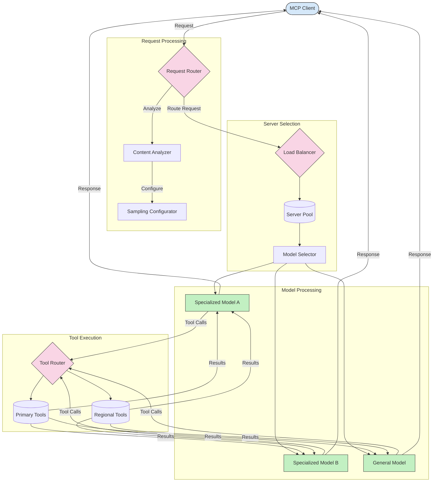

<!--
CO_OP_TRANSLATOR_METADATA:
{
  "original_hash": "af40eab7bd6ebf7e607f982a5506a5b5",
  "translation_date": "2025-06-12T23:59:22+00:00",
  "source_file": "05-AdvancedTopics/mcp-routing/README.md",
  "language_code": "th"
}
-->
## สถาปัตยกรรมการสุ่มตัวอย่างและการกำหนดเส้นทางใน MCP

การสุ่มตัวอย่างเป็นส่วนสำคัญของ Model Context Protocol (MCP) ที่ช่วยให้การประมวลผลและกำหนดเส้นทางคำขอมีประสิทธิภาพ โดยจะทำการวิเคราะห์คำขอที่เข้ามาเพื่อกำหนดโมเดลหรือบริการที่เหมาะสมที่สุดในการจัดการตามเกณฑ์ต่างๆ เช่น ประเภทเนื้อหา บริบทของผู้ใช้ และภาระงานของระบบ

การสุ่มตัวอย่างและการกำหนดเส้นทางสามารถผสมผสานกันเพื่อสร้างสถาปัตยกรรมที่แข็งแกร่งซึ่งเพิ่มประสิทธิภาพการใช้ทรัพยากรและรับประกันความพร้อมใช้งานสูง กระบวนการสุ่มตัวอย่างใช้ในการจัดประเภทคำขอ ในขณะที่การกำหนดเส้นทางจะส่งคำขอไปยังโมเดลหรือบริการที่เหมาะสม

แผนภาพด้านล่างแสดงให้เห็นว่าการสุ่มตัวอย่างและการกำหนดเส้นทางทำงานร่วมกันอย่างไรในสถาปัตยกรรม MCP ที่ครอบคลุม:

## ขั้นตอนถัดไป

- [5.6 การสุ่มตัวอย่าง](../mcp-sampling/README.md)

**ข้อจำกัดความรับผิดชอบ**:  
เอกสารฉบับนี้ได้รับการแปลโดยใช้บริการแปลภาษา AI [Co-op Translator](https://github.com/Azure/co-op-translator) แม้เราจะพยายามให้มีความถูกต้องสูงสุด โปรดทราบว่าการแปลโดยอัตโนมัติอาจมีข้อผิดพลาดหรือความคลาดเคลื่อนได้ เอกสารต้นฉบับในภาษาต้นทางควรถูกพิจารณาเป็นแหล่งข้อมูลที่เชื่อถือได้ สำหรับข้อมูลที่มีความสำคัญ ควรใช้บริการแปลโดยมนุษย์มืออาชีพ เราจะไม่รับผิดชอบต่อความเข้าใจผิดหรือการตีความผิดที่เกิดจากการใช้การแปลนี้