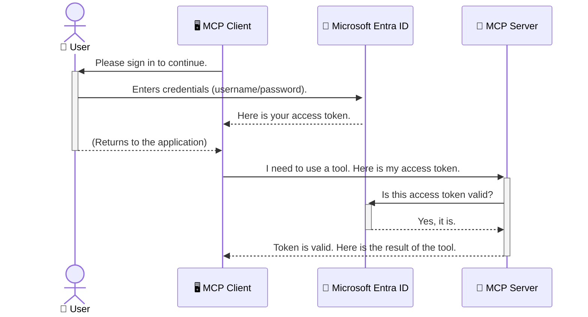

<!--
CO_OP_TRANSLATOR_METADATA:
{
  "original_hash": "0abf26a6c4dbe905d5d49ccdc0ccfe92",
  "translation_date": "2025-06-26T16:31:28+00:00",
  "source_file": "05-AdvancedTopics/mcp-security-entra/README.md",
  "language_code": "th"
}
-->
# การรักษาความปลอดภัยของเวิร์กโฟลว์ AI: การตรวจสอบสิทธิ์ Entra ID สำหรับเซิร์ฟเวอร์ Model Context Protocol

## บทนำ  
การรักษาความปลอดภัยเซิร์ฟเวอร์ Model Context Protocol (MCP) ของคุณสำคัญไม่ต่างจากการล็อกประตูหน้าบ้าน การปล่อยให้เซิร์ฟเวอร์ MCP ของคุณเปิดเผยจะทำให้เครื่องมือและข้อมูลของคุณถูกเข้าถึงโดยไม่ได้รับอนุญาต ซึ่งอาจนำไปสู่การละเมิดความปลอดภัย Microsoft Entra ID ให้บริการการจัดการตัวตนและการเข้าถึงบนคลาวด์ที่แข็งแกร่ง ช่วยให้มั่นใจได้ว่าเฉพาะผู้ใช้และแอปพลิเคชันที่ได้รับอนุญาตเท่านั้นที่สามารถโต้ตอบกับเซิร์ฟเวอร์ MCP ของคุณ ในส่วนนี้ คุณจะได้เรียนรู้วิธีปกป้องเวิร์กโฟลว์ AI ของคุณด้วยการตรวจสอบสิทธิ์ Entra ID

## วัตถุประสงค์การเรียนรู้  
เมื่อจบบทนี้ คุณจะสามารถ:

- เข้าใจความสำคัญของการรักษาความปลอดภัยเซิร์ฟเวอร์ MCP  
- อธิบายพื้นฐานของ Microsoft Entra ID และการตรวจสอบสิทธิ์ OAuth 2.0  
- แยกแยะความแตกต่างระหว่าง public client และ confidential client  
- นำการตรวจสอบสิทธิ์ Entra ID ไปใช้กับสถานการณ์เซิร์ฟเวอร์ MCP ทั้งในเครื่อง (public client) และระยะไกล (confidential client)  
- นำแนวทางปฏิบัติที่ดีที่สุดด้านความปลอดภัยมาใช้ในการพัฒนาเวิร์กโฟลว์ AI  

## ความปลอดภัยและ MCP  

เหมือนกับที่คุณไม่ปล่อยให้ประตูหน้าบ้านเปิดค้าง คุณก็ไม่ควรปล่อยเซิร์ฟเวอร์ MCP ของคุณเปิดให้ใครก็ได้เข้าถึง การรักษาความปลอดภัยเวิร์กโฟลว์ AI ของคุณเป็นสิ่งจำเป็นสำหรับการสร้างแอปพลิเคชันที่มั่นคง น่าเชื่อถือ และปลอดภัย บทนี้จะแนะนำการใช้ Microsoft Entra ID เพื่อรักษาความปลอดภัยเซิร์ฟเวอร์ MCP ของคุณ เพื่อให้เฉพาะผู้ใช้และแอปพลิเคชันที่ได้รับอนุญาตเท่านั้นที่สามารถเข้าถึงเครื่องมือและข้อมูลของคุณได้  

## ทำไมความปลอดภัยจึงสำคัญสำหรับเซิร์ฟเวอร์ MCP  

ลองนึกภาพว่าเซิร์ฟเวอร์ MCP ของคุณมีเครื่องมือที่สามารถส่งอีเมลหรือเข้าถึงฐานข้อมูลลูกค้าได้ หากเซิร์ฟเวอร์ไม่ได้รับการป้องกันใครก็สามารถใช้เครื่องมือนั้นได้ ซึ่งอาจทำให้ข้อมูลถูกเข้าถึงโดยไม่ได้รับอนุญาต ส่งสแปมหรือกิจกรรมที่เป็นอันตรายอื่นๆ  

การนำการตรวจสอบสิทธิ์มาใช้ช่วยให้มั่นใจได้ว่าทุกคำขอที่ส่งไปยังเซิร์ฟเวอร์ได้รับการยืนยันตัวตน ยืนยันว่าเป็นผู้ใช้หรือแอปพลิเคชันที่ถูกต้อง นี่คือขั้นตอนแรกและสำคัญที่สุดในการรักษาความปลอดภัยเวิร์กโฟลว์ AI ของคุณ  

## แนะนำ Microsoft Entra ID  

[**Microsoft Entra ID**](https://adoption.microsoft.com/microsoft-security/entra/) คือบริการจัดการตัวตนและการเข้าถึงบนคลาวด์ เปรียบเสมือนยามรักษาความปลอดภัยสำหรับแอปพลิเคชันของคุณ มันจัดการกระบวนการตรวจสอบตัวตน (authentication) และการกำหนดสิทธิ์ (authorization) ที่ซับซ้อน  

ด้วยการใช้ Entra ID คุณสามารถ:  

- เปิดใช้งานการลงชื่อเข้าใช้อย่างปลอดภัยสำหรับผู้ใช้  
- ปกป้อง API และบริการต่างๆ  
- จัดการนโยบายการเข้าถึงจากศูนย์กลาง  

สำหรับเซิร์ฟเวอร์ MCP Entra ID เป็นโซลูชันที่แข็งแกร่งและได้รับความไว้วางใจอย่างกว้างขวางในการจัดการว่าใครสามารถเข้าถึงความสามารถของเซิร์ฟเวอร์ได้  

---

## ทำความเข้าใจเวทมนตร์: การทำงานของการตรวจสอบสิทธิ์ Entra ID  

Entra ID ใช้มาตรฐานเปิดอย่าง **OAuth 2.0** ในการจัดการการตรวจสอบสิทธิ์ แม้ว่ารายละเอียดจะซับซ้อน แต่แนวคิดหลักเข้าใจได้ง่ายผ่านการเปรียบเทียบ  

### แนะนำ OAuth 2.0 อย่างง่าย: กุญแจวาเล่ต์  

ลองนึกถึง OAuth 2.0 เหมือนบริการวาเล่ต์สำหรับรถยนต์ของคุณ เมื่อคุณไปถึงร้านอาหาร คุณไม่ได้ให้กุญแจหลักแก่วาเล่ต์ แต่ให้กุญแจวาเล่ต์ที่มีสิทธิ์จำกัด—สามารถสตาร์ทรถและล็อกประตูได้ แต่เปิดฝากระโปรงหรือช่องเก็บของไม่ได้  

ในเปรียบเทียบนี้:  

- **คุณ** คือ **ผู้ใช้ (User)**  
- **รถของคุณ** คือ **เซิร์ฟเวอร์ MCP** ที่มีเครื่องมือและข้อมูลสำคัญ  
- **วาเล่ต์** คือ **Microsoft Entra ID**  
- **พนักงานจอดรถ** คือ **MCP Client** (แอปพลิเคชันที่พยายามเข้าถึงเซิร์ฟเวอร์)  
- **กุญแจวาเล่ต์** คือ **Access Token**  

Access Token คือข้อความที่ปลอดภัยซึ่ง MCP client ได้รับจาก Entra ID หลังจากที่คุณลงชื่อเข้าใช้ จากนั้น client จะส่ง token นี้ไปยังเซิร์ฟเวอร์ MCP ในทุกคำขอ เซิร์ฟเวอร์จะตรวจสอบ token เพื่อยืนยันคำขอว่าเป็นของจริงและ client มีสิทธิ์ที่จำเป็น โดยไม่ต้องจัดการกับข้อมูลรับรองจริงของคุณ (เช่น รหัสผ่าน)  

### กระบวนการตรวจสอบสิทธิ์  

นี่คือวิธีการทำงานในทางปฏิบัติ:  



### แนะนำ Microsoft Authentication Library (MSAL)  

ก่อนเข้าสู่โค้ด จำเป็นต้องแนะนำส่วนสำคัญที่คุณจะเห็นในตัวอย่าง: **Microsoft Authentication Library (MSAL)**  

MSAL เป็นไลบรารีที่พัฒนาโดย Microsoft ช่วยให้นักพัฒนาจัดการการตรวจสอบสิทธิ์ได้ง่ายขึ้น แทนที่คุณจะต้องเขียนโค้ดยุ่งยากทั้งหมดเพื่อจัดการโทเค็นความปลอดภัย การลงชื่อเข้าใช้ และการรีเฟรชเซสชัน MSAL จะจัดการส่วนที่ซับซ้อนเหล่านี้ให้  

การใช้ไลบรารีอย่าง MSAL แนะนำอย่างยิ่งเพราะ:  

- **ปลอดภัย:** ใช้มาตรฐานอุตสาหกรรมและแนวทางปฏิบัติด้านความปลอดภัยที่ดีที่สุด ลดความเสี่ยงช่องโหว่ในโค้ดของคุณ  
- **ช่วยให้ง่ายต่อการพัฒนา:** ซ่อนความซับซ้อนของโปรโตคอล OAuth 2.0 และ OpenID Connect ให้คุณเพิ่มการตรวจสอบสิทธิ์ที่แข็งแกร่งในแอปด้วยโค้ดเพียงไม่กี่บรรทัด  
- **มีการดูแลรักษา:** Microsoft อัปเดตและดูแล MSAL อย่างต่อเนื่องเพื่อรับมือกับภัยคุกคามความปลอดภัยและการเปลี่ยนแปลงของแพลตฟอร์ม  

MSAL รองรับภาษาต่างๆ และเฟรมเวิร์กแอปพลิเคชันหลากหลาย เช่น .NET, JavaScript/TypeScript, Python, Java, Go และแพลตฟอร์มมือถืออย่าง iOS และ Android ทำให้คุณใช้รูปแบบการตรวจสอบสิทธิ์ที่สม่ำเสมอในเทคโนโลยีทั้งหมดของคุณ  

หากต้องการเรียนรู้เพิ่มเติมเกี่ยวกับ MSAL สามารถดูได้ที่เอกสาร [MSAL overview documentation](https://learn.microsoft.com/entra/identity-platform/msal-overview)  

---

## การรักษาความปลอดภัยเซิร์ฟเวอร์ MCP ของคุณด้วย Entra ID: คู่มือทีละขั้นตอน  

ตอนนี้ เรามาดูวิธีการรักษาความปลอดภัยเซิร์ฟเวอร์ MCP ในเครื่อง (ซึ่งสื่อสารผ่าน `stdio`) using Entra ID. This example uses a **public client**, which is suitable for applications running on a user's machine, like a desktop app or a local development server.

### Scenario 1: Securing a Local MCP Server (with a Public Client)

In this scenario, we'll look at an MCP server that runs locally, communicates over `stdio`, and uses Entra ID to authenticate the user before allowing access to its tools. The server will have a single tool that fetches the user's profile information from the Microsoft Graph API.

#### 1. Setting Up the Application in Entra ID

Before writing any code, you need to register your application in Microsoft Entra ID. This tells Entra ID about your application and grants it permission to use the authentication service.

1. Navigate to the **[Microsoft Entra portal](https://entra.microsoft.com/)**.
2. Go to **App registrations** and click **New registration**.
3. Give your application a name (e.g., "My Local MCP Server").
4. For **Supported account types**, select **Accounts in this organizational directory only**.
5. You can leave the **Redirect URI** blank for this example.
6. Click **Register**.

Once registered, take note of the **Application (client) ID** and **Directory (tenant) ID**. You'll need these in your code.

#### 2. The Code: A Breakdown

Let's look at the key parts of the code that handle authentication. The full code for this example is available in the [Entra ID - Local - WAM](https://github.com/Azure-Samples/mcp-auth-servers/tree/main/src/entra-id-local-wam) folder of the [mcp-auth-servers GitHub repository](https://github.com/Azure-Samples/mcp-auth-servers).

**`AuthenticationService.cs`**

This class is responsible for handling the interaction with Entra ID.

- **`CreateAsync`**: This method initializes the `PublicClientApplication` from the MSAL (Microsoft Authentication Library). It's configured with your application's `clientId` and `tenantId`.
- **`WithBroker`**: This enables the use of a broker (like the Windows Web Account Manager), which provides a more secure and seamless single sign-on experience.
- **`AcquireTokenAsync`**: นี่คือเมธอดหลัก พยายามรับ token แบบเงียบ (silent) ก่อน หมายความว่าผู้ใช้ไม่ต้องลงชื่อเข้าใช้ใหม่หากมีเซสชันที่ยังใช้ได้ หากไม่ได้ token แบบเงียบ จะให้ผู้ใช้ลงชื่อเข้าใช้อย่างโต้ตอบ  

```csharp
// Simplified for clarity
public static async Task<AuthenticationService> CreateAsync(ILogger<AuthenticationService> logger)
{
    var msalClient = PublicClientApplicationBuilder
        .Create(_clientId) // Your Application (client) ID
        .WithAuthority(AadAuthorityAudience.AzureAdMyOrg)
        .WithTenantId(_tenantId) // Your Directory (tenant) ID
        .WithBroker(new BrokerOptions(BrokerOptions.OperatingSystems.Windows))
        .Build();

    // ... cache registration ...

    return new AuthenticationService(logger, msalClient);
}

public async Task<string> AcquireTokenAsync()
{
    try
    {
        // Try silent authentication first
        var accounts = await _msalClient.GetAccountsAsync();
        var account = accounts.FirstOrDefault();

        AuthenticationResult? result = null;

        if (account != null)
        {
            result = await _msalClient.AcquireTokenSilent(_scopes, account).ExecuteAsync();
        }
        else
        {
            // If no account, or silent fails, go interactive
            result = await _msalClient.AcquireTokenInteractive(_scopes).ExecuteAsync();
        }

        return result.AccessToken;
    }
    catch (Exception ex)
    {
        _logger.LogError(ex, "An error occurred while acquiring the token.");
        throw; // Optionally rethrow the exception for higher-level handling
    }
}
```  

**`Program.cs`**

This is where the MCP server is set up and the authentication service is integrated.

- **`AddSingleton<AuthenticationService>`**: This registers the `AuthenticationService` with the dependency injection container, so it can be used by other parts of the application (like our tool).
- **`GetUserDetailsFromGraph` tool**: This tool requires an instance of `AuthenticationService`. Before it does anything, it calls `authService.AcquireTokenAsync()` เพื่อรับ access token ที่ถูกต้อง หากการตรวจสอบสิทธิ์สำเร็จ จะใช้ token นี้เรียก Microsoft Graph API เพื่อดึงข้อมูลผู้ใช้  

```csharp
// Simplified for clarity
[McpServerTool(Name = "GetUserDetailsFromGraph")]
public static async Task<string> GetUserDetailsFromGraph(
    AuthenticationService authService)
{
    try
    {
        // This will trigger the authentication flow
        var accessToken = await authService.AcquireTokenAsync();

        // Use the token to create a GraphServiceClient
        var graphClient = new GraphServiceClient(
            new BaseBearerTokenAuthenticationProvider(new TokenProvider(authService)));

        var user = await graphClient.Me.GetAsync();

        return System.Text.Json.JsonSerializer.Serialize(user);
    }
    catch (Exception ex)
    {
        return $"Error: {ex.Message}";
    }
}
```  

#### 3. การทำงานร่วมกันทั้งหมด  

1. เมื่อ MCP client พยายามใช้ `GetUserDetailsFromGraph` tool, the tool first calls `AcquireTokenAsync`.
2. `AcquireTokenAsync` triggers the MSAL library to check for a valid token.
3. If no token is found, MSAL, through the broker, will prompt the user to sign in with their Entra ID account.
4. Once the user signs in, Entra ID issues an access token.
5. The tool receives the token and uses it to make a secure call to the Microsoft Graph API.
6. The user's details are returned to the MCP client.

This process ensures that only authenticated users can use the tool, effectively securing your local MCP server.

### Scenario 2: Securing a Remote MCP Server (with a Confidential Client)

When your MCP server is running on a remote machine (like a cloud server) and communicates over a protocol like HTTP Streaming, the security requirements are different. In this case, you should use a **confidential client** and the **Authorization Code Flow**. This is a more secure method because the application's secrets are never exposed to the browser.

This example uses a TypeScript-based MCP server that uses Express.js to handle HTTP requests.

#### 1. Setting Up the Application in Entra ID

The setup in Entra ID is similar to the public client, but with one key difference: you need to create a **client secret**.

1. Navigate to the **[Microsoft Entra portal](https://entra.microsoft.com/)**.
2. In your app registration, go to the **Certificates & secrets** tab.
3. Click **New client secret**, give it a description, and click **Add**.
4. **Important:** Copy the secret value immediately. You will not be able to see it again.
5. You also need to configure a **Redirect URI**. Go to the **Authentication** tab, click **Add a platform**, select **Web**, and enter the redirect URI for your application (e.g., `http://localhost:3001/auth/callback`).

> **⚠️ Important Security Note:** For production applications, Microsoft strongly recommends using **secretless authentication** methods such as **Managed Identity** or **Workload Identity Federation** instead of client secrets. Client secrets pose security risks as they can be exposed or compromised. Managed identities provide a more secure approach by eliminating the need to store credentials in your code or configuration.
>
> For more information about managed identities and how to implement them, see the [Managed identities for Azure resources overview](https://learn.microsoft.com/entra/identity/managed-identities-azure-resources/overview).

#### 2. The Code: A Breakdown

This example uses a session-based approach. When the user authenticates, the server stores the access token and refresh token in a session and gives the user a session token. This session token is then used for subsequent requests. The full code for this example is available in the [Entra ID - Confidential client](https://github.com/Azure-Samples/mcp-auth-servers/tree/main/src/entra-id-cca-session) folder of the [mcp-auth-servers GitHub repository](https://github.com/Azure-Samples/mcp-auth-servers).

**`Server.ts`**

This file sets up the Express server and the MCP transport layer.

- **`requireBearerAuth`**: This is middleware that protects the `/sse` and `/message` endpoints. It checks for a valid bearer token in the `Authorization` header of the request.
- **`EntraIdServerAuthProvider`**: This is a custom class that implements the `McpServerAuthorizationProvider` interface. It's responsible for handling the OAuth 2.0 flow.
- **`/auth/callback`**: endpoint นี้จัดการการเปลี่ยนเส้นทางจาก Entra ID หลังผู้ใช้ตรวจสอบสิทธิ์แล้ว โดยแลกเปลี่ยน authorization code เป็น access token และ refresh token  

```typescript
// Simplified for clarity
const app = express();
const { server } = createServer();
const provider = new EntraIdServerAuthProvider();

// Protect the SSE endpoint
app.get("/sse", requireBearerAuth({
  provider,
  requiredScopes: ["User.Read"]
}), async (req, res) => {
  // ... connect to the transport ...
});

// Protect the message endpoint
app.post("/message", requireBearerAuth({
  provider,
  requiredScopes: ["User.Read"]
}), async (req, res) => {
  // ... handle the message ...
});

// Handle the OAuth 2.0 callback
app.get("/auth/callback", (req, res) => {
  provider.handleCallback(req.query.code, req.query.state)
    .then(result => {
      // ... handle success or failure ...
    });
});
```  

**`Tools.ts`**

This file defines the tools that the MCP server provides. The `getUserDetails` เครื่องมือเหมือนกับตัวอย่างก่อนหน้า แต่รับ access token จากเซสชัน  

```typescript
// Simplified for clarity
server.setRequestHandler(CallToolRequestSchema, async (request) => {
  const { name } = request.params;
  const context = request.params?.context as { token?: string } | undefined;
  const sessionToken = context?.token;

  if (name === ToolName.GET_USER_DETAILS) {
    if (!sessionToken) {
      throw new AuthenticationError("Authentication token is missing or invalid. Ensure the token is provided in the request context.");
    }

    // Get the Entra ID token from the session store
    const tokenData = tokenStore.getToken(sessionToken);
    const entraIdToken = tokenData.accessToken;

    const graphClient = Client.init({
      authProvider: (done) => {
        done(null, entraIdToken);
      }
    });

    const user = await graphClient.api('/me').get();

    // ... return user details ...
  }
});
```  

**`auth/EntraIdServerAuthProvider.ts`**

This class handles the logic for:

- Redirecting the user to the Entra ID sign-in page.
- Exchanging the authorization code for an access token.
- Storing the tokens in the `tokenStore`.
- Refreshing the access token when it expires.

#### 3. How It All Works Together

1. When a user first tries to connect to the MCP server, the `requireBearerAuth` middleware will see that they don't have a valid session and will redirect them to the Entra ID sign-in page.
2. The user signs in with their Entra ID account.
3. Entra ID redirects the user back to the `/auth/callback` endpoint with an authorization code.
4. The server exchanges the code for an access token and a refresh token, stores them, and creates a session token which is sent to the client.
5. The client can now use this session token in the `Authorization` header for all future requests to the MCP server.
6. When the `getUserDetails` เครื่องมือนี้ถูกเรียกโดยใช้ token จากเซสชันเพื่อตรวจสอบ access token ของ Entra ID แล้วใช้ token นั้นเรียก Microsoft Graph API  

โฟลว์นี้ซับซ้อนกว่าการใช้ public client แต่จำเป็นสำหรับ endpoint ที่เข้าถึงผ่านอินเทอร์เน็ต เนื่องจากเซิร์ฟเวอร์ MCP ระยะไกลเข้าถึงได้จากอินเทอร์เน็ตสาธารณะ จึงต้องมีมาตรการรักษาความปลอดภัยที่เข้มงวดกว่าเพื่อป้องกันการเข้าถึงโดยไม่ได้รับอนุญาตและการโจมตีที่อาจเกิดขึ้น  

## แนวทางปฏิบัติที่ดีที่สุดด้านความปลอดภัย  

- **ใช้ HTTPS เสมอ**: เข้ารหัสการสื่อสารระหว่าง client และ server เพื่อป้องกันไม่ให้ token ถูกดักจับ  
- **นำ Role-Based Access Control (RBAC) มาใช้**: อย่าตรวจสอบแค่ *ว่าผู้ใช้ได้รับการตรวจสอบสิทธิ์หรือไม่* แต่ตรวจสอบ *ว่าผู้ใช้ได้รับอนุญาตให้ทำอะไร* คุณสามารถกำหนดบทบาทใน Entra ID และตรวจสอบบทบาทเหล่านั้นในเซิร์ฟเวอร์ MCP  
- **ตรวจสอบและบันทึกเหตุการณ์**: จดบันทึกกิจกรรมการตรวจสอบสิทธิ์ทั้งหมดเพื่อช่วยตรวจจับและตอบสนองต่อกิจกรรมที่น่าสงสัย  
- **จัดการการจำกัดอัตราและการหน่วงเวลา**: Microsoft Graph และ API อื่นๆ มีการจำกัดอัตราเพื่อป้องกันการใช้งานเกินขอบเขต นำกลไก exponential backoff และ retry มาใช้ในเซิร์ฟเวอร์ MCP เพื่อจัดการกับ HTTP 429 (Too Many Requests) อย่างเหมาะสม พิจารณาการแคชข้อมูลที่ถูกเรียกบ่อยเพื่อลดจำนวนครั้งที่เรียก API  
- **จัดเก็บ token อย่างปลอดภัย**: เก็บ access token และ refresh token อย่างปลอดภัย สำหรับแอปในเครื่อง ให้ใช้กลไกจัดเก็บข้อมูลที่ปลอดภัยของระบบ สำหรับแอปเซิร์ฟเวอร์ ให้พิจารณาใช้การจัดเก็บแบบเข้ารหัสหรือบริการจัดการคีย์ที่ปลอดภัย เช่น Azure Key Vault  
- **จัดการการหมดอายุของ token**: Access token มีอายุจำกัด ควรตั้งค่าการรีเฟรช token อัตโนมัติด้วย refresh token เพื่อให้ผู้ใช้ไม่ต้องลงชื่อเข้าใช้ซ้ำ  
- **พิจารณาใช้ Azure API Management**: แม้ว่าการรักษาความปลอดภัยในเซิร์ฟเวอร์ MCP โดยตรงจะให้การควบคุมที่ละเอียด แต่ API Gateway อย่าง Azure API Management สามารถจัดการเรื่องความปลอดภัยหลายอย่างโดยอัตโนมัติ เช่น การตรวจสอบสิทธิ์ การกำหนดสิทธิ์ การจำกัดอัตรา และการตรวจสอบสถานะ ซึ่งจะเป็นชั้นความปลอดภัยกลางระหว่าง client กับเซิร์ฟเวอร์ MCP ของคุณ สำหรับรายละเอียดเพิ่มเติมเกี่ยวกับการใช้ API Gateway กับ MCP ดูได้ที่ [Azure API Management Your Auth Gateway For MCP Servers](https://techcommunity.microsoft.com/blog/integrationsonazureblog/azure-api-management-your-auth-gateway-for-mcp-servers/4402690)  

## สรุปประเด็นสำคัญ  

- การรักษาความปลอดภัยเซิร์ฟเวอร์ MCP สำคัญสำหรับการปกป้องข้อมูลและเครื่องมือของคุณ  
- Microsoft Entra ID ให้โซลูชันที่แข็งแกร่งและปรับขนาดได้สำหรับการตรวจสอบสิทธิ์และการกำหนดสิทธิ์  
- ใช้ **public client** สำหรับแอปในเครื่อง และ **confidential client** สำหรับเซิร์ฟเวอร์ระยะไกล  
- **Authorization Code Flow** เป็นตัวเลือกที่ปลอดภัยที่สุดสำหรับเว็บแอปพลิเคชัน  

## แบบฝึกหัด  

1. คิดถึงเซิร์ฟเวอร์ MCP ที่คุณอาจจะสร้าง จะเป็นเซิร์ฟเวอร์ในเครื่องหรือเซิร์ฟเวอร์ระยะไกล?  
2. จากคำตอบของคุณ คุณจะใช้ public client หรือ confidential client?  
3. เซิร์ฟเวอร์ MCP ของคุณจะขอสิทธิ์อะไรบ้างเพื่อทำงานกับ Microsoft Graph?  

## แบบฝึกหัดปฏิบัติ  

### แบบฝึกหัด 1: ลงทะเบียนแอปพลิเคชันใน Entra ID  
ไปที่พอร์ทัล Microsoft Entra  
ลงทะเบียนแอปพลิเคชันใหม่สำหรับเซิร์ฟเวอร์ MCP ของคุณ  
จดบันทึก Application (client) ID และ Directory (tenant) ID  

### แบบฝึกหัด 2: รักษาความปลอดภัยเซิร์ฟเวอร์ MCP ในเครื่อง (Public Client)  
- ทำตามตัวอย่างโค้ดเพื่อนำ MSAL (Microsoft Authentication Library) มาใช้สำหรับการตรวจสอบสิทธิ์ผู้ใช้  
- ทดสอบกระบวนการตรวจสอบสิทธิ์โดยเรียกใช้เครื่องมือ MCP ที่ดึงข้อมูลผู้ใช้จาก Microsoft Graph  

### แบบฝึกหัด 3: รักษาความปลอดภัยเซิร์ฟเวอร์ MCP ระยะไกล (Confidential Client)  
- ลงทะเบียน confidential client ใน Entra ID และสร้าง client secret  
- กำหนดค่าเซิร์ฟเวอร์ MCP Express.js ของคุณให้ใช้ Authorization Code Flow  
- ทดสอบ endpoint ที่ได้รับการป้องกันและยืนยันการเข้าถึงด้วย token  

### แบบฝึกหัด 4: นำแนวทางปฏิบัติด้านความปลอดภัยมาใช้  
- เปิดใช้งาน HTTPS สำหรับเซิร์ฟเวอร์ในเครื่องหรือระยะไกลของคุณ  
- นำ Role-Based Access Control (RBAC) มาใช้ในตรรกะเซิร์ฟเวอร์  
- เพิ่มการจัดการการหมดอายุของ token และการจัดเก็บ token อย่างปลอดภัย  

## แหล่งข้อมูล  

1. **เอกสารภาพรวม MSAL**  
   เรียนรู้วิธีที่ Microsoft Authentication Library (MSAL) ช่วยให้การรับ token อย่างปลอดภัยบนหลายแพลตฟอร์ม:  
   [MSAL Overview on Microsoft Learn](https://learn.microsoft.com/en-gb/entra/msal/overview)  

2. **Azure-Samples/mcp-auth-servers GitHub Repository**  
   ตัวอย่างการใช้งานเซิร์ฟเวอร์ MCP ที่แสดงการทำงานของการตรวจสอบสิทธิ์:  
   [Azure-Samples/mcp-auth-servers on GitHub](https://github.com/Azure-Samples/mcp-auth-servers)  

3. **ภาพรวม Managed Identities สำหรับ Azure Resources**  
   เข้าใจวิธีการกำจัดความลับโดยใช้ managed identities ที่กำหนดโดยระบบหรือผู้ใช้:  
   [Managed Identities Overview on Microsoft Learn](https://learn.microsoft.com/en-us/entra/identity/managed-identities-azure-resources/)  

4. **Azure API Management: Your Auth Gateway for MCP Servers**  
   เจาะลึกการใช้ APIM เป็นเกตเวย์ OAuth2 ที่ปลอดภัยสำหรับเซิร์ฟเวอร์ MCP:  
   [Azure API Management Your Auth Gateway For MCP Servers](https://techcommunity.microsoft.com/blog/integrationsonazureblog/azure-api-management-your-auth-gateway-for-mcp-servers/4402690)  

5. **Microsoft Graph Permissions Reference**  
   รายการสิทธิ์ที่ได้รับมอบหมายและสิทธิ์แอปพลิเคชันสำหรับ Microsoft Graph อย่างครบถ้วน:  
   [Microsoft Graph Permissions Reference](https://learn.microsoft.com/zh-tw/graph/permissions-reference)  

## ผลลัพธ์การ

**ข้อจำกัดความรับผิดชอบ**:  
เอกสารนี้ได้รับการแปลโดยใช้บริการแปลภาษาอัตโนมัติ [Co-op Translator](https://github.com/Azure/co-op-translator) แม้ว่าเราจะพยายามให้ความถูกต้องสูงสุด แต่โปรดทราบว่าการแปลโดยอัตโนมัติอาจมีข้อผิดพลาดหรือความคลาดเคลื่อนได้ เอกสารต้นฉบับในภาษาต้นทางถือเป็นแหล่งข้อมูลที่เชื่อถือได้ สำหรับข้อมูลที่สำคัญ แนะนำให้ใช้บริการแปลโดยมนุษย์มืออาชีพ เราไม่รับผิดชอบต่อความเข้าใจผิดหรือการตีความผิดใด ๆ ที่เกิดจากการใช้การแปลนี้