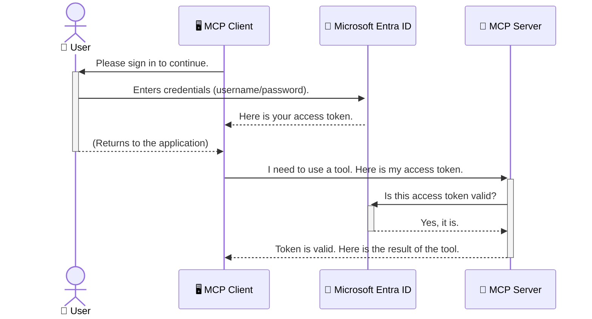

<!--
CO_OP_TRANSLATOR_METADATA:
{
  "original_hash": "6e562d7e5a77c8982da4aa8f762ad1d8",
  "translation_date": "2025-07-14T03:05:01+00:00",
  "source_file": "05-AdvancedTopics/mcp-security-entra/README.md",
  "language_code": "th"
}
-->
# การรักษาความปลอดภัยของ AI Workflows: การยืนยันตัวตน Entra ID สำหรับ Model Context Protocol Servers

## บทนำ  
การรักษาความปลอดภัยของเซิร์ฟเวอร์ Model Context Protocol (MCP) ของคุณสำคัญไม่ต่างจากการล็อกประตูหน้าบ้าน หากปล่อยให้เซิร์ฟเวอร์ MCP เปิดอยู่โดยไม่มีการป้องกัน เครื่องมือและข้อมูลของคุณอาจถูกเข้าถึงโดยไม่ได้รับอนุญาต ซึ่งอาจนำไปสู่การละเมิดความปลอดภัย Microsoft Entra ID เป็นโซลูชันการจัดการตัวตนและการเข้าถึงบนคลาวด์ที่แข็งแกร่ง ช่วยให้มั่นใจได้ว่าเฉพาะผู้ใช้และแอปพลิเคชันที่ได้รับอนุญาตเท่านั้นที่สามารถโต้ตอบกับเซิร์ฟเวอร์ MCP ของคุณได้ ในส่วนนี้ คุณจะได้เรียนรู้วิธีปกป้อง AI workflows ของคุณด้วยการยืนยันตัวตน Entra ID

## วัตถุประสงค์การเรียนรู้  
เมื่อจบส่วนนี้ คุณจะสามารถ:

- เข้าใจความสำคัญของการรักษาความปลอดภัยเซิร์ฟเวอร์ MCP  
- อธิบายพื้นฐานของ Microsoft Entra ID และการยืนยันตัวตน OAuth 2.0  
- แยกแยะความแตกต่างระหว่าง public client และ confidential client  
- นำการยืนยันตัวตน Entra ID ไปใช้ในสถานการณ์เซิร์ฟเวอร์ MCP ทั้งแบบ local (public client) และ remote (confidential client)  
- นำแนวทางปฏิบัติด้านความปลอดภัยที่ดีที่สุดไปใช้ในการพัฒนา AI workflows  

## ความปลอดภัยและ MCP  

เหมือนกับที่คุณไม่ควรปล่อยประตูหน้าบ้านเปิดทิ้งไว้ คุณก็ไม่ควรปล่อยเซิร์ฟเวอร์ MCP ของคุณเปิดให้ใครก็ได้เข้าถึง การรักษาความปลอดภัย AI workflows เป็นสิ่งจำเป็นสำหรับการสร้างแอปพลิเคชันที่แข็งแกร่ง น่าเชื่อถือ และปลอดภัย บทนี้จะแนะนำการใช้ Microsoft Entra ID เพื่อรักษาความปลอดภัยเซิร์ฟเวอร์ MCP ของคุณ เพื่อให้แน่ใจว่าเฉพาะผู้ใช้และแอปพลิเคชันที่ได้รับอนุญาตเท่านั้นที่สามารถเข้าถึงเครื่องมือและข้อมูลของคุณได้

## ทำไมความปลอดภัยจึงสำคัญสำหรับเซิร์ฟเวอร์ MCP  

ลองนึกภาพว่าเซิร์ฟเวอร์ MCP ของคุณมีเครื่องมือที่สามารถส่งอีเมลหรือเข้าถึงฐานข้อมูลลูกค้าได้ หากเซิร์ฟเวอร์ไม่มีการป้องกันใด ๆ ใครก็สามารถใช้เครื่องมือนั้นได้ ซึ่งอาจนำไปสู่การเข้าถึงข้อมูลโดยไม่ได้รับอนุญาต การส่งสแปมหรือกิจกรรมที่เป็นอันตรายอื่น ๆ

การนำการยืนยันตัวตนมาใช้จะช่วยให้มั่นใจได้ว่าทุกคำขอไปยังเซิร์ฟเวอร์ของคุณได้รับการตรวจสอบยืนยันตัวตน เพื่อยืนยันตัวตนของผู้ใช้หรือแอปพลิเคชันที่ส่งคำขอนั้น นี่คือขั้นตอนแรกและสำคัญที่สุดในการรักษาความปลอดภัย AI workflows ของคุณ

## บทนำสู่ Microsoft Entra ID  

[**Microsoft Entra ID**](https://adoption.microsoft.com/microsoft-security/entra/) คือบริการจัดการตัวตนและการเข้าถึงบนคลาวด์ เปรียบเสมือนยามรักษาความปลอดภัยสากลสำหรับแอปพลิเคชันของคุณ มันจัดการกระบวนการที่ซับซ้อนในการตรวจสอบตัวตนผู้ใช้ (authentication) และกำหนดสิ่งที่ผู้ใช้สามารถทำได้ (authorization)

ด้วยการใช้ Entra ID คุณสามารถ:

- เปิดใช้งานการลงชื่อเข้าใช้อย่างปลอดภัยสำหรับผู้ใช้  
- ปกป้อง API และบริการต่าง ๆ  
- จัดการนโยบายการเข้าถึงจากศูนย์กลาง  

สำหรับเซิร์ฟเวอร์ MCP, Entra ID เป็นโซลูชันที่แข็งแกร่งและได้รับความไว้วางใจอย่างกว้างขวางในการจัดการว่าใครสามารถเข้าถึงความสามารถของเซิร์ฟเวอร์ของคุณได้

---

## ทำความเข้าใจกลไก: การทำงานของการยืนยันตัวตน Entra ID  

Entra ID ใช้มาตรฐานเปิดอย่าง **OAuth 2.0** ในการจัดการการยืนยันตัวตน แม้ว่ารายละเอียดจะซับซ้อน แต่แนวคิดหลักนั้นง่ายและสามารถเข้าใจได้ผ่านการเปรียบเทียบ

### แนะนำ OAuth 2.0 อย่างง่าย: กุญแจวาเลต์  

ลองนึกถึง OAuth 2.0 เหมือนบริการวาเลต์สำหรับรถของคุณ เมื่อคุณไปถึงร้านอาหาร คุณไม่ได้ให้กุญแจหลักแก่พนักงานวาเลต์ แต่จะให้ **กุญแจวาเลต์** ที่มีสิทธิ์จำกัด — สามารถสตาร์ทรถและล็อกประตูได้ แต่ไม่สามารถเปิดฝากระโปรงท้ายหรือช่องเก็บของได้

ในเปรียบเทียบนี้:

- **คุณ** คือ **ผู้ใช้ (User)**  
- **รถของคุณ** คือ **เซิร์ฟเวอร์ MCP** ที่มีเครื่องมือและข้อมูลสำคัญ  
- **พนักงานวาเลต์** คือ **Microsoft Entra ID**  
- **พนักงานจอดรถ** คือ **MCP Client** (แอปพลิเคชันที่พยายามเข้าถึงเซิร์ฟเวอร์)  
- **กุญแจวาเลต์** คือ **Access Token**  

Access token คือข้อความที่ปลอดภัยซึ่ง MCP client ได้รับจาก Entra ID หลังจากที่คุณลงชื่อเข้าใช้ จากนั้น client จะส่ง token นี้ไปยังเซิร์ฟเวอร์ MCP ทุกครั้งที่มีคำขอ เซิร์ฟเวอร์สามารถตรวจสอบ token เพื่อยืนยันว่าคำขอนั้นถูกต้องและ client มีสิทธิ์ที่จำเป็น โดยไม่ต้องจัดการกับข้อมูลรับรองจริงของคุณ (เช่น รหัสผ่าน)

### กระบวนการยืนยันตัวตน  

นี่คือวิธีการทำงานในทางปฏิบัติ:



### แนะนำ Microsoft Authentication Library (MSAL)  

ก่อนที่เราจะลงลึกในโค้ด สิ่งสำคัญคือต้องแนะนำส่วนประกอบหลักที่คุณจะเห็นในตัวอย่าง: **Microsoft Authentication Library (MSAL)**

MSAL คือไลบรารีที่พัฒนาโดย Microsoft เพื่อช่วยให้นักพัฒนาจัดการการยืนยันตัวตนได้ง่ายขึ้น แทนที่คุณจะต้องเขียนโค้ดซับซ้อนทั้งหมดเพื่อจัดการโทเค็นความปลอดภัย การลงชื่อเข้าใช้ และการรีเฟรชเซสชัน MSAL จะจัดการส่วนนี้ให้

การใช้ไลบรารีอย่าง MSAL เป็นสิ่งที่แนะนำอย่างยิ่งเพราะ:

- **ปลอดภัย:** ใช้มาตรฐานอุตสาหกรรมและแนวทางปฏิบัติด้านความปลอดภัยที่ดีที่สุด ช่วยลดความเสี่ยงของช่องโหว่ในโค้ดของคุณ  
- **ช่วยให้ง่ายต่อการพัฒนา:** ซ่อนความซับซ้อนของโปรโตคอล OAuth 2.0 และ OpenID Connect ช่วยให้คุณเพิ่มการยืนยันตัวตนที่แข็งแกร่งในแอปพลิเคชันได้ด้วยโค้ดเพียงไม่กี่บรรทัด  
- **ได้รับการดูแลอย่างต่อเนื่อง:** Microsoft ดูแลและอัปเดต MSAL อย่างสม่ำเสมอเพื่อตอบสนองต่อภัยคุกคามด้านความปลอดภัยและการเปลี่ยนแปลงของแพลตฟอร์ม  

MSAL รองรับภาษาการเขียนโปรแกรมและเฟรมเวิร์กแอปพลิเคชันหลากหลาย เช่น .NET, JavaScript/TypeScript, Python, Java, Go และแพลตฟอร์มมือถืออย่าง iOS และ Android ซึ่งหมายความว่าคุณสามารถใช้รูปแบบการยืนยันตัวตนเดียวกันได้ทั่วทั้งเทคโนโลยีของคุณ

หากต้องการเรียนรู้เพิ่มเติมเกี่ยวกับ MSAL คุณสามารถดูได้ที่เอกสาร [ภาพรวม MSAL อย่างเป็นทางการ](https://learn.microsoft.com/entra/identity-platform/msal-overview)

---

## การรักษาความปลอดภัยเซิร์ฟเวอร์ MCP ของคุณด้วย Entra ID: คู่มือทีละขั้นตอน  

ตอนนี้เรามาดูวิธีการรักษาความปลอดภัยเซิร์ฟเวอร์ MCP แบบ local (ที่สื่อสารผ่าน `stdio`) โดยใช้ Entra ID ตัวอย่างนี้ใช้ **public client** ซึ่งเหมาะสำหรับแอปพลิเคชันที่รันบนเครื่องของผู้ใช้ เช่น แอปเดสก์ท็อปหรือเซิร์ฟเวอร์พัฒนาในเครื่อง

### กรณีที่ 1: การรักษาความปลอดภัยเซิร์ฟเวอร์ MCP แบบ Local (ด้วย Public Client)  

ในกรณีนี้ เราจะดูเซิร์ฟเวอร์ MCP ที่รันในเครื่อง สื่อสารผ่าน `stdio` และใช้ Entra ID เพื่อยืนยันตัวตนผู้ใช้ก่อนอนุญาตให้เข้าถึงเครื่องมือ เซิร์ฟเวอร์จะมีเครื่องมือเดียวที่ดึงข้อมูลโปรไฟล์ผู้ใช้จาก Microsoft Graph API

#### 1. การตั้งค่าแอปพลิเคชันใน Entra ID  

ก่อนเขียนโค้ด คุณต้องลงทะเบียนแอปพลิเคชันของคุณใน Microsoft Entra ID เพื่อแจ้งให้ Entra ID รู้จักแอปและอนุญาตให้ใช้บริการยืนยันตัวตน

1. ไปที่ **[Microsoft Entra portal](https://entra.microsoft.com/)**  
2. ไปที่ **App registrations** แล้วคลิก **New registration**  
3. ตั้งชื่อแอปพลิเคชันของคุณ (เช่น "My Local MCP Server")  
4. สำหรับ **Supported account types** เลือก **Accounts in this organizational directory only**  
5. สามารถเว้นว่าง **Redirect URI** ในตัวอย่างนี้ได้  
6. คลิก **Register**  

หลังจากลงทะเบียนแล้ว ให้จดจำ **Application (client) ID** และ **Directory (tenant) ID** ไว้ เพราะจะต้องใช้ในโค้ด

#### 2. โค้ด: การอธิบายส่วนสำคัญ  

มาดูส่วนสำคัญของโค้ดที่จัดการการยืนยันตัวตน โค้ดเต็มของตัวอย่างนี้อยู่ในโฟลเดอร์ [Entra ID - Local - WAM](https://github.com/Azure-Samples/mcp-auth-servers/tree/main/src/entra-id-local-wam) ใน [mcp-auth-servers GitHub repository](https://github.com/Azure-Samples/mcp-auth-servers)

**`AuthenticationService.cs`**  

คลาสนี้รับผิดชอบการติดต่อกับ Entra ID

- **`CreateAsync`**: เมธอดนี้จะสร้างอินสแตนซ์ของ `PublicClientApplication` จาก MSAL โดยตั้งค่าด้วย `clientId` และ `tenantId` ของแอปคุณ  
- **`WithBroker`**: เปิดใช้งานการใช้ broker (เช่น Windows Web Account Manager) เพื่อประสบการณ์ single sign-on ที่ปลอดภัยและราบรื่นยิ่งขึ้น  
- **`AcquireTokenAsync`**: เมธอดหลักที่พยายามรับ token แบบเงียบ (silent) ก่อน หากไม่ได้ จะขอให้ผู้ใช้ลงชื่อเข้าใช้อย่างโต้ตอบ  

```csharp
// Simplified for clarity
public static async Task<AuthenticationService> CreateAsync(ILogger<AuthenticationService> logger)
{
    var msalClient = PublicClientApplicationBuilder
        .Create(_clientId) // Your Application (client) ID
        .WithAuthority(AadAuthorityAudience.AzureAdMyOrg)
        .WithTenantId(_tenantId) // Your Directory (tenant) ID
        .WithBroker(new BrokerOptions(BrokerOptions.OperatingSystems.Windows))
        .Build();

    // ... cache registration ...

    return new AuthenticationService(logger, msalClient);
}

public async Task<string> AcquireTokenAsync()
{
    try
    {
        // Try silent authentication first
        var accounts = await _msalClient.GetAccountsAsync();
        var account = accounts.FirstOrDefault();

        AuthenticationResult? result = null;

        if (account != null)
        {
            result = await _msalClient.AcquireTokenSilent(_scopes, account).ExecuteAsync();
        }
        else
        {
            // If no account, or silent fails, go interactive
            result = await _msalClient.AcquireTokenInteractive(_scopes).ExecuteAsync();
        }

        return result.AccessToken;
    }
    catch (Exception ex)
    {
        _logger.LogError(ex, "An error occurred while acquiring the token.");
        throw; // Optionally rethrow the exception for higher-level handling
    }
}
```

**`Program.cs`**  

ไฟล์นี้ตั้งค่าเซิร์ฟเวอร์ MCP และผนวกบริการยืนยันตัวตนเข้าด้วยกัน

- **`AddSingleton<AuthenticationService>`**: ลงทะเบียน `AuthenticationService` กับ dependency injection container เพื่อให้ส่วนอื่นของแอป (เช่น เครื่องมือ) ใช้งานได้  
- **เครื่องมือ `GetUserDetailsFromGraph`**: เครื่องมือนี้ต้องการอินสแตนซ์ของ `AuthenticationService` ก่อนทำงานจะเรียก `authService.AcquireTokenAsync()` เพื่อรับ access token ที่ถูกต้อง หากยืนยันตัวตนสำเร็จ จะใช้ token นี้เรียก Microsoft Graph API เพื่อดึงข้อมูลผู้ใช้  

```csharp
// Simplified for clarity
[McpServerTool(Name = "GetUserDetailsFromGraph")]
public static async Task<string> GetUserDetailsFromGraph(
    AuthenticationService authService)
{
    try
    {
        // This will trigger the authentication flow
        var accessToken = await authService.AcquireTokenAsync();

        // Use the token to create a GraphServiceClient
        var graphClient = new GraphServiceClient(
            new BaseBearerTokenAuthenticationProvider(new TokenProvider(authService)));

        var user = await graphClient.Me.GetAsync();

        return System.Text.Json.JsonSerializer.Serialize(user);
    }
    catch (Exception ex)
    {
        return $"Error: {ex.Message}";
    }
}
```

#### 3. การทำงานร่วมกันของระบบ  

1. เมื่อ MCP client พยายามใช้เครื่องมือ `GetUserDetailsFromGraph` เครื่องมือจะเรียก `AcquireTokenAsync` ก่อน  
2. `AcquireTokenAsync` จะสั่งให้ไลบรารี MSAL ตรวจสอบ token ที่ยังใช้ได้  
3. หากไม่มี token MSAL ผ่าน broker จะขอให้ผู้ใช้ลงชื่อเข้าใช้ด้วยบัญชี Entra ID  
4. เมื่อผู้ใช้ลงชื่อเข้าใช้สำเร็จ Entra ID จะออก access token  
5. เครื่องมือรับ token และใช้เรียก Microsoft Graph API อย่างปลอดภัย  
6. ข้อมูลผู้ใช้จะถูกส่งกลับไปยัง MCP client  

กระบวนการนี้ช่วยให้มั่นใจได้ว่าเฉพาะผู้ใช้ที่ผ่านการยืนยันตัวตนเท่านั้นที่สามารถใช้เครื่องมือได้ ซึ่งช่วยรักษาความปลอดภัยเซิร์ฟเวอร์ MCP ในเครื่องของคุณ

### กรณีที่ 2: การรักษาความปลอดภัยเซิร์ฟเวอร์ MCP แบบ Remote (ด้วย Confidential Client)  

เมื่อเซิร์ฟเวอร์ MCP ของคุณรันบนเครื่องระยะไกล (เช่น เซิร์ฟเวอร์คลาวด์) และสื่อสารผ่านโปรโตคอลอย่าง HTTP Streaming ความต้องการด้านความปลอดภัยจะแตกต่างออกไป ในกรณีนี้ควรใช้ **confidential client** และ **Authorization Code Flow** ซึ่งเป็นวิธีที่ปลอดภัยกว่าเพราะความลับของแอปจะไม่ถูกเปิดเผยต่อเบราว์เซอร์

ตัวอย่างนี้ใช้เซิร์ฟเวอร์ MCP ที่เขียนด้วย TypeScript และใช้ Express.js ในการจัดการคำขอ HTTP

#### 1. การตั้งค่าแอปพลิเคชันใน Entra ID  

การตั้งค่าใน Entra ID คล้ายกับ public client แต่มีความแตกต่างสำคัญคือ คุณต้องสร้าง **client secret**

1. ไปที่ **[Microsoft Entra portal](https://entra.microsoft.com/)**  
2. ในการลงทะเบียนแอปของคุณ ไปที่แท็บ **Certificates & secrets**  
3. คลิก **New client secret** ตั้งคำอธิบาย แล้วคลิก **Add**  
4. **สำคัญ:** คัดลอกค่าของ secret ทันที เพราะจะไม่สามารถดูได้อีก  
5. คุณต้องตั้งค่า **Redirect URI** ด้วย ไปที่แท็บ **Authentication** คลิก **Add a platform** เลือก **Web** และกรอก redirect URI ของแอปคุณ (เช่น `http://localhost:3001/auth/callback`)  

> **⚠️ หมายเหตุด้านความปลอดภัยสำคัญ:** สำหรับแอปพลิเคชันในสภาพแวดล้อมจริง Microsoft แนะนำอย่างยิ่งให้ใช้วิธีการยืนยันตัวตนแบบไม่ใช้ secret เช่น **Managed Identity** หรือ **Workload Identity Federation** แทนการใช้ client secret เพราะ client secret มีความเสี่ยงด้านความปลอดภัยหากถูกเปิดเผยหรือถูกโจมตี Managed identity เป็นวิธีที่ปลอดภัยกว่าเพราะไม่ต้องเก็บข้อมูลรับรองในโค้ดหรือการตั้งค่า  
>  
> สำหรับข้อมูลเพิ่มเติมเกี่ยวกับ managed identities และวิธีใช้งาน ดูที่ [ภาพรวม Managed identities สำหรับ Azure resources](https://learn.microsoft.com/entra/identity/managed-identities-azure-resources/overview)

#### 2. โค้ด: การอธิบายส่วนสำคัญ  

ตัวอย่างนี้ใช้วิธีการจัดการ session เมื่อผู้ใช้ยืนยันตัวตน เซิร์ฟเวอร์จะเก็บ access token และ refresh token ใน session และมอบ session token ให้ผู้ใช้ จากนั้น session token นี้จะใช้สำหรับคำขอถัดไป โค้ดเต็มของตัวอย่างนี้อยู่ในโฟลเดอร์ [Entra ID - Confidential client](https://github.com/Azure-Samples/mcp-auth-servers/tree/main/src/entra-id-cca-session) ใน [mcp-auth-servers GitHub repository](https://github.com/Azure-Samples/mcp-auth-servers)

**`Server.ts`**  

ไฟล์นี้ตั้งค่า Express server และชั้นการขนส่ง MCP

- **`requireBearerAuth`**: เป็น middleware ที่ปกป้อง endpoint `/sse` และ `/message` โดยตรวจสอบ bearer token ที่ถูกต้องใน header `Authorization` ของคำขอ  
- **`EntraIdServerAuthProvider`**: คลาสที่กำหนดเองซึ่ง implements interface `McpServerAuthorizationProvider` รับผิดชอบจัดการ OAuth 2.0 flow  
- **`/auth/callback`**: endpoint ที่จัดการการ redirect จาก Entra ID หลังจากผู้ใช้ยืนยันตัวตนแล้ว โดยจะแลก authorization code เป็น access token และ refresh token  

```typescript
// Simplified for clarity
const app = express();
const { server } = createServer();
const provider = new EntraIdServerAuthProvider();

// Protect the SSE endpoint
app.get("/sse", requireBearerAuth({
  provider,
  requiredScopes: ["User.Read"]
}), async (req, res) => {
  // ... connect to the transport ...
});

// Protect the message endpoint
app.post("/message", requireBearerAuth({
  provider,
  requiredScopes: ["User.Read"]
}), async (req, res) => {
  // ... handle the message ...
});

// Handle the OAuth 2.0 callback
app.get("/auth/callback", (req, res) => {
  provider.handleCallback(req.query.code, req.query.state)
    .then(result => {
      // ... handle success or failure ...
    });
});
```

**`Tools.ts`**  

ไฟล์นี้กำหนดเครื่องมือที่เซิร์ฟเวอร์ MCP ให้บริการ เครื่องมือ `getUserDetails` คล้ายกับตัวอย่างก่อนหน้า แต่จะดึง access token จาก session

```typescript
// Simplified for clarity
server.setRequestHandler(CallToolRequestSchema, async (request) => {
  const { name } = request.params;
  const context = request.params?.context as { token?: string } | undefined;
  const sessionToken = context?.token;

  if (name === ToolName.GET_USER_DETAILS) {
    if (!sessionToken) {
      throw new AuthenticationError("Authentication token is missing or invalid. Ensure the token is provided in the request context.");
    }

    // Get the Entra ID token from the session store
    const tokenData = tokenStore.getToken(sessionToken);
    const entraIdToken = tokenData.accessToken;

    const graphClient = Client.init({
      authProvider: (done) => {
        done(null, entraIdToken);
      }
    });

    const user = await graphClient.api('/me').get();

    // ... return user details ...
  }
});
```

**`auth/EntraIdServerAuthProvider.ts`**  

คลาสนี้จัดการตรรกะสำหรับ:

- การเปลี่ยนเส้นทางผู้ใช้ไปยังหน้าลงชื่อเข้าใช้ของ Entra ID  
- การแลก authorization code เป็น access token  
- การเก็บ token ใน `tokenStore`  
- การรีเฟรช access token เมื่อหมดอายุ  

#### 3. การทำงานร่วมกันของระบบ  

1. เมื่อผู้ใช้พยายามเชื่อมต่อกับเซิร์ฟเวอร์ MCP เป็นครั้งแรก middleware `requireBearerAuth` จะตรวจสอบว่าไม่มี session ที่ถูกต้องและจะเปลี่ยนเส้นทางผู้ใช้ไปยังหน้าลงชื่อเข้าใช้ของ Entra ID  
2. ผู้ใช้ลงชื่อเข้าใช้ด้วยบัญชี Entra ID  
3. Entra ID จะเปลี่ยนเส้นทางผู้ใช้กลับมายัง endpoint `/auth/callback` พร้อมกับ authorization code
4. เซิร์ฟเวอร์จะแลกเปลี่ยนโค้ดเพื่อรับ access token และ refresh token จากนั้นเก็บข้อมูลเหล่านี้ไว้ และสร้าง session token ซึ่งจะถูกส่งไปยังไคลเอนต์  
5. ไคลเอนต์สามารถใช้ session token นี้ในส่วนหัว `Authorization` สำหรับคำขอทั้งหมดในอนาคตไปยังเซิร์ฟเวอร์ MCP  
6. เมื่อเรียกใช้เครื่องมือ `getUserDetails` จะใช้ session token เพื่อค้นหา Entra ID access token แล้วใช้ token นั้นเรียก Microsoft Graph API  

กระบวนการนี้ซับซ้อนกว่ากระบวนการของ public client แต่จำเป็นสำหรับจุดเชื่อมต่อที่เปิดเผยสู่สาธารณะ เนื่องจากเซิร์ฟเวอร์ MCP ที่เข้าถึงได้ผ่านอินเทอร์เน็ตสาธารณะ จำเป็นต้องมีมาตรการรักษาความปลอดภัยที่เข้มงวดขึ้นเพื่อป้องกันการเข้าถึงโดยไม่ได้รับอนุญาตและการโจมตีที่อาจเกิดขึ้น  

## แนวทางปฏิบัติด้านความปลอดภัยที่ดีที่สุด

- **ใช้ HTTPS เสมอ**: เข้ารหัสการสื่อสารระหว่างไคลเอนต์และเซิร์ฟเวอร์เพื่อป้องกันการดักจับ token  
- **ใช้การควบคุมการเข้าถึงตามบทบาท (RBAC)**: ไม่ใช่แค่ตรวจสอบว่า *ผู้ใช้* ได้รับการยืนยันตัวตนหรือไม่ แต่ต้องตรวจสอบด้วยว่า *ผู้ใช้* มีสิทธิ์ทำอะไรบ้าง คุณสามารถกำหนดบทบาทใน Entra ID และตรวจสอบบทบาทเหล่านั้นในเซิร์ฟเวอร์ MCP ของคุณ  
- **ตรวจสอบและบันทึกเหตุการณ์**: บันทึกเหตุการณ์การยืนยันตัวตนทั้งหมดเพื่อให้สามารถตรวจจับและตอบสนองต่อกิจกรรมที่น่าสงสัยได้  
- **จัดการการจำกัดอัตราและการหน่วงเวลา**: Microsoft Graph และ API อื่น ๆ มีการจำกัดอัตราเพื่อป้องกันการใช้งานเกินขอบเขต ให้ใช้กลไก exponential backoff และ retry ในเซิร์ฟเวอร์ MCP ของคุณเพื่อจัดการกับ HTTP 429 (Too Many Requests) อย่างเหมาะสม พิจารณาการแคชข้อมูลที่เข้าถึงบ่อยเพื่อลดจำนวนการเรียก API  
- **จัดเก็บ token อย่างปลอดภัย**: เก็บ access token และ refresh token อย่างปลอดภัย สำหรับแอปพลิเคชันในเครื่อง ให้ใช้กลไกจัดเก็บที่ปลอดภัยของระบบ สำหรับแอปพลิเคชันบนเซิร์ฟเวอร์ ให้พิจารณาใช้การจัดเก็บแบบเข้ารหัสหรือบริการจัดการกุญแจที่ปลอดภัย เช่น Azure Key Vault  
- **จัดการการหมดอายุของ token**: Access token มีอายุจำกัด ให้ตั้งค่าการรีเฟรช token อัตโนมัติด้วย refresh token เพื่อให้ผู้ใช้ไม่ต้องยืนยันตัวตนซ้ำ  
- **พิจารณาใช้ Azure API Management**: แม้ว่าการตั้งค่าความปลอดภัยโดยตรงในเซิร์ฟเวอร์ MCP จะให้การควบคุมที่ละเอียด แต่ API Gateway อย่าง Azure API Management สามารถจัดการเรื่องความปลอดภัยหลายอย่างโดยอัตโนมัติ เช่น การยืนยันตัวตน การอนุญาต การจำกัดอัตรา และการตรวจสอบ พวกมันทำหน้าที่เป็นชั้นความปลอดภัยกลางที่อยู่ระหว่างไคลเอนต์และเซิร์ฟเวอร์ MCP ของคุณ สำหรับรายละเอียดเพิ่มเติมเกี่ยวกับการใช้ API Gateway กับ MCP ดูที่ [Azure API Management Your Auth Gateway For MCP Servers](https://techcommunity.microsoft.com/blog/integrationsonazureblog/azure-api-management-your-auth-gateway-for-mcp-servers/4402690)  

## ประเด็นสำคัญที่ควรจดจำ

- การรักษาความปลอดภัยเซิร์ฟเวอร์ MCP ของคุณเป็นสิ่งสำคัญเพื่อปกป้องข้อมูลและเครื่องมือของคุณ  
- Microsoft Entra ID ให้โซลูชันที่แข็งแกร่งและปรับขนาดได้สำหรับการยืนยันตัวตนและการอนุญาต  
- ใช้ **public client** สำหรับแอปพลิเคชันในเครื่อง และใช้ **confidential client** สำหรับเซิร์ฟเวอร์ระยะไกล  
- **Authorization Code Flow** เป็นตัวเลือกที่ปลอดภัยที่สุดสำหรับเว็บแอปพลิเคชัน  

## แบบฝึกหัด

1. ลองคิดถึงเซิร์ฟเวอร์ MCP ที่คุณอาจสร้างขึ้น มันจะเป็นเซิร์ฟเวอร์ในเครื่องหรือเซิร์ฟเวอร์ระยะไกล?  
2. จากคำตอบของคุณ คุณจะใช้ public client หรือ confidential client?  
3. เซิร์ฟเวอร์ MCP ของคุณจะขอสิทธิ์อะไรบ้างเพื่อดำเนินการกับ Microsoft Graph?  

## แบบฝึกหัดปฏิบัติ

### แบบฝึกหัด 1: ลงทะเบียนแอปพลิเคชันใน Entra ID  
ไปที่พอร์ทัล Microsoft Entra  
ลงทะเบียนแอปพลิเคชันใหม่สำหรับเซิร์ฟเวอร์ MCP ของคุณ  
จดบันทึก Application (client) ID และ Directory (tenant) ID  

### แบบฝึกหัด 2: รักษาความปลอดภัยเซิร์ฟเวอร์ MCP ในเครื่อง (Public Client)  
- ทำตามตัวอย่างโค้ดเพื่อผสานรวม MSAL (Microsoft Authentication Library) สำหรับการยืนยันตัวตนของผู้ใช้  
- ทดสอบกระบวนการยืนยันตัวตนโดยเรียกใช้เครื่องมือ MCP ที่ดึงข้อมูลผู้ใช้จาก Microsoft Graph  

### แบบฝึกหัด 3: รักษาความปลอดภัยเซิร์ฟเวอร์ MCP ระยะไกล (Confidential Client)  
- ลงทะเบียน confidential client ใน Entra ID และสร้าง client secret  
- กำหนดค่าเซิร์ฟเวอร์ MCP ด้วย Express.js ให้ใช้ Authorization Code Flow  
- ทดสอบจุดเชื่อมต่อที่ได้รับการป้องกันและยืนยันการเข้าถึงด้วย token  

### แบบฝึกหัด 4: นำแนวทางปฏิบัติด้านความปลอดภัยมาใช้  
- เปิดใช้งาน HTTPS สำหรับเซิร์ฟเวอร์ในเครื่องหรือระยะไกลของคุณ  
- นำการควบคุมการเข้าถึงตามบทบาท (RBAC) มาใช้ในตรรกะของเซิร์ฟเวอร์  
- เพิ่มการจัดการการหมดอายุของ token และการจัดเก็บ token อย่างปลอดภัย  

## แหล่งข้อมูล

1. **เอกสารภาพรวม MSAL**  
   เรียนรู้ว่า Microsoft Authentication Library (MSAL) ช่วยให้การรับ token อย่างปลอดภัยข้ามแพลตฟอร์มได้อย่างไร:  
   [MSAL Overview on Microsoft Learn](https://learn.microsoft.com/en-gb/entra/msal/overview)  

2. **Azure-Samples/mcp-auth-servers GitHub Repository**  
   ตัวอย่างการใช้งานเซิร์ฟเวอร์ MCP ที่แสดงกระบวนการยืนยันตัวตน:  
   [Azure-Samples/mcp-auth-servers on GitHub](https://github.com/Azure-Samples/mcp-auth-servers)  

3. **ภาพรวม Managed Identities สำหรับ Azure Resources**  
   เข้าใจวิธีการกำจัดความลับโดยใช้ managed identities ที่กำหนดโดยระบบหรือผู้ใช้:  
   [Managed Identities Overview on Microsoft Learn](https://learn.microsoft.com/en-us/entra/identity/managed-identities-azure-resources/)  

4. **Azure API Management: Your Auth Gateway for MCP Servers**  
   เจาะลึกการใช้ APIM เป็นเกตเวย์ OAuth2 ที่ปลอดภัยสำหรับเซิร์ฟเวอร์ MCP:  
   [Azure API Management Your Auth Gateway For MCP Servers](https://techcommunity.microsoft.com/blog/integrationsonazureblog/azure-api-management-your-auth-gateway-for-mcp-servers/4402690)  

5. **Microsoft Graph Permissions Reference**  
   รายการสิทธิ์ที่มอบหมายและสิทธิ์แอปพลิเคชันสำหรับ Microsoft Graph อย่างครบถ้วน:  
   [Microsoft Graph Permissions Reference](https://learn.microsoft.com/zh-tw/graph/permissions-reference)  

## ผลลัพธ์การเรียนรู้  
หลังจากทำส่วนนี้เสร็จ คุณจะสามารถ:

- อธิบายได้ว่าทำไมการยืนยันตัวตนจึงสำคัญสำหรับเซิร์ฟเวอร์ MCP และเวิร์กโฟลว์ AI  
- ตั้งค่าและกำหนดค่าการยืนยันตัวตน Entra ID สำหรับสถานการณ์เซิร์ฟเวอร์ MCP ทั้งในเครื่องและระยะไกล  
- เลือกประเภทไคลเอนต์ที่เหมาะสม (public หรือ confidential) ตามการติดตั้งเซิร์ฟเวอร์ของคุณ  
- นำแนวทางการเขียนโค้ดที่ปลอดภัยมาใช้ รวมถึงการจัดเก็บ token และการอนุญาตตามบทบาท  
- ปกป้องเซิร์ฟเวอร์ MCP และเครื่องมือของคุณจากการเข้าถึงโดยไม่ได้รับอนุญาตอย่างมั่นใจ  

## ขั้นตอนถัดไป

- [5.13 Model Context Protocol (MCP) Integration with Azure AI Foundry](../mcp-foundry-agent-integration/README.md)

**ข้อจำกัดความรับผิดชอบ**:  
เอกสารนี้ได้รับการแปลโดยใช้บริการแปลภาษาอัตโนมัติ [Co-op Translator](https://github.com/Azure/co-op-translator) แม้เราจะพยายามให้ความถูกต้องสูงสุด แต่โปรดทราบว่าการแปลอัตโนมัติอาจมีข้อผิดพลาดหรือความไม่ถูกต้อง เอกสารต้นฉบับในภาษาต้นทางถือเป็นแหล่งข้อมูลที่เชื่อถือได้ สำหรับข้อมูลที่สำคัญ ขอแนะนำให้ใช้บริการแปลโดยผู้เชี่ยวชาญมนุษย์ เราไม่รับผิดชอบต่อความเข้าใจผิดหรือการตีความผิดที่เกิดขึ้นจากการใช้การแปลนี้