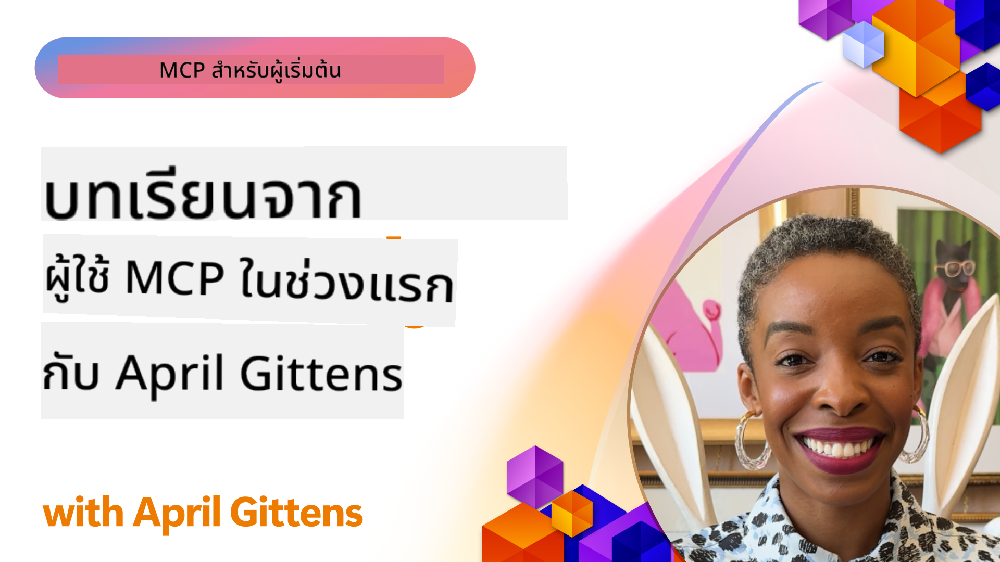

<!--
CO_OP_TRANSLATOR_METADATA:
{
  "original_hash": "41f16dac486d2086a53bc644a01cbe42",
  "translation_date": "2025-08-18T14:15:08+00:00",
  "source_file": "07-LessonsfromEarlyAdoption/README.md",
  "language_code": "th"
}
-->
# 🌟 บทเรียนจากผู้ใช้งานกลุ่มแรก

[](https://youtu.be/jds7dSmNptE)

_(คลิกที่ภาพด้านบนเพื่อดูวิดีโอของบทเรียนนี้)_

## 🎯 สิ่งที่โมดูลนี้ครอบคลุม

โมดูลนี้สำรวจว่าองค์กรและนักพัฒนาจริง ๆ ใช้ Model Context Protocol (MCP) เพื่อแก้ปัญหาและขับเคลื่อนนวัตกรรมอย่างไร ผ่านกรณีศึกษาและโครงการเชิงปฏิบัติ คุณจะได้ค้นพบว่า MCP ช่วยให้การผสาน AI ที่ปลอดภัยและขยายตัวได้ง่าย ซึ่งเชื่อมโยงโมเดลภาษา เครื่องมือ และข้อมูลขององค์กรได้อย่างไร

### 📚 ดู MCP ในการใช้งานจริง

อยากเห็นหลักการเหล่านี้ถูกนำไปใช้ในเครื่องมือที่พร้อมใช้งานจริงหรือไม่? ลองดู [**10 Microsoft MCP Servers ที่เปลี่ยนแปลงประสิทธิภาพของนักพัฒนา**](microsoft-mcp-servers.md) ซึ่งแสดงตัวอย่าง MCP Servers ของ Microsoft ที่คุณสามารถใช้งานได้ในวันนี้

## ภาพรวม

บทเรียนนี้สำรวจว่า ผู้ใช้งานกลุ่มแรกใช้ Model Context Protocol (MCP) เพื่อแก้ปัญหาในโลกจริงและขับเคลื่อนนวัตกรรมในอุตสาหกรรมต่าง ๆ อย่างไร ผ่านกรณีศึกษาและโครงการเชิงปฏิบัติ คุณจะได้เห็นว่า MCP ช่วยให้การผสาน AI ที่เป็นมาตรฐาน ปลอดภัย และขยายตัวได้ง่าย—เชื่อมโยงโมเดลภาษาขนาดใหญ่ เครื่องมือ และข้อมูลขององค์กรในกรอบการทำงานเดียวกันได้อย่างไร คุณจะได้รับประสบการณ์จริงในการออกแบบและสร้างโซลูชันที่ใช้ MCP เรียนรู้จากรูปแบบการใช้งานที่พิสูจน์แล้ว และค้นพบแนวทางปฏิบัติที่ดีที่สุดสำหรับการปรับใช้ MCP ในสภาพแวดล้อมการผลิต บทเรียนยังเน้นถึงแนวโน้มที่เกิดขึ้นใหม่ ทิศทางในอนาคต และทรัพยากรโอเพ่นซอร์สเพื่อช่วยให้คุณก้าวล้ำหน้าในเทคโนโลยี MCP และระบบนิเวศที่กำลังพัฒนา

## วัตถุประสงค์การเรียนรู้

- วิเคราะห์การใช้งาน MCP ในโลกจริงในอุตสาหกรรมต่าง ๆ
- ออกแบบและสร้างแอปพลิเคชันที่ใช้ MCP อย่างสมบูรณ์
- สำรวจแนวโน้มที่เกิดขึ้นใหม่และทิศทางในอนาคตของเทคโนโลยี MCP
- ใช้แนวทางปฏิบัติที่ดีที่สุดในสถานการณ์การพัฒนาจริง

## การใช้งาน MCP ในโลกจริง

### กรณีศึกษา 1: การทำงานอัตโนมัติของฝ่ายสนับสนุนลูกค้าในองค์กร

บริษัทข้ามชาติได้ใช้โซลูชันที่ใช้ MCP เพื่อสร้างมาตรฐานการโต้ตอบ AI ในระบบสนับสนุนลูกค้าของพวกเขา สิ่งนี้ช่วยให้พวกเขา:

- สร้างอินเทอร์เฟซที่เป็นหนึ่งเดียวสำหรับผู้ให้บริการ LLM หลายราย
- รักษาการจัดการ prompt ที่สอดคล้องกันในทุกแผนก
- ใช้การควบคุมความปลอดภัยและการปฏิบัติตามข้อกำหนดที่แข็งแกร่ง
- สลับระหว่างโมเดล AI ต่าง ๆ ได้อย่างง่ายดายตามความต้องการเฉพาะ

**การดำเนินการทางเทคนิค:**

```python
# Python MCP server implementation for customer support
import logging
import asyncio
from modelcontextprotocol import create_server, ServerConfig
from modelcontextprotocol.server import MCPServer
from modelcontextprotocol.transports import create_http_transport
from modelcontextprotocol.resources import ResourceDefinition
from modelcontextprotocol.prompts import PromptDefinition
from modelcontextprotocol.tool import ToolDefinition

# Configure logging
logging.basicConfig(level=logging.INFO)

async def main():
    # Create server configuration
    config = ServerConfig(
        name="Enterprise Customer Support Server",
        version="1.0.0",
        description="MCP server for handling customer support inquiries"
    )
    
    # Initialize MCP server
    server = create_server(config)
    
    # Register knowledge base resources
    server.resources.register(
        ResourceDefinition(
            name="customer_kb",
            description="Customer knowledge base documentation"
        ),
        lambda params: get_customer_documentation(params)
    )
    
    # Register prompt templates
    server.prompts.register(
        PromptDefinition(
            name="support_template",
            description="Templates for customer support responses"
        ),
        lambda params: get_support_templates(params)
    )
    
    # Register support tools
    server.tools.register(
        ToolDefinition(
            name="ticketing",
            description="Create and update support tickets"
        ),
        handle_ticketing_operations
    )
    
    # Start server with HTTP transport
    transport = create_http_transport(port=8080)
    await server.run(transport)

if __name__ == "__main__":
    asyncio.run(main())
```

**ผลลัพธ์:** ลดค่าใช้จ่ายของโมเดลลง 30% ปรับปรุงความสม่ำเสมอของการตอบสนอง 45% และเพิ่มการปฏิบัติตามข้อกำหนดในระดับโลก

### กรณีศึกษา 2: ผู้ช่วยวินิจฉัยทางการแพทย์

ผู้ให้บริการด้านสุขภาพได้พัฒนาโครงสร้างพื้นฐาน MCP เพื่อผสานรวมโมเดล AI ทางการแพทย์เฉพาะทางหลายตัว ในขณะที่ยังคงปกป้องข้อมูลผู้ป่วยที่ละเอียดอ่อน:

- การสลับระหว่างโมเดลทางการแพทย์ทั่วไปและเฉพาะทางได้อย่างราบรื่น
- การควบคุมความเป็นส่วนตัวและบันทึกการตรวจสอบที่เข้มงวด
- การผสานรวมกับระบบบันทึกสุขภาพอิเล็กทรอนิกส์ (EHR) ที่มีอยู่
- การออกแบบ prompt ที่สอดคล้องกันสำหรับคำศัพท์ทางการแพทย์

**การดำเนินการทางเทคนิค:**

```csharp
// C# MCP host application implementation in healthcare application
using Microsoft.Extensions.DependencyInjection;
using ModelContextProtocol.SDK.Client;
using ModelContextProtocol.SDK.Security;
using ModelContextProtocol.SDK.Resources;

public class DiagnosticAssistant
{
    private readonly MCPHostClient _mcpClient;
    private readonly PatientContext _patientContext;
    
    public DiagnosticAssistant(PatientContext patientContext)
    {
        _patientContext = patientContext;
        
        // Configure MCP client with healthcare-specific settings
        var clientOptions = new ClientOptions
        {
            Name = "Healthcare Diagnostic Assistant",
            Version = "1.0.0",
            Security = new SecurityOptions
            {
                Encryption = EncryptionLevel.Medical,
                AuditEnabled = true
            }
        };
        
        _mcpClient = new MCPHostClientBuilder()
            .WithOptions(clientOptions)
            .WithTransport(new HttpTransport("https://healthcare-mcp.example.org"))
            .WithAuthentication(new HIPAACompliantAuthProvider())
            .Build();
    }
    
    public async Task<DiagnosticSuggestion> GetDiagnosticAssistance(
        string symptoms, string patientHistory)
    {
        // Create request with appropriate resources and tool access
        var resourceRequest = new ResourceRequest
        {
            Name = "patient_records",
            Parameters = new Dictionary<string, object>
            {
                ["patientId"] = _patientContext.PatientId,
                ["requestingProvider"] = _patientContext.ProviderId
            }
        };
        
        // Request diagnostic assistance using appropriate prompt
        var response = await _mcpClient.SendPromptRequestAsync(
            promptName: "diagnostic_assistance",
            parameters: new Dictionary<string, object>
            {
                ["symptoms"] = symptoms,
                patientHistory = patientHistory,
                relevantGuidelines = _patientContext.GetRelevantGuidelines()
            });
            
        return DiagnosticSuggestion.FromMCPResponse(response);
    }
}
```

**ผลลัพธ์:** ปรับปรุงคำแนะนำการวินิจฉัยสำหรับแพทย์ในขณะที่ยังคงปฏิบัติตามข้อกำหนด HIPAA อย่างสมบูรณ์ และลดการสลับบริบทระหว่างระบบอย่างมีนัยสำคัญ

### กรณีศึกษา 3: การวิเคราะห์ความเสี่ยงในบริการทางการเงิน

สถาบันการเงินได้ใช้ MCP เพื่อสร้างมาตรฐานกระบวนการวิเคราะห์ความเสี่ยงในแผนกต่าง ๆ:

- สร้างอินเทอร์เฟซที่เป็นหนึ่งเดียวสำหรับโมเดลความเสี่ยงด้านเครดิต การตรวจจับการฉ้อโกง และการลงทุน
- ใช้การควบคุมการเข้าถึงที่เข้มงวดและการจัดการเวอร์ชันของโมเดล
- รับรองความสามารถในการตรวจสอบคำแนะนำของ AI ทั้งหมด
- รักษารูปแบบข้อมูลที่สอดคล้องกันในระบบที่หลากหลาย

**การดำเนินการทางเทคนิค:**

```java
// Java MCP server for financial risk assessment
import org.mcp.server.*;
import org.mcp.security.*;

public class FinancialRiskMCPServer {
    public static void main(String[] args) {
        // Create MCP server with financial compliance features
        MCPServer server = new MCPServerBuilder()
            .withModelProviders(
                new ModelProvider("risk-assessment-primary", new AzureOpenAIProvider()),
                new ModelProvider("risk-assessment-audit", new LocalLlamaProvider())
            )
            .withPromptTemplateDirectory("./compliance/templates")
            .withAccessControls(new SOCCompliantAccessControl())
            .withDataEncryption(EncryptionStandard.FINANCIAL_GRADE)
            .withVersionControl(true)
            .withAuditLogging(new DatabaseAuditLogger())
            .build();
            
        server.addRequestValidator(new FinancialDataValidator());
        server.addResponseFilter(new PII_RedactionFilter());
        
        server.start(9000);
        
        System.out.println("Financial Risk MCP Server running on port 9000");
    }
}
```

**ผลลัพธ์:** เพิ่มการปฏิบัติตามข้อกำหนดด้านกฎระเบียบ วงจรการปรับใช้โมเดลเร็วขึ้น 40% และปรับปรุงความสม่ำเสมอในการประเมินความเสี่ยงในแผนกต่าง ๆ

### กรณีศึกษา 4: Microsoft Playwright MCP Server สำหรับการทำงานอัตโนมัติของเบราว์เซอร์

Microsoft ได้พัฒนา [Playwright MCP server](https://github.com/microsoft/playwright-mcp) เพื่อเปิดใช้งานการทำงานอัตโนมัติของเบราว์เซอร์ที่ปลอดภัยและเป็นมาตรฐานผ่าน Model Context Protocol เซิร์ฟเวอร์ที่พร้อมใช้งานจริงนี้ช่วยให้ตัวแทน AI และ LLMs โต้ตอบกับเว็บเบราว์เซอร์ในลักษณะที่ควบคุมได้ ตรวจสอบได้ และขยายได้ง่าย—เปิดใช้งานกรณีการใช้งาน เช่น การทดสอบเว็บอัตโนมัติ การดึงข้อมูล และเวิร์กโฟลว์แบบครบวงจร

> **🎯 เครื่องมือที่พร้อมใช้งานจริง**
> 
> กรณีศึกษานี้แสดง MCP server จริงที่คุณสามารถใช้งานได้ในวันนี้! เรียนรู้เพิ่มเติมเกี่ยวกับ Playwright MCP Server และ MCP servers อื่น ๆ อีก 9 ตัวใน [**Microsoft MCP Servers Guide**](microsoft-mcp-servers.md#8--playwright-mcp-server)

**คุณสมบัติหลัก:**
- เปิดใช้งานความสามารถในการทำงานอัตโนมัติของเบราว์เซอร์ (การนำทาง การกรอกแบบฟอร์ม การจับภาพหน้าจอ ฯลฯ) เป็นเครื่องมือ MCP
- ใช้การควบคุมการเข้าถึงที่เข้มงวดและการแซนด์บ็อกซ์เพื่อป้องกันการกระทำที่ไม่ได้รับอนุญาต
- ให้บันทึกการตรวจสอบโดยละเอียดสำหรับการโต้ตอบของเบราว์เซอร์ทั้งหมด
- รองรับการผสานรวมกับ Azure OpenAI และผู้ให้บริการ LLM อื่น ๆ สำหรับการทำงานอัตโนมัติที่ขับเคลื่อนด้วยตัวแทน
- ขับเคลื่อนความสามารถในการเรียกดูเว็บของ GitHub Copilot

**การดำเนินการทางเทคนิค:**

```typescript
// TypeScript: Registering Playwright browser automation tools in an MCP server
import { createServer, ToolDefinition } from 'modelcontextprotocol';
import { launch } from 'playwright';

const server = createServer({
  name: 'Playwright MCP Server',
  version: '1.0.0',
  description: 'MCP server for browser automation using Playwright'
});

// Register a tool for navigating to a URL and capturing a screenshot
server.tools.register(
  new ToolDefinition({
    name: 'navigate_and_screenshot',
    description: 'Navigate to a URL and capture a screenshot',
    parameters: {
      url: { type: 'string', description: 'The URL to visit' }
    }
  }),
  async ({ url }) => {
    const browser = await launch();
    const page = await browser.newPage();
    await page.goto(url);
    const screenshot = await page.screenshot();
    await browser.close();
    return { screenshot };
  }
);

// Start the MCP server
server.listen(8080);
```

**ผลลัพธ์:**

- เปิดใช้งานการทำงานอัตโนมัติของเบราว์เซอร์แบบโปรแกรมที่ปลอดภัยสำหรับตัวแทน AI และ LLMs
- ลดความพยายามในการทดสอบด้วยตนเองและปรับปรุงความครอบคลุมของการทดสอบสำหรับแอปพลิเคชันเว็บ
- ให้กรอบการทำงานที่นำกลับมาใช้ใหม่ได้และขยายได้สำหรับการผสานรวมเครื่องมือที่ใช้เบราว์เซอร์ในสภาพแวดล้อมองค์กร
- ขับเคลื่อนความสามารถในการเรียกดูเว็บของ GitHub Copilot

**แหล่งข้อมูลอ้างอิง:**

- [Playwright MCP Server GitHub Repository](https://github.com/microsoft/playwright-mcp)
- [Microsoft AI and Automation Solutions](https://azure.microsoft.com/en-us/products/ai-services/)

... (เนื้อหาที่เหลือยังคงแปลในลักษณะเดียวกัน)
> **🎯 เครื่องมือพร้อมใช้งานในงานจริง**  
>  
> นี่คือ MCP server ที่คุณสามารถใช้งานได้ทันที! เรียนรู้เพิ่มเติมเกี่ยวกับ Microsoft Learn Docs MCP Server ได้ใน [**คู่มือ Microsoft MCP Servers**](microsoft-mcp-servers.md#1--microsoft-learn-docs-mcp-server).
**คุณสมบัติเด่น:**
- เข้าถึงเอกสารทางการของ Microsoft, เอกสาร Azure และ Microsoft 365 ได้แบบเรียลไทม์
- ความสามารถในการค้นหาเชิงความหมายขั้นสูงที่เข้าใจบริบทและเจตนา
- ข้อมูลที่อัปเดตอยู่เสมอเมื่อมีการเผยแพร่เนื้อหา Microsoft Learn
- ครอบคลุมเนื้อหาอย่างครบถ้วนจาก Microsoft Learn, เอกสาร Azure และแหล่งข้อมูล Microsoft 365
- ส่งคืนเนื้อหาคุณภาพสูงได้สูงสุด 10 ส่วน พร้อมชื่อบทความและ URL

**เหตุผลที่สำคัญ:**
- แก้ปัญหา "ความรู้ AI ที่ล้าสมัย" สำหรับเทคโนโลยีของ Microsoft
- ทำให้ผู้ช่วย AI เข้าถึงคุณสมบัติ .NET, C#, Azure และ Microsoft 365 ล่าสุดได้
- ให้ข้อมูลที่เชื่อถือได้จากแหล่งข้อมูลทางการเพื่อการสร้างโค้ดที่แม่นยำ
- จำเป็นสำหรับนักพัฒนาที่ทำงานกับเทคโนโลยี Microsoft ที่เปลี่ยนแปลงอย่างรวดเร็ว

**ผลลัพธ์:**
- เพิ่มความแม่นยำของโค้ดที่สร้างโดย AI สำหรับเทคโนโลยี Microsoft อย่างมาก
- ลดเวลาที่ใช้ในการค้นหาเอกสารและแนวปฏิบัติที่ดีที่สุด
- เพิ่มประสิทธิภาพของนักพัฒนาด้วยการดึงเอกสารที่เข้าใจบริบท
- ผสานรวมกับเวิร์กโฟลว์การพัฒนาได้อย่างราบรื่นโดยไม่ต้องออกจาก IDE

**แหล่งข้อมูลอ้างอิง:**
- [Microsoft Learn Docs MCP Server GitHub Repository](https://github.com/MicrosoftDocs/mcp)
- [Microsoft Learn Documentation](https://learn.microsoft.com/)

## โครงการแบบลงมือปฏิบัติ

### โครงการที่ 1: สร้าง MCP Server แบบหลายผู้ให้บริการ

**เป้าหมาย:** สร้าง MCP server ที่สามารถกำหนดเส้นทางคำขอไปยังผู้ให้บริการโมเดล AI หลายรายตามเกณฑ์ที่กำหนด

**ข้อกำหนด:**

- รองรับผู้ให้บริการโมเดลอย่างน้อยสามราย (เช่น OpenAI, Anthropic, โมเดลในเครื่อง)
- ใช้กลไกการกำหนดเส้นทางตามเมตาดาตาของคำขอ
- สร้างระบบการกำหนดค่าที่จัดการข้อมูลประจำตัวของผู้ให้บริการ
- เพิ่มการแคชเพื่อเพิ่มประสิทธิภาพและลดค่าใช้จ่าย
- สร้างแดชบอร์ดง่ายๆ สำหรับการตรวจสอบการใช้งาน

**ขั้นตอนการพัฒนา:**

1. ตั้งค่าโครงสร้างพื้นฐานพื้นฐานของ MCP server
2. พัฒนา adapter สำหรับผู้ให้บริการโมเดล AI แต่ละราย
3. สร้างตรรกะการกำหนดเส้นทางตามคุณลักษณะของคำขอ
4. เพิ่มกลไกการแคชสำหรับคำขอที่ใช้บ่อย
5. พัฒนาแดชบอร์ดสำหรับการตรวจสอบ
6. ทดสอบด้วยรูปแบบคำขอที่หลากหลาย

**เทคโนโลยี:** เลือกใช้ Python (.NET/Java/Python ตามความถนัด), Redis สำหรับการแคช และเฟรมเวิร์กเว็บง่ายๆ สำหรับแดชบอร์ด

### โครงการที่ 2: ระบบจัดการ Prompt สำหรับองค์กร

**เป้าหมาย:** พัฒนาระบบที่ใช้ MCP สำหรับจัดการ การกำหนดเวอร์ชัน และการปรับใช้แม่แบบ prompt ในองค์กร

**ข้อกำหนด:**

- สร้างที่เก็บข้อมูลส่วนกลางสำหรับแม่แบบ prompt
- ใช้ระบบการกำหนดเวอร์ชันและเวิร์กโฟลว์การอนุมัติ
- สร้างความสามารถในการทดสอบแม่แบบด้วยตัวอย่างอินพุต
- พัฒนาการควบคุมการเข้าถึงตามบทบาท
- สร้าง API สำหรับการดึงและปรับใช้แม่แบบ

**ขั้นตอนการพัฒนา:**

1. ออกแบบ schema ฐานข้อมูลสำหรับจัดเก็บแม่แบบ
2. สร้าง API หลักสำหรับการดำเนินการ CRUD ของแม่แบบ
3. ใช้ระบบการกำหนดเวอร์ชัน
4. พัฒนาเวิร์กโฟลว์การอนุมัติ
5. สร้างเฟรมเวิร์กการทดสอบ
6. สร้างอินเทอร์เฟซเว็บง่ายๆ สำหรับการจัดการ
7. ผสานรวมกับ MCP server

**เทคโนโลยี:** เลือกใช้เฟรมเวิร์ก backend, ฐานข้อมูล SQL หรือ NoSQL และเฟรมเวิร์ก frontend สำหรับอินเทอร์เฟซการจัดการ

### โครงการที่ 3: แพลตฟอร์มสร้างเนื้อหาที่ใช้ MCP

**เป้าหมาย:** สร้างแพลตฟอร์มสร้างเนื้อหาที่ใช้ MCP เพื่อให้ได้ผลลัพธ์ที่สม่ำเสมอในเนื้อหาประเภทต่างๆ

**ข้อกำหนด:**

- รองรับรูปแบบเนื้อหาหลายประเภท (บทความบล็อก โซเชียลมีเดีย ข้อความการตลาด)
- ใช้การสร้างตามแม่แบบพร้อมตัวเลือกการปรับแต่ง
- สร้างระบบตรวจสอบและให้ข้อเสนอแนะเกี่ยวกับเนื้อหา
- ติดตามเมตริกประสิทธิภาพของเนื้อหา
- รองรับการกำหนดเวอร์ชันและการปรับปรุงเนื้อหา

**ขั้นตอนการพัฒนา:**

1. ตั้งค่าโครงสร้างพื้นฐานของ MCP client
2. สร้างแม่แบบสำหรับเนื้อหาประเภทต่างๆ
3. สร้าง pipeline การสร้างเนื้อหา
4. ใช้ระบบตรวจสอบ
5. พัฒนาระบบติดตามเมตริก
6. สร้างอินเทอร์เฟซผู้ใช้สำหรับการจัดการแม่แบบและการสร้างเนื้อหา

**เทคโนโลยี:** เลือกใช้ภาษาการเขียนโปรแกรม เฟรมเวิร์กเว็บ และระบบฐานข้อมูลที่คุณถนัด

## ทิศทางในอนาคตของเทคโนโลยี MCP

### แนวโน้มที่กำลังเกิดขึ้น

1. **MCP แบบหลายโมดอล**
   - ขยาย MCP เพื่อมาตรฐานการโต้ตอบกับโมเดลภาพ เสียง และวิดีโอ
   - พัฒนาความสามารถในการให้เหตุผลข้ามโมดอล
   - มาตรฐานรูปแบบ prompt สำหรับโมดอลต่างๆ

2. **โครงสร้างพื้นฐาน MCP แบบกระจาย**
   - เครือข่าย MCP แบบกระจายที่สามารถแชร์ทรัพยากรระหว่างองค์กร
   - โปรโตคอลมาตรฐานสำหรับการแชร์โมเดลอย่างปลอดภัย
   - เทคนิคการคำนวณที่รักษาความเป็นส่วนตัว

3. **ตลาด MCP**
   - ระบบนิเวศสำหรับการแชร์และสร้างรายได้จากแม่แบบ MCP และปลั๊กอิน
   - กระบวนการรับรองคุณภาพและการรับรอง
   - การผสานรวมกับตลาดโมเดล

4. **MCP สำหรับ Edge Computing**
   - การปรับมาตรฐาน MCP สำหรับอุปกรณ์ Edge ที่มีทรัพยากรจำกัด
   - โปรโตคอลที่ปรับให้เหมาะสมสำหรับสภาพแวดล้อมที่มีแบนด์วิดท์ต่ำ
   - การใช้งาน MCP เฉพาะสำหรับระบบ IoT

5. **กรอบการกำกับดูแล**
   - การพัฒนา MCP ส่วนขยายสำหรับการปฏิบัติตามข้อกำหนด
   - เส้นทางการตรวจสอบและอินเทอร์เฟซที่อธิบายได้มาตรฐาน
   - การผสานรวมกับกรอบการกำกับดูแล AI ที่เกิดขึ้นใหม่

### โซลูชัน MCP จาก Microsoft

Microsoft และ Azure ได้พัฒนา repository โอเพ่นซอร์สหลายแห่งเพื่อช่วยนักพัฒนานำ MCP ไปใช้ในสถานการณ์ต่างๆ:

#### องค์กร Microsoft

1. [playwright-mcp](https://github.com/microsoft/playwright-mcp) - MCP server สำหรับการทดสอบและระบบอัตโนมัติของเบราว์เซอร์
2. [files-mcp-server](https://github.com/microsoft/files-mcp-server) - การใช้งาน MCP server ของ OneDrive สำหรับการทดสอบในเครื่องและการสนับสนุนจากชุมชน
3. [NLWeb](https://github.com/microsoft/NlWeb) - โปรโตคอลเปิดและเครื่องมือโอเพ่นซอร์สที่เกี่ยวข้องสำหรับการสร้างชั้นพื้นฐานสำหรับ AI Web

#### องค์กร Azure-Samples

1. [mcp](https://github.com/Azure-Samples/mcp) - ลิงก์ไปยังตัวอย่าง เครื่องมือ และทรัพยากรสำหรับการสร้างและผสานรวม MCP server บน Azure
2. [mcp-auth-servers](https://github.com/Azure-Samples/mcp-auth-servers) - ตัวอย่าง MCP server ที่แสดงการตรวจสอบสิทธิ์ด้วยสเปค MCP ปัจจุบัน
3. [remote-mcp-functions](https://github.com/Azure-Samples/remote-mcp-functions) - หน้า Landing Page สำหรับการใช้งาน Remote MCP Server บน Azure Functions
4. [remote-mcp-functions-python](https://github.com/Azure-Samples/remote-mcp-functions-python) - แม่แบบเริ่มต้นสำหรับการสร้างและปรับใช้ Remote MCP Server ด้วย Azure Functions และ Python
5. [remote-mcp-functions-dotnet](https://github.com/Azure-Samples/remote-mcp-functions-dotnet) - แม่แบบเริ่มต้นสำหรับการสร้างและปรับใช้ Remote MCP Server ด้วย Azure Functions และ .NET/C#
6. [remote-mcp-functions-typescript](https://github.com/Azure-Samples/remote-mcp-functions-typescript) - แม่แบบเริ่มต้นสำหรับการสร้างและปรับใช้ Remote MCP Server ด้วย Azure Functions และ TypeScript
7. [remote-mcp-apim-functions-python](https://github.com/Azure-Samples/remote-mcp-apim-functions-python) - การใช้ Azure API Management เป็น AI Gateway สำหรับ Remote MCP Server ด้วย Python
8. [AI-Gateway](https://github.com/Azure-Samples/AI-Gateway) - การทดลอง APIM ❤️ AI รวมถึงความสามารถ MCP และการผสานรวมกับ Azure OpenAI

repository เหล่านี้ให้การใช้งาน แม่แบบ และทรัพยากรต่างๆ สำหรับการทำงานกับ Model Context Protocol ในภาษาการเขียนโปรแกรมและบริการ Azure ที่หลากหลาย ครอบคลุมกรณีการใช้งานตั้งแต่การใช้งาน server พื้นฐานไปจนถึงการตรวจสอบสิทธิ์ การปรับใช้บนคลาวด์ และการผสานรวมระดับองค์กร

#### ไดเรกทอรีทรัพยากร MCP

[ไดเรกทอรีทรัพยากร MCP](https://github.com/microsoft/mcp/tree/main/Resources) ใน repository ทางการของ Microsoft MCP มีตัวอย่างทรัพยากร แม่แบบ prompt และคำจำกัดความของเครื่องมือที่คัดสรรมาเพื่อใช้กับ MCP server ไดเรกทอรีนี้ออกแบบมาเพื่อช่วยนักพัฒนาเริ่มต้นใช้งาน MCP ได้อย่างรวดเร็วโดยนำเสนอส่วนประกอบที่นำกลับมาใช้ใหม่ได้และตัวอย่างแนวปฏิบัติที่ดีที่สุด

- **แม่แบบ Prompt:** แม่แบบ prompt ที่พร้อมใช้งานสำหรับงาน AI และสถานการณ์ทั่วไป ซึ่งสามารถปรับให้เหมาะกับการใช้งาน MCP server ของคุณเอง
- **คำจำกัดความของเครื่องมือ:** ตัวอย่าง schema เครื่องมือและเมตาดาตาเพื่อมาตรฐานการผสานรวมและการเรียกใช้เครื่องมือใน MCP server ต่างๆ
- **ตัวอย่างทรัพยากร:** ตัวอย่างคำจำกัดความของทรัพยากรสำหรับการเชื่อมต่อกับแหล่งข้อมูล API และบริการภายนอกภายในกรอบ MCP
- **การใช้งานอ้างอิง:** ตัวอย่างเชิงปฏิบัติที่แสดงวิธีการจัดโครงสร้างและจัดระเบียบทรัพยากร prompt และเครื่องมือในโครงการ MCP จริง

ทรัพยากรเหล่านี้ช่วยเร่งการพัฒนา ส่งเสริมมาตรฐาน และช่วยให้แน่ใจว่าเป็นแนวปฏิบัติที่ดีที่สุดเมื่อสร้างและปรับใช้โซลูชันที่ใช้ MCP

#### ไดเรกทอรีทรัพยากร MCP

- [MCP Resources (Sample Prompts, Tools, and Resource Definitions)](https://github.com/microsoft/mcp/tree/main/Resources)

### โอกาสในการวิจัย

- เทคนิคการเพิ่มประสิทธิภาพ prompt ภายในกรอบ MCP
- โมเดลความปลอดภัยสำหรับการปรับใช้ MCP แบบหลายผู้เช่า
- การเปรียบเทียบประสิทธิภาพระหว่างการใช้งาน MCP ต่างๆ
- วิธีการตรวจสอบอย่างเป็นทางการสำหรับ MCP server

## บทสรุป

Model Context Protocol (MCP) กำลังมีบทบาทสำคัญในการกำหนดอนาคตของการผสานรวม AI ที่มีมาตรฐาน ปลอดภัย และสามารถทำงานร่วมกันได้ในอุตสาหกรรมต่างๆ ผ่านกรณีศึกษาและโครงการแบบลงมือปฏิบัติในบทเรียนนี้ คุณได้เห็นว่าผู้ใช้งานในระยะแรก รวมถึง Microsoft และ Azure ใช้ MCP เพื่อแก้ปัญหาในโลกจริง เร่งการนำ AI มาใช้ และรับรองการปฏิบัติตามข้อกำหนด ความปลอดภัย และความสามารถในการปรับขยายได้อย่างไร แนวทางแบบโมดูลาร์ของ MCP ช่วยให้องค์กรสามารถเชื่อมต่อโมเดลภาษาขนาดใหญ่ เครื่องมือ และข้อมูลขององค์กรในกรอบงานที่รวมเป็นหนึ่งและสามารถตรวจสอบได้ ในขณะที่ MCP ยังคงพัฒนา การมีส่วนร่วมกับชุมชน การสำรวจทรัพยากรโอเพ่นซอร์ส และการนำแนวปฏิบัติที่ดีที่สุดไปใช้จะเป็นกุญแจสำคัญในการสร้างโซลูชัน AI ที่แข็งแกร่งและพร้อมสำหรับอนาคต

## ทรัพยากรเพิ่มเติม

- [MCP Foundry GitHub Repository](https://github.com/azure-ai-foundry/mcp-foundry)
- [Foundry MCP Playground](https://github.com/azure-ai-foundry/foundry-mcp-playground)
- [Integrating Azure AI Agents with MCP (Microsoft Foundry Blog)](https://devblogs.microsoft.com/foundry/integrating-azure-ai-agents-mcp/)
- [MCP GitHub Repository (Microsoft)](https://github.com/microsoft/mcp)
- [MCP Resources Directory (Sample Prompts, Tools, and Resource Definitions)](https://github.com/microsoft/mcp/tree/main/Resources)
- [MCP Community & Documentation](https://modelcontextprotocol.io/introduction)
- [Azure MCP Documentation](https://aka.ms/azmcp)
- [Playwright MCP Server GitHub Repository](https://github.com/microsoft/playwright-mcp)
- [Files MCP Server (OneDrive)](https://github.com/microsoft/files-mcp-server)
- [Azure-Samples MCP](https://github.com/Azure-Samples/mcp)
- [MCP Auth Servers (Azure-Samples)](https://github.com/Azure-Samples/mcp-auth-servers)
- [Remote MCP Functions (Azure-Samples)](https://github.com/Azure-Samples/remote-mcp-functions)
- [Remote MCP Functions Python (Azure-Samples)](https://github.com/Azure-Samples/remote-mcp-functions-python)
- [Remote MCP Functions .NET (Azure-Samples)](https://github.com/Azure-Samples/remote-mcp-functions-dotnet)
- [Remote MCP Functions TypeScript (Azure-Samples)](https://github.com/Azure-Samples/remote-mcp-functions-typescript)
- [Remote MCP APIM Functions Python (Azure-Samples)](https://github.com/Azure-Samples/remote-mcp-apim-functions-python)
- [AI-Gateway (Azure-Samples)](https://github.com/Azure-Samples/AI-Gateway)
- [Microsoft AI and Automation Solutions](https://azure.microsoft.com/en-us/products/ai-services/)

## แบบฝึกหัด

1. วิเคราะห์กรณีศึกษาใดกรณีศึกษาหนึ่งและเสนอแนวทางการใช้งานทางเลือก
2. เลือกหนึ่งในแนวคิดโครงการและสร้างข้อกำหนดทางเทคนิคโดยละเอียด
3. ศึกษาอุตสาหกรรมที่ไม่ได้กล่าวถึงในกรณีศึกษาและสรุปว่า MCP สามารถแก้ไขปัญหาเฉพาะของอุตสาหกรรมนั้นได้อย่างไร
4. สำรวจหนึ่งในทิศทางในอนาคตและสร้างแนวคิดสำหรับส่วนขยาย MCP ใหม่เพื่อรองรับทิศทางนั้น

ถัดไป: [Microsoft MCP Server](../07-LessonsfromEarlyAdoption/microsoft-mcp-servers.md)

**ข้อจำกัดความรับผิดชอบ**:  
เอกสารนี้ได้รับการแปลโดยใช้บริการแปลภาษา AI [Co-op Translator](https://github.com/Azure/co-op-translator) แม้ว่าเราจะพยายามให้การแปลมีความถูกต้อง แต่โปรดทราบว่าการแปลอัตโนมัติอาจมีข้อผิดพลาดหรือความไม่แม่นยำ เอกสารต้นฉบับในภาษาต้นทางควรถือเป็นแหล่งข้อมูลที่เชื่อถือได้ สำหรับข้อมูลที่สำคัญ ขอแนะนำให้ใช้บริการแปลภาษามนุษย์มืออาชีพ เราจะไม่รับผิดชอบต่อความเข้าใจผิดหรือการตีความที่ผิดพลาดซึ่งเกิดจากการใช้การแปลนี้