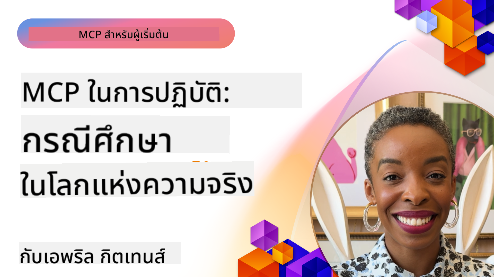

<!--
CO_OP_TRANSLATOR_METADATA:
{
  "original_hash": "1611dc5f6a2a35a789fc4c95fc5bfbe8",
  "translation_date": "2025-09-26T18:30:00+00:00",
  "source_file": "09-CaseStudy/README.md",
  "language_code": "th"
}
-->
# MCP ในการใช้งาน: กรณีศึกษาในโลกจริง

_(คลิกที่ภาพด้านบนเพื่อดูวิดีโอของบทเรียนนี้)_

Model Context Protocol (MCP) กำลังเปลี่ยนแปลงวิธีที่แอปพลิเคชัน AI โต้ตอบกับข้อมูล เครื่องมือ และบริการ ส่วนนี้นำเสนอกรณีศึกษาในโลกจริงที่แสดงให้เห็นถึงการใช้งาน MCP ในสถานการณ์องค์กรต่างๆ

## ภาพรวม

ส่วนนี้นำเสนอตัวอย่างที่ชัดเจนของการใช้งาน MCP โดยเน้นให้เห็นว่าองค์กรต่างๆ ใช้โปรโตคอลนี้เพื่อแก้ไขปัญหาทางธุรกิจที่ซับซ้อนอย่างไร การศึกษากรณีเหล่านี้จะช่วยให้คุณเข้าใจถึงความหลากหลาย ความสามารถในการขยาย และประโยชน์ที่เป็นรูปธรรมของ MCP ในสถานการณ์จริง

## วัตถุประสงค์การเรียนรู้หลัก

จากการศึกษากรณีเหล่านี้ คุณจะ:

- เข้าใจว่า MCP สามารถนำไปใช้แก้ปัญหาธุรกิจเฉพาะได้อย่างไร
- เรียนรู้เกี่ยวกับรูปแบบการบูรณาการและแนวทางสถาปัตยกรรมที่แตกต่างกัน
- รับรู้แนวปฏิบัติที่ดีที่สุดสำหรับการใช้งาน MCP ในสภาพแวดล้อมองค์กร
- ได้รับข้อมูลเชิงลึกเกี่ยวกับความท้าทายและวิธีแก้ไขที่พบในกรณีการใช้งานจริง
- ระบุโอกาสในการนำรูปแบบที่คล้ายกันไปใช้ในโครงการของคุณเอง

## กรณีศึกษาที่โดดเด่น

### 1. [Azure AI Travel Agents – การใช้งานอ้างอิง](./travelagentsample.md)

กรณีศึกษานี้ตรวจสอบโซลูชันอ้างอิงที่ครอบคลุมของ Microsoft ซึ่งแสดงให้เห็นวิธีการสร้างแอปพลิเคชันวางแผนการเดินทางที่ขับเคลื่อนด้วย AI แบบหลายตัวแทนโดยใช้ MCP, Azure OpenAI และ Azure AI Search โครงการนี้แสดงให้เห็น:

- การจัดการตัวแทนหลายตัวผ่าน MCP
- การบูรณาการข้อมูลองค์กรด้วย Azure AI Search
- สถาปัตยกรรมที่ปลอดภัยและสามารถขยายได้โดยใช้บริการ Azure
- เครื่องมือที่สามารถขยายได้ด้วยส่วนประกอบ MCP ที่นำกลับมาใช้ใหม่ได้
- ประสบการณ์ผู้ใช้แบบสนทนาที่ขับเคลื่อนด้วย Azure OpenAI

รายละเอียดสถาปัตยกรรมและการใช้งานให้ข้อมูลเชิงลึกที่มีคุณค่าเกี่ยวกับการสร้างระบบหลายตัวแทนที่ซับซ้อนโดยมี MCP เป็นชั้นการประสานงาน

### 2. [การอัปเดตรายการ Azure DevOps จากข้อมูล YouTube](./UpdateADOItemsFromYT.md)

กรณีศึกษานี้แสดงให้เห็นการใช้งาน MCP ในการทำงานอัตโนมัติของกระบวนการทำงาน โดยแสดงให้เห็นว่าเครื่องมือ MCP สามารถใช้เพื่อ:

- ดึงข้อมูลจากแพลตฟอร์มออนไลน์ (YouTube)
- อัปเดตรายการงานในระบบ Azure DevOps
- สร้างเวิร์กโฟลว์อัตโนมัติที่สามารถทำซ้ำได้
- บูรณาการข้อมูลข้ามระบบที่แตกต่างกัน

ตัวอย่างนี้แสดงให้เห็นว่าแม้การใช้งาน MCP ที่ค่อนข้างเรียบง่ายก็สามารถให้ประโยชน์ด้านประสิทธิภาพอย่างมากโดยการทำงานที่เป็นกิจวัตรให้เป็นอัตโนมัติและปรับปรุงความสอดคล้องของข้อมูลข้ามระบบ

### 3. [การดึงเอกสารแบบเรียลไทม์ด้วย MCP](./docs-mcp/README.md)

กรณีศึกษานี้แนะนำวิธีการเชื่อมต่อไคลเอนต์คอนโซล Python กับเซิร์ฟเวอร์ Model Context Protocol (MCP) เพื่อดึงและบันทึกเอกสาร Microsoft ที่มีบริบทแบบเรียลไทม์ คุณจะได้เรียนรู้วิธี:

- เชื่อมต่อกับเซิร์ฟเวอร์ MCP โดยใช้ไคลเอนต์ Python และ MCP SDK อย่างเป็นทางการ
- ใช้ไคลเอนต์ HTTP แบบสตรีมเพื่อดึงข้อมูลแบบเรียลไทม์อย่างมีประสิทธิภาพ
- เรียกใช้เครื่องมือเอกสารบนเซิร์ฟเวอร์และบันทึกการตอบกลับโดยตรงไปยังคอนโซล
- บูรณาการเอกสาร Microsoft ที่ทันสมัยเข้ากับเวิร์กโฟลว์ของคุณโดยไม่ต้องออกจากเทอร์มินัล

บทนี้รวมถึงการมอบหมายงานแบบลงมือทำ ตัวอย่างโค้ดที่ใช้งานได้ขั้นต่ำ และลิงก์ไปยังแหล่งข้อมูลเพิ่มเติมสำหรับการเรียนรู้เชิงลึก ดูคำแนะนำและโค้ดทั้งหมดในบทที่ลิงก์ไว้เพื่อทำความเข้าใจว่า MCP สามารถเปลี่ยนแปลงการเข้าถึงเอกสารและประสิทธิภาพของนักพัฒนาในสภาพแวดล้อมคอนโซลได้อย่างไร

### 4. [แอปเว็บสร้างแผนการเรียนแบบโต้ตอบด้วย MCP](./docs-mcp/README.md)

กรณีศึกษานี้แสดงให้เห็นวิธีการสร้างแอปพลิเคชันเว็บแบบโต้ตอบโดยใช้ Chainlit และ Model Context Protocol (MCP) เพื่อสร้างแผนการเรียนส่วนบุคคลสำหรับหัวข้อใดๆ ผู้ใช้สามารถระบุหัวข้อ (เช่น "การรับรอง AI-900") และระยะเวลาการเรียน (เช่น 8 สัปดาห์) และแอปจะให้คำแนะนำเนื้อหาแบบแบ่งสัปดาห์ Chainlit ช่วยให้มีอินเทอร์เฟซการสนทนาแบบแชท ทำให้ประสบการณ์มีความน่าสนใจและปรับเปลี่ยนได้

- แอปเว็บสนทนาที่ขับเคลื่อนด้วย Chainlit
- คำถามที่ขับเคลื่อนโดยผู้ใช้สำหรับหัวข้อและระยะเวลา
- คำแนะนำเนื้อหาแบบแบ่งสัปดาห์โดยใช้ MCP
- การตอบสนองแบบเรียลไทม์และปรับเปลี่ยนได้ในอินเทอร์เฟซแชท

โครงการนี้แสดงให้เห็นว่า AI สนทนาและ MCP สามารถรวมกันเพื่อสร้างเครื่องมือการศึกษาที่มีความไดนามิกและขับเคลื่อนโดยผู้ใช้ในสภาพแวดล้อมเว็บสมัยใหม่ได้อย่างไร

### 5. [เอกสารในตัวแก้ไขด้วยเซิร์ฟเวอร์ MCP ใน VS Code](./docs-mcp/README.md)

กรณีศึกษานี้แสดงให้เห็นว่าคุณสามารถนำเอกสาร Microsoft Learn Docs เข้ามาในสภาพแวดล้อม VS Code ของคุณโดยตรงโดยใช้เซิร์ฟเวอร์ MCP—ไม่ต้องสลับแท็บเบราว์เซอร์อีกต่อไป! คุณจะเห็นวิธี:

- ค้นหาและอ่านเอกสารทันทีใน VS Code โดยใช้แผง MCP หรือคำสั่งใน Command Palette
- อ้างอิงเอกสารและแทรกลิงก์โดยตรงในไฟล์ README หรือ Markdown หลักสูตรของคุณ
- ใช้ GitHub Copilot และ MCP ร่วมกันเพื่อเวิร์กโฟลว์เอกสารและโค้ดที่ขับเคลื่อนด้วย AI อย่างไร้รอยต่อ
- ตรวจสอบและปรับปรุงเอกสารของคุณด้วยความคิดเห็นแบบเรียลไทม์และความถูกต้องจาก Microsoft
- บูรณาการ MCP กับเวิร์กโฟลว์ GitHub เพื่อการตรวจสอบเอกสารอย่างต่อเนื่อง

การใช้งานรวมถึง:

- ตัวอย่างการตั้งค่า `.vscode/mcp.json` ที่ง่ายต่อการเริ่มต้น
- คำแนะนำแบบภาพหน้าจอของประสบการณ์ในตัวแก้ไข
- เคล็ดลับสำหรับการรวม Copilot และ MCP เพื่อประสิทธิภาพสูงสุด

สถานการณ์นี้เหมาะสำหรับผู้เขียนหลักสูตร นักเขียนเอกสาร และนักพัฒนาที่ต้องการมุ่งเน้นในตัวแก้ไขขณะทำงานกับเอกสาร Copilot และเครื่องมือการตรวจสอบ—ทั้งหมดนี้ขับเคลื่อนด้วย MCP

### 6. [การสร้างเซิร์ฟเวอร์ MCP ด้วย APIM](./apimsample.md)

กรณีศึกษานี้ให้คำแนะนำทีละขั้นตอนเกี่ยวกับวิธีการสร้างเซิร์ฟเวอร์ MCP โดยใช้ Azure API Management (APIM) ครอบคลุม:

- การตั้งค่าเซิร์ฟเวอร์ MCP ใน Azure API Management
- การเปิดเผยการดำเนินการ API เป็นเครื่องมือ MCP
- การกำหนดนโยบายสำหรับการจำกัดอัตราและความปลอดภัย
- การทดสอบเซิร์ฟเวอร์ MCP โดยใช้ Visual Studio Code และ GitHub Copilot

ตัวอย่างนี้แสดงให้เห็นวิธีการใช้ความสามารถของ Azure เพื่อสร้างเซิร์ฟเวอร์ MCP ที่แข็งแกร่งซึ่งสามารถใช้ในแอปพลิเคชันต่างๆ เพื่อเพิ่มการบูรณาการระบบ AI กับ API ขององค์กร

### 7. [GitHub MCP Registry — เร่งการบูรณาการแบบตัวแทน](https://github.com/mcp)

กรณีศึกษานี้ตรวจสอบว่า GitHub MCP Registry ซึ่งเปิดตัวในเดือนกันยายน 2025 แก้ไขปัญหาสำคัญในระบบนิเวศ AI อย่างไร: การค้นพบและการใช้งานเซิร์ฟเวอร์ Model Context Protocol (MCP) ที่กระจัดกระจาย

#### ภาพรวม
**MCP Registry** แก้ไขปัญหาการกระจัดกระจายของเซิร์ฟเวอร์ MCP ในที่เก็บและรีจิสทรีต่างๆ ซึ่งก่อนหน้านี้ทำให้การบูรณาการช้าและเกิดข้อผิดพลาด เซิร์ฟเวอร์เหล่านี้ช่วยให้ตัวแทน AI โต้ตอบกับระบบภายนอก เช่น API ฐานข้อมูล และแหล่งข้อมูลเอกสาร

#### ปัญหาที่พบ
นักพัฒนาที่สร้างเวิร์กโฟลว์แบบตัวแทนเผชิญกับความท้าทายหลายประการ:
- **การค้นพบที่ยาก** ของเซิร์ฟเวอร์ MCP ในแพลตฟอร์มต่างๆ
- **คำถามการตั้งค่าที่ซ้ำซ้อน** ที่กระจัดกระจายตามฟอรัมและเอกสาร
- **ความเสี่ยงด้านความปลอดภัย** จากแหล่งที่ไม่ได้รับการยืนยันและไม่น่าเชื่อถือ
- **การขาดมาตรฐาน** ในคุณภาพและความเข้ากันได้ของเซิร์ฟเวอร์

#### สถาปัตยกรรมการแก้ไข
GitHub MCP Registry รวมศูนย์เซิร์ฟเวอร์ MCP ที่เชื่อถือได้พร้อมคุณสมบัติสำคัญ:
- **การติดตั้งแบบคลิกเดียว** ผ่าน VS Code เพื่อการตั้งค่าที่ง่ายดาย
- **การจัดเรียงตามคุณภาพ** โดยใช้ดาว กิจกรรม และการตรวจสอบจากชุมชน
- **การบูรณาการโดยตรง** กับ GitHub Copilot และเครื่องมือที่เข้ากันกับ MCP อื่นๆ
- **โมเดลการมีส่วนร่วมแบบเปิด** ที่ช่วยให้ทั้งชุมชนและพันธมิตรองค์กรสามารถมีส่วนร่วมได้

#### ผลกระทบทางธุรกิจ
รีจิสทรีได้ส่งมอบการปรับปรุงที่วัดผลได้:
- **การเริ่มต้นใช้งานที่เร็วขึ้น** สำหรับนักพัฒนาที่ใช้เครื่องมือ เช่น Microsoft Learn MCP Server ซึ่งสตรีมเอกสารอย่างเป็นทางการโดยตรงไปยังตัวแทน
- **ประสิทธิภาพที่ดีขึ้น** ผ่านเซิร์ฟเวอร์เฉพาะ เช่น `github-mcp-server` ที่ช่วยให้การทำงาน GitHub แบบธรรมชาติ (การสร้าง PR การรัน CI ใหม่ การสแกนโค้ด)
- **ความไว้วางใจในระบบนิเวศที่แข็งแกร่งขึ้น** ผ่านรายการที่ได้รับการดูแลและมาตรฐานการกำหนดค่าที่โปร่งใส

#### คุณค่าทางกลยุทธ์
สำหรับผู้ปฏิบัติงานที่เชี่ยวชาญในวงจรชีวิตตัวแทนและเวิร์กโฟลว์ที่ทำซ้ำได้ MCP Registry ให้:
- **ความสามารถในการปรับใช้ตัวแทนแบบโมดูลาร์** ด้วยส่วนประกอบที่ได้มาตรฐาน
- **ท่อการประเมินที่ได้รับการสนับสนุนจากรีจิสทรี** สำหรับการทดสอบและการตรวจสอบที่สม่ำเสมอ
- **การทำงานร่วมกันข้ามเครื่องมือ** ที่ช่วยให้การบูรณาการไร้รอยต่อในแพลตฟอร์ม AI ต่างๆ

กรณีศึกษานี้แสดงให้เห็นว่า MCP Registry ไม่ใช่แค่ไดเรกทอรี แต่เป็นแพลตฟอร์มพื้นฐานสำหรับการบูรณาการโมเดลที่ปรับขนาดได้และการปรับใช้ระบบตัวแทนในโลกจริง

## สรุป

กรณีศึกษาที่ครอบคลุมทั้งเจ็ดนี้แสดงให้เห็นถึงความหลากหลายและการใช้งานจริงของ Model Context Protocol ในสถานการณ์จริงที่หลากหลาย ตั้งแต่ระบบวางแผนการเดินทางแบบหลายตัวแทนที่ซับซ้อนและการจัดการ API ขององค์กร ไปจนถึงเวิร์กโฟลว์เอกสารที่มีประสิทธิภาพและ GitHub MCP Registry ที่ปฏิวัติวงการ ตัวอย่างเหล่านี้แสดงให้เห็นว่า MCP ให้วิธีการที่ได้มาตรฐานและสามารถขยายได้ในการเชื่อมต่อระบบ AI กับเครื่องมือ ข้อมูล และบริการที่จำเป็นเพื่อส่งมอบคุณค่าที่ยอดเยี่ยม

กรณีศึกษาครอบคลุมมิติการใช้งาน MCP หลายด้าน:
- **การบูรณาการองค์กร**: การจัดการ API ของ Azure และการทำงานอัตโนมัติของ Azure DevOps
- **การจัดการตัวแทนหลายตัว**: การวางแผนการเดินทางด้วยตัวแทน AI ที่ประสานงานกัน
- **ประสิทธิภาพของนักพัฒนา**: การบูรณาการ VS Code และการเข้าถึงเอกสารแบบเรียลไทม์
- **การพัฒนาระบบนิเวศ**: GitHub MCP Registry เป็นแพลตฟอร์มพื้นฐาน
- **การใช้งานด้านการศึกษา**: ตัวสร้างแผนการเรียนแบบโต้ตอบและอินเทอร์เฟซสนทนา

จากการศึกษาการใช้งานเหล่านี้ คุณจะได้รับข้อมูลเชิงลึกที่สำคัญเกี่ยวกับ:
- **รูปแบบสถาปัตยกรรม** สำหรับขนาดและกรณีการใช้งานที่แตกต่างกัน
- **กลยุทธ์การใช้งาน** ที่สมดุลระหว่างฟังก์ชันการทำงานและการบำรุงรักษา
- **ข้อพิจารณาด้านความปลอดภัยและการขยาย** สำหรับการใช้งานในระดับการผลิต
- **แนวปฏิบัติที่ดีที่สุด** สำหรับการพัฒนาเซิร์ฟเวอร์ MCP และการบูรณาการไคลเอนต์
- **การคิดเชิงระบบนิเวศ** สำหรับการสร้างโซลูชันที่ขับเคลื่อนด้วย AI ที่เชื่อมโยงกัน

ตัวอย่างเหล่านี้แสดงให้เห็นว่า MCP ไม่ใช่แค่กรอบแนวคิด แต่เป็นโปรโตคอลที่พร้อมใช้งานในระดับการผลิตที่ช่วยให้เกิดโซลูชันที่ใช้งานได้จริงสำหรับความท้าทายทางธุรกิจที่ซับซ้อน ไม่ว่าคุณจะสร้างเครื่องมืออัตโนมัติที่เรียบง่ายหรือระบบหลายตัวแทนที่ซับซ้อน รูปแบบและแนวทางที่แสดงในที่นี้ให้รากฐานที่มั่นคงสำหรับโครงการ MCP ของคุณเอง

## แหล่งข้อมูลเพิ่มเติม

- [Azure AI Travel Agents GitHub Repository](https://github.com/Azure-Samples/azure-ai-travel-agents)
- [Azure DevOps MCP Tool](https://github.com/microsoft/azure-devops-mcp)
- [Playwright MCP Tool](https://github.com/microsoft/playwright-mcp)
- [Microsoft Docs MCP Server](https://github.com/MicrosoftDocs/mcp)
- [GitHub MCP Registry — เร่งการบูรณาการแบบตัวแทน](https://github.com/mcp)
- [ตัวอย่างชุมชน MCP](https://github.com/microsoft/mcp)

ถัดไป: ห้องปฏิบัติการ [การปรับปรุงเวิร์กโฟลว์ AI: การสร้างเซิร์ฟเวอร์ MCP ด้วย AI Toolkit](../10-StreamliningAIWorkflowsBuildingAnMCPServerWithAIToolkit/README.md)

---

