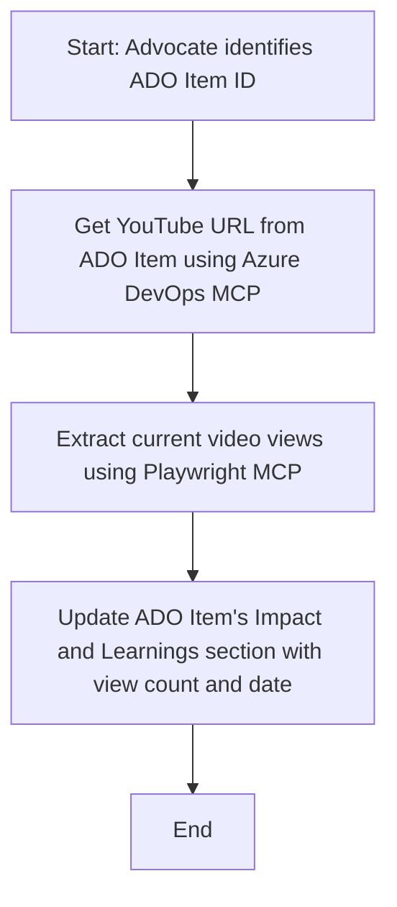

<!--
CO_OP_TRANSLATOR_METADATA:
{
  "original_hash": "14a2dfbea55ef735660a06bd6bdfe5f3",
  "translation_date": "2025-07-14T06:12:41+00:00",
  "source_file": "09-CaseStudy/UpdateADOItemsFromYT.md",
  "language_code": "th"
}
-->
# กรณีศึกษา: การอัปเดต Azure DevOps Items จากข้อมูล YouTube ด้วย MCP

> **ข้อจำกัดความรับผิดชอบ:** มีเครื่องมือและรายงานออนไลน์ที่สามารถทำงานอัตโนมัติในการอัปเดต Azure DevOps items ด้วยข้อมูลจากแพลตฟอร์มอย่าง YouTube อยู่แล้ว สถานการณ์ต่อไปนี้เป็นเพียงตัวอย่างการใช้งานเพื่อแสดงให้เห็นว่าเครื่องมือ MCP สามารถนำไปใช้ในงานอัตโนมัติและการผสานรวมได้อย่างไร

## ภาพรวม

กรณีศึกษานี้แสดงตัวอย่างหนึ่งของการใช้ Model Context Protocol (MCP) และเครื่องมือที่เกี่ยวข้องในการทำงานอัตโนมัติสำหรับการอัปเดต Azure DevOps (ADO) work items ด้วยข้อมูลที่มาจากแพลตฟอร์มออนไลน์ เช่น YouTube สถานการณ์ที่อธิบายนี้เป็นเพียงตัวอย่างหนึ่งของความสามารถที่กว้างขึ้นของเครื่องมือเหล่านี้ ซึ่งสามารถปรับใช้กับความต้องการอัตโนมัติในลักษณะเดียวกันได้หลากหลาย

ในตัวอย่างนี้ Advocate จะติดตามเซสชันออนไลน์โดยใช้ ADO items ซึ่งแต่ละ item จะมี URL ของวิดีโอ YouTube โดยการใช้เครื่องมือ MCP Advocate สามารถอัปเดต ADO items ให้ทันสมัยด้วยข้อมูลเมตริกของวิดีโอล่าสุด เช่น จำนวนการดู ในรูปแบบที่ทำซ้ำได้และอัตโนมัติ วิธีนี้สามารถนำไปใช้กับกรณีอื่น ๆ ที่ต้องการผสานข้อมูลจากแหล่งออนไลน์เข้ากับ ADO หรือระบบอื่น ๆ

## สถานการณ์

Advocate รับผิดชอบในการติดตามผลกระทบของเซสชันออนไลน์และการมีส่วนร่วมของชุมชน แต่ละเซสชันจะถูกบันทึกเป็น ADO work item ในโปรเจกต์ 'DevRel' และ work item นั้นจะมีฟิลด์สำหรับ URL วิดีโอ YouTube เพื่อรายงานการเข้าถึงของเซสชันอย่างถูกต้อง Advocate จำเป็นต้องอัปเดต ADO item ด้วยจำนวนการดูวิดีโอล่าสุดและวันที่ที่ดึงข้อมูลนี้มา

## เครื่องมือที่ใช้

- [Azure DevOps MCP](https://github.com/microsoft/azure-devops-mcp): ช่วยให้เข้าถึงและอัปเดต ADO work items ผ่าน MCP ได้อย่างโปรแกรมมิ่ง
- [Playwright MCP](https://github.com/microsoft/playwright-mcp): ทำงานอัตโนมัติบนเบราว์เซอร์เพื่อดึงข้อมูลสดจากเว็บเพจ เช่น สถิติของวิดีโอ YouTube

## ขั้นตอนการทำงานทีละขั้นตอน

1. **ระบุ ADO Item**: เริ่มจาก ID ของ ADO work item (เช่น 1234) ในโปรเจกต์ 'DevRel'
2. **ดึง URL YouTube**: ใช้เครื่องมือ Azure DevOps MCP เพื่อดึง URL YouTube จาก work item
3. **ดึงจำนวนการดูวิดีโอ**: ใช้เครื่องมือ Playwright MCP เพื่อเข้าไปยัง URL YouTube และดึงจำนวนการดูปัจจุบัน
4. **อัปเดต ADO Item**: เขียนจำนวนการดูล่าสุดและวันที่ดึงข้อมูลลงในส่วน 'Impact and Learnings' ของ ADO work item โดยใช้ Azure DevOps MCP

## ตัวอย่างคำสั่ง

```bash
- Work with the ADO Item ID: 1234
- The project is '2025-Awesome'
- Get the YouTube URL for the ADO item
- Use Playwright to get the current views from the YouTube video
- Update the ADO item with the current video views and the updated date of the information
```

## แผนภาพ Mermaid



## การดำเนินการทางเทคนิค

- **การประสานงาน MCP**: กระบวนการทำงานถูกควบคุมโดย MCP server ซึ่งประสานการใช้เครื่องมือ Azure DevOps MCP และ Playwright MCP
- **การทำงานอัตโนมัติ**: กระบวนการนี้สามารถเริ่มต้นด้วยตนเองหรือกำหนดเวลาให้ทำงานเป็นระยะเพื่อให้อัปเดต ADO items อยู่เสมอ
- **ความสามารถในการขยาย**: รูปแบบเดียวกันนี้สามารถขยายไปใช้กับการอัปเดต ADO items ด้วยเมตริกออนไลน์อื่น ๆ (เช่น ไลก์ ความคิดเห็น) หรือจากแพลตฟอร์มอื่น ๆ ได้

## ผลลัพธ์และผลกระทบ

- **ประสิทธิภาพ**: ลดความพยายามด้วยตนเองของ Advocate โดยทำงานดึงและอัปเดตข้อมูลเมตริกวิดีโอให้อัตโนมัติ
- **ความแม่นยำ**: ทำให้ ADO items แสดงข้อมูลที่เป็นปัจจุบันที่สุดจากแหล่งข้อมูลออนไลน์
- **ความสามารถในการทำซ้ำ**: ให้เวิร์กโฟลว์ที่นำกลับมาใช้ใหม่ได้สำหรับสถานการณ์ที่คล้ายกันซึ่งเกี่ยวข้องกับแหล่งข้อมูลหรือเมตริกอื่น ๆ

## เอกสารอ้างอิง

- [Azure DevOps MCP](https://github.com/microsoft/azure-devops-mcp)
- [Playwright MCP](https://github.com/microsoft/playwright-mcp)
- [Model Context Protocol (MCP)](https://modelcontextprotocol.io/)

**ข้อจำกัดความรับผิดชอบ**:  
เอกสารนี้ได้รับการแปลโดยใช้บริการแปลภาษาอัตโนมัติ [Co-op Translator](https://github.com/Azure/co-op-translator) แม้เราจะพยายามให้ความถูกต้องสูงสุด แต่โปรดทราบว่าการแปลอัตโนมัติอาจมีข้อผิดพลาดหรือความไม่ถูกต้อง เอกสารต้นฉบับในภาษาต้นทางถือเป็นแหล่งข้อมูลที่เชื่อถือได้ สำหรับข้อมูลที่สำคัญ ขอแนะนำให้ใช้บริการแปลโดยผู้เชี่ยวชาญมนุษย์ เราไม่รับผิดชอบต่อความเข้าใจผิดหรือการตีความผิดที่เกิดขึ้นจากการใช้การแปลนี้