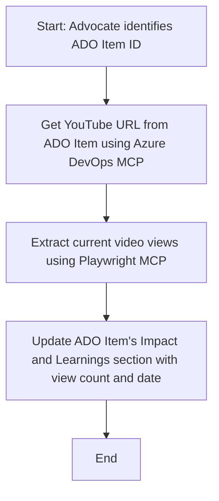

<!--
CO_OP_TRANSLATOR_METADATA:
{
  "original_hash": "14a2dfbea55ef735660a06bd6bdfe5f3",
  "translation_date": "2025-06-13T21:35:28+00:00",
  "source_file": "09-CaseStudy/UpdateADOItemsFromYT.md",
  "language_code": "th"
}
-->
# Case Study: การอัปเดต Azure DevOps Items จากข้อมูล YouTube ด้วย MCP

> **Disclaimer:** มีเครื่องมือและรายงานออนไลน์ที่สามารถทำให้อัปเดต Azure DevOps items ด้วยข้อมูลจากแพลตฟอร์มอย่าง YouTube ได้โดยอัตโนมัติ สถานการณ์ต่อไปนี้เป็นเพียงตัวอย่างเพื่อแสดงให้เห็นว่าเครื่องมือ MCP สามารถนำไปใช้ในงานอัตโนมัติและการรวมระบบได้อย่างไร

## ภาพรวม

กรณีศึกษานี้แสดงตัวอย่างหนึ่งของการใช้ Model Context Protocol (MCP) และเครื่องมือต่างๆ เพื่อทำให้อัปเดตงานใน Azure DevOps (ADO) โดยดึงข้อมูลจากแพลตฟอร์มออนไลน์ เช่น YouTube สถานการณ์ที่อธิบายนี้เป็นเพียงตัวอย่างหนึ่งของความสามารถกว้างๆ ของเครื่องมือเหล่านี้ ที่สามารถปรับใช้กับงานอัตโนมัติที่คล้ายกันได้หลากหลาย

ในตัวอย่างนี้ Advocate จะติดตามเซสชันออนไลน์โดยใช้ ADO items ซึ่งแต่ละ item จะมี URL ของวิดีโอ YouTube ด้วยการใช้เครื่องมือ MCP Advocate สามารถอัปเดต ADO items ให้เป็นปัจจุบันด้วยข้อมูลเมตริกของวิดีโอล่าสุด เช่น จำนวนการดู ในรูปแบบที่ทำซ้ำได้และอัตโนมัติ วิธีนี้สามารถนำไปประยุกต์กับกรณีอื่นๆ ที่ต้องการรวมข้อมูลจากแหล่งออนไลน์เข้ากับ ADO หรือระบบอื่นๆ

## สถานการณ์

Advocate รับผิดชอบในการติดตามผลกระทบของเซสชันออนไลน์และการมีส่วนร่วมของชุมชน แต่ละเซสชันจะถูกบันทึกเป็นงานใน ADO ในโปรเจกต์ ‘DevRel’ โดยงานนั้นจะมีช่องสำหรับ URL วิดีโอ YouTube เพื่อรายงานการเข้าถึงเซสชันอย่างแม่นยำ Advocate จำเป็นต้องอัปเดต ADO item ด้วยจำนวนการดูวิดีโอล่าสุดและวันที่ดึงข้อมูลนี้มา

## เครื่องมือที่ใช้

- [Azure DevOps MCP](https://github.com/microsoft/azure-devops-mcp): ช่วยให้เข้าถึงและอัปเดตงานใน ADO ผ่าน MCP ได้โดยโปรแกรม
- [Playwright MCP](https://github.com/microsoft/playwright-mcp): อัตโนมัติการทำงานของเบราว์เซอร์เพื่อดึงข้อมูลสดจากเว็บ เช่น สถิติของวิดีโอ YouTube

## ขั้นตอนการทำงาน

1. **ระบุ ADO Item**: เริ่มจาก ID งาน ADO (เช่น 1234) ในโปรเจกต์ ‘DevRel’
2. **ดึง URL YouTube**: ใช้เครื่องมือ Azure DevOps MCP เพื่อดึง URL YouTube จากงานนั้น
3. **ดึงจำนวนการดูวิดีโอ**: ใช้ Playwright MCP เพื่อเข้าไปที่ URL YouTube และดึงจำนวนการดูปัจจุบัน
4. **อัปเดต ADO Item**: เขียนจำนวนการดูล่าสุดและวันที่ดึงข้อมูลลงในส่วน ‘Impact and Learnings’ ของงาน ADO โดยใช้ Azure DevOps MCP

## ตัวอย่าง Prompt

```bash
- Work with the ADO Item ID: 1234
- The project is '2025-Awesome'
- Get the YouTube URL for the ADO item
- Use Playwright to get the current views from the YouTube video
- Update the ADO item with the current video views and the updated date of the information
```

## แผนภาพ Mermaid



## การนำไปใช้งานทางเทคนิค

- **การประสานงาน MCP**: กระบวนการถูกควบคุมโดยเซิร์ฟเวอร์ MCP ที่ประสานงานการใช้เครื่องมือ Azure DevOps MCP และ Playwright MCP
- **อัตโนมัติ**: กระบวนการสามารถเริ่มได้ด้วยมือหรือกำหนดเวลาให้ทำงานอัตโนมัติเพื่อให้งาน ADO เป็นปัจจุบันเสมอ
- **ขยายได้**: รูปแบบนี้สามารถขยายไปอัปเดตงาน ADO ด้วยเมตริกออนไลน์อื่นๆ (เช่น ไลก์ ความเห็น) หรือจากแพลตฟอร์มอื่นได้

## ผลลัพธ์และผลกระทบ

- **ประสิทธิภาพ**: ลดความพยายามด้วยมือของ Advocate โดยอัตโนมัติการดึงและอัปเดตข้อมูลเมตริกวิดีโอ
- **ความแม่นยำ**: ทำให้งาน ADO แสดงข้อมูลที่เป็นปัจจุบันที่สุดจากแหล่งออนไลน์
- **ทำซ้ำได้**: ให้กระบวนการที่ใช้ซ้ำได้สำหรับสถานการณ์ที่คล้ายกันกับแหล่งข้อมูลหรือเมตริกอื่นๆ

## เอกสารอ้างอิง

- [Azure DevOps MCP](https://github.com/microsoft/azure-devops-mcp)
- [Playwright MCP](https://github.com/microsoft/playwright-mcp)
- [Model Context Protocol (MCP)](https://modelcontextprotocol.io/)

**ข้อจำกัดความรับผิดชอบ**:  
เอกสารนี้ได้รับการแปลโดยใช้บริการแปลภาษาอัตโนมัติ [Co-op Translator](https://github.com/Azure/co-op-translator) แม้ว่าเราจะพยายามให้การแปลมีความถูกต้อง โปรดทราบว่าการแปลอัตโนมัติอาจมีข้อผิดพลาดหรือความคลาดเคลื่อน เอกสารต้นฉบับในภาษาต้นทางถือเป็นแหล่งข้อมูลที่น่าเชื่อถือที่สุด สำหรับข้อมูลที่สำคัญ ควรใช้บริการแปลโดยผู้เชี่ยวชาญมนุษย์ เราจะไม่รับผิดชอบต่อความเข้าใจผิดหรือการตีความที่ผิดพลาดใด ๆ ที่เกิดจากการใช้การแปลนี้