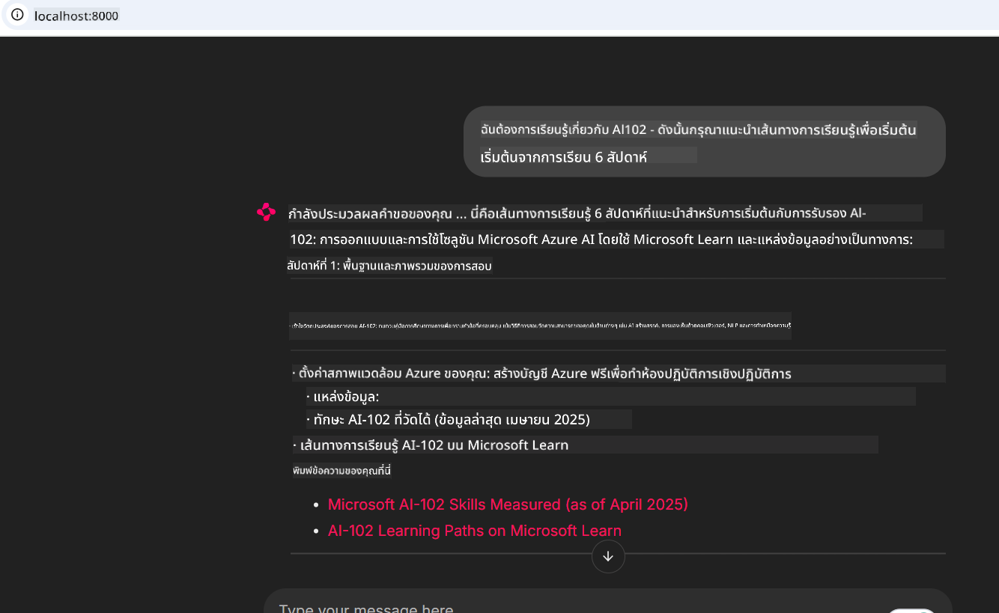
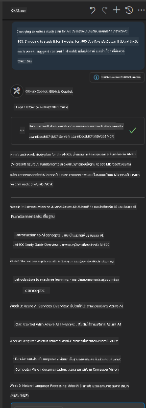

<!--
CO_OP_TRANSLATOR_METADATA:
{
  "original_hash": "4319d291c9d124ecafea52b3d04bfa0e",
  "translation_date": "2025-07-14T06:24:43+00:00",
  "source_file": "09-CaseStudy/docs-mcp/README.md",
  "language_code": "th"
}
-->
# กรณีศึกษา: การเชื่อมต่อกับ Microsoft Learn Docs MCP Server จากไคลเอนต์

เคยไหมที่คุณต้องสลับไปมาระหว่างเว็บไซต์เอกสาร Stack Overflow และแท็บเครื่องมือค้นหาที่เปิดไม่รู้จบ ในขณะที่พยายามแก้ไขปัญหาในโค้ดของคุณ? บางทีคุณอาจมีจอที่สองไว้สำหรับดูเอกสาร หรือสลับหน้าต่างระหว่าง IDE กับเบราว์เซอร์อยู่ตลอดเวลา จะดีกว่าไหมถ้าคุณสามารถนำเอกสารมาไว้ในกระบวนการทำงานของคุณได้โดยตรง—ผสานรวมเข้ากับแอป IDE หรือแม้แต่เครื่องมือที่คุณสร้างขึ้นเอง? ในกรณีศึกษานี้ เราจะสำรวจวิธีการทำเช่นนั้นโดยการเชื่อมต่อโดยตรงกับ Microsoft Learn Docs MCP server จากแอปพลิเคชันไคลเอนต์ของคุณเอง

## ภาพรวม

การพัฒนาสมัยใหม่ไม่ได้หมายถึงแค่การเขียนโค้ดเท่านั้น แต่คือการค้นหาข้อมูลที่ถูกต้องในเวลาที่เหมาะสม เอกสารมีอยู่ทุกที่ แต่ส่วนใหญ่มักไม่อยู่ในที่ที่คุณต้องการที่สุด นั่นคือภายในเครื่องมือและกระบวนการทำงานของคุณ การผสานรวมการดึงเอกสารเข้ากับแอปพลิเคชันโดยตรงจะช่วยประหยัดเวลา ลดการสลับบริบท และเพิ่มประสิทธิภาพ ในส่วนนี้เราจะแสดงวิธีเชื่อมต่อไคลเอนต์กับ Microsoft Learn Docs MCP server เพื่อให้คุณเข้าถึงเอกสารที่อัปเดตแบบเรียลไทม์และมีบริบทโดยไม่ต้องออกจากแอปของคุณ

เราจะพาคุณผ่านขั้นตอนการสร้างการเชื่อมต่อ ส่งคำขอ และจัดการกับการตอบสนองแบบสตรีมอย่างมีประสิทธิภาพ วิธีนี้ไม่เพียงแต่ช่วยให้กระบวนการทำงานของคุณราบรื่นขึ้น แต่ยังเปิดโอกาสให้สร้างเครื่องมือสำหรับนักพัฒนาที่ชาญฉลาดและช่วยเหลือได้มากขึ้น

## วัตถุประสงค์การเรียนรู้

ทำไมเราต้องทำเช่นนี้? เพราะประสบการณ์ของนักพัฒนาที่ดีที่สุดคือประสบการณ์ที่ลดความยุ่งยาก ลองจินตนาการถึงโลกที่ตัวแก้ไขโค้ด แชทบอท หรือเว็บแอปของคุณสามารถตอบคำถามเกี่ยวกับเอกสารได้ทันที โดยใช้เนื้อหาล่าสุดจาก Microsoft Learn เมื่อจบบทนี้ คุณจะสามารถ:

- เข้าใจพื้นฐานของการสื่อสารระหว่าง MCP server กับไคลเอนต์สำหรับเอกสาร
- สร้างแอปคอนโซลหรือเว็บเพื่อเชื่อมต่อกับ Microsoft Learn Docs MCP server
- ใช้ไคลเอนต์ HTTP แบบสตรีมเพื่อดึงเอกสารแบบเรียลไทม์
- บันทึกและตีความการตอบสนองของเอกสารในแอปของคุณ

คุณจะเห็นว่าทักษะเหล่านี้ช่วยให้คุณสร้างเครื่องมือที่ไม่ใช่แค่ตอบสนอง แต่ยังมีปฏิสัมพันธ์และเข้าใจบริบทได้จริง

## กรณีศึกษา 1 - การดึงเอกสารแบบเรียลไทม์ด้วย MCP

ในกรณีศึกษานี้ เราจะแสดงวิธีเชื่อมต่อไคลเอนต์กับ Microsoft Learn Docs MCP server เพื่อให้คุณเข้าถึงเอกสารที่อัปเดตแบบเรียลไทม์และมีบริบทโดยไม่ต้องออกจากแอปของคุณ

มาลองทำกันเลย งานของคุณคือเขียนแอปที่เชื่อมต่อกับ Microsoft Learn Docs MCP server เรียกใช้เครื่องมือ `microsoft_docs_search` และบันทึกการตอบสนองแบบสตรีมลงในคอนโซล

### ทำไมต้องใช้วิธีนี้?
เพราะนี่คือพื้นฐานสำหรับการสร้างการผสานรวมที่ซับซ้อนขึ้น ไม่ว่าคุณจะต้องการขับเคลื่อนแชทบอท ส่วนขยาย IDE หรือแดชบอร์ดเว็บ

คุณจะพบโค้ดและคำแนะนำสำหรับกรณีศึกษานี้ในโฟลเดอร์ [`solution`](./solution/README.md) ภายในกรณีศึกษา ขั้นตอนจะนำคุณผ่านการตั้งค่าการเชื่อมต่อ:
- ใช้ MCP SDK อย่างเป็นทางการและไคลเอนต์ HTTP แบบสตรีมสำหรับการเชื่อมต่อ
- เรียกใช้เครื่องมือ `microsoft_docs_search` พร้อมพารามิเตอร์คำค้นหาเพื่อดึงเอกสาร
- ดำเนินการบันทึกและจัดการข้อผิดพลาดอย่างเหมาะสม
- สร้างอินเทอร์เฟซคอนโซลแบบโต้ตอบเพื่อให้ผู้ใช้สามารถป้อนคำค้นหาหลายคำได้

กรณีศึกษานี้แสดงให้เห็นวิธี:
- เชื่อมต่อกับ Docs MCP server
- ส่งคำค้นหา
- แยกวิเคราะห์และแสดงผลลัพธ์

นี่คือตัวอย่างการรันโซลูชัน:

```
Prompt> What is Azure Key Vault?
Answer> Azure Key Vault is a cloud service for securely storing and accessing secrets. ...
```

ด้านล่างคือตัวอย่างโซลูชันที่เรียบง่าย โค้ดและรายละเอียดทั้งหมดสามารถดูได้ในโฟลเดอร์ solution

<details>
<summary>Python</summary>

```python
import asyncio
from mcp.client.streamable_http import streamablehttp_client
from mcp import ClientSession

async def main():
    async with streamablehttp_client("https://learn.microsoft.com/api/mcp") as (read_stream, write_stream, _):
        async with ClientSession(read_stream, write_stream) as session:
            await session.initialize()
            result = await session.call_tool("microsoft_docs_search", {"query": "Azure Functions best practices"})
            print(result.content)

if __name__ == "__main__":
    asyncio.run(main())
```

- สำหรับการใช้งานและการบันทึกแบบครบถ้วน ดูที่ [`scenario1.py`](../../../../09-CaseStudy/docs-mcp/solution/python/scenario1.py)
- สำหรับคำแนะนำการติดตั้งและใช้งาน ดูที่ไฟล์ [`README.md`](./solution/python/README.md) ในโฟลเดอร์เดียวกัน
</details>

## กรณีศึกษา 2 - เว็บแอปสร้างแผนการเรียนแบบโต้ตอบด้วย MCP

ในกรณีศึกษานี้ คุณจะได้เรียนรู้วิธีผสาน Docs MCP เข้ากับโปรเจกต์เว็บเป้าหมายคือให้ผู้ใช้สามารถค้นหาเอกสาร Microsoft Learn ได้โดยตรงจากอินเทอร์เฟซเว็บ ทำให้เอกสารเข้าถึงได้ทันทีภายในแอปหรือเว็บไซต์ของคุณ

คุณจะได้เรียนรู้วิธี:
- ตั้งค่าเว็บแอป
- เชื่อมต่อกับ Docs MCP server
- จัดการอินพุตของผู้ใช้และแสดงผลลัพธ์

นี่คือตัวอย่างการรันโซลูชัน:

```
User> I want to learn about AI102 - so suggest the roadmap to get it started from learn for 6 weeks

Assistant> Here’s a detailed 6-week roadmap to start your preparation for the AI-102: Designing and Implementing a Microsoft Azure AI Solution certification, using official Microsoft resources and focusing on exam skills areas:

---
## Week 1: Introduction & Fundamentals
- **Understand the Exam**: Review the [AI-102 exam skills outline](https://learn.microsoft.com/en-us/credentials/certifications/exams/ai-102/).
- **Set up Azure**: Sign up for a free Azure account if you don't have one.
- **Learning Path**: [Introduction to Azure AI services](https://learn.microsoft.com/en-us/training/modules/intro-to-azure-ai/)
- **Focus**: Get familiar with Azure portal, AI capabilities, and necessary tools.

....more weeks of the roadmap...

Let me know if you want module-specific recommendations or need more customized weekly tasks!
```

ด้านล่างคือตัวอย่างโซลูชันที่เรียบง่าย โค้ดและรายละเอียดทั้งหมดสามารถดูได้ในโฟลเดอร์ solution



<details>
<summary>Python (Chainlit)</summary>

Chainlit คือเฟรมเวิร์กสำหรับสร้างเว็บแอป AI แบบสนทนา ช่วยให้สร้างแชทบอทและผู้ช่วยที่โต้ตอบได้ง่าย ซึ่งสามารถเรียกใช้เครื่องมือ MCP และแสดงผลลัพธ์แบบเรียลไทม์ เหมาะสำหรับการสร้างต้นแบบอย่างรวดเร็วและอินเทอร์เฟซที่ใช้งานง่าย

```python
import chainlit as cl
import requests

MCP_URL = "https://learn.microsoft.com/api/mcp"

@cl.on_message
def handle_message(message):
    query = {"question": message}
    response = requests.post(MCP_URL, json=query)
    if response.ok:
        result = response.json()
        cl.Message(content=result.get("answer", "No answer found.")).send()
    else:
        cl.Message(content="Error: " + response.text).send()
```

- สำหรับการใช้งานแบบครบถ้วน ดูที่ [`scenario2.py`](../../../../09-CaseStudy/docs-mcp/solution/python/scenario2.py)
- สำหรับคำแนะนำการติดตั้งและใช้งาน ดูที่ [`README.md`](./solution/python/README.md)
</details>

## กรณีศึกษา 3: เอกสารในตัวแก้ไขด้วย MCP Server ใน VS Code

ถ้าคุณต้องการเข้าถึง Microsoft Learn Docs โดยตรงใน VS Code (แทนการสลับแท็บเบราว์เซอร์) คุณสามารถใช้ MCP server ในตัวแก้ไขของคุณได้ ซึ่งช่วยให้คุณ:
- ค้นหาและอ่านเอกสารใน VS Code โดยไม่ต้องออกจากสภาพแวดล้อมการเขียนโค้ด
- อ้างอิงเอกสารและแทรกลิงก์โดยตรงใน README หรือไฟล์คอร์สของคุณ
- ใช้ GitHub Copilot ร่วมกับ MCP เพื่อสร้างกระบวนการทำงานเอกสารที่ขับเคลื่อนด้วย AI อย่างราบรื่น

**คุณจะได้เรียนรู้วิธี:**
- เพิ่มไฟล์ `.vscode/mcp.json` ที่ถูกต้องในโฟลเดอร์รากของ workspace (ดูตัวอย่างด้านล่าง)
- เปิดแผง MCP หรือใช้ command palette ใน VS Code เพื่อค้นหาและแทรกเอกสาร
- อ้างอิงเอกสารโดยตรงในไฟล์ markdown ขณะทำงาน
- รวมกระบวนการนี้กับ GitHub Copilot เพื่อเพิ่มประสิทธิภาพมากขึ้น

นี่คือตัวอย่างการตั้งค่า MCP server ใน VS Code:

```json
{
  "servers": {
    "LearnDocsMCP": {
      "url": "https://learn.microsoft.com/api/mcp"
    }
  }
}
```

</details>

> สำหรับคำแนะนำแบบละเอียดพร้อมภาพหน้าจอและขั้นตอนทีละขั้นตอน ดูที่ [`README.md`](./solution/scenario3/README.md)



วิธีนี้เหมาะสำหรับผู้ที่สร้างคอร์สเทคนิค เขียนเอกสาร หรือพัฒนาโค้ดที่ต้องอ้างอิงบ่อยครั้ง

## สรุปประเด็นสำคัญ

การผสานรวมเอกสารเข้ากับเครื่องมือของคุณโดยตรงไม่ใช่แค่ความสะดวก แต่เป็นการเปลี่ยนเกมด้านประสิทธิภาพ ด้วยการเชื่อมต่อกับ Microsoft Learn Docs MCP server จากไคลเอนต์ของคุณ คุณจะสามารถ:

- ลดการสลับบริบทระหว่างโค้ดกับเอกสาร
- ดึงเอกสารที่อัปเดตและมีบริบทแบบเรียลไทม์
- สร้างเครื่องมือสำหรับนักพัฒนาที่ชาญฉลาดและโต้ตอบได้มากขึ้น

ทักษะเหล่านี้จะช่วยให้คุณสร้างโซลูชันที่ไม่เพียงแต่มีประสิทธิภาพ แต่ยังใช้งานได้อย่างน่าพึงพอใจ

## แหล่งข้อมูลเพิ่มเติม

เพื่อเสริมความเข้าใจของคุณ ลองสำรวจแหล่งข้อมูลอย่างเป็นทางการเหล่านี้:

- [Microsoft Learn Docs MCP Server (GitHub)](https://github.com/MicrosoftDocs/mcp)
- [เริ่มต้นใช้งาน Azure MCP Server (mcp-python)](https://learn.microsoft.com/en-us/azure/developer/azure-mcp-server/get-started#create-the-python-app)
- [Azure MCP Server คืออะไร?](https://learn.microsoft.com/en-us/azure/developer/azure-mcp-server/)
- [แนะนำ Model Context Protocol (MCP)](https://modelcontextprotocol.io/introduction)
- [เพิ่มปลั๊กอินจาก MCP Server (Python)](https://learn.microsoft.com/en-us/semantic-kernel/concepts/plugins/adding-mcp-plugins)

**ข้อจำกัดความรับผิดชอบ**:  
เอกสารนี้ได้รับการแปลโดยใช้บริการแปลภาษาอัตโนมัติ [Co-op Translator](https://github.com/Azure/co-op-translator) แม้เราจะพยายามให้ความถูกต้องสูงสุด แต่โปรดทราบว่าการแปลอัตโนมัติอาจมีข้อผิดพลาดหรือความไม่ถูกต้อง เอกสารต้นฉบับในภาษาต้นทางถือเป็นแหล่งข้อมูลที่เชื่อถือได้ สำหรับข้อมูลที่สำคัญ ขอแนะนำให้ใช้บริการแปลโดยผู้เชี่ยวชาญมนุษย์ เราไม่รับผิดชอบต่อความเข้าใจผิดหรือการตีความผิดใด ๆ ที่เกิดจากการใช้การแปลนี้