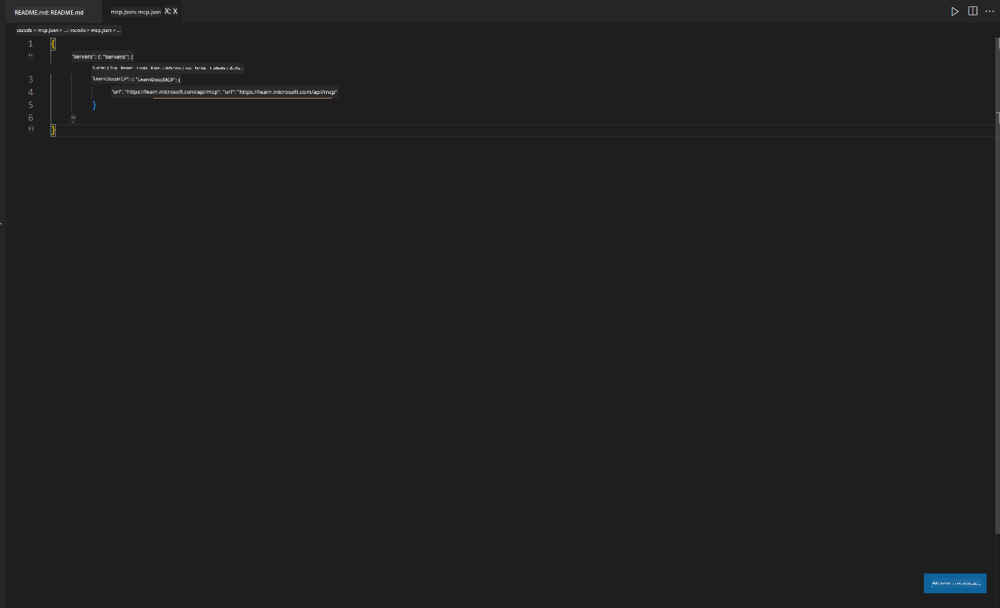
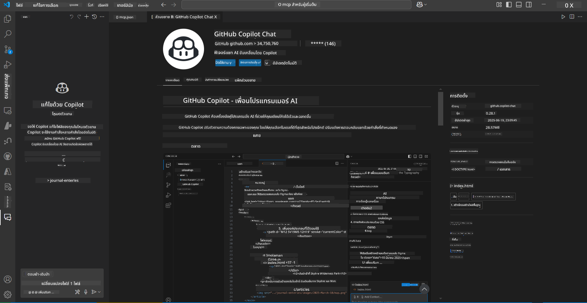
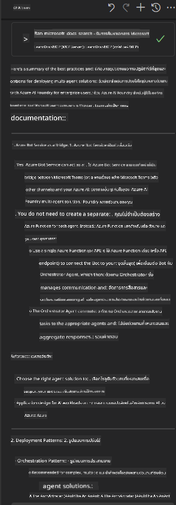

<!--
CO_OP_TRANSLATOR_METADATA:
{
  "original_hash": "db532b1ec386c9ce38c791653dc3c881",
  "translation_date": "2025-06-21T14:40:04+00:00",
  "source_file": "09-CaseStudy/docs-mcp/solution/scenario3/README.md",
  "language_code": "th"
}
-->
# Scenario 3: เอกสารในตัวแก้ไขด้วย MCP Server ใน VS Code

## ภาพรวม

ในสถานการณ์นี้ คุณจะได้เรียนรู้วิธีนำ Microsoft Learn Docs เข้ามาใช้งานโดยตรงในสภาพแวดล้อม Visual Studio Code ของคุณผ่าน MCP server แทนที่จะต้องสลับไปมาระหว่างแท็บเบราว์เซอร์เพื่อค้นหาเอกสาร คุณสามารถเข้าถึง ค้นหา และอ้างอิงเอกสารอย่างเป็นทางการได้ภายในตัวแก้ไขเลย วิธีนี้ช่วยให้การทำงานของคุณราบรื่นขึ้น โฟกัสกับงานได้ดีขึ้น และสามารถรวมเข้ากับเครื่องมือต่างๆ เช่น GitHub Copilot ได้อย่างไร้รอยต่อ

- ค้นหาและอ่านเอกสารภายใน VS Code โดยไม่ต้องออกจากสภาพแวดล้อมการเขียนโค้ด
- อ้างอิงเอกสารและแทรกลิงก์เข้าไปใน README หรือไฟล์คอร์สของคุณโดยตรง
- ใช้ GitHub Copilot และ MCP ร่วมกันเพื่อกระบวนการทำงานเอกสารที่ขับเคลื่อนด้วย AI อย่างไร้รอยต่อ

## วัตถุประสงค์การเรียนรู้

เมื่อจบบทนี้ คุณจะเข้าใจวิธีตั้งค่าและใช้งาน MCP server ใน VS Code เพื่อเพิ่มประสิทธิภาพการทำงานด้านเอกสารและการพัฒนา คุณจะสามารถ:

- กำหนดค่าพื้นที่ทำงานของคุณให้ใช้ MCP server สำหรับการค้นหาเอกสาร
- ค้นหาและแทรกเอกสารโดยตรงจากภายใน VS Code
- รวมพลังของ GitHub Copilot และ MCP เพื่อกระบวนการทำงานที่มีประสิทธิภาพและเสริมด้วย AI

ทักษะเหล่านี้จะช่วยให้คุณโฟกัสกับงานได้ดีขึ้น ปรับปรุงคุณภาพเอกสาร และเพิ่มประสิทธิภาพการทำงานในฐานะนักพัฒนาหรือผู้เขียนเอกสารเทคนิค

## วิธีแก้ไข

เพื่อให้สามารถเข้าถึงเอกสารภายในตัวแก้ไขได้ คุณจะทำตามขั้นตอนที่รวม MCP server เข้ากับ VS Code และ GitHub Copilot วิธีนี้เหมาะสำหรับผู้เขียนคอร์ส ผู้เขียนเอกสาร และนักพัฒนาที่ต้องการรักษาการโฟกัสในตัวแก้ไขขณะทำงานกับเอกสารและ Copilot

- เพิ่มลิงก์อ้างอิงไปยัง README ได้อย่างรวดเร็วขณะเขียนคอร์สหรือเอกสารโครงการ
- ใช้ Copilot สร้างโค้ด และ MCP ค้นหาและอ้างอิงเอกสารที่เกี่ยวข้องได้ทันที
- รักษาการโฟกัสในตัวแก้ไขและเพิ่มประสิทธิภาพการทำงาน

### คำแนะนำทีละขั้นตอน

เริ่มต้นด้วยการทำตามขั้นตอนเหล่านี้ สำหรับแต่ละขั้นตอน คุณสามารถเพิ่มภาพหน้าจอจากโฟลเดอร์ assets เพื่อแสดงภาพประกอบได้

1. **เพิ่มการตั้งค่า MCP:**
   ในโฟลเดอร์รากของโปรเจกต์ ให้สร้างไฟล์ `.vscode/mcp.json` และเพิ่มการตั้งค่าดังนี้:
   ```json
   {
     "servers": {
       "LearnDocsMCP": {
         "url": "https://learn.microsoft.com/api/mcp"
       }
     }
   }
   ```
   การตั้งค่านี้จะบอก VS Code ว่าจะเชื่อมต่อกับ [`Microsoft Learn Docs MCP server`](https://github.com/MicrosoftDocs/mcp) อย่างไร
   
   
    
2. **เปิดแผง GitHub Copilot Chat:**
   หากยังไม่ได้ติดตั้งส่วนขยาย GitHub Copilot ให้ไปที่มุมมอง Extensions ใน VS Code และติดตั้ง คุณสามารถดาวน์โหลดได้โดยตรงจาก [Visual Studio Code Marketplace](https://marketplace.visualstudio.com/items?itemName=GitHub.copilot-chat) จากนั้นเปิดแผง Copilot Chat จากแถบด้านข้าง

   

3. **เปิดใช้งานโหมด agent และตรวจสอบเครื่องมือ:**
   ในแผง Copilot Chat ให้เปิดใช้งานโหมด agent

   

   หลังเปิดโหมด agent ให้ตรวจสอบว่า MCP server ปรากฏเป็นหนึ่งในเครื่องมือที่ใช้ได้ เพื่อให้ตัวแทน Copilot สามารถเข้าถึงเซิร์ฟเวอร์เอกสารและดึงข้อมูลที่เกี่ยวข้องได้
   
   
4. **เริ่มแชทใหม่และส่งคำถามให้ agent:**
   เปิดแชทใหม่ในแผง Copilot Chat ตอนนี้คุณสามารถส่งคำถามเกี่ยวกับเอกสารให้ agent ได้ Agent จะใช้ MCP server เพื่อดึงและแสดงเอกสาร Microsoft Learn ที่เกี่ยวข้องโดยตรงในตัวแก้ไขของคุณ

   - *"ผมกำลังเขียนแผนการศึกษาหัวข้อ X จะศึกษาเป็นเวลา 8 สัปดาห์ สำหรับแต่ละสัปดาห์ ช่วยแนะนำเนื้อหาที่ควรเรียนให้หน่อยครับ"*

   

5. **การสืบค้นสด:**

   > มาดูตัวอย่างการสืบค้นสดจากส่วน [#get-help](https://discord.gg/D6cRhjHWSC) ใน Azure AI Foundry Discord ([ดูข้อความต้นฉบับ](https://discord.com/channels/1113626258182504448/1385498306720829572)):
   
   *"ผมกำลังหาคำตอบเกี่ยวกับการปรับใช้โซลูชัน multi-agent ที่ใช้ AI agents ที่พัฒนาใน Azure AI Foundry ผมเห็นว่าไม่มีวิธีการปรับใช้โดยตรง เช่น ช่องทาง Copilot Studio ดังนั้น มีวิธีการใดบ้างสำหรับผู้ใช้องค์กรที่จะโต้ตอบและทำงานให้สำเร็จ? มีบทความและบล็อกมากมายที่บอกว่าเราสามารถใช้บริการ Azure Bot เพื่อทำหน้าที่เป็นสะพานเชื่อมระหว่าง MS Teams กับ Azure AI Foundry Agents ได้ แต่ถ้าผมตั้งค่า Azure Bot ที่เชื่อมต่อกับ Orchestrator Agent บน Azure AI Foundry ผ่าน Azure Function เพื่อทำ orchestration หรือผมต้องสร้าง Azure Function สำหรับแต่ละ AI agent ในโซลูชัน multi-agent เพื่อทำ orchestration ใน Bot framework หรือมีคำแนะนำอื่นๆ เพิ่มเติมไหมครับ?"*

   

   ตัวแทนจะตอบกลับด้วยลิงก์เอกสารและสรุปที่เกี่ยวข้อง ซึ่งคุณสามารถแทรกลงในไฟล์ markdown ของคุณหรือใช้เป็นข้อมูลอ้างอิงในโค้ดได้ทันที
   
### ตัวอย่างคำถาม

นี่คือตัวอย่างคำถามที่คุณสามารถลองใช้ คำถามเหล่านี้จะแสดงให้เห็นว่า MCP server และ Copilot ทำงานร่วมกันอย่างไรเพื่อให้เอกสารและข้อมูลอ้างอิงที่เข้าใจบริบทได้ทันทีโดยไม่ต้องออกจาก VS Code:

- "แสดงวิธีใช้ Azure Functions triggers ให้ดูหน่อย"
- "แทรกลิงก์ไปยังเอกสารอย่างเป็นทางการของ Azure Key Vault"
- "แนวทางปฏิบัติที่ดีที่สุดสำหรับการรักษาความปลอดภัย Azure resources คืออะไร?"
- "ค้นหา quickstart สำหรับบริการ Azure AI"

คำถามเหล่านี้จะแสดงให้เห็นว่า MCP server และ Copilot ทำงานร่วมกันอย่างไรเพื่อให้เอกสารและข้อมูลอ้างอิงที่เข้าใจบริบทได้ทันทีโดยไม่ต้องออกจาก VS Code

---

**ข้อจำกัดความรับผิดชอบ**:  
เอกสารฉบับนี้ได้รับการแปลโดยใช้บริการแปลภาษาด้วย AI [Co-op Translator](https://github.com/Azure/co-op-translator) แม้เราจะพยายามให้ความถูกต้องสูงสุด แต่โปรดทราบว่าการแปลอัตโนมัติอาจมีข้อผิดพลาดหรือความไม่แม่นยำ เอกสารต้นฉบับในภาษาต้นทางถือเป็นแหล่งข้อมูลที่น่าเชื่อถือที่สุด สำหรับข้อมูลที่สำคัญ ควรใช้การแปลโดยมนุษย์ผู้เชี่ยวชาญ เราไม่รับผิดชอบต่อความเข้าใจผิดหรือการตีความผิดใด ๆ ที่เกิดจากการใช้การแปลนี้