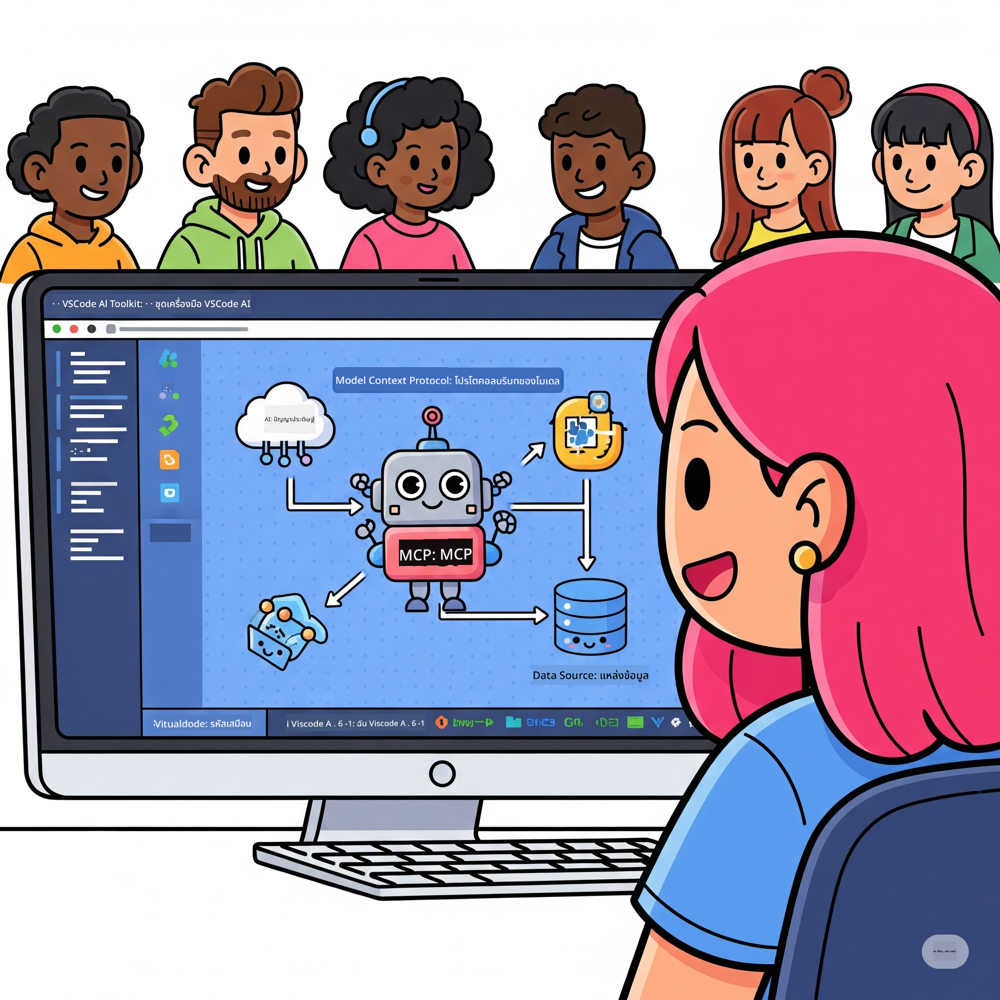
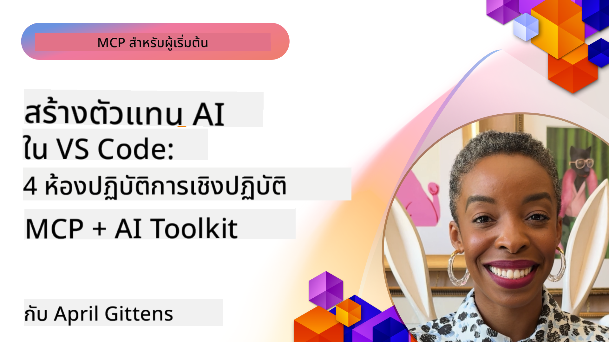

<!--
CO_OP_TRANSLATOR_METADATA:
{
  "original_hash": "1b000fd6e1b04c047578bfc5d07d54eb",
  "translation_date": "2025-08-18T14:39:41+00:00",
  "source_file": "10-StreamliningAIWorkflowsBuildingAnMCPServerWithAIToolkit/README.md",
  "language_code": "th"
}
-->
# การปรับปรุงเวิร์กโฟลว์ AI: การสร้าง MCP Server ด้วย AI Toolkit

  
  

## 🎯 ภาพรวม

_(คลิกที่ภาพด้านบนเพื่อดูวิดีโอของบทเรียนนี้)_

ยินดีต้อนรับสู่ **Model Context Protocol (MCP) Workshop**! เวิร์กช็อปแบบลงมือปฏิบัติจริงนี้รวมเทคโนโลยีล้ำสมัยสองอย่างเพื่อปฏิวัติการพัฒนาแอปพลิเคชัน AI:

- **🔗 Model Context Protocol (MCP)**: มาตรฐานเปิดสำหรับการผสานรวม AI และเครื่องมืออย่างไร้รอยต่อ  
- **🛠️ AI Toolkit for Visual Studio Code (AITK)**: ส่วนขยายการพัฒนา AI ที่ทรงพลังจาก Microsoft  

### 🎓 สิ่งที่คุณจะได้เรียนรู้

เมื่อจบเวิร์กช็อปนี้ คุณจะเชี่ยวชาญการสร้างแอปพลิเคชันอัจฉริยะที่เชื่อมโยงโมเดล AI กับเครื่องมือและบริการในโลกจริง ตั้งแต่การทดสอบอัตโนมัติไปจนถึงการผสานรวม API แบบกำหนดเอง คุณจะได้รับทักษะที่สามารถแก้ปัญหาทางธุรกิจที่ซับซ้อนได้

## 🏗️ เทคโนโลยีที่ใช้

### 🔌 Model Context Protocol (MCP)

MCP คือ **"USB-C สำหรับ AI"** - มาตรฐานสากลที่เชื่อมต่อโมเดล AI กับเครื่องมือและแหล่งข้อมูลภายนอก

**✨ คุณสมบัติเด่น:**

- 🔄 **การผสานรวมมาตรฐาน**: อินเทอร์เฟซสากลสำหรับการเชื่อมต่อ AI และเครื่องมือ  
- 🏛️ **สถาปัตยกรรมที่ยืดหยุ่น**: รองรับเซิร์ฟเวอร์ทั้งแบบโลคอลและรีโมตผ่าน stdio/SSE  
- 🧰 **ระบบนิเวศที่หลากหลาย**: รวมเครื่องมือ, prompts และทรัพยากรในโปรโตคอลเดียว  
- 🔒 **พร้อมใช้งานในองค์กร**: มีระบบความปลอดภัยและความน่าเชื่อถือในตัว  

**🎯 ทำไม MCP ถึงสำคัญ:**
เหมือนกับที่ USB-C ช่วยลดความยุ่งยากของสายเคเบิล MCP ช่วยลดความซับซ้อนของการผสานรวม AI หนึ่งโปรโตคอล แต่มีความเป็นไปได้ไม่สิ้นสุด

### 🤖 AI Toolkit for Visual Studio Code (AITK)

ส่วนขยายการพัฒนา AI ชั้นนำของ Microsoft ที่เปลี่ยน VS Code ให้กลายเป็นศูนย์กลางพลังงาน AI

**🚀 ความสามารถหลัก:**

- 📦 **Model Catalog**: เข้าถึงโมเดลจาก Azure AI, GitHub, Hugging Face, Ollama  
- ⚡ **Local Inference**: การประมวลผลที่ปรับแต่งด้วย ONNX สำหรับ CPU/GPU/NPU  
- 🏗️ **Agent Builder**: การพัฒนา AI agent แบบภาพพร้อมการผสาน MCP  
- 🎭 **Multi-Modal**: รองรับข้อความ, ภาพ และผลลัพธ์แบบโครงสร้าง  

**💡 ประโยชน์ในการพัฒนา:**

- การปรับใช้โมเดลแบบไม่ต้องตั้งค่า  
- การออกแบบ prompt แบบภาพ  
- สนามทดสอบแบบเรียลไทม์  
- การผสาน MCP server อย่างไร้รอยต่อ  

## 📚 เส้นทางการเรียนรู้

### [🚀 โมดูล 1: พื้นฐาน AI Toolkit](./lab1/README.md)

**ระยะเวลา**: 15 นาที  

- 🛠️ ติดตั้งและตั้งค่า AI Toolkit สำหรับ VS Code  
- 🗂️ สำรวจ Model Catalog (โมเดลกว่า 100+ จาก GitHub, ONNX, OpenAI, Anthropic, Google)  
- 🎮 เรียนรู้การใช้งาน Interactive Playground สำหรับการทดสอบโมเดลแบบเรียลไทม์  
- 🤖 สร้าง AI agent ตัวแรกของคุณด้วย Agent Builder  
- 📊 ประเมินประสิทธิภาพโมเดลด้วยเมตริกในตัว (F1, ความเกี่ยวข้อง, ความคล้ายคลึง, ความสอดคล้อง)  
- ⚡ เรียนรู้ความสามารถในการประมวลผลแบบแบตช์และการรองรับหลายรูปแบบ  

**🎯 ผลลัพธ์การเรียนรู้**: สร้าง AI agent ที่ใช้งานได้พร้อมความเข้าใจในความสามารถของ AITK  

### [🌐 โมดูล 2: พื้นฐาน MCP กับ AI Toolkit](./lab2/README.md)

**ระยะเวลา**: 20 นาที  

- 🧠 เรียนรู้สถาปัตยกรรมและแนวคิดของ Model Context Protocol (MCP)  
- 🌐 สำรวจระบบนิเวศ MCP server ของ Microsoft  
- 🤖 สร้าง browser automation agent ด้วย Playwright MCP server  
- 🔧 ผสาน MCP servers กับ AI Toolkit Agent Builder  
- 📊 ตั้งค่าและทดสอบเครื่องมือ MCP ภายใน agents ของคุณ  
- 🚀 ส่งออกและปรับใช้ agents ที่ขับเคลื่อนด้วย MCP สำหรับการใช้งานจริง  

**🎯 ผลลัพธ์การเรียนรู้**: ปรับใช้ AI agent ที่เสริมพลังด้วยเครื่องมือภายนอกผ่าน MCP  

### [🔧 โมดูล 3: การพัฒนา MCP ขั้นสูงด้วย AI Toolkit](./lab3/README.md)

**ระยะเวลา**: 20 นาที  

- 💻 สร้าง MCP servers แบบกำหนดเองด้วย AI Toolkit  
- 🐍 ตั้งค่าและใช้งาน MCP Python SDK เวอร์ชันล่าสุด (v1.9.3)  
- 🔍 ตั้งค่าและใช้งาน MCP Inspector สำหรับการดีบัก  
- 🛠️ สร้าง Weather MCP Server พร้อมเวิร์กโฟลว์การดีบักระดับมืออาชีพ  
- 🧪 ดีบัก MCP servers ในทั้ง Agent Builder และ Inspector  

**🎯 ผลลัพธ์การเรียนรู้**: พัฒนาและดีบัก MCP servers แบบกำหนดเองด้วยเครื่องมือที่ทันสมัย  

### [🐙 โมดูล 4: การพัฒนา MCP ในทางปฏิบัติ - Custom GitHub Clone Server](./lab4/README.md)

**ระยะเวลา**: 30 นาที  

- 🏗️ สร้าง GitHub Clone MCP Server สำหรับเวิร์กโฟลว์การพัฒนา  
- 🔄 ใช้การโคลน repository อัจฉริยะพร้อมการตรวจสอบและจัดการข้อผิดพลาด  
- 📁 สร้างการจัดการไดเรกทอรีอัจฉริยะและการผสาน VS Code  
- 🤖 ใช้ GitHub Copilot Agent Mode กับเครื่องมือ MCP แบบกำหนดเอง  
- 🛡️ ใช้ความน่าเชื่อถือระดับการผลิตและความเข้ากันได้ข้ามแพลตฟอร์ม  

**🎯 ผลลัพธ์การเรียนรู้**: ปรับใช้ MCP server ระดับการผลิตที่ช่วยปรับปรุงเวิร์กโฟลว์การพัฒนา  

## 💡 การใช้งานจริงและผลกระทบ

### 🏢 กรณีการใช้งานในองค์กร

#### 🔄 การทำงานอัตโนมัติใน DevOps

เปลี่ยนเวิร์กโฟลว์การพัฒนาด้วยระบบอัตโนมัติอัจฉริยะ:

- **การจัดการ Repository อัจฉริยะ**: การตรวจสอบโค้ดและการตัดสินใจ merge โดย AI  
- **CI/CD อัจฉริยะ**: การปรับปรุง pipeline อัตโนมัติตามการเปลี่ยนแปลงโค้ด  
- **การจัดการปัญหา**: การจัดประเภทและมอบหมายบั๊กอัตโนมัติ  

#### 🧪 การปฏิวัติการประกันคุณภาพ

ยกระดับการทดสอบด้วยระบบอัตโนมัติที่ขับเคลื่อนด้วย AI:

- **การสร้างการทดสอบอัจฉริยะ**: สร้างชุดการทดสอบที่ครอบคลุมโดยอัตโนมัติ  
- **การทดสอบการเปลี่ยนแปลง UI**: การตรวจจับการเปลี่ยนแปลง UI ด้วย AI  
- **การตรวจสอบประสิทธิภาพ**: การระบุและแก้ไขปัญหาเชิงรุก  

#### 📊 ความฉลาดในกระบวนการข้อมูล

สร้างเวิร์กโฟลว์การประมวลผลข้อมูลที่ชาญฉลาด:

- **กระบวนการ ETL แบบปรับตัว**: การแปลงข้อมูลที่ปรับตัวเองได้  
- **การตรวจจับความผิดปกติ**: การตรวจสอบคุณภาพข้อมูลแบบเรียลไทม์  
- **การจัดการการไหลของข้อมูลอัจฉริยะ**: การจัดการการไหลของข้อมูลอย่างชาญฉลาด  

#### 🎧 การปรับปรุงประสบการณ์ลูกค้า

สร้างการโต้ตอบกับลูกค้าที่โดดเด่น:

- **การสนับสนุนที่เข้าใจบริบท**: AI agents ที่เข้าถึงประวัติลูกค้า  
- **การแก้ปัญหาเชิงรุก**: การบริการลูกค้าเชิงคาดการณ์  
- **การผสานหลายช่องทาง**: ประสบการณ์ AI ที่รวมเป็นหนึ่งในทุกแพลตฟอร์ม  

## 🛠️ ข้อกำหนดและการตั้งค่า

### 💻 ข้อกำหนดของระบบ

| ส่วนประกอบ | ข้อกำหนด | หมายเหตุ |
|------------|-----------|----------|
| **ระบบปฏิบัติการ** | Windows 10+, macOS 10.15+, Linux | ระบบปฏิบัติการสมัยใหม่ใดก็ได้ |
| **Visual Studio Code** | เวอร์ชันเสถียรล่าสุด | จำเป็นสำหรับ AITK |
| **Node.js** | v18.0+ และ npm | สำหรับการพัฒนา MCP server |
| **Python** | 3.10+ | ตัวเลือกสำหรับ MCP servers ที่ใช้ Python |
| **หน่วยความจำ** | RAM 8GB ขั้นต่ำ | แนะนำ 16GB สำหรับโมเดลโลคอล |

### 🔧 สภาพแวดล้อมการพัฒนา

#### ส่วนขยาย VS Code ที่แนะนำ

- **AI Toolkit** (ms-windows-ai-studio.windows-ai-studio)  
- **Python** (ms-python.python)  
- **Python Debugger** (ms-python.debugpy)  
- **GitHub Copilot** (GitHub.copilot) - ตัวเลือกแต่มีประโยชน์  

#### เครื่องมือเสริม

- **uv**: ตัวจัดการแพ็กเกจ Python สมัยใหม่  
- **MCP Inspector**: เครื่องมือดีบักแบบภาพสำหรับ MCP servers  
- **Playwright**: สำหรับตัวอย่างการทำงานอัตโนมัติบนเว็บ  

## 🎖️ ผลลัพธ์การเรียนรู้และเส้นทางการรับรอง

### 🏆 เช็กลิสต์ความเชี่ยวชาญ

เมื่อจบเวิร์กช็อปนี้ คุณจะเชี่ยวชาญใน:

#### 🎯 ความสามารถหลัก

- [ ] **ความเชี่ยวชาญในโปรโตคอล MCP**: ความเข้าใจเชิงลึกในสถาปัตยกรรมและรูปแบบการใช้งาน  
- [ ] **ความชำนาญใน AITK**: การใช้งาน AI Toolkit ระดับผู้เชี่ยวชาญสำหรับการพัฒนาอย่างรวดเร็ว  
- [ ] **การพัฒนาเซิร์ฟเวอร์แบบกำหนดเอง**: สร้าง, ปรับใช้ และดูแล MCP servers ระดับการผลิต  
- [ ] **ความเป็นเลิศในการผสานเครื่องมือ**: เชื่อมต่อ AI กับเวิร์กโฟลว์การพัฒนาที่มีอยู่  
- [ ] **การประยุกต์แก้ปัญหา**: ใช้ทักษะที่เรียนรู้เพื่อแก้ปัญหาทางธุรกิจจริง  

#### 🔧 ทักษะทางเทคนิค

- [ ] ตั้งค่าและกำหนดค่า AI Toolkit ใน VS Code  
- [ ] ออกแบบและพัฒนา MCP servers แบบกำหนดเอง  
- [ ] ผสานโมเดล GitHub กับสถาปัตยกรรม MCP  
- [ ] สร้างเวิร์กโฟลว์การทดสอบอัตโนมัติด้วย Playwright  
- [ ] ปรับใช้ AI agents สำหรับการใช้งานจริง  
- [ ] ดีบักและปรับปรุงประสิทธิภาพ MCP server  

#### 🚀 ความสามารถขั้นสูง

- [ ] ออกแบบการผสาน AI ระดับองค์กร  
- [ ] ใช้แนวปฏิบัติที่ดีที่สุดด้านความปลอดภัยสำหรับแอปพลิเคชัน AI  
- [ ] ออกแบบสถาปัตยกรรม MCP server ที่ปรับขยายได้  
- [ ] สร้างชุดเครื่องมือแบบกำหนดเองสำหรับโดเมนเฉพาะ  
- [ ] เป็นที่ปรึกษาให้ผู้อื่นในด้านการพัฒนา AI-native  

## 📖 ทรัพยากรเพิ่มเติม

- [MCP Specification](https://modelcontextprotocol.io/docs)  
- [AI Toolkit GitHub Repository](https://github.com/microsoft/vscode-ai-toolkit)  
- [Sample MCP Servers Collection](https://github.com/modelcontextprotocol/servers)  
- [Best Practices Guide](https://modelcontextprotocol.io/docs/best-practices)  

---

**🚀 พร้อมที่จะปฏิวัติเวิร์กโฟลว์การพัฒนา AI ของคุณหรือยัง?**

มาสร้างอนาคตของแอปพลิเคชันอัจฉริยะไปด้วยกันด้วย MCP และ AI Toolkit!

**ข้อจำกัดความรับผิดชอบ**:  
เอกสารนี้ได้รับการแปลโดยใช้บริการแปลภาษา AI [Co-op Translator](https://github.com/Azure/co-op-translator) แม้ว่าเราจะพยายามให้การแปลมีความถูกต้อง แต่โปรดทราบว่าการแปลอัตโนมัติอาจมีข้อผิดพลาดหรือความไม่แม่นยำ เอกสารต้นฉบับในภาษาดั้งเดิมควรถือเป็นแหล่งข้อมูลที่เชื่อถือได้ สำหรับข้อมูลที่สำคัญ ขอแนะนำให้ใช้บริการแปลภาษามนุษย์มืออาชีพ เราจะไม่รับผิดชอบต่อความเข้าใจผิดหรือการตีความที่ผิดพลาดซึ่งเกิดจากการใช้การแปลนี้