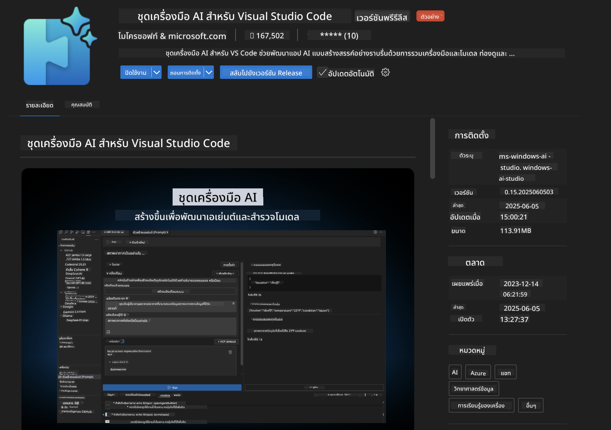
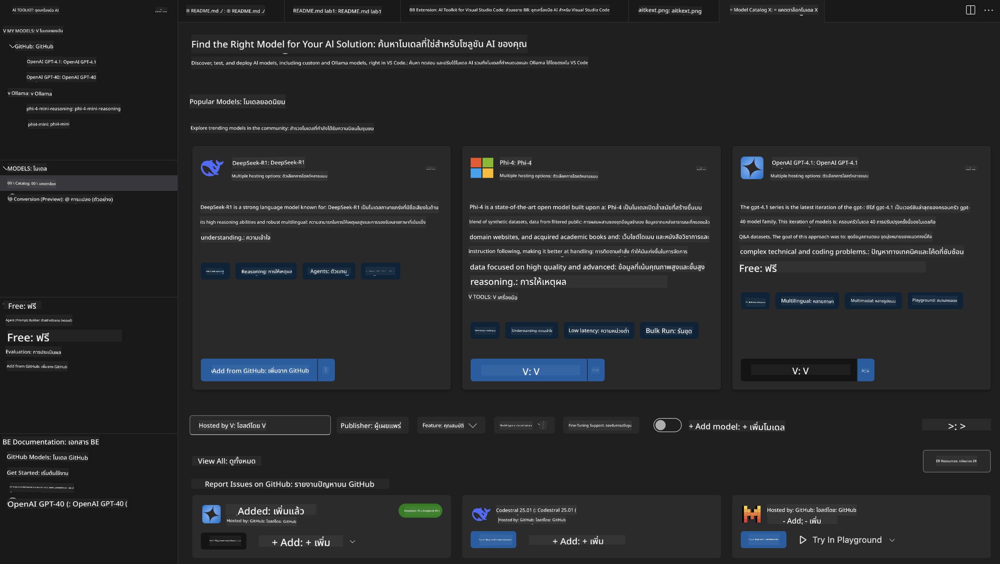
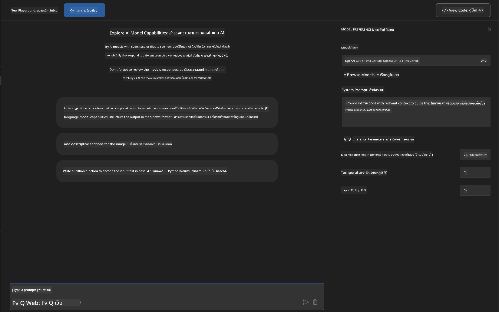
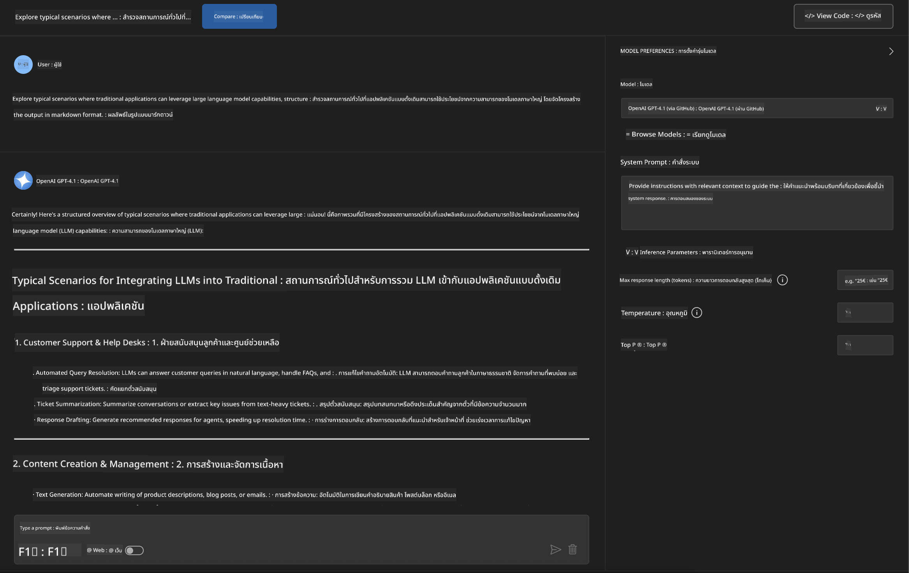
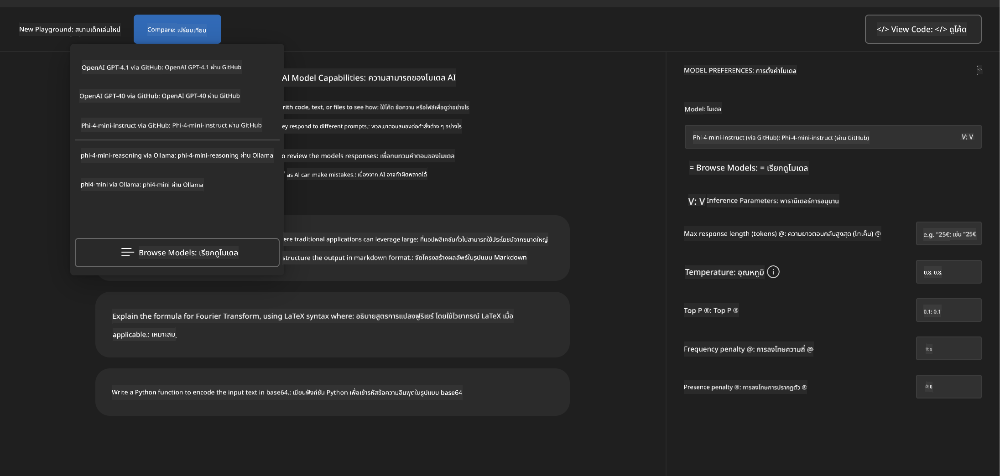
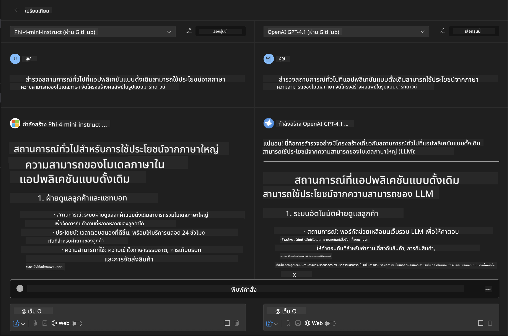
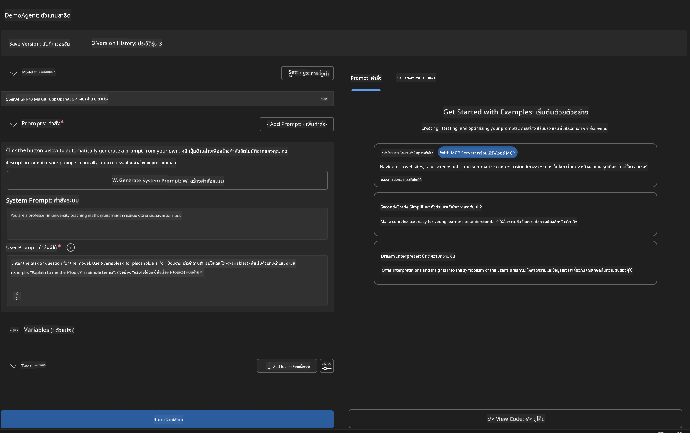
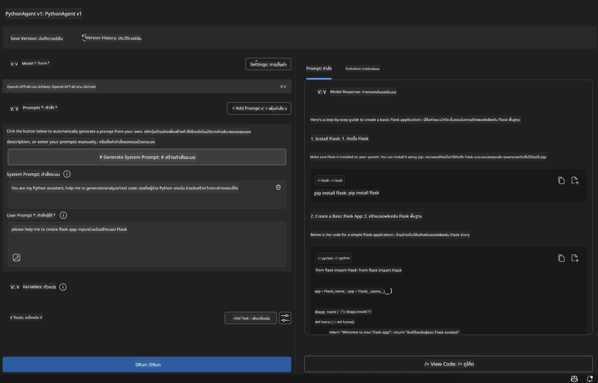

<!--
CO_OP_TRANSLATOR_METADATA:
{
  "original_hash": "2aa9dbc165e104764fa57e8a0d3f1c73",
  "translation_date": "2025-07-14T07:27:44+00:00",
  "source_file": "10-StreamliningAIWorkflowsBuildingAnMCPServerWithAIToolkit/lab1/README.md",
  "language_code": "th"
}
-->
# 🚀 โมดูล 1: พื้นฐาน AI Toolkit

[]()
[]()
[]()

## 📋 วัตถุประสงค์การเรียนรู้

เมื่อจบโมดูลนี้ คุณจะสามารถ:
- ✅ ติดตั้งและตั้งค่า AI Toolkit สำหรับ Visual Studio Code
- ✅ เรียกดู Model Catalog และเข้าใจแหล่งที่มาของโมเดลต่างๆ
- ✅ ใช้ Playground สำหรับทดสอบและทดลองโมเดล
- ✅ สร้างเอเจนต์ AI แบบกำหนดเองด้วย Agent Builder
- ✅ เปรียบเทียบประสิทธิภาพของโมเดลจากผู้ให้บริการต่างๆ
- ✅ นำแนวทางปฏิบัติที่ดีที่สุดสำหรับการออกแบบ prompt มาใช้

## 🧠 แนะนำ AI Toolkit (AITK)

**AI Toolkit สำหรับ Visual Studio Code** คือส่วนขยายหลักของ Microsoft ที่เปลี่ยน VS Code ให้เป็นสภาพแวดล้อมพัฒนา AI แบบครบวงจร เชื่อมโยงระหว่างงานวิจัย AI กับการพัฒนาแอปพลิเคชันจริง ทำให้ AI สร้างสรรค์เข้าถึงได้ง่ายสำหรับนักพัฒนาทุกระดับ

### 🌟 ความสามารถหลัก

| ฟีเจอร์ | คำอธิบาย | กรณีใช้งาน |
|---------|-------------|----------|
| **🗂️ Model Catalog** | เข้าถึงโมเดลกว่า 100 โมเดลจาก GitHub, ONNX, OpenAI, Anthropic, Google | ค้นหาและเลือกโมเดล |
| **🔌 BYOM Support** | รวมโมเดลของคุณเอง (ทั้งในเครื่องและระยะไกล) | การปรับใช้โมเดลแบบกำหนดเอง |
| **🎮 Interactive Playground** | ทดสอบโมเดลแบบเรียลไทม์ผ่านอินเทอร์เฟซแชท | การสร้างต้นแบบและทดสอบอย่างรวดเร็ว |
| **📎 Multi-Modal Support** | รองรับข้อความ รูปภาพ และไฟล์แนบ | แอป AI ที่ซับซ้อน |
| **⚡ Batch Processing** | รันหลาย prompt พร้อมกัน | เพิ่มประสิทธิภาพการทดสอบ |
| **📊 Model Evaluation** | มีเมตริกในตัว (F1, ความเกี่ยวข้อง, ความคล้ายคลึง, ความสอดคล้อง) | ประเมินประสิทธิภาพ |

### 🎯 ทำไม AI Toolkit ถึงสำคัญ

- **🚀 พัฒนาได้เร็วขึ้น**: จากไอเดียสู่ต้นแบบในไม่กี่นาที
- **🔄 เวิร์กโฟลว์รวมศูนย์**: อินเทอร์เฟซเดียวสำหรับผู้ให้บริการ AI หลายราย
- **🧪 ทดลองง่าย**: เปรียบเทียบโมเดลโดยไม่ต้องตั้งค่าซับซ้อน
- **📈 พร้อมใช้งานจริง**: เปลี่ยนจากต้นแบบสู่การใช้งานจริงได้อย่างราบรื่น

## 🛠️ ข้อกำหนดเบื้องต้น & การตั้งค่า

### 📦 ติดตั้งส่วนขยาย AI Toolkit

**ขั้นตอนที่ 1: เข้าสู่ Extensions Marketplace**
1. เปิด Visual Studio Code
2. ไปที่มุมมอง Extensions (`Ctrl+Shift+X` หรือ `Cmd+Shift+X`)
3. ค้นหา "AI Toolkit"

**ขั้นตอนที่ 2: เลือกเวอร์ชันของคุณ**
- **🟢 Release**: แนะนำสำหรับใช้งานจริง
- **🔶 Pre-release**: เข้าถึงฟีเจอร์ใหม่ก่อนใคร

**ขั้นตอนที่ 3: ติดตั้งและเปิดใช้งาน**



### ✅ รายการตรวจสอบการยืนยัน
- [ ] ไอคอน AI Toolkit ปรากฏในแถบด้านข้างของ VS Code
- [ ] ส่วนขยายถูกเปิดใช้งานและทำงาน
- [ ] ไม่มีข้อผิดพลาดในการติดตั้งในแผงผลลัพธ์

## 🧪 แบบฝึกหัด 1: สำรวจโมเดล GitHub

**🎯 วัตถุประสงค์**: เชี่ยวชาญการใช้งาน Model Catalog และทดสอบโมเดล AI ตัวแรกของคุณ

### 📊 ขั้นตอนที่ 1: เรียกดู Model Catalog

Model Catalog คือประตูสู่ระบบนิเวศ AI รวมโมเดลจากผู้ให้บริการหลายราย ทำให้ค้นหาและเปรียบเทียบได้ง่าย

**🔍 คู่มือการนำทาง:**

คลิกที่ **MODELS - Catalog** ในแถบด้านข้างของ AI Toolkit



**💡 เคล็ดลับ**: มองหาโมเดลที่มีความสามารถเฉพาะที่ตรงกับกรณีใช้งานของคุณ (เช่น การสร้างโค้ด, การเขียนเชิงสร้างสรรค์, การวิเคราะห์)

**⚠️ หมายเหตุ**: โมเดลที่โฮสต์บน GitHub (GitHub Models) ใช้งานได้ฟรีแต่มีข้อจำกัดเรื่องจำนวนคำขอและโทเค็น หากต้องการเข้าถึงโมเดลนอก GitHub (เช่น โมเดลที่โฮสต์ผ่าน Azure AI หรือจุดเชื่อมต่ออื่นๆ) คุณจะต้องใช้ API key หรือการยืนยันตัวตนที่เหมาะสม

### 🚀 ขั้นตอนที่ 2: เพิ่มและตั้งค่าโมเดลตัวแรกของคุณ

**กลยุทธ์การเลือกโมเดล:**
- **GPT-4.1**: เหมาะสำหรับการวิเคราะห์และเหตุผลซับซ้อน
- **Phi-4-mini**: น้ำหนักเบา ตอบสนองรวดเร็วสำหรับงานง่ายๆ

**🔧 ขั้นตอนการตั้งค่า:**
1. เลือก **OpenAI GPT-4.1** จาก catalog
2. คลิก **Add to My Models** เพื่อจดทะเบียนโมเดลสำหรับใช้งาน
3. เลือก **Try in Playground** เพื่อเปิดสภาพแวดล้อมทดสอบ
4. รอการเริ่มต้นโมเดล (การตั้งค่าเริ่มต้นอาจใช้เวลาสักครู่)



**⚙️ ทำความเข้าใจพารามิเตอร์ของโมเดล:**
- **Temperature**: ควบคุมความคิดสร้างสรรค์ (0 = ตายตัว, 1 = สร้างสรรค์)
- **Max Tokens**: ความยาวตอบกลับสูงสุด
- **Top-p**: การสุ่มแบบนิวเคลียสเพื่อความหลากหลายของคำตอบ

### 🎯 ขั้นตอนที่ 3: เชี่ยวชาญการใช้งาน Playground

Playground คือห้องทดลอง AI ของคุณ นี่คือวิธีใช้ให้เต็มประสิทธิภาพ:

**🎨 แนวทางปฏิบัติที่ดีที่สุดสำหรับการออกแบบ prompt:**
1. **ระบุชัดเจน**: คำสั่งที่ชัดเจนและละเอียดจะได้ผลลัพธ์ดีกว่า
2. **ให้บริบท**: ใส่ข้อมูลพื้นหลังที่เกี่ยวข้อง
3. **ใช้ตัวอย่าง**: แสดงตัวอย่างที่ต้องการให้โมเดลเข้าใจ
4. **ปรับปรุง**: แก้ไข prompt ตามผลลัพธ์ที่ได้

**🧪 สถานการณ์ทดสอบ:**
```markdown
# Example 1: Code Generation
"Write a Python function that calculates the factorial of a number using recursion. Include error handling and docstrings."

# Example 2: Creative Writing
"Write a professional email to a client explaining a project delay, maintaining a positive tone while being transparent about challenges."

# Example 3: Data Analysis
"Analyze this sales data and provide insights: [paste your data]. Focus on trends, anomalies, and actionable recommendations."
```



### 🏆 แบบฝึกหัดท้าทาย: เปรียบเทียบประสิทธิภาพโมเดล

**🎯 เป้าหมาย**: เปรียบเทียบโมเดลต่างๆ โดยใช้ prompt เดียวกันเพื่อเข้าใจจุดแข็งของแต่ละโมเดล

**📋 คำแนะนำ:**
1. เพิ่ม **Phi-4-mini** ในพื้นที่ทำงานของคุณ
2. ใช้ prompt เดียวกันกับทั้ง GPT-4.1 และ Phi-4-mini



3. เปรียบเทียบคุณภาพการตอบสนอง ความเร็ว และความแม่นยำ
4. บันทึกผลการทดลองในส่วนผลลัพธ์



**💡 ข้อสังเกตสำคัญที่ควรค้นพบ:**
- เมื่อไหร่ควรใช้ LLM กับ SLM
- การแลกเปลี่ยนระหว่างต้นทุนกับประสิทธิภาพ
- ความสามารถเฉพาะตัวของโมเดลแต่ละแบบ

## 🤖 แบบฝึกหัด 2: สร้างเอเจนต์แบบกำหนดเองด้วย Agent Builder

**🎯 วัตถุประสงค์**: สร้างเอเจนต์ AI เฉพาะทางที่เหมาะกับงานและเวิร์กโฟลว์เฉพาะ

### 🏗️ ขั้นตอนที่ 1: ทำความเข้าใจ Agent Builder

Agent Builder คือจุดเด่นของ AI Toolkit ช่วยให้คุณสร้างผู้ช่วย AI ที่ออกแบบมาเฉพาะ โดยผสมผสานพลังของโมเดลภาษาใหญ่กับคำสั่งเฉพาะ พารามิเตอร์ และความรู้เฉพาะทาง

**🧠 ส่วนประกอบสถาปัตยกรรมของเอเจนต์:**
- **Core Model**: โมเดลหลัก (GPT-4, Groks, Phi ฯลฯ)
- **System Prompt**: กำหนดบุคลิกและพฤติกรรมของเอเจนต์
- **Parameters**: การตั้งค่าปรับแต่งเพื่อประสิทธิภาพสูงสุด
- **Tools Integration**: เชื่อมต่อกับ API ภายนอกและบริการ MCP
- **Memory**: บริบทการสนทนาและการเก็บสถานะเซสชัน



### ⚙️ ขั้นตอนที่ 2: เจาะลึกการตั้งค่าเอเจนต์

**🎨 การสร้าง System Prompt ที่มีประสิทธิภาพ:**
```markdown
# Template Structure:
## Role Definition
You are a [specific role] with expertise in [domain].

## Capabilities
- List specific abilities
- Define scope of knowledge
- Clarify limitations

## Behavior Guidelines
- Response style (formal, casual, technical)
- Output format preferences
- Error handling approach

## Examples
Provide 2-3 examples of ideal interactions
```

*แน่นอนว่าคุณยังสามารถใช้ Generate System Prompt เพื่อให้ AI ช่วยสร้างและปรับแต่ง prompt ได้*

**🔧 การปรับแต่งพารามิเตอร์:**
| พารามิเตอร์ | ช่วงแนะนำ | กรณีใช้งาน |
|-----------|------------------|----------|
| **Temperature** | 0.1-0.3 | ตอบกลับเชิงเทคนิค/ข้อเท็จจริง |
| **Temperature** | 0.7-0.9 | งานสร้างสรรค์/ระดมความคิด |
| **Max Tokens** | 500-1000 | ตอบสั้นกระชับ |
| **Max Tokens** | 2000-4000 | อธิบายละเอียด |

### 🐍 ขั้นตอนที่ 3: แบบฝึกหัดปฏิบัติ - เอเจนต์โปรแกรมมิ่ง Python

**🎯 ภารกิจ**: สร้างผู้ช่วยเขียนโค้ด Python เฉพาะทาง

**📋 ขั้นตอนการตั้งค่า:**

1. **เลือกโมเดล**: เลือก **Claude 3.5 Sonnet** (เหมาะสำหรับโค้ด)

2. **ออกแบบ System Prompt**:
```markdown
# Python Programming Expert Agent

## Role
You are a senior Python developer with 10+ years of experience. You excel at writing clean, efficient, and well-documented Python code.

## Capabilities
- Write production-ready Python code
- Debug complex issues
- Explain code concepts clearly
- Suggest best practices and optimizations
- Provide complete working examples

## Response Format
- Always include docstrings
- Add inline comments for complex logic
- Suggest testing approaches
- Mention relevant libraries when applicable

## Code Quality Standards
- Follow PEP 8 style guidelines
- Use type hints where appropriate
- Handle exceptions gracefully
- Write readable, maintainable code
```

3. **ตั้งค่าพารามิเตอร์**:
   - Temperature: 0.2 (เพื่อโค้ดที่สม่ำเสมอและน่าเชื่อถือ)
   - Max Tokens: 2000 (อธิบายละเอียด)
   - Top-p: 0.9 (สมดุลความคิดสร้างสรรค์)



### 🧪 ขั้นตอนที่ 4: ทดสอบเอเจนต์ Python ของคุณ

**สถานการณ์ทดสอบ:**
1. **ฟังก์ชันพื้นฐาน**: "สร้างฟังก์ชันค้นหาจำนวนเฉพาะ"
2. **อัลกอริทึมซับซ้อน**: "สร้าง binary search tree พร้อมฟังก์ชัน insert, delete และ search"
3. **ปัญหาในโลกจริง**: "สร้างเว็บสแครปเปอร์ที่จัดการกับการจำกัดอัตราและการลองใหม่"
4. **ดีบักโค้ด**: "แก้ไขโค้ดนี้ [วางโค้ดที่มีบั๊ก]"

**🏆 เกณฑ์ความสำเร็จ:**
- ✅ โค้ดทำงานไม่มีข้อผิดพลาด
- ✅ มีเอกสารประกอบโค้ดอย่างเหมาะสม
- ✅ ปฏิบัติตามแนวทางปฏิบัติที่ดีที่สุดของ Python
- ✅ อธิบายได้ชัดเจน
- ✅ แนะนำการปรับปรุง

## 🎓 สรุปโมดูล 1 & ขั้นตอนถัดไป

### 📊 ตรวจสอบความรู้

ทดสอบความเข้าใจของคุณ:
- [ ] อธิบายความแตกต่างระหว่างโมเดลใน catalog ได้หรือไม่?
- [ ] สร้างและทดสอบเอเจนต์แบบกำหนดเองสำเร็จหรือยัง?
- [ ] เข้าใจวิธีปรับพารามิเตอร์ให้เหมาะกับกรณีใช้งานต่างๆ หรือไม่?
- [ ] ออกแบบ system prompt ที่มีประสิทธิภาพได้หรือไม่?

### 📚 แหล่งข้อมูลเพิ่มเติม

- **เอกสาร AI Toolkit**: [Official Microsoft Docs](https://github.com/microsoft/vscode-ai-toolkit)
- **คู่มือ Prompt Engineering**: [Best Practices](https://platform.openai.com/docs/guides/prompt-engineering)
- **โมเดลใน AI Toolkit**: [Models in Develpment](https://github.com/microsoft/vscode-ai-toolkit/blob/main/doc/models.md)

**🎉 ยินดีด้วย!** คุณได้เรียนรู้พื้นฐานของ AI Toolkit และพร้อมที่จะสร้างแอป AI ขั้นสูงต่อไปแล้ว!

### 🔜 ไปยังโมดูลถัดไป

พร้อมสำหรับความสามารถขั้นสูงขึ้นหรือยัง? ไปต่อที่ **[โมดูล 2: MCP กับพื้นฐาน AI Toolkit](../lab2/README.md)** ที่คุณจะได้เรียนรู้วิธี:
- เชื่อมต่อเอเจนต์กับเครื่องมือภายนอกด้วย Model Context Protocol (MCP)
- สร้างเอเจนต์อัตโนมัติบนเบราว์เซอร์ด้วย Playwright
- รวม MCP server กับเอเจนต์ AI Toolkit ของคุณ
- เพิ่มพลังให้เอเจนต์ด้วยข้อมูลและความสามารถจากภายนอก

**ข้อจำกัดความรับผิดชอบ**:  
เอกสารนี้ได้รับการแปลโดยใช้บริการแปลภาษาอัตโนมัติ [Co-op Translator](https://github.com/Azure/co-op-translator) แม้เราจะพยายามให้ความถูกต้องสูงสุด แต่โปรดทราบว่าการแปลอัตโนมัติอาจมีข้อผิดพลาดหรือความไม่ถูกต้อง เอกสารต้นฉบับในภาษาต้นทางถือเป็นแหล่งข้อมูลที่เชื่อถือได้ สำหรับข้อมูลที่สำคัญ ขอแนะนำให้ใช้บริการแปลโดยผู้เชี่ยวชาญมนุษย์ เราไม่รับผิดชอบต่อความเข้าใจผิดหรือการตีความผิดใด ๆ ที่เกิดจากการใช้การแปลนี้