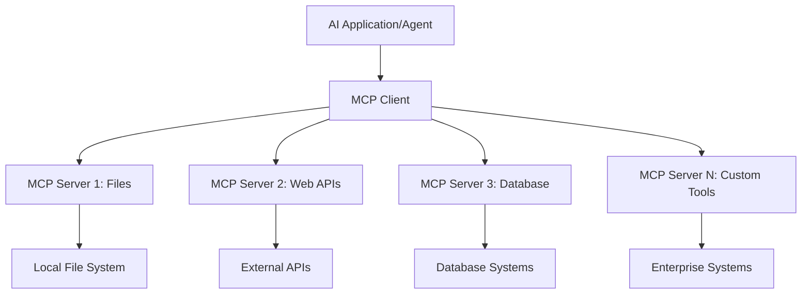

<!--
CO_OP_TRANSLATOR_METADATA:
{
  "original_hash": "a22b7dd11cd7690f99f9195877cafdc3",
  "translation_date": "2025-06-10T05:49:08+00:00",
  "source_file": "10-StreamliningAIWorkflowsBuildingAnMCPServerWithAIToolkit/lab2/README.md",
  "language_code": "th"
}
-->
# 🌐 Module 2: MCP with AI Toolkit Fundamentals

[]()
[]()
[]()

## 📋 Learning Objectives

เมื่อจบโมดูลนี้ คุณจะสามารถ:
- ✅ เข้าใจสถาปัตยกรรมและประโยชน์ของ Model Context Protocol (MCP)
- ✅ สำรวจระบบนิเวศของเซิร์ฟเวอร์ MCP ของ Microsoft
- ✅ รวม MCP servers กับ AI Toolkit Agent Builder
- ✅ สร้างเอเจนต์อัตโนมัติบนเบราว์เซอร์โดยใช้ Playwright MCP
- ✅ ตั้งค่าและทดสอบเครื่องมือ MCP ภายในเอเจนต์ของคุณ
- ✅ ส่งออกและนำเอเจนต์ที่ใช้ MCP ไปใช้งานจริง

## 🎯 Building on Module 1

ในโมดูล 1 เราได้เรียนรู้พื้นฐานของ AI Toolkit และสร้าง Python Agent ตัวแรกของเราแล้ว ตอนนี้เราจะ **เพิ่มพลัง** ให้กับเอเจนต์ของคุณด้วยการเชื่อมต่อกับเครื่องมือและบริการภายนอกผ่าน **Model Context Protocol (MCP)** อันล้ำสมัยนี้

คิดว่านี่เหมือนการอัปเกรดจากเครื่องคิดเลขธรรมดาเป็นคอมพิวเตอร์เต็มรูปแบบ — เอเจนต์ AI ของคุณจะสามารถ:
- 🌐 ท่องเว็บและโต้ตอบกับเว็บไซต์
- 📁 เข้าถึงและจัดการไฟล์
- 🔧 รวมเข้ากับระบบองค์กร
- 📊 ประมวลผลข้อมูลเรียลไทม์จาก API

## 🧠 Understanding Model Context Protocol (MCP)

### 🔍 What is MCP?

Model Context Protocol (MCP) คือ **"USB-C สำหรับแอปพลิเคชัน AI"** — มาตรฐานเปิดที่เชื่อมต่อ Large Language Models (LLMs) กับเครื่องมือ ภายนอก แหล่งข้อมูล และบริการต่าง ๆ เช่นเดียวกับ USB-C ที่ช่วยลดความยุ่งยากของสายเคเบิลด้วยการมีตัวเชื่อมต่อเดียว MCP ก็ช่วยลดความซับซ้อนของการรวม AI ด้วยโปรโตคอลมาตรฐานเดียว

### 🎯 The Problem MCP Solves

**ก่อน MCP:**
- 🔧 การรวมระบบเฉพาะสำหรับแต่ละเครื่องมือ
- 🔄 ถูกล็อกกับผู้ขายด้วยโซลูชันเฉพาะ
- 🔒 ช่องโหว่ด้านความปลอดภัยจากการเชื่อมต่อแบบ ad-hoc
- ⏱️ ใช้เวลาหลายเดือนในการพัฒนาการรวมระบบพื้นฐาน

**กับ MCP:**
- ⚡ การรวมเครื่องมือแบบเสียบแล้วใช้ได้ทันที
- 🔄 สถาปัตยกรรมที่ไม่ขึ้นกับผู้ขาย
- 🛡️ มีมาตรฐานความปลอดภัยในตัว
- 🚀 เพิ่มความสามารถใหม่ได้ในไม่กี่นาที

### 🏗️ MCP Architecture Deep Dive

MCP ใช้สถาปัตยกรรม **client-server** ที่สร้างระบบนิเวศที่ปลอดภัยและขยายตัวได้:



**🔧 ส่วนประกอบหลัก:**

| ส่วนประกอบ | บทบาท | ตัวอย่าง |
|-----------|------|----------|
| **MCP Hosts** | แอปพลิเคชันที่ใช้บริการ MCP | Claude Desktop, VS Code, AI Toolkit |
| **MCP Clients** | ตัวจัดการโปรโตคอล (1:1 กับเซิร์ฟเวอร์) | ฝังในแอปโฮสต์ |
| **MCP Servers** | เปิดเผยความสามารถผ่านโปรโตคอลมาตรฐาน | Playwright, Files, Azure, GitHub |
| **Transport Layer** | วิธีการสื่อสาร | stdio, HTTP, WebSockets |

## 🏢 Microsoft's MCP Server Ecosystem

Microsoft เป็นผู้นำระบบนิเวศ MCP ด้วยชุดเซิร์ฟเวอร์ระดับองค์กรที่ตอบโจทย์ความต้องการธุรกิจจริง

### 🌟 Featured Microsoft MCP Servers

#### 1. ☁️ Azure MCP Server
**🔗 Repository**: [azure/azure-mcp](https://github.com/azure/azure-mcp)  
**🎯 จุดประสงค์**: การจัดการทรัพยากร Azure อย่างครบวงจรพร้อมการผนวก AI

**✨ คุณสมบัติหลัก:**
- การกำหนดโครงสร้างพื้นฐานแบบประกาศ
- การตรวจสอบทรัพยากรแบบเรียลไทม์
- คำแนะนำการปรับค่าใช้จ่ายให้เหมาะสม
- การตรวจสอบความปลอดภัยและการปฏิบัติตามกฎ

**🚀 กรณีใช้งาน:**
- Infrastructure-as-Code พร้อมความช่วยเหลือจาก AI
- การปรับขนาดทรัพยากรอัตโนมัติ
- การเพิ่มประสิทธิภาพค่าใช้จ่ายบนคลาวด์
- การทำงานอัตโนมัติใน DevOps

#### 2. 📊 Microsoft Dataverse MCP
**📚 Documentation**: [Microsoft Dataverse Integration](https://go.microsoft.com/fwlink/?linkid=2320176)  
**🎯 จุดประสงค์**: อินเทอร์เฟซภาษาธรรมชาติสำหรับข้อมูลธุรกิจ

**✨ คุณสมบัติหลัก:**
- คำสั่งฐานข้อมูลด้วยภาษาธรรมชาติ
- ความเข้าใจบริบทธุรกิจ
- แม่แบบ prompt ที่ปรับแต่งได้
- การกำกับดูแลข้อมูลองค์กร

**🚀 กรณีใช้งาน:**
- รายงานข้อมูลเชิงธุรกิจ
- วิเคราะห์ข้อมูลลูกค้า
- ข้อมูลการขายใน pipeline
- คำสั่งข้อมูลเพื่อการปฏิบัติตามกฎ

#### 3. 🌐 Playwright MCP Server
**🔗 Repository**: [microsoft/playwright-mcp](https://github.com/microsoft/playwright-mcp)  
**🎯 จุดประสงค์**: ความสามารถในการอัตโนมัติบนเบราว์เซอร์และการโต้ตอบเว็บ

**✨ คุณสมบัติหลัก:**
- อัตโนมัติข้ามเบราว์เซอร์ (Chrome, Firefox, Safari)
- การตรวจจับองค์ประกอบอย่างชาญฉลาด
- การจับภาพหน้าจอและสร้าง PDF
- การตรวจสอบทราฟฟิกเครือข่าย

**🚀 กรณีใช้งาน:**
- การทดสอบอัตโนมัติ
- การดึงข้อมูลจากเว็บ
- การตรวจสอบ UI/UX
- การวิเคราะห์การแข่งขันแบบอัตโนมัติ

#### 4. 📁 Files MCP Server
**🔗 Repository**: [microsoft/files-mcp-server](https://github.com/microsoft/files-mcp-server)  
**🎯 จุดประสงค์**: การจัดการระบบไฟล์อย่างชาญฉลาด

**✨ คุณสมบัติหลัก:**
- การจัดการไฟล์แบบประกาศ
- การซิงโครไนซ์เนื้อหา
- การรวมกับระบบควบคุมเวอร์ชัน
- การดึงข้อมูลเมตา

**🚀 กรณีใช้งาน:**
- การจัดการเอกสาร
- การจัดระเบียบที่เก็บโค้ด
- การจัดการเนื้อหาเพื่อลงสู่ระบบ
- การจัดการไฟล์ในสายข้อมูล

#### 5. 📝 MarkItDown MCP Server
**🔗 Repository**: [microsoft/markitdown](https://github.com/microsoft/markitdown)  
**🎯 จุดประสงค์**: การประมวลผลและจัดการ Markdown ขั้นสูง

**✨ คุณสมบัติหลัก:**
- การแยกวิเคราะห์ Markdown อย่างละเอียด
- การแปลงฟอร์แมต (MD ↔ HTML ↔ PDF)
- การวิเคราะห์โครงสร้างเนื้อหา
- การประมวลผลแม่แบบ

**🚀 กรณีใช้งาน:**
- งานเอกสารทางเทคนิค
- ระบบจัดการเนื้อหา
- การสร้างรายงาน
- ระบบฐานความรู้แบบอัตโนมัติ

#### 6. 📈 Clarity MCP Server
**📦 Package**: [@microsoft/clarity-mcp-server](https://www.npmjs.com/package/@microsoft/clarity-mcp-server)  
**🎯 จุดประสงค์**: การวิเคราะห์เว็บและข้อมูลพฤติกรรมผู้ใช้

**✨ คุณสมบัติหลัก:**
- การวิเคราะห์ข้อมูล heatmap
- การบันทึกเซสชันผู้ใช้
- ตัวชี้วัดประสิทธิภาพ
- การวิเคราะห์ funnel การแปลงข้อมูล

**🚀 กรณีใช้งาน:**
- การเพิ่มประสิทธิภาพเว็บไซต์
- การวิจัยประสบการณ์ผู้ใช้
- การวิเคราะห์ A/B Testing
- แดชบอร์ดข้อมูลเชิงธุรกิจ

### 🌍 Community Ecosystem

นอกจากเซิร์ฟเวอร์ของ Microsoft แล้ว ระบบนิเวศ MCP ยังรวมถึง:
- **🐙 GitHub MCP**: การจัดการ repository และวิเคราะห์โค้ด
- **🗄️ Database MCPs**: การรวม PostgreSQL, MySQL, MongoDB
- **☁️ Cloud Provider MCPs**: เครื่องมือของ AWS, GCP, Digital Ocean
- **📧 Communication MCPs**: การรวม Slack, Teams, Email

## 🛠️ Hands-On Lab: Building a Browser Automation Agent

**🎯 Project Goal**: สร้างเอเจนต์อัตโนมัติบนเบราว์เซอร์ที่ชาญฉลาดโดยใช้ Playwright MCP server เพื่อท่องเว็บไซต์ ดึงข้อมูล และทำงานโต้ตอบเว็บที่ซับซ้อน

### 🚀 Phase 1: Agent Foundation Setup

#### Step 1: Initialize Your Agent
1. **เปิด AI Toolkit Agent Builder**
2. **สร้าง Agent ใหม่** ด้วยการตั้งค่าดังนี้:
   - **ชื่อ**: `BrowserAgent`
   - **Model**: Choose GPT-4o 


### 🔧 Phase 2: MCP Integration Workflow

#### Step 3: Add MCP Server Integration
1. **Navigate to Tools Section** in Agent Builder
2. **Click "Add Tool"** to open the integration menu
3. **Select "MCP Server"** from available options


**🔍 Understanding Tool Types:**
- **Built-in Tools**: Pre-configured AI Toolkit functions
- **MCP Servers**: External service integrations
- **Custom APIs**: Your own service endpoints
- **Function Calling**: Direct model function access

#### Step 4: MCP Server Selection
1. **Choose "MCP Server"** option to proceed


2. **Browse MCP Catalog** to explore available integrations


### 🎮 Phase 3: Playwright MCP Configuration

#### Step 5: Select and Configure Playwright
1. **Click "Use Featured MCP Servers"** to access Microsoft's verified servers
2. **Select "Playwright"** from the featured list
3. **Accept Default MCP ID** or customize for your environment


#### Step 6: Enable Playwright Capabilities
**🔑 Critical Step**: Select **ALL** available Playwright methods for maximum functionality


**🛠️ Essential Playwright Tools:**
- **Navigation**: `goto`, `goBack`, `goForward`, `reload`
- **Interaction**: `click`, `fill`, `press`, `hover`, `drag`
- **Extraction**: `textContent`, `innerHTML`, `getAttribute`
- **Validation**: `isVisible`, `isEnabled`, `waitForSelector`
- **Capture**: `screenshot`, `pdf`, `video`
- **Network**: `setExtraHTTPHeaders`, `route`, `waitForResponse`

#### Step 7: Verify Integration Success
**✅ สัญญาณความสำเร็จ:**
- เครื่องมือทั้งหมดแสดงในอินเทอร์เฟซ Agent Builder
- ไม่มีข้อความผิดพลาดในแผงการรวมระบบ
- สถานะเซิร์ฟเวอร์ Playwright แสดงว่า "Connected"


**🔧 การแก้ไขปัญหาที่พบบ่อย:**
- **เชื่อมต่อล้มเหลว**: ตรวจสอบการเชื่อมต่ออินเทอร์เน็ตและการตั้งค่าไฟร์วอลล์
- **เครื่องมือขาดหาย**: ตรวจสอบให้แน่ใจว่าเลือกความสามารถครบถ้วนตอนตั้งค่า
- **ข้อผิดพลาดสิทธิ์**: ตรวจสอบว่า VS Code มีสิทธิ์ระบบที่จำเป็น

### 🎯 Phase 4: Advanced Prompt Engineering

#### Step 8: Design Intelligent System Prompts
สร้าง prompt ขั้นสูงที่ใช้ความสามารถเต็มที่ของ Playwright:

```markdown
# Web Automation Expert System Prompt

## Core Identity
You are an advanced web automation specialist with deep expertise in browser automation, web scraping, and user experience analysis. You have access to Playwright tools for comprehensive browser control.

## Capabilities & Approach
### Navigation Strategy
- Always start with screenshots to understand page layout
- Use semantic selectors (text content, labels) when possible
- Implement wait strategies for dynamic content
- Handle single-page applications (SPAs) effectively

### Error Handling
- Retry failed operations with exponential backoff
- Provide clear error descriptions and solutions
- Suggest alternative approaches when primary methods fail
- Always capture diagnostic screenshots on errors

### Data Extraction
- Extract structured data in JSON format when possible
- Provide confidence scores for extracted information
- Validate data completeness and accuracy
- Handle pagination and infinite scroll scenarios

### Reporting
- Include step-by-step execution logs
- Provide before/after screenshots for verification
- Suggest optimizations and alternative approaches
- Document any limitations or edge cases encountered

## Ethical Guidelines
- Respect robots.txt and rate limiting
- Avoid overloading target servers
- Only extract publicly available information
- Follow website terms of service
```

#### Step 9: Create Dynamic User Prompts
ออกแบบ prompt ที่แสดงความสามารถหลากหลาย:

**🌐 ตัวอย่างการวิเคราะห์เว็บ:**
```markdown
Navigate to github.com/kinfey and provide a comprehensive analysis including:
1. Repository structure and organization
2. Recent activity and contribution patterns  
3. Documentation quality assessment
4. Technology stack identification
5. Community engagement metrics
6. Notable projects and their purposes

Include screenshots at key steps and provide actionable insights.
```


### 🚀 Phase 5: Execution and Testing

#### Step 10: Execute Your First Automation
1. **คลิก "Run"** เพื่อเริ่มกระบวนการอัตโนมัติ
2. **ติดตามการทำงานแบบเรียลไทม์**:
   - เบราว์เซอร์ Chrome เปิดขึ้นอัตโนมัติ
   - เอเจนต์นำทางไปยังเว็บไซต์เป้าหมาย
   - ถ่ายภาพหน้าจอทุกขั้นตอนสำคัญ
   - ผลวิเคราะห์แสดงแบบสตรีมเรียลไทม์


#### Step 11: Analyze Results and Insights
ตรวจสอบผลวิเคราะห์อย่างละเอียดในอินเทอร์เฟซ Agent Builder:


### 🌟 Phase 6: Advanced Capabilities and Deployment

#### Step 12: Export and Production Deployment
Agent Builder รองรับตัวเลือกการนำไปใช้หลายแบบ:


## 🎓 Module 2 Summary & Next Steps

### 🏆 Achievement Unlocked: MCP Integration Master

**✅ ทักษะที่เชี่ยวชาญ:**
- [ ] เข้าใจสถาปัตยกรรมและประโยชน์ของ MCP
- [ ] สำรวจระบบนิเวศเซิร์ฟเวอร์ MCP ของ Microsoft
- [ ] รวม Playwright MCP กับ AI Toolkit
- [ ] สร้างเอเจนต์อัตโนมัติบนเบราว์เซอร์ขั้นสูง
- [ ] การออกแบบ prompt ขั้นสูงสำหรับอัตโนมัติบนเว็บ

### 📚 Additional Resources

- **🔗 MCP Specification**: [Official Protocol Documentation](https://modelcontextprotocol.io/)
- **🛠️ Playwright API**: [Complete Method Reference](https://playwright.dev/docs/api/class-playwright)
- **🏢 Microsoft MCP Servers**: [Enterprise Integration Guide](https://github.com/microsoft/mcp-servers)
- **🌍 Community Examples**: [MCP Server Gallery](https://github.com/modelcontextprotocol/servers)

**🎉 ยินดีด้วย!** คุณได้เชี่ยวชาญการรวม MCP และพร้อมสร้างเอเจนต์ AI สำหรับใช้งานจริงที่มีความสามารถจากเครื่องมือภายนอกแล้ว!

### 🔜 Continue to Next Module

พร้อมยกระดับทักษะ MCP ของคุณไหม? ไปต่อที่ **[Module 3: Advanced MCP Development with AI Toolkit](../lab3/README.md)** เพื่อเรียนรู้วิธี:
- สร้าง MCP servers ของคุณเอง
- ตั้งค่าและใช้ MCP Python SDK เวอร์ชันล่าสุด
- ใช้ MCP Inspector สำหรับดีบัก
- เชี่ยวชาญกระบวนการพัฒนา MCP server ขั้นสูง
- สร้าง Weather MCP Server ตั้งแต่เริ่มต้น

**ข้อจำกัดความรับผิดชอบ**:  
เอกสารฉบับนี้ได้รับการแปลโดยใช้บริการแปลภาษาด้วย AI [Co-op Translator](https://github.com/Azure/co-op-translator) แม้เราจะพยายามให้มีความถูกต้อง แต่โปรดทราบว่าการแปลอัตโนมัติอาจมีข้อผิดพลาดหรือความไม่แม่นยำ เอกสารต้นฉบับในภาษาต้นทางถือเป็นแหล่งข้อมูลที่เชื่อถือได้ สำหรับข้อมูลที่สำคัญ ควรใช้บริการแปลโดยมนุษย์มืออาชีพ เราไม่รับผิดชอบต่อความเข้าใจผิดหรือการตีความผิดที่เกิดขึ้นจากการใช้การแปลนี้