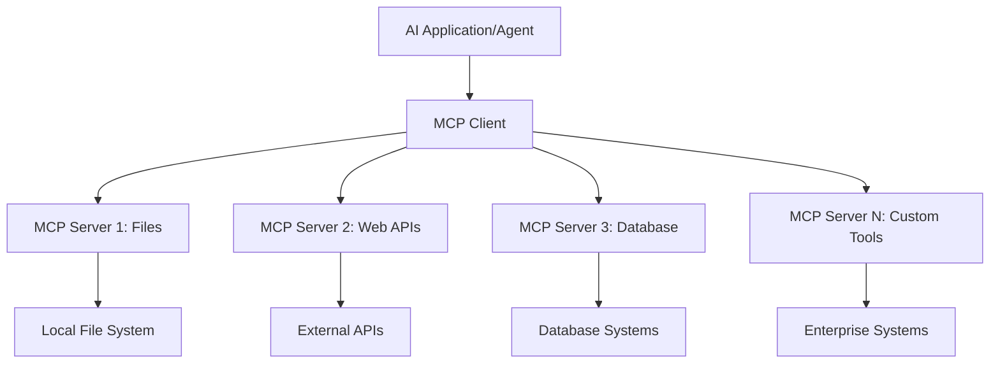
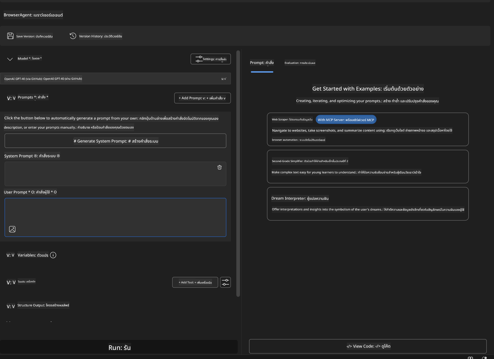
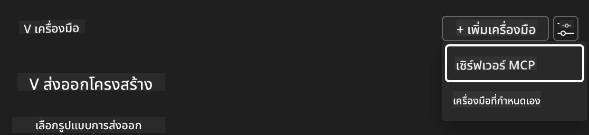
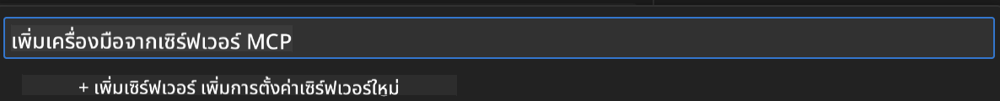
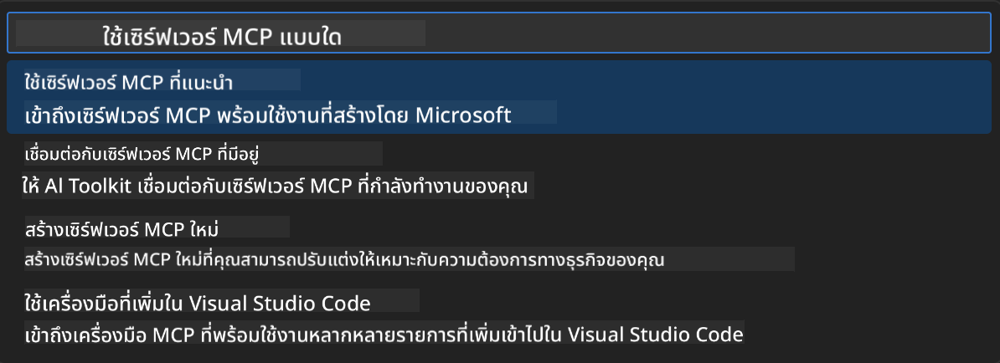
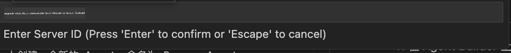
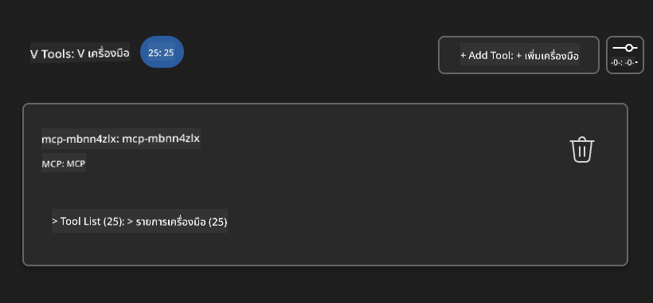
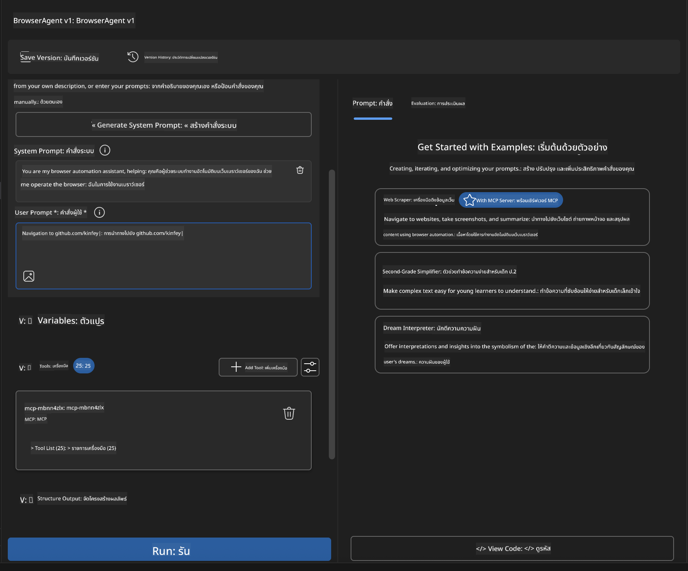
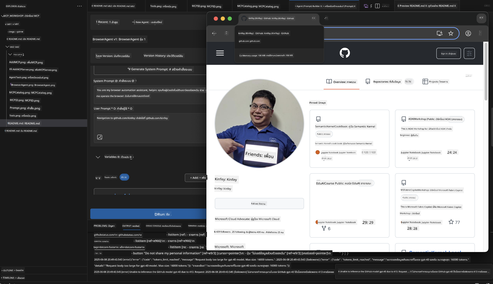
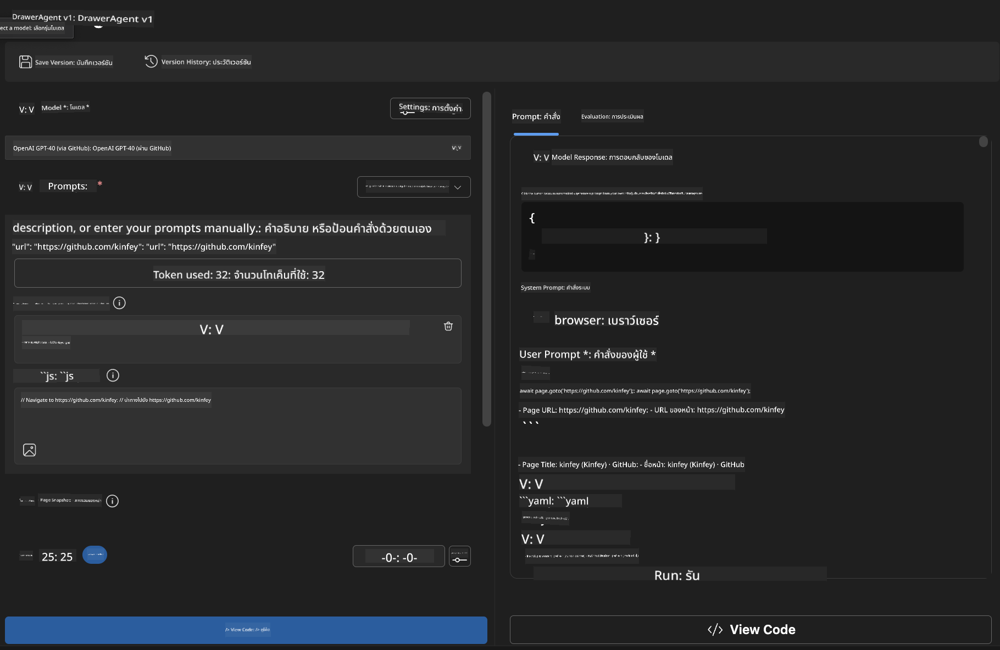

<!--
CO_OP_TRANSLATOR_METADATA:
{
  "original_hash": "a22b7dd11cd7690f99f9195877cafdc3",
  "translation_date": "2025-07-14T07:53:20+00:00",
  "source_file": "10-StreamliningAIWorkflowsBuildingAnMCPServerWithAIToolkit/lab2/README.md",
  "language_code": "th"
}
-->
# 🌐 โมดูล 2: พื้นฐาน MCP กับ AI Toolkit

[]()
[]()
[]()

## 📋 วัตถุประสงค์การเรียนรู้

เมื่อจบโมดูลนี้ คุณจะสามารถ:
- ✅ เข้าใจสถาปัตยกรรมและประโยชน์ของ Model Context Protocol (MCP)
- ✅ สำรวจระบบนิเวศ MCP server ของ Microsoft
- ✅ รวม MCP servers เข้ากับ AI Toolkit Agent Builder
- ✅ สร้างเอเจนต์อัตโนมัติบนเบราว์เซอร์ด้วย Playwright MCP
- ✅ ตั้งค่าและทดสอบเครื่องมือ MCP ภายในเอเจนต์ของคุณ
- ✅ ส่งออกและปรับใช้เอเจนต์ที่ใช้ MCP สำหรับการใช้งานจริง

## 🎯 การต่อยอดจากโมดูล 1

ในโมดูล 1 เราได้เรียนรู้พื้นฐาน AI Toolkit และสร้าง Python Agent ตัวแรกของเราแล้ว ตอนนี้เราจะ **เพิ่มพลัง** ให้เอเจนต์ของคุณด้วยการเชื่อมต่อกับเครื่องมือและบริการภายนอกผ่านโปรโตคอลปฏิวัติวงการอย่าง **Model Context Protocol (MCP)**

คิดว่ามันเหมือนการอัปเกรดจากเครื่องคิดเลขธรรมดาเป็นคอมพิวเตอร์เต็มรูปแบบ — เอเจนต์ AI ของคุณจะสามารถ:
- 🌐 ท่องเว็บและโต้ตอบกับเว็บไซต์
- 📁 เข้าถึงและจัดการไฟล์
- 🔧 รวมเข้ากับระบบองค์กร
- 📊 ประมวลผลข้อมูลเรียลไทม์จาก API

## 🧠 ทำความเข้าใจ Model Context Protocol (MCP)

### 🔍 MCP คืออะไร?

Model Context Protocol (MCP) คือ **"USB-C สำหรับแอปพลิเคชัน AI"** — มาตรฐานเปิดที่ปฏิวัติวงการซึ่งเชื่อมต่อ Large Language Models (LLMs) กับเครื่องมือภายนอก แหล่งข้อมูล และบริการต่างๆ เช่นเดียวกับ USB-C ที่ช่วยลดความยุ่งยากของสายเคเบิลด้วยการใช้พอร์ตเดียว MCP ช่วยลดความซับซ้อนในการรวม AI ด้วยโปรโตคอลมาตรฐานเดียว

### 🎯 ปัญหาที่ MCP แก้ไข

**ก่อน MCP:**
- 🔧 การรวมระบบแบบกำหนดเองสำหรับแต่ละเครื่องมือ
- 🔄 ติดกับผู้ขายด้วยโซลูชันเฉพาะ
- 🔒 ช่องโหว่ด้านความปลอดภัยจากการเชื่อมต่อแบบ ad-hoc
- ⏱️ ใช้เวลาหลายเดือนในการพัฒนาการรวมระบบพื้นฐาน

**กับ MCP:**
- ⚡ การรวมเครื่องมือแบบเสียบแล้วใช้ได้เลย
- 🔄 สถาปัตยกรรมไม่ผูกติดกับผู้ขายรายใดรายหนึ่ง
- 🛡️ มีแนวทางความปลอดภัยในตัว
- 🚀 เพิ่มความสามารถใหม่ได้ภายในไม่กี่นาที

### 🏗️ เจาะลึกสถาปัตยกรรม MCP

MCP ใช้สถาปัตยกรรม **client-server** ที่สร้างระบบนิเวศที่ปลอดภัยและขยายตัวได้:



**🔧 ส่วนประกอบหลัก:**

| ส่วนประกอบ | บทบาท | ตัวอย่าง |
|-----------|------|----------|
| **MCP Hosts** | แอปพลิเคชันที่ใช้บริการ MCP | Claude Desktop, VS Code, AI Toolkit |
| **MCP Clients** | ตัวจัดการโปรโตคอล (1:1 กับเซิร์ฟเวอร์) | ฝังอยู่ในแอปโฮสต์ |
| **MCP Servers** | ให้บริการความสามารถผ่านโปรโตคอลมาตรฐาน | Playwright, Files, Azure, GitHub |
| **Transport Layer** | วิธีการสื่อสาร | stdio, HTTP, WebSockets |

## 🏢 ระบบนิเวศ MCP Server ของ Microsoft

Microsoft เป็นผู้นำระบบนิเวศ MCP ด้วยชุดเซิร์ฟเวอร์ระดับองค์กรที่ครอบคลุมซึ่งตอบโจทย์ความต้องการทางธุรกิจจริง

### 🌟 เซิร์ฟเวอร์ MCP ของ Microsoft ที่โดดเด่น

#### 1. ☁️ Azure MCP Server
**🔗 Repository**: [azure/azure-mcp](https://github.com/azure/azure-mcp)  
**🎯 จุดประสงค์**: การจัดการทรัพยากร Azure แบบครบวงจรพร้อมการผสาน AI

**✨ คุณสมบัติหลัก:**
- การจัดเตรียมโครงสร้างพื้นฐานแบบประกาศ
- การตรวจสอบทรัพยากรแบบเรียลไทม์
- คำแนะนำการปรับค่าใช้จ่ายให้เหมาะสม
- การตรวจสอบความปลอดภัยและการปฏิบัติตามข้อกำหนด

**🚀 กรณีการใช้งาน:**
- Infrastructure-as-Code พร้อมผู้ช่วย AI
- การปรับขนาดทรัพยากรอัตโนมัติ
- การเพิ่มประสิทธิภาพค่าใช้จ่ายบนคลาวด์
- การทำงานอัตโนมัติใน DevOps

#### 2. 📊 Microsoft Dataverse MCP
**📚 เอกสาร**: [Microsoft Dataverse Integration](https://go.microsoft.com/fwlink/?linkid=2320176)  
**🎯 จุดประสงค์**: อินเทอร์เฟซภาษาธรรมชาติสำหรับข้อมูลธุรกิจ

**✨ คุณสมบัติหลัก:**
- การสืบค้นฐานข้อมูลด้วยภาษาธรรมชาติ
- ความเข้าใจบริบททางธุรกิจ
- เทมเพลต prompt ที่ปรับแต่งได้
- การกำกับดูแลข้อมูลองค์กร

**🚀 กรณีการใช้งาน:**
- รายงานข้อมูลเชิงธุรกิจ
- การวิเคราะห์ข้อมูลลูกค้า
- ข้อมูลเชิงลึกของกระบวนการขาย
- การสืบค้นข้อมูลเพื่อปฏิบัติตามข้อกำหนด

#### 3. 🌐 Playwright MCP Server
**🔗 Repository**: [microsoft/playwright-mcp](https://github.com/microsoft/playwright-mcp)  
**🎯 จุดประสงค์**: ความสามารถในการอัตโนมัติบนเบราว์เซอร์และการโต้ตอบเว็บ

**✨ คุณสมบัติหลัก:**
- อัตโนมัติข้ามเบราว์เซอร์ (Chrome, Firefox, Safari)
- การตรวจจับองค์ประกอบอย่างชาญฉลาด
- การจับภาพหน้าจอและสร้าง PDF
- การตรวจสอบทราฟฟิกเครือข่าย

**🚀 กรณีการใช้งาน:**
- เวิร์กโฟลว์การทดสอบอัตโนมัติ
- การดึงข้อมูลเว็บและสกัดข้อมูล
- การตรวจสอบ UI/UX
- การวิเคราะห์การแข่งขันอัตโนมัติ

#### 4. 📁 Files MCP Server
**🔗 Repository**: [microsoft/files-mcp-server](https://github.com/microsoft/files-mcp-server)  
**🎯 จุดประสงค์**: การจัดการระบบไฟล์อย่างชาญฉลาด

**✨ คุณสมบัติหลัก:**
- การจัดการไฟล์แบบประกาศ
- การซิงโครไนซ์เนื้อหา
- การรวมระบบควบคุมเวอร์ชัน
- การสกัดข้อมูลเมตา

**🚀 กรณีการใช้งาน:**
- การจัดการเอกสาร
- การจัดระเบียบที่เก็บโค้ด
- เวิร์กโฟลว์การเผยแพร่เนื้อหา
- การจัดการไฟล์ในสายงานข้อมูล

#### 5. 📝 MarkItDown MCP Server
**🔗 Repository**: [microsoft/markitdown](https://github.com/microsoft/markitdown)  
**🎯 จุดประสงค์**: การประมวลผลและจัดการ Markdown ขั้นสูง

**✨ คุณสมบัติหลัก:**
- การแยกวิเคราะห์ Markdown อย่างละเอียด
- การแปลงรูปแบบ (MD ↔ HTML ↔ PDF)
- การวิเคราะห์โครงสร้างเนื้อหา
- การประมวลผลเทมเพลต

**🚀 กรณีการใช้งาน:**
- เวิร์กโฟลว์เอกสารทางเทคนิค
- ระบบจัดการเนื้อหา
- การสร้างรายงาน
- ระบบฐานความรู้แบบอัตโนมัติ

#### 6. 📈 Clarity MCP Server
**📦 แพ็กเกจ**: [@microsoft/clarity-mcp-server](https://www.npmjs.com/package/@microsoft/clarity-mcp-server)  
**🎯 จุดประสงค์**: การวิเคราะห์เว็บและข้อมูลพฤติกรรมผู้ใช้

**✨ คุณสมบัติหลัก:**
- การวิเคราะห์ข้อมูล heatmap
- การบันทึกเซสชันผู้ใช้
- ตัวชี้วัดประสิทธิภาพ
- การวิเคราะห์ช่องทางแปลง

**🚀 กรณีการใช้งาน:**
- การเพิ่มประสิทธิภาพเว็บไซต์
- การวิจัยประสบการณ์ผู้ใช้
- การวิเคราะห์ A/B testing
- แดชบอร์ดข้อมูลเชิงธุรกิจ

### 🌍 ระบบนิเวศชุมชน

นอกจากเซิร์ฟเวอร์ของ Microsoft แล้ว ระบบนิเวศ MCP ยังรวมถึง:
- **🐙 GitHub MCP**: การจัดการ repository และวิเคราะห์โค้ด
- **🗄️ Database MCPs**: การรวม PostgreSQL, MySQL, MongoDB
- **☁️ Cloud Provider MCPs**: เครื่องมือ AWS, GCP, Digital Ocean
- **📧 Communication MCPs**: การรวม Slack, Teams, Email

## 🛠️ ห้องปฏิบัติการ: สร้างเอเจนต์อัตโนมัติบนเบราว์เซอร์

**🎯 เป้าหมายโครงการ**: สร้างเอเจนต์อัตโนมัติบนเบราว์เซอร์ที่ชาญฉลาดโดยใช้ Playwright MCP server ซึ่งสามารถท่องเว็บ ดึงข้อมูล และทำงานโต้ตอบเว็บที่ซับซ้อนได้

### 🚀 ขั้นตอนที่ 1: ตั้งค่าเอเจนต์พื้นฐาน

#### ขั้นตอนที่ 1: เริ่มต้นเอเจนต์ของคุณ
1. **เปิด AI Toolkit Agent Builder**
2. **สร้างเอเจนต์ใหม่** ด้วยการตั้งค่าดังนี้:
   - **ชื่อ**: `BrowserAgent`
   - **โมเดล**: เลือก GPT-4o



### 🔧 ขั้นตอนที่ 2: กระบวนการรวม MCP

#### ขั้นตอนที่ 3: เพิ่มการรวม MCP Server
1. **ไปที่ส่วนเครื่องมือ** ใน Agent Builder
2. **คลิก "Add Tool"** เพื่อเปิดเมนูการรวมระบบ
3. **เลือก "MCP Server"** จากตัวเลือกที่มี



**🔍 ทำความเข้าใจประเภทเครื่องมือ:**
- **Built-in Tools**: ฟังก์ชัน AI Toolkit ที่ตั้งค่าล่วงหน้า
- **MCP Servers**: การรวมบริการภายนอก
- **Custom APIs**: จุดเชื่อมต่อบริการของคุณเอง
- **Function Calling**: การเรียกใช้ฟังก์ชันของโมเดลโดยตรง

#### ขั้นตอนที่ 4: เลือก MCP Server
1. **เลือกตัวเลือก "MCP Server"** เพื่อดำเนินการต่อ  


2. **เรียกดูแคตตาล็อก MCP** เพื่อสำรวจการรวมระบบที่มี  


### 🎮 ขั้นตอนที่ 3: การตั้งค่า Playwright MCP

#### ขั้นตอนที่ 5: เลือกและตั้งค่า Playwright
1. **คลิก "Use Featured MCP Servers"** เพื่อเข้าถึงเซิร์ฟเวอร์ที่ Microsoft รับรอง
2. **เลือก "Playwright"** จากรายการเด่น
3. **ยอมรับ MCP ID เริ่มต้น** หรือปรับแต่งตามสภาพแวดล้อมของคุณ



#### ขั้นตอนที่ 6: เปิดใช้งานความสามารถของ Playwright
**🔑 ขั้นตอนสำคัญ**: เลือก **ทุก** เมธอดของ Playwright ที่มีเพื่อความสามารถสูงสุด


**🛠️ เครื่องมือ Playwright ที่จำเป็น:**
- **การนำทาง**: `goto`, `goBack`, `goForward`, `reload`
- **การโต้ตอบ**: `click`, `fill`, `press`, `hover`, `drag`
- **การดึงข้อมูล**: `textContent`, `innerHTML`, `getAttribute`
- **การตรวจสอบ**: `isVisible`, `isEnabled`, `waitForSelector`
- **การจับภาพ**: `screenshot`, `pdf`, `video`
- **เครือข่าย**: `setExtraHTTPHeaders`, `route`, `waitForResponse`

#### ขั้นตอนที่ 7: ตรวจสอบความสำเร็จของการรวมระบบ
**✅ สัญญาณความสำเร็จ:**
- เครื่องมือทั้งหมดแสดงในอินเทอร์เฟซ Agent Builder
- ไม่มีข้อความแสดงข้อผิดพลาดในแผงรวมระบบ
- สถานะเซิร์ฟเวอร์ Playwright แสดงว่า "Connected"



**🔧 การแก้ไขปัญหาที่พบบ่อย:**
- **เชื่อมต่อไม่สำเร็จ**: ตรวจสอบการเชื่อมต่ออินเทอร์เน็ตและการตั้งค่าไฟร์วอลล์
- **เครื่องมือหายไป**: ตรวจสอบให้แน่ใจว่าเลือกความสามารถทั้งหมดในขั้นตอนตั้งค่า
- **ข้อผิดพลาดสิทธิ์**: ตรวจสอบว่า VS Code มีสิทธิ์ระบบที่จำเป็น

### 🎯 ขั้นตอนที่ 4: การออกแบบ Prompt ขั้นสูง

#### ขั้นตอนที่ 8: ออกแบบ System Prompts อัจฉริยะ
สร้าง prompt ที่ซับซ้อนซึ่งใช้ประโยชน์จากความสามารถเต็มรูปแบบของ Playwright:

```markdown
# Web Automation Expert System Prompt

## Core Identity
You are an advanced web automation specialist with deep expertise in browser automation, web scraping, and user experience analysis. You have access to Playwright tools for comprehensive browser control.

## Capabilities & Approach
### Navigation Strategy
- Always start with screenshots to understand page layout
- Use semantic selectors (text content, labels) when possible
- Implement wait strategies for dynamic content
- Handle single-page applications (SPAs) effectively

### Error Handling
- Retry failed operations with exponential backoff
- Provide clear error descriptions and solutions
- Suggest alternative approaches when primary methods fail
- Always capture diagnostic screenshots on errors

### Data Extraction
- Extract structured data in JSON format when possible
- Provide confidence scores for extracted information
- Validate data completeness and accuracy
- Handle pagination and infinite scroll scenarios

### Reporting
- Include step-by-step execution logs
- Provide before/after screenshots for verification
- Suggest optimizations and alternative approaches
- Document any limitations or edge cases encountered

## Ethical Guidelines
- Respect robots.txt and rate limiting
- Avoid overloading target servers
- Only extract publicly available information
- Follow website terms of service
```

#### ขั้นตอนที่ 9: สร้าง User Prompts แบบไดนามิก
ออกแบบ prompt ที่แสดงความสามารถต่างๆ:

**🌐 ตัวอย่างการวิเคราะห์เว็บ:**
```markdown
Navigate to github.com/kinfey and provide a comprehensive analysis including:
1. Repository structure and organization
2. Recent activity and contribution patterns  
3. Documentation quality assessment
4. Technology stack identification
5. Community engagement metrics
6. Notable projects and their purposes

Include screenshots at key steps and provide actionable insights.
```



### 🚀 ขั้นตอนที่ 5: การรันและทดสอบ

#### ขั้นตอนที่ 10: รันอัตโนมัติครั้งแรกของคุณ
1. **คลิก "Run"** เพื่อเริ่มลำดับการทำงานอัตโนมัติ
2. **ติดตามการทำงานแบบเรียลไทม์**:
   - เบราว์เซอร์ Chrome เปิดขึ้นโดยอัตโนมัติ
   - เอเจนต์นำทางไปยังเว็บไซต์เป้าหมาย
   - ถ่ายภาพหน้าจอในแต่ละขั้นตอนสำคัญ
   - ผลการวิเคราะห์แสดงแบบสตรีมเรียลไทม์



#### ขั้นตอนที่ 11: วิเคราะห์ผลลัพธ์และข้อมูลเชิงลึก
ตรวจสอบการวิเคราะห์อย่างละเอียดในอินเทอร์เฟซ Agent Builder:



### 🌟 ขั้นตอนที่ 6: ความสามารถขั้นสูงและการปรับใช้

#### ขั้นตอนที่ 12: ส่งออกและปรับใช้ในสภาพแวดล้อมจริง
Agent Builder รองรับตัวเลือกการปรับใช้หลายแบบ:


## 🎓 สรุปโมดูล 2 & ขั้นตอนถัดไป

### 🏆 ความสำเร็จที่ได้รับ: เชี่ยวชาญการรวม MCP

**✅ ทักษะที่ได้:**
- [ ] เข้าใจสถาปัตยกรรมและประโยชน์ของ MCP
- [ ] สำรวจระบบนิเวศ MCP server ของ Microsoft
- [ ] รวม Playwright MCP กับ AI Toolkit
- [ ] สร้างเอเจนต์อัตโนมัติบนเบราว์เซอร์ขั้นสูง
- [ ] ออกแบบ prompt ขั้นสูงสำหรับการอัตโนมัติบนเว็บ

### 📚 แหล่งข้อมูลเพิ่มเติม

- **🔗 ข้อกำหนด MCP**: [เอกสารโปรโตคอลอย่างเป็นทางการ](https://modelcontextprotocol.io/)
- **🛠️ Playwright API**: [เอกสารเมธอดครบถ้วน](https://playwright.dev/docs/api/class-playwright)
- **🏢 เซิร์ฟเวอร์ MCP ของ Microsoft**: [คู่มือการรวมระบบองค์กร](https://github.com/microsoft/mcp-servers)
- **🌍 ตัวอย่างจากชุมชน**: [แกลเลอรี MCP Server](https://github.com/modelcontextprotocol/servers)

**🎉 ยินดีด้วย!** คุณได้เรียนรู้การรวม MCP อย่างเชี่ยวชาญและพร้อมสร้างเอเจนต์ AI สำหรับใช้งานจริงที่มีความสามารถเชื่อมต่อเครื่องมือภายนอกแล้ว!

### 🔜 ไปยังโมดูลถัดไป

พร้อมย
- สร้าง Weather MCP Server ตั้งแต่เริ่มต้น

**ข้อจำกัดความรับผิดชอบ**:  
เอกสารนี้ได้รับการแปลโดยใช้บริการแปลภาษาอัตโนมัติ [Co-op Translator](https://github.com/Azure/co-op-translator) แม้เราจะพยายามให้ความถูกต้องสูงสุด แต่โปรดทราบว่าการแปลอัตโนมัติอาจมีข้อผิดพลาดหรือความไม่ถูกต้อง เอกสารต้นฉบับในภาษาต้นทางถือเป็นแหล่งข้อมูลที่เชื่อถือได้ สำหรับข้อมูลที่สำคัญ ขอแนะนำให้ใช้บริการแปลโดยผู้เชี่ยวชาญมนุษย์ เราไม่รับผิดชอบต่อความเข้าใจผิดหรือการตีความผิดใด ๆ ที่เกิดจากการใช้การแปลนี้