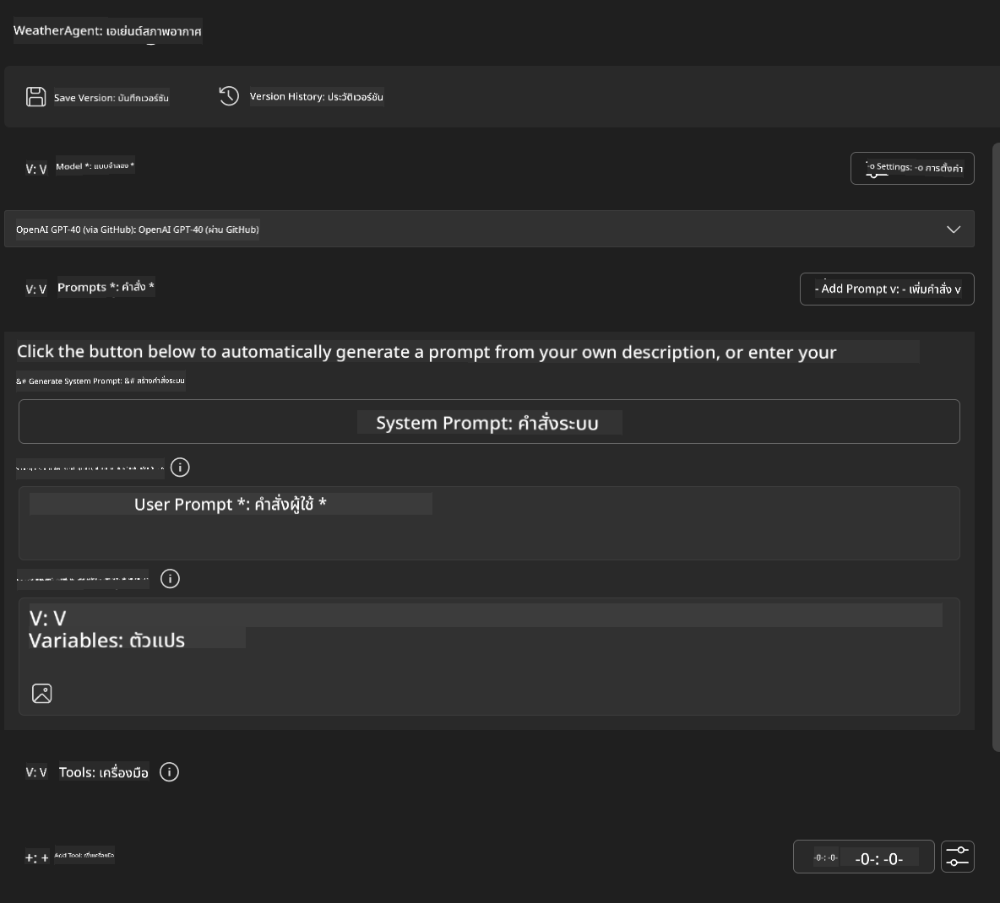
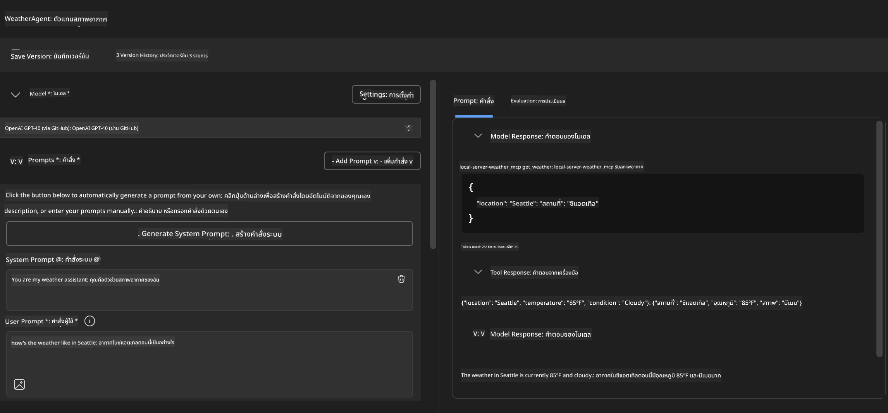
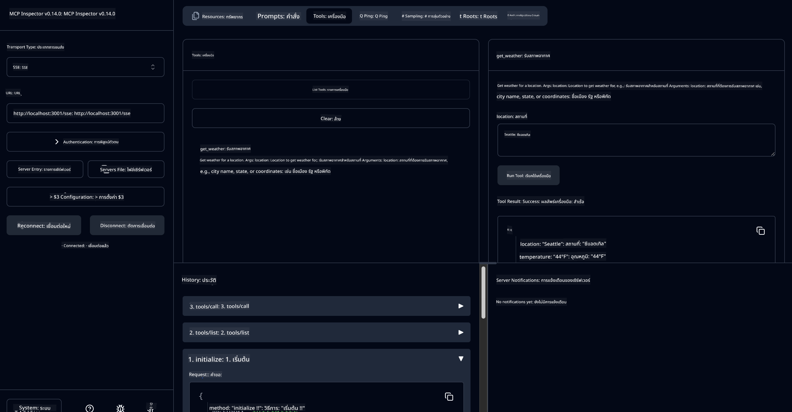

<!--
CO_OP_TRANSLATOR_METADATA:
{
  "original_hash": "dd8da3f75addcef453fe11f02a270217",
  "translation_date": "2025-07-14T08:14:14+00:00",
  "source_file": "10-StreamliningAIWorkflowsBuildingAnMCPServerWithAIToolkit/lab3/README.md",
  "language_code": "th"
}
-->
# 🔧 Module 3: การพัฒนา MCP ขั้นสูงด้วย AI Toolkit


## 🎯 วัตถุประสงค์การเรียนรู้

เมื่อจบแลปนี้ คุณจะสามารถ:

- ✅ สร้างเซิร์ฟเวอร์ MCP แบบกำหนดเองโดยใช้ AI Toolkit
- ✅ ตั้งค่าและใช้งาน MCP Python SDK เวอร์ชันล่าสุด (v1.9.3)
- ✅ ติดตั้งและใช้งาน MCP Inspector สำหรับการดีบัก
- ✅ ดีบักเซิร์ฟเวอร์ MCP ทั้งในสภาพแวดล้อม Agent Builder และ Inspector
- ✅ เข้าใจกระบวนการพัฒนาเซิร์ฟเวอร์ MCP ขั้นสูง

## 📋 ข้อกำหนดเบื้องต้น

- ผ่านแลป 2 (MCP Fundamentals) มาแล้ว
- ติดตั้ง VS Code พร้อมส่วนขยาย AI Toolkit
- สภาพแวดล้อม Python 3.10 ขึ้นไป
- ติดตั้ง Node.js และ npm สำหรับการตั้งค่า Inspector

## 🏗️ สิ่งที่คุณจะสร้าง

ในแลปนี้ คุณจะสร้าง **Weather MCP Server** ที่แสดงให้เห็นถึง:
- การสร้างเซิร์ฟเวอร์ MCP แบบกำหนดเอง
- การผสานรวมกับ AI Toolkit Agent Builder
- กระบวนการดีบักแบบมืออาชีพ
- รูปแบบการใช้งาน MCP SDK สมัยใหม่

---

## 🔧 ภาพรวมส่วนประกอบหลัก

### 🐍 MCP Python SDK
Model Context Protocol Python SDK เป็นพื้นฐานสำหรับการสร้างเซิร์ฟเวอร์ MCP แบบกำหนดเอง คุณจะใช้เวอร์ชัน 1.9.3 ที่มีฟีเจอร์ดีบักที่พัฒนาขึ้น

### 🔍 MCP Inspector
เครื่องมือดีบักที่ทรงพลังซึ่งมีฟีเจอร์:
- การตรวจสอบเซิร์ฟเวอร์แบบเรียลไทม์
- การแสดงผลการทำงานของเครื่องมือ
- การตรวจสอบคำขอและการตอบกลับเครือข่าย
- สภาพแวดล้อมทดสอบแบบโต้ตอบ

---

## 📖 การดำเนินการทีละขั้นตอน

### ขั้นตอนที่ 1: สร้าง WeatherAgent ใน Agent Builder

1. **เปิด Agent Builder** ใน VS Code ผ่านส่วนขยาย AI Toolkit
2. **สร้างเอเจนต์ใหม่** โดยตั้งค่าดังนี้:
   - ชื่อเอเจนต์: `WeatherAgent`



### ขั้นตอนที่ 2: เริ่มต้นโปรเจกต์ MCP Server

1. **ไปที่ Tools** → **Add Tool** ใน Agent Builder
2. **เลือก "MCP Server"** จากตัวเลือกที่มี
3. **เลือก "Create A new MCP Server"**
4. **เลือกเทมเพลต `python-weather`**
5. **ตั้งชื่อเซิร์ฟเวอร์:** `weather_mcp`


### ขั้นตอนที่ 3: เปิดและตรวจสอบโปรเจกต์

1. **เปิดโปรเจกต์ที่สร้างขึ้น** ใน VS Code
2. **ตรวจสอบโครงสร้างโปรเจกต์:**
   ```
   weather_mcp/
   ├── src/
   │   ├── __init__.py
   │   └── server.py
   ├── inspector/
   │   ├── package.json
   │   └── package-lock.json
   ├── .vscode/
   │   ├── launch.json
   │   └── tasks.json
   ├── pyproject.toml
   └── README.md
   ```

### ขั้นตอนที่ 4: อัปเกรดเป็น MCP SDK เวอร์ชันล่าสุด

> **🔍 ทำไมต้องอัปเกรด?** เราต้องการใช้ MCP SDK เวอร์ชันล่าสุด (v1.9.3) และบริการ Inspector (0.14.0) เพื่อฟีเจอร์ที่ดีกว่าและความสามารถในการดีบักที่เพิ่มขึ้น

#### 4a. อัปเดต dependencies ของ Python

**แก้ไข `pyproject.toml`:** อัปเดตที่ [./code/weather_mcp/pyproject.toml](../../../../10-StreamliningAIWorkflowsBuildingAnMCPServerWithAIToolkit/lab3/code/weather_mcp/pyproject.toml)

#### 4b. อัปเดตการตั้งค่า Inspector

**แก้ไข `inspector/package.json`:** อัปเดตที่ [./code/weather_mcp/inspector/package.json](../../../../10-StreamliningAIWorkflowsBuildingAnMCPServerWithAIToolkit/lab3/code/weather_mcp/inspector/package.json)

#### 4c. อัปเดต dependencies ของ Inspector

**แก้ไข `inspector/package-lock.json`:** อัปเดตที่ [./code/weather_mcp/inspector/package-lock.json](../../../../10-StreamliningAIWorkflowsBuildingAnMCPServerWithAIToolkit/lab3/code/weather_mcp/inspector/package-lock.json)

> **📝 หมายเหตุ:** ไฟล์นี้มีการกำหนด dependencies อย่างละเอียด ด้านล่างเป็นโครงสร้างสำคัญ — เนื้อหาเต็มช่วยให้การแก้ไข dependencies ถูกต้อง

> **⚡ ไฟล์ package-lock เต็ม:** ไฟล์ package-lock.json ฉบับเต็มมีประมาณ 3000 บรรทัดของการกำหนด dependencies ด้านบนแสดงโครงสร้างหลัก — ใช้ไฟล์ที่ให้มาเพื่อการแก้ไข dependencies อย่างครบถ้วน

### ขั้นตอนที่ 5: ตั้งค่าการดีบักใน VS Code

*หมายเหตุ: กรุณาคัดลอกไฟล์ในเส้นทางที่ระบุเพื่อแทนที่ไฟล์ในเครื่อง*

#### 5a. อัปเดตการตั้งค่า Launch

**แก้ไข `.vscode/launch.json`:**

```json
{
  "version": "0.2.0",
  "configurations": [
    {
      "name": "Attach to Local MCP",
      "type": "debugpy",
      "request": "attach",
      "connect": {
        "host": "localhost",
        "port": 5678
      },
      "presentation": {
        "hidden": true
      },
      "internalConsoleOptions": "neverOpen",
      "postDebugTask": "Terminate All Tasks"
    },
    {
      "name": "Launch Inspector (Edge)",
      "type": "msedge",
      "request": "launch",
      "url": "http://localhost:6274?timeout=60000&serverUrl=http://localhost:3001/sse#tools",
      "cascadeTerminateToConfigurations": [
        "Attach to Local MCP"
      ],
      "presentation": {
        "hidden": true
      },
      "internalConsoleOptions": "neverOpen"
    },
    {
      "name": "Launch Inspector (Chrome)",
      "type": "chrome",
      "request": "launch",
      "url": "http://localhost:6274?timeout=60000&serverUrl=http://localhost:3001/sse#tools",
      "cascadeTerminateToConfigurations": [
        "Attach to Local MCP"
      ],
      "presentation": {
        "hidden": true
      },
      "internalConsoleOptions": "neverOpen"
    }
  ],
  "compounds": [
    {
      "name": "Debug in Agent Builder",
      "configurations": [
        "Attach to Local MCP"
      ],
      "preLaunchTask": "Open Agent Builder",
    },
    {
      "name": "Debug in Inspector (Edge)",
      "configurations": [
        "Launch Inspector (Edge)",
        "Attach to Local MCP"
      ],
      "preLaunchTask": "Start MCP Inspector",
      "stopAll": true
    },
    {
      "name": "Debug in Inspector (Chrome)",
      "configurations": [
        "Launch Inspector (Chrome)",
        "Attach to Local MCP"
      ],
      "preLaunchTask": "Start MCP Inspector",
      "stopAll": true
    }
  ]
}
```

**แก้ไข `.vscode/tasks.json`:**

```
{
  "version": "2.0.0",
  "tasks": [
    {
      "label": "Start MCP Server",
      "type": "shell",
      "command": "python -m debugpy --listen 127.0.0.1:5678 src/__init__.py sse",
      "isBackground": true,
      "options": {
        "cwd": "${workspaceFolder}",
        "env": {
          "PORT": "3001"
        }
      },
      "problemMatcher": {
        "pattern": [
          {
            "regexp": "^.*$",
            "file": 0,
            "location": 1,
            "message": 2
          }
        ],
        "background": {
          "activeOnStart": true,
          "beginsPattern": ".*",
          "endsPattern": "Application startup complete|running"
        }
      }
    },
    {
      "label": "Start MCP Inspector",
      "type": "shell",
      "command": "npm run dev:inspector",
      "isBackground": true,
      "options": {
        "cwd": "${workspaceFolder}/inspector",
        "env": {
          "CLIENT_PORT": "6274",
          "SERVER_PORT": "6277",
        }
      },
      "problemMatcher": {
        "pattern": [
          {
            "regexp": "^.*$",
            "file": 0,
            "location": 1,
            "message": 2
          }
        ],
        "background": {
          "activeOnStart": true,
          "beginsPattern": "Starting MCP inspector",
          "endsPattern": "Proxy server listening on port"
        }
      },
      "dependsOn": [
        "Start MCP Server"
      ]
    },
    {
      "label": "Open Agent Builder",
      "type": "shell",
      "command": "echo ${input:openAgentBuilder}",
      "presentation": {
        "reveal": "never"
      },
      "dependsOn": [
        "Start MCP Server"
      ],
    },
    {
      "label": "Terminate All Tasks",
      "command": "echo ${input:terminate}",
      "type": "shell",
      "problemMatcher": []
    }
  ],
  "inputs": [
    {
      "id": "openAgentBuilder",
      "type": "command",
      "command": "ai-mlstudio.agentBuilder",
      "args": {
        "initialMCPs": [ "local-server-weather_mcp" ],
        "triggeredFrom": "vsc-tasks"
      }
    },
    {
      "id": "terminate",
      "type": "command",
      "command": "workbench.action.tasks.terminate",
      "args": "terminateAll"
    }
  ]
}
```

---

## 🚀 การรันและทดสอบ MCP Server ของคุณ

### ขั้นตอนที่ 6: ติดตั้ง dependencies

หลังจากเปลี่ยนแปลงการตั้งค่าแล้ว ให้รันคำสั่งต่อไปนี้:

**ติดตั้ง dependencies ของ Python:**
```bash
uv sync
```

**ติดตั้ง dependencies ของ Inspector:**
```bash
cd inspector
npm install
```

### ขั้นตอนที่ 7: ดีบักด้วย Agent Builder

1. **กด F5** หรือใช้การตั้งค่า **"Debug in Agent Builder"**
2. **เลือกการตั้งค่ารวม (compound configuration)** จากแผงดีบัก
3. **รอให้เซิร์ฟเวอร์เริ่มทำงาน** และ Agent Builder เปิดขึ้น
4. **ทดสอบเซิร์ฟเวอร์ weather MCP** ด้วยคำถามภาษาธรรมชาติ

ป้อนคำสั่งเช่นนี้

SYSTEM_PROMPT

```
You are my weather assistant
```

USER_PROMPT

```
How's the weather like in Seattle
```



### ขั้นตอนที่ 8: ดีบักด้วย MCP Inspector

1. **ใช้การตั้งค่า "Debug in Inspector"** (Edge หรือ Chrome)
2. **เปิดอินเทอร์เฟซ Inspector** ที่ `http://localhost:6274`
3. **สำรวจสภาพแวดล้อมทดสอบแบบโต้ตอบ:**
   - ดูเครื่องมือที่มีให้ใช้งาน
   - ทดสอบการทำงานของเครื่องมือ
   - ตรวจสอบคำขอเครือข่าย
   - ดีบักการตอบกลับของเซิร์ฟเวอร์



---

## 🎯 ผลลัพธ์การเรียนรู้หลัก

เมื่อทำแลปนี้เสร็จสิ้น คุณได้:

- [x] **สร้างเซิร์ฟเวอร์ MCP แบบกำหนดเอง** โดยใช้เทมเพลต AI Toolkit
- [x] **อัปเกรดเป็น MCP SDK เวอร์ชันล่าสุด** (v1.9.3) เพื่อฟีเจอร์ที่ดีกว่า
- [x] **ตั้งค่ากระบวนการดีบักแบบมืออาชีพ** สำหรับทั้ง Agent Builder และ Inspector
- [x] **ติดตั้ง MCP Inspector** สำหรับการทดสอบเซิร์ฟเวอร์แบบโต้ตอบ
- [x] **ชำนาญการตั้งค่าการดีบักใน VS Code** สำหรับการพัฒนา MCP

## 🔧 ฟีเจอร์ขั้นสูงที่ได้สำรวจ

| ฟีเจอร์ | คำอธิบาย | กรณีใช้งาน |
|---------|-------------|----------|
| **MCP Python SDK v1.9.3** | การใช้งานโปรโตคอลเวอร์ชันล่าสุด | การพัฒนาเซิร์ฟเวอร์สมัยใหม่ |
| **MCP Inspector 0.14.0** | เครื่องมือดีบักแบบโต้ตอบ | การทดสอบเซิร์ฟเวอร์แบบเรียลไทม์ |
| **VS Code Debugging** | สภาพแวดล้อมพัฒนาแบบบูรณาการ | กระบวนการดีบักแบบมืออาชีพ |
| **Agent Builder Integration** | การเชื่อมต่อกับ AI Toolkit โดยตรง | การทดสอบเอเจนต์แบบครบวงจร |

## 📚 แหล่งข้อมูลเพิ่มเติม

- [MCP Python SDK Documentation](https://modelcontextprotocol.io/docs/sdk/python)
- [AI Toolkit Extension Guide](https://code.visualstudio.com/docs/ai/ai-toolkit)
- [VS Code Debugging Documentation](https://code.visualstudio.com/docs/editor/debugging)
- [Model Context Protocol Specification](https://modelcontextprotocol.io/docs/concepts/architecture)

---

**🎉 ยินดีด้วย!** คุณได้ทำแลป 3 เสร็จสมบูรณ์และพร้อมที่จะสร้าง ดีบัก และปรับใช้เซิร์ฟเวอร์ MCP แบบกำหนดเองด้วยกระบวนการพัฒนามืออาชีพ

### 🔜 ไปยังโมดูลถัดไป

พร้อมที่จะนำทักษะ MCP ไปใช้ในกระบวนการพัฒนาจริงหรือยัง? ไปต่อที่ **[Module 4: Practical MCP Development - Custom GitHub Clone Server](../lab4/README.md)** ที่คุณจะได้:
- สร้างเซิร์ฟเวอร์ MCP ที่พร้อมใช้งานจริงสำหรับการจัดการรีโพซิทอรี GitHub อัตโนมัติ
- พัฒนาฟังก์ชันการโคลนรีโพซิทอรี GitHub ผ่าน MCP
- ผสานรวมเซิร์ฟเวอร์ MCP แบบกำหนดเองกับ VS Code และ GitHub Copilot Agent Mode
- ทดสอบและปรับใช้เซิร์ฟเวอร์ MCP แบบกำหนดเองในสภาพแวดล้อมจริง
- เรียนรู้การทำงานอัตโนมัติในกระบวนการพัฒนาสำหรับนักพัฒนา

**ข้อจำกัดความรับผิดชอบ**:  
เอกสารนี้ได้รับการแปลโดยใช้บริการแปลภาษาอัตโนมัติ [Co-op Translator](https://github.com/Azure/co-op-translator) แม้เราจะพยายามให้ความถูกต้องสูงสุด แต่โปรดทราบว่าการแปลอัตโนมัติอาจมีข้อผิดพลาดหรือความไม่ถูกต้อง เอกสารต้นฉบับในภาษาต้นทางถือเป็นแหล่งข้อมูลที่เชื่อถือได้ สำหรับข้อมูลที่สำคัญ ขอแนะนำให้ใช้บริการแปลโดยผู้เชี่ยวชาญมนุษย์ เราไม่รับผิดชอบต่อความเข้าใจผิดหรือการตีความผิดใด ๆ ที่เกิดจากการใช้การแปลนี้