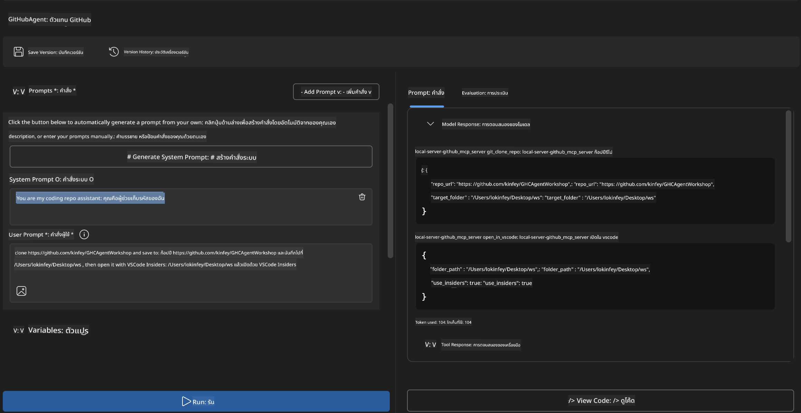
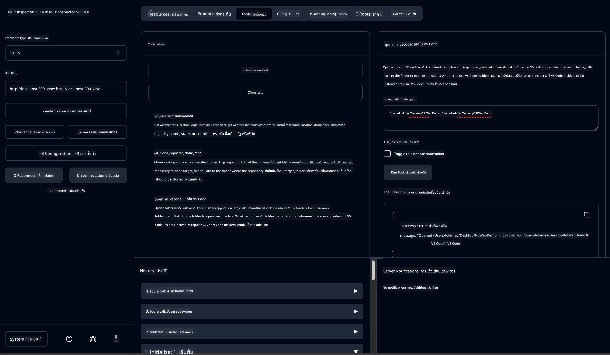

<!--
CO_OP_TRANSLATOR_METADATA:
{
  "original_hash": "f83bc722dc758efffd68667d6a1db470",
  "translation_date": "2025-07-14T08:42:36+00:00",
  "source_file": "10-StreamliningAIWorkflowsBuildingAnMCPServerWithAIToolkit/lab4/README.md",
  "language_code": "th"
}
-->
# 🐙 โมดูล 4: การพัฒนา MCP เชิงปฏิบัติ - เซิร์ฟเวอร์โคลน GitHub แบบกำหนดเอง


> **⚡ เริ่มต้นอย่างรวดเร็ว:** สร้างเซิร์ฟเวอร์ MCP ที่พร้อมใช้งานจริงสำหรับการโคลนรีโพส GitHub และการเชื่อมต่อกับ VS Code ในเวลาเพียง 30 นาที!

## 🎯 วัตถุประสงค์การเรียนรู้

เมื่อจบแลปนี้ คุณจะสามารถ:

- ✅ สร้างเซิร์ฟเวอร์ MCP แบบกำหนดเองสำหรับเวิร์กโฟลว์การพัฒนาจริง
- ✅ นำฟังก์ชันการโคลนรีโพส GitHub ผ่าน MCP มาใช้งาน
- ✅ เชื่อมต่อเซิร์ฟเวอร์ MCP แบบกำหนดเองกับ VS Code และ Agent Builder
- ✅ ใช้โหมด GitHub Copilot Agent ร่วมกับเครื่องมือ MCP แบบกำหนดเอง
- ✅ ทดสอบและปรับใช้เซิร์ฟเวอร์ MCP แบบกำหนดเองในสภาพแวดล้อมการผลิต

## 📋 ข้อกำหนดเบื้องต้น

- ผ่านแลป 1-3 แล้ว (พื้นฐาน MCP และการพัฒนาขั้นสูง)
- สมัครสมาชิก GitHub Copilot ([สมัครฟรีได้ที่นี่](https://github.com/github-copilot/signup))
- ติดตั้ง VS Code พร้อมส่วนขยาย AI Toolkit และ GitHub Copilot
- ติดตั้งและตั้งค่า Git CLI เรียบร้อยแล้ว

## 🏗️ ภาพรวมโครงการ

### **ความท้าทายในการพัฒนาจริง**
ในฐานะนักพัฒนา เรามักใช้ GitHub เพื่อโคลนรีโพสและเปิดใน VS Code หรือ VS Code Insiders กระบวนการนี้ทำด้วยตนเองโดย:
1. เปิดเทอร์มินัล/คอมมานด์พรอมต์
2. ไปยังไดเรกทอรีที่ต้องการ
3. รันคำสั่ง `git clone`
4. เปิด VS Code ในไดเรกทอรีที่โคลนมา

**โซลูชัน MCP ของเราจะรวมขั้นตอนเหล่านี้เป็นคำสั่งอัจฉริยะคำเดียว!**

### **สิ่งที่คุณจะสร้าง**
เซิร์ฟเวอร์ **GitHub Clone MCP** (`git_mcp_server`) ที่มีฟีเจอร์ดังนี้:

| ฟีเจอร์ | คำอธิบาย | ประโยชน์ |
|---------|-------------|---------|
| 🔄 **โคลนรีโพสอย่างชาญฉลาด** | โคลนรีโพส GitHub พร้อมตรวจสอบความถูกต้อง | ตรวจจับข้อผิดพลาดอัตโนมัติ |
| 📁 **จัดการไดเรกทอรีอย่างชาญฉลาด** | ตรวจสอบและสร้างไดเรกทอรีอย่างปลอดภัย | ป้องกันการเขียนทับข้อมูล |
| 🚀 **เชื่อมต่อ VS Code ข้ามแพลตฟอร์ม** | เปิดโปรเจกต์ใน VS Code/Insiders ได้ทันที | เวิร์กโฟลว์ลื่นไหลไม่มีสะดุด |
| 🛡️ **จัดการข้อผิดพลาดอย่างมั่นคง** | รับมือกับปัญหาเครือข่าย, สิทธิ์ และเส้นทางไฟล์ | พร้อมใช้งานในสภาพแวดล้อมจริง |

---

## 📖 การดำเนินการทีละขั้นตอน

### ขั้นตอนที่ 1: สร้าง GitHub Agent ใน Agent Builder

1. **เปิด Agent Builder** ผ่านส่วนขยาย AI Toolkit
2. **สร้างเอเจนต์ใหม่** โดยตั้งค่าดังนี้:
   ```
   Agent Name: GitHubAgent
   ```

3. **เริ่มต้นเซิร์ฟเวอร์ MCP แบบกำหนดเอง:**
   - ไปที่ **Tools** → **Add Tool** → **MCP Server**
   - เลือก **"Create A new MCP Server"**
   - เลือก **เทมเพลต Python** เพื่อความยืดหยุ่นสูงสุด
   - **ชื่อเซิร์ฟเวอร์:** `git_mcp_server`

### ขั้นตอนที่ 2: ตั้งค่า GitHub Copilot Agent Mode

1. **เปิด GitHub Copilot** ใน VS Code (กด Ctrl/Cmd + Shift + P → พิมพ์ "GitHub Copilot: Open")
2. **เลือก Agent Model** ในอินเทอร์เฟซ Copilot
3. **เลือกโมเดล Claude 3.7** เพื่อเพิ่มความสามารถในการวิเคราะห์
4. **เปิดใช้งานการเชื่อมต่อ MCP** เพื่อเข้าถึงเครื่องมือ

> **💡 เคล็ดลับ:** Claude 3.7 มีความเข้าใจเวิร์กโฟลว์การพัฒนาและรูปแบบการจัดการข้อผิดพลาดได้ดียิ่งขึ้น

### ขั้นตอนที่ 3: พัฒนาฟังก์ชันหลักของ MCP Server

**ใช้พรอมต์รายละเอียดนี้ร่วมกับ GitHub Copilot Agent Mode:**

```
Create two MCP tools with the following comprehensive requirements:

🔧 TOOL A: clone_repository
Requirements:
- Clone any GitHub repository to a specified local folder
- Return the absolute path of the successfully cloned project
- Implement comprehensive validation:
  ✓ Check if target directory already exists (return error if exists)
  ✓ Validate GitHub URL format (https://github.com/user/repo)
  ✓ Verify git command availability (prompt installation if missing)
  ✓ Handle network connectivity issues
  ✓ Provide clear error messages for all failure scenarios

🚀 TOOL B: open_in_vscode
Requirements:
- Open specified folder in VS Code or VS Code Insiders
- Cross-platform compatibility (Windows/Linux/macOS)
- Use direct application launch (not terminal commands)
- Auto-detect available VS Code installations
- Handle cases where VS Code is not installed
- Provide user-friendly error messages

Additional Requirements:
- Follow MCP 1.9.3 best practices
- Include proper type hints and documentation
- Implement logging for debugging purposes
- Add input validation for all parameters
- Include comprehensive error handling
```

### ขั้นตอนที่ 4: ทดสอบเซิร์ฟเวอร์ MCP ของคุณ

#### 4a. ทดสอบใน Agent Builder

1. **เปิดการตั้งค่าดีบัก** สำหรับ Agent Builder
2. **ตั้งค่าเอเจนต์ของคุณด้วยพรอมต์ระบบนี้:**

```
SYSTEM_PROMPT:
You are my intelligent coding repository assistant. You help developers efficiently clone GitHub repositories and set up their development environment. Always provide clear feedback about operations and handle errors gracefully.
```

3. **ทดสอบด้วยสถานการณ์ผู้ใช้จริง:**

```
USER_PROMPT EXAMPLES:

Scenario : Basic Clone and Open
"Clone {Your GitHub Repo link such as https://github.com/kinfey/GHCAgentWorkshop
 } and save to {The global path you specify}, then open it with VS Code Insiders"
```



**ผลลัพธ์ที่คาดหวัง:**
- ✅ โคลนสำเร็จพร้อมยืนยันเส้นทาง
- ✅ เปิด VS Code อัตโนมัติ
- ✅ แสดงข้อความข้อผิดพลาดชัดเจนในกรณีผิดพลาด
- ✅ จัดการกรณีขอบเขตได้อย่างเหมาะสม

#### 4b. ทดสอบใน MCP Inspector



---

**🎉 ยินดีด้วย!** คุณได้สร้างเซิร์ฟเวอร์ MCP ที่ใช้งานได้จริงและพร้อมสำหรับการผลิต ซึ่งช่วยแก้ปัญหาเวิร์กโฟลว์การพัฒนาจริง เซิร์ฟเวอร์โคลน GitHub แบบกำหนดเองของคุณแสดงให้เห็นถึงพลังของ MCP ในการทำงานอัตโนมัติและเพิ่มประสิทธิภาพการทำงานของนักพัฒนา

### 🏆 ความสำเร็จที่ได้รับ:
- ✅ **MCP Developer** - สร้างเซิร์ฟเวอร์ MCP แบบกำหนดเอง
- ✅ **Workflow Automator** - ปรับปรุงกระบวนการพัฒนาให้รวดเร็วขึ้น  
- ✅ **Integration Expert** - เชื่อมต่อเครื่องมือพัฒนาหลายตัวเข้าด้วยกัน
- ✅ **Production Ready** - สร้างโซลูชันที่พร้อมใช้งานจริง

---

## 🎓 การจบเวิร์กช็อป: การเดินทางของคุณกับ Model Context Protocol

**เรียน ผู้เข้าร่วมเวิร์กช็อป,**

ขอแสดงความยินดีที่คุณผ่านโมดูลทั้งสี่ของเวิร์กช็อป Model Context Protocol มาได้อย่างครบถ้วน! คุณได้ก้าวไกลตั้งแต่การเข้าใจพื้นฐาน AI Toolkit จนถึงการสร้างเซิร์ฟเวอร์ MCP ที่พร้อมใช้งานจริงเพื่อแก้ปัญหาการพัฒนาจริง

### 🚀 สรุปเส้นทางการเรียนรู้ของคุณ:

**[โมดูล 1](../lab1/README.md)**: เริ่มต้นด้วยการสำรวจพื้นฐาน AI Toolkit, การทดสอบโมเดล และการสร้างเอเจนต์ AI ตัวแรก

**[โมดูล 2](../lab2/README.md)**: เรียนรู้สถาปัตยกรรม MCP, การเชื่อมต่อ Playwright MCP และสร้างเอเจนต์อัตโนมัติบนเบราว์เซอร์ตัวแรก

**[โมดูล 3](../lab3/README.md)**: ก้าวสู่การพัฒนาเซิร์ฟเวอร์ MCP แบบกำหนดเองด้วย Weather MCP server และเรียนรู้การดีบักขั้นสูง

**[โมดูล 4](../lab4/README.md)**: นำความรู้ทั้งหมดมาประยุกต์ใช้สร้างเครื่องมืออัตโนมัติสำหรับเวิร์กโฟลว์รีโพส GitHub

### 🌟 สิ่งที่คุณเชี่ยวชาญแล้ว:

- ✅ **ระบบนิเวศ AI Toolkit**: โมเดล, เอเจนต์ และรูปแบบการเชื่อมต่อ
- ✅ **สถาปัตยกรรม MCP**: การออกแบบแบบไคลเอนต์-เซิร์ฟเวอร์, โปรโตคอลการส่งข้อมูล และความปลอดภัย
- ✅ **เครื่องมือสำหรับนักพัฒนา**: ตั้งแต่ Playground, Inspector จนถึงการปรับใช้จริง
- ✅ **การพัฒนากำหนดเอง**: สร้าง, ทดสอบ และปรับใช้เซิร์ฟเวอร์ MCP ของตัวเอง
- ✅ **การใช้งานจริง**: แก้ปัญหาเวิร์กโฟลว์จริงด้วย AI

### 🔮 ก้าวต่อไปของคุณ:

1. **สร้างเซิร์ฟเวอร์ MCP ของตัวเอง**: นำทักษะไปใช้สร้างเวิร์กโฟลว์อัตโนมัติที่เหมาะกับคุณ
2. **เข้าร่วมชุมชน MCP**: แชร์ผลงานและเรียนรู้จากผู้อื่น
3. **สำรวจการเชื่อมต่อขั้นสูง**: เชื่อมต่อเซิร์ฟเวอร์ MCP กับระบบองค์กร
4. **ร่วมพัฒนาโอเพนซอร์ส**: ช่วยพัฒนาเครื่องมือและเอกสาร MCP ให้ดียิ่งขึ้น

จำไว้ว่านี่เป็นเพียงจุดเริ่มต้น ระบบนิเวศ Model Context Protocol กำลังพัฒนาอย่างรวดเร็ว และคุณพร้อมที่จะเป็นผู้นำในเครื่องมือพัฒนาที่ขับเคลื่อนด้วย AI

**ขอบคุณสำหรับการเข้าร่วมและความตั้งใจเรียนรู้ของคุณ!**

เราหวังว่าเวิร์กช็อปนี้จะจุดประกายไอเดียที่จะเปลี่ยนแปลงวิธีที่คุณสร้างและใช้งานเครื่องมือ AI ในการพัฒนาของคุณ

**ขอให้เขียนโค้ดอย่างสนุก!**

---

**ข้อจำกัดความรับผิดชอบ**:  
เอกสารนี้ได้รับการแปลโดยใช้บริการแปลภาษาอัตโนมัติ [Co-op Translator](https://github.com/Azure/co-op-translator) แม้เราจะพยายามให้ความถูกต้องสูงสุด แต่โปรดทราบว่าการแปลอัตโนมัติอาจมีข้อผิดพลาดหรือความไม่ถูกต้อง เอกสารต้นฉบับในภาษาต้นทางถือเป็นแหล่งข้อมูลที่เชื่อถือได้ สำหรับข้อมูลที่สำคัญ ขอแนะนำให้ใช้บริการแปลโดยผู้เชี่ยวชาญมนุษย์ เราไม่รับผิดชอบต่อความเข้าใจผิดหรือการตีความผิดใด ๆ ที่เกิดจากการใช้การแปลนี้