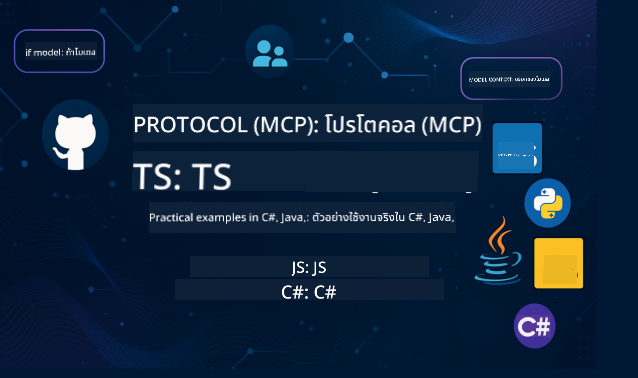

<!--
CO_OP_TRANSLATOR_METADATA:
{
  "original_hash": "866c8877136cb03e1efb9ad633a2f0a6",
  "translation_date": "2025-08-26T17:46:55+00:00",
  "source_file": "README.md",
  "language_code": "th"
}
-->
 

ทำตามขั้นตอนเหล่านี้เพื่อเริ่มต้นใช้งานทรัพยากรเหล่านี้:
1. **Fork Repository**: คลิก 
2. **Clone Repository**:   `git clone https://github.com/microsoft/mcp-for-beginners.git`
3. [**เข้าร่วม Azure AI Foundry Discord เพื่อพบปะผู้เชี่ยวชาญและนักพัฒนาคนอื่นๆ**](https://discord.com/invite/ByRwuEEgH4)

### 🌐 การสนับสนุนหลายภาษา

#### รองรับผ่าน GitHub Action (อัตโนมัติและอัปเดตเสมอ)

 [Arabic](../ar/README.md) | [Bengali](../bn/README.md) | [Bulgarian](../bg/README.md) | [Burmese (Myanmar)](../my/README.md) | [Chinese (Simplified)](../zh/README.md) | [Chinese (Traditional, Hong Kong)](../hk/README.md) | [Chinese (Traditional, Macau)](../mo/README.md) | [Chinese (Traditional, Taiwan)](../tw/README.md) | [Croatian](../hr/README.md) | [Czech](../cs/README.md) | [Danish](../da/README.md) | [Dutch](../nl/README.md) | [Finnish](../fi/README.md) | [French](../fr/README.md) | [German](../de/README.md) | [Greek](../el/README.md) | [Hebrew](../he/README.md) | [Hindi](../hi/README.md) | [Hungarian](../hu/README.md) | [Indonesian](../id/README.md) | [Italian](../it/README.md) | [Japanese](../ja/README.md) | [Korean](../ko/README.md) | [Malay](../ms/README.md) | [Marathi](../mr/README.md) | [Nepali](../ne/README.md) | [Norwegian](../no/README.md) | [Persian (Farsi)](../fa/README.md) | [Polish](../pl/README.md) | [Portuguese (Brazil)](../br/README.md) | [Portuguese (Portugal)](../pt/README.md) | [Punjabi (Gurmukhi)](../pa/README.md) | [Romanian](../ro/README.md) | [Russian](../ru/README.md) | [Serbian (Cyrillic)](../sr/README.md) | [Slovak](../sk/README.md) | [Slovenian](../sl/README.md) | [Spanish](../es/README.md) | [Swahili](../sw/README.md) | [Swedish](../sv/README.md) | [Tagalog (Filipino)](../tl/README.md) | [Thai](./README.md) | [Turkish](../tr/README.md) | [Ukrainian](../uk/README.md) | [Urdu](../ur/README.md) | [Vietnamese](../vi/README.md)

# 🚀 หลักสูตร Model Context Protocol (MCP) สำหรับผู้เริ่มต้น

## **เรียนรู้ MCP ด้วยตัวอย่างโค้ดใน C#, Java, JavaScript, Rust, Python และ TypeScript**

## 🧠 ภาพรวมของหลักสูตร Model Context Protocol

**Model Context Protocol (MCP)** เป็นกรอบงานที่ทันสมัยซึ่งออกแบบมาเพื่อมาตรฐานการโต้ตอบระหว่างโมเดล AI และแอปพลิเคชันลูกค้า หลักสูตรโอเพ่นซอร์สนี้มีเส้นทางการเรียนรู้ที่มีโครงสร้าง พร้อมตัวอย่างการเขียนโค้ดและกรณีการใช้งานจริงในภาษาการเขียนโปรแกรมยอดนิยม เช่น C#, Java, JavaScript, TypeScript และ Python

ไม่ว่าคุณจะเป็นนักพัฒนา AI สถาปนิกระบบ หรือวิศวกรซอฟต์แวร์ คู่มือนี้คือทรัพยากรที่ครอบคลุมสำหรับการเรียนรู้พื้นฐาน MCP และกลยุทธ์การใช้งาน

## 🔗 ทรัพยากร MCP อย่างเป็นทางการ

- 📘 [เอกสาร MCP](https://modelcontextprotocol.io/) – บทเรียนและคู่มือการใช้งานโดยละเอียด  
- 📜 [สเปค MCP](https://modelcontextprotocol.io/docs/) – สถาปัตยกรรมโปรโตคอลและข้อมูลอ้างอิงทางเทคนิค  
- 📜 [สเปค MCP ดั้งเดิม](https://spec.modelcontextprotocol.io/) – ข้อมูลอ้างอิงทางเทคนิคแบบดั้งเดิม (อาจมีรายละเอียดเพิ่มเติม)  
- 🧑‍💻 [MCP GitHub Repository](https://github.com/modelcontextprotocol) – SDK โอเพ่นซอร์ส เครื่องมือ และตัวอย่างโค้ด
- 🌐 [ชุมชน MCP](https://github.com/orgs/modelcontextprotocol/discussions) – เข้าร่วมการสนทนาและมีส่วนร่วมในชุมชน

## 🧭 ภาพรวมหลักสูตร MCP

### 📚 โครงสร้างหลักสูตรแบบสมบูรณ์

| โมดูล | หัวข้อ | คำอธิบาย | ลิงก์ |
|--------|-------|-------------|------|
| **Module 1-3: พื้นฐาน** | | | |
| 00 | แนะนำ MCP | ภาพรวมของ Model Context Protocol และความสำคัญในกระบวนการ AI | [อ่านเพิ่มเติม](./00-Introduction/README.md) |
| 01 | อธิบายแนวคิดหลัก | การสำรวจแนวคิดหลักของ MCP อย่างละเอียด | [อ่านเพิ่มเติม](./01-CoreConcepts/README.md) |
| 02 | ความปลอดภัยใน MCP | ภัยคุกคามด้านความปลอดภัยและแนวทางปฏิบัติที่ดีที่สุด | [อ่านเพิ่มเติม](./02-Security/README.md) |
| 03 | เริ่มต้นใช้งาน MCP | การตั้งค่าสภาพแวดล้อม เซิร์ฟเวอร์/ไคลเอนต์พื้นฐาน การรวมระบบ | [อ่านเพิ่มเติม](./03-GettingStarted/README.md) |
| **Module 3: สร้างเซิร์ฟเวอร์และไคลเอนต์แรกของคุณ** | | | |
| 3.1 | เซิร์ฟเวอร์แรก | สร้างเซิร์ฟเวอร์ MCP แรกของคุณ | [คู่มือ](./03-GettingStarted/01-first-server/README.md) |
| 3.2 | ไคลเอนต์แรก | พัฒนาไคลเอนต์ MCP พื้นฐาน | [คู่มือ](./03-GettingStarted/02-client/README.md) |
| 3.3 | ไคลเอนต์พร้อม LLM | รวมโมเดลภาษาขนาดใหญ่ | [คู่มือ](./03-GettingStarted/03-llm-client/README.md) |
| 3.4 | การรวม VS Code | ใช้เซิร์ฟเวอร์ MCP ใน VS Code | [คู่มือ](./03-GettingStarted/04-vscode/README.md) |
| 3.5 | เซิร์ฟเวอร์ stdio | สร้างเซิร์ฟเวอร์โดยใช้การส่งข้อมูลแบบ stdio | [คู่มือ](./03-GettingStarted/05-stdio-server/README.md) |
| 3.6 | HTTP Streaming | ใช้ HTTP streaming ใน MCP | [คู่มือ](./03-GettingStarted/06-http-streaming/README.md) |
| 3.7 | AI Toolkit | ใช้ AI Toolkit กับ MCP | [คู่มือ](./03-GettingStarted/07-aitk/README.md) |
| 3.8 | การทดสอบ | ทดสอบการใช้งานเซิร์ฟเวอร์ MCP ของคุณ | [คู่มือ](./03-GettingStarted/08-testing/README.md) |
| 3.9 | การปรับใช้ | ปรับใช้เซิร์ฟเวอร์ MCP สู่การใช้งานจริง | [คู่มือ](./03-GettingStarted/09-deployment/README.md) |
| **Module 4-5: การใช้งานจริงและขั้นสูง** | | | |
| 04 | การใช้งานจริง | SDKs, การดีบัก, การทดสอบ, เทมเพลตคำสั่งที่นำกลับมาใช้ใหม่ได้ | [อ่านเพิ่มเติม](./04-PracticalImplementation/README.md) |
| 05 | หัวข้อขั้นสูงใน MCP | AI หลายรูปแบบ, การปรับขนาด, การใช้งานในองค์กร | [อ่านเพิ่มเติม](./05-AdvancedTopics/README.md) |
| 5.1 | การรวม Azure | การรวม MCP กับ Azure | [คู่มือ](./05-AdvancedTopics/mcp-integration/README.md) |
| 5.2 | หลายรูปแบบ | การทำงานกับหลายรูปแบบ | [คู่มือ](./05-AdvancedTopics/mcp-multi-modality/README.md) |
| 5.3 | การสาธิต OAuth2 | ใช้การตรวจสอบสิทธิ์ OAuth2 | [คู่มือ](./05-AdvancedTopics/mcp-oauth2-demo/README.md) |
| 5.4 | Root Contexts | ทำความเข้าใจและใช้งาน root contexts | [คู่มือ](./05-AdvancedTopics/mcp-root-contexts/README.md) |
| 5.5 | การกำหนดเส้นทาง | กลยุทธ์การกำหนดเส้นทาง MCP | [คู่มือ](./05-AdvancedTopics/mcp-routing/README.md) |
| 5.6 | การสุ่มตัวอย่าง | เทคนิคการสุ่มตัวอย่างใน MCP | [คู่มือ](./05-AdvancedTopics/mcp-sampling/README.md) |
| 5.7 | การปรับขนาด | ปรับขนาดการใช้งาน MCP | [คู่มือ](./05-AdvancedTopics/mcp-scaling/README.md) |
| 5.8 | ความปลอดภัย | การพิจารณาด้านความปลอดภัยขั้นสูง | [คู่มือ](./05-AdvancedTopics/mcp-security/README.md) |
| 5.9 | การค้นหาเว็บ | ใช้ความสามารถในการค้นหาเว็บ | [คู่มือ](./05-AdvancedTopics/web-search-mcp/README.md) |
| 5.10 | การสตรีมแบบเรียลไทม์ | สร้างฟังก์ชันการสตรีมแบบเรียลไทม์ | [คู่มือ](./05-AdvancedTopics/mcp-realtimestreaming/README.md) |
| 5.11 | การค้นหาแบบเรียลไทม์ | ใช้การค้นหาแบบเรียลไทม์ | [คู่มือ](./05-AdvancedTopics/mcp-realtimesearch/README.md) |
| 5.12 | การตรวจสอบสิทธิ์ Entra ID | การตรวจสอบสิทธิ์ด้วย Microsoft Entra ID | [คู่มือ](./05-AdvancedTopics/mcp-security-entra/README.md) |
| 5.13 | การรวม Foundry | รวมกับ Azure AI Foundry | [คู่มือ](./05-AdvancedTopics/mcp-foundry-agent-integration/README.md) |
| 5.14 | การออกแบบ Context | เทคนิคสำหรับการออกแบบ context ที่มีประสิทธิภาพ | [คู่มือ](./05-AdvancedTopics/mcp-contextengineering/README.md) |
| **Module 6-10: ชุมชนและแนวทางปฏิบัติที่ดีที่สุด** | | | |
| 06 | การมีส่วนร่วมของชุมชน | วิธีการมีส่วนร่วมในระบบนิเวศ MCP | [คู่มือ](./06-CommunityContributions/README.md) |
| 07 | ข้อมูลเชิงลึกจากการใช้งานในช่วงแรก | เรื่องราวการใช้งานจริง | [คู่มือ](./07-LessonsFromEarlyAdoption/README.md) |
| 08 | แนวทางปฏิบัติที่ดีที่สุดสำหรับ MCP | ประสิทธิภาพ, ความทนทานต่อข้อผิดพลาด, ความยืดหยุ่น | [คู่มือ](./08-BestPractices/README.md) |
| 09 | กรณีศึกษา MCP | ตัวอย่างการใช้งานจริง | [คู่มือ](./09-CaseStudy/README.md) |
| 10 | เวิร์กช็อปแบบลงมือทำ | สร้างเซิร์ฟเวอร์ MCP ด้วย AI Toolkit | [Lab](./10-StreamliningAIWorkflowsBuildingAnMCPServerWithAIToolkit/README.md) |

### 💻 โครงการตัวอย่างโค้ด

#### ตัวอย่าง MCP Calculator พื้นฐาน

| ภาษา | คำอธิบาย | ลิงก์ |
|----------|-------------|------|
| C# | ตัวอย่างเซิร์ฟเวอร์ MCP | [ดูโค้ด](./03-GettingStarted/samples/csharp/README.md) |
| Java | MCP Calculator | [ดูโค้ด](./03-GettingStarted/samples/java/calculator/README.md) |
| JavaScript | MCP Demo | [ดูโค้ด](./03-GettingStarted/samples/javascript/README.md) |
| Python | เซิร์ฟเวอร์ MCP | [ดูโค้ด](../../03-GettingStarted/samples/python/mcp_calculator_server.py) |
| TypeScript | ตัวอย่าง MCP | [ดูโค้ด](./03-GettingStarted/samples/typescript/README.md) |
| Rust | ตัวอย่าง MCP | [ดูโค้ด](./03-GettingStarted/samples/rust/README.md) |

#### การใช้งาน MCP ขั้นสูง

| ภาษา | คำอธิบาย | ลิงก์ |
|----------|-------------|------|
| C# | ตัวอย่างขั้นสูง | [View Code](./04-PracticalImplementation/samples/csharp/README.md) |
| Java with Spring | ตัวอย่างแอปพลิเคชันแบบ Container | [View Code](./04-PracticalImplementation/samples/java/containerapp/README.md) |
| JavaScript | ตัวอย่างขั้นสูง | [View Code](./04-PracticalImplementation/samples/javascript/README.md) |
| Python | การใช้งานที่ซับซ้อน | [View Code](../../04-PracticalImplementation/samples/python/READMEmd) |
| TypeScript | ตัวอย่าง Container | [View Code](./04-PracticalImplementation/samples/typescript/README.md) |

## 🎯 ข้อกำหนดเบื้องต้นสำหรับการเรียนรู้ MCP

เพื่อให้ได้ประโยชน์สูงสุดจากหลักสูตรนี้ คุณควรมี:

- ความรู้พื้นฐานเกี่ยวกับการเขียนโปรแกรมในภาษาใดภาษาหนึ่งต่อไปนี้: C#, Java, JavaScript, Python หรือ TypeScript
- ความเข้าใจเกี่ยวกับโมเดล Client-Server และ API
- ความคุ้นเคยกับแนวคิด REST และ HTTP
- (ไม่บังคับ) พื้นฐานเกี่ยวกับแนวคิด AI/ML

- เข้าร่วมการสนทนาในชุมชนของเราเพื่อขอความช่วยเหลือ

## 📚 คู่มือการศึกษาและทรัพยากร

ที่เก็บนี้มีทรัพยากรหลายอย่างเพื่อช่วยให้คุณเรียนรู้ได้อย่างมีประสิทธิภาพ:

### คู่มือการศึกษา

[คู่มือการศึกษา](./study_guide.md) ที่ครอบคลุมมีให้เพื่อช่วยให้คุณสำรวจที่เก็บนี้ได้อย่างมีประสิทธิภาพ คู่มือนี้ประกอบด้วย:

- แผนภาพหลักสูตรที่แสดงหัวข้อทั้งหมดที่ครอบคลุม
- การแจกแจงรายละเอียดของแต่ละส่วนในที่เก็บ
- คำแนะนำเกี่ยวกับวิธีการใช้โครงการตัวอย่าง
- เส้นทางการเรียนรู้ที่แนะนำสำหรับระดับทักษะที่แตกต่างกัน
- ทรัพยากรเพิ่มเติมเพื่อเสริมการเรียนรู้ของคุณ

### บันทึกการเปลี่ยนแปลง

เราเก็บรักษา [บันทึกการเปลี่ยนแปลง](./changelog.md) ที่ละเอียดซึ่งติดตามการอัปเดตที่สำคัญทั้งหมดในเนื้อหาหลักสูตร รวมถึง:

- การเพิ่มเนื้อหาใหม่
- การเปลี่ยนแปลงโครงสร้าง
- การปรับปรุงคุณสมบัติ
- การอัปเดตเอกสาร

## 🛠️ วิธีใช้หลักสูตรนี้อย่างมีประสิทธิภาพ

แต่ละบทเรียนในคู่มือนี้ประกอบด้วย:

1. คำอธิบายที่ชัดเจนเกี่ยวกับแนวคิด MCP  
2. ตัวอย่างโค้ดสดในหลายภาษา  
3. แบบฝึกหัดเพื่อสร้างแอปพลิเคชัน MCP จริง  
4. ทรัพยากรเพิ่มเติมสำหรับผู้เรียนขั้นสูง  

## กิจกรรม 

### [MCP Dev Days กรกฎาคม 2025](https://developer.microsoft.com/en-us/reactor/series/S-1563/)
#### [➡️รับชมย้อนหลัง - MCP Dev Days](https://developer.microsoft.com/en-us/reactor/series/S-1563/)
เตรียมตัวให้พร้อมสำหรับสองวันของข้อมูลเชิงลึกทางเทคนิค การเชื่อมต่อชุมชน และการเรียนรู้แบบลงมือทำใน MCP Dev Days ซึ่งเป็นกิจกรรมเสมือนจริงที่อุทิศให้กับ Model Context Protocol (MCP) — มาตรฐานใหม่ที่เชื่อมโยงโมเดล AI และเครื่องมือที่พวกเขาใช้งาน

คุณสามารถรับชม MCP Dev Days ได้โดยลงทะเบียนในหน้ากิจกรรมของเรา: https://aka.ms/mcpdevdays  

#### [วันแรก: MCP Productivity, DevTools, & Community:](https://developer.microsoft.com/en-us/reactor/series/S-1563/)

เน้นการเพิ่มศักยภาพให้กับนักพัฒนาในการใช้ MCP ในกระบวนการทำงานของนักพัฒนา และเฉลิมฉลองชุมชน MCP ที่น่าทึ่ง เราจะมีสมาชิกชุมชนและพันธมิตร เช่น Arcade, Block, Okta และ Neon มาร่วมแบ่งปันวิธีที่พวกเขาร่วมมือกับ Microsoft เพื่อสร้างระบบนิเวศ MCP ที่เปิดกว้างและขยายได้

- การสาธิตในโลกจริงผ่าน VS Code, Visual Studio, GitHub Copilot และเครื่องมือชุมชนยอดนิยม  
- กระบวนการทำงานที่ขับเคลื่อนด้วยบริบทที่ใช้งานได้จริง  
- เซสชันที่นำโดยชุมชนและข้อมูลเชิงลึก  

ไม่ว่าคุณจะเพิ่งเริ่มต้นกับ MCP หรือกำลังสร้างด้วยมันอยู่แล้ว วันแรกจะสร้างแรงบันดาลใจและให้ข้อมูลที่นำไปใช้ได้จริง  

#### [วันที่สอง: สร้าง MCP Servers อย่างมั่นใจ](https://developer.microsoft.com/en-us/reactor/series/S-1563/)

เหมาะสำหรับผู้สร้าง MCP เราจะเจาะลึกกลยุทธ์การใช้งานและแนวปฏิบัติที่ดีที่สุดสำหรับการสร้าง MCP Servers และการผสาน MCP เข้ากับกระบวนการทำงาน AI ของคุณ  

#### หัวข้อที่ครอบคลุม:

- การสร้าง MCP Servers และการผสานเข้ากับประสบการณ์ของ Agent  
- การพัฒนาที่ขับเคลื่อนด้วย Prompt  
- แนวปฏิบัติที่ดีที่สุดด้านความปลอดภัย  
- การใช้บล็อกการสร้าง เช่น Functions, ACA และ API Management  
- การจัดตำแหน่ง Registry และเครื่องมือ (1P + 3P)  

หากคุณเป็นนักพัฒนา ผู้สร้างเครื่องมือ หรือผู้วางกลยุทธ์ผลิตภัณฑ์ AI วันนี้เต็มไปด้วยข้อมูลเชิงลึกที่คุณต้องการเพื่อสร้างโซลูชัน MCP ที่ปรับขนาดได้ ปลอดภัย และพร้อมสำหรับอนาคต  

### MCP Boot Camp สิงหาคม 2025
เรียนรู้ผ่านเซสชันวิดีโอเข้มข้นเกี่ยวกับวิธีสร้าง MCP Servers ผสานรวมกับ VS Code และปรับใช้บน Azure อย่างมืออาชีพ โดยอ้างอิงจากเนื้อหาในหลักสูตร MCP สำหรับผู้เริ่มต้น ออกไปพร้อมกับทักษะที่ใช้งานได้จริงในเทคโนโลยีที่บริษัทใหญ่ๆ ใช้งานอยู่แล้ว  

#### [➡️รับชมย้อนหลัง MCP Bootcamp | ภาษาอังกฤษ](https://developer.microsoft.com/en-us/reactor/series/s-1568/)  
#### [➡️รับชมย้อนหลัง MCP Bootcamp | ภาษาโปรตุเกส](https://developer.microsoft.com/en-us/reactor/series/S-1566/)  
#### [➡️รับชมย้อนหลัง MCP Bootcamp | ภาษาสเปน](https://developer.microsoft.com/en-us/reactor/series/S-1567/)  

## 🌟 ขอบคุณชุมชน

ขอขอบคุณ Microsoft Valued Professional [Shivam Goyal](https://www.linkedin.com/in/shivam2003/) สำหรับการมีส่วนร่วมในตัวอย่างโค้ดที่สำคัญ  

## 📜 ข้อมูลลิขสิทธิ์

เนื้อหานี้ได้รับอนุญาตภายใต้ **MIT License** สำหรับข้อกำหนดและเงื่อนไข โปรดดูที่ [LICENSE](../../LICENSE)  

## 🤝 แนวทางการมีส่วนร่วม

โครงการนี้ยินดีต้อนรับการมีส่วนร่วมและข้อเสนอแนะ การมีส่วนร่วมส่วนใหญ่ต้องการให้คุณยอมรับ  
Contributor License Agreement (CLA) ซึ่งระบุว่าคุณมีสิทธิ์และมอบสิทธิ์ให้เราใช้การมีส่วนร่วมของคุณ สำหรับรายละเอียด โปรดเยี่ยมชม  
<https://cla.opensource.microsoft.com>  

เมื่อคุณส่งคำขอ Pull Request บอท CLA จะตรวจสอบโดยอัตโนมัติว่าคุณต้องให้ CLA หรือไม่ และตกแต่ง PR ตามความเหมาะสม (เช่น การตรวจสอบสถานะ ความคิดเห็น) เพียงทำตามคำแนะนำที่บอทให้ไว้ คุณจะต้องทำสิ่งนี้เพียงครั้งเดียวสำหรับที่เก็บทั้งหมดที่ใช้ CLA ของเรา  

โครงการนี้ได้นำ [Microsoft Open Source Code of Conduct](https://opensource.microsoft.com/codeofconduct/) มาใช้  
สำหรับข้อมูลเพิ่มเติม โปรดดูที่ [Code of Conduct FAQ](https://opensource.microsoft.com/codeofconduct/faq/) หรือ  
ติดต่อ [opencode@microsoft.com](mailto:opencode@microsoft.com) หากมีคำถามหรือความคิดเห็นเพิ่มเติม  

## 📂 โครงสร้างที่เก็บ

ที่เก็บนี้จัดระเบียบดังนี้:

- **Core Curriculum (00-10)**: เนื้อหาหลักที่จัดเรียงในสิบโมดูลตามลำดับ  
- **images/**: แผนภาพและภาพประกอบที่ใช้ตลอดหลักสูตร  
- **translations/**: รองรับหลายภาษาโดยใช้การแปลอัตโนมัติ  
- **translated_images/**: เวอร์ชันที่แปลของแผนภาพและภาพประกอบ  
- **study_guide.md**: คู่มือที่ครอบคลุมสำหรับการสำรวจที่เก็บ  
- **changelog.md**: บันทึกการเปลี่ยนแปลงที่สำคัญทั้งหมดในเนื้อหาหลักสูตร  
- **mcp.json**: ไฟล์การกำหนดค่าสำหรับ MCP Specification  
- **CODE_OF_CONDUCT.md, LICENSE, SECURITY.md, SUPPORT.md**: เอกสารการกำกับดูแลโครงการ  

## 🎒 หลักสูตรอื่นๆ
ทีมของเราผลิตหลักสูตรอื่นๆ ด้วย! ลองดู:

- [AI Agents For Beginners](https://github.com/microsoft/ai-agents-for-beginners?WT.mc_id=academic-105485-koreyst)  
- [Generative AI for Beginners using .NET](https://github.com/microsoft/Generative-AI-for-beginners-dotnet?WT.mc_id=academic-105485-koreyst)  
- [Generative AI for Beginners using JavaScript](https://github.com/microsoft/generative-ai-with-javascript?WT.mc_id=academic-105485-koreyst)  
- [Generative AI for Beginners](https://github.com/microsoft/generative-ai-for-beginners?WT.mc_id=academic-105485-koreyst)  
- [Generative AI for Beginners using Java](https://github.com/microsoft/generative-ai-for-beginners-java?WT.mc_id=academic-105485-koreyst)  
- [ML for Beginners](https://aka.ms/ml-beginners?WT.mc_id=academic-105485-koreyst)  
- [Data Science for Beginners](https://aka.ms/datascience-beginners?WT.mc_id=academic-105485-koreyst)  
- [AI for Beginners](https://aka.ms/ai-beginners?WT.mc_id=academic-105485-koreyst)  
- [Cybersecurity for Beginners](https://github.com/microsoft/Security-101?WT.mc_id=academic-96948-sayoung)  
- [Web Dev for Beginners](https://aka.ms/webdev-beginners?WT.mc_id=academic-105485-koreyst)  
- [IoT for Beginners](https://aka.ms/iot-beginners?WT.mc_id=academic-105485-koreyst)  
- [XR Development for Beginners](https://github.com/microsoft/xr-development-for-beginners?WT.mc_id=academic-105485-koreyst)  
- [Mastering GitHub Copilot for AI Paired Programming](https://aka.ms/GitHubCopilotAI?WT.mc_id=academic-105485-koreyst)  
- [Mastering GitHub Copilot for C#/.NET Developers](https://github.com/microsoft/mastering-github-copilot-for-dotnet-csharp-developers?WT.mc_id=academic-105485-koreyst)  
- [Choose Your Own Copilot Adventure](https://github.com/microsoft/CopilotAdventures?WT.mc_id=academic-105485-koreyst)  

## ™️ ข้อสังเกตเกี่ยวกับเครื่องหมายการค้า

โครงการนี้อาจมีเครื่องหมายการค้าหรือโลโก้สำหรับโครงการ ผลิตภัณฑ์ หรือบริการ การใช้งานเครื่องหมายการค้าหรือโลโก้ของ Microsoft อย่างถูกต้องต้องเป็นไปตาม  
[Microsoft's Trademark & Brand Guidelines](https://www.microsoft.com/legal/intellectualproperty/trademarks/usage/general)  
การใช้เครื่องหมายการค้าหรือโลโก้ของ Microsoft ในเวอร์ชันที่แก้ไขของโครงการนี้ต้องไม่ก่อให้เกิดความสับสนหรือบ่งบอกถึงการสนับสนุนจาก Microsoft  
การใช้เครื่องหมายการค้าหรือโลโก้ของบุคคลที่สามใดๆ ต้องเป็นไปตามนโยบายของบุคคลที่สามนั้นๆ  

---

**ข้อจำกัดความรับผิดชอบ**:  
เอกสารนี้ได้รับการแปลโดยใช้บริการแปลภาษา AI [Co-op Translator](https://github.com/Azure/co-op-translator) แม้ว่าเราจะพยายามให้การแปลมีความถูกต้องมากที่สุด แต่โปรดทราบว่าการแปลโดยอัตโนมัติอาจมีข้อผิดพลาดหรือความไม่ถูกต้อง เอกสารต้นฉบับในภาษาดั้งเดิมควรถือเป็นแหล่งข้อมูลที่เชื่อถือได้ สำหรับข้อมูลที่สำคัญ ขอแนะนำให้ใช้บริการแปลภาษามืออาชีพ เราไม่รับผิดชอบต่อความเข้าใจผิดหรือการตีความที่ผิดพลาดซึ่งเกิดจากการใช้การแปลนี้