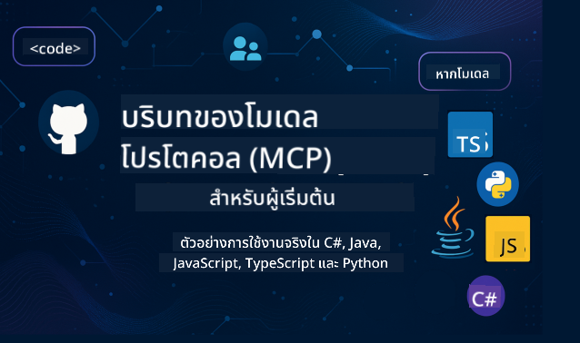

<!--
CO_OP_TRANSLATOR_METADATA:
{
  "original_hash": "2a21391378c12ecfef50f866329dfde0",
  "translation_date": "2025-05-17T05:26:14+00:00",
  "source_file": "README.md",
  "language_code": "th"
}
-->

ทำตามขั้นตอนเหล่านี้เพื่อเริ่มต้นใช้งานทรัพยากรเหล่านี้:
1. **Fork ที่เก็บโค้ด**: คลิก 
2. **Clone ที่เก็บโค้ด**: `git clone https://github.com/microsoft/mcp-for-beginners.git`
3. [**เข้าร่วม Microsoft Azure AI Foundry Discord และพบกับผู้เชี่ยวชาญและนักพัฒนาคนอื่นๆ**](https://discord.com/invite/ByRwuEEgH4)

### 🌐 รองรับหลายภาษา

#### รองรับผ่าน GitHub Action (อัตโนมัติ & อัพเดทตลอดเวลา)
[ภาษาฝรั่งเศส](../fr/README.md) | [ภาษาสเปน](../es/README.md) | [ภาษาเยอรมัน](../de/README.md) | [ภาษารัสเซีย](../ru/README.md) | [ภาษาอาหรับ](../ar/README.md) | [ภาษาเปอร์เซีย (ฟาร์ซี)](../fa/README.md) | [ภาษาอูรดู](../ur/README.md) | [ภาษาจีน (ตัวย่อ)](../zh/README.md) | [ภาษาจีน (ตัวเต็ม, มาเก๊า)](../mo/README.md) | [ภาษาจีน (ตัวเต็ม, ฮ่องกง)](../hk/README.md) | [ภาษาจีน (ตัวเต็ม, ไต้หวัน)](../tw/README.md) | [ภาษาญี่ปุ่น](../ja/README.md) | [ภาษาเกาหลี](../ko/README.md) | [ภาษาฮินดี](../hi/README.md) | [ภาษาเบงกาลี](../bn/README.md) | [ภาษามราฐี](../mr/README.md) | [ภาษานีปาลี](../ne/README.md) | [ภาษาปัญจาบ (คุรมุขี)](../pa/README.md) | [ภาษาโปรตุเกส (โปรตุเกส)](../pt/README.md) | [ภาษาโปรตุเกส (บราซิล)](../br/README.md) | [ภาษาอิตาลี](../it/README.md) | [ภาษาโปแลนด์](../pl/README.md) | [ภาษาตุรกี](../tr/README.md) | [ภาษากรีก](../el/README.md) | [ภาษาไทย](./README.md) | [ภาษาสวีเดน](../sv/README.md) | [ภาษาเดนมาร์ก](../da/README.md) | [ภาษานอร์เวย์](../no/README.md) | [ภาษาฟินแลนด์](../fi/README.md) | [ภาษาดัตช์](../nl/README.md) | [ภาษาฮิบรู](../he/README.md) | [ภาษาเวียดนาม](../vi/README.md) | [ภาษาอินโดนีเซีย](../id/README.md) | [ภาษามลายู](../ms/README.md) | [ภาษาตากาล็อก (ฟิลิปปินส์)](../tl/README.md) | [ภาษาสวาฮีลี](../sw/README.md) | [ภาษาฮังการี](../hu/README.md) | [ภาษาเช็ก](../cs/README.md) | [ภาษาสโลวัก](../sk/README.md) | [ภาษาโรมาเนีย](../ro/README.md) | [ภาษาบัลแกเรีย](../bg/README.md) | [ภาษาเซอร์เบีย (ซีริลลิก)](../sr/README.md) | [ภาษาโครเอเชีย](../hr/README.md) | [ภาษาสโลวีเนีย](../sl/README.md)
# 🚀 คู่มือฉบับสมบูรณ์เกี่ยวกับหลักสูตร Model Context Protocol (MCP) สำหรับผู้เริ่มต้น

## **เรียนรู้ MCP ด้วยตัวอย่างโค้ดที่สามารถทำได้จริงในภาษา C#, Java, JavaScript, Python, และ TypeScript**

## 🧠 ภาพรวมของหลักสูตร Model Context Protocol

**Model Context Protocol (MCP)** เป็นกรอบการทำงานที่ทันสมัยออกแบบมาเพื่อมาตรฐานการโต้ตอบระหว่างโมเดล AI และแอปพลิเคชันของลูกค้า หลักสูตรนี้เป็นโอเพนซอร์สที่เสนอเส้นทางการเรียนรู้ที่มีโครงสร้างพร้อมตัวอย่างการเขียนโค้ดจริงและกรณีการใช้งานจริงในภาษาโปรแกรมยอดนิยม เช่น C#, Java, JavaScript, TypeScript, และ Python

ไม่ว่าคุณจะเป็นนักพัฒนา AI, สถาปนิกระบบ, หรือวิศวกรซอฟต์แวร์ คู่มือนี้เป็นแหล่งข้อมูลครบวงจรสำหรับการเรียนรู้พื้นฐาน MCP และกลยุทธ์การนำไปใช้

## 🔗 แหล่งข้อมูล MCP อย่างเป็นทางการ

- 📘 [MCP Documentation](https://modelcontextprotocol.io/) – บทแนะนำและคู่มือผู้ใช้ที่ละเอียด  
- 📜 [MCP Specification](https://spec.modelcontextprotocol.io/) – สถาปัตยกรรมโปรโตคอลและเอกสารอ้างอิงทางเทคนิค  
- 🧑‍💻 [MCP GitHub Repository](https://github.com/modelcontextprotocol) – SDKs โอเพนซอร์ส, เครื่องมือ, และตัวอย่างโค้ด  

## 🧭 โครงสร้างหลักสูตร MCP ครบวงจร

### 📌 [แนะนำ MCP](./00-Introduction/README.md)

- Model Context Protocol คืออะไร?
- ทำไมการมาตรฐานถึงสำคัญในกระบวนการ AI
- กรณีการใช้งานจริงและประโยชน์ของ MCP

### 🧩 [อธิบายแนวคิดหลัก](./01-CoreConcepts/README.md)

- การเข้าใจสถาปัตยกรรมลูกค้า-เซิร์ฟเวอร์ใน MCP
- ส่วนประกอบหลักของโปรโตคอล: คำขอ, การตอบสนอง, และสคีมา
- รูปแบบการส่งข้อความและการแลกเปลี่ยนข้อมูลใน MCP

### 🔐 [ความปลอดภัยใน MCP](./02-Security/readme.md)

- การระบุภัยคุกคามด้านความปลอดภัยในระบบที่ใช้ MCP
- เทคนิคและแนวปฏิบัติที่ดีที่สุดในการรักษาความปลอดภัย

### 🚀 [เริ่มต้นกับ MCP](./03-GettingStarted/README.md)

- การตั้งค่าสภาพแวดล้อมและการกำหนดค่า
- การสร้างเซิร์ฟเวอร์และลูกค้า MCP เบื้องต้น
- การรวม MCP เข้ากับแอปพลิเคชันที่มีอยู่

#### 🧮 โครงการตัวอย่าง MCP Calculator:

  
<strong>สำรวจการใช้โค้ดตามภาษา</strong>

  - [ตัวอย่างเซิร์ฟเวอร์ MCP ใน C#](./03-GettingStarted/samples/csharp/README.md)
  - [Java MCP Calculator](./03-GettingStarted/samples/java/calculator/README.md)
  - [JavaScript MCP Demo](./03-GettingStarted/samples/javascript/README.md)
  - [เซิร์ฟเวอร์ MCP ใน Python](../../03-GettingStarted/samples/python/mcp_calculator_server.py)
  - [ตัวอย่าง MCP ใน TypeScript](./03-GettingStarted/samples/typescript/README.md)

### 🛠️ [การนำไปใช้จริง](./04-PracticalImplementation/README.md)

- การใช้ SDKs ในหลายภาษา
- การดีบั๊ก, การทดสอบ, และการตรวจสอบ
- การสร้างแม่แบบและเวิร์กโฟลว์ที่นำกลับมาใช้ใหม่ได้

#### 💡 โครงการ MCP Advanced Calculator:

  
<strong>สำรวจตัวอย่างขั้นสูง</strong>

  - [ตัวอย่างขั้นสูงใน C#](./04-PracticalImplementation/samples/csharp/README.md)
  - [ตัวอย่างแอปคอนเทนเนอร์ใน Java](./04-PracticalImplementation/samples/java/containerapp/README.md)
  - [ตัวอย่างขั้นสูงใน JavaScript](./04-PracticalImplementation/samples/javascript/README.md)
  - [การนำไปใช้ซับซ้อนใน Python](../../04-PracticalImplementation/samples/python/mcp_sample.py)
  - [ตัวอย่างคอนเทนเนอร์ใน TypeScript](./04-PracticalImplementation/samples/typescript/README.md)

### 🎓 [หัวข้อขั้นสูงใน MCP](./05-AdvancedTopics/README.md)

- เวิร์กโฟลว์ AI หลายโหมดและความสามารถในการขยาย
- กลยุทธ์การขยายที่ปลอดภัย
- MCP ในระบบนิเวศองค์กร

### 🌍 [การมีส่วนร่วมของชุมชน](./06-CommunityContributions/README.md)

- วิธีการมีส่วนร่วมโค้ดและเอกสาร
- การร่วมมือผ่าน GitHub
- การปรับปรุงและข้อเสนอแนะที่ขับเคลื่อนโดยชุมชน

### 📈 [ข้อมูลจากการนำไปใช้ในระยะแรก](./07-CaseStudies/README.md)

- การนำไปใช้จริงและสิ่งที่ได้ผล
- การสร้างและปรับใช้โซลูชันที่ใช้ MCP
- แนวโน้มและแผนที่อนาคต

### 📏 [แนวปฏิบัติที่ดีที่สุดสำหรับ MCP](./08-BestPractices/README.md)

- การปรับแต่งและเพิ่มประสิทธิภาพ
- การออกแบบระบบ MCP ที่ทนทานต่อความผิดพลาด
- กลยุทธ์การทดสอบและความยืดหยุ่น

### 📊 [กรณีศึกษา MCP](./09-CaseStudy/Readme.md)

- การวิเคราะห์เชิงลึกเกี่ยวกับสถาปัตยกรรมโซลูชัน MCP
- แผนการปรับใช้และเคล็ดลับการรวม
- แผนภาพที่มีคำอธิบายประกอบและการเดินผ่านโครงการ

## 🎯 สิ่งที่ต้องรู้ก่อนเรียน MCP

เพื่อให้ได้ประโยชน์สูงสุดจากหลักสูตรนี้ คุณควรมี:

- ความรู้พื้นฐานเกี่ยวกับ C#, Java, หรือ Python
- การเข้าใจโมเดลลูกค้า-เซิร์ฟเวอร์และ APIs
- (ไม่จำเป็น) ความคุ้นเคยกับแนวคิดการเรียนรู้ของเครื่อง

## 🛠️ วิธีการใช้หลักสูตรนี้อย่างมีประสิทธิภาพ

แต่ละบทเรียนในคู่มือนี้ประกอบด้วย:

1. คำอธิบายที่ชัดเจนเกี่ยวกับแนวคิด MCP  
2. ตัวอย่างโค้ดสดในหลายภาษา  
3. แบบฝึกหัดเพื่อสร้างแอปพลิเคชัน MCP จริง  
4. แหล่งข้อมูลเพิ่มเติมสำหรับผู้เรียนขั้นสูง  

## 📜 ข้อมูลใบอนุญาต

เนื้อหานี้ได้รับอนุญาตภายใต้ **MIT License** สำหรับข้อกำหนดและเงื่อนไข ดู [LICENSE](../../LICENSE)

## 🤝 แนวทางการมีส่วนร่วม

โครงการนี้ยินดีต้อนรับการมีส่วนร่วมและข้อเสนอแนะ การมีส่วนร่วมส่วนใหญ่ต้องการให้คุณตกลงใน
Contributor License Agreement (CLA) ที่ประกาศว่าคุณมีสิทธิ์และจริงๆ ทำให้เรามีสิทธิ์ใช้การมีส่วนร่วมของคุณ สำหรับรายละเอียดเพิ่มเติมเยี่ยมชม <https://cla.opensource.microsoft.com>

เมื่อคุณส่งคำขอดึง CLA bot จะตรวจสอบโดยอัตโนมัติว่าคุณจำเป็นต้องให้
CLA และตกแต่ง PR อย่างเหมาะสม (เช่น การตรวจสอบสถานะ, ความคิดเห็น) เพียงแค่ทำตามคำแนะนำ
ที่ให้โดย bot คุณจะต้องทำสิ่งนี้เพียงครั้งเดียวในทุก repo ที่ใช้ CLA ของเรา

โครงการนี้ได้ยอมรับ [Microsoft Open Source Code of Conduct](https://opensource.microsoft.com/codeofconduct/)
สำหรับข้อมูลเพิ่มเติม ดู [Code of Conduct FAQ](https://opensource.microsoft.com/codeofconduct/faq/) หรือ
ติดต่อ [opencode@microsoft.com](mailto:opencode@microsoft.com) สำหรับคำถามหรือความคิดเห็นเพิ่มเติม

## ™️ ประกาศเครื่องหมายการค้า

โครงการนี้อาจมีเครื่องหมายการค้าหรือโลโก้สำหรับโครงการ, ผลิตภัณฑ์, หรือบริการ การใช้เครื่องหมายการค้าหรือโลโก้ของ Microsoft ที่ได้รับอนุญาตต้องเป็นไปตามและต้องปฏิบัติตาม
[Microsoft's Trademark & Brand Guidelines](https://www.microsoft.com/legal/intellectualproperty/trademarks/usage/general)
การใช้เครื่องหมายการค้าหรือโลโก้ของ Microsoft ในโครงการที่ปรับเปลี่ยนต้องไม่ทำให้เกิดความสับสนหรือบ่งบอกการสนับสนุนจาก Microsoft
การใช้เครื่องหมายการค้าหรือโลโก้ของบุคคลที่สามต้องเป็นไปตามนโยบายของบุคคลที่สามเหล่านั้น

**คำปฏิเสธความรับผิดชอบ**:  
เอกสารนี้ได้รับการแปลโดยใช้บริการแปลภาษา AI [Co-op Translator](https://github.com/Azure/co-op-translator) แม้ว่าเราจะพยายามอย่างเต็มที่เพื่อความถูกต้อง โปรดทราบว่าการแปลอัตโนมัติอาจมีข้อผิดพลาดหรือความไม่ถูกต้อง เอกสารต้นฉบับในภาษาต้นทางควรถือเป็นแหล่งข้อมูลที่เชื่อถือได้ สำหรับข้อมูลที่สำคัญ แนะนำให้ใช้บริการแปลภาษามนุษย์มืออาชีพ เราจะไม่รับผิดชอบต่อความเข้าใจผิดหรือการตีความผิดที่เกิดจากการใช้การแปลนี้