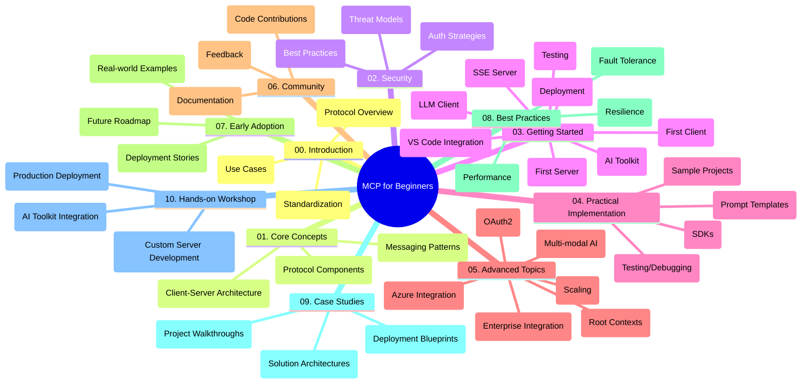

<!--
CO_OP_TRANSLATOR_METADATA:
{
  "original_hash": "a607d4febc94caee9a12b77795f7fc9a",
  "translation_date": "2025-07-13T15:14:45+00:00",
  "source_file": "study_guide.md",
  "language_code": "th"
}
-->
# Model Context Protocol (MCP) สำหรับผู้เริ่มต้น - คู่มือการศึกษา

คู่มือการศึกษานี้ให้ภาพรวมของโครงสร้างและเนื้อหาของรีโพซิทอรีสำหรับหลักสูตร "Model Context Protocol (MCP) สำหรับผู้เริ่มต้น" ใช้คู่มือนี้เพื่อช่วยนำทางรีโพซิทอรีอย่างมีประสิทธิภาพและใช้ประโยชน์จากทรัพยากรที่มีอยู่ให้เต็มที่

## ภาพรวมรีโพซิทอรี

Model Context Protocol (MCP) คือกรอบงานมาตรฐานสำหรับการโต้ตอบระหว่างโมเดล AI กับแอปพลิเคชันของลูกค้า รีโพซิทอรีนี้นำเสนอหลักสูตรครบถ้วนพร้อมตัวอย่างโค้ดแบบลงมือทำในภาษา C#, Java, JavaScript, Python และ TypeScript ออกแบบมาสำหรับนักพัฒนา AI สถาปนิกระบบ และวิศวกรซอฟต์แวร์

## แผนที่หลักสูตรแบบภาพ

## โครงสร้างรีโพซิทอรี

รีโพซิทอรีนี้จัดแบ่งออกเป็นสิบส่วนหลัก โดยแต่ละส่วนเน้นเรื่องต่าง ๆ ของ MCP ดังนี้:

1. **บทนำ (00-Introduction/)**
   - ภาพรวมของ Model Context Protocol
   - เหตุผลที่การมาตรฐานมีความสำคัญในกระบวนการ AI
   - กรณีใช้งานจริงและประโยชน์

2. **แนวคิดหลัก (01-CoreConcepts/)**
   - สถาปัตยกรรมแบบไคลเอนต์-เซิร์ฟเวอร์
   - องค์ประกอบสำคัญของโปรโตคอล
   - รูปแบบการส่งข้อความใน MCP

3. **ความปลอดภัย (02-Security/)**
   - ภัยคุกคามด้านความปลอดภัยในระบบที่ใช้ MCP
   - แนวทางปฏิบัติที่ดีที่สุดในการรักษาความปลอดภัย
   - กลยุทธ์การตรวจสอบสิทธิ์และการอนุญาต

4. **เริ่มต้นใช้งาน (03-GettingStarted/)**
   - การตั้งค่าและกำหนดค่าสภาพแวดล้อม
   - การสร้างเซิร์ฟเวอร์และไคลเอนต์ MCP เบื้องต้น
   - การผสานรวมกับแอปพลิเคชันที่มีอยู่
   - ส่วนย่อยสำหรับเซิร์ฟเวอร์ตัวแรก ไคลเอนต์ตัวแรก ไคลเอนต์ LLM การผสานกับ VS Code เซิร์ฟเวอร์ SSE AI Toolkit การทดสอบ และการปรับใช้

5. **การใช้งานจริง (04-PracticalImplementation/)**
   - การใช้ SDK ในหลายภาษาโปรแกรม
   - เทคนิคการดีบัก ทดสอบ และตรวจสอบความถูกต้อง
   - การสร้างเทมเพลต prompt และเวิร์กโฟลว์ที่นำกลับมาใช้ใหม่ได้
   - โครงการตัวอย่างพร้อมตัวอย่างการใช้งาน

6. **หัวข้อขั้นสูง (05-AdvancedTopics/)**
   - เวิร์กโฟลว์ AI แบบมัลติโมดัลและการขยายขีดความสามารถ
   - กลยุทธ์การปรับขนาดอย่างปลอดภัย
   - MCP ในระบบนิเวศองค์กร
   - หัวข้อเฉพาะ เช่น การผสาน Azure, มัลติโมดัล, OAuth2, root contexts, routing, sampling, scaling, security, การผสานเว็บเสิร์ช และการสตรีมมิ่ง

7. **การมีส่วนร่วมของชุมชน (06-CommunityContributions/)**
   - วิธีการมีส่วนร่วมในโค้ดและเอกสาร
   - การทำงานร่วมกันผ่าน GitHub
   - การปรับปรุงและข้อเสนอแนะจากชุมชน

8. **บทเรียนจากการนำไปใช้ครั้งแรก (07-LessonsfromEarlyAdoption/)**
   - การใช้งานจริงและเรื่องราวความสำเร็จ
   - การสร้างและปรับใช้โซลูชันที่ใช้ MCP
   - แนวโน้มและแผนงานในอนาคต

9. **แนวปฏิบัติที่ดีที่สุด (08-BestPractices/)**
   - การปรับแต่งประสิทธิภาพและการเพิ่มประสิทธิผล
   - การออกแบบระบบ MCP ที่ทนทานต่อความผิดพลาด
   - กลยุทธ์การทดสอบและความยืดหยุ่น

10. **กรณีศึกษา (09-CaseStudy/)**
    - การวิเคราะห์เชิงลึกของสถาปัตยกรรมโซลูชัน MCP
    - แผนผังการปรับใช้และเคล็ดลับการผสานรวม
    - แผนภาพอธิบายและการเดินผ่านโครงการ

11. **เวิร์กช็อปลงมือทำ (10-StreamliningAIWorkflowsBuildingAnMCPServerWithAIToolkit/)**
    - เวิร์กช็อปแบบลงมือทำครบวงจรที่ผสาน MCP กับ AI Toolkit ของ Microsoft สำหรับ VS Code
    - การสร้างแอปพลิเคชันอัจฉริยะที่เชื่อมต่อโมเดล AI กับเครื่องมือในโลกจริง
    - โมดูลปฏิบัติที่ครอบคลุมพื้นฐาน การพัฒนาเซิร์ฟเวอร์แบบกำหนดเอง และกลยุทธ์การปรับใช้ในสภาพแวดล้อมจริง

## โครงการตัวอย่าง

รีโพซิทอรีนี้มีโครงการตัวอย่างหลายชุดที่แสดงการใช้งาน MCP ในหลายภาษาโปรแกรม:

### ตัวอย่างเครื่องคิดเลข MCP เบื้องต้น
- ตัวอย่างเซิร์ฟเวอร์ MCP ใน C#
- เครื่องคิดเลข MCP ใน Java
- ตัวอย่าง MCP ใน JavaScript
- เซิร์ฟเวอร์ MCP ใน Python
- ตัวอย่าง MCP ใน TypeScript

### โครงการเครื่องคิดเลข MCP ขั้นสูง
- ตัวอย่างขั้นสูงใน C#
- ตัวอย่างแอปคอนเทนเนอร์ใน Java
- ตัวอย่างขั้นสูงใน JavaScript
- การใช้งานซับซ้อนใน Python
- ตัวอย่างคอนเทนเนอร์ใน TypeScript

## แหล่งข้อมูลเพิ่มเติม

รีโพซิทอรีนี้มีทรัพยากรสนับสนุนดังนี้:

- **โฟลเดอร์ Images**: รวมแผนภาพและภาพประกอบที่ใช้ในหลักสูตร
- **การแปลภาษา**: รองรับหลายภาษาโดยมีการแปลเอกสารอัตโนมัติ
- **แหล่งข้อมูล MCP อย่างเป็นทางการ**:
  - [MCP Documentation](https://modelcontextprotocol.io/)
  - [MCP Specification](https://spec.modelcontextprotocol.io/)
  - [MCP GitHub Repository](https://github.com/modelcontextprotocol)

## วิธีใช้รีโพซิทอรีนี้

1. **เรียนรู้ตามลำดับ**: ติดตามบทเรียนตั้งแต่บทที่ 00 ถึง 10 เพื่อการเรียนรู้อย่างเป็นระบบ
2. **เน้นภาษาที่สนใจ**: หากสนใจภาษาโปรแกรมใดเป็นพิเศษ ให้สำรวจโฟลเดอร์ตัวอย่างสำหรับภาษานั้น ๆ
3. **การใช้งานจริง**: เริ่มจากส่วน "เริ่มต้นใช้งาน" เพื่อเตรียมสภาพแวดล้อมและสร้างเซิร์ฟเวอร์กับไคลเอนต์ MCP ตัวแรกของคุณ
4. **สำรวจขั้นสูง**: เมื่อเข้าใจพื้นฐานแล้ว ให้เจาะลึกหัวข้อขั้นสูงเพื่อขยายความรู้
5. **เข้าร่วมชุมชน**: เข้าร่วม [Azure AI Foundry Discord](https://discord.com/invite/ByRwuEEgH4) เพื่อเชื่อมต่อกับผู้เชี่ยวชาญและนักพัฒนาร่วมกัน

## การมีส่วนร่วม

รีโพซิทอรีนี้ยินดีรับการมีส่วนร่วมจากชุมชน ดูส่วน การมีส่วนร่วมของชุมชน เพื่อดูคำแนะนำเกี่ยวกับวิธีการมีส่วนร่วม

---

*คู่มือการศึกษานี้สร้างขึ้นเมื่อวันที่ 11 มิถุนายน 2025 และให้ภาพรวมของรีโพซิทอรี ณ วันที่นั้น เนื้อหาในรีโพซิทอรีอาจมีการอัปเดตตั้งแต่นั้นมา*

**ข้อจำกัดความรับผิดชอบ**:  
เอกสารนี้ได้รับการแปลโดยใช้บริการแปลภาษาอัตโนมัติ [Co-op Translator](https://github.com/Azure/co-op-translator) แม้เราจะพยายามให้ความถูกต้องสูงสุด แต่โปรดทราบว่าการแปลอัตโนมัติอาจมีข้อผิดพลาดหรือความไม่ถูกต้อง เอกสารต้นฉบับในภาษาต้นทางถือเป็นแหล่งข้อมูลที่เชื่อถือได้ สำหรับข้อมูลที่สำคัญ ขอแนะนำให้ใช้บริการแปลโดยผู้เชี่ยวชาญมนุษย์ เราไม่รับผิดชอบต่อความเข้าใจผิดหรือการตีความผิดใด ๆ ที่เกิดจากการใช้การแปลนี้