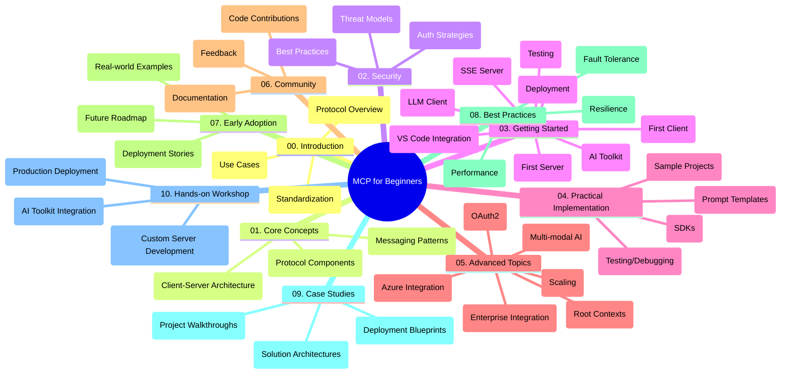

<!--
CO_OP_TRANSLATOR_METADATA:
{
  "original_hash": "a607d4febc94caee9a12b77795f7fc9a",
  "translation_date": "2025-06-11T16:44:36+00:00",
  "source_file": "study_guide.md",
  "language_code": "th"
}
-->
# Model Context Protocol (MCP) for Beginners - Study Guide

คู่มือการศึกษานี้ให้ภาพรวมของโครงสร้างและเนื้อหาของรีโพซิทอรีสำหรับหลักสูตร "Model Context Protocol (MCP) for Beginners" ใช้คู่มือนี้เพื่อช่วยนำทางรีโพซิทอรีอย่างมีประสิทธิภาพและใช้ประโยชน์จากทรัพยากรที่มีอยู่ให้เต็มที่

## Repository Overview

Model Context Protocol (MCP) คือกรอบมาตรฐานสำหรับการสื่อสารระหว่างโมเดล AI กับแอปพลิเคชันลูกค้า รีโพซิทอรีนี้มีหลักสูตรครบถ้วนพร้อมตัวอย่างโค้ดจริงในภาษา C#, Java, JavaScript, Python และ TypeScript ออกแบบมาสำหรับนักพัฒนา AI สถาปนิกระบบ และวิศวกรซอฟต์แวร์

## Visual Curriculum Map

## Repository Structure

รีโพซิทอรีถูกจัดแบ่งออกเป็นสิบส่วนหลัก แต่ละส่วนเน้นหัวข้อที่แตกต่างกันของ MCP:

1. **Introduction (00-Introduction/)**
   - ภาพรวมของ Model Context Protocol
   - ทำไมการมาตรฐานจึงสำคัญในกระบวนการ AI
   - กรณีการใช้งานและประโยชน์ในทางปฏิบัติ

2. **Core Concepts (01-CoreConcepts/)**
   - สถาปัตยกรรมลูกค้า-เซิร์ฟเวอร์
   - องค์ประกอบหลักของโปรโตคอล
   - รูปแบบการส่งข้อความใน MCP

3. **Security (02-Security/)**
   - ภัยคุกคามด้านความปลอดภัยในระบบที่ใช้ MCP
   - แนวทางปฏิบัติที่ดีที่สุดในการรักษาความปลอดภัยการใช้งาน
   - กลยุทธ์การตรวจสอบสิทธิ์และอนุญาต

4. **Getting Started (03-GettingStarted/)**
   - การตั้งค่าและกำหนดค่าสภาพแวดล้อม
   - การสร้างเซิร์ฟเวอร์และไคลเอนต์ MCP ขั้นพื้นฐาน
   - การผสานรวมกับแอปพลิเคชันที่มีอยู่
   - ส่วนย่อยสำหรับเซิร์ฟเวอร์ตัวแรก, ไคลเอนต์ตัวแรก, ไคลเอนต์ LLM, การรวมกับ VS Code, เซิร์ฟเวอร์ SSE, AI Toolkit, การทดสอบ และการนำไปใช้

5. **Practical Implementation (04-PracticalImplementation/)**
   - การใช้ SDK ในหลายภาษาโปรแกรม
   - เทคนิคการดีบัก, ทดสอบ และตรวจสอบความถูกต้อง
   - การสร้างเทมเพลตพรอมต์และเวิร์กโฟลว์ที่นำกลับมาใช้ใหม่ได้
   - ตัวอย่างโปรเจกต์พร้อมตัวอย่างการใช้งาน

6. **Advanced Topics (05-AdvancedTopics/)**
   - เวิร์กโฟลว์ AI แบบมัลติ-โหมดและความสามารถขยาย
   - กลยุทธ์การขยายขนาดอย่างปลอดภัย
   - MCP ในระบบนิเวศองค์กร
   - หัวข้อเฉพาะทางรวมถึงการรวม Azure, มัลติ-โมดัล, OAuth2, root contexts, routing, sampling, scaling, security, การรวมเว็บเสิร์ช และการสตรีม

7. **Community Contributions (06-CommunityContributions/)**
   - วิธีการมีส่วนร่วมในโค้ดและเอกสาร
   - การร่วมมือผ่าน GitHub
   - การปรับปรุงและข้อเสนอแนะจากชุมชน

8. **Lessons from Early Adoption (07-LessonsfromEarlyAdoption/)**
   - การใช้งานจริงและเรื่องราวความสำเร็จ
   - การสร้างและนำโซลูชัน MCP ไปใช้
   - แนวโน้มและแผนที่ทางในอนาคต

9. **Best Practices (08-BestPractices/)**
   - การปรับแต่งประสิทธิภาพและการเพิ่มประสิทธิผล
   - การออกแบบระบบ MCP ที่ทนต่อความผิดพลาด
   - กลยุทธ์การทดสอบและความยืดหยุ่น

10. **Case Studies (09-CaseStudy/)**
    - การวิเคราะห์เชิงลึกของสถาปัตยกรรมโซลูชัน MCP
    - แผนผังการนำไปใช้และเคล็ดลับการผสานรวม
    - แผนภาพที่อธิบายและการเดินผ่านโปรเจกต์

11. **Hands-on Workshop (10-StreamliningAIWorkflowsBuildingAnMCPServerWithAIToolkit/)**
    - เวิร์กช็อปเชิงปฏิบัติที่ครอบคลุมโดยรวม MCP กับ AI Toolkit ของ Microsoft สำหรับ VS Code
    - การสร้างแอปพลิเคชันอัจฉริยะที่เชื่อมต่อโมเดล AI กับเครื่องมือในโลกจริง
    - โมดูลปฏิบัติที่ครอบคลุมพื้นฐาน การพัฒนาเซิร์ฟเวอร์แบบกำหนดเอง และกลยุทธ์การนำไปใช้ในสภาพแวดล้อมจริง

## Sample Projects

รีโพซิทอรีนี้มีตัวอย่างโปรเจกต์หลายรายการที่แสดงการใช้งาน MCP ในหลายภาษาโปรแกรม:

### Basic MCP Calculator Samples
- ตัวอย่างเซิร์ฟเวอร์ MCP ด้วย C#
- MCP Calculator ด้วย Java
- ตัวอย่าง MCP ด้วย JavaScript
- เซิร์ฟเวอร์ MCP ด้วย Python
- ตัวอย่าง MCP ด้วย TypeScript

### Advanced MCP Calculator Projects
- ตัวอย่างขั้นสูงด้วย C#
- ตัวอย่างแอปคอนเทนเนอร์ด้วย Java
- ตัวอย่างขั้นสูงด้วย JavaScript
- การใช้งานซับซ้อนด้วย Python
- ตัวอย่างคอนเทนเนอร์ด้วย TypeScript

## Additional Resources

รีโพซิทอรีนี้มีทรัพยากรสนับสนุนดังนี้:

- **โฟลเดอร์ Images**: รวมแผนภาพและภาพประกอบที่ใช้ในหลักสูตร
- **Translations**: การรองรับหลายภาษาโดยแปลเอกสารอัตโนมัติ
- **Official MCP Resources**:
  - [MCP Documentation](https://modelcontextprotocol.io/)
  - [MCP Specification](https://spec.modelcontextprotocol.io/)
  - [MCP GitHub Repository](https://github.com/modelcontextprotocol)

## How to Use This Repository

1. **เรียนรู้ตามลำดับ**: ติดตามบทต่างๆ ตามลำดับ (00 ถึง 10) เพื่อประสบการณ์การเรียนรู้ที่เป็นระบบ
2. **เน้นภาษาที่สนใจ**: หากสนใจภาษาโปรแกรมใดเป็นพิเศษ ให้สำรวจโฟลเดอร์ตัวอย่างสำหรับการใช้งานในภาษานั้น
3. **การใช้งานจริง**: เริ่มจากส่วน "Getting Started" เพื่อตั้งค่าสภาพแวดล้อมและสร้างเซิร์ฟเวอร์กับไคลเอนต์ MCP ตัวแรกของคุณ
4. **สำรวจขั้นสูง**: เมื่อเข้าใจพื้นฐานแล้ว ให้เจาะลึกหัวข้อขั้นสูงเพื่อขยายความรู้
5. **มีส่วนร่วมกับชุมชน**: เข้าร่วม [Azure AI Foundry Discord](https://discord.com/invite/ByRwuEEgH4) เพื่อเชื่อมต่อกับผู้เชี่ยวชาญและนักพัฒนาร่วมกัน

## Contributing

รีโพซิทอรีนี้ยินดีรับการมีส่วนร่วมจากชุมชน ดูส่วน Community Contributions เพื่อคำแนะนำเกี่ยวกับวิธีการมีส่วนร่วม

---

*คู่มือการศึกษานี้จัดทำขึ้นเมื่อวันที่ 11 มิถุนายน 2025 และให้ภาพรวมของรีโพซิทอรี ณ วันนั้น เนื้อหาในรีโพซิทอรีอาจมีการอัปเดตตั้งแต่นั้นมา*

**ข้อจำกัดความรับผิดชอบ**:  
เอกสารฉบับนี้ได้รับการแปลโดยใช้บริการแปลภาษา AI [Co-op Translator](https://github.com/Azure/co-op-translator) แม้เราจะพยายามให้ความถูกต้องสูงสุด แต่โปรดทราบว่าการแปลโดยอัตโนมัติอาจมีข้อผิดพลาดหรือความไม่ถูกต้อง เอกสารต้นฉบับในภาษาดั้งเดิมควรถูกพิจารณาเป็นแหล่งข้อมูลที่เชื่อถือได้ สำหรับข้อมูลสำคัญแนะนำให้ใช้บริการแปลโดยมนุษย์มืออาชีพ เราจะไม่รับผิดชอบต่อความเข้าใจผิดหรือการตีความที่ผิดพลาดใด ๆ ที่เกิดจากการใช้การแปลนี้