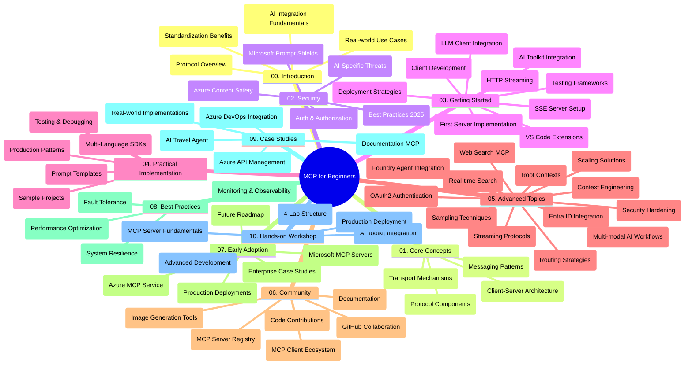

<!--
CO_OP_TRANSLATOR_METADATA:
{
  "original_hash": "e2c6ed897fa98fa08e0146101776c7ff",
  "translation_date": "2025-07-18T09:53:03+00:00",
  "source_file": "study_guide.md",
  "language_code": "th"
}
-->
# Model Context Protocol (MCP) สำหรับผู้เริ่มต้น - คู่มือการศึกษา

คู่มือการศึกษานี้ให้ภาพรวมของโครงสร้างและเนื้อหาของรีโพซิทอรีสำหรับหลักสูตร "Model Context Protocol (MCP) สำหรับผู้เริ่มต้น" ใช้คู่มือนี้เพื่อช่วยนำทางรีโพซิทอรีอย่างมีประสิทธิภาพและใช้ประโยชน์จากทรัพยากรที่มีอยู่ให้เต็มที่

## ภาพรวมรีโพซิทอรี

Model Context Protocol (MCP) คือกรอบงานมาตรฐานสำหรับการโต้ตอบระหว่างโมเดล AI กับแอปพลิเคชันของลูกค้า สร้างขึ้นครั้งแรกโดย Anthropic ปัจจุบัน MCP ได้รับการดูแลโดยชุมชน MCP ผ่านองค์กร GitHub อย่างเป็นทางการ รีโพซิทอรีนี้นำเสนอหลักสูตรครบถ้วนพร้อมตัวอย่างโค้ดจริงในภาษา C#, Java, JavaScript, Python และ TypeScript ออกแบบมาสำหรับนักพัฒนา AI สถาปนิกระบบ และวิศวกรซอฟต์แวร์

## แผนที่หลักสูตรแบบภาพ

## โครงสร้างรีโพซิทอรี

รีโพซิทอรีนี้จัดแบ่งออกเป็นสิบส่วนหลัก โดยแต่ละส่วนเน้นเรื่องต่าง ๆ ของ MCP ดังนี้:

1. **บทนำ (00-Introduction/)**
   - ภาพรวมของ Model Context Protocol
   - เหตุผลที่การมาตรฐานมีความสำคัญในกระบวนการ AI
   - กรณีใช้งานจริงและประโยชน์

2. **แนวคิดหลัก (01-CoreConcepts/)**
   - สถาปัตยกรรมแบบไคลเอนต์-เซิร์ฟเวอร์
   - องค์ประกอบสำคัญของโปรโตคอล
   - รูปแบบการส่งข้อความใน MCP

3. **ความปลอดภัย (02-Security/)**
   - ภัยคุกคามด้านความปลอดภัยในระบบที่ใช้ MCP
   - แนวทางปฏิบัติที่ดีที่สุดในการรักษาความปลอดภัย
   - กลยุทธ์การตรวจสอบสิทธิ์และการอนุญาต
   - **เอกสารความปลอดภัยครบถ้วน**:
     - MCP Security Best Practices 2025
     - Azure Content Safety Implementation Guide
     - MCP Security Controls and Techniques
     - MCP Best Practices Quick Reference
   - **หัวข้อความปลอดภัยสำคัญ**:
     - การโจมตีแบบ prompt injection และ tool poisoning
     - การแฮ็กเซสชันและปัญหา confused deputy
     - ช่องโหว่ token passthrough
     - สิทธิ์เกินจำเป็นและการควบคุมการเข้าถึง
     - ความปลอดภัยในห่วงโซ่อุปทานของส่วนประกอบ AI
     - การผสาน Microsoft Prompt Shields

4. **เริ่มต้นใช้งาน (03-GettingStarted/)**
   - การตั้งค่าและกำหนดค่าสภาพแวดล้อม
   - การสร้างเซิร์ฟเวอร์และไคลเอนต์ MCP เบื้องต้น
   - การผสานรวมกับแอปพลิเคชันที่มีอยู่
   - รวมถึงส่วนต่าง ๆ สำหรับ:
     - การสร้างเซิร์ฟเวอร์ตัวแรก
     - การพัฒนาไคลเอนต์
     - การผสาน LLM client
     - การผสาน VS Code
     - เซิร์ฟเวอร์ Server-Sent Events (SSE)
     - การสตรีม HTTP
     - การผสาน AI Toolkit
     - กลยุทธ์การทดสอบ
     - แนวทางการปรับใช้

5. **การใช้งานจริง (04-PracticalImplementation/)**
   - การใช้ SDK ในหลายภาษาโปรแกรม
   - เทคนิคการดีบัก ทดสอบ และตรวจสอบความถูกต้อง
   - การสร้างเทมเพลต prompt และเวิร์กโฟลว์ที่นำกลับมาใช้ใหม่ได้
   - โครงการตัวอย่างพร้อมตัวอย่างการใช้งาน

6. **หัวข้อขั้นสูง (05-AdvancedTopics/)**
   - เทคนิคการออกแบบบริบท (context engineering)
   - การผสาน Foundry agent
   - เวิร์กโฟลว์ AI แบบมัลติ-โหมด
   - ตัวอย่างการตรวจสอบสิทธิ์ OAuth2
   - ความสามารถในการค้นหาแบบเรียลไทม์
   - การสตรีมแบบเรียลไทม์
   - การใช้งาน root contexts
   - กลยุทธ์การกำหนดเส้นทาง (routing)
   - เทคนิคการสุ่มตัวอย่าง (sampling)
   - วิธีการขยายระบบ (scaling)
   - ข้อควรพิจารณาด้านความปลอดภัย
   - การผสาน Entra ID ด้านความปลอดภัย
   - การผสานการค้นหาบนเว็บ

7. **การมีส่วนร่วมของชุมชน (06-CommunityContributions/)**
   - วิธีการมีส่วนร่วมในการเขียนโค้ดและเอกสาร
   - การทำงานร่วมกันผ่าน GitHub
   - การปรับปรุงและข้อเสนอแนะจากชุมชน
   - การใช้ไคลเอนต์ MCP ต่าง ๆ (Claude Desktop, Cline, VSCode)
   - การทำงานกับเซิร์ฟเวอร์ MCP ยอดนิยมรวมถึงการสร้างภาพ

8. **บทเรียนจากการนำไปใช้ในช่วงแรก (07-LessonsfromEarlyAdoption/)**
   - การใช้งานจริงและเรื่องราวความสำเร็จ
   - การสร้างและปรับใช้โซลูชันที่ใช้ MCP
   - แนวโน้มและแผนงานในอนาคต
   - **คู่มือเซิร์ฟเวอร์ Microsoft MCP**: คู่มือครบถ้วนสำหรับ 10 เซิร์ฟเวอร์ Microsoft MCP ที่พร้อมใช้งานในผลิตภัณฑ์ รวมถึง:
     - Microsoft Learn Docs MCP Server
     - Azure MCP Server (ตัวเชื่อมต่อเฉพาะกว่า 15 ตัว)
     - GitHub MCP Server
     - Azure DevOps MCP Server
     - MarkItDown MCP Server
     - SQL Server MCP Server
     - Playwright MCP Server
     - Dev Box MCP Server
     - Azure AI Foundry MCP Server
     - Microsoft 365 Agents Toolkit MCP Server

9. **แนวทางปฏิบัติที่ดีที่สุด (08-BestPractices/)**
   - การปรับแต่งและเพิ่มประสิทธิภาพ
   - การออกแบบระบบ MCP ที่ทนทานต่อความผิดพลาด
   - กลยุทธ์การทดสอบและความยืดหยุ่น

10. **กรณีศึกษา (09-CaseStudy/)**
    - ตัวอย่างการผสาน Azure API Management
    - ตัวอย่างการใช้งานตัวแทนท่องเที่ยว
    - การผสาน Azure DevOps กับการอัปเดต YouTube
    - ตัวอย่างการใช้งาน MCP ในเอกสาร
    - ตัวอย่างการใช้งานพร้อมเอกสารรายละเอียด

11. **เวิร์กช็อปเชิงปฏิบัติ (10-StreamliningAIWorkflowsBuildingAnMCPServerWithAIToolkit/)**
    - เวิร์กช็อปเชิงปฏิบัติครบวงจรที่ผสาน MCP กับ AI Toolkit
    - การสร้างแอปพลิเคชันอัจฉริยะที่เชื่อมต่อโมเดล AI กับเครื่องมือในโลกจริง
    - โมดูลปฏิบัติที่ครอบคลุมพื้นฐาน การพัฒนาเซิร์ฟเวอร์แบบกำหนดเอง และกลยุทธ์การปรับใช้ในผลิตภัณฑ์
    - **โครงสร้างห้องปฏิบัติการ**:
      - ห้องปฏิบัติการ 1: พื้นฐานเซิร์ฟเวอร์ MCP
      - ห้องปฏิบัติการ 2: การพัฒนาเซิร์ฟเวอร์ MCP ขั้นสูง
      - ห้องปฏิบัติการ 3: การผสาน AI Toolkit
      - ห้องปฏิบัติการ 4: การปรับใช้และการขยายระบบในผลิตภัณฑ์
    - วิธีการเรียนรู้แบบห้องปฏิบัติการพร้อมคำแนะนำทีละขั้นตอน

## แหล่งข้อมูลเพิ่มเติม

รีโพซิทอรีนี้มีทรัพยากรสนับสนุนดังนี้:

- **โฟลเดอร์รูปภาพ**: รวมแผนภาพและภาพประกอบที่ใช้ในหลักสูตร
- **การแปลภาษา**: รองรับหลายภาษาโดยมีการแปลเอกสารอัตโนมัติ
- **แหล่งข้อมูล MCP อย่างเป็นทางการ**:
  - [MCP Documentation](https://modelcontextprotocol.io/)
  - [MCP Specification](https://spec.modelcontextprotocol.io/)
  - [MCP GitHub Repository](https://github.com/modelcontextprotocol)

## วิธีใช้รีโพซิทอรีนี้

1. **เรียนรู้ตามลำดับ**: ติดตามบทเรียนตั้งแต่ 00 ถึง 10 เพื่อประสบการณ์การเรียนรู้ที่เป็นระบบ
2. **เน้นภาษาที่สนใจ**: หากสนใจภาษาโปรแกรมใดเป็นพิเศษ ให้สำรวจโฟลเดอร์ตัวอย่างสำหรับการใช้งานในภาษานั้น
3. **การใช้งานจริง**: เริ่มจากส่วน "เริ่มต้นใช้งาน" เพื่อเตรียมสภาพแวดล้อมและสร้างเซิร์ฟเวอร์และไคลเอนต์ MCP ตัวแรกของคุณ
4. **สำรวจขั้นสูง**: เมื่อเข้าใจพื้นฐานแล้ว ให้เจาะลึกหัวข้อขั้นสูงเพื่อขยายความรู้
5. **เข้าร่วมชุมชน**: ร่วมชุมชน MCP ผ่านการสนทนาใน GitHub และช่องทาง Discord เพื่อเชื่อมต่อกับผู้เชี่ยวชาญและนักพัฒนาร่วมกัน

## ไคลเอนต์และเครื่องมือ MCP

หลักสูตรครอบคลุมไคลเอนต์และเครื่องมือ MCP ต่าง ๆ ดังนี้:

1. **ไคลเอนต์อย่างเป็นทางการ**:
   - Visual Studio Code
   - MCP ใน Visual Studio Code
   - Claude Desktop
   - Claude ใน VSCode
   - Claude API

2. **ไคลเอนต์จากชุมชน**:
   - Cline (แบบเทอร์มินัล)
   - Cursor (ตัวแก้ไขโค้ด)
   - ChatMCP
   - Windsurf

3. **เครื่องมือจัดการ MCP**:
   - MCP CLI
   - MCP Manager
   - MCP Linker
   - MCP Router

## เซิร์ฟเวอร์ MCP ยอดนิยม

รีโพซิทอรีนี้แนะนำเซิร์ฟเวอร์ MCP หลากหลายประเภท รวมถึง:

1. **เซิร์ฟเวอร์ Microsoft MCP อย่างเป็นทางการ**:
   - Microsoft Learn Docs MCP Server
   - Azure MCP Server (ตัวเชื่อมต่อเฉพาะกว่า 15 ตัว)
   - GitHub MCP Server
   - Azure DevOps MCP Server
   - MarkItDown MCP Server
   - SQL Server MCP Server
   - Playwright MCP Server
   - Dev Box MCP Server
   - Azure AI Foundry MCP Server
   - Microsoft 365 Agents Toolkit MCP Server

2. **เซิร์ฟเวอร์อ้างอิงอย่างเป็นทางการ**:
   - Filesystem
   - Fetch
   - Memory
   - Sequential Thinking

3. **การสร้างภาพ**:
   - Azure OpenAI DALL-E 3
   - Stable Diffusion WebUI
   - Replicate

4. **เครื่องมือพัฒนา**:
   - Git MCP
   - Terminal Control
   - Code Assistant

5. **เซิร์ฟเวอร์เฉพาะทาง**:
   - Salesforce
   - Microsoft Teams
   - Jira & Confluence

## การมีส่วนร่วม

รีโพซิทอรีนี้ยินดีต้อนรับการมีส่วนร่วมจากชุมชน ดูส่วน การมีส่วนร่วมของชุมชน เพื่อคำแนะนำเกี่ยวกับวิธีการมีส่วนร่วมอย่างมีประสิทธิภาพในระบบนิเวศ MCP

## ประวัติการเปลี่ยนแปลง

| วันที่ | การเปลี่ยนแปลง |
|--------|-----------------|
| 18 กรกฎาคม 2025 | - ปรับโครงสร้างรีโพซิทอรีเพื่อรวมคู่มือเซิร์ฟเวอร์ Microsoft MCP - เพิ่มรายการครบถ้วนของ 10 เซิร์ฟเวอร์ Microsoft MCP ที่พร้อมใช้งานในผลิตภัณฑ์ - ปรับปรุงส่วนเซิร์ฟเวอร์ MCP ยอดนิยมด้วยเซิร์ฟเวอร์ Microsoft MCP อย่างเป็นทางการ - อัปเดตส่วนกรณีศึกษาด้วยตัวอย่างไฟล์จริง - เพิ่มรายละเอียดโครงสร้างห้องปฏิบัติการสำหรับเวิร์กช็อปเชิงปฏิบัติ |
| 16 กรกฎาคม 2025 | - ปรับโครงสร้างรีโพซิทอรีให้สอดคล้องกับเนื้อหาปัจจุบัน - เพิ่มส่วนไคลเอนต์และเครื่องมือ MCP - เพิ่มส่วนเซิร์ฟเวอร์ MCP ยอดนิยม - อัปเดตแผนที่หลักสูตรแบบภาพด้วยหัวข้อทั้งหมดในปัจจุบัน - ขยายส่วนหัวข้อขั้นสูงด้วยพื้นที่เฉพาะทางทั้งหมด - อัปเดตกรณีศึกษาให้สอดคล้องกับตัวอย่างจริง - ชี้แจงที่มาของ MCP ว่าถูกสร้างโดย Anthropic |
| 11 มิถุนายน 2025 | - สร้างคู่มือการศึกษาเบื้องต้น - เพิ่มแผนที่หลักสูตรแบบภาพ - สรุปโครงสร้างรีโพซิทอรี - รวมโครงการตัวอย่างและแหล่งข้อมูลเพิ่มเติม |

---

*คู่มือการศึกษานี้ได้รับการอัปเดตเมื่อวันที่ 18 กรกฎาคม 2025 และให้ภาพรวมของรีโพซิทอรี ณ วันที่ดังกล่าว เนื้อหาในรีโพซิทอรีอาจมีการอัปเดตหลังจากวันนั้น*

**ข้อจำกัดความรับผิดชอบ**:  
เอกสารนี้ได้รับการแปลโดยใช้บริการแปลภาษาอัตโนมัติ [Co-op Translator](https://github.com/Azure/co-op-translator) แม้เราจะพยายามให้ความถูกต้องสูงสุด แต่โปรดทราบว่าการแปลอัตโนมัติอาจมีข้อผิดพลาดหรือความไม่ถูกต้อง เอกสารต้นฉบับในภาษาต้นทางถือเป็นแหล่งข้อมูลที่เชื่อถือได้ สำหรับข้อมูลที่สำคัญ ขอแนะนำให้ใช้บริการแปลโดยผู้เชี่ยวชาญมนุษย์ เราไม่รับผิดชอบต่อความเข้าใจผิดหรือการตีความผิดใด ๆ ที่เกิดจากการใช้การแปลนี้